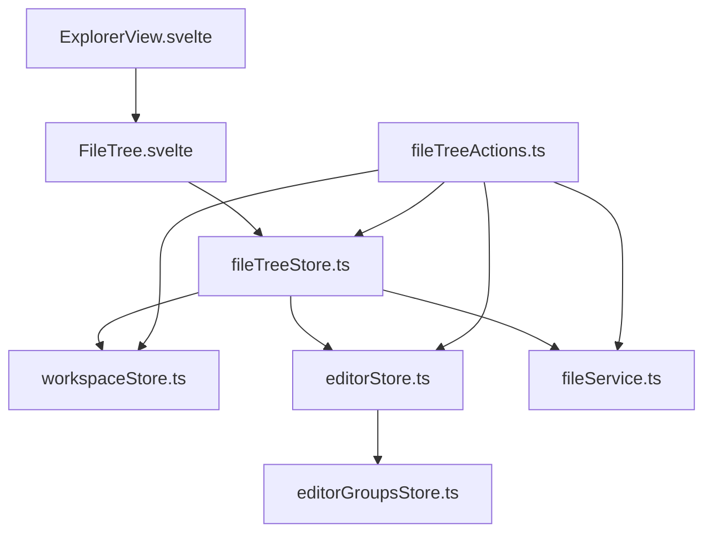
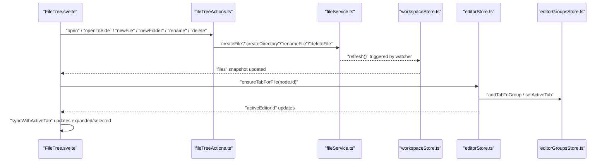
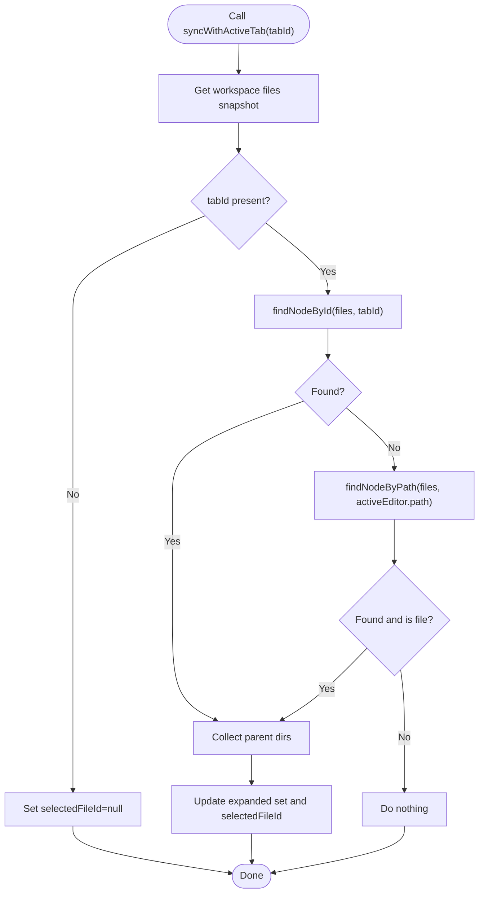
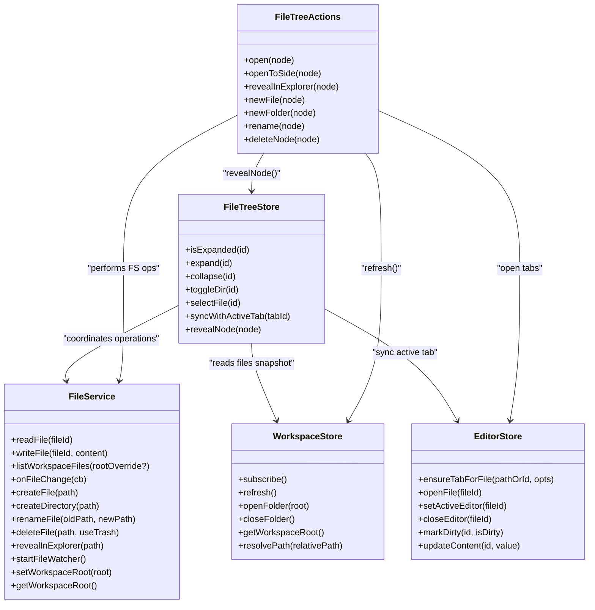
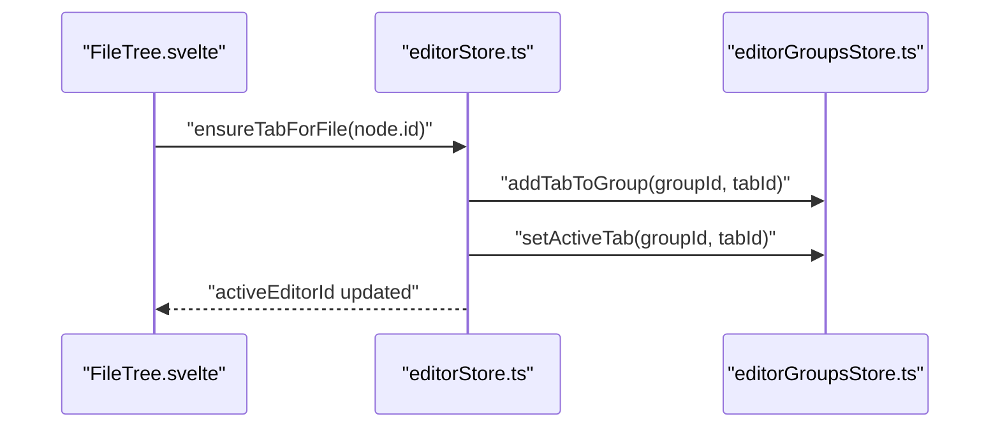
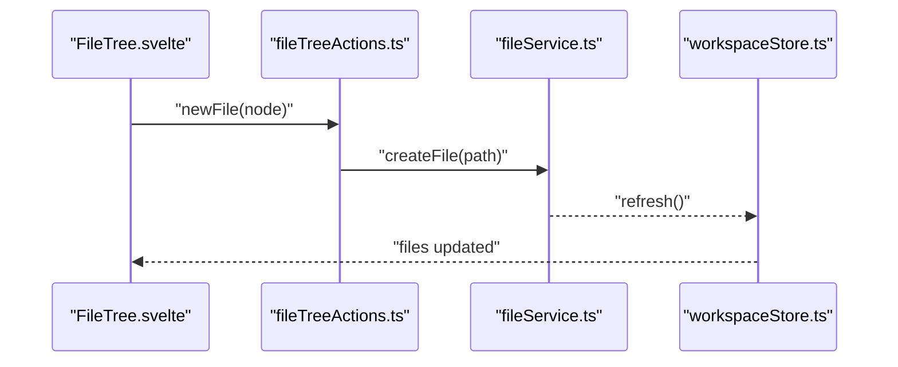
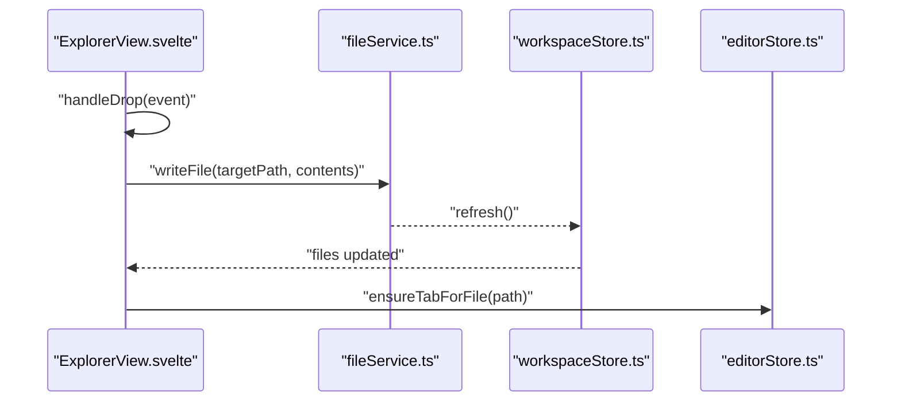

# File Tree Store

<cite>
**Referenced Files in This Document**
- [fileTreeStore.ts](file://src/lib/stores/fileTreeStore.ts)
- [fileNode.ts](file://src/lib/types/fileNode.ts)
- [fileService.ts](file://src/lib/services/fileService.ts)
- [workspaceStore.ts](file://src/lib/stores/workspaceStore.ts)
- [editorStore.ts](file://src/lib/stores/editorStore.ts)
- [fileTreeActions.ts](file://src/lib/sidebar/fileTreeActions.ts)
- [ExplorerView.svelte](file://src/lib/sidebar/ExplorerView.svelte)
- [FileTree.svelte](file://src/lib/sidebar/FileTree.svelte)
- [editorGroupsStore.ts](file://src/lib/stores/layout/editorGroupsStore.ts)
</cite>

## Table of Contents
1. [Introduction](#introduction)
2. [Project Structure](#project-structure)
3. [Core Components](#core-components)
4. [Architecture Overview](#architecture-overview)
5. [Detailed Component Analysis](#detailed-component-analysis)
6. [Dependency Analysis](#dependency-analysis)
7. [Performance Considerations](#performance-considerations)
8. [Troubleshooting Guide](#troubleshooting-guide)
9. [Conclusion](#conclusion)
10. [Appendices](#appendices)

## Introduction
This document describes the fileTreeStore, which manages the UI state of the file explorer in NC. It tracks expanded/collapsed directories, the currently selected file, and synchronizes selection with the active editor tab. It also coordinates with workspaceStore to reflect the current workspace and with editorStore to open files in editor tabs. The store uses the FileNode type to represent file system entities and integrates with fileService for backend-driven file operations. The documentation covers creation, renaming, deletion, expansion/collapse, drag-and-drop handling, event synchronization, and performance considerations for large trees.

## Project Structure
The file tree subsystem is composed of:
- UI state store: fileTreeStore
- Data model: FileNode
- Backend coordination: fileService
- Workspace state: workspaceStore
- Editor integration: editorStore and editorGroupsStore
- UI components: ExplorerView.svelte and FileTree.svelte
- Actions: fileTreeActions.ts

**Diagram sources**
- [ExplorerView.svelte](file://src/lib/sidebar/ExplorerView.svelte#L1-L132)
- [FileTree.svelte](file://src/lib/sidebar/FileTree.svelte#L1-L184)
- [fileTreeStore.ts](file://src/lib/stores/fileTreeStore.ts#L1-L290)
- [workspaceStore.ts](file://src/lib/stores/workspaceStore.ts#L1-L130)
- [editorStore.ts](file://src/lib/stores/editorStore.ts#L1-L381)
- [fileTreeActions.ts](file://src/lib/sidebar/fileTreeActions.ts#L1-L135)
- [fileService.ts](file://src/lib/services/fileService.ts#L1-L85)
- [editorGroupsStore.ts](file://src/lib/stores/layout/editorGroupsStore.ts#L1-L413)

**Section sources**
- [fileTreeStore.ts](file://src/lib/stores/fileTreeStore.ts#L1-L290)
- [fileNode.ts](file://src/lib/types/fileNode.ts#L1-L19)
- [fileService.ts](file://src/lib/services/fileService.ts#L1-L85)
- [workspaceStore.ts](file://src/lib/stores/workspaceStore.ts#L1-L130)
- [editorStore.ts](file://src/lib/stores/editorStore.ts#L1-L381)
- [fileTreeActions.ts](file://src/lib/sidebar/fileTreeActions.ts#L1-L135)
- [ExplorerView.svelte](file://src/lib/sidebar/ExplorerView.svelte#L1-L132)
- [FileTree.svelte](file://src/lib/sidebar/FileTree.svelte#L1-L184)
- [editorGroupsStore.ts](file://src/lib/stores/layout/editorGroupsStore.ts#L1-L413)

## Core Components
- fileTreeStore: Maintains expanded directories and selected file id; exposes helpers to expand/collapse, select, and synchronize with the active editor tab.
- FileNode: Defines the shape of file system entries used across stores and UI.
- fileService: Provides asynchronous operations for reading/writing files, listing workspace files, watching file changes, and revealing items in the OS explorer.
- workspaceStore: Holds the workspace tree snapshot, loading/error state, and root path; listens to backend file change events and refreshes the tree.
- editorStore: Manages editor tabs and active tab; integrates with fileTreeStore to keep selection in sync with the active tab.
- fileTreeActions: Implements UI actions (open, open to side, reveal in explorer, new file/folder, rename, delete) and coordinates with fileService and workspaceStore.
- ExplorerView.svelte: Subscribes to active editor and workspace to keep the tree synchronized; handles drag-and-drop of external files into the workspace.
- FileTree.svelte: Renders the recursive tree UI, toggles expansion, selects files, and dispatches open events; integrates with fileTreeActions.

**Section sources**
- [fileTreeStore.ts](file://src/lib/stores/fileTreeStore.ts#L1-L290)
- [fileNode.ts](file://src/lib/types/fileNode.ts#L1-L19)
- [fileService.ts](file://src/lib/services/fileService.ts#L1-L85)
- [workspaceStore.ts](file://src/lib/stores/workspaceStore.ts#L1-L130)
- [editorStore.ts](file://src/lib/stores/editorStore.ts#L1-L381)
- [fileTreeActions.ts](file://src/lib/sidebar/fileTreeActions.ts#L1-L135)
- [ExplorerView.svelte](file://src/lib/sidebar/ExplorerView.svelte#L1-L132)
- [FileTree.svelte](file://src/lib/sidebar/FileTree.svelte#L1-L184)

## Architecture Overview
The file tree subsystem follows a layered architecture:
- Data layer: FileNode and workspaceStore provide the workspace tree snapshot.
- UI state layer: fileTreeStore manages UI-only state (expanded/collapsed, selection).
- Action layer: fileTreeActions orchestrates operations via fileService and workspaceStore.
- Integration layer: editorStore keeps tabs and active tab in sync with the tree; editorGroupsStore manages tab grouping.
- Presentation layer: ExplorerView.svelte and FileTree.svelte render the tree and handle user interactions.

**Diagram sources**
- [FileTree.svelte](file://src/lib/sidebar/FileTree.svelte#L1-L184)
- [fileTreeActions.ts](file://src/lib/sidebar/fileTreeActions.ts#L1-L135)
- [fileService.ts](file://src/lib/services/fileService.ts#L1-L85)
- [workspaceStore.ts](file://src/lib/stores/workspaceStore.ts#L1-L130)
- [editorStore.ts](file://src/lib/stores/editorStore.ts#L1-L381)
- [editorGroupsStore.ts](file://src/lib/stores/layout/editorGroupsStore.ts#L1-L413)

## Detailed Component Analysis

### fileTreeStore
Responsibilities:
- Track expanded directories via a Set of ids.
- Track selected file id.
- Provide helpers to expand/collapse/toggle directories.
- Select files by id.
- Synchronize selection and expanded state with the active editor tab.
- Reveal a given node by expanding its ancestors and selecting it.

Key APIs:
- isExpanded(id): Check if a directory id is expanded.
- expand(id), collapse(id), toggleDir(id): Control directory expansion.
- selectFile(id): Select a file by id.
- syncWithActiveTab(tabId): Align selection and expanded state with the active editor tab.
- revealNode(node): Expand ancestors and select a node.

Internals:
- Uses workspaceStore snapshot to locate nodes by id or path.
- Uses a recursive search to find nodes and collect parent directories.
- Normalizes paths to support cross-platform comparisons.

Integration points:
- Depends on workspaceStore for the current files snapshot.
- Depends on editorStore/activeEditor for active tab synchronization.

**Diagram sources**
- [fileTreeStore.ts](file://src/lib/stores/fileTreeStore.ts#L1-L290)

**Section sources**
- [fileTreeStore.ts](file://src/lib/stores/fileTreeStore.ts#L1-L290)

### FileNode type
Defines the structure of file system entries:
- id: Unique identifier for the node.
- name: Display name.
- path: Full path string.
- type: "file" or "dir".
- size?: Optional size metadata.
- modified?: Optional timestamp metadata.
- children?: Optional child nodes for directories.

Complexity:
- Recursive traversal is linear in the number of nodes visited.

**Section sources**
- [fileNode.ts](file://src/lib/types/fileNode.ts#L1-L19)

### fileService
Provides asynchronous operations:
- readFile(fileId), writeFile(fileId, content)
- listWorkspaceFiles(rootOverride?)
- onFileChange(cb): Subscribe to file change events.
- createFile(path), createDirectory(path), renameFile(oldPath, newPath), deleteFile(path, useTrash)
- revealInExplorer(path)
- startFileWatcher()
- setWorkspaceRoot(root), getWorkspaceRoot()

Integration:
- Emits file-changed events consumed by workspaceStore to refresh the tree.

**Section sources**
- [fileService.ts](file://src/lib/services/fileService.ts#L1-L85)

### workspaceStore
Maintains workspace state:
- name, files, loading, error, root
- Loads files via fileService.listWorkspaceFiles
- Starts file watcher and subscribes to file-change events to refresh
- Exposes refresh(), openFolder(root), closeFolder(), getWorkspaceRoot(), resolvePath(relativePath)

Synchronization:
- ExplorerView subscribes to workspaceStore and triggers syncWithActiveTab when files are loaded and an active editor exists.

**Section sources**
- [workspaceStore.ts](file://src/lib/stores/workspaceStore.ts#L1-L130)
- [ExplorerView.svelte](file://src/lib/sidebar/ExplorerView.svelte#L1-L132)

### editorStore and editorGroupsStore
editorStore:
- Manages EditorTab list and activeEditorId.
- ensureTabForFile(pathOrId, opts?): Creates or activates a tab for a file; integrates with editorGroupsStore.
- openFile(fileId), openSettings(), setActiveEditor(fileId), closeEditor(fileId), markDirty(id, isDirty), updateContent(id, value)

editorGroupsStore:
- Manages editor groups and tab ordering; addTabToGroup, removeTab, setActiveTab, moveTabToGroup, splitRightFromActive, etc.

Integration with fileTreeStore:
- FileTree.svelte calls editorStore.ensureTabForFile to open files in tabs.
- fileTreeActions.open/openToSide coordinate with editorStore and editorGroupsStore.

**Section sources**
- [editorStore.ts](file://src/lib/stores/editorStore.ts#L1-L381)
- [editorGroupsStore.ts](file://src/lib/stores/layout/editorGroupsStore.ts#L1-L413)

### fileTreeActions
Implements UI actions:
- open(node): Opens a file in the editor.
- openToSide(node): Opens a file to the right (split).
- revealInExplorer(node): Reveals a file in the OS explorer and expands/reveals it in the tree.
- newFile(node): Creates a new file under the target directory and refreshes the workspace.
- newFolder(node): Creates a new directory and refreshes the workspace.
- rename(node): Prompts for a new name and renames the file/directory.
- deleteNode(node): Confirms trash vs delete and removes the node.

Error handling:
- Catches and alerts errors for each action.

**Section sources**
- [fileTreeActions.ts](file://src/lib/sidebar/fileTreeActions.ts#L1-L135)

### ExplorerView.svelte
- Subscribes to activeEditor and workspaceStore to keep the tree in sync.
- Handles drag-and-drop of files from the OS into the workspace:
  - Reads dropped files, writes them to the workspace root, refreshes workspace, and opens tabs for newly imported files.
- Provides Open Folder button to set the workspace root.

**Section sources**
- [ExplorerView.svelte](file://src/lib/sidebar/ExplorerView.svelte#L1-L132)

### FileTree.svelte
- Recursively renders FileNode tree.
- Expands/collapses directories on click; selects files and opens them in the editor.
- Dispatches an "open" event when a file is opened.
- Integrates with fileTreeActions for context menu actions.

**Section sources**
- [FileTree.svelte](file://src/lib/sidebar/FileTree.svelte#L1-L184)

## Dependency Analysis
The file tree store depends on:
- workspaceStore for the current files snapshot.
- editorStore/activeEditor for active tab synchronization.
- fileService for backend operations and file watchers.
- fileTreeActions for UI actions that modify the file system.

**Diagram sources**
- [fileTreeStore.ts](file://src/lib/stores/fileTreeStore.ts#L1-L290)
- [workspaceStore.ts](file://src/lib/stores/workspaceStore.ts#L1-L130)
- [editorStore.ts](file://src/lib/stores/editorStore.ts#L1-L381)
- [fileService.ts](file://src/lib/services/fileService.ts#L1-L85)
- [fileTreeActions.ts](file://src/lib/sidebar/fileTreeActions.ts#L1-L135)

**Section sources**
- [fileTreeStore.ts](file://src/lib/stores/fileTreeStore.ts#L1-L290)
- [workspaceStore.ts](file://src/lib/stores/workspaceStore.ts#L1-L130)
- [editorStore.ts](file://src/lib/stores/editorStore.ts#L1-L381)
- [fileService.ts](file://src/lib/services/fileService.ts#L1-L85)
- [fileTreeActions.ts](file://src/lib/sidebar/fileTreeActions.ts#L1-L135)

## Performance Considerations
- Large directory structures:
  - The current implementation does not implement lazy loading in fileTreeStore. Rendering the entire tree at once is acceptable for moderate sizes but may degrade with very large trees.
  - Recommendation: Introduce virtualization or lazy-loading of subtrees to render only visible nodes and load children on demand.
- Selection maintenance during updates:
  - fileTreeStore preserves selection by id; ensure ids remain stable across refreshes to avoid losing selection.
- Event-driven updates:
  - workspaceStore refreshes the tree on file changes; minimize unnecessary re-renders by debouncing refreshes and diffing changes when possible.
- Rendering optimization:
  - Use keyed lists and avoid deep reactivity churn in FileTree.svelte by keeping node identity stable.
- Concurrent modifications:
  - fileService operations are asynchronous; ensure UI updates are atomic and avoid race conditions by coordinating refreshes after each operation.

[No sources needed since this section provides general guidance]

## Troubleshooting Guide
Common issues and resolutions:
- Selection not updating:
  - Ensure ExplorerView.svelte subscribes to activeEditor and calls syncWithActiveTab when the active tab changes or when workspace files are loaded.
- Node not found when syncing:
  - fileTreeStore.searches by id first, then by path; if neither matches, selection remains unchanged. Verify node ids and paths.
- Drag-and-drop fails:
  - Confirm a workspace root is set; otherwise, drop handler prevents importing. Use Open Folder to set the root.
- File operations fail:
  - fileTreeActions catches and alerts errors; check backend permissions and paths.

**Section sources**
- [ExplorerView.svelte](file://src/lib/sidebar/ExplorerView.svelte#L1-L132)
- [fileTreeStore.ts](file://src/lib/stores/fileTreeStore.ts#L1-L290)
- [fileTreeActions.ts](file://src/lib/sidebar/fileTreeActions.ts#L1-L135)

## Conclusion
The fileTreeStore provides a focused UI state layer for the file explorer, cleanly separated from data and backend concerns. It integrates tightly with workspaceStore, editorStore, and fileService to keep the tree synchronized with the active editor, reflect backend changes, and enable user actions. For large-scale usage, consider adding virtualization and lazy-loading to improve performance and responsiveness.

[No sources needed since this section summarizes without analyzing specific files]

## Appendices

### API Reference: fileTreeStore
- isExpanded(id): boolean
- expand(id): void
- collapse(id): void
- toggleDir(id): void
- selectFile(id): void
- syncWithActiveTab(tabId): void
- revealNode(node): void

**Section sources**
- [fileTreeStore.ts](file://src/lib/stores/fileTreeStore.ts#L1-L290)

### Example Workflows

#### Opening a file in the editor

**Diagram sources**
- [FileTree.svelte](file://src/lib/sidebar/FileTree.svelte#L1-L184)
- [editorStore.ts](file://src/lib/stores/editorStore.ts#L1-L381)
- [editorGroupsStore.ts](file://src/lib/stores/layout/editorGroupsStore.ts#L1-L413)

#### Creating a new file

**Diagram sources**
- [FileTree.svelte](file://src/lib/sidebar/FileTree.svelte#L1-L184)
- [fileTreeActions.ts](file://src/lib/sidebar/fileTreeActions.ts#L1-L135)
- [fileService.ts](file://src/lib/services/fileService.ts#L1-L85)
- [workspaceStore.ts](file://src/lib/stores/workspaceStore.ts#L1-L130)

#### Drag-and-drop import

**Diagram sources**
- [ExplorerView.svelte](file://src/lib/sidebar/ExplorerView.svelte#L1-L132)
- [fileService.ts](file://src/lib/services/fileService.ts#L1-L85)
- [workspaceStore.ts](file://src/lib/stores/workspaceStore.ts#L1-L130)
- [editorStore.ts](file://src/lib/stores/editorStore.ts#L1-L381)