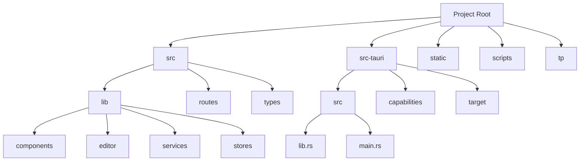
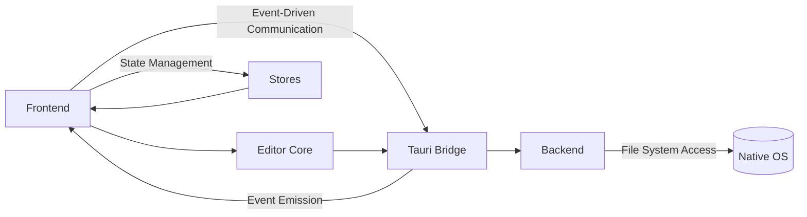
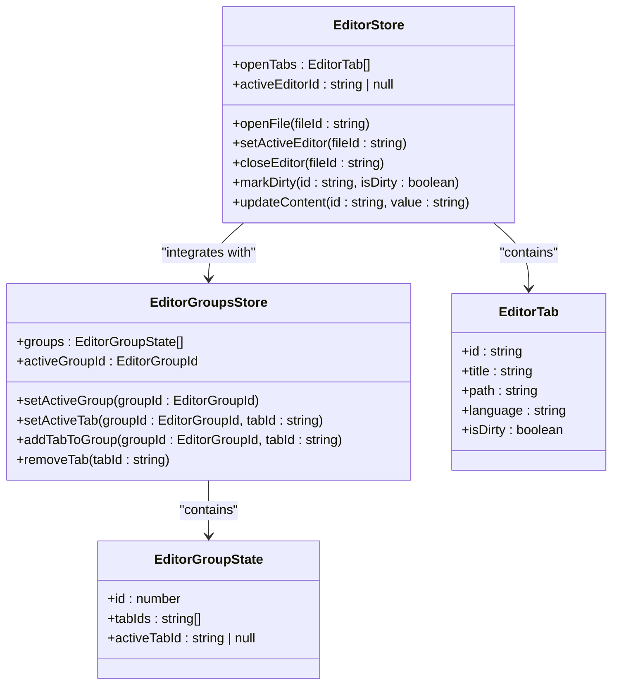
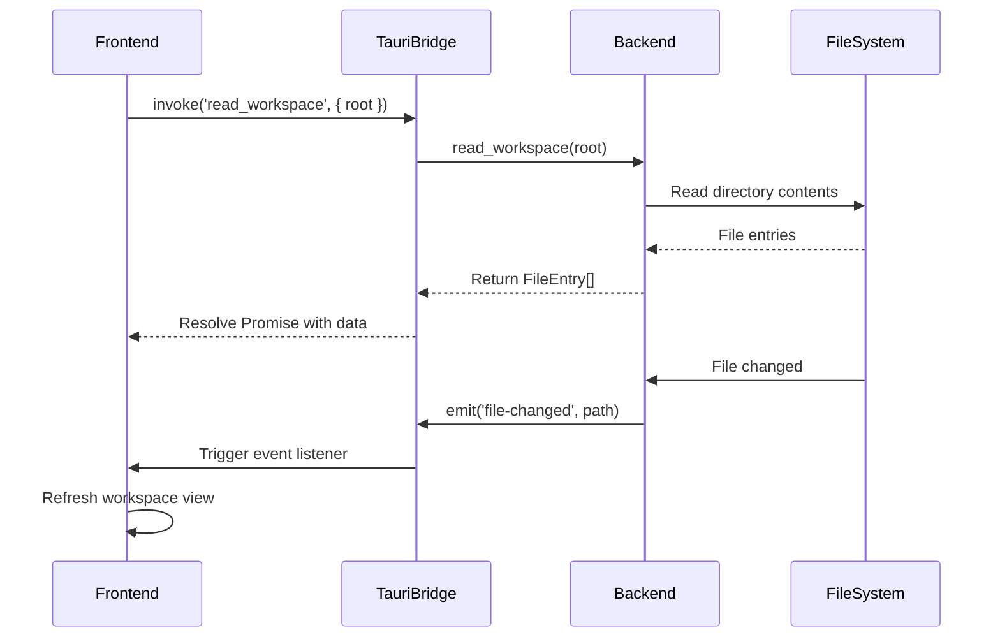
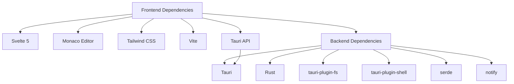

# Architecture Overview

<cite>
**Referenced Files in This Document**   
- [package.json](file://package.json)
- [Cargo.toml](file://src-tauri/Cargo.toml)
- [tauri.conf.json](file://src-tauri/tauri.conf.json)
- [editorStore.ts](file://src/lib/stores/editorStore.ts)
- [EditorCore.ts](file://src/lib/editor/EditorCore.ts)
- [workspaceStore.ts](file://src/lib/stores/workspaceStore.ts)
- [fileService.ts](file://src/lib/services/fileService.ts)
- [lib.rs](file://src-tauri/src/lib.rs)
- [main.rs](file://src-tauri/src/main.rs)
- [+layout.ts](file://src/routes/+layout.ts)
- [themeManager.ts](file://src/lib/editor/themeManager.ts)
- [languageSupport.ts](file://src/lib/editor/languageSupport.ts)
- [editorGroupsStore.ts](file://src/lib/stores/layout/editorGroupsStore.ts)
</cite>

## Table of Contents
1. [Introduction](#introduction)
2. [Project Structure](#project-structure)
3. [Core Components](#core-components)
4. [Architecture Overview](#architecture-overview)
5. [Detailed Component Analysis](#detailed-component-analysis)
6. [Dependency Analysis](#dependency-analysis)
7. [Performance Considerations](#performance-considerations)
8. [Troubleshooting Guide](#troubleshooting-guide)
9. [Conclusion](#conclusion)

## Introduction
Nova Code is a modern code editor that combines web technologies with native capabilities through the Tauri framework. The application follows a hybrid architecture that leverages the strengths of both web and native platforms. The system is designed with three main layers: a frontend built with Svelte 5, an editor core powered by Monaco Editor, and a backend implemented in Rust via Tauri. This architecture enables the editor to deliver a responsive, feature-rich experience while maintaining high performance and secure native access. The design emphasizes separation of concerns, reactivity, and extensibility, making it suitable for a wide range of development workflows.

## Project Structure
The Nova Code project follows a well-organized structure that separates concerns between frontend, backend, and shared components. The application is divided into three main directories: `src` for frontend code, `src-tauri` for backend Rust code, and `static` for static assets. The frontend uses Svelte 5 with a component-based architecture, while the backend leverages Rust's safety and performance characteristics. The project uses Vite as the build tool and Tauri for bridging web and native capabilities. Configuration files for both the frontend (package.json, vite.config.js) and backend (Cargo.toml, tauri.conf.json) are maintained separately, reflecting the hybrid nature of the application.



**Diagram sources**
- [package.json](file://package.json)
- [Cargo.toml](file://src-tauri/Cargo.toml)

**Section sources**
- [package.json](file://package.json)
- [Cargo.toml](file://src-tauri/Cargo.toml)

## Core Components
The Nova Code editor is built around several core components that work together to provide a seamless editing experience. The frontend is powered by Svelte 5, which provides a reactive programming model for building dynamic user interfaces. The editor core uses Monaco Editor, the same engine that powers Visual Studio Code, to provide advanced code editing capabilities including syntax highlighting, IntelliSense, and code navigation. The backend is implemented in Rust using the Tauri framework, which provides secure native access to file system operations and other system resources. State management is handled through a store pattern using Svelte's built-in store system, with specialized stores for editor state, workspace state, and UI settings.

**Section sources**
- [editorStore.ts](file://src/lib/stores/editorStore.ts)
- [EditorCore.ts](file://src/lib/editor/EditorCore.ts)
- [workspaceStore.ts](file://src/lib/stores/workspaceStore.ts)

## Architecture Overview
The Nova Code editor follows a layered architecture that separates concerns between presentation, business logic, and data access. The application is structured as a hybrid desktop application using Tauri, which allows web technologies to be packaged as a native application with minimal overhead. The frontend layer is responsible for rendering the user interface and handling user interactions, while the editor core provides the actual code editing functionality. The backend layer handles file system operations, workspace management, and other native capabilities through a secure bridge. Communication between the frontend and backend is event-driven, with the frontend emitting events that are handled by Rust commands, and the backend emitting events to notify the frontend of state changes.



**Diagram sources**
- [tauri.conf.json](file://src-tauri/tauri.conf.json)
- [fileService.ts](file://src/lib/services/fileService.ts)
- [lib.rs](file://src-tauri/src/lib.rs)

## Detailed Component Analysis

### Editor State Management
The editor state management system in Nova Code is built around a store pattern that provides a single source of truth for editor-related state. The `editorStore` manages the state of editor tabs, including their title, path, language, and dirty status. This store works in conjunction with the `editorGroupsStore` to separate concerns between the logical state of tabs and their layout in the UI. The store pattern enables reactive updates throughout the application, with components automatically updating when the underlying state changes. The implementation is designed to be compatible with Svelte 5's reactivity model, using writable stores for mutable state and derived stores for computed values.



**Diagram sources**
- [editorStore.ts](file://src/lib/stores/editorStore.ts)
- [editorGroupsStore.ts](file://src/lib/stores/layout/editorGroupsStore.ts)

**Section sources**
- [editorStore.ts](file://src/lib/stores/editorStore.ts)
- [editorGroupsStore.ts](file://src/lib/stores/layout/editorGroupsStore.ts)

### Editor Core Integration
The EditorCore component serves as a lightweight wrapper around the Monaco Editor API, providing a clean interface for the rest of the application to interact with the editor. It encapsulates the complexity of the Monaco API while exposing essential functionality such as model management, configuration, and event handling. The core is designed to be independent of the specific UI layout and Tauri integration, making it reusable across different contexts. It supports multiple models (files) within a single editor instance, preserves undo/redo history when switching between models, and provides extensibility points for features like IntelliSense and custom language support.

```mermaid
classDiagram
class EditorCore {
+capabilities : EditorCapabilities
+attachTo(container : HTMLElement, options? : EditorCoreOptions)
+dispose()
+setModel(descriptor : EditorModelDescriptor)
+updateContent(fileId : string, newContent : string)
+getModelValue(fileId : string)
+configure(options : EditorCoreOptions)
+registerLanguageSupport(config : LanguageSupportConfig)
+onDidChangeContent(listener : (fileId : string, value : string) => void)
}
class EditorModelDescriptor {
+fileId : string
+uri : string
+value : string
+language : string
}
class EditorCoreOptions {
+theme : string
+tabSize : number
+insertSpaces : boolean
+wordWrap : 'off' | 'on' | 'wordWrapColumn' | 'bounded'
+minimap : { enabled : boolean }
+folding : boolean
}
EditorCore --> EditorModelDescriptor : "uses"
EditorCore --> EditorCoreOptions : "uses"
```

**Diagram sources**
- [EditorCore.ts](file://src/lib/editor/EditorCore.ts)

**Section sources**
- [EditorCore.ts](file://src/lib/editor/EditorCore.ts)

### Backend Services and Tauri Integration
The backend services in Nova Code are implemented in Rust and exposed to the frontend through Tauri's command system. The `fileService` provides a unified interface for file operations such as reading, writing, and directory traversal, abstracting away the underlying Tauri commands. This service layer enables the frontend to interact with the file system in a type-safe manner while maintaining security through Tauri's permission system. The backend also implements event-driven communication, with file change events being emitted from Rust and handled in the frontend to keep the UI synchronized with the file system state.



**Diagram sources**
- [fileService.ts](file://src/lib/services/fileService.ts)
- [lib.rs](file://src-tauri/src/lib.rs)

**Section sources**
- [fileService.ts](file://src/lib/services/fileService.ts)
- [lib.rs](file://src-tauri/src/lib.rs)

### Theme and Language Management
The theme and language management system in Nova Code provides a flexible way to customize the editor's appearance and support various programming languages. The `themeManager` class handles the registration and application of themes, supporting both built-in Monaco themes and custom themes defined in JSON format. It integrates with the application's theme store to synchronize the editor's appearance with the overall UI theme. The language support system maps internal language IDs to Monaco language identifiers and ensures that appropriate syntax highlighting and language features are available for different file types. This system is designed to be extensible, allowing for the addition of new languages and themes without modifying core editor functionality.

```mermaid
classDiagram
class ThemeManager {
+initialize(monacoInstance : typeof monaco)
+registerBuiltInTheme(themeId : string)
+registerCustomTheme(themeJson : string)
+applyTheme(themeId : string)
+getAvailableThemes()
+loadPopularThemes()
}
class LanguageSupport {
+mapLanguageIdToMonaco(languageId : string)
+ensureLanguageRegistered(monaco : typeof monaco, languageId : string)
}
class CustomTheme {
+name : string
+base : 'vs' | 'vs-dark' | 'hc-black' | 'hc-light'
+inherit : boolean
+rules : Array<{ token : string, foreground? : string, background? : string, fontStyle? : string }>
+colors : Record<string, string>
}
ThemeManager --> CustomTheme : "manages"
ThemeManager --> MonacoEditor : "integrates with"
LanguageSupport --> MonacoEditor : "extends"
```

**Diagram sources**
- [themeManager.ts](file://src/lib/editor/themeManager.ts)
- [languageSupport.ts](file://src/lib/editor/languageSupport.ts)

**Section sources**
- [themeManager.ts](file://src/lib/editor/themeManager.ts)
- [languageSupport.ts](file://src/lib/editor/languageSupport.ts)

## Dependency Analysis
The Nova Code editor has a well-defined dependency structure that separates frontend and backend concerns. The frontend dependencies include Svelte 5 for the UI framework, Monaco Editor for code editing capabilities, and various UI component libraries. The backend dependencies are primarily Rust crates for file system operations, event handling, and Tauri integration. The project uses Tauri plugins for additional functionality such as dialog management and file operations. The dependency management is handled separately for frontend (npm) and backend (cargo), with clear boundaries between the two. This separation allows for independent updates and maintenance of each layer while maintaining a cohesive application.



**Diagram sources**
- [package.json](file://package.json)
- [Cargo.toml](file://src-tauri/Cargo.toml)

**Section sources**
- [package.json](file://package.json)
- [Cargo.toml](file://src-tauri/Cargo.toml)

## Performance Considerations
The Nova Code editor is designed with performance as a key consideration, leveraging the strengths of its technology stack to deliver a responsive and efficient editing experience. The use of Svelte 5 provides compile-time optimizations that result in minimal runtime overhead, while the Tauri framework ensures that the application has a small memory footprint compared to traditional Electron-based applications. The editor core implements various performance optimizations for Monaco Editor, including automatic layout management, optimized rendering settings, and efficient handling of large files. The event-driven architecture minimizes unnecessary computations by only updating components when their underlying data changes. Additionally, the application uses lazy loading for certain features and implements debouncing for expensive operations to maintain responsiveness during intensive tasks.

**Section sources**
- [EditorCore.ts](file://src/lib/editor/EditorCore.ts)
- [themeManager.ts](file://src/lib/editor/themeManager.ts)

## Troubleshooting Guide
When encountering issues with the Nova Code editor, the following steps can help diagnose and resolve common problems. For frontend issues, check the browser developer console for JavaScript errors and verify that all dependencies are properly installed. For backend issues, examine the Rust logs and ensure that the Tauri application has the necessary permissions to access required system resources. File system operations may fail due to permission issues or invalid paths, so verify that the application has appropriate access to the workspace directory. If the editor core fails to initialize, ensure that Monaco Editor is properly loaded and that the container element exists in the DOM. For theme and language issues, verify that the required language support modules are registered and that theme files are correctly formatted JSON.

**Section sources**
- [EditorCore.ts](file://src/lib/editor/EditorCore.ts)
- [fileService.ts](file://src/lib/services/fileService.ts)
- [lib.rs](file://src-tauri/src/lib.rs)

## Conclusion
The Nova Code editor demonstrates a well-architected hybrid application that effectively combines web technologies with native capabilities. The layered architecture provides clear separation of concerns, making the codebase maintainable and extensible. The choice of Svelte 5 for the frontend enables a reactive and performant user interface, while the Monaco Editor core delivers professional-grade code editing features. The Tauri-based backend provides secure native access with minimal overhead, resulting in an application that is both powerful and efficient. The store pattern for state management, event-driven communication between layers, and modular component design contribute to a robust and scalable architecture. This design approach allows Nova Code to deliver a modern editing experience while maintaining the performance and security characteristics of a native application.