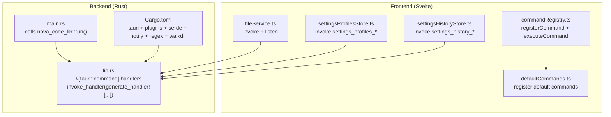
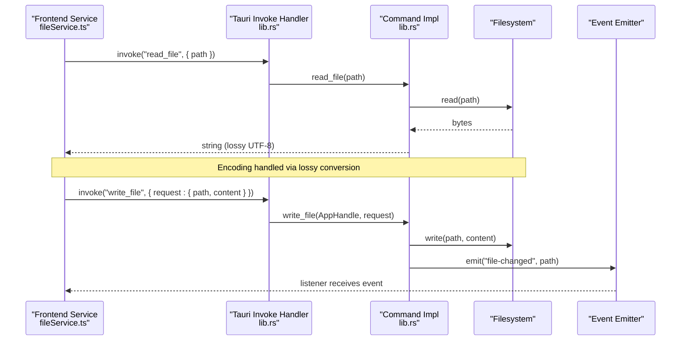
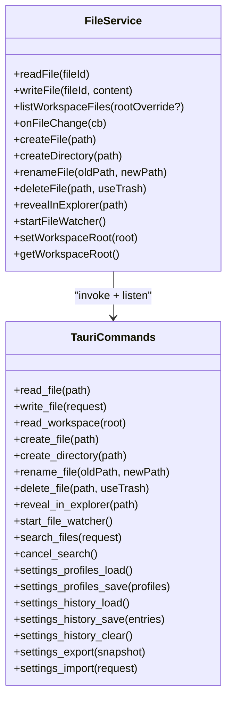
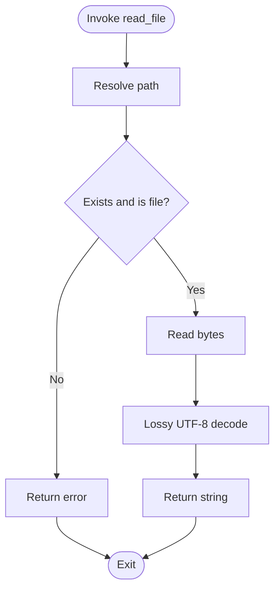
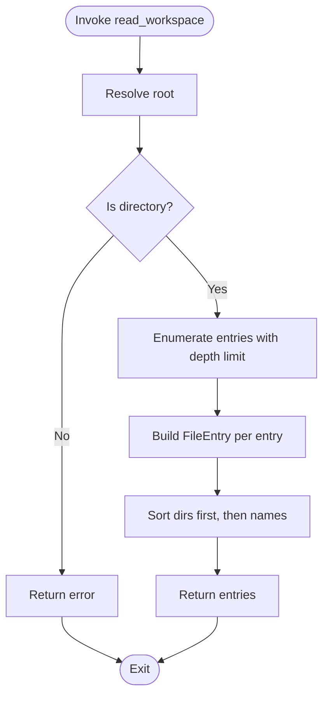
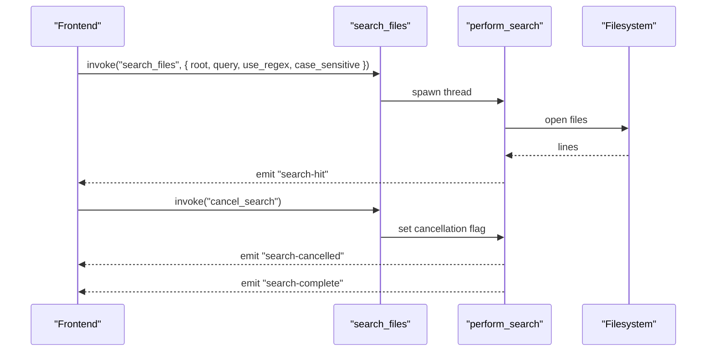
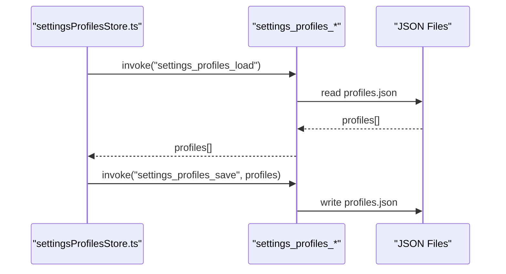
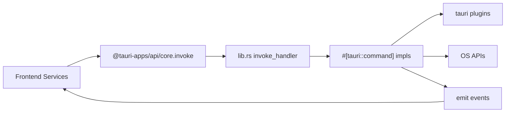

# Tauri Command System

<cite>
**Referenced Files in This Document**
- [main.rs](file://src-tauri/src/main.rs)
- [lib.rs](file://src-tauri/src/lib.rs)
- [Cargo.toml](file://src-tauri/Cargo.toml)
- [fileService.ts](file://src/lib/services/fileService.ts)
- [commandRegistry.ts](file://src/lib/commands/commandRegistry.ts)
- [defaultCommands.ts](file://src/lib/commands/defaultCommands.ts)
- [commands.ts](file://src/lib/settings/commands.ts)
- [settingsProfilesStore.ts](file://src/lib/stores/settingsProfilesStore.ts)
- [settingsHistoryStore.ts](file://src/lib/stores/settingsHistoryStore.ts)
</cite>

## Table of Contents
1. [Introduction](#introduction)
2. [Project Structure](#project-structure)
3. [Core Components](#core-components)
4. [Architecture Overview](#architecture-overview)
5. [Detailed Component Analysis](#detailed-component-analysis)
6. [Dependency Analysis](#dependency-analysis)
7. [Performance Considerations](#performance-considerations)
8. [Troubleshooting Guide](#troubleshooting-guide)
9. [Conclusion](#conclusion)

## Introduction
This document explains the Tauri command system in the NC code editor. It covers how the Svelte frontend communicates with the Rust backend using Tauri’s invoke handler to enable secure IPC for file operations, workspace management, search, and settings persistence. It documents the #[tauri::command] macro usage, async/await patterns, Result-based error handling, and serde-based serialization. Practical examples are provided via file references and code snippet paths. The relationship between frontend service calls and backend command implementations is clarified, along with common issues such as path resolution, encoding handling, and error propagation.

## Project Structure
The Tauri backend lives under src-tauri and exposes commands via a generated handler. The Svelte frontend invokes these commands using @tauri-apps/api/core invoke and listens to events emitted by the backend.

**Diagram sources**
- [main.rs](file://src-tauri/src/main.rs#L1-L7)
- [lib.rs](file://src-tauri/src/lib.rs#L768-L796)
- [Cargo.toml](file://src-tauri/Cargo.toml#L1-L33)
- [fileService.ts](file://src/lib/services/fileService.ts#L1-L85)
- [commandRegistry.ts](file://src/lib/commands/commandRegistry.ts#L1-L64)
- [defaultCommands.ts](file://src/lib/commands/defaultCommands.ts#L1-L269)
- [settingsProfilesStore.ts](file://src/lib/stores/settingsProfilesStore.ts#L1-L426)
- [settingsHistoryStore.ts](file://src/lib/stores/settingsHistoryStore.ts#L1-L304)

**Section sources**
- [main.rs](file://src-tauri/src/main.rs#L1-L7)
- [lib.rs](file://src-tauri/src/lib.rs#L768-L796)
- [Cargo.toml](file://src-tauri/Cargo.toml#L1-L33)

## Core Components
- Backend command registry and handlers: Implemented in Rust using #[tauri::command], async functions, and Result-based error handling. Commands include file operations, workspace listing, search, and settings persistence.
- Frontend service wrappers: The fileService.ts module wraps Tauri commands with typed async methods and event listeners for file changes.
- Settings command system: The settings command registration and stores integrate with Tauri commands for profiles and history persistence.

Key backend commands implemented:
- File operations: read_file, write_file, create_file, create_directory, rename_file, delete_file, reveal_in_explorer, start_file_watcher, search_files, cancel_search
- Workspace: read_workspace
- Settings: settings_profiles_load/save, settings_history_load/save/clear, settings_export/import

**Section sources**
- [lib.rs](file://src-tauri/src/lib.rs#L248-L796)
- [fileService.ts](file://src/lib/services/fileService.ts#L1-L85)
- [settingsProfilesStore.ts](file://src/lib/stores/settingsProfilesStore.ts#L1-L426)
- [settingsHistoryStore.ts](file://src/lib/stores/settingsHistoryStore.ts#L1-L304)

## Architecture Overview
The frontend invokes commands by name and arguments. The backend registers handlers and executes them asynchronously. Serialization is handled by serde. Events are emitted for file watching and search progress.

**Diagram sources**
- [fileService.ts](file://src/lib/services/fileService.ts#L1-L85)
- [lib.rs](file://src-tauri/src/lib.rs#L266-L388)

## Detailed Component Analysis

### Backend Command Layer (Rust)
- Command registration: The invoke handler registers all commands via tauri::generate_handler! and Builder::invoke_handler.
- Async/await: All commands are async and return Result<T, String>.
- Error handling: Errors are propagated as strings; successful results are serialized/deserialized automatically by serde.
- Serialization: Serde derives are used for shared types and request/response payloads.
- Event emission: File watcher emits "file-changed" events; search emits "search-hit", "search-complete", "search-cancelled", and "search-error".

Key command categories:
- File operations: read_file, write_file, create_file, create_directory, rename_file, delete_file, reveal_in_explorer, start_file_watcher
- Workspace: read_workspace
- Search: search_files, cancel_search
- Settings: settings_profiles_load/save, settings_history_load/save/clear, settings_export/import

Implementation highlights:
- Path resolution: resolve_path handles relative vs absolute paths and current working directory fallback.
- Encoding: read_file uses lossy UTF-8 conversion to avoid failures on non-text files.
- Safety: Directory creation before writes/rename; parent directories created as needed.
- Cross-platform: reveal_in_explorer uses platform-specific commands.

**Section sources**
- [lib.rs](file://src-tauri/src/lib.rs#L248-L796)
- [Cargo.toml](file://src-tauri/Cargo.toml#L20-L33)

### Frontend Service Layer (Svelte)
- fileService.ts: Provides a typed facade around invoke and listen for:
  - readFile(fileId)
  - writeFile(fileId, content)
  - listWorkspaceFiles(rootOverride?)
  - onFileChange(cb)
  - createFile(path), createDirectory(path)
  - renameFile(oldPath, newPath)
  - deleteFile(path, useTrash)
  - revealInExplorer(path)
  - startFileWatcher()
  - setWorkspaceRoot(root), getWorkspaceRoot()

- Event handling: Listens to "file-changed" to react to filesystem changes.

**Section sources**
- [fileService.ts](file://src/lib/services/fileService.ts#L1-L85)

### Settings Command System
- Command registration: settings/commands.ts registers commands like settings.open and settings.search, delegating to a host-provided openSettingsShell callback.
- Profiles persistence: settingsProfilesStore.ts invokes settings_profiles_load/save and applies profiles to the settings store.
- History persistence: settingsHistoryStore.ts invokes settings_history_load/save/clear and manages undo/redo logic.

**Section sources**
- [commands.ts](file://src/lib/settings/commands.ts#L1-L174)
- [settingsProfilesStore.ts](file://src/lib/stores/settingsProfilesStore.ts#L1-L426)
- [settingsHistoryStore.ts](file://src/lib/stores/settingsHistoryStore.ts#L1-L304)

### Command Registry and Default Commands
- commandRegistry.ts: Provides a single-source-of-truth registry for commands with registerCommand and executeCommand.
- defaultCommands.ts: Registers default commands (layout toggles, views, editor actions, etc.) and ensures idempotent initialization.

**Section sources**
- [commandRegistry.ts](file://src/lib/commands/commandRegistry.ts#L1-L64)
- [defaultCommands.ts](file://src/lib/commands/defaultCommands.ts#L1-L269)

## Architecture Overview

**Diagram sources**
- [fileService.ts](file://src/lib/services/fileService.ts#L1-L85)
- [lib.rs](file://src-tauri/src/lib.rs#L248-L796)

## Detailed Component Analysis

### File Operations: read_file, write_file, create_file, create_directory, rename_file, delete_file, reveal_in_explorer, start_file_watcher
- read_file: Resolves path, checks existence and type, reads bytes, converts to string using lossy UTF-8 to handle non-text files gracefully.
- write_file: Resolves path, ensures parent directory exists, writes bytes, emits "file-changed" event.
- create_file/create_directory: Ensures parent directories exist before creation.
- rename_file: Validates destination parent and renames atomically.
- delete_file: Supports trash or permanent deletion; handles files and directories.
- reveal_in_explorer: Platform-specific open/reveal behavior.
- start_file_watcher: Spawns a background watcher thread and emits "file-changed" events for detected paths.

**Diagram sources**
- [lib.rs](file://src-tauri/src/lib.rs#L266-L279)

**Section sources**
- [lib.rs](file://src-tauri/src/lib.rs#L266-L388)
- [fileService.ts](file://src/lib/services/fileService.ts#L1-L85)

### Workspace Management: read_workspace
- Resolves root, validates directory, builds FileEntry tree up to a max depth, sorts directories before files, and handles permission errors by skipping entries.

**Diagram sources**
- [lib.rs](file://src-tauri/src/lib.rs#L248-L265)
- [lib.rs](file://src-tauri/src/lib.rs#L221-L246)

**Section sources**
- [lib.rs](file://src-tauri/src/lib.rs#L221-L265)

### Search: search_files, cancel_search
- search_files: Validates root, spawns background thread, compiles regex if requested, walks directory tree with exclusions, reads files line-by-line, emits hits and completion events, respects cancellation flag.
- cancel_search: Sets global cancellation flag.

**Diagram sources**
- [lib.rs](file://src-tauri/src/lib.rs#L449-L472)
- [lib.rs](file://src-tauri/src/lib.rs#L474-L644)

**Section sources**
- [lib.rs](file://src-tauri/src/lib.rs#L449-L644)

### Settings Persistence: profiles and history
- settings_profiles_load/save: Load and save profiles.json in app config directory.
- settings_history_load/save/clear: Load, save, and clear history.json.
- Frontend stores: settingsProfilesStore.ts and settingsHistoryStore.ts invoke these commands and manage state.

**Diagram sources**
- [settingsProfilesStore.ts](file://src/lib/stores/settingsProfilesStore.ts#L150-L171)
- [lib.rs](file://src-tauri/src/lib.rs#L650-L669)

**Section sources**
- [settingsProfilesStore.ts](file://src/lib/stores/settingsProfilesStore.ts#L1-L426)
- [settingsHistoryStore.ts](file://src/lib/stores/settingsHistoryStore.ts#L1-L304)
- [lib.rs](file://src-tauri/src/lib.rs#L646-L702)

### Command Registry and Default Commands
- commandRegistry.ts: Single-source-of-truth for commands with registerCommand and executeCommand.
- defaultCommands.ts: Registers layout, view, editor, and search commands; ensures idempotent initialization.

**Section sources**
- [commandRegistry.ts](file://src/lib/commands/commandRegistry.ts#L1-L64)
- [defaultCommands.ts](file://src/lib/commands/defaultCommands.ts#L1-L269)

## Dependency Analysis
- Backend dependencies: tauri, serde, serde_json, notify, regex, walkdir, trash, once_cell.
- Frontend integration: @tauri-apps/api/core for invoke and @tauri-apps/api/event for listen.
- Event-driven updates: file-service listens to "file-changed"; search emits "search-hit", "search-complete", "search-cancelled", "search-error".

**Diagram sources**
- [lib.rs](file://src-tauri/src/lib.rs#L768-L796)
- [Cargo.toml](file://src-tauri/Cargo.toml#L20-L33)

**Section sources**
- [Cargo.toml](file://src-tauri/Cargo.toml#L20-L33)
- [lib.rs](file://src-tauri/src/lib.rs#L768-L796)

## Performance Considerations
- File operations:
  - read_file uses lossy conversion to avoid blocking on non-text files; consider streaming for very large files if needed.
  - write_file writes bytes directly; ensure callers batch writes to reduce disk churn.
- Directory traversal:
  - read_workspace limits depth and skips inaccessible entries; adjust depth or add filters if needed.
- Search:
  - search_files runs in a background thread and supports cancellation; it skips hidden directories and common binary extensions.
  - Emits up to a bounded number of hits and completes with a summary event.
  - Regex compilation happens once per search; invalid regex emits an error event.
- Event loop:
  - start_file_watcher uses a channel and a thread; ensure to avoid excessive watchers by limiting watch scope.

[No sources needed since this section provides general guidance]

## Troubleshooting Guide
Common issues and resolutions:
- Path resolution:
  - Relative paths are resolved against the current working directory; ensure the app sets the workspace root appropriately.
  - Use absolute paths when necessary to avoid ambiguity.
- File encoding:
  - read_file uses lossy UTF-8 decoding; binary or non-UTF-8 files will not cause failures but may contain replacement characters.
- Error propagation:
  - Backend commands return Result<T, String>; frontend should handle errors and surface them to the user.
  - For search, invalid regex emits a "search-error" event; frontend should display the message.
- Permissions:
  - read_workspace and search skip entries when metadata or directory access is denied; expect partial results.
- Trash behavior:
  - delete_file with use_trash moves to trash; on failure, the error is returned as a string.

**Section sources**
- [lib.rs](file://src-tauri/src/lib.rs#L169-L186)
- [lib.rs](file://src-tauri/src/lib.rs#L266-L388)
- [lib.rs](file://src-tauri/src/lib.rs#L449-L644)

## Conclusion
The Tauri command system in NC provides a robust, secure IPC layer between the Svelte frontend and Rust backend. Commands are declared with #[tauri::command], leverage async/await and Result-based error handling, and use serde for serialization. The frontend service wrappers encapsulate invoke and event handling for file operations and search, while the settings command system integrates with Tauri for persistent profiles and history. Proper path resolution, encoding handling, and error propagation are implemented to ensure reliability and usability.