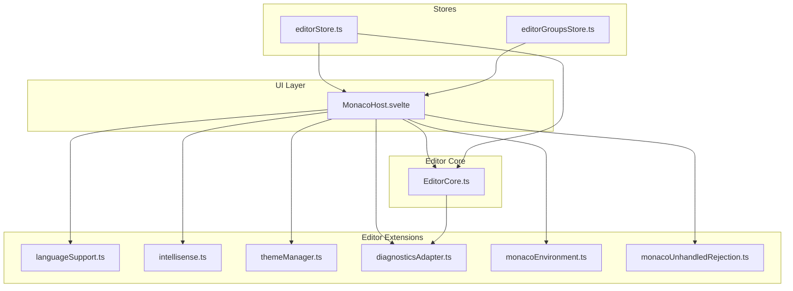
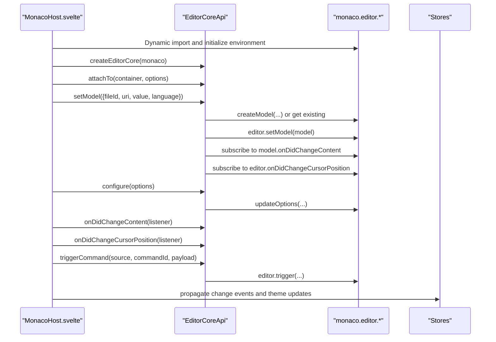
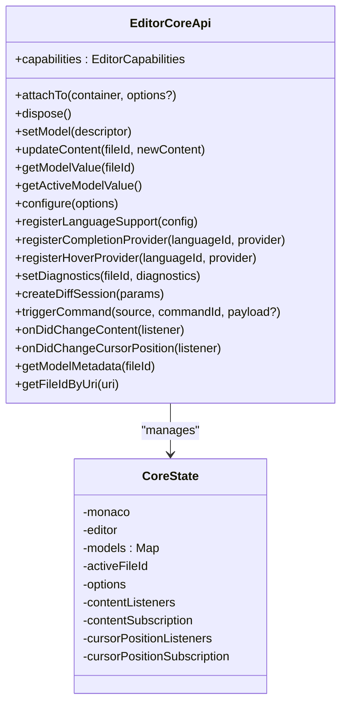
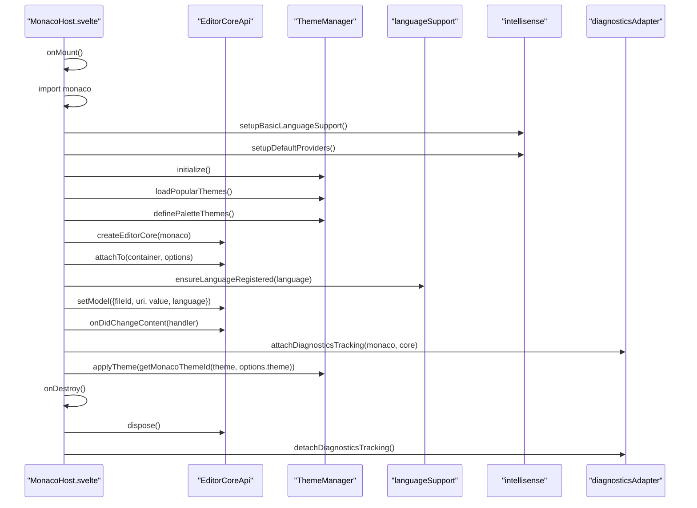
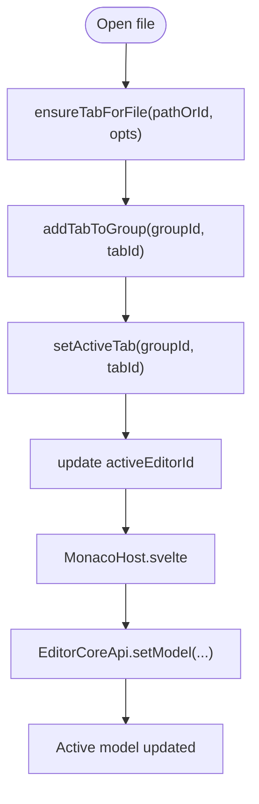
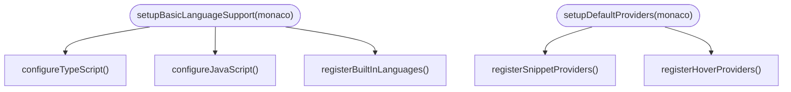
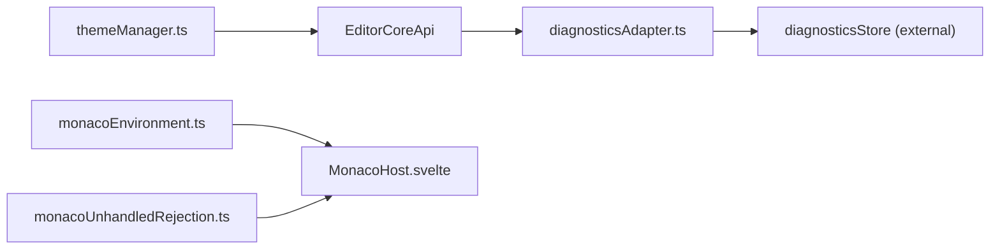
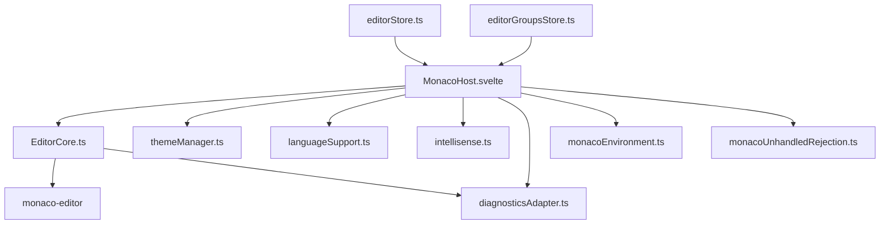

# Editor Core Functionality

<cite>
**Referenced Files in This Document**
- [EditorCore.ts](file://src/lib/editor/EditorCore.ts)
- [MonacoHost.svelte](file://src/lib/editor/MonacoHost.svelte)
- [editorStore.ts](file://src/lib/stores/editorStore.ts)
- [editorGroupsStore.ts](file://src/lib/stores/layout/editorGroupsStore.ts)
- [languageSupport.ts](file://src/lib/editor/languageSupport.ts)
- [intellisense.ts](file://src/lib/editor/intellisense.ts)
- [themeManager.ts](file://src/lib/editor/themeManager.ts)
- [monacoEnvironment.ts](file://src/lib/editor/monacoEnvironment.ts)
- [monacoUnhandledRejection.ts](file://src/lib/editor/monacoUnhandledRejection.ts)
- [diagnosticsAdapter.ts](file://src/lib/editor/diagnosticsAdapter.ts)
</cite>

## Table of Contents
1. [Introduction](#introduction)
2. [Project Structure](#project-structure)
3. [Core Components](#core-components)
4. [Architecture Overview](#architecture-overview)
5. [Detailed Component Analysis](#detailed-component-analysis)
6. [Dependency Analysis](#dependency-analysis)
7. [Performance Considerations](#performance-considerations)
8. [Troubleshooting Guide](#troubleshooting-guide)
9. [Conclusion](#conclusion)
10. [Appendices](#appendices)

## Introduction
This document explains the EditorCore module as the central orchestrator of the NC code editor. It encapsulates the Monaco Editor API and exposes a Svelte-friendly interface for editor instance management, model lifecycle handling, and event subscription patterns. It also covers configuration options, integration with stores and services, and practical usage patterns for creating editor instances, managing tabs, and handling editor events.

## Project Structure
The editor subsystem is organized around a small set of focused modules:
- EditorCore.ts: The core orchestrator that manages Monaco instances, models, and subscriptions.
- MonacoHost.svelte: The Svelte host component that mounts EditorCore, wires up stores, and applies theme/language configuration.
- Stores: editorStore.ts and editorGroupsStore.ts manage logical tabs and layout grouping.
- Language and IntelliSense: languageSupport.ts and intellisense.ts provide language registration and provider setup.
- Theming: themeManager.ts defines and applies themes.
- Environment and diagnostics: monacoEnvironment.ts configures workers; diagnosticsAdapter.ts bridges Monaco markers to the diagnostics store.

**Diagram sources**
- [MonacoHost.svelte](file://src/lib/editor/MonacoHost.svelte#L1-L260)
- [EditorCore.ts](file://src/lib/editor/EditorCore.ts#L1-L891)
- [editorStore.ts](file://src/lib/stores/editorStore.ts#L1-L381)
- [editorGroupsStore.ts](file://src/lib/stores/layout/editorGroupsStore.ts#L1-L413)
- [languageSupport.ts](file://src/lib/editor/languageSupport.ts#L1-L70)
- [intellisense.ts](file://src/lib/editor/intellisense.ts#L1-L327)
- [themeManager.ts](file://src/lib/editor/themeManager.ts#L1-L274)
- [monacoEnvironment.ts](file://src/lib/editor/monacoEnvironment.ts#L1-L131)
- [monacoUnhandledRejection.ts](file://src/lib/editor/monacoUnhandledRejection.ts#L1-L30)
- [diagnosticsAdapter.ts](file://src/lib/editor/diagnosticsAdapter.ts#L1-L61)

**Section sources**
- [EditorCore.ts](file://src/lib/editor/EditorCore.ts#L1-L120)
- [MonacoHost.svelte](file://src/lib/editor/MonacoHost.svelte#L1-L120)

## Core Components
- EditorCoreApi: Public interface for editor orchestration, including attaching to DOM, managing models, configuring editor options, registering language providers, setting diagnostics, creating diff sessions, triggering commands, and subscribing to content/cursor changes.
- CoreState: Internal state including Monaco instance, editor instance, model registry, active file id, options, and event subscriptions.
- EditorCapabilities: Declares core features such as multi-model support, preserved undo stacks, diff readiness, and extensible languages.

Key responsibilities:
- Encapsulate Monaco Editor API calls behind a typed interface.
- Manage model lifecycle and active model switching without losing undo/redo history.
- Provide event subscriptions for content changes and cursor position updates.
- Expose configuration APIs for theme, wrapping, minimap, folding, and more.
- Support language registration and IntelliSense provider registration.
- Enable diff editor sessions with configurable options.

**Section sources**
- [EditorCore.ts](file://src/lib/editor/EditorCore.ts#L120-L315)
- [EditorCore.ts](file://src/lib/editor/EditorCore.ts#L316-L406)

## Architecture Overview
EditorCore sits between the UI host (MonacoHost.svelte) and the Monaco Editor runtime. It:
- Receives model descriptors (fileId, uri, value, language) and creates or switches models.
- Subscribes to model content changes and forwards them to listeners.
- Subscribes to cursor position changes on the active editor.
- Applies editor configuration and theme updates.
- Registers language support and IntelliSense providers.
- Manages diagnostics via Monaco markers and exposes metadata for the active model.

MonacoHost.svelte:
- Dynamically imports Monaco, initializes language support and providers, sets up theme manager, and mounts EditorCore.
- Wires editorStore and editorGroupsStore to drive active tab and layout changes.
- Proxies change events and theme updates to parent components.

**Diagram sources**
- [MonacoHost.svelte](file://src/lib/editor/MonacoHost.svelte#L68-L172)
- [EditorCore.ts](file://src/lib/editor/EditorCore.ts#L410-L541)
- [EditorCore.ts](file://src/lib/editor/EditorCore.ts#L543-L650)
- [EditorCore.ts](file://src/lib/editor/EditorCore.ts#L840-L891)

**Section sources**
- [MonacoHost.svelte](file://src/lib/editor/MonacoHost.svelte#L1-L260)
- [EditorCore.ts](file://src/lib/editor/EditorCore.ts#L410-L650)

## Detailed Component Analysis

### EditorCore Module
Public API highlights:
- attachTo(container, options?): Creates or recreates the standalone editor and applies performance-oriented defaults.
- setModel(descriptor): Creates or retrieves a model by fileId, sets it as active, and subscribes to its content and cursor position changes.
- updateContent(fileId, newContent): Updates model content without switching active model.
- getModelValue(fileId): Retrieves model value or null if not found.
- getActiveModelValue(): Convenience to get value of active model.
- configure(options): Applies editor options and theme updates.
- registerLanguageSupport(config): Registers a language with Monaco.
- registerCompletionProvider(languageId, provider): Registers completion provider and returns disposable.
- registerHoverProvider(languageId, provider): Registers hover provider and returns disposable.
- setDiagnostics(fileId, diagnostics): Sets Monaco markers for a given model.
- createDiffSession(params): Creates a diff editor session with mount/update/dispose lifecycle.
- triggerCommand(source, commandId, payload?): Executes Monaco commands.
- onDidChangeContent(listener): Subscribe to active model content changes; returns unsubscribe function.
- onDidChangeCursorPosition(listener): Subscribe to cursor position changes; returns unsubscribe function.
- getModelMetadata(fileId): Returns languageId, EOL, tabSize, insertSpaces for a model.
- getFileIdByUri(uri): Resolves model fileId by URI.

Implementation patterns:
- Model registry keyed by fileId with strong typing for Monaco models.
- Event subscriptions scoped to the active model to avoid cross-tab noise.
- Disposable subscriptions for content and cursor position to prevent leaks.
- Diff editor creation with configurable options and lifecycle management.

**Diagram sources**
- [EditorCore.ts](file://src/lib/editor/EditorCore.ts#L155-L315)
- [EditorCore.ts](file://src/lib/editor/EditorCore.ts#L316-L406)

**Section sources**
- [EditorCore.ts](file://src/lib/editor/EditorCore.ts#L155-L315)
- [EditorCore.ts](file://src/lib/editor/EditorCore.ts#L316-L406)
- [EditorCore.ts](file://src/lib/editor/EditorCore.ts#L410-L891)

### MonacoHost.svelte Integration
MonacoHost.svelte:
- Dynamically imports Monaco and initializes environment and language support.
- Initializes theme manager, loads popular themes, and defines palette-based themes.
- Creates EditorCore, attaches to container, registers language, and sets initial model.
- Subscribes to content changes and theme updates, forwarding events to parent.
- Disposes EditorCore and diagnostics tracking on destroy.

**Diagram sources**
- [MonacoHost.svelte](file://src/lib/editor/MonacoHost.svelte#L68-L172)
- [EditorCore.ts](file://src/lib/editor/EditorCore.ts#L410-L541)
- [themeManager.ts](file://src/lib/editor/themeManager.ts#L1-L274)
- [languageSupport.ts](file://src/lib/editor/languageSupport.ts#L1-L70)
- [intellisense.ts](file://src/lib/editor/intellisense.ts#L1-L120)
- [diagnosticsAdapter.ts](file://src/lib/editor/diagnosticsAdapter.ts#L1-L61)

**Section sources**
- [MonacoHost.svelte](file://src/lib/editor/MonacoHost.svelte#L1-L260)

### Editor Store and Groups
editorStore.ts:
- Maintains open tabs and active editor id.
- Provides helpers to ensure/open/close tabs, mark dirty, and persist content.
- Integrates with editorGroupsStore to manage layout grouping.

editorGroupsStore.ts:
- Manages editor groups, tab ordering, and active tab per group.
- Supports moving tabs between groups and splitting active group.

**Diagram sources**
- [editorStore.ts](file://src/lib/stores/editorStore.ts#L90-L190)
- [editorGroupsStore.ts](file://src/lib/stores/layout/editorGroupsStore.ts#L170-L222)
- [MonacoHost.svelte](file://src/lib/editor/MonacoHost.svelte#L186-L204)
- [EditorCore.ts](file://src/lib/editor/EditorCore.ts#L543-L601)

**Section sources**
- [editorStore.ts](file://src/lib/stores/editorStore.ts#L1-L381)
- [editorGroupsStore.ts](file://src/lib/stores/layout/editorGroupsStore.ts#L1-L413)

### Language Support and IntelliSense
languageSupport.ts:
- Maps internal language ids to Monaco language ids.
- Ensures language registration for built-in and common languages.

intellisense.ts:
- Singleton initialization of language support and providers.
- Configures TypeScript/JavaScript defaults, diagnostics, and eager model sync.
- Registers snippet providers and hover providers for common patterns.

**Diagram sources**
- [intellisense.ts](file://src/lib/editor/intellisense.ts#L43-L141)
- [intellisense.ts](file://src/lib/editor/intellisense.ts#L153-L204)
- [intellisense.ts](file://src/lib/editor/intellisense.ts#L264-L305)
- [languageSupport.ts](file://src/lib/editor/languageSupport.ts#L1-L70)

**Section sources**
- [languageSupport.ts](file://src/lib/editor/languageSupport.ts#L1-L70)
- [intellisense.ts](file://src/lib/editor/intellisense.ts#L1-L327)

### Diagnostics and Theming
diagnosticsAdapter.ts:
- Subscribes to Monaco marker changes and pushes diagnostics to diagnosticsStore.

themeManager.ts:
- Defines and applies themes, including palette-based and popular themes.
- Provides utilities to export/remove custom themes.

monacoEnvironment.ts:
- Configures Monaco workers for Vite/Svelte builds with singleton pattern.

monacoUnhandledRejection.ts:
- Silences cancellation-related unhandled rejections during disposal.

**Diagram sources**
- [diagnosticsAdapter.ts](file://src/lib/editor/diagnosticsAdapter.ts#L1-L61)
- [themeManager.ts](file://src/lib/editor/themeManager.ts#L1-L274)
- [monacoEnvironment.ts](file://src/lib/editor/monacoEnvironment.ts#L1-L131)
- [monacoUnhandledRejection.ts](file://src/lib/editor/monacoUnhandledRejection.ts#L1-L30)
- [MonacoHost.svelte](file://src/lib/editor/MonacoHost.svelte#L68-L172)

**Section sources**
- [diagnosticsAdapter.ts](file://src/lib/editor/diagnosticsAdapter.ts#L1-L61)
- [themeManager.ts](file://src/lib/editor/themeManager.ts#L1-L274)
- [monacoEnvironment.ts](file://src/lib/editor/monacoEnvironment.ts#L1-L131)
- [monacoUnhandledRejection.ts](file://src/lib/editor/monacoUnhandledRejection.ts#L1-L30)

## Dependency Analysis
- EditorCore depends on Monaco Editor for models, editors, and language services.
- MonacoHost orchestrates EditorCore and integrates with stores and theme manager.
- editorStore and editorGroupsStore coordinate logical tabs and layout grouping.
- languageSupport and intellisense provide language and provider setup.
- diagnosticsAdapter bridges Monaco markers to diagnosticsStore.
- monacoEnvironment and monacoUnhandledRejection ensure worker configuration and clean disposal.

**Diagram sources**
- [EditorCore.ts](file://src/lib/editor/EditorCore.ts#L410-L891)
- [MonacoHost.svelte](file://src/lib/editor/MonacoHost.svelte#L1-L260)
- [editorStore.ts](file://src/lib/stores/editorStore.ts#L1-L381)
- [editorGroupsStore.ts](file://src/lib/stores/layout/editorGroupsStore.ts#L1-L413)
- [languageSupport.ts](file://src/lib/editor/languageSupport.ts#L1-L70)
- [intellisense.ts](file://src/lib/editor/intellisense.ts#L1-L327)
- [themeManager.ts](file://src/lib/editor/themeManager.ts#L1-L274)
- [monacoEnvironment.ts](file://src/lib/editor/monacoEnvironment.ts#L1-L131)
- [monacoUnhandledRejection.ts](file://src/lib/editor/monacoUnhandledRejection.ts#L1-L30)
- [diagnosticsAdapter.ts](file://src/lib/editor/diagnosticsAdapter.ts#L1-L61)

**Section sources**
- [EditorCore.ts](file://src/lib/editor/EditorCore.ts#L410-L891)
- [MonacoHost.svelte](file://src/lib/editor/MonacoHost.svelte#L1-L260)

## Performance Considerations
- Automatic layout and smooth scrolling disabled for responsiveness.
- Cursor smooth caret animation turned off to reduce GPU load.
- Minimap rendering characters disabled and maxColumn constrained for performance.
- Quick suggestions delay reduced to improve perceived responsiveness.
- Folding strategy set to indentation for speed.
- Render validation decorations restricted to editable models.
- Eager model sync enabled for TypeScript/JavaScript language services.

These defaults are applied during editor creation and can be overridden via configure(options).

**Section sources**
- [EditorCore.ts](file://src/lib/editor/EditorCore.ts#L444-L512)
- [intellisense.ts](file://src/lib/editor/intellisense.ts#L64-L118)

## Troubleshooting Guide
Common issues and resolutions:
- Monaco not initialized: Ensure monacoEnvironment.ts is imported before any Monaco usage and that MonacoHost performs dynamic import and initialization.
- Cancellation errors during disposal: Call silenceMonacoCancellationErrors() to prevent unhandled rejection noise.
- Language not highlighted: Use ensureLanguageRegistered() to register the language with Monaco before creating models.
- Diagnostics not updating: Ensure attachDiagnosticsTracking() is called and that setDiagnostics() is invoked for models.
- Theme not applying: Verify themeManager is initialized and applyTheme() is called with the correct theme id.
- Editor not resizing: Confirm automaticLayout is enabled and container element has proper dimensions.
- Content change events firing for wrong tab: Ensure onDidChangeContent is only subscribed to within the correct MonacoHost instance and that the listener filters by fileId.

Practical checks:
- Verify EditorCore.attachTo() is called with a valid container and options.
- Confirm setModel() is called with correct fileId and uri.
- Check configure() is called after attachTo() to apply options.
- Ensure dispose() is called on component teardown to free subscriptions and models.

**Section sources**
- [monacoEnvironment.ts](file://src/lib/editor/monacoEnvironment.ts#L1-L131)
- [monacoUnhandledRejection.ts](file://src/lib/editor/monacoUnhandledRejection.ts#L1-L30)
- [languageSupport.ts](file://src/lib/editor/languageSupport.ts#L1-L70)
- [diagnosticsAdapter.ts](file://src/lib/editor/diagnosticsAdapter.ts#L1-L61)
- [themeManager.ts](file://src/lib/editor/themeManager.ts#L1-L274)
- [EditorCore.ts](file://src/lib/editor/EditorCore.ts#L410-L650)
- [MonacoHost.svelte](file://src/lib/editor/MonacoHost.svelte#L68-L172)

## Conclusion
EditorCore provides a robust, Svelte-friendly facade over Monaco Editor, encapsulating model lifecycle, event subscriptions, and configuration while keeping UI concerns separate. Combined with MonacoHost.svelte and the store layer, it enables scalable editor experiences with language support, theming, diagnostics, and diff editing capabilities.

## Appendices

### Public Interfaces and Methods
- EditorCoreApi: attachTo, dispose, setModel, updateContent, getModelValue, getActiveModelValue, configure, registerLanguageSupport, registerCompletionProvider, registerHoverProvider, setDiagnostics, createDiffSession, triggerCommand, onDidChangeContent, onDidChangeCursorPosition, getModelMetadata, getFileIdByUri.
- EditorCoreOptions: theme, tabSize, insertSpaces, wordWrap, wordWrapColumn, minimap, folding, bracketPairColorization, readOnly, fontSize, fontFamily, fontLigatures, renderWhitespace, lineNumbers, codeLens, links, largeFileOptimizations, autoClosingBrackets, autoClosingQuotes, autoClosingOvertype.
- EditorModelDescriptor: fileId, uri, value, language.
- EditorDiagnostic: severity, message, startLineNumber, startColumn, endLineNumber, endColumn, code.
- LanguageSupportConfig: id, extensions, aliases, loader.
- CompletionProviderConfig: triggerCharacters, provideCompletionItems.
- HoverProviderConfig: provideHover.

**Section sources**
- [EditorCore.ts](file://src/lib/editor/EditorCore.ts#L54-L154)
- [EditorCore.ts](file://src/lib/editor/EditorCore.ts#L155-L315)

### Practical Usage Patterns
- Creating an editor instance:
  - Import MonacoHost.svelte and pass props: fileId, uri, value, language, options.
  - Subscribe to change events and theme updates.
  - Call triggerCommand(source, commandId, payload?) to execute Monaco actions.
- Managing editor tabs:
  - Use editorStore.ensureTabForFile() to create/open tabs.
  - Use editorGroupsStore.addTabToGroup() and setActiveTab() to manage layout.
  - Close tabs via editorStore.closeEditor() and synchronize with editorGroupsStore.
- Handling editor events:
  - Subscribe to onDidChangeContent and onDidChangeCursorPosition via EditorCoreApi.
  - Forward events to parent components and update status bar or cursors.

**Section sources**
- [MonacoHost.svelte](file://src/lib/editor/MonacoHost.svelte#L186-L216)
- [editorStore.ts](file://src/lib/stores/editorStore.ts#L90-L190)
- [editorGroupsStore.ts](file://src/lib/stores/layout/editorGroupsStore.ts#L170-L222)
- [EditorCore.ts](file://src/lib/editor/EditorCore.ts#L840-L891)