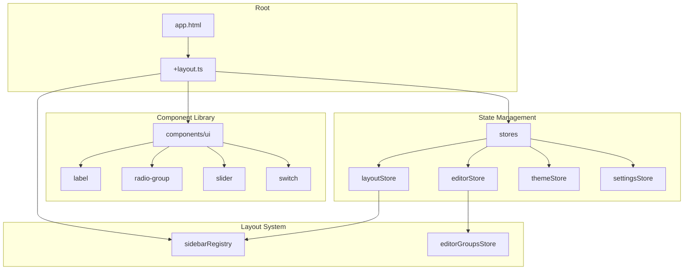
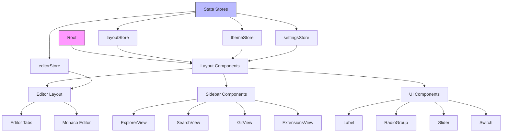
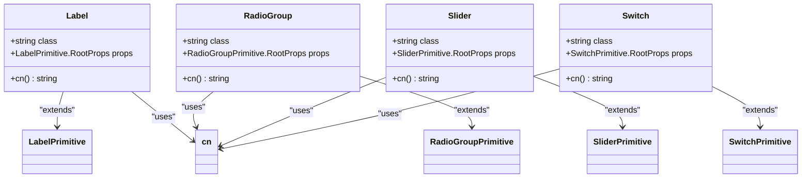
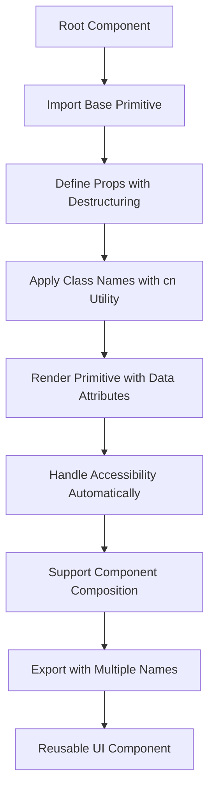
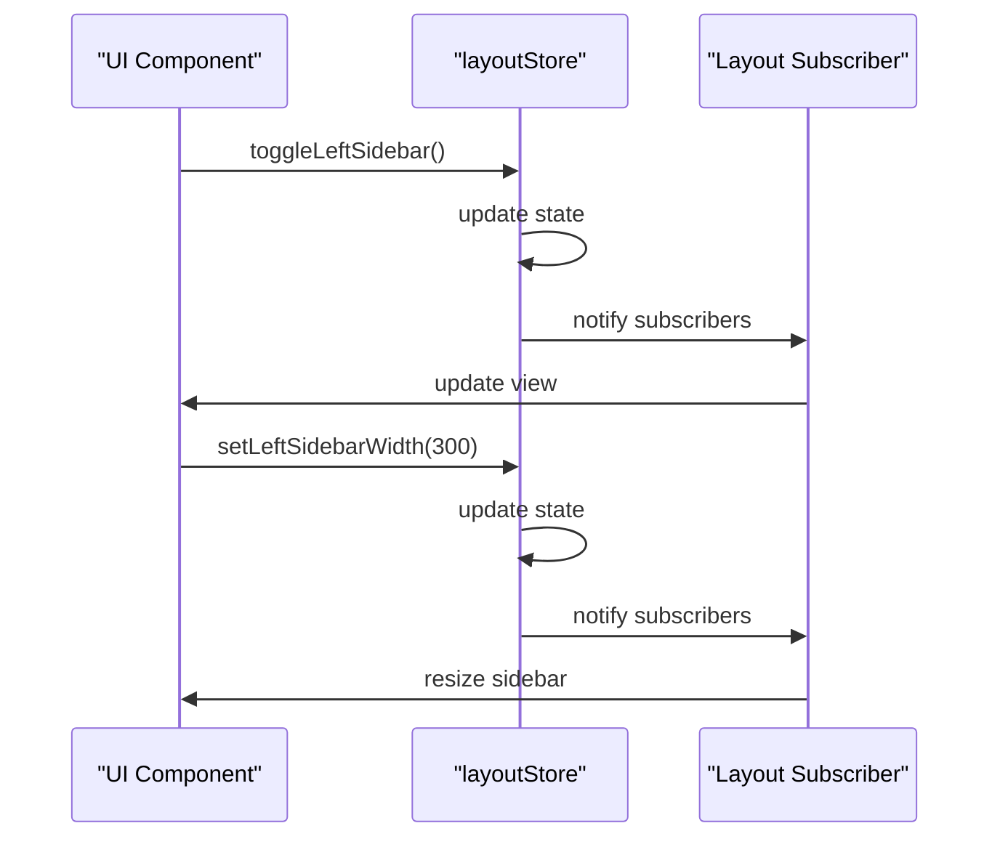
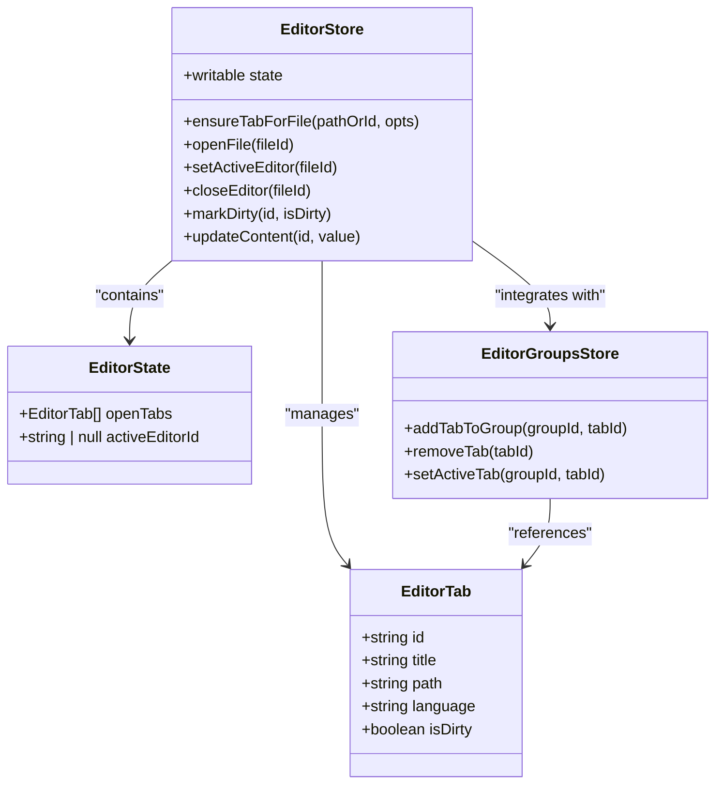
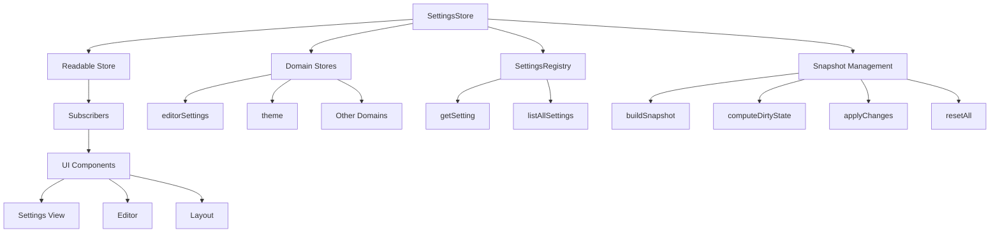
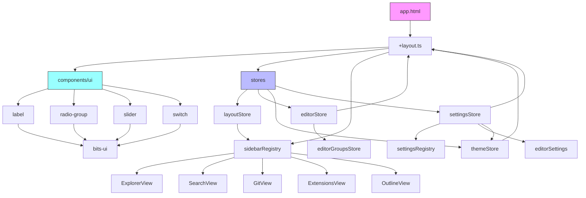

# Component Architecture

<cite>
**Referenced Files in This Document**   
- [app.html](file://src/app.html)
- [+layout.ts](file://src/routes/+layout.ts)
- [layoutStore.ts](file://src/lib/stores/layout/layoutStore.ts)
- [editorStore.ts](file://src/lib/stores/editorStore.ts)
- [themeStore.ts](file://src/lib/stores/themeStore.ts)
- [settingsStore.ts](file://src/lib/stores/settingsStore.ts)
- [sidebarRegistry.ts](file://src/lib/layout/sidebarRegistry.ts)
- [label.svelte](file://src/lib/components/ui/label/label.svelte)
- [label/index.ts](file://src/lib/components/ui/label/index.ts)
- [radio-group.svelte](file://src/lib/components/ui/radio-group/radio-group.svelte)
- [radio-group/index.ts](file://src/lib/components/ui/radio-group/index.ts)
- [slider.svelte](file://src/lib/components/ui/slider/slider.svelte)
- [slider/index.ts](file://src/lib/components/ui/slider/index.ts)
- [switch.svelte](file://src/lib/components/ui/switch/switch.svelte)
- [switch/index.ts](file://src/lib/components/ui/switch/index.ts)
</cite>

## Table of Contents
1. [Introduction](#introduction)
2. [Project Structure](#project-structure)
3. [Core Components](#core-components)
4. [Architecture Overview](#architecture-overview)
5. [Detailed Component Analysis](#detailed-component-analysis)
6. [Dependency Analysis](#dependency-analysis)
7. [Performance Considerations](#performance-considerations)
8. [Troubleshooting Guide](#troubleshooting-guide)
9. [Conclusion](#conclusion)

## Introduction
This document provides comprehensive documentation for the Svelte component architecture in the NC code editor. It describes the component-based UI structure leveraging Svelte 5's enhanced reactivity model, detailing the component hierarchy from the root app.html template to nested UI components. The documentation covers reusable UI components in the components/ui directory, including label, radio-group, slider, and switch components, explaining their implementation patterns, scoped styling, and encapsulation principles. It illustrates component composition patterns used throughout the application, particularly in the editor layout and sidebar, and addresses accessibility considerations and store state management. The document also outlines best practices for creating new components and maintaining consistent UI patterns across the codebase.

## Project Structure
The NC code editor follows a well-organized project structure centered around Svelte 5 and SvelteKit conventions. The core component architecture resides in the `src/lib/components/ui` directory, which contains reusable UI components following a consistent pattern of Svelte components with corresponding index.ts files for exports. The application uses a store-based architecture with centralized state management in the `src/lib/stores` directory, handling layout, editor state, theme, and settings. The component hierarchy begins with the root `app.html` template, which serves as the entry point, and extends through various layout components that manage the editor interface, sidebar views, and UI controls.



**Diagram sources**
- [app.html](file://src/app.html)
- [+layout.ts](file://src/routes/+layout.ts)
- [layoutStore.ts](file://src/lib/stores/layout/layoutStore.ts)
- [editorStore.ts](file://src/lib/stores/editorStore.ts)
- [sidebarRegistry.ts](file://src/lib/layout/sidebarRegistry.ts)

**Section sources**
- [app.html](file://src/app.html)
- [+layout.ts](file://src/routes/+layout.ts)
- [sidebarRegistry.ts](file://src/lib/layout/sidebarRegistry.ts)

## Core Components
The NC code editor's core components are built using Svelte 5's reactivity model, with a focus on reusable UI elements and centralized state management. The architecture separates concerns between UI components, state stores, and layout management, enabling a clean separation of responsibilities. The component system leverages Svelte's scoped styling and reactive declarations to create encapsulated, maintainable components that respond efficiently to state changes. Key architectural patterns include the use of derived stores for computed state, writable stores for mutable state, and readable stores for read-only state access.

**Section sources**
- [editorStore.ts](file://src/lib/stores/editorStore.ts)
- [themeStore.ts](file://src/lib/stores/themeStore.ts)
- [settingsStore.ts](file://src/lib/stores/settingsStore.ts)
- [layoutStore.ts](file://src/lib/stores/layout/layoutStore.ts)

## Architecture Overview
The NC code editor implements a component architecture inspired by VS Code's workbench layout, using Svelte 5's enhanced reactivity model for efficient state management and UI updates. The architecture centers around a store-based state management system where components subscribe to relevant stores and automatically update when state changes. The component hierarchy flows from the root app.html template through layout components to specific UI controls, with each level responsible for different aspects of the user interface. The system uses Svelte's scoped styling to ensure component encapsulation while maintaining a consistent visual language across the application.



**Diagram sources**
- [app.html](file://src/app.html)
- [layoutStore.ts](file://src/lib/stores/layout/layoutStore.ts)
- [editorStore.ts](file://src/lib/stores/editorStore.ts)
- [themeStore.ts](file://src/lib/stores/themeStore.ts)
- [settingsStore.ts](file://src/lib/stores/settingsStore.ts)

## Detailed Component Analysis
The NC code editor implements a comprehensive component system with reusable UI elements, layout management, and state stores. Each component follows Svelte's best practices for reactivity, encapsulation, and accessibility. The analysis below covers the key component categories and their implementation patterns.

### UI Components Analysis
The UI components in the NC code editor follow a consistent pattern of implementation, using Svelte 5's reactivity model and leveraging the bits-ui component library for base functionality. Each component is designed to be reusable, accessible, and easily composable with other components in the system.

#### For Object-Oriented Components:


**Diagram sources**
- [label.svelte](file://src/lib/components/ui/label/label.svelte)
- [radio-group.svelte](file://src/lib/components/ui/radio-group/radio-group.svelte)
- [slider.svelte](file://src/lib/components/ui/slider/slider.svelte)
- [switch.svelte](file://src/lib/components/ui/switch/switch.svelte)

#### For Component Composition:


**Diagram sources**
- [label.svelte](file://src/lib/components/ui/label/label.svelte)
- [radio-group.svelte](file://src/lib/components/ui/radio-group/radio-group.svelte)
- [index.ts](file://src/lib/components/ui/label/index.ts)
- [index.ts](file://src/lib/components/ui/radio-group/index.ts)

**Section sources**
- [label.svelte](file://src/lib/components/ui/label/label.svelte)
- [label/index.ts](file://src/lib/components/ui/label/index.ts)
- [radio-group.svelte](file://src/lib/components/ui/radio-group/radio-group.svelte)
- [radio-group/index.ts](file://src/lib/components/ui/radio-group/index.ts)
- [slider.svelte](file://src/lib/components/ui/slider/slider.svelte)
- [slider/index.ts](file://src/lib/components/ui/slider/index.ts)
- [switch.svelte](file://src/lib/components/ui/switch/switch.svelte)
- [switch/index.ts](file://src/lib/components/ui/switch/index.ts)

### Layout System Analysis
The layout system in the NC code editor manages the overall workspace structure, including sidebar visibility, panel dimensions, and editor grouping. It uses a centralized store pattern to maintain layout state and provide a single source of truth for all layout-related components.

#### For Layout State Management:


**Diagram sources**
- [layoutStore.ts](file://src/lib/stores/layout/layoutStore.ts)
- [sidebarRegistry.ts](file://src/lib/layout/sidebarRegistry.ts)

#### For Editor State Management:


**Diagram sources**
- [editorStore.ts](file://src/lib/stores/editorStore.ts)
- [layout/editorGroupsStore.ts](file://src/lib/stores/layout/editorGroupsStore.ts)

**Section sources**
- [editorStore.ts](file://src/lib/stores/editorStore.ts)
- [layoutStore.ts](file://src/lib/stores/layout/layoutStore.ts)
- [sidebarRegistry.ts](file://src/lib/layout/sidebarRegistry.ts)

### Theme and Settings Analysis
The theme and settings system in the NC code editor provides a comprehensive solution for managing application appearance and user preferences. It uses a layered approach with dedicated stores for different aspects of the application state, ensuring separation of concerns and maintainability.

#### For Theme Management:
```mermaid
stateDiagram-v2
[*] --> ThemeStore
ThemeStore --> ThemeState : "initial state"
ThemeState --> dark : "mode : dark"
ThemeState --> light : "mode : light"
dark --> dark-default : "palette : dark"
dark --> dark-alt-1 : "palette : dark-alt-1"
dark --> dark-alt-2 : "palette : dark-alt-2"
dark --> dark-alt-3 : "palette : dark-alt-3"
light --> light-default : "palette : light"
light --> light-alt-1 : "palette : light-alt-1"
light --> light-alt-2 : "palette : light-alt-2"
light --> light-alt-3 : "palette : light-alt-3"
ThemeStore --> setTheme : "setTheme(mode)"
ThemeStore --> toggleTheme : "toggleTheme()"
ThemeStore --> setPalette : "setPalette(palette)"
setTheme --> ThemeState : "update mode"
toggleTheme --> ThemeState : "toggle mode"
setPalette --> ThemeState : "update palette"
```

**Diagram sources**
- [themeStore.ts](file://src/lib/stores/themeStore.ts)
- [THEME_PALETTES.ts](file://src/lib/stores/THEME_PALETTES.ts)

#### For Settings Management:


**Diagram sources**
- [settingsStore.ts](file://src/lib/stores/settingsStore.ts)
- [settings/registry.ts](file://src/lib/settings/registry.ts)
- [editorSettingsStore.ts](file://src/lib/stores/editorSettingsStore.ts)
- [themeStore.ts](file://src/lib/stores/themeStore.ts)

**Section sources**
- [themeStore.ts](file://src/lib/stores/themeStore.ts)
- [settingsStore.ts](file://src/lib/stores/settingsStore.ts)

## Dependency Analysis
The NC code editor's component architecture demonstrates a well-structured dependency graph with clear separation of concerns. The system uses Svelte's store pattern to minimize direct dependencies between components, instead relying on state subscription for updates. The dependency analysis reveals a hierarchical structure where higher-level components depend on lower-level utilities and stores, but not vice versa, maintaining a clean architectural boundary.



**Diagram sources**
- [app.html](file://src/app.html)
- [+layout.ts](file://src/routes/+layout.ts)
- [layoutStore.ts](file://src/lib/stores/layout/layoutStore.ts)
- [editorStore.ts](file://src/lib/stores/editorStore.ts)
- [themeStore.ts](file://src/lib/stores/themeStore.ts)
- [settingsStore.ts](file://src/lib/stores/settingsStore.ts)
- [sidebarRegistry.ts](file://src/lib/layout/sidebarRegistry.ts)
- [label/index.ts](file://src/lib/components/ui/label/index.ts)
- [radio-group/index.ts](file://src/lib/components/ui/radio-group/index.ts)
- [slider/index.ts](file://src/lib/components/ui/slider/index.ts)
- [switch/index.ts](file://src/lib/components/ui/switch/index.ts)

## Performance Considerations
The NC code editor's component architecture incorporates several performance optimizations through Svelte 5's reactivity model. The use of derived stores ensures that computed values are only recalculated when their dependencies change, minimizing unnecessary computations. The store-based architecture enables efficient state propagation, where components only update when their specific subscribed state changes, rather than relying on prop drilling through multiple component levels. The implementation of readable stores with selective subscription prevents unnecessary re-renders, as components only react to the specific state they consume. Additionally, the use of Svelte's built-in reactivity eliminates the need for manual state comparison, as the compiler generates optimized update code based on reactive declarations.

## Troubleshooting Guide
When working with the NC code editor's component architecture, several common issues may arise related to state management, component rendering, and store subscriptions. For state synchronization issues between components, verify that all components are subscribing to the correct store and that store updates are properly implemented with the update method. For styling conflicts, check that component styles are properly scoped and that the cn utility function is correctly applied to merge class names. When debugging reactivity issues, ensure that reactive declarations are properly defined and that assignments to store values use the appropriate store methods rather than direct mutation. For accessibility concerns, verify that all interactive components have proper ARIA attributes and keyboard navigation support, leveraging the underlying bits-ui components which provide built-in accessibility features.

**Section sources**
- [editorStore.ts](file://src/lib/stores/editorStore.ts)
- [themeStore.ts](file://src/lib/stores/themeStore.ts)
- [settingsStore.ts](file://src/lib/stores/settingsStore.ts)
- [label.svelte](file://src/lib/components/ui/label/label.svelte)
- [radio-group.svelte](file://src/lib/components/ui/radio-group/radio-group.svelte)

## Conclusion
The NC code editor's component architecture demonstrates a sophisticated implementation of Svelte 5's reactivity model, combining reusable UI components with a centralized store-based state management system. The architecture effectively separates concerns between UI presentation, state management, and layout coordination, enabling a maintainable and scalable codebase. By leveraging Svelte's scoped styling and reactive declarations, the components achieve high encapsulation while remaining composable and accessible. The store pattern provides a single source of truth for application state, ensuring consistency across the user interface. This architectural approach facilitates efficient updates, clear data flow, and straightforward debugging, making it well-suited for a complex code editor application. The documented patterns and best practices provide a solid foundation for extending the component library and maintaining consistency across future development.