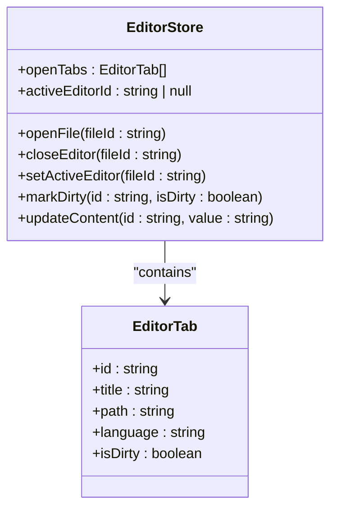
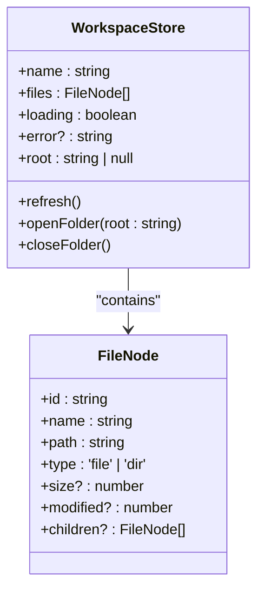
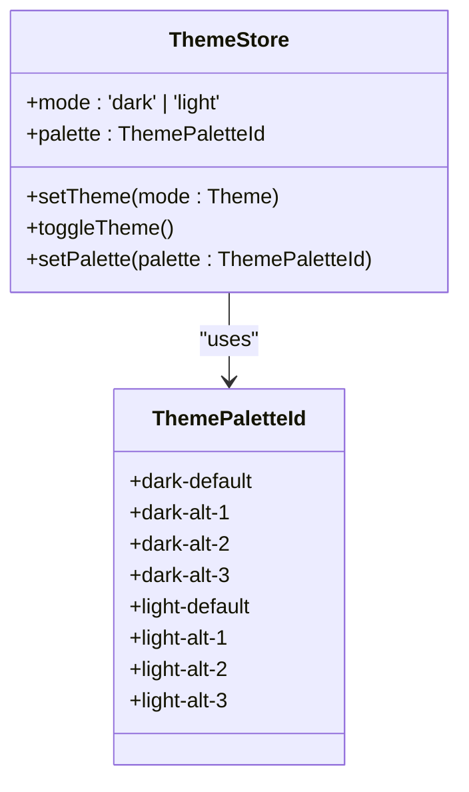
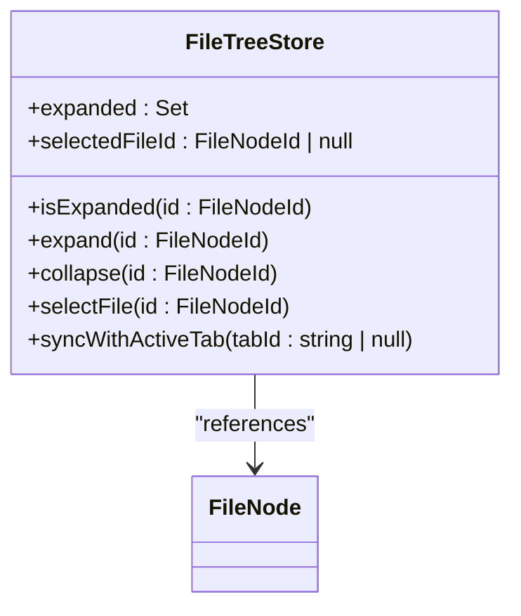
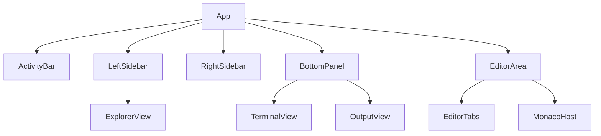
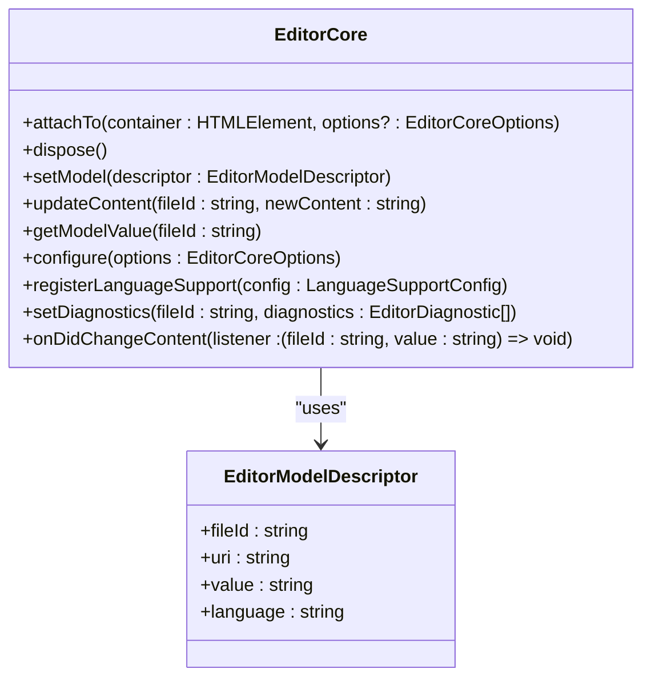
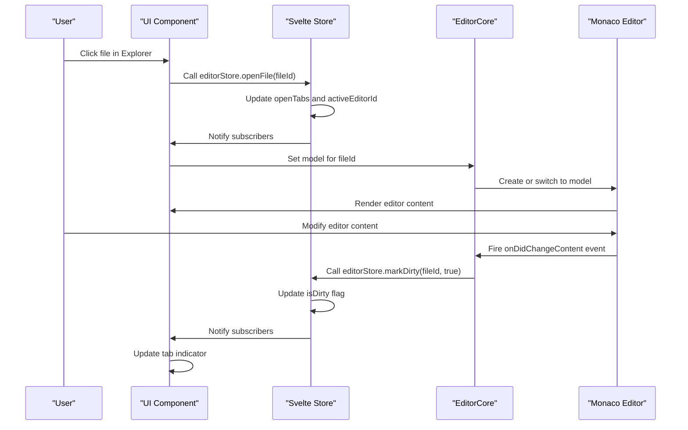
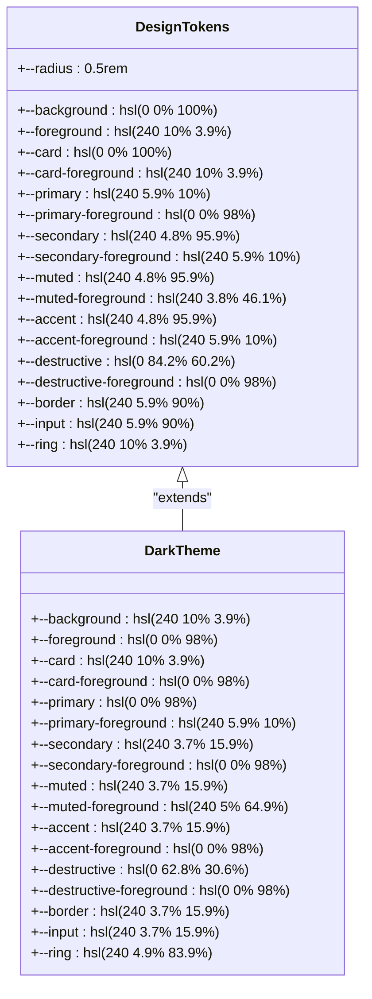
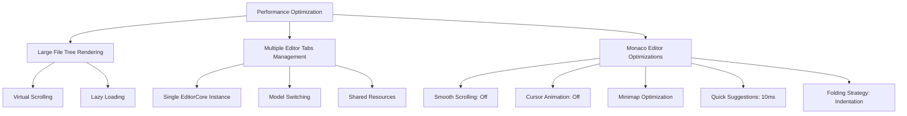

# Frontend Architecture

<cite>
**Referenced Files in This Document**   
- [editorStore.ts](file://src/lib/stores/editorStore.ts)
- [workspaceStore.ts](file://src/lib/stores/workspaceStore.ts)
- [themeStore.ts](file://src/lib/stores/themeStore.ts)
- [fileTreeStore.ts](file://src/lib/stores/fileTreeStore.ts)
- [EditorCore.ts](file://src/lib/editor/EditorCore.ts)
- [editorGroupsStore.ts](file://src/lib/stores/layout/editorGroupsStore.ts)
- [layoutStore.ts](file://src/lib/stores/layout/layoutStore.ts)
- [themeManager.ts](file://src/lib/editor/themeManager.ts)
- [fileNode.ts](file://src/lib/types/fileNode.ts)
- [MonacoHost.svelte](file://src/lib/editor/MonacoHost.svelte)
- [ExplorerView.svelte](file://src/lib/sidebar/ExplorerView.svelte)
- [EditorTabs.svelte](file://src/lib/layout/EditorTabs.svelte)
- [svelte.config.js](file://svelte.config.js)
- [app.css](file://src/app.css)
</cite>

## Table of Contents
1. [Introduction](#introduction)
2. [Svelte 5 Architecture and Reactivity System](#svelte-5-architecture-and-reactivity-system)
3. [State Management with Svelte Stores](#state-management-with-svelte-stores)
4. [Component Hierarchy and Composition Patterns](#component-hierarchy-and-composition-patterns)
5. [Integration with Monaco Editor](#integration-with-monaco-editor)
6. [Data Flow and User Interactions](#data-flow-and-user-interactions)
7. [Technical Decisions Behind Svelte 5 Adoption](#technical-decisions-behind-svelte-5-adoption)
8. [Styling Architecture with Tailwind CSS v4](#styling-architecture-with-tailwind-css-v4)
9. [Performance Considerations](#performance-considerations)
10. [Conclusion](#conclusion)

## Introduction
The NC code editor frontend is built on Svelte 5, leveraging its compile-time reactivity system and component model to create a responsive and efficient development environment. This documentation provides a comprehensive overview of the architectural decisions, state management patterns, component composition, and integration strategies that define the editor's frontend layer. The system is designed to handle complex editor state, workspace navigation, theme management, and file tree operations while maintaining high performance and a clean separation of concerns.

## Svelte 5 Architecture and Reactivity System
The NC code editor leverages Svelte 5's compile-time reactivity system to create a highly efficient and responsive user interface. Unlike runtime-based frameworks, Svelte 5 compiles components into minimal JavaScript that directly manipulates the DOM, resulting in faster execution and smaller bundle sizes. The reactivity system is based on a fine-grained dependency tracking mechanism where changes to reactive variables automatically trigger updates to only the affected parts of the DOM.

Svelte 5's reactivity is implemented through writable and derived stores, which serve as the foundation for state management across the application. The compiler analyzes the component code to identify reactive dependencies and generates optimized update functions that minimize unnecessary computations. This approach eliminates the need for virtual DOM diffing and reduces the overhead associated with change detection in other frameworks.

The component model in Svelte 5 emphasizes simplicity and composability, allowing developers to create reusable UI elements with minimal boilerplate. Components are defined in `.svelte` files that combine HTML, CSS, and JavaScript in a single module, promoting encapsulation and maintainability. The compiler processes these components to generate efficient JavaScript code that integrates seamlessly with the rest of the application.

**Section sources**
- [svelte.config.js](file://svelte.config.js)
- [MonacoHost.svelte](file://src/lib/editor/MonacoHost.svelte)
- [ExplorerView.svelte](file://src/lib/sidebar/ExplorerView.svelte)
- [EditorTabs.svelte](file://src/lib/layout/EditorTabs.svelte)

## State Management with Svelte Stores
The NC code editor implements a comprehensive state management system using Svelte stores to manage editor state, workspace state, theme state, and file tree state. Each store serves as a single source of truth for its respective domain, ensuring consistency and predictability across the application.

### Editor State Management
The `editorStore` manages the state of editor tabs, including their content, language, and dirty status. It maintains a list of open tabs and the currently active editor ID, providing methods to open, close, and switch between files. The store is designed to be independent of the Monaco Editor instance, allowing for clean separation between UI state and editor functionality.

**Diagram sources**
- [editorStore.ts](file://src/lib/stores/editorStore.ts#L42-L53)

### Workspace State Management
The `workspaceStore` manages the file system structure of the current workspace, maintaining a tree of file nodes that can be navigated and manipulated. It integrates with the Tauri backend to synchronize the UI with the actual file system, automatically refreshing when files are created, modified, or deleted.

**Diagram sources**
- [workspaceStore.ts](file://src/lib/stores/workspaceStore.ts#L11-L17)
- [fileNode.ts](file://src/lib/types/fileNode.ts#L10-L18)

### Theme State Management
The `themeStore` manages the UI theme and color palette, providing a reactive interface for switching between light and dark modes and selecting different color schemes. It maintains the current theme mode and palette ID, with methods to toggle themes and update color schemes.

**Diagram sources**
- [themeStore.ts](file://src/lib/stores/themeStore.ts#L24-L27)

### File Tree State Management
The `fileTreeStore` manages the state of the file explorer, tracking which directories are expanded and which file is currently selected. It synchronizes with the active editor tab to ensure the file tree reflects the currently open file, expanding parent directories as needed.

**Diagram sources**
- [fileTreeStore.ts](file://src/lib/stores/fileTreeStore.ts#L27-L30)

## Component Hierarchy and Composition Patterns
The NC code editor follows a hierarchical component structure that mirrors the layout of a typical code editor interface. The main application component contains top-level layout elements such as the activity bar, sidebars, and editor area, which are composed of specialized subcomponents.

### Layout Components
The layout is managed by the `layoutStore`, which tracks the visibility and dimensions of various UI containers. This store enables responsive behavior, allowing users to show/hide sidebars and resize panels according to their preferences. The `EditorTabs` component displays the list of open editor tabs, providing controls for switching between files and managing tab groups.

**Diagram sources**
- [layoutStore.ts](file://src/lib/stores/layout/layoutStore.ts#L13-L23)
- [EditorTabs.svelte](file://src/lib/layout/EditorTabs.svelte)

### Editor Components
The `MonacoHost` component serves as the container for the Monaco Editor instance, managing its lifecycle and configuration. It subscribes to the `editorStore` to receive updates about the active file and content, synchronizing the editor state accordingly. The component also handles editor configuration changes, such as theme updates and editor settings.

### Sidebar Components
The `ExplorerView` component renders the file tree using the state from `fileTreeStore` and `workspaceStore`. It provides interactive controls for expanding/collapsing directories, selecting files, and performing file operations. The component uses virtual scrolling to efficiently render large file trees without performance degradation.

**Section sources**
- [MonacoHost.svelte](file://src/lib/editor/MonacoHost.svelte)
- [ExplorerView.svelte](file://src/lib/sidebar/ExplorerView.svelte)
- [EditorTabs.svelte](file://src/lib/layout/EditorTabs.svelte)

## Integration with Monaco Editor
The NC code editor integrates with the Monaco Editor through a carefully designed abstraction layer that separates the editor's functionality from its UI representation. The `EditorCore` class encapsulates all interactions with the Monaco Editor API, providing a simplified interface for managing editor models, configurations, and events.

### EditorCore API
The `EditorCore` exposes a comprehensive API for controlling the editor instance, including methods for attaching to DOM containers, managing editor models, and configuring editor options. It handles the creation and disposal of text models, ensuring that each file has a corresponding model in the editor.

**Diagram sources**
- [EditorCore.ts](file://src/lib/editor/EditorCore.ts#L163-L314)

### Reactive Bindings
The integration between Svelte stores and the Monaco Editor instance is achieved through reactive bindings that synchronize state changes in both directions. When a user opens a file, the `editorStore` updates its state, which triggers the `MonacoHost` component to set the corresponding model in the editor. Conversely, when the user modifies content in the editor, the `onDidChangeContent` event is captured and used to update the `editorStore`, marking the tab as dirty.

The `themeStore` is integrated with the editor through the `themeManager`, which translates UI theme changes into corresponding Monaco Editor themes. When the user switches themes, the `themeManager` creates a custom theme based on the selected palette and applies it to the editor instance.

**Section sources**
- [EditorCore.ts](file://src/lib/editor/EditorCore.ts)
- [themeManager.ts](file://src/lib/editor/themeManager.ts)
- [MonacoHost.svelte](file://src/lib/editor/MonacoHost.svelte)

## Data Flow and User Interactions
The data flow in the NC code editor follows a unidirectional pattern where user interactions trigger state updates that propagate through the system, resulting in UI re-renders. This predictable flow ensures that the application state remains consistent and debuggable.

### User Interaction Flow
When a user performs an action such as opening a file or modifying content, the following sequence occurs:

**Diagram sources**
- [editorStore.ts](file://src/lib/stores/editorStore.ts)
- [EditorCore.ts](file://src/lib/editor/EditorCore.ts)
- [MonacoHost.svelte](file://src/lib/editor/MonacoHost.svelte)

### State Synchronization
The system maintains synchronization between different state stores to ensure a consistent user experience. For example, when a user switches to a different editor tab, the `fileTreeStore` automatically updates to reveal and select the corresponding file in the explorer. This is achieved through subscriptions that listen for changes in the `activeEditor` derived store.

Similarly, layout changes such as resizing the sidebar are reflected in the `layoutStore`, which notifies all subscribed components to update their dimensions accordingly. This centralized approach to layout management ensures that all UI elements remain synchronized regardless of which component initiated the change.

**Section sources**
- [fileTreeStore.ts](file://src/lib/stores/fileTreeStore.ts)
- [layoutStore.ts](file://src/lib/stores/layout/layoutStore.ts)

## Technical Decisions Behind Svelte 5 Adoption
The decision to use Svelte 5 for the NC code editor frontend was driven by several key technical considerations that align with the project's goals of performance, maintainability, and developer experience.

### Compile-Time Reactivity
Svelte 5's compile-time reactivity system eliminates the overhead associated with runtime change detection, resulting in faster execution and smaller bundle sizes. By analyzing the component code at build time, the compiler can generate optimized JavaScript that directly updates the DOM when reactive values change, without the need for virtual DOM diffing or complex dependency tracking mechanisms.

This approach provides significant performance benefits, especially for complex UIs with many reactive elements. The generated code is highly efficient, containing only the necessary update logic for each component, which reduces both memory usage and execution time.

### Small Bundle Size
One of the primary advantages of Svelte 5 is its ability to produce extremely small bundle sizes. Since the framework code is compiled away during the build process, the resulting application contains only the necessary JavaScript for the specific components and functionality used. This is particularly important for a code editor, where fast startup times and efficient memory usage are critical.

The absence of a runtime framework also reduces the attack surface and potential security vulnerabilities, making the application more robust and secure. Additionally, the smaller bundle size improves load times, especially for users with slower internet connections.

### Developer Experience
Svelte 5 offers an excellent developer experience through its simple syntax and minimal boilerplate. The single-file component structure, which combines HTML, CSS, and JavaScript in one module, promotes encapsulation and makes it easier to understand and maintain components. The reactivity system is intuitive and requires minimal setup, allowing developers to focus on building features rather than managing state.

The compiler provides helpful error messages and warnings during development, catching potential issues before they reach production. This proactive approach to error detection improves code quality and reduces debugging time.

**Section sources**
- [svelte.config.js](file://svelte.config.js)
- [package.json](file://package.json)

## Styling Architecture with Tailwind CSS v4
The NC code editor uses Tailwind CSS v4 for styling, leveraging its utility-first approach to create a consistent and maintainable design system. The styling architecture is built around a combination of Tailwind's utility classes and custom CSS variables that define the application's visual identity.

### Design Tokens and Variables
The application defines a comprehensive set of CSS variables in the `:root` selector that establish the color palette, typography, and spacing system. These variables are used throughout the application to ensure consistency and make it easy to implement theme switching.

**Diagram sources**
- [app.css](file://src/app.css#L6-L65)

### Utility-First Styling
The application extensively uses Tailwind's utility classes to style components directly in the markup. This approach eliminates the need for custom CSS files and makes it easier to understand the styling of a component by looking at its template. The utility classes are composable, allowing developers to create complex layouts and designs by combining simple, single-purpose classes.

The integration with Svelte is seamless, as the utility classes can be conditionally applied using Svelte's reactive expressions. This enables dynamic styling based on component state without the need for additional CSS classes or JavaScript logic.

**Section sources**
- [app.css](file://src/app.css)
- [ExplorerView.svelte](file://src/lib/sidebar/ExplorerView.svelte)

## Performance Considerations
The NC code editor implements several performance optimizations to ensure smooth operation even with large codebases and complex UI interactions.

### Large File Tree Rendering
To efficiently render large file trees, the `ExplorerView` component uses virtual scrolling to only render the visible portion of the tree. This approach significantly reduces the number of DOM nodes and improves rendering performance, especially when working with directories containing thousands of files.

The component also implements lazy loading for directory contents, only fetching and rendering child nodes when a directory is expanded. This reduces the initial load time and memory usage, as the entire file tree does not need to be loaded into memory at once.

### Multiple Editor Tabs Management
The editor efficiently manages multiple tabs by only keeping the active editor instance fully initialized, while inactive tabs maintain their state in the `editorStore` without consuming editor resources. When a user switches to a different tab, the `EditorCore` quickly switches to the corresponding model without recreating the entire editor instance, preserving undo/redo history and other editor state.

The `editorGroupsStore` enables efficient management of multiple editor groups, allowing users to split the editor area without duplicating resources. Each group shares the same `EditorCore` instance, with only the active group consuming full editor resources.

### Monaco Editor Optimizations
The `EditorCore` implements several performance optimizations for the Monaco Editor instance, including:

- Disabling smooth scrolling to improve responsiveness
- Turning off cursor smooth caret animation to reduce GPU usage
- Limiting minimap rendering to improve performance with large files
- Setting quick suggestions delay to 10ms for immediate feedback
- Using indentation-based folding strategy instead of language-based for faster performance

These optimizations ensure that the editor remains responsive even with large files and complex syntax highlighting.

**Diagram sources**
- [EditorCore.ts](file://src/lib/editor/EditorCore.ts#L350-L356)
- [ExplorerView.svelte](file://src/lib/sidebar/ExplorerView.svelte)

**Section sources**
- [EditorCore.ts](file://src/lib/editor/EditorCore.ts)
- [ExplorerView.svelte](file://src/lib/sidebar/ExplorerView.svelte)

## Conclusion
The frontend architecture of the NC code editor demonstrates a thoughtful integration of Svelte 5's compile-time reactivity system with the powerful Monaco Editor, creating a responsive and efficient development environment. The use of Svelte stores provides a clean and predictable state management solution, while the component hierarchy and composition patterns promote reusability and maintainability.

The decision to adopt Svelte 5 was justified by its performance advantages, small bundle size, and excellent developer experience, making it well-suited for a complex application like a code editor. The integration with Tailwind CSS v4 enables a consistent and maintainable styling system that supports theme switching and responsive design.

Through careful performance optimizations, the editor is able to handle large file trees and multiple editor tabs efficiently, providing a smooth user experience even with demanding workloads. The architecture's modular design and clear separation of concerns make it easy to extend and maintain, ensuring that the editor can continue to evolve to meet the needs of developers.