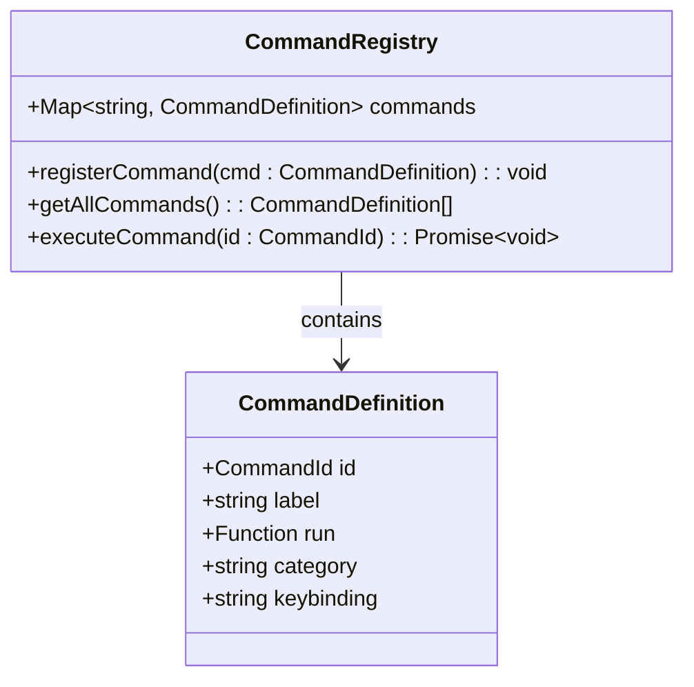
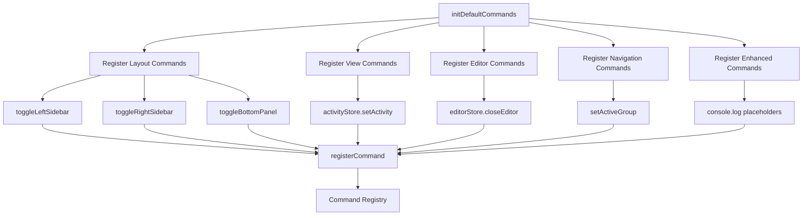
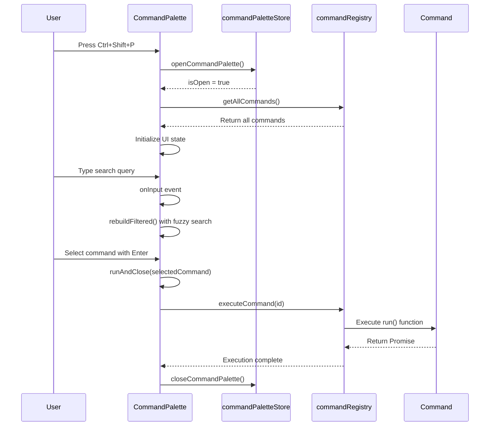

# Command System

<cite>
**Referenced Files in This Document**   
- [commandRegistry.ts](file://src/lib/commands/commandRegistry.ts)
- [defaultCommands.ts](file://src/lib/commands/defaultCommands.ts)
- [CommandPalette.svelte](file://src/lib/commands/CommandPalette.svelte)
- [commandPaletteStore.ts](file://src/lib/stores/commandPaletteStore.ts)
- [layoutStore.ts](file://src/lib/stores/layout/layoutStore.ts)
- [settings/commands.ts](file://src/lib/settings/commands.ts)
</cite>

## Table of Contents
1. [Command System Overview](#command-system-overview)
2. [Command Registry Architecture](#command-registry-architecture)
3. [Default Commands Implementation](#default-commands-implementation)
4. [Command Palette UI Component](#command-palette-ui-component)
5. [Command Execution Flow](#command-execution-flow)
6. [Keybinding System](#keybinding-system)
7. [Command Categories and Organization](#command-categories-and-organization)
8. [Command Invocation Methods](#command-invocation-methods)
9. [Extensibility and Custom Commands](#extensibility-and-custom-commands)

## Command System Overview

The NC code editor's command system provides a centralized framework for managing and executing application functionality through a unified interface. Inspired by VS Code's Command Palette architecture, the system enables users to discover and execute commands through multiple interfaces including keyboard shortcuts, command palette search, and direct API calls. The command system serves as the single source of truth for all executable actions within the application, ensuring consistent behavior across different invocation methods.

The architecture follows a modular design with clear separation between command registration, storage, and user interface components. This design allows for extensibility while maintaining a consistent user experience. The system supports both synchronous and asynchronous command execution, enabling integration with various application components and external services.

**Section sources**
- [commandRegistry.ts](file://src/lib/commands/commandRegistry.ts#L1-L64)
- [defaultCommands.ts](file://src/lib/commands/defaultCommands.ts#L1-L17)

## Command Registry Architecture

The command registry serves as the central hub for all commands in the NC editor, implementing a singleton pattern that acts as the single source of truth for command definitions. The registry is implemented as a Map-based storage system that allows for efficient command lookup and dynamic registration. Each command is identified by a unique string ID following the VS Code-inspired naming convention (e.g., "workbench.action.toggleSidebarVisibility").

The registry exposes three primary functions: `registerCommand`, `getAllCommands`, and `executeCommand`. The `registerCommand` function accepts a CommandDefinition object containing the command ID, label, execution function, optional category, and keybinding. When a command is registered with an ID that already exists, it is replaced according to the "last write wins" principle, enabling runtime command overrides. The registry performs basic validation on command definitions, ensuring that required fields are present and that the execution function is callable, but avoids throwing runtime exceptions to prevent application crashes.

**Diagram sources**
- [commandRegistry.ts](file://src/lib/commands/commandRegistry.ts#L18-L28)

**Section sources**
- [commandRegistry.ts](file://src/lib/commands/commandRegistry.ts#L30-L64)

## Default Commands Implementation

The default commands module registers a comprehensive set of built-in commands that cover essential editor functionality. These commands are organized into logical categories such as View, File, Editor, Preferences, Terminal, and Search, following the VS Code workbench command pattern. The implementation leverages existing application stores and services to perform actions, creating a thin integration layer between the command system and the underlying functionality.

Commands are registered through the `initDefaultCommands` function, which ensures idempotent execution by using a flag to prevent multiple initializations. The module imports necessary functions from various stores including layoutStore, activityStore, editorGroupsStore, and editorStore to implement command logic. For example, the "Toggle Primary Sidebar Visibility" command uses the `toggleLeftSidebar` function from layoutStore, while the "Close Active Editor" command utilizes `editorStore.closeEditor`.

The implementation includes both immediate commands and placeholder commands for future functionality. Commands like "Toggle Word Wrap" and "Go to Line" include console.log statements indicating that they will be implemented with Monaco editor integration, providing a clear roadmap for future development while maintaining the command structure.

**Diagram sources**
- [defaultCommands.ts](file://src/lib/commands/defaultCommands.ts#L35-L268)

**Section sources**
- [defaultCommands.ts](file://src/lib/commands/defaultCommands.ts#L1-L269)
- [layoutStore.ts](file://src/lib/stores/layout/layoutStore.ts#L53-L95)

## Command Palette UI Component

The Command Palette UI component provides a searchable interface for discovering and executing commands, inspired by VS Code's F1 command palette. Implemented as a Svelte component, it offers a modal dialog that can be opened and closed through the commandPaletteStore. The component supports keyboard navigation, mouse interaction, and drag functionality, allowing users to position the palette anywhere on the screen.

The UI features a search input field with real-time filtering of available commands. As users type, the component performs fuzzy search matching against command labels and IDs, scoring results based on relevance. The search algorithm prioritizes prefix matches and shorter command labels, providing intuitive results. When the search query is empty, the component displays recently used commands first, followed by all other commands in alphabetical order, enhancing discoverability of frequently used actions.

The command list displays each command with its label, optional keybinding, command ID, and category. Selected commands are highlighted with visual feedback, and keyboard navigation is fully supported with arrow keys, Enter to execute, and Escape to close. The component also maintains a history of executed commands, limited to 20 entries using an LRU (Least Recently Used) strategy, which appears when the search field is empty.

**Diagram sources**
- [CommandPalette.svelte](file://src/lib/commands/CommandPalette.svelte#L1-L441)
- [commandPaletteStore.ts](file://src/lib/stores/commandPaletteStore.ts#L19-L28)

**Section sources**
- [CommandPalette.svelte](file://src/lib/commands/CommandPalette.svelte#L1-L441)
- [commandPaletteStore.ts](file://src/lib/stores/commandPaletteStore.ts#L1-L29)

## Command Execution Flow

The command execution flow follows a well-defined sequence from invocation to completion, ensuring consistent behavior across different command sources. When a command is executed through any interface, the process begins with the `executeCommand` function in the command registry, which looks up the command by its ID. If the command exists, its execution function is called, supporting both synchronous and asynchronous operations through Promise handling.

For commands invoked through the Command Palette, additional steps are included in the flow. Before execution, the selected command is added to the history list using the `touchHistory` function, which implements the LRU strategy by moving the command to the front of the list and truncating if necessary. After successful execution, the Command Palette is automatically closed, providing a seamless user experience.

The execution flow is designed to be resilient, with no-op behavior when commands are not found rather than throwing exceptions. This prevents application crashes due to missing commands while still allowing for command overrides and dynamic registration. The system supports both immediate execution of simple actions and complex workflows that may involve multiple application components.

**Section sources**
- [commandRegistry.ts](file://src/lib/commands/commandRegistry.ts#L60-L64)
- [CommandPalette.svelte](file://src/lib/commands/CommandPalette.svelte#L217-L222)

## Keybinding System

The keybinding system integrates keyboard shortcuts with the command registry, allowing users to execute commands through familiar keyboard combinations. Keybindings are defined as optional properties within the CommandDefinition interface, using a human-readable string format such as "Ctrl+B" or "Ctrl+Shift+F". This approach follows the VS Code convention, making the system intuitive for users familiar with other code editors.

The implementation supports standard modifier keys including Ctrl, Shift, Alt, and platform-specific keys. When a keybinding is defined for a command, it appears in the Command Palette next to the command label, providing visual feedback about available shortcuts. The system does not currently include a dedicated keybinding resolver that listens for keyboard events globally, but the architecture is designed to support this functionality through the command registry's central role.

Keybindings are registered alongside commands in the defaultCommands module, with common shortcuts assigned to frequently used actions. For example, "Ctrl+B" is assigned to toggle the primary sidebar visibility, "Ctrl+`" toggles the terminal panel, and "Ctrl+Shift+F" opens the search functionality. This consistent mapping enhances discoverability and muscle memory for users.

**Section sources**
- [defaultCommands.ts](file://src/lib/commands/defaultCommands.ts#L50-L51)
- [defaultCommands.ts](file://src/lib/commands/defaultCommands.ts#L210-L211)

## Command Categories and Organization

Commands are organized into logical categories to improve discoverability and provide a structured browsing experience in the Command Palette. The category system follows the VS Code workbench command pattern, with top-level categories including View, File, Editor, Preferences, Terminal, and Search. Each category groups related commands, making it easier for users to find functionality even when they don't know the exact command name.

The category information is displayed in the Command Palette alongside each command, providing context about the command's purpose. When commands are listed without a search query, they are grouped by category with visual separators, creating a clean organizational structure. This categorization also supports filtering, as users can include category names in their search queries to narrow down results.

The system allows for hierarchical categorization through the command ID structure, with namespaces like "workbench.action.*", "workbench.view.*", and "editor.action.*" indicating the command's domain. This naming convention enables both human readability and programmatic filtering, supporting advanced discovery features in future implementations.

**Section sources**
- [defaultCommands.ts](file://src/lib/commands/defaultCommands.ts#L49-L50)
- [CommandPalette.svelte](file://src/lib/commands/CommandPalette.svelte#L327-L328)

## Command Invocation Methods

Commands can be invoked through multiple interfaces, providing flexibility and catering to different user preferences. The primary method is through the Command Palette, which can be opened with the Ctrl+Shift+P keyboard shortcut (when implemented) or through a menu option. Once open, users can search for commands by name or browse through the categorized list.

Keyboard shortcuts provide a faster alternative for frequently used commands, allowing experienced users to execute actions without navigating through menus or searching. The system displays available keybindings in the Command Palette, helping users learn shortcuts over time. Direct API calls enable programmatic execution of commands from other parts of the application, supporting complex workflows and integrations.

The executeCommand function serves as the central entry point for all command invocations, ensuring consistent behavior regardless of the calling context. This unified execution model simplifies error handling and logging, as all commands pass through the same execution pipeline. The system's design also supports future expansion of invocation methods, such as voice commands or gesture-based interfaces.

**Section sources**
- [commandRegistry.ts](file://src/lib/commands/commandRegistry.ts#L60-L64)
- [CommandPalette.svelte](file://src/lib/commands/CommandPalette.svelte#L197-L203)

## Extensibility and Custom Commands

The command system is designed with extensibility in mind, allowing for the addition of custom functionality through programmatic command registration. Third-party extensions or application modules can register new commands using the `registerCommand` function, integrating their functionality into the unified command interface. This approach enables a consistent user experience across built-in and custom features.

The settings module demonstrates this extensibility pattern through its `registerSettingsCommands` and `registerPerSettingCommands` functions, which register commands for opening specific settings sections and individual settings. These functions accept a context object that provides the necessary integration points, such as the `openSettingsShell` function, allowing for dependency injection and loose coupling.

The system supports parameterized commands through command ID patterns like "settings.open.section.*" and "settings.open.setting.*", enabling dynamic command generation based on application state. This pattern can be extended to other domains, allowing for scalable command registration without requiring predefined command IDs for every possible variation.

**Section sources**
- [settings/commands.ts](file://src/lib/settings/commands.ts#L50-L174)
- [commandRegistry.ts](file://src/lib/commands/commandRegistry.ts#L38-L45)