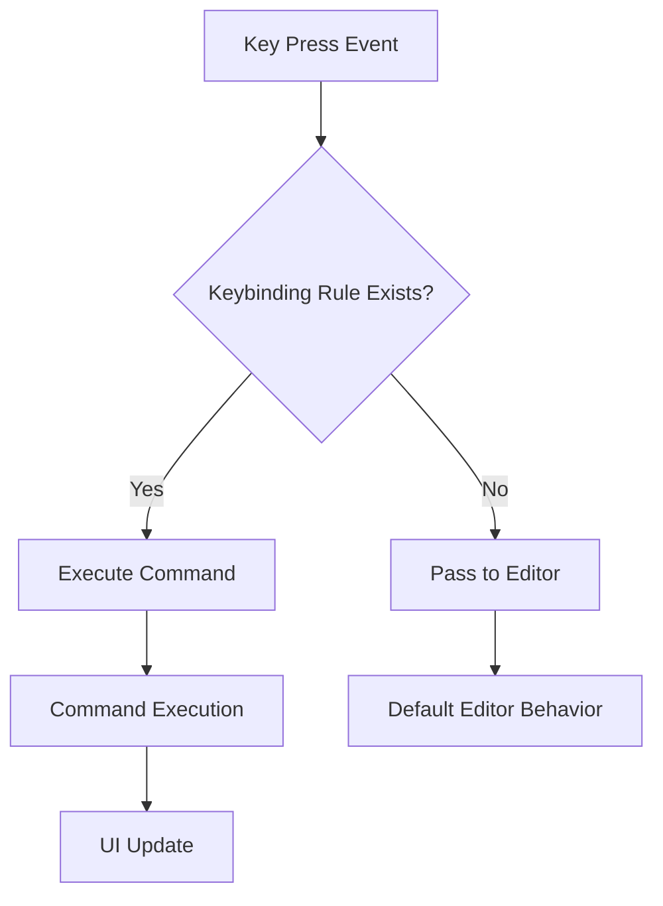
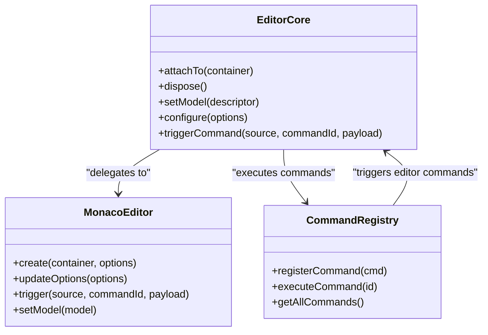

# Keybindings

<cite>
**Referenced Files in This Document**   
- [commandRegistry.ts](file://src/lib/commands/commandRegistry.ts)
- [defaultCommands.ts](file://src/lib/commands/defaultCommands.ts)
- [EditorCore.ts](file://src/lib/editor/EditorCore.ts)
- [monacoEnvironment.ts](file://src/lib/editor/monacoEnvironment.ts)
- [commands.ts](file://src/lib/settings/commands.ts)
- [commandPaletteStore.ts](file://src/lib/stores/commandPaletteStore.ts)
</cite>

## Table of Contents
1. [Introduction](#introduction)
2. [Command Registry System](#command-registry-system)
3. [Keybinding Rules and Default Commands](#keybinding-rules-and-default-commands)
4. [Keybinding Resolution Process](#keybinding-resolution-process)
5. [Monaco Editor Integration](#monaco-editor-integration)
6. [Settings and Customization](#settings-and-customization)
7. [Global vs Context-Specific Keybindings](#global-vs-context-specific-keybindings)
8. [Adding New Keybindings](#adding-new-keybindings)
9. [Troubleshooting Common Issues](#troubleshooting-common-issues)

## Introduction
The NC code editor implements a comprehensive keybindings system that maps keyboard shortcuts to commands through a centralized command registry. This system enables users to efficiently navigate and interact with the editor through keyboard shortcuts, with support for both global and context-specific bindings. The architecture is inspired by VS Code's command palette and workbench commands API, adapted for the SvelteKit/Tauri v2 environment. Keybindings are integrated with the Monaco editor for editor-specific functionality while maintaining a unified command system across the application.

## Command Registry System
The command registry serves as the single source of truth for all commands in the NC editor, including those accessible through the command palette, global hotkeys, and internal command invocations. This registry provides a centralized mechanism for command management and execution.

The system is implemented in `commandRegistry.ts` and exposes three primary functions:
- `registerCommand`: Registers or overrides a command by ID (last write wins)
- `getAllCommands`: Retrieves all registered commands for UI components like the command palette
- `executeCommand`: Executes a command by ID, handling both synchronous and asynchronous operations

Commands are defined with an ID, label, execution function, optional category, and optional keybinding. The registry uses a Map data structure for efficient command lookup and allows commands to be redefined at runtime. This design enables dynamic command registration and ensures that the most recently registered command with a given ID takes precedence.

**Section sources**
- [commandRegistry.ts](file://src/lib/commands/commandRegistry.ts#L1-L64)

## Keybinding Rules and Default Commands
Keybinding rules in the NC editor specify the relationship between key combinations and command IDs. These rules are defined within the command definitions themselves, with the keybinding property containing the keyboard shortcut as a string (e.g., "Ctrl+B").

The default commands are registered in `defaultCommands.ts`, which sets up essential functionality for the editor. Key default keybindings include:
- `Ctrl+B`: Toggle primary sidebar visibility
- `Ctrl+``: Toggle terminal (bottom panel)
- `Ctrl+Shift+F`: Find in files (opens search view)
- `Ctrl+G`: Go to line
- `Ctrl+Shift+O`: Go to symbol in editor

These commands follow a naming convention similar to VS Code, using prefixes like "workbench.action" for UI commands and "editor.action" for editor-specific operations. The system supports multi-part keybindings (chords) and modifier keys (Ctrl, Alt, Shift, Meta). Commands are organized into categories such as View, File, Editor, Preferences, and Terminal for better organization in the command palette.

**Diagram sources**
- [defaultCommands.ts](file://src/lib/commands/defaultCommands.ts#L1-L269)

**Section sources**
- [defaultCommands.ts](file://src/lib/commands/defaultCommands.ts#L1-L269)

## Keybinding Resolution Process
The keybinding resolution process handles potential conflicts between different keybindings and prioritizes context-specific bindings over global ones. When a key combination is pressed, the system follows a specific resolution order to determine which command should execute.

The resolution process begins with checking for active context-specific bindings that apply to the current editor state or focused component. If no context-specific binding matches, the system falls back to global bindings registered in the command registry. In cases where multiple bindings could apply to the same key combination, the system prioritizes more specific contexts and user-defined overrides over default bindings.

The Monaco editor's keybinding resolver (accessed through the editor core) handles the technical aspects of keybinding resolution, including chord sequences and conditional bindings based on context keys. This resolver maintains mappings from keybindings to commands and from commands to keybindings, allowing for efficient lookup and conflict detection. When conflicts occur, user-defined keybindings take precedence over default ones, following the principle that user preferences should override system defaults.

**Section sources**
- [EditorCore.ts](file://src/lib/editor/EditorCore.ts#L1-L891)
- [keybindingResolver.js](file://node_modules/monaco-editor/esm/vs/platform/keybinding/common/keybindingResolver.js#L1-L305)

## Monaco Editor Integration
The NC editor integrates with the Monaco editor's keybinding system to provide editor-specific shortcuts while maintaining consistency with the global command system. This integration is facilitated through the `EditorCore` class, which serves as a lightweight wrapper around the Monaco editor API.

The `EditorCore` exposes a `triggerCommand` method that allows the application to invoke Monaco's built-in actions such as 'undo', 'redo', 'editor.action.commentLine', and 'editor.action.formatDocument'. This method bridges the custom command registry with Monaco's native command system, enabling seamless execution of editor-specific operations through the same command interface used for UI commands.

Monaco's keybinding system is initialized through the `monacoEnvironment.ts` file, which configures web workers for language features and sets up the editor's environment. The integration supports advanced editor features like IntelliSense, hover providers, and completion providers, all of which can be triggered through keyboard shortcuts. The system also handles the automatic layout and performance optimizations for the editor, ensuring responsive behavior even with complex keybinding configurations.

**Diagram sources**
- [EditorCore.ts](file://src/lib/editor/EditorCore.ts#L1-L891)
- [monacoEnvironment.ts](file://src/lib/editor/monacoEnvironment.ts#L1-L131)

**Section sources**
- [EditorCore.ts](file://src/lib/editor/EditorCore.ts#L1-L891)
- [monacoEnvironment.ts](file://src/lib/editor/monacoEnvironment.ts#L1-L131)

## Settings and Customization
Keybindings in the NC editor are stored in the settings system, allowing users to customize their keyboard shortcuts according to their preferences. The settings integration is implemented through the `commands.ts` file in the settings module, which registers settings-related commands and provides the infrastructure for keybinding customization.

Users can access and modify keybindings through the settings interface, which includes commands like "Open Settings" and "Search Settings" that are accessible via the command palette. The settings system supports registering both static commands (like opening specific settings sections) and dynamic commands (like opening specific settings) through parameterized command registration.

The customization process follows a structured approach where user-defined keybindings are stored separately from default bindings, allowing users to override defaults without modifying the core configuration. This separation ensures that updates to the editor do not overwrite user customizations. The system also provides validation to ensure that keybinding modifications do not create invalid or conflicting configurations.

**Section sources**
- [commands.ts](file://src/lib/settings/commands.ts#L1-L174)

## Global vs Context-Specific Keybindings
The NC editor distinguishes between global keybindings and context-specific keybindings, providing a flexible system that adapts to the current user context. Global keybindings are always active regardless of the editor state and typically control high-level UI elements like sidebars, panels, and navigation.

Context-specific keybindings are only active when certain conditions are met, such as when the editor has focus, when a specific file type is open, or when a particular UI component is active. For example, editor-specific commands like "Go to Line" (Ctrl+G) are only relevant when the text editor has focus, while commands like "Toggle Sidebar" (Ctrl+B) are global and work from any context.

This distinction is implemented through Monaco's context key system, which allows keybindings to be conditional on the current editor state. The command registry works in conjunction with this system to ensure that only relevant commands are available in each context. This approach prevents conflicts between global and editor-specific shortcuts while providing an intuitive user experience where keyboard shortcuts behave predictably based on the current context.

**Section sources**
- [defaultCommands.ts](file://src/lib/commands/defaultCommands.ts#L1-L269)
- [EditorCore.ts](file://src/lib/editor/EditorCore.ts#L1-L891)

## Adding New Keybindings
Adding new keybindings to the NC editor involves registering commands with the command registry and associating them with specific key combinations. The process follows these steps:

1. Define a command with a unique ID, descriptive label, category, execution function, and optional keybinding
2. Register the command using the `registerCommand` function from the command registry
3. Ensure the command's execution function properly interacts with the relevant application components

For editor-specific functionality, developers should use the `EditorCore`'s `triggerCommand` method to invoke Monaco's built-in actions or implement custom editor behavior. When adding context-specific keybindings, developers should consider the appropriate context conditions to prevent conflicts with existing shortcuts.

The system supports programmatic registration of commands, allowing for dynamic command creation based on user configuration or plugin loading. Commands can be re-registered to modify their behavior or keybindings, with the most recent registration taking precedence. This flexibility enables both core functionality and extensibility through plugins or user scripts.

**Section sources**
- [commandRegistry.ts](file://src/lib/commands/commandRegistry.ts#L1-L64)
- [defaultCommands.ts](file://src/lib/commands/defaultCommands.ts#L1-L269)

## Troubleshooting Common Issues
When troubleshooting unresponsive shortcuts in the NC editor, several common issues should be considered:

1. **Keybinding conflicts**: Multiple commands registered to the same key combination may cause unexpected behavior. Check for duplicate keybindings in both default and user-defined configurations.

2. **Context limitations**: Context-specific keybindings only work in the appropriate context. Verify that the required context (e.g., editor focus) is active when attempting to use a context-specific shortcut.

3. **Command registration issues**: Ensure that commands are properly registered with valid execution functions and that the command registry is initialized before attempting to execute commands.

4. **Monaco integration problems**: Editor-specific commands may fail if the Monaco editor instance is not properly initialized or if the editor core is not correctly configured.

5. **Platform-specific differences**: Key combinations may behave differently across operating systems, particularly with modifier keys (Ctrl vs Cmd on macOS).

The command palette serves as a valuable diagnostic tool, as it displays all available commands and their keybindings. If a command appears in the palette but its shortcut doesn't work, the issue is likely related to keybinding resolution or context. If a command doesn't appear at all, the issue is likely with command registration.

**Section sources**
- [commandRegistry.ts](file://src/lib/commands/commandRegistry.ts#L1-L64)
- [EditorCore.ts](file://src/lib/editor/EditorCore.ts#L1-L891)
- [commandPaletteStore.ts](file://src/lib/stores/commandPaletteStore.ts#L1-L29)