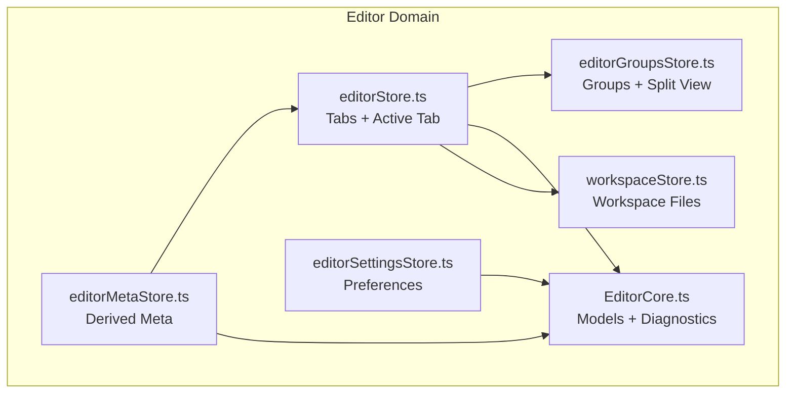
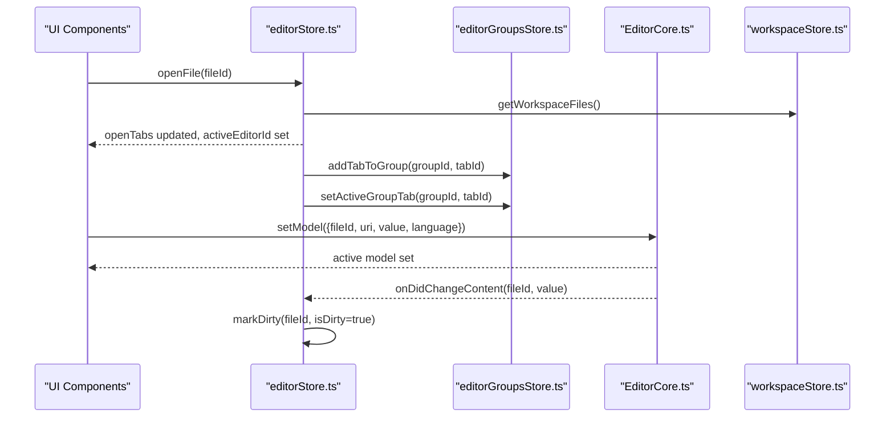
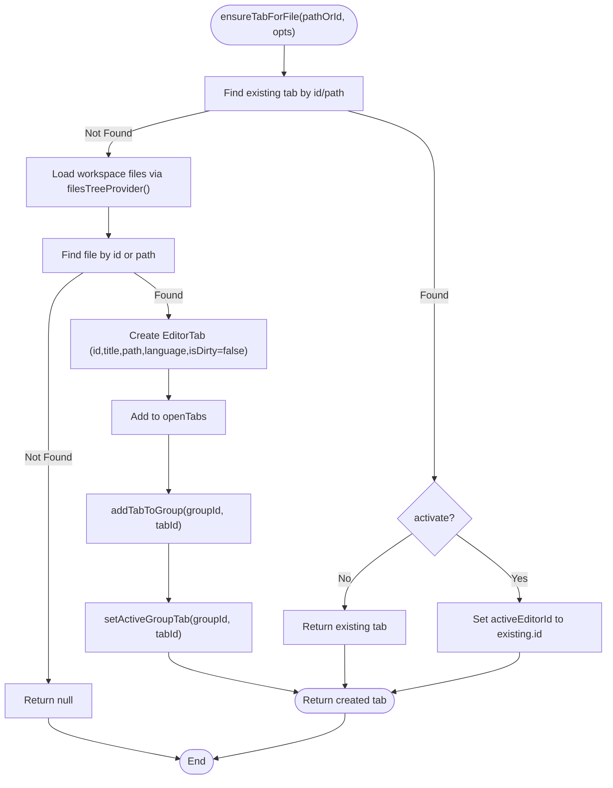
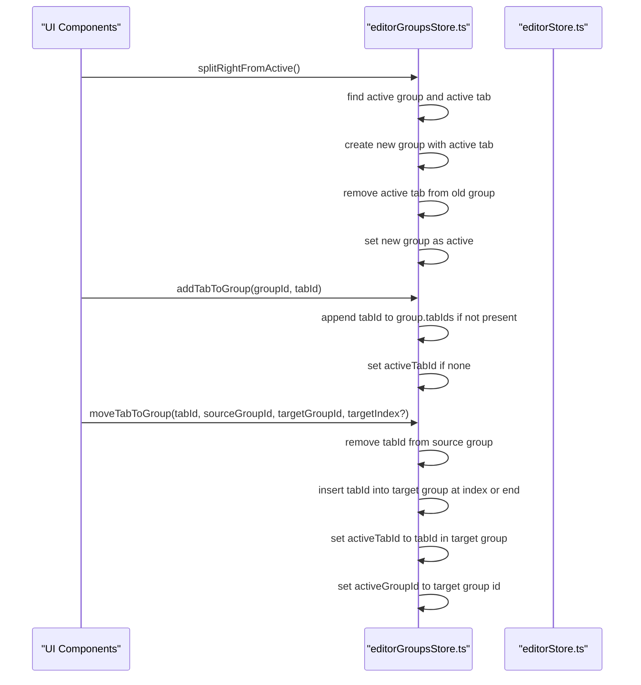
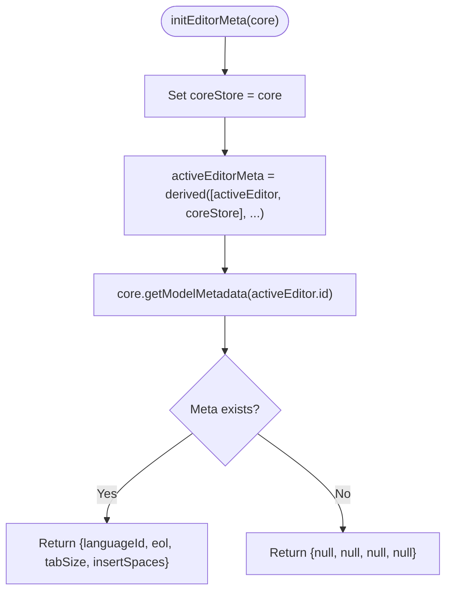
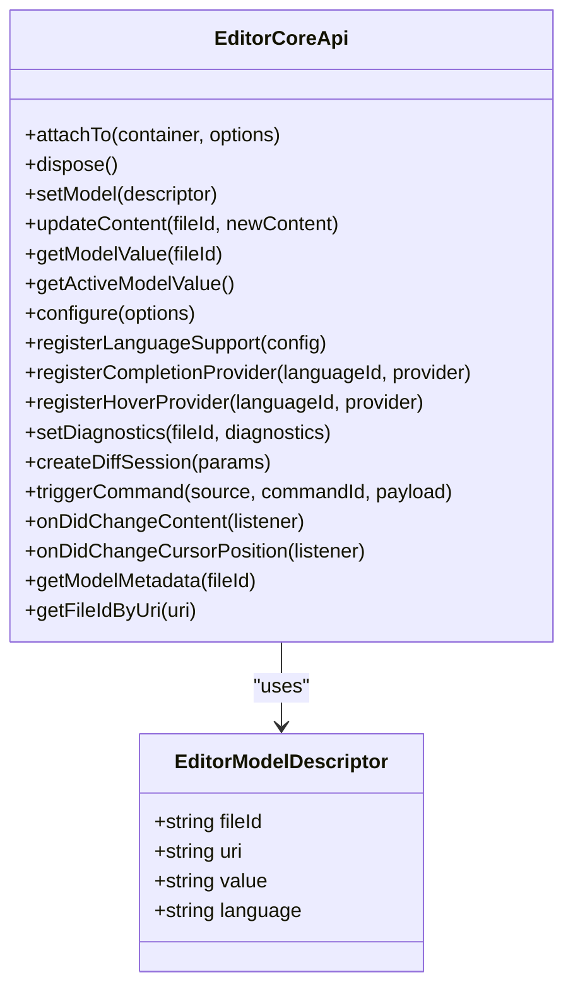
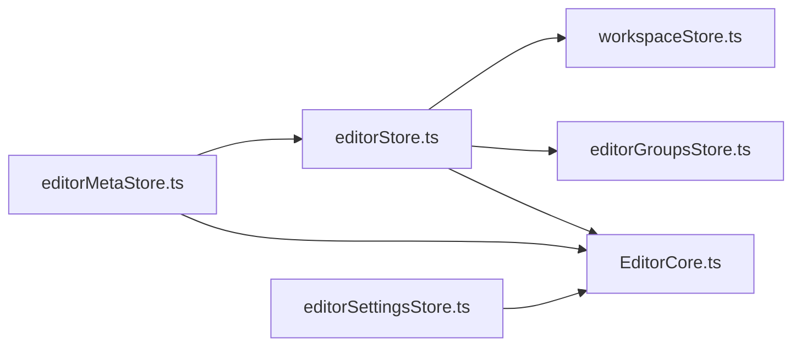

# Editor Store

<cite>
**Referenced Files in This Document**
- [editorStore.ts](file://src/lib/stores/editorStore.ts)
- [editorGroupsStore.ts](file://src/lib/stores/layout/editorGroupsStore.ts)
- [editorMetaStore.ts](file://src/lib/stores/editorMetaStore.ts)
- [editorSettingsStore.ts](file://src/lib/stores/editorSettingsStore.ts)
- [EditorCore.ts](file://src/lib/editor/EditorCore.ts)
- [workspaceStore.ts](file://src/lib/stores/workspaceStore.ts)
- [editorCursorStore.ts](file://src/lib/stores/editorCursorStore.ts)
</cite>

## Table of Contents
1. [Introduction](#introduction)
2. [Project Structure](#project-structure)
3. [Core Components](#core-components)
4. [Architecture Overview](#architecture-overview)
5. [Detailed Component Analysis](#detailed-component-analysis)
6. [Dependency Analysis](#dependency-analysis)
7. [Performance Considerations](#performance-considerations)
8. [Troubleshooting Guide](#troubleshooting-guide)
9. [Conclusion](#conclusion)

## Introduction
This document explains the editorStore and its ecosystem for managing editor tabs, active editor instances, and editor-specific configurations in the NC code editor. It focuses on:
- How editorStore maintains a collection of EditorTab objects and tracks the active tab
- How editor group states are managed separately via editorGroupsStore
- How reactive patterns synchronize editor state across components
- How editorStore integrates with EditorCore for model management and diagnostics
- How it relates to editorMetaStore (cursor/selection metadata) and editorSettingsStore (preferences)
- Practical usage patterns for opening, closing, switching tabs, and splitting views
- Strategies for efficient state management and persistence considerations

## Project Structure
The editor subsystem is organized around three primary stores plus EditorCore:
- editorStore: logical tabs and active tab state
- editorGroupsStore: layout and split-view arrangement of tabs
- editorMetaStore: status bar metadata derived from EditorCore
- editorSettingsStore: editor appearance and behavior preferences
- EditorCore: model lifecycle, diagnostics, and Monaco integration

**Diagram sources**
- [editorStore.ts](file://src/lib/stores/editorStore.ts#L352-L380)
- [editorGroupsStore.ts](file://src/lib/stores/layout/editorGroupsStore.ts#L1-L120)
- [editorMetaStore.ts](file://src/lib/stores/editorMetaStore.ts#L1-L90)
- [EditorCore.ts](file://src/lib/editor/EditorCore.ts#L1-L120)
- [editorSettingsStore.ts](file://src/lib/stores/editorSettingsStore.ts#L1-L60)
- [workspaceStore.ts](file://src/lib/stores/workspaceStore.ts#L1-L60)

**Section sources**
- [editorStore.ts](file://src/lib/stores/editorStore.ts#L1-L120)
- [editorGroupsStore.ts](file://src/lib/stores/layout/editorGroupsStore.ts#L1-L120)

## Core Components
- editorStore: Maintains open tabs and activeEditorId; exposes operations to open/close tabs, set active editor, mark dirty, update content, and open special tabs like Settings. It also ensures a tab exists for a given file identifier and integrates with editorGroupsStore to place tabs into groups and set active tabs.
- editorGroupsStore: Manages editor groups and their tab order and active tab within each group. Provides APIs to add/remove tabs, reorder tabs, move tabs between groups, and split the active view into a new group.
- editorMetaStore: A derived store that reads activeEditor from editorStore and fetches model metadata from EditorCore (language, EOL, tab size, insert spaces).
- editorSettingsStore: Holds Monaco editor preferences (theme, fonts, whitespace rendering, wrapping, minimap, folding, line numbers, bracket pair colorization).
- EditorCore: Encapsulates Monaco Editor operations: model creation/switching, content updates, configuration, diagnostics, diff sessions, and event subscriptions for content changes and cursor positions.

**Section sources**
- [editorStore.ts](file://src/lib/stores/editorStore.ts#L352-L380)
- [editorGroupsStore.ts](file://src/lib/stores/layout/editorGroupsStore.ts#L110-L220)
- [editorMetaStore.ts](file://src/lib/stores/editorMetaStore.ts#L1-L90)
- [editorSettingsStore.ts](file://src/lib/stores/editorSettingsStore.ts#L1-L120)
- [EditorCore.ts](file://src/lib/editor/EditorCore.ts#L160-L320)

## Architecture Overview
The architecture separates concerns:
- editorStore: Single source of truth for EditorTab entities and dirty state
- editorGroupsStore: Layout/controller for how tabs are arranged across groups/splits
- EditorCore: Model manager and Monaco integration
- editorMetaStore: Thin derived layer over activeEditor and EditorCore metadata
- editorSettingsStore: Preferences applied to EditorCore

**Diagram sources**
- [editorStore.ts](file://src/lib/stores/editorStore.ts#L192-L235)
- [editorStore.ts](file://src/lib/stores/editorStore.ts#L237-L282)
- [editorStore.ts](file://src/lib/stores/editorStore.ts#L284-L306)
- [editorGroupsStore.ts](file://src/lib/stores/layout/editorGroupsStore.ts#L173-L201)
- [EditorCore.ts](file://src/lib/editor/EditorCore.ts#L276-L309)
- [workspaceStore.ts](file://src/lib/stores/workspaceStore.ts#L118-L130)

## Detailed Component Analysis

### editorStore: Managing Tabs and Active Editor
Key responsibilities:
- Maintain openTabs and activeEditorId
- Ensure a tab exists for a file (by id or path) and optionally activate it
- Open files, close tabs, set active editor, mark dirty, update content, and open special tabs (e.g., Settings)
- Integrate with editorGroupsStore to add tabs to groups and set active tabs

Implementation highlights:
- Tab identity and metadata: EditorTab includes id, title, path, language, isDirty
- Language detection based on file extension
- Workspace integration via getWorkspaceFiles provider
- Reactive derived activeEditor for backward compatibility
- Persistence of content via fileService and updateContent

Common operations:
- Open a file: ensureTabForFile(pathOrId, { activate, groupId }) or openFile(fileId)
- Switch active tab: setActiveEditor(fileId)
- Close a tab: closeEditor(fileId)
- Mark dirty: markDirty(id, isDirty)
- Update content: updateContent(id, value)
- Open Settings: openSettings()

**Diagram sources**
- [editorStore.ts](file://src/lib/stores/editorStore.ts#L110-L189)
- [editorStore.ts](file://src/lib/stores/editorStore.ts#L192-L235)
- [editorStore.ts](file://src/lib/stores/editorStore.ts#L237-L282)
- [editorStore.ts](file://src/lib/stores/editorStore.ts#L284-L306)
- [editorStore.ts](file://src/lib/stores/editorStore.ts#L308-L338)

**Section sources**
- [editorStore.ts](file://src/lib/stores/editorStore.ts#L32-L80)
- [editorStore.ts](file://src/lib/stores/editorStore.ts#L82-L189)
- [editorStore.ts](file://src/lib/stores/editorStore.ts#L192-L338)
- [editorStore.ts](file://src/lib/stores/editorStore.ts#L352-L380)

### editorGroupsStore: Managing Editor Groups and Split Views
Key responsibilities:
- Track groups, each with a list of tab ids and an active tab id
- Provide APIs to manage group membership and active tab
- Support moving tabs between groups, reordering within a group, and splitting the active view into a new group

Important behaviors:
- One active group and one active tab per group
- Ensures active group and active tab are consistent
- Supports moving a tab from one group to another and setting it as active in the target group
- Split right from active creates a new group and moves the active tab to it

**Diagram sources**
- [editorGroupsStore.ts](file://src/lib/stores/layout/editorGroupsStore.ts#L173-L201)
- [editorGroupsStore.ts](file://src/lib/stores/layout/editorGroupsStore.ts#L224-L326)
- [editorGroupsStore.ts](file://src/lib/stores/layout/editorGroupsStore.ts#L328-L373)

**Section sources**
- [editorGroupsStore.ts](file://src/lib/stores/layout/editorGroupsStore.ts#L1-L120)
- [editorGroupsStore.ts](file://src/lib/stores/layout/editorGroupsStore.ts#L173-L373)

### editorMetaStore: Cursor and Selection Metadata
Purpose:
- Provide a derived store with languageId, EOL, tabSize, and insertSpaces for the active editor
- Initialize with EditorCoreApi to avoid circular dependencies

Integration:
- Reads activeEditor from editorStore
- Calls EditorCore.getModelMetadata(fileId) to populate metadata
- Defaults to null fields when core or active editor are unavailable

**Diagram sources**
- [editorMetaStore.ts](file://src/lib/stores/editorMetaStore.ts#L1-L40)
- [editorMetaStore.ts](file://src/lib/stores/editorMetaStore.ts#L42-L90)
- [editorStore.ts](file://src/lib/stores/editorStore.ts#L361-L369)
- [EditorCore.ts](file://src/lib/editor/EditorCore.ts#L296-L314)

**Section sources**
- [editorMetaStore.ts](file://src/lib/stores/editorMetaStore.ts#L1-L90)
- [editorStore.ts](file://src/lib/stores/editorStore.ts#L361-L369)
- [EditorCore.ts](file://src/lib/editor/EditorCore.ts#L296-L314)

### editorSettingsStore: Editor Preferences
Purpose:
- Manage Monaco Editor preferences such as theme, font, tab size, whitespace rendering, wrapping, minimap, folding, line numbers, and bracket pair colorization
- Exposes setters and a reset-to-defaults function

Integration:
- Applied to EditorCore via configure(options)
- Used by UI components and settings panels

**Section sources**
- [editorSettingsStore.ts](file://src/lib/stores/editorSettingsStore.ts#L1-L120)
- [EditorCore.ts](file://src/lib/editor/EditorCore.ts#L619-L649)

### EditorCore: Model Management and Diagnostics
Purpose:
- Encapsulate Monaco Editor operations
- Manage models by fileId, preserve undo stack when switching models, and expose configuration, diagnostics, and diff sessions
- Subscribe to content changes and cursor position updates

Key APIs:
- setModel(descriptor): create or switch active model
- updateContent(fileId, value): update model content without switching
- configure(options): apply editor options
- setDiagnostics(fileId, diagnostics): set markers for a model
- onDidChangeContent(listener): subscribe to active model content changes
- onDidChangeCursorPosition(listener): subscribe to cursor position changes

**Diagram sources**
- [EditorCore.ts](file://src/lib/editor/EditorCore.ts#L163-L314)
- [EditorCore.ts](file://src/lib/editor/EditorCore.ts#L543-L612)

**Section sources**
- [EditorCore.ts](file://src/lib/editor/EditorCore.ts#L163-L314)
- [EditorCore.ts](file://src/lib/editor/EditorCore.ts#L543-L612)

## Dependency Analysis
- editorStore depends on:
  - workspaceStore.getWorkspaceFiles for file tree resolution
  - fileService for content persistence
  - editorGroupsStore for group placement and activation
- editorGroupsStore depends on:
  - Internal writable state for groups
  - Utility helpers to ensure active group/tab consistency
- editorMetaStore depends on:
  - editorStore.activeEditor
  - EditorCore.getModelMetadata
- editorSettingsStore depends on:
  - EditorCore.configure
- EditorCore depends on:
  - Monaco Editor APIs
  - EditorCoreApi contract for consumers

**Diagram sources**
- [editorStore.ts](file://src/lib/stores/editorStore.ts#L352-L380)
- [editorMetaStore.ts](file://src/lib/stores/editorMetaStore.ts#L1-L40)
- [editorSettingsStore.ts](file://src/lib/stores/editorSettingsStore.ts#L1-L60)
- [EditorCore.ts](file://src/lib/editor/EditorCore.ts#L163-L210)
- [workspaceStore.ts](file://src/lib/stores/workspaceStore.ts#L118-L130)

**Section sources**
- [editorStore.ts](file://src/lib/stores/editorStore.ts#L352-L380)
- [editorMetaStore.ts](file://src/lib/stores/editorMetaStore.ts#L1-L40)
- [editorSettingsStore.ts](file://src/lib/stores/editorSettingsStore.ts#L1-L60)
- [EditorCore.ts](file://src/lib/editor/EditorCore.ts#L163-L210)
- [workspaceStore.ts](file://src/lib/stores/workspaceStore.ts#L118-L130)

## Performance Considerations
- Large files: EditorCore exposes largeFileOptimizations option; consider enabling it for very large files to reduce memory and CPU usage.
- Rendering: Disable unnecessary decorations (e.g., renderValidationDecorations 'editable') and minimize minimap rendering to improve responsiveness.
- Event subscriptions: EditorCore’s content change and cursor position listeners are scoped to the active model and editor instance to avoid unnecessary overhead.
- Group operations: Reordering and moving tabs within editorGroupsStore are O(n) per operation; batch UI-driven reordering to reduce churn.
- Derived stores: Use derived stores (e.g., activeEditor) judiciously; keep computations lightweight to avoid frequent recomputation.

[No sources needed since this section provides general guidance]

## Troubleshooting Guide
Common issues and resolutions:
- Tab does not appear after opening a file
  - Ensure ensureTabForFile or openFile resolves a valid file node from workspaceStore.getWorkspaceFiles
  - Verify that addTabToGroup and setActiveGroupTab are invoked after state update
- Active tab not changing when switching editors
  - Call setActiveEditor(fileId) to update activeEditorId
  - Confirm editorGroupsStore setActiveTab for the active group
- Dirty state not updating
  - EditorCore.onDidChangeContent triggers markDirty; ensure EditorCore is initialized and listeners registered
- Cursor position not reflected
  - Initialize editorCursorStore.initCursorTracking(core) and ensure EditorCore.onDidChangeCursorPosition is firing
- Settings not applied
  - Apply editorSettingsStore updates via EditorCore.configure(options)
- Split view not working
  - Use splitRightFromActive to create a new group and move the active tab; confirm activeGroupId transitions

**Section sources**
- [editorStore.ts](file://src/lib/stores/editorStore.ts#L237-L282)
- [editorStore.ts](file://src/lib/stores/editorStore.ts#L284-L306)
- [editorGroupsStore.ts](file://src/lib/stores/layout/editorGroupsStore.ts#L328-L373)
- [editorMetaStore.ts](file://src/lib/stores/editorMetaStore.ts#L42-L90)
- [editorCursorStore.ts](file://src/lib/stores/editorCursorStore.ts#L46-L71)
- [EditorCore.ts](file://src/lib/editor/EditorCore.ts#L276-L309)
- [EditorCore.ts](file://src/lib/editor/EditorCore.ts#L619-L649)

## Conclusion
The editorStore orchestrates logical tabs and active editor state, while editorGroupsStore controls layout and split views. Together with EditorCore, they form a clean separation of concerns: tabs and dirty state live in editorStore, layout lives in editorGroupsStore, and Monaco integration lives in EditorCore. Derived stores like editorMetaStore and editorSettingsStore provide metadata and preferences, respectively. By following the reactive patterns and APIs documented here, you can efficiently manage multiple large files, handle split views, and maintain consistent state across components.