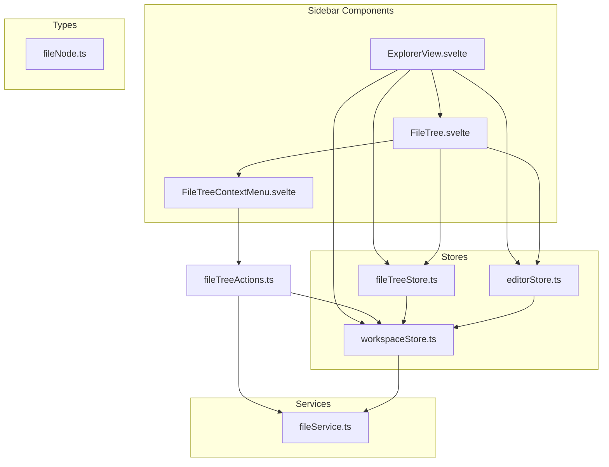
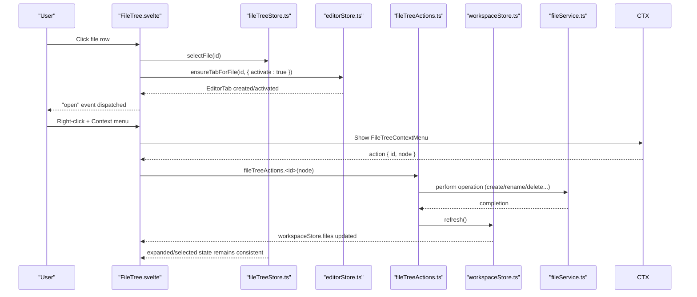
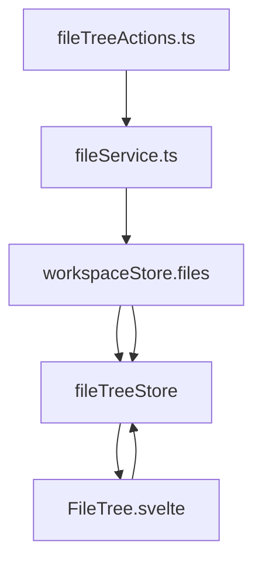
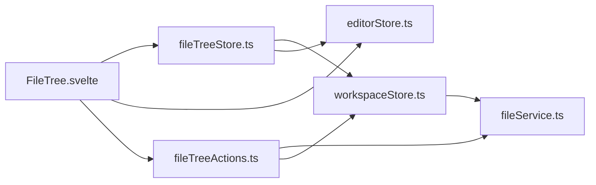

# File Tree Store

<cite>
**Referenced Files in This Document**
- [fileTreeStore.ts](file://src/lib/stores/fileTreeStore.ts)
- [fileTreeActions.ts](file://src/lib/sidebar/fileTreeActions.ts)
- [fileNode.ts](file://src/lib/types/fileNode.ts)
- [workspaceStore.ts](file://src/lib/stores/workspaceStore.ts)
- [editorStore.ts](file://src/lib/stores/editorStore.ts)
- [fileService.ts](file://src/lib/services/fileService.ts)
- [ExplorerView.svelte](file://src/lib/sidebar/ExplorerView.svelte)
- [FileTree.svelte](file://src/lib/sidebar/FileTree.svelte)
- [FileTreeContextMenu.svelte](file://src/lib/sidebar/FileTreeContextMenu.svelte)
</cite>

## Table of Contents
1. [Introduction](#introduction)
2. [Project Structure](#project-structure)
3. [Core Components](#core-components)
4. [Architecture Overview](#architecture-overview)
5. [Detailed Component Analysis](#detailed-component-analysis)
6. [Dependency Analysis](#dependency-analysis)
7. [Performance Considerations](#performance-considerations)
8. [Troubleshooting Guide](#troubleshooting-guide)
9. [Conclusion](#conclusion)

## Introduction
This document explains the file tree store that powers the Explorer UI in the NC code editor. It focuses on how fileTreeStore maintains expanded/collapsed directory state, tracks the selected file, and synchronizes with the active editor tab. It also covers how the store coordinates with workspaceStore to reflect real file system changes, and how fileTreeActions integrates with file operations such as opening files, creating new files/folders, renaming, deleting, and revealing files in the native OS explorer. Practical examples are included to show how to expand/collapse directories, handle selection, and manage drag-and-drop operations. Guidance is provided for maintaining selection state during file operations and optimizing performance for large directory structures.

## Project Structure
The file tree functionality spans several modules:
- Stores: fileTreeStore (UI state), workspaceStore (workspace tree), editorStore (tabs and active editor)
- Services: fileService (Tauri-backed file operations)
- Sidebar components: ExplorerView (entry point), FileTree (recursive renderer), FileTreeContextMenu (context menu)
- Types: fileNode (tree node shape)

**Diagram sources**
- [fileTreeStore.ts](file://src/lib/stores/fileTreeStore.ts#L1-L290)
- [fileTreeActions.ts](file://src/lib/sidebar/fileTreeActions.ts#L1-L135)
- [fileNode.ts](file://src/lib/types/fileNode.ts#L1-L19)
- [workspaceStore.ts](file://src/lib/stores/workspaceStore.ts#L1-L130)
- [editorStore.ts](file://src/lib/stores/editorStore.ts#L1-L381)
- [fileService.ts](file://src/lib/services/fileService.ts#L1-L85)
- [ExplorerView.svelte](file://src/lib/sidebar/ExplorerView.svelte#L1-L204)
- [FileTree.svelte](file://src/lib/sidebar/FileTree.svelte#L1-L276)
- [FileTreeContextMenu.svelte](file://src/lib/sidebar/FileTreeContextMenu.svelte#L1-L133)

**Section sources**
- [fileTreeStore.ts](file://src/lib/stores/fileTreeStore.ts#L1-L290)
- [fileTreeActions.ts](file://src/lib/sidebar/fileTreeActions.ts#L1-L135)
- [fileNode.ts](file://src/lib/types/fileNode.ts#L1-L19)
- [workspaceStore.ts](file://src/lib/stores/workspaceStore.ts#L1-L130)
- [editorStore.ts](file://src/lib/stores/editorStore.ts#L1-L381)
- [fileService.ts](file://src/lib/services/fileService.ts#L1-L85)
- [ExplorerView.svelte](file://src/lib/sidebar/ExplorerView.svelte#L1-L204)
- [FileTree.svelte](file://src/lib/sidebar/FileTree.svelte#L1-L276)
- [FileTreeContextMenu.svelte](file://src/lib/sidebar/FileTreeContextMenu.svelte#L1-L133)

## Core Components
- fileTreeStore: Maintains expanded directories and selected file id; exposes helpers to expand/collapse, toggle, select, and synchronize with the active editor tab.
- workspaceStore: Provides the workspace tree (FileNode[]) and watches file system changes; refreshes automatically when files change.
- editorStore: Manages editor tabs and active editor; ensures a tab exists for a given file id/path and integrates with editor groups.
- fileTreeActions: Orchestrates file operations (open, open to side, reveal in explorer, new file/folder, rename, delete) and refreshes workspace state.
- fileService: Bridges frontend to Tauri commands for file operations and watching.
- ExplorerView: Subscribes to active editor and workspace to keep the file tree in sync; handles drag-and-drop import.
- FileTree: Renders the recursive tree, reacts to UI actions, and dispatches “open” events.
- FileTreeContextMenu: Emits context menu actions to fileTreeActions.

**Section sources**
- [fileTreeStore.ts](file://src/lib/stores/fileTreeStore.ts#L1-L290)
- [workspaceStore.ts](file://src/lib/stores/workspaceStore.ts#L1-L130)
- [editorStore.ts](file://src/lib/stores/editorStore.ts#L1-L381)
- [fileTreeActions.ts](file://src/lib/sidebar/fileTreeActions.ts#L1-L135)
- [fileService.ts](file://src/lib/services/fileService.ts#L1-L85)
- [ExplorerView.svelte](file://src/lib/sidebar/ExplorerView.svelte#L1-L204)
- [FileTree.svelte](file://src/lib/sidebar/FileTree.svelte#L1-L276)
- [FileTreeContextMenu.svelte](file://src/lib/sidebar/FileTreeContextMenu.svelte#L1-L133)

## Architecture Overview
The file tree UI is driven by a separation of concerns:
- Data: workspaceStore holds the FileNode[] tree and reflects file system changes.
- UI state: fileTreeStore holds expanded Set and selectedFileId.
- Behavior: fileTreeActions performs operations and refreshes workspace; editorStore manages tabs and active editor.
- Rendering: FileTree renders the tree and reacts to user interactions; ExplorerView keeps the UI in sync with active editor and workspace.

**Diagram sources**
- [FileTree.svelte](file://src/lib/sidebar/FileTree.svelte#L1-L276)
- [fileTreeStore.ts](file://src/lib/stores/fileTreeStore.ts#L1-L290)
- [editorStore.ts](file://src/lib/stores/editorStore.ts#L1-L381)
- [fileTreeActions.ts](file://src/lib/sidebar/fileTreeActions.ts#L1-L135)
- [workspaceStore.ts](file://src/lib/stores/workspaceStore.ts#L1-L130)
- [fileService.ts](file://src/lib/services/fileService.ts#L1-L85)

## Detailed Component Analysis

### fileTreeStore: State, Selection, and Synchronization
Responsibilities:
- Track expanded directories via a Set of ids.
- Track selected file id.
- Provide helpers to expand/collapse/toggle directories and select files.
- Synchronize with the active editor tab: expand parents and select the corresponding file node.

Key APIs:
- isExpanded(id): Check if a directory id is expanded.
- expand(id), collapse(id), toggleDir(id): Mutate expanded state immutably.
- selectFile(id): Set selected file id.
- syncWithActiveTab(tabId): Resolve FileNode by id or path, expand parents, and select the file.
- revealNode(node): Expand parents and select a given node.

Implementation highlights:
- Uses a writable store internally and exposes a derived readable store to prevent external mutation.
- Normalizes paths to support cross-platform comparisons.
- Traverses the FileNode tree to find nodes by id or path and to collect parent directories.

Common usage patterns:
- Expand/collapse directories: Call expand/collapse/toggleDir with the directory’s id.
- Select a file: Call selectFile with the file’s id.
- Sync with active tab: Subscribe to activeEditor and call syncWithActiveTab with the active tab id or null.

Selection persistence:
- The store preserves selection across workspace refreshes because it only stores ids and re-resolves nodes when needed.

**Section sources**
- [fileTreeStore.ts](file://src/lib/stores/fileTreeStore.ts#L1-L290)

### workspaceStore: Workspace Tree and File Watching
Responsibilities:
- Load and maintain the FileNode[] tree for the current workspace root.
- Watch file system changes and refresh automatically.
- Expose utilities to refresh, open/close folders, and resolve paths.

Key behaviors:
- Loads files via fileService.listWorkspaceFiles and sets loading/error flags.
- Starts a file watcher and listens to file-change events to refresh the tree.
- Provides getWorkspaceFiles snapshot utility for stores that need the current tree.

Integration with fileTreeStore:
- fileTreeStore reads a snapshot of files via a subscription to workspaceStore to resolve nodes and compute parent directories.

**Section sources**
- [workspaceStore.ts](file://src/lib/stores/workspaceStore.ts#L1-L130)

### editorStore: Tab Management and Active Editor
Responsibilities:
- Manage EditorTab list and activeEditorId.
- Ensure a tab exists for a given file id or path and integrate with editor groups.
- Provide helpers to open/close tabs and update content.

Integration with fileTreeStore:
- ExplorerView subscribes to activeEditor and calls syncWithActiveTab to keep the file tree in sync with the active tab.

**Section sources**
- [editorStore.ts](file://src/lib/stores/editorStore.ts#L1-L381)

### fileTreeActions: File Operations and Coordination
Responsibilities:
- Implement actions for opening files, opening to side, revealing in OS explorer, creating new files/folders, renaming, and deleting.
- Refresh workspace after operations to reflect changes in the tree.
- Compute target directories based on the clicked node.

Key flows:
- open(node): Ensures a tab for the file and activates it.
- openToSide(node): Same as open but splits the editor group to the right.
- revealInExplorer(node): Reveals the file in the OS explorer and reveals the node in the tree.
- newFile(node): Creates a new file under the computed target directory and refreshes workspace.
- newFolder(node): Creates a new directory and refreshes workspace.
- rename(node): Prompts for a new name and renames the file, then refreshes workspace.
- deleteNode(node): Confirms deletion and deletes the file, then refreshes workspace.

Error handling:
- Catches errors and alerts the user.

**Section sources**
- [fileTreeActions.ts](file://src/lib/sidebar/fileTreeActions.ts#L1-L135)

### ExplorerView: Synchronization and Drag-and-Drop
Responsibilities:
- Subscribe to activeEditor and workspaceStore to keep the file tree in sync.
- Provide UI for opening a folder and render the FileTree component.
- Handle drag-and-drop: import files into the workspace root and open them in the editor.

Synchronization:
- On activeEditor changes, calls syncWithActiveTab to expand parents and select the file.
- On workspaceStore changes, if files are loaded, re-sync selection.

Drag-and-drop:
- Validates workspace root, writes dropped files to the workspace via fileService, refreshes workspace, and opens the newly created files.

**Section sources**
- [ExplorerView.svelte](file://src/lib/sidebar/ExplorerView.svelte#L1-L204)

### FileTree: Recursive Rendering and Interaction
Responsibilities:
- Recursively render FileNode[] as a tree.
- Toggle directory expansion and select files.
- Dispatch an “open” event when a file is opened.
- Show context menu and handle context actions.

Interaction model:
- Directory click toggles expansion.
- File click selects the file, ensures a tab, and dispatches “open”.

Accessibility:
- Supports Enter/Space to toggle directories and Shift+F10 or ContextMenu key to open context menus.

**Section sources**
- [FileTree.svelte](file://src/lib/sidebar/FileTree.svelte#L1-L276)

### FileTreeContextMenu: Context Menu Actions
Responsibilities:
- Render a compact context menu for the selected node.
- Emit an “action” event with the chosen FileTreeActionId and node.
- Close on blur or Escape.

Integration:
- FileTree listens for the “action” event and delegates to fileTreeActions.

**Section sources**
- [FileTreeContextMenu.svelte](file://src/lib/sidebar/FileTreeContextMenu.svelte#L1-L133)

### Relationship Between fileTreeStore and workspaceStore
- fileTreeStore depends on workspaceStore for the current FileNode[] to resolve nodes by id or path and to compute parent directories.
- workspaceStore is the authoritative source of truth for the workspace structure; fileTreeStore maintains only UI state (expanded and selected).
- When workspaceStore refreshes, fileTreeStore continues to track expanded and selected ids, and can re-resolve nodes as needed.

**Diagram sources**
- [fileTreeStore.ts](file://src/lib/stores/fileTreeStore.ts#L1-L290)
- [workspaceStore.ts](file://src/lib/stores/workspaceStore.ts#L1-L130)
- [FileTree.svelte](file://src/lib/sidebar/FileTree.svelte#L1-L276)
- [fileTreeActions.ts](file://src/lib/sidebar/fileTreeActions.ts#L1-L135)
- [fileService.ts](file://src/lib/services/fileService.ts#L1-L85)

## Dependency Analysis
- fileTreeStore depends on:
  - workspaceStore (for snapshot of files)
  - editorStore (for activeEditor id)
- FileTree depends on:
  - fileTreeStore (expanded/selected state)
  - editorStore (activeEditorId)
  - fileTreeActions (context menu actions)
- fileTreeActions depends on:
  - fileService (operations)
  - workspaceStore (refresh)
  - editorStore (ensureTabForFile)
- workspaceStore depends on:
  - fileService (list files, watch events)

**Diagram sources**
- [fileTreeStore.ts](file://src/lib/stores/fileTreeStore.ts#L1-L290)
- [workspaceStore.ts](file://src/lib/stores/workspaceStore.ts#L1-L130)
- [editorStore.ts](file://src/lib/stores/editorStore.ts#L1-L381)
- [FileTree.svelte](file://src/lib/sidebar/FileTree.svelte#L1-L276)
- [fileTreeActions.ts](file://src/lib/sidebar/fileTreeActions.ts#L1-L135)
- [fileService.ts](file://src/lib/services/fileService.ts#L1-L85)

**Section sources**
- [fileTreeStore.ts](file://src/lib/stores/fileTreeStore.ts#L1-L290)
- [workspaceStore.ts](file://src/lib/stores/workspaceStore.ts#L1-L130)
- [editorStore.ts](file://src/lib/stores/editorStore.ts#L1-L381)
- [FileTree.svelte](file://src/lib/sidebar/FileTree.svelte#L1-L276)
- [fileTreeActions.ts](file://src/lib/sidebar/fileTreeActions.ts#L1-L135)
- [fileService.ts](file://src/lib/services/fileService.ts#L1-L85)

## Performance Considerations
- Large directory structures:
  - The current FileTree.svelte renders the entire tree recursively. For very large trees, consider virtualization to render only visible rows.
  - Memoize node lookups (findNodeById/findNodeByPath) if frequently accessed; cache normalized paths.
- Efficient state updates:
  - fileTreeStore uses immutable Set updates for expanded state; this is efficient for typical sizes.
  - Avoid unnecessary re-renders by deriving UI state from fileTreeState and workspaceStore snapshots.
- File watching:
  - workspaceStore refreshes on file changes; batch UI updates if needed to avoid thrashing.
- Drag-and-drop:
  - Limit concurrent writes and refresh cycles; process drops sequentially and refresh once after all writes complete.

[No sources needed since this section provides general guidance]

## Troubleshooting Guide
Common issues and solutions:
- Selection resets after file operations:
  - Ensure you call syncWithActiveTab after refreshing workspace to recompute expanded parents and selection.
  - Verify that the active tab id corresponds to a FileNode present in the refreshed tree.
- Node not found when syncing:
  - The store resolves by id first, then by path. If neither matches, selection remains unchanged. Confirm the tab id or path exists in the workspace.
- Context menu actions fail:
  - fileTreeActions catches and alerts errors. Check the browser console for details and confirm the workspace root is set.
- Drag-and-drop does nothing:
  - Ensure a workspace root is open; otherwise, the UI prevents importing files.

**Section sources**
- [fileTreeStore.ts](file://src/lib/stores/fileTreeStore.ts#L1-L290)
- [fileTreeActions.ts](file://src/lib/sidebar/fileTreeActions.ts#L1-L135)
- [ExplorerView.svelte](file://src/lib/sidebar/ExplorerView.svelte#L1-L204)

## Conclusion
The file tree store cleanly separates UI state from workspace data, enabling robust synchronization with the active editor and reliable file operations. By keeping expanded and selected state separate from the workspace tree, the system remains responsive and predictable. For large workspaces, consider virtualizing the tree and optimizing lookups. The coordination between fileTreeStore, workspaceStore, editorStore, and fileTreeActions provides a clear, extensible foundation for file tree interactions.