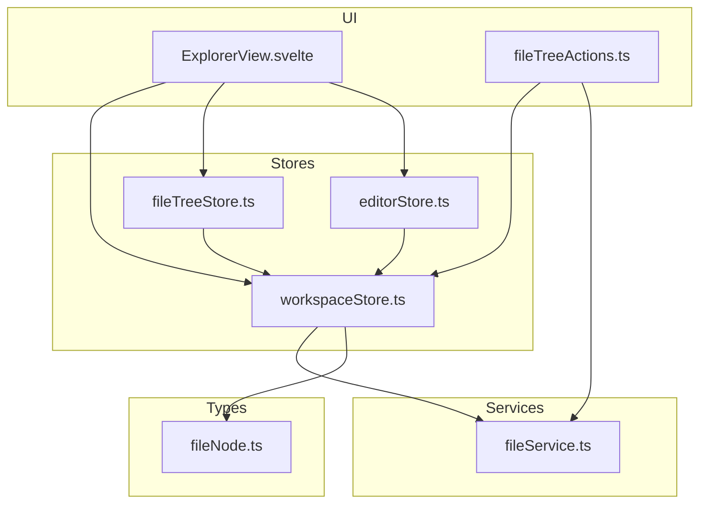
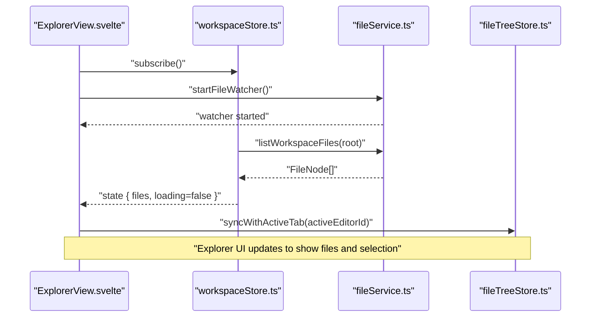
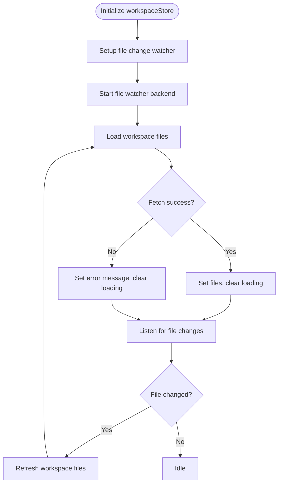
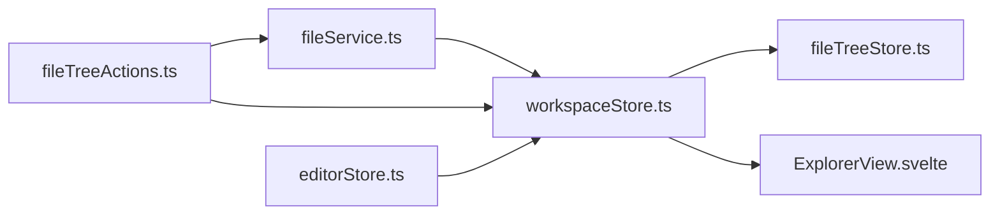

# Workspace Store

<cite>
**Referenced Files in This Document**
- [workspaceStore.ts](file://src/lib/stores/workspaceStore.ts)
- [fileService.ts](file://src/lib/services/fileService.ts)
- [fileTreeStore.ts](file://src/lib/stores/fileTreeStore.ts)
- [fileTreeActions.ts](file://src/lib/sidebar/fileTreeActions.ts)
- [ExplorerView.svelte](file://src/lib/sidebar/ExplorerView.svelte)
- [editorStore.ts](file://src/lib/stores/editorStore.ts)
- [fileNode.ts](file://src/lib/types/fileNode.ts)
</cite>

## Table of Contents
1. [Introduction](#introduction)
2. [Project Structure](#project-structure)
3. [Core Components](#core-components)
4. [Architecture Overview](#architecture-overview)
5. [Detailed Component Analysis](#detailed-component-analysis)
6. [Dependency Analysis](#dependency-analysis)
7. [Performance Considerations](#performance-considerations)
8. [Troubleshooting Guide](#troubleshooting-guide)
9. [Conclusion](#conclusion)

## Introduction
This document explains the workspaceStore and its role in managing the current workspace state and file system structure in the NC code editor. It covers how the store maintains the root directory path, tracks the file system hierarchy using FileNode objects, and synchronizes with the actual file system through integration with fileService and fileTreeStore. It also describes reactive patterns that keep the workspace state up-to-date, concrete usage examples for opening workspaces and refreshing the file structure, and how workspace changes propagate to other components such as the file explorer and editor.

## Project Structure
The workspaceStore sits at the intersection of the frontend store layer and the file service abstraction. It relies on fileService to list and watch the file system and exposes a reactive store consumed by UI components and other stores.

**Diagram sources**
- [workspaceStore.ts](file://src/lib/stores/workspaceStore.ts#L1-L129)
- [fileService.ts](file://src/lib/services/fileService.ts#L1-L85)
- [fileTreeStore.ts](file://src/lib/stores/fileTreeStore.ts#L1-L290)
- [fileTreeActions.ts](file://src/lib/sidebar/fileTreeActions.ts#L1-L135)
- [ExplorerView.svelte](file://src/lib/sidebar/ExplorerView.svelte#L1-L132)
- [editorStore.ts](file://src/lib/stores/editorStore.ts#L1-L381)
- [fileNode.ts](file://src/lib/types/fileNode.ts#L1-L19)

**Section sources**
- [workspaceStore.ts](file://src/lib/stores/workspaceStore.ts#L1-L129)
- [fileService.ts](file://src/lib/services/fileService.ts#L1-L85)
- [fileTreeStore.ts](file://src/lib/stores/fileTreeStore.ts#L1-L290)
- [fileTreeActions.ts](file://src/lib/sidebar/fileTreeActions.ts#L1-L135)
- [ExplorerView.svelte](file://src/lib/sidebar/ExplorerView.svelte#L1-L132)
- [editorStore.ts](file://src/lib/stores/editorStore.ts#L1-L381)
- [fileNode.ts](file://src/lib/types/fileNode.ts#L1-L19)

## Core Components
- workspaceStore: Maintains the current workspace root, a human-friendly name, loading/error flags, and the file tree as FileNode[]. It initializes watchers, loads the file tree on startup, and exposes methods to open/close folders and refresh the tree.
- fileService: Provides a frontend wrapper around Tauri commands for file operations and watching. It lists workspace files, starts the file watcher, listens for file-change events, and exposes CRUD operations.
- fileTreeStore: Manages the UI state of the file explorer (expanded directories and selected file) and synchronizes with the active editor tab. It reads the workspace files snapshot to locate nodes and reveal them in the tree.
- fileTreeActions: Implements actions triggered by the UI (open, open to side, reveal in explorer, create/rename/delete). These actions call fileService and then refresh the workspace to reflect changes.
- ExplorerView.svelte: The UI component that subscribes to workspaceStore and fileTreeStore, renders the workspace header and status, and handles opening folders and drag-and-drop file imports.
- editorStore: Consumes workspace files to create and manage editor tabs. It uses workspaceStore’s snapshot to resolve files and integrate with editor groups.

**Section sources**
- [workspaceStore.ts](file://src/lib/stores/workspaceStore.ts#L1-L129)
- [fileService.ts](file://src/lib/services/fileService.ts#L1-L85)
- [fileTreeStore.ts](file://src/lib/stores/fileTreeStore.ts#L1-L290)
- [fileTreeActions.ts](file://src/lib/sidebar/fileTreeActions.ts#L1-L135)
- [ExplorerView.svelte](file://src/lib/sidebar/ExplorerView.svelte#L1-L132)
- [editorStore.ts](file://src/lib/stores/editorStore.ts#L1-L381)
- [fileNode.ts](file://src/lib/types/fileNode.ts#L1-L19)

## Architecture Overview
The workspaceStore orchestrates the workspace lifecycle:
- On initialization, it sets up a file change watcher and starts the file watcher backend.
- It loads the initial file tree from fileService and updates its internal state.
- UI components and actions subscribe to and mutate the store reactively.
- Changes in the file system trigger the watcher, which reloads the workspace tree.

**Diagram sources**
- [workspaceStore.ts](file://src/lib/stores/workspaceStore.ts#L1-L129)
- [fileService.ts](file://src/lib/services/fileService.ts#L1-L85)
- [fileTreeStore.ts](file://src/lib/stores/fileTreeStore.ts#L1-L290)
- [ExplorerView.svelte](file://src/lib/sidebar/ExplorerView.svelte#L1-L132)

## Detailed Component Analysis

### workspaceStore
Responsibilities:
- Tracks the current workspace root and derives a friendly workspace name.
- Loads the file tree asynchronously via fileService and updates loading/error flags.
- Sets up a file change watcher to automatically refresh the tree when the file system changes.
- Exposes methods to open/close folders, refresh the tree, and resolve relative paths.

Key behaviors:
- Initialization: Starts the file watcher and loads the workspace tree immediately.
- Watcher: Subscribes to file-service events and triggers a refresh.
- Loading/error handling: Updates loading flags and error messages during fetch failures.
- Public API: subscribe, refresh, openFolder, closeFolder, getWorkspaceRoot, resolvePath.

**Diagram sources**
- [workspaceStore.ts](file://src/lib/stores/workspaceStore.ts#L1-L129)
- [fileService.ts](file://src/lib/services/fileService.ts#L1-L85)

**Section sources**
- [workspaceStore.ts](file://src/lib/stores/workspaceStore.ts#L1-L129)

### fileService
Responsibilities:
- Wraps Tauri commands for file operations and workspace listing.
- Exposes methods to list workspace files, start watchers, listen for file-change events, and perform CRUD operations.
- Manages the current workspace root in memory.

Integration:
- workspaceStore depends on listWorkspaceFiles and onFileChange.
- fileTreeActions and ExplorerView call fileService for create/rename/delete and reveal-in-explorer.

**Section sources**
- [fileService.ts](file://src/lib/services/fileService.ts#L1-L85)

### fileTreeStore
Responsibilities:
- Maintains UI state for the file explorer: expanded directories and selected file.
- Synchronizes the explorer selection with the active editor tab by resolving nodes from the workspace snapshot.
- Provides helpers to reveal nodes and expand parent directories.

Integration:
- Reads workspace files snapshot via workspaceStore subscription.
- Used by ExplorerView to keep the tree in sync with the active tab.

**Section sources**
- [fileTreeStore.ts](file://src/lib/stores/fileTreeStore.ts#L1-L290)

### fileTreeActions
Responsibilities:
- Implements UI actions for file operations: open, open to side, reveal in explorer, new file/folder, rename, delete.
- Calls fileService for backend operations and then refreshes the workspace to reflect changes.

Integration:
- Uses workspaceStore.refresh() to update the file tree after mutations.
- Uses fileService.revealInExplorer() and fileTreeStore.revealNode() to update the UI.

**Section sources**
- [fileTreeActions.ts](file://src/lib/sidebar/fileTreeActions.ts#L1-L135)

### ExplorerView.svelte
Responsibilities:
- Renders the workspace header, status messages, and the file tree.
- Handles opening a folder via a native dialog and calls workspaceStore.openFolder.
- Handles drag-and-drop file imports by writing files via fileService and then refreshing the workspace.
- Subscribes to workspaceStore and fileTreeStore to keep the UI in sync.

**Section sources**
- [ExplorerView.svelte](file://src/lib/sidebar/ExplorerView.svelte#L1-L132)

### editorStore
Responsibilities:
- Manages editor tabs and active editor state.
- Creates tabs for files by resolving them from the workspace snapshot.
- Integrates with editor groups to manage tab layout.

Integration:
- Uses workspaceStore.getWorkspaceFiles() to resolve files and languages for tabs.

**Section sources**
- [editorStore.ts](file://src/lib/stores/editorStore.ts#L1-L381)

### FileNode model
Responsibilities:
- Defines the shape of a file or directory node used across the workspace and explorer.

Fields:
- id, name, path, type ('file' | 'dir'), optional size and modified timestamps, optional children for directories.

**Section sources**
- [fileNode.ts](file://src/lib/types/fileNode.ts#L1-L19)

## Dependency Analysis
The workspaceStore is central to the file system synchronization pipeline. It depends on fileService for listing and watching, and it is consumed by fileTreeStore and ExplorerView. Actions in fileTreeActions depend on fileService and workspaceStore to keep the UI consistent after mutations.

**Diagram sources**
- [workspaceStore.ts](file://src/lib/stores/workspaceStore.ts#L1-L129)
- [fileService.ts](file://src/lib/services/fileService.ts#L1-L85)
- [fileTreeStore.ts](file://src/lib/stores/fileTreeStore.ts#L1-L290)
- [fileTreeActions.ts](file://src/lib/sidebar/fileTreeActions.ts#L1-L135)
- [ExplorerView.svelte](file://src/lib/sidebar/ExplorerView.svelte#L1-L132)
- [editorStore.ts](file://src/lib/stores/editorStore.ts#L1-L381)

**Section sources**
- [workspaceStore.ts](file://src/lib/stores/workspaceStore.ts#L1-L129)
- [fileService.ts](file://src/lib/services/fileService.ts#L1-L85)
- [fileTreeStore.ts](file://src/lib/stores/fileTreeStore.ts#L1-L290)
- [fileTreeActions.ts](file://src/lib/sidebar/fileTreeActions.ts#L1-L135)
- [ExplorerView.svelte](file://src/lib/sidebar/ExplorerView.svelte#L1-L132)
- [editorStore.ts](file://src/lib/stores/editorStore.ts#L1-L381)

## Performance Considerations
- Large directory structures:
  - The workspaceStore currently loads the entire file tree on each refresh. For very large directories, consider:
    - Incremental loading: load only visible subtrees and lazy-load deeper nodes on expansion.
    - Debounced refresh: coalesce rapid file-change events to avoid frequent reloads.
    - Virtualization: render only visible nodes in the file tree UI.
  - Caching: cache recent snapshots keyed by root path to avoid redundant network/backend calls.
- Watcher overhead:
  - Limit the number of subscribers to workspaceStore refreshes if possible.
  - Batch UI updates after refresh to minimize reflows.
- File operations:
  - Use fileTreeActions to trigger refresh after mutations, but avoid triggering refreshes in tight loops.

[No sources needed since this section provides general guidance]

## Troubleshooting Guide
Common issues and resolutions:
- No folder opened:
  - The workspaceStore displays a friendly message and disables tree rendering. Use the “Open Folder” action in ExplorerView to set a root.
- Loading errors:
  - The workspaceStore sets an error flag and displays the error message. Check permissions and path validity.
- File changes not reflected:
  - Ensure the file watcher is started and the file change listener is active. Verify that fileService.startFileWatcher and workspaceStore’s watcher are initialized.
- Explorer selection not syncing:
  - Confirm that ExplorerView is subscribed to activeEditor and that fileTreeStore.syncWithActiveTab is invoked. Also ensure workspaceStore.files is populated.

**Section sources**
- [workspaceStore.ts](file://src/lib/stores/workspaceStore.ts#L1-L129)
- [ExplorerView.svelte](file://src/lib/sidebar/ExplorerView.svelte#L1-L132)
- [fileTreeStore.ts](file://src/lib/stores/fileTreeStore.ts#L1-L290)

## Conclusion
The workspaceStore provides a reactive foundation for managing the current workspace and keeping the file explorer and editor synchronized with the file system. Through its integration with fileService and fileTreeStore, it ensures that UI components remain consistent with real-time file system changes. By following the usage patterns described here—opening folders, refreshing the tree, and handling file system events—you can effectively manage workspace state and optimize performance for large directory structures.