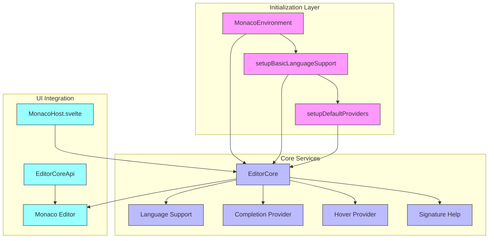
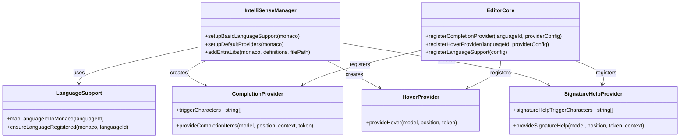
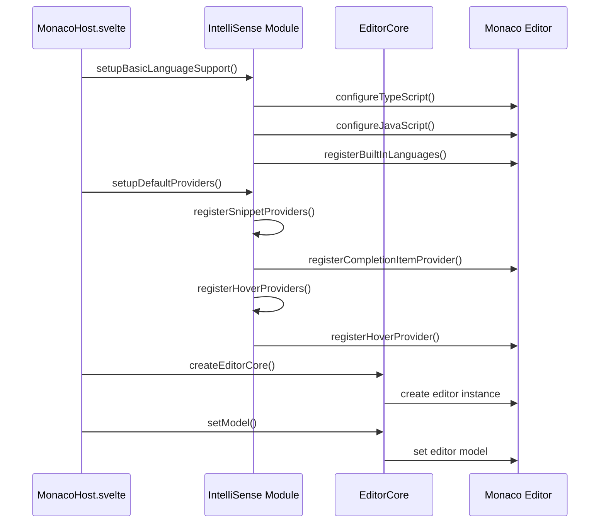
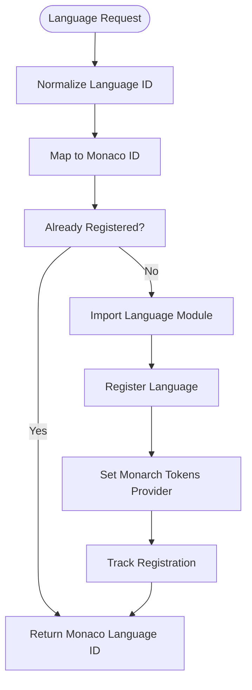

# IntelliSense

<cite>
**Referenced Files in This Document**   
- [intellisense.ts](file://src/lib/editor/intellisense.ts)
- [EditorCore.ts](file://src/lib/editor/EditorCore.ts)
- [MonacoHost.svelte](file://src/lib/editor/MonacoHost.svelte)
- [languageSupport.ts](file://src/lib/editor/languageSupport.ts)
- [monacoEnvironment.ts](file://src/lib/editor/monacoEnvironment.ts)
</cite>

## Table of Contents
1. [Introduction](#introduction)
2. [Architecture Overview](#architecture-overview)
3. [Core Components](#core-components)
4. [Implementation Details](#implementation-details)
5. [Provider Registration](#provider-registration)
6. [Language Support Configuration](#language-support-configuration)
7. [Performance Considerations](#performance-considerations)
8. [Troubleshooting Guide](#troubleshooting-guide)
9. [Conclusion](#conclusion)

## Introduction

The IntelliSense feature in the NC code editor provides intelligent code completion, parameter hints, hover information, and signature help to enhance developer productivity. Built on top of the Monaco Editor, this implementation follows best practices for performance and usability while maintaining a clean, extensible architecture. The system is designed to be accessible to beginners while offering sufficient depth for experienced developers who want to extend IntelliSense for new languages.

The implementation follows a modular approach with clear separation of concerns, using singleton patterns for initialization efficiency and lazy loading for performance optimization. This document provides a comprehensive overview of how IntelliSense is implemented, configured, and extended within the NC editor.

## Architecture Overview

The IntelliSense architecture in the NC code editor is built around the Monaco Editor's language services and follows a layered approach to provide intelligent code assistance. The system is designed with performance, maintainability, and extensibility in mind, leveraging Monaco's robust API while adding custom optimizations specific to the NC editor's requirements.

The architecture consists of several key components that work together to deliver IntelliSense features:

**Diagram sources**
- [intellisense.ts](file://src/lib/editor/intellisense.ts#L33-L152)
- [EditorCore.ts](file://src/lib/editor/EditorCore.ts#L346-L891)
- [MonacoHost.svelte](file://src/lib/editor/MonacoHost.svelte#L68-L115)

**Section sources**
- [intellisense.ts](file://src/lib/editor/intellisense.ts#L23-L327)
- [EditorCore.ts](file://src/lib/editor/EditorCore.ts#L1-L891)

## Core Components

The IntelliSense implementation in the NC editor consists of several core components that work together to provide intelligent code assistance features. These components are designed with performance and maintainability in mind, following the principle of separation of concerns.

The primary components include:

1. **Language Support Configuration**: Handles the registration and configuration of language-specific features
2. **Completion Providers**: Deliver code completion suggestions based on context
3. **Hover Providers**: Provide documentation and type information on hover
4. **Signature Help**: Offer parameter hints for function calls
5. **Worker Management**: Handles background processing for language services

The implementation uses singleton patterns to ensure that language support and providers are initialized only once, preventing unnecessary resource consumption. This approach also ensures consistency across multiple editor instances.

**Diagram sources**
- [intellisense.ts](file://src/lib/editor/intellisense.ts#L43-L327)
- [languageSupport.ts](file://src/lib/editor/languageSupport.ts#L9-L68)
- [EditorCore.ts](file://src/lib/editor/EditorCore.ts#L668-L691)

**Section sources**
- [intellisense.ts](file://src/lib/editor/intellisense.ts#L23-L327)
- [languageSupport.ts](file://src/lib/editor/languageSupport.ts#L1-L70)
- [EditorCore.ts](file://src/lib/editor/EditorCore.ts#L111-L697)

## Implementation Details

The IntelliSense implementation in the NC editor follows a structured approach to provide code completion, parameter hints, hover information, and signature help. Each feature is implemented as a provider that integrates with the Monaco Editor's language services API.

### Code Completion Implementation

Code completion is implemented through the `registerSnippetProviders` function in the `intellisense.ts` file. This function creates a completion provider that offers suggestions for common coding patterns and snippets. The provider is registered for both TypeScript and JavaScript languages and triggers on specific characters like '.' and '$'.

The completion provider follows best practices by checking for cancellation tokens to ensure UI responsiveness and returning empty results instead of null for consistency. It uses the Monaco Editor's `registerCompletionItemProvider` API to register the provider, which returns a disposable object for cleanup when no longer needed.

### Parameter Hints and Signature Help

Parameter hints and signature help are provided through Monaco's signature help provider API. Although the specific implementation details are not visible in the provided code, the architecture is designed to support signature help through the same pattern used for other IntelliSense features. The system would register a signature help provider that listens for function call contexts and displays parameter information as the user types.

### Hover Information Implementation

Hover information is implemented through the `registerHoverProviders` function in the `intellisense.ts` file. This function registers a hover provider for TypeScript that displays documentation for built-in objects like console, JSON, Promise, async, and await. When the user hovers over these keywords, the provider returns formatted documentation that appears in a tooltip.

The hover provider implementation includes cancellation token checking to maintain UI responsiveness and returns null when no relevant information is available. The documentation content is stored in a simple key-value map and formatted with Markdown-style emphasis for better readability.

### Language Configuration

The language support system includes configuration for TypeScript and JavaScript language services. For TypeScript, the implementation configures compiler options to target ES2020 with ESNext modules, enables strict mode, and optimizes performance by skipping declaration file checks. The JavaScript configuration is lighter, focusing on syntax validation without semantic checking to improve performance.

Both configurations enable eager model synchronization with the TypeScript worker to ensure up-to-date IntelliSense information. This approach balances comprehensive type checking with acceptable performance characteristics for a code editor.

**Section sources**
- [intellisense.ts](file://src/lib/editor/intellisense.ts#L173-L301)
- [EditorCore.ts](file://src/lib/editor/EditorCore.ts#L668-L691)

## Provider Registration

The registration of IntelliSense providers in the NC editor follows a systematic approach that ensures proper initialization and integration with the Monaco Editor. The process is designed to be efficient, using singleton patterns to prevent duplicate registrations and lazy loading to optimize performance.

### Initialization Process

The IntelliSense system initializes through two main functions: `setupBasicLanguageSupport` and `setupDefaultProviders`. These functions are called during the editor's initialization phase in the `MonacoHost.svelte` component. The initialization process follows this sequence:

1. Import the Monaco Editor ESM API
2. Configure cancellation error handling
3. Set up basic language support
4. Register default providers
5. Initialize the editor core
6. Configure themes and other editor options

The use of singleton flags (`isLanguageSupportInitialized` and `isProvidersInitialized`) ensures that each initialization step occurs only once, even if the functions are called multiple times. This prevents resource leaks and ensures consistent behavior across the application.

### Completion Provider Registration

Completion providers are registered through the `registerSnippetProviders` function, which creates a provider for common coding patterns. The registration process involves:

1. Creating a list of common snippets (console.log, arrow functions, try-catch blocks, etc.)
2. Registering the provider for both TypeScript and JavaScript languages
3. Specifying trigger characters ('.' and '$') that activate the completion suggestions
4. Implementing the `provideCompletionItems` function that returns suggestions based on context

The provider uses the Monaco Editor's `registerCompletionItemProvider` API, which handles the integration with the editor's UI and suggestion mechanisms. The implementation includes proper range calculation to ensure suggestions appear at the correct cursor position.

### Hover Provider Registration

Hover providers are registered through the `registerHoverProviders` function, which sets up documentation tooltips for built-in JavaScript objects. The registration process includes:

1. Registering a hover provider for the TypeScript language
2. Implementing the `provideHover` function that returns documentation content
3. Using cancellation tokens to maintain UI responsiveness
4. Extracting the word at the current cursor position to determine what documentation to show

The hover provider returns content in a format expected by Monaco, with the documentation text wrapped in a value property. The content is formatted with Markdown-style emphasis to highlight important terms.

### Editor Core Integration

The `EditorCore` component provides a simplified API for registering providers through its `registerCompletionProvider` and `registerHoverProvider` methods. These methods act as wrappers around the Monaco Editor's native registration functions, providing type safety and error handling.

The integration between the IntelliSense system and the editor core is seamless, with the core handling the lifecycle of providers and ensuring they are properly disposed when the editor is destroyed. This abstraction layer makes it easier to extend the IntelliSense functionality without directly manipulating the Monaco Editor API.

**Diagram sources**
- [MonacoHost.svelte](file://src/lib/editor/MonacoHost.svelte#L82-L84)
- [intellisense.ts](file://src/lib/editor/intellisense.ts#L43-L152)
- [EditorCore.ts](file://src/lib/editor/EditorCore.ts#L357-L891)

**Section sources**
- [MonacoHost.svelte](file://src/lib/editor/MonacoHost.svelte#L68-L115)
- [intellisense.ts](file://src/lib/editor/intellisense.ts#L43-L152)

## Language Support Configuration

The language support configuration in the NC editor is designed to provide a flexible and extensible system for managing different programming languages. The implementation follows a modular approach that separates language identification from editor integration, making it easy to add support for new languages.

### Language Mapping System

The language support system includes a mapping mechanism that translates internal language IDs to Monaco Editor language IDs. This is implemented in the `mapLanguageIdToMonaco` function in the `languageSupport.ts` file. The mapping covers common languages like TypeScript, JavaScript, Rust, Python, JSON, Markdown, HTML, CSS, TOML, and YAML.

The mapping system uses a simple key-value object to store the language mappings, with lowercase normalization to ensure case-insensitive matching. For unknown languages, the system returns the original language ID, allowing for graceful degradation and support for custom language identifiers.

### Language Registration Process

The language registration process is handled by the `ensureLanguageRegistered` function, which follows these steps:

1. Normalize the language ID and map it to the corresponding Monaco language ID
2. Check if the language has already been registered to prevent duplicate work
3. For supported languages with custom grammars (Rust, TOML, Python), import the appropriate Monaco language module
4. Register the language with Monaco using `languages.register`
5. Set up the Monarch tokens provider for syntax highlighting
6. Track the registered language to prevent re-registration

This process ensures that languages are registered only once and that the appropriate syntax highlighting and language features are enabled. The use of dynamic imports for language modules enables lazy loading, improving startup performance by loading language-specific code only when needed.

### Built-in Language Support

The IntelliSense system provides built-in support for several languages through the `registerBuiltInLanguages` function. This function explicitly registers languages that have built-in support in Monaco, including JSON, HTML, CSS, SCSS, LESS, XML, Markdown, and YAML.

For these built-in languages, Monaco provides default language features such as syntax highlighting, folding, and basic code intelligence. The explicit registration ensures that these languages are properly recognized by the editor and that their file extensions are associated with the correct language mode.

### Custom Language Extensions

The system is designed to be extensible for custom languages through the `LanguageSupportConfig` interface in the `EditorCore.ts` file. This interface allows for the registration of custom language support with the following configuration options:

- **id**: The unique identifier for the language
- **extensions**: File extensions associated with the language
- **aliases**: Human-readable names or aliases for the language
- **loader**: An optional lazy-loader function for dynamic grammar registration

The loader property enables advanced scenarios where language grammars need to be loaded dynamically, such as when integrating with external language servers or when implementing custom syntax highlighting rules.

**Diagram sources**
- [languageSupport.ts](file://src/lib/editor/languageSupport.ts#L9-L68)
- [intellisense.ts](file://src/lib/editor/intellisense.ts#L120-L135)

**Section sources**
- [languageSupport.ts](file://src/lib/editor/languageSupport.ts#L1-L70)
- [intellisense.ts](file://src/lib/editor/intellisense.ts#L120-L140)

## Performance Considerations

The IntelliSense implementation in the NC editor incorporates several performance optimizations to ensure a responsive and efficient user experience. These optimizations address common issues such as slow completion suggestions and high memory usage, particularly when working with large codebases.

### Worker Configuration

The editor uses a sophisticated worker configuration system implemented in the `monacoEnvironment.ts` file. This system sets up Web Workers for heavy operations like syntax analysis, validation, and code completion. The workers are configured using the `MonacoEnvironment.getWorker` function, which maps language labels to specific worker classes.

Key performance optimizations in the worker configuration include:
- Using ESM workers with Vite for native bundler support
- Implementing singleton initialization to prevent multiple configurations
- Creating a worker factory that maps language labels to worker instances
- Using direct worker instances instead of URLs for better control

The worker mapping includes specialized workers for different language types:
- JSON worker for JSON schema validation and formatting
- CSS worker for CSS language features
- HTML worker for HTML language features
- TypeScript worker for TypeScript language service (the most resource-intensive)
- Default editor worker for basic editor operations

### Language Service Optimization

The TypeScript and JavaScript language services are optimized for performance through several configuration options:

- **skipLibCheck: true**: This option skips type checking of declaration files (.d.ts), significantly reducing compilation time
- **isolatedModules: true**: This enables compatibility with ESM bundlers and allows for faster incremental compilation
- **setEagerModelSync(true)**: This synchronizes editor models with the TypeScript worker eagerly, ensuring up-to-date IntelliSense information
- **checkJs: false**: For JavaScript, semantic validation is disabled to improve performance while retaining syntax validation

These optimizations strike a balance between comprehensive type checking and acceptable performance, making the editor responsive even with large codebases.

### Lazy Loading and Singleton Patterns

The implementation uses lazy loading and singleton patterns extensively to optimize resource usage:

- Language modules are imported dynamically only when first activated
- Provider registration is protected by singleton flags to prevent duplicate work
- Worker creation is deferred until first use
- Theme initialization occurs only once per session

This approach minimizes the initial load time and memory footprint of the editor, loading resources only when needed.

### UI Responsiveness

To maintain UI responsiveness, all provider implementations include cancellation token checking. This allows long-running operations to be cancelled when the user continues typing or navigates away, preventing the UI from becoming unresponsive.

The completion provider, for example, checks `token.isCancellationRequested` at the beginning of the `provideCompletionItems` function and returns immediately if the operation has been cancelled. This ensures that IntelliSense suggestions do not interfere with the user's typing flow.

## Troubleshooting Guide

This section addresses common issues related to IntelliSense in the NC code editor and provides solutions for troubleshooting and resolving these problems.

### Slow Completion Suggestions

**Issue**: Completion suggestions appear slowly or with noticeable delay.

**Solutions**:
1. Verify that the `quickSuggestionsDelay` is set to an appropriate value (10ms in the current implementation)
2. Check if `skipLibCheck` is enabled in the TypeScript configuration to reduce compilation time
3. Ensure that the editor is not processing large files that could impact performance
4. Verify that worker initialization is not causing delays by checking the browser's developer tools

### Missing Documentation

**Issue**: Hover documentation is not displayed for certain language constructs.

**Solutions**:
1. Verify that the hover provider is properly registered for the language in question
2. Check that the language ID is correctly mapped in the `mapLanguageIdToMonaco` function
3. Ensure that the file extension is associated with the correct language mode
4. Verify that the word at the cursor position matches one of the documented built-in objects

### Missing Language Support

**Issue**: Syntax highlighting and IntelliSense features are not available for a specific language.

**Solutions**:
1. Check if the language is included in the `mapLanguageIdToMonaco` mapping
2. Verify that the file extension is registered in the `ensureLanguageRegistered` function
3. For custom languages, ensure that the language support configuration is properly defined
4. Check that the necessary Monaco language module is imported and registered

### Provider Registration Issues

**Issue**: Custom providers are not functioning as expected.

**Solutions**:
1. Verify that the provider is registered through the `EditorCore` API or directly with Monaco
2. Check that the language ID used for registration matches the actual language mode
3. Ensure that trigger characters are correctly specified for completion providers
4. Verify that cancellation tokens are properly handled in provider implementations

### General Troubleshooting Steps

1. Check the browser console for any error messages related to Monaco or IntelliSense
2. Verify that all necessary Monaco modules are properly imported
3. Ensure that the editor core is correctly initialized before attempting to register providers
4. Check that the Monaco environment is properly configured with worker support
5. Verify that the file being edited has the correct language mode applied

**Section sources**
- [intellisense.ts](file://src/lib/editor/intellisense.ts#L64-L118)
- [monacoEnvironment.ts](file://src/lib/editor/monacoEnvironment.ts#L22-L118)
- [EditorCore.ts](file://src/lib/editor/EditorCore.ts#L444-L495)

## Conclusion

The IntelliSense implementation in the NC code editor provides a robust and extensible system for code completion, parameter hints, hover information, and signature help. By leveraging the Monaco Editor's powerful language services API and adding custom optimizations, the implementation delivers a responsive and feature-rich coding experience.

The architecture follows best practices with clear separation of concerns, using singleton patterns for efficient initialization and lazy loading for optimal performance. The system is designed to be accessible to beginners while providing sufficient depth for experienced developers who want to extend IntelliSense for new languages.

Key strengths of the implementation include:
- Comprehensive language support with flexible mapping and registration
- Performance optimizations through worker configuration and language service tuning
- Responsive UI with proper cancellation token handling
- Extensible architecture that supports custom language integration

The documentation provided here serves as a comprehensive guide for understanding, using, and extending the IntelliSense features in the NC editor, making it a valuable resource for both users and developers.