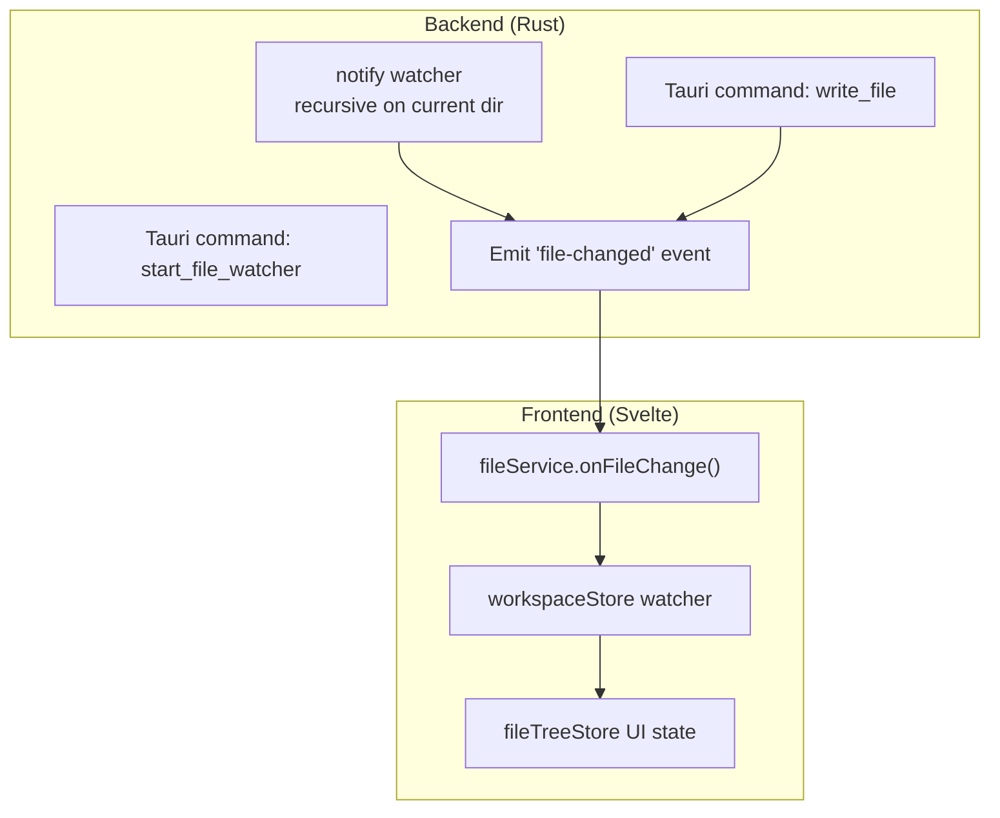
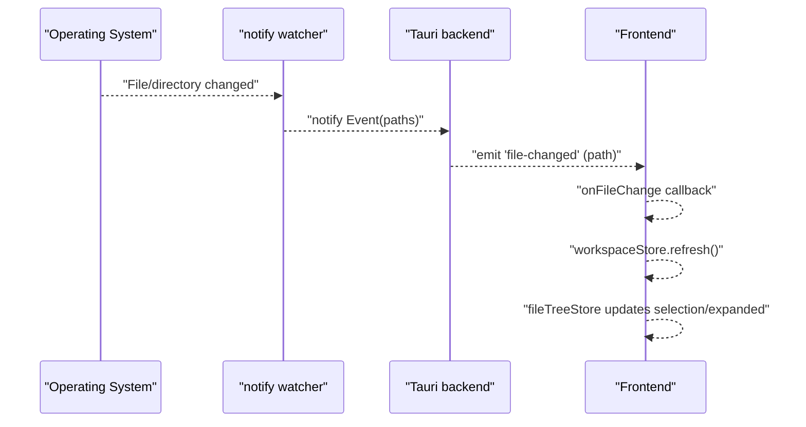
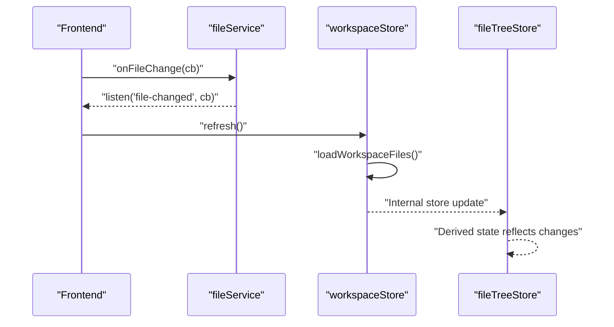
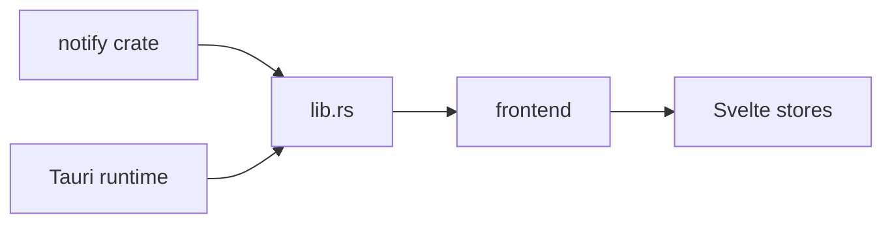

# File Watching

<cite>
**Referenced Files in This Document**
- [lib.rs](file://src-tauri/src/lib.rs)
- [main.rs](file://src-tauri/src/main.rs)
- [Cargo.toml](file://src-tauri/Cargo.toml)
- [fileService.ts](file://src/lib/services/fileService.ts)
- [workspaceStore.ts](file://src/lib/stores/workspaceStore.ts)
- [fileTreeStore.ts](file://src/lib/stores/fileTreeStore.ts)
- [fileTreeActions.ts](file://src/lib/sidebar/fileTreeActions.ts)
</cite>

## Table of Contents
1. [Introduction](#introduction)
2. [Project Structure](#project-structure)
3. [Core Components](#core-components)
4. [Architecture Overview](#architecture-overview)
5. [Detailed Component Analysis](#detailed-component-analysis)
6. [Dependency Analysis](#dependency-analysis)
7. [Performance Considerations](#performance-considerations)
8. [Troubleshooting Guide](#troubleshooting-guide)
9. [Conclusion](#conclusion)

## Introduction
This document explains the file watching sub-feature that enables real-time monitoring of file and directory changes in the workspace. It covers how the backend uses Rust’s notify crate to capture file system events and how Tauri’s event system propagates those changes to the frontend. You will learn how file changes trigger UI updates in the file explorer, how the event handling mechanism works, and how to configure watch depth and ignored patterns. Practical guidance is included for handling large numbers of file changes, editor conflicts when files are modified externally, and performance considerations for large projects.

## Project Structure
The file watching feature spans both the Tauri backend and the Svelte frontend:
- Backend (Rust):
  - Uses notify to watch the current working directory recursively.
  - Emits a “file-changed” event for each observed path.
  - Provides a command to start the watcher and a command to write files that also emits a “file-changed” event.
- Frontend (TypeScript/Svelte):
  - Listens for “file-changed” events and refreshes the workspace tree.
  - Integrates with the file explorer to reflect changes immediately.



**Diagram sources**
- [lib.rs](file://src-tauri/src/lib.rs#L390-L425)
- [lib.rs](file://src-tauri/src/lib.rs#L372-L388)
- [fileService.ts](file://src/lib/services/fileService.ts#L44-L51)
- [workspaceStore.ts](file://src/lib/stores/workspaceStore.ts#L76-L87)
- [fileTreeStore.ts](file://src/lib/stores/fileTreeStore.ts#L1-L290)

**Section sources**
- [lib.rs](file://src-tauri/src/lib.rs#L390-L425)
- [fileService.ts](file://src/lib/services/fileService.ts#L44-L51)
- [workspaceStore.ts](file://src/lib/stores/workspaceStore.ts#L76-L87)

## Core Components
- Backend watcher:
  - Creates a notify watcher and watches the current working directory recursively.
  - Emits a “file-changed” event for each path in the event.
  - Guards against multiple concurrent watchers.
- Frontend event listener:
  - Subscribes to “file-changed” events and triggers a refresh of the workspace tree.
  - The workspace tree refresh updates the file explorer UI.
- File write path:
  - Writing a file via the backend also emits a “file-changed” event, ensuring the UI stays synchronized.

Key implementation references:
- Start watcher command and recursive watch setup: [lib.rs](file://src-tauri/src/lib.rs#L390-L425)
- Emit on file write: [lib.rs](file://src-tauri/src/lib.rs#L372-L388)
- Frontend event subscription and refresh: [fileService.ts](file://src/lib/services/fileService.ts#L44-L51), [workspaceStore.ts](file://src/lib/stores/workspaceStore.ts#L76-L87)

**Section sources**
- [lib.rs](file://src-tauri/src/lib.rs#L390-L425)
- [lib.rs](file://src-tauri/src/lib.rs#L372-L388)
- [fileService.ts](file://src/lib/services/fileService.ts#L44-L51)
- [workspaceStore.ts](file://src/lib/stores/workspaceStore.ts#L76-L87)

## Architecture Overview
The file watching pipeline connects the operating system’s file system events to the UI through Tauri’s event system.



**Diagram sources**
- [lib.rs](file://src-tauri/src/lib.rs#L390-L425)
- [fileService.ts](file://src/lib/services/fileService.ts#L44-L51)
- [workspaceStore.ts](file://src/lib/stores/workspaceStore.ts#L76-L87)

## Detailed Component Analysis

### Backend: notify-based File Watcher
- Initialization:
  - A mutex-guarded global watcher is used to prevent multiple watchers.
  - A channel receives notify events.
  - The watcher is configured to watch the current working directory recursively.
- Event propagation:
  - For each notify event, the backend iterates over affected paths and emits a “file-changed” event with the path string.
- Thread safety:
  - The watcher is started on a background thread and guarded by a mutex to avoid race conditions.

Implementation highlights:
- Watcher creation and recursive watch: [lib.rs](file://src-tauri/src/lib.rs#L390-L425)
- Event loop emitting “file-changed”: [lib.rs](file://src-tauri/src/lib.rs#L412-L421)

```mermaid
flowchart TD
Start(["start_file_watcher"]) --> Guard["Lock FILE_WATCHER"]
Guard --> Check{"Already watching?"}
Check --> |Yes| ReturnOk["Return Ok(())"]
Check --> |No| CreateChan["Create mpsc channel"]
CreateChan --> NewWatcher["recommended_watcher(tx)"]
NewWatcher --> WatchDir["watch(current_dir, RecursiveMode::Recursive)"]
WatchDir --> SpawnThread["Spawn background thread"]
SpawnThread --> Loop{"rx.recv()"}
Loop --> |Ok(Event)| Paths["Iterate event.paths"]
Paths --> Emit["Emit 'file-changed' (path)"]
Emit --> Loop
Loop --> |Err| End(["Exit"])
```

**Diagram sources**
- [lib.rs](file://src-tauri/src/lib.rs#L390-L425)

**Section sources**
- [lib.rs](file://src-tauri/src/lib.rs#L390-L425)

### Frontend: Event Listener and UI Refresh
- Event subscription:
  - The frontend listens for “file-changed” events and invokes a callback.
- Workspace refresh:
  - On receiving an event, the frontend refreshes the workspace tree by invoking the backend to rebuild the file tree.
- UI synchronization:
  - The file explorer state updates automatically because the workspace store holds the tree and exposes derived state.

Implementation highlights:
- Subscribe to “file-changed” and refresh: [fileService.ts](file://src/lib/services/fileService.ts#L44-L51), [workspaceStore.ts](file://src/lib/stores/workspaceStore.ts#L76-L87)
- File explorer state: [fileTreeStore.ts](file://src/lib/stores/fileTreeStore.ts#L1-L290)



**Diagram sources**
- [fileService.ts](file://src/lib/services/fileService.ts#L44-L51)
- [workspaceStore.ts](file://src/lib/stores/workspaceStore.ts#L76-L87)
- [fileTreeStore.ts](file://src/lib/stores/fileTreeStore.ts#L1-L290)

**Section sources**
- [fileService.ts](file://src/lib/services/fileService.ts#L44-L51)
- [workspaceStore.ts](file://src/lib/stores/workspaceStore.ts#L76-L87)
- [fileTreeStore.ts](file://src/lib/stores/fileTreeStore.ts#L1-L290)

### File Write Path and Event Emission
- Writing a file via the backend:
  - The backend writes content to disk and emits a “file-changed” event with the written path.
- Frontend reaction:
  - The frontend receives the event and refreshes the workspace tree, keeping the UI in sync.

Implementation highlights:
- Emit on write: [lib.rs](file://src-tauri/src/lib.rs#L372-L388)
- Frontend refresh on event: [fileService.ts](file://src/lib/services/fileService.ts#L44-L51), [workspaceStore.ts](file://src/lib/stores/workspaceStore.ts#L76-L87)

**Section sources**
- [lib.rs](file://src-tauri/src/lib.rs#L372-L388)
- [fileService.ts](file://src/lib/services/fileService.ts#L44-L51)
- [workspaceStore.ts](file://src/lib/stores/workspaceStore.ts#L76-L87)

### File Explorer Actions and Reveal Behavior
- Opening files and revealing in the explorer:
  - The file explorer actions trigger UI updates and reveal the selected node in the tree.
- Integration with watcher:
  - While the actions themselves do not directly trigger watcher refresh, the watcher ensures the tree remains consistent with external changes.

Implementation highlights:
- Reveal action: [fileTreeActions.ts](file://src/lib/sidebar/fileTreeActions.ts#L78-L82)
- File tree state: [fileTreeStore.ts](file://src/lib/stores/fileTreeStore.ts#L266-L289)

**Section sources**
- [fileTreeActions.ts](file://src/lib/sidebar/fileTreeActions.ts#L78-L82)
- [fileTreeStore.ts](file://src/lib/stores/fileTreeStore.ts#L266-L289)

## Dependency Analysis
- Backend dependencies:
  - notify crate for cross-platform file system monitoring.
  - Tauri for event emission and command registration.
- Frontend dependencies:
  - Tauri event APIs to listen for “file-changed”.
  - Svelte stores to manage UI state and react to changes.



**Diagram sources**
- [Cargo.toml](file://src-tauri/Cargo.toml#L20-L33)
- [lib.rs](file://src-tauri/src/lib.rs#L25-L41)
- [fileService.ts](file://src/lib/services/fileService.ts#L1-L85)
- [workspaceStore.ts](file://src/lib/stores/workspaceStore.ts#L1-L130)

**Section sources**
- [Cargo.toml](file://src-tauri/Cargo.toml#L20-L33)
- [lib.rs](file://src-tauri/src/lib.rs#L25-L41)
- [fileService.ts](file://src/lib/services/fileService.ts#L1-L85)
- [workspaceStore.ts](file://src/lib/stores/workspaceStore.ts#L1-L130)

## Performance Considerations
- Current behavior:
  - The watcher monitors the current working directory recursively. There is no explicit debouncing or throttling in the current implementation.
  - The frontend refreshes the entire workspace tree on each “file-changed” event.
- Recommendations:
  - Debounce/throttle: Introduce a debouncing mechanism on the frontend to coalesce rapid successive events before refreshing the workspace tree. This reduces unnecessary reloads and improves responsiveness under heavy change bursts.
  - Scope reduction: Allow configuring the watch root and depth to limit the scope of monitoring. This helps avoid watching large or irrelevant subtrees.
  - Ignored patterns: Add support for ignored patterns (e.g., node_modules, target, dist) to reduce noise and improve performance.
  - Batch updates: Group multiple file changes into a single refresh cycle to minimize UI thrashing.
  - Editor conflict handling: Implement a conflict resolution strategy when the editor modifies files externally. Consider prompting the user or deferring reload until the editor saves.

[No sources needed since this section provides general guidance]

## Troubleshooting Guide
- No events received:
  - Ensure the watcher is started and that the frontend subscribes to “file-changed”. Verify that the backend command is invoked and that the frontend event listener is active.
  - References: [lib.rs](file://src-tauri/src/lib.rs#L390-L425), [fileService.ts](file://src/lib/services/fileService.ts#L44-L51), [workspaceStore.ts](file://src/lib/stores/workspaceStore.ts#L76-L87)
- Excessive refreshes:
  - Without debouncing, frequent file operations can cause rapid UI updates. Apply a debounce strategy on the frontend to coalesce events.
  - References: [fileService.ts](file://src/lib/services/fileService.ts#L44-L51)
- Large project performance:
  - Limit the watch scope and add ignored patterns. Consider reducing depth or scoping to specific directories.
  - References: [lib.rs](file://src-tauri/src/lib.rs#L407-L410)
- Editor conflicts:
  - When editors modify files externally, the watcher will trigger updates. Implement a conflict resolution strategy (e.g., prompt or defer) to avoid overwriting unsaved changes.
  - References: [lib.rs](file://src-tauri/src/lib.rs#L372-L388), [fileService.ts](file://src/lib/services/fileService.ts#L44-L51)

**Section sources**
- [lib.rs](file://src-tauri/src/lib.rs#L390-L425)
- [lib.rs](file://src-tauri/src/lib.rs#L372-L388)
- [fileService.ts](file://src/lib/services/fileService.ts#L44-L51)
- [workspaceStore.ts](file://src/lib/stores/workspaceStore.ts#L76-L87)

## Conclusion
The file watching feature integrates Rust’s notify crate with Tauri’s event system to keep the file explorer synchronized with file system changes. The backend emits “file-changed” events for each observed path, and the frontend listens for these events to refresh the workspace tree. While the current implementation provides reliable real-time updates, adding debouncing, configurable watch depth, and ignored patterns would significantly improve performance and user experience for large projects. Conflict handling for external editor modifications should also be considered to maintain data integrity and user confidence.