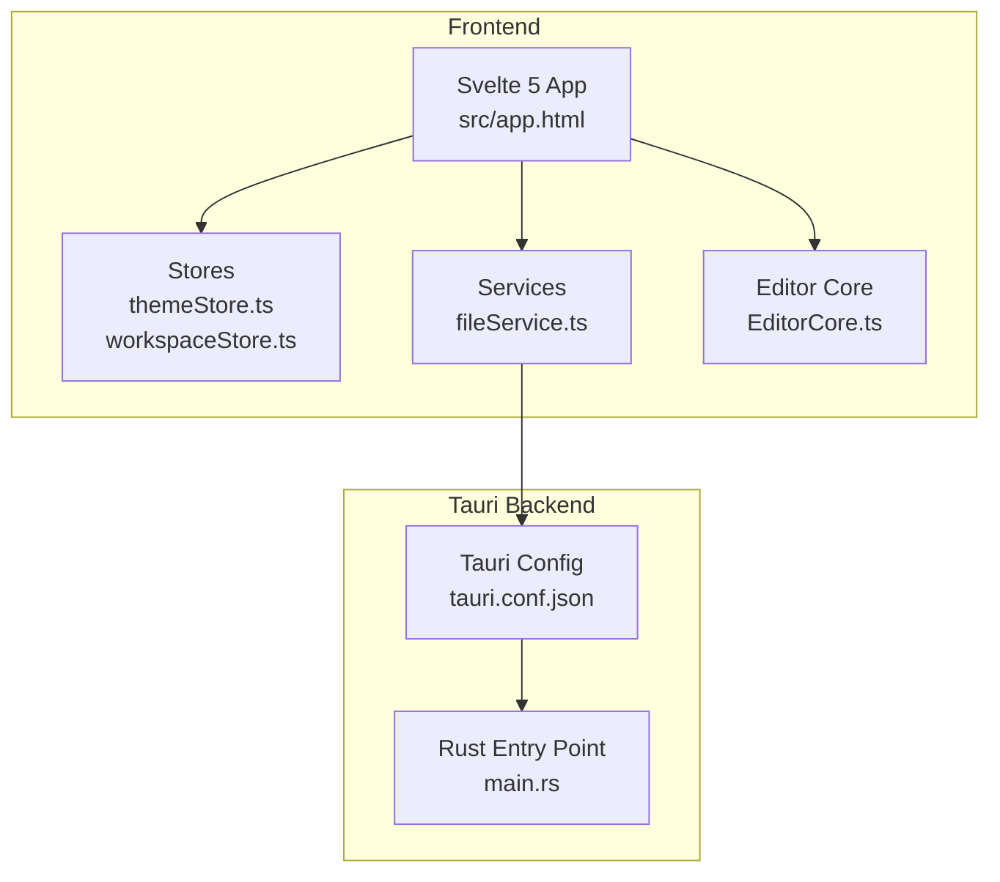
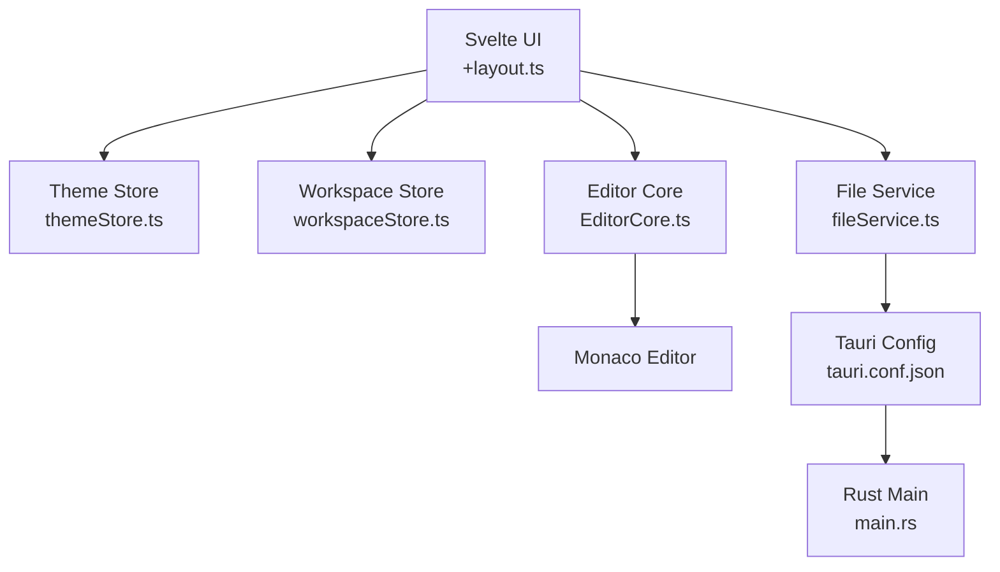
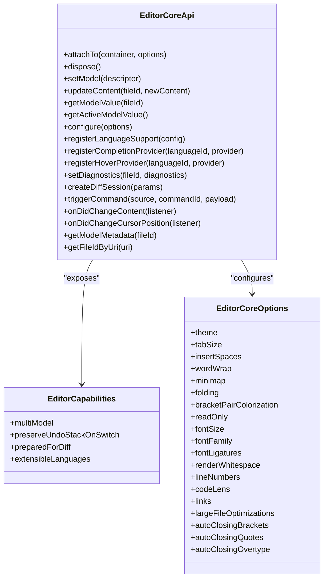
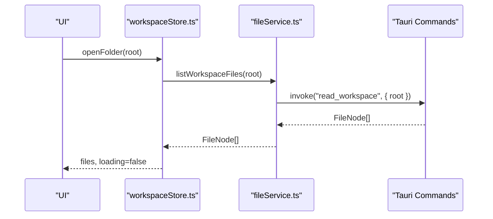
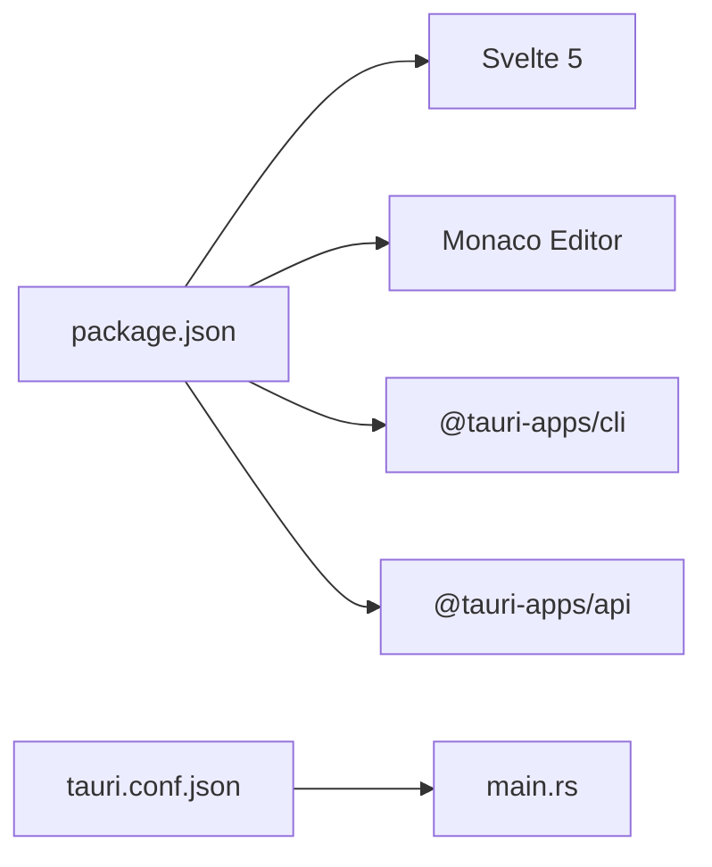

# Introduction

<cite>
**Referenced Files in This Document**
- [README.md](file://README.md)
- [README.pt-br.md](file://README.pt-br.md)
- [README.ru.md](file://README.ru.md)
- [package.json](file://package.json)
- [svelte.config.js](file://svelte.config.js)
- [src-tauri/tauri.conf.json](file://src-tauri/tauri.conf.json)
- [src-tauri/src/main.rs](file://src-tauri/src/main.rs)
- [src/app.html](file://src/app.html)
- [src/lib/editor/EditorCore.ts](file://src/lib/editor/EditorCore.ts)
- [src/lib/stores/themeStore.ts](file://src/lib/stores/themeStore.ts)
- [src/lib/stores/workspaceStore.ts](file://src/lib/stores/workspaceStore.ts)
- [src/lib/services/fileService.ts](file://src/lib/services/fileService.ts)
- [src/lib/settings/types.ts](file://src/lib/settings/types.ts)
</cite>

## Update Summary
**Changes Made**
- Updated repository URL in all README files (English, Portuguese, Russian) from `https://github.com/FerrisMind/Nova-Code.git` to ensure documentation accuracy
- Verified consistency across all language versions of the documentation
- Maintained all other content and structure of the README files

## Table of Contents
1. [Introduction](#introduction)
2. [Project Structure](#project-structure)
3. [Core Components](#core-components)
4. [Architecture Overview](#architecture-overview)
5. [Detailed Component Analysis](#detailed-component-analysis)
6. [Dependency Analysis](#dependency-analysis)
7. [Performance Considerations](#performance-considerations)
8. [Troubleshooting Guide](#troubleshooting-guide)
9. [Conclusion](#conclusion)

## Introduction
Nova Code is a modern, lightweight, and high-performance code editor designed to deliver the responsiveness of a native application while leveraging the flexibility of a web-based interface. Built with Svelte 5, Monaco Editor, and Tauri v2, it targets developers who want a fast, efficient, and customizable editor without sacrificing advanced editing capabilities.

Vision and goals
- Combine web interface flexibility with native application performance.
- Deliver fast startup times, low memory usage, and a responsive UI.
- Provide a modern alternative to traditional code editors with a focus on extensibility and customization from the outset.

Key benefits
- Lightweight and high-performance: optimized rendering and minimal resource consumption.
- Responsive UI: reactive components powered by Svelte 5 for smooth interactions.
- Advanced editing features: Monaco Editor provides syntax highlighting, IntelliSense, diagnostics, and more.
- Secure system-level operations: Tauri v2 enables safe, granular access to native capabilities.

Technology stack highlights
- Svelte 5: reactive UI framework for building fast and maintainable interfaces.
- Monaco Editor: the same engine powering VS Code, enabling professional-grade editing features.
- Tauri v2: cross-platform desktop runtime that bridges web technologies and native system access.
- Vite: modern frontend tooling for development and builds.
- Tailwind CSS v4: utility-first styling for rapid UI iteration.

How it differs from other editors
- Built as a Tauri v2 desktop application, offering native performance and secure IPC boundaries.
- Uses Monaco Editor as the core editor engine, aligning with VS Code’s capabilities.
- Designed with extensibility and customization in mind from the ground up, including modular settings, themes, and editor configurations.

Basic usage examples
- Launch the application in development mode:
  - Run the Tauri development command to start the Vite frontend server and open the Tauri window.
- Open a project:
  - Use the workspace store to open a folder and load its file tree.
  - The file service invokes Tauri commands to read files, watch for changes, and manage the workspace.

Extensibility and customization
- Modular settings system with categories and profiles.
- Theme store supporting light/dark modes and palette switching.
- Editor core designed for language support, IntelliSense providers, and diagnostics.

**Section sources**
- [README.md](file://README.md#L5-L21)
- [package.json](file://package.json#L1-L41)
- [svelte.config.js](file://svelte.config.js#L1-L19)
- [src-tauri/tauri.conf.json](file://src-tauri/tauri.conf.json#L1-L44)
- [src-tauri/src/main.rs](file://src-tauri/src/main.rs#L1-L7)
- [src/app.html](file://src/app.html#L1-L49)

## Project Structure
At a high level, the project is organized into:
- Frontend (Svelte 5 + Monaco Editor + Stores + Services)
- Tauri v2 backend (configuration, CLI, and Rust entrypoint)
- Build tooling (Vite) and package management (Node.js + Rust)

**Diagram sources**
- [src/app.html](file://src/app.html#L1-L49)
- [src/lib/stores/themeStore.ts](file://src/lib/stores/themeStore.ts#L1-L120)
- [src/lib/stores/workspaceStore.ts](file://src/lib/stores/workspaceStore.ts#L1-L130)
- [src/lib/services/fileService.ts](file://src/lib/services/fileService.ts#L1-L85)
- [src/lib/editor/EditorCore.ts](file://src/lib/editor/EditorCore.ts#L1-L315)
- [src-tauri/tauri.conf.json](file://src-tauri/tauri.conf.json#L1-L44)
- [src-tauri/src/main.rs](file://src-tauri/src/main.rs#L1-L7)

**Section sources**
- [README.md](file://README.md#L5-L21)
- [package.json](file://package.json#L1-L41)
- [svelte.config.js](file://svelte.config.js#L1-L19)
- [src-tauri/tauri.conf.json](file://src-tauri/tauri.conf.json#L1-L44)
- [src-tauri/src/main.rs](file://src-tauri/src/main.rs#L1-L7)

## Core Components
- Editor Core (Monaco integration): Provides a typed, encapsulated API for Monaco Editor, including model management, configuration, language support registration, diagnostics, and diff editor sessions.
- Theme Store (Svelte): Manages theme mode and palette, enabling dynamic UI theming across the application.
- Workspace Store (Svelte): Tracks the current workspace root, file tree, and loading state, integrating with file watching.
- File Service (Frontend + Tauri): Exposes asynchronous APIs for reading/writing files, listing workspace contents, and managing file watchers via Tauri commands.
- Settings Types (Svelte): Defines a modular settings contract for categories, sections, previews, profiles, and history, enabling future extensibility.

**Section sources**
- [src/lib/editor/EditorCore.ts](file://src/lib/editor/EditorCore.ts#L1-L315)
- [src/lib/stores/themeStore.ts](file://src/lib/stores/themeStore.ts#L1-L120)
- [src/lib/stores/workspaceStore.ts](file://src/lib/stores/workspaceStore.ts#L1-L130)
- [src/lib/services/fileService.ts](file://src/lib/services/fileService.ts#L1-L85)
- [src/lib/settings/types.ts](file://src/lib/settings/types.ts#L1-L192)

## Architecture Overview
Nova Code follows a layered architecture:
- UI Layer (Svelte 5): Reactive components and stores.
- Editor Layer (Monaco): Editor core manages Monaco instances, models, and editor options.
- Service Layer (Tauri): Bridges frontend to native capabilities via IPC commands.
- Configuration Layer (Tauri v2): Application configuration and bundling.

**Diagram sources**
- [src/routes/+layout.ts](file://src/routes/+layout.ts#L1-L6)
- [src/lib/stores/themeStore.ts](file://src/lib/stores/themeStore.ts#L1-L120)
- [src/lib/stores/workspaceStore.ts](file://src/lib/stores/workspaceStore.ts#L1-L130)
- [src/lib/services/fileService.ts](file://src/lib/services/fileService.ts#L1-L85)
- [src/lib/editor/EditorCore.ts](file://src/lib/editor/EditorCore.ts#L1-L315)
- [src-tauri/tauri.conf.json](file://src-tauri/tauri.conf.json#L1-L44)
- [src-tauri/src/main.rs](file://src-tauri/src/main.rs#L1-L7)

## Detailed Component Analysis

### Editor Core (Monaco)
Responsibilities
- Encapsulate Monaco Editor API usage.
- Manage editor instances, models, and configuration.
- Provide typed APIs for language support, IntelliSense providers, diagnostics, and diff sessions.
- Preserve undo/redo stacks during model switches and support multiple models.

Performance characteristics
- Optimized editor options for responsiveness (automatic layout, minimal animations, quick suggestions delay).
- Minimap and folding configured for performance.
- Large file optimizations configurable.

Extensibility
- Designed for language support registration and IntelliSense providers.
- Diff editor integration points for side-by-side comparison.

**Diagram sources**
- [src/lib/editor/EditorCore.ts](file://src/lib/editor/EditorCore.ts#L1-L315)

**Section sources**
- [src/lib/editor/EditorCore.ts](file://src/lib/editor/EditorCore.ts#L1-L315)

### Theme Store (Svelte)
Responsibilities
- Manage theme mode (light/dark) and palette selection.
- Provide reactive state for UI theming across the application.
- Preserve palette "slots" when toggling modes.

Integration
- Consumed by layout and settings UI to reflect theme changes immediately.

**Section sources**
- [src/lib/stores/themeStore.ts](file://src/lib/stores/themeStore.ts#L1-L120)

### Workspace Store and File Service
Responsibilities
- Track the current workspace root and file tree.
- Watch for file system changes and refresh the UI accordingly.
- Provide asynchronous APIs for file operations via Tauri commands.

**Diagram sources**
- [src/lib/stores/workspaceStore.ts](file://src/lib/stores/workspaceStore.ts#L1-L130)
- [src/lib/services/fileService.ts](file://src/lib/services/fileService.ts#L1-L85)

**Section sources**
- [src/lib/stores/workspaceStore.ts](file://src/lib/stores/workspaceStore.ts#L1-L130)
- [src/lib/services/fileService.ts](file://src/lib/services/fileService.ts#L1-L85)

### Settings Types (Modular Settings Contract)
Responsibilities
- Define categories, sections, and controls for settings.
- Provide a contract for reading/writing values via existing stores.
- Enable future features like profiles, snapshots, and history.

**Section sources**
- [src/lib/settings/types.ts](file://src/lib/settings/types.ts#L1-L192)

## Dependency Analysis
Frontend dependencies
- Svelte 5 and Vite for the UI and build pipeline.
- Monaco Editor for the core editing experience.
- Tauri APIs for IPC and dialogs/opener plugins.

Tauri configuration
- Application window sizing and decorations.
- Security policy and asset protocol configuration.
- Build hooks for frontend distribution.

**Diagram sources**
- [package.json](file://package.json#L1-L41)
- [src-tauri/tauri.conf.json](file://src-tauri/tauri.conf.json#L1-L44)
- [src-tauri/src/main.rs](file://src-tauri/src/main.rs#L1-L7)

**Section sources**
- [package.json](file://package.json#L1-L41)
- [src-tauri/tauri.conf.json](file://src-tauri/tauri.conf.json#L1-L44)

## Performance Considerations
- Editor responsiveness: automatic layout, reduced animations, and quick suggestions delay improve perceived performance.
- Minimap and folding tuned for speed.
- Large file optimizations configurable to balance usability and performance.
- Svelte 5's reactivity ensures efficient updates without unnecessary redraws.
- Tauri v2's lightweight runtime reduces overhead compared to heavier frameworks.

[No sources needed since this section provides general guidance]

## Troubleshooting Guide
Common setup and runtime issues
- Development mode prerequisites: ensure Node.js LTS and Rust with cargo are installed as per Tauri requirements.
- Running in development: use the Tauri development command to start the Vite server and open the Tauri window.
- Building the application: use the Tauri build command to produce platform-specific executables.

Workspace and file operations
- If the workspace does not load, verify the workspace root and permissions.
- If file changes are not reflected, ensure the file watcher is started and events are being received.

Editor core
- If Monaco features are missing, confirm language support registration and provider configuration.
- For diff sessions, ensure both original and modified models exist and are mounted correctly.

**Section sources**
- [README.md](file://README.md#L22-L66)
- [src/lib/stores/workspaceStore.ts](file://src/lib/stores/workspaceStore.ts#L1-L130)
- [src/lib/services/fileService.ts](file://src/lib/services/fileService.ts#L1-L85)
- [src/lib/editor/EditorCore.ts](file://src/lib/editor/EditorCore.ts#L1-L315)

## Conclusion
Nova Code delivers a modern, high-performance code editing experience by combining Svelte 5's reactive UI, Monaco Editor's advanced editing capabilities, and Tauri v2's secure, native runtime. Its architecture emphasizes extensibility and customization from the outset, enabling developers to tailor the editor to their workflows while maintaining fast startup times, low memory usage, and a responsive interface.

[No sources needed since this section summarizes without analyzing specific files]