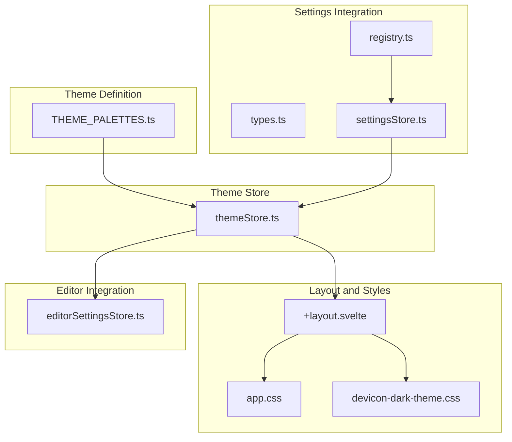
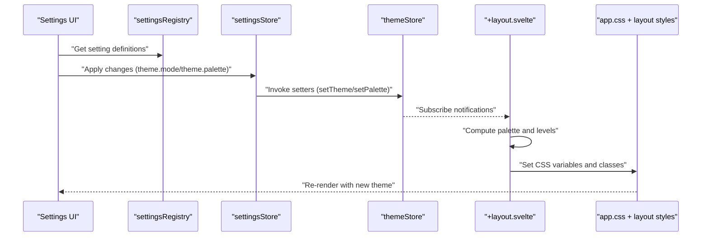
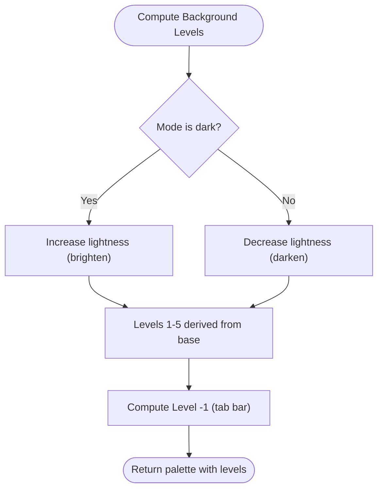
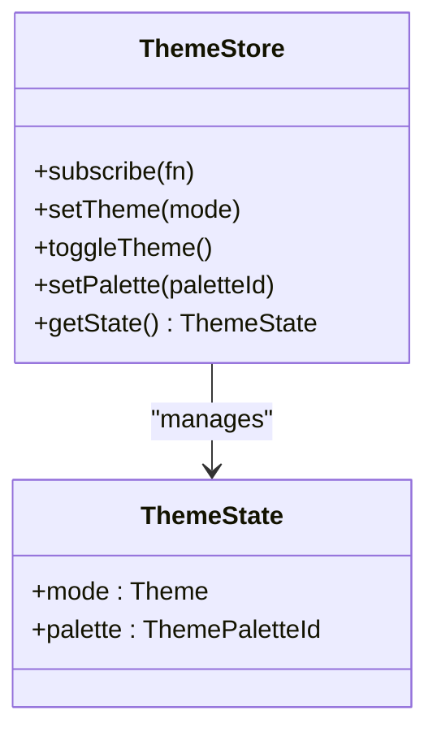
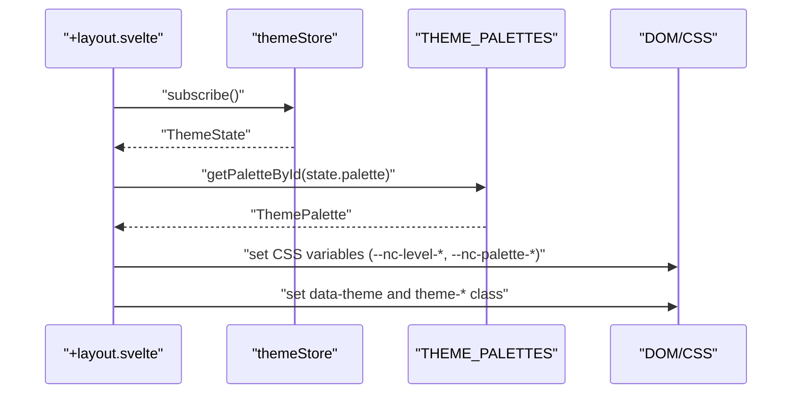
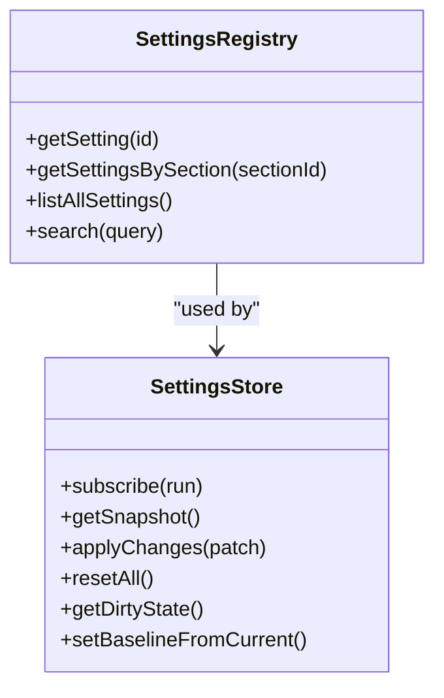
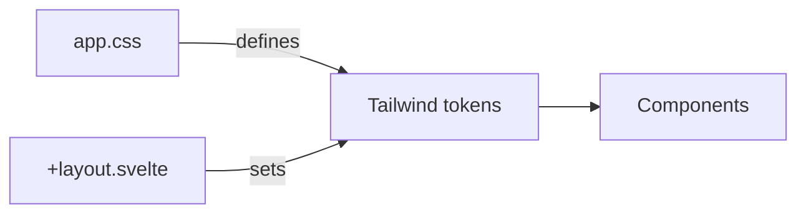
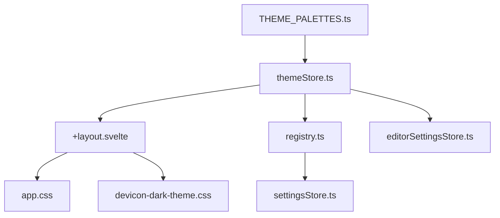

# UI Themes

<cite>
**Referenced Files in This Document**
- [THEME_PALETTES.ts](file://src/lib/stores/THEME_PALETTES.ts)
- [themeStore.ts](file://src/lib/stores/themeStore.ts)
- [THEME_QUICK_START.ts](file://src/lib/stores/THEME_QUICK_START.ts)
- [+layout.svelte](file://src/routes/+layout.svelte)
- [app.css](file://src/app.css)
- [registry.ts](file://src/lib/settings/registry.ts)
- [types.ts](file://src/lib/settings/types.ts)
- [settingsStore.ts](file://src/lib/stores/settingsStore.ts)
- [settingsProfilesStore.ts](file://src/lib/stores/settingsProfilesStore.ts)
- [settingsHistoryStore.ts](file://src/lib/stores/settingsHistoryStore.ts)
- [devicon-dark-theme.css](file://static/devicon-dark-theme.css)
- [editorSettingsStore.ts](file://src/lib/stores/editorSettingsStore.ts)
</cite>

## Table of Contents
1. [Introduction](#introduction)
2. [Project Structure](#project-structure)
3. [Core Components](#core-components)
4. [Architecture Overview](#architecture-overview)
5. [Detailed Component Analysis](#detailed-component-analysis)
6. [Dependency Analysis](#dependency-analysis)
7. [Performance Considerations](#performance-considerations)
8. [Troubleshooting Guide](#troubleshooting-guide)
9. [Conclusion](#conclusion)
10. [Appendices](#appendices)

## Introduction
This document explains the UI themes sub-feature for the Nova Code editor’s user interface. It covers how the theme store manages UI theme state, how changes propagate through Svelte stores, the structure of THEME_PALETTES and how it defines color schemes for UI components (sidebar, tabs, panels), how theme variables are implemented in CSS and dynamically updated, quick start theme combinations, customization via the settings interface and direct store manipulation, the relationship between UI themes and Tailwind CSS utility classes, and accessibility considerations including high contrast modes and persistence across restarts.

## Project Structure
The UI theme system is centered around a small set of cohesive modules:
- Theme palette definitions and helpers
- Theme store for reactive state
- Settings registry and types for UI-driven customization
- Application layout that applies CSS variables and Tailwind classes
- Static assets for icon theme adaptation
- Editor settings integration for coordinated editor theme pairing

**Diagram sources**
- [THEME_PALETTES.ts](file://src/lib/stores/THEME_PALETTES.ts#L1-L155)
- [themeStore.ts](file://src/lib/stores/themeStore.ts#L1-L120)
- [registry.ts](file://src/lib/settings/registry.ts#L128-L174)
- [types.ts](file://src/lib/settings/types.ts#L24-L110)
- [+layout.svelte](file://src/routes/+layout.svelte#L1-L136)
- [app.css](file://src/app.css#L1-L111)
- [devicon-dark-theme.css](file://static/devicon-dark-theme.css#L1-L69)
- [editorSettingsStore.ts](file://src/lib/stores/editorSettingsStore.ts#L1-L180)

**Section sources**
- [THEME_PALETTES.ts](file://src/lib/stores/THEME_PALETTES.ts#L1-L155)
- [themeStore.ts](file://src/lib/stores/themeStore.ts#L1-L120)
- [registry.ts](file://src/lib/settings/registry.ts#L128-L174)
- [types.ts](file://src/lib/settings/types.ts#L24-L110)
- [+layout.svelte](file://src/routes/+layout.svelte#L1-L136)
- [app.css](file://src/app.css#L1-L111)
- [devicon-dark-theme.css](file://static/devicon-dark-theme.css#L1-L69)
- [editorSettingsStore.ts](file://src/lib/stores/editorSettingsStore.ts#L1-L180)

## Core Components
- THEME_PALETTES: Defines approved palettes and computes background level gradients for both light and dark modes. Provides utilities to retrieve palettes by id and mode.
- themeStore: Central Svelte store managing theme mode and palette selection, with methods to set theme, toggle theme, and set palette. Exposes a synchronous getState for early initialization.
- +layout.svelte: Applies theme state to CSS variables, sets data-theme attributes, and toggles theme classes for Tailwind variants.
- registry.ts + types.ts: Define settings metadata and controls for theme.mode and theme.palette, including dynamic options filtered by current mode.
- settingsStore.ts: Aggregates snapshots from domain stores (including theme) and exposes applyChanges/reset/getDirtyState for UI-driven operations.
- app.css: Establishes Tailwind base tokens and theme-aware CSS variables for global UI.
- devicon-dark-theme.css: Adjusts icon colors for both light and dark themes.
- editorSettingsStore.ts: Integrates editor theme selection and editor-specific UI settings.

**Section sources**
- [THEME_PALETTES.ts](file://src/lib/stores/THEME_PALETTES.ts#L21-L155)
- [themeStore.ts](file://src/lib/stores/themeStore.ts#L1-L120)
- [+layout.svelte](file://src/routes/+layout.svelte#L1-L136)
- [registry.ts](file://src/lib/settings/registry.ts#L128-L174)
- [types.ts](file://src/lib/settings/types.ts#L24-L110)
- [settingsStore.ts](file://src/lib/stores/settingsStore.ts#L1-L120)
- [app.css](file://src/app.css#L1-L111)
- [devicon-dark-theme.css](file://static/devicon-dark-theme.css#L1-L69)
- [editorSettingsStore.ts](file://src/lib/stores/editorSettingsStore.ts#L1-L180)

## Architecture Overview
The theme system follows a “single source of truth” pattern:
- THEME_PALETTES defines the approved color scheme contract.
- themeStore holds the current ThemeState and exposes imperative methods to mutate it.
- +layout.svelte subscribes to themeStore and updates CSS variables and classes.
- registry.ts and settingsStore expose theme settings to the UI and enable programmatic changes.
- app.css and Tailwind define the base tokens and theme-aware variables consumed by components.
- devicon-dark-theme.css adapts icon colors for both themes.

**Diagram sources**
- [registry.ts](file://src/lib/settings/registry.ts#L128-L174)
- [settingsStore.ts](file://src/lib/stores/settingsStore.ts#L248-L285)
- [themeStore.ts](file://src/lib/stores/themeStore.ts#L47-L117)
- [+layout.svelte](file://src/routes/+layout.svelte#L46-L85)
- [app.css](file://src/app.css#L1-L111)

## Detailed Component Analysis

### THEME_PALETTES: Palette Definitions and Background Levels
- Purpose: Single source of truth for approved UI color palettes and computed background levels.
- Structure:
  - ThemeMode: 'light' | 'dark'
  - ThemePaletteId: union of 'light-default' | 'light-alt-1' | ... | 'dark-alt-3'
  - ThemePalette: id, label, mode, backgroundPrimary, backgroundLevels (levels 0–5), backgroundLevelMinus1, textColor
- Computed levels:
  - calculateBackgroundLevels(baseColor, mode): derives levels 1–5 from baseColor using HSL adjustments depending on mode.
  - calculateBackgroundLevelMinus1(baseColor, mode): derives level -1 (e.g., tab bar) using HSL adjustments.
- Utilities:
  - getPaletteById(id)
  - getDefaultPaletteForMode(mode)
  - listPalettesByMode(mode)

**Diagram sources**
- [THEME_PALETTES.ts](file://src/lib/stores/THEME_PALETTES.ts#L158-L314)

**Section sources**
- [THEME_PALETTES.ts](file://src/lib/stores/THEME_PALETTES.ts#L21-L155)
- [THEME_PALETTES.ts](file://src/lib/stores/THEME_PALETTES.ts#L158-L314)

### themeStore: Reactive Theme State and Mutations
- ThemeState: mode and palette
- Methods:
  - setTheme(mode): switches mode while preserving palette slot (e.g., dark-alt-2 becomes light-alt-2)
  - toggleTheme(): flips mode preserving slot
  - setPalette(paletteId): selects a palette by id
  - getState(): synchronous getter for early initialization
- Design: minimal logic here; all palette computations are in THEME_PALETTES.

**Diagram sources**
- [themeStore.ts](file://src/lib/stores/themeStore.ts#L1-L120)

**Section sources**
- [themeStore.ts](file://src/lib/stores/themeStore.ts#L1-L120)

### +layout.svelte: Applying Theme Variables and Classes
- Subscribes to themeStore and initializes on mount.
- Computes palette and levels, then:
  - Sets data-theme attribute for global selectors and icon themes
  - Writes CSS variables for levels (-1..5), active tab background, text color, and borders
  - Adds theme-dark or theme-light class for Tailwind variants
- Consumes variables in component styles (e.g., background-color, color, border) to reflect palette levels.

**Diagram sources**
- [+layout.svelte](file://src/routes/+layout.svelte#L46-L85)
- [THEME_PALETTES.ts](file://src/lib/stores/THEME_PALETTES.ts#L293-L314)

**Section sources**
- [+layout.svelte](file://src/routes/+layout.svelte#L1-L136)

### Settings Integration: registry.ts and settingsStore.ts
- registry.ts:
  - Exposes theme.mode and theme.palette as selectable settings with:
    - theme.mode: toggle control mapped to theme.setTheme
    - theme.palette: select control with options filtered by current mode
- settingsStore.ts:
  - Builds a snapshot of current settings (including theme)
  - Applies changes by invoking definition.set(), which calls theme setters
  - Tracks dirty state and supports resetAll

**Diagram sources**
- [registry.ts](file://src/lib/settings/registry.ts#L128-L174)
- [types.ts](file://src/lib/settings/types.ts#L24-L110)
- [settingsStore.ts](file://src/lib/stores/settingsStore.ts#L198-L233)

**Section sources**
- [registry.ts](file://src/lib/settings/registry.ts#L128-L174)
- [types.ts](file://src/lib/settings/types.ts#L24-L110)
- [settingsStore.ts](file://src/lib/stores/settingsStore.ts#L198-L233)

### CSS Variables and Tailwind Integration
- app.css:
  - Defines Tailwind base tokens and theme-aware variables for background, foreground, card, popover, primary, secondary, muted, accent, destructive, border, input, ring, and sidebar tokens.
  - Uses dark variant selector to invert tokens for .dark class.
  - Maps Tailwind variables to internal color-* variables for consistent theming.
- +layout.svelte:
  - Applies theme-dark or theme-light class and sets --nc-level-* and --nc-palette-* variables.
  - Components consume these variables for backgrounds, borders, and text.

**Diagram sources**
- [app.css](file://src/app.css#L1-L111)
- [+layout.svelte](file://src/routes/+layout.svelte#L325-L366)

**Section sources**
- [app.css](file://src/app.css#L1-L111)
- [+layout.svelte](file://src/routes/+layout.svelte#L325-L366)

### Quick Start Theme Combinations
- THEME_QUICK_START.ts documents:
  - Available palettes per mode (light-default, light-alt-1..3, dark-default, dark-alt-1..3)
  - Level hierarchy and brightness progression
  - CSS variable usage and selector patterns
  - Files involved in the system

These combinations provide coordinated UI and editor theme pairings:
- Use theme.setTheme('light' | 'dark') to switch modes.
- Use theme.setPalette('light-default' | 'light-alt-1' | ... | 'dark-alt-3') to pick a palette.
- Subscribe to theme to react to changes.

**Section sources**
- [THEME_QUICK_START.ts](file://src/lib/stores/THEME_QUICK_START.ts#L1-L135)

### Customizing UI Colors via Settings and Direct Store Manipulation
- Via Settings UI:
  - Navigate to Theme & Palette section.
  - Toggle theme.mode and select theme.palette from the filtered list.
- Direct store manipulation:
  - theme.setTheme('light' | 'dark')
  - theme.toggleTheme()
  - theme.setPalette('light-default' | 'dark-alt-2' | ...)
  - theme.getState() for immediate reads during initialization

**Section sources**
- [registry.ts](file://src/lib/settings/registry.ts#L132-L174)
- [themeStore.ts](file://src/lib/stores/themeStore.ts#L47-L117)

### Relationship Between UI Themes and Tailwind CSS Utility Classes
- Tailwind base tokens are defined in app.css and mapped to internal color-* variables.
- +layout.svelte toggles theme-dark or theme-light class, enabling dark variant selectors to invert tokens.
- Components can use Tailwind utilities that rely on these tokens, ensuring consistent theming across the UI.

**Section sources**
- [app.css](file://src/app.css#L1-L111)
- [+layout.svelte](file://src/routes/+layout.svelte#L325-L366)

### Accessibility Features and High Contrast Modes
- High contrast considerations:
  - The codebase does not currently define explicit high contrast variables or selectors. The theme system focuses on palette-driven color levels and Tailwind token inversion via .dark.
  - If high contrast support is desired, introduce explicit high-contrast tokens and selectors in app.css and map them in +layout.svelte similarly to how theme-dark/theme-light are handled.
- Icon accessibility:
  - devicon-dark-theme.css adjusts icon brightness and fixes problematic colors for both themes to improve visibility on contrasting backgrounds.

**Section sources**
- [devicon-dark-theme.css](file://static/devicon-dark-theme.css#L1-L69)

### Persistence Across Application Restarts
- The repository demonstrates persistence patterns for settings via Tauri commands:
  - settings_profiles_store persists and loads profiles.
  - settings_history_store persists and loads history.
- While theme state is reactive and stored in memory, the same pattern can be applied to persist theme.mode and theme.palette across sessions by:
  - Saving theme.getState() to disk on change
  - Loading and applying saved state on startup
  - Using Tauri commands similar to settings_profiles_save/load to store and restore theme settings

**Section sources**
- [settingsProfilesStore.ts](file://src/lib/stores/settingsProfilesStore.ts#L139-L426)
- [settingsHistoryStore.ts](file://src/lib/stores/settingsHistoryStore.ts#L1-L110)

## Dependency Analysis
- Coupling:
  - +layout.svelte depends on themeStore and THEME_PALETTES for applying CSS variables.
  - registry.ts depends on themeStore for options and theme.getState() for UI binding.
  - settingsStore depends on themeStore for snapshot aggregation and change application.
- Cohesion:
  - THEME_PALETTES encapsulates palette computation logic, keeping themeStore lean.
  - settingsStore aggregates domain stores and exposes a clean API for UI operations.
- External dependencies:
  - Tailwind base tokens and dark variant selectors in app.css.
  - devicon icon overrides in devicon-dark-theme.css.

**Diagram sources**
- [THEME_PALETTES.ts](file://src/lib/stores/THEME_PALETTES.ts#L1-L155)
- [themeStore.ts](file://src/lib/stores/themeStore.ts#L1-L120)
- [+layout.svelte](file://src/routes/+layout.svelte#L1-L136)
- [registry.ts](file://src/lib/settings/registry.ts#L128-L174)
- [settingsStore.ts](file://src/lib/stores/settingsStore.ts#L198-L233)
- [app.css](file://src/app.css#L1-L111)
- [devicon-dark-theme.css](file://static/devicon-dark-theme.css#L1-L69)
- [editorSettingsStore.ts](file://src/lib/stores/editorSettingsStore.ts#L1-L180)

**Section sources**
- [THEME_PALETTES.ts](file://src/lib/stores/THEME_PALETTES.ts#L1-L155)
- [themeStore.ts](file://src/lib/stores/themeStore.ts#L1-L120)
- [+layout.svelte](file://src/routes/+layout.svelte#L1-L136)
- [registry.ts](file://src/lib/settings/registry.ts#L128-L174)
- [settingsStore.ts](file://src/lib/stores/settingsStore.ts#L198-L233)
- [app.css](file://src/app.css#L1-L111)
- [devicon-dark-theme.css](file://static/devicon-dark-theme.css#L1-L69)
- [editorSettingsStore.ts](file://src/lib/stores/editorSettingsStore.ts#L1-L180)

## Performance Considerations
- CSS variable updates are efficient; they trigger style recalculations only for affected nodes.
- THEME_PALETTES computes levels once per palette selection; keep palette choices discrete to minimize recomputation.
- Subscribe to themeStore only where necessary (e.g., +layout.svelte) to avoid unnecessary re-renders in components that do not depend on theme.

## Troubleshooting Guide
- Theme not applying:
  - Verify +layout.svelte is subscribed and applying CSS variables and data-theme attribute.
  - Confirm palette ids are valid ThemePaletteId values.
- Incorrect icon colors:
  - Ensure devicon-dark-theme.css is loaded and data-theme attribute is set.
- Editor theme mismatch:
  - editorSettingsStore defaults to theme: 'auto'; ensure it remains 'auto' to follow UI palette or set a specific editor theme id.

**Section sources**
- [+layout.svelte](file://src/routes/+layout.svelte#L46-L85)
- [devicon-dark-theme.css](file://static/devicon-dark-theme.css#L1-L69)
- [editorSettingsStore.ts](file://src/lib/stores/editorSettingsStore.ts#L34-L58)

## Conclusion
The UI themes subsystem centers on a strict palette contract, a reactive theme store, and a layout that dynamically applies CSS variables and Tailwind tokens. Settings integration provides a user-friendly way to switch modes and palettes, while editor settings can be coordinated to complement UI themes. Persistence can be added using the established Tauri patterns demonstrated by profiles and history stores.

## Appendices

### Appendix A: Palette and Level Reference
- Palettes by mode:
  - light-default, light-alt-1, light-alt-2, light-alt-3
  - dark-default, dark-alt-1, dark-alt-2, dark-alt-3
- Level hierarchy:
  - Level -1: Tab bar
  - Level 0: Base (sidebar)
  - Level 1–2: Work area/cards
  - Level 3: Buttons
  - Level 4: Intermediate
  - Level 5: Hover states

**Section sources**
- [THEME_PALETTES.ts](file://src/lib/stores/THEME_PALETTES.ts#L60-L155)
- [THEME_QUICK_START.ts](file://src/lib/stores/THEME_QUICK_START.ts#L73-L82)

### Appendix B: CSS Variable Contracts
- Root-level variables:
  - --nc-level-minus1, --nc-level-0..5
  - --nc-palette-text, --nc-palette-border
  - --nc-tab-bg-active
- Tailwind mapping:
  - --color-background, --color-foreground, etc., mapped from Tailwind tokens

**Section sources**
- [+layout.svelte](file://src/routes/+layout.svelte#L46-L85)
- [+layout.svelte](file://src/routes/+layout.svelte#L325-L366)
- [app.css](file://src/app.css#L67-L100)