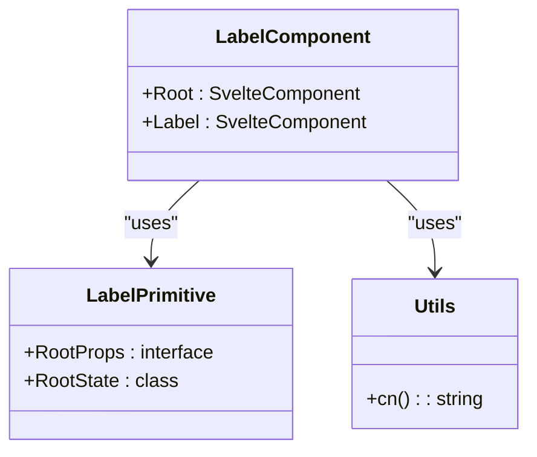
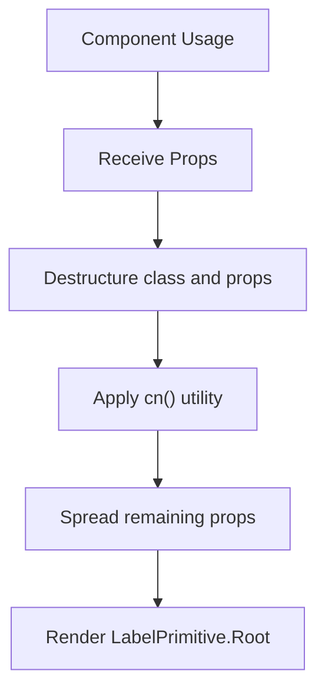
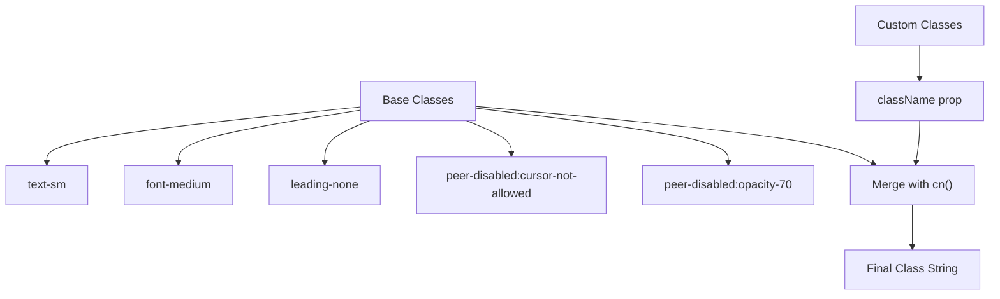
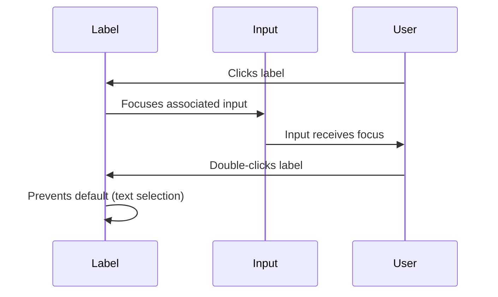
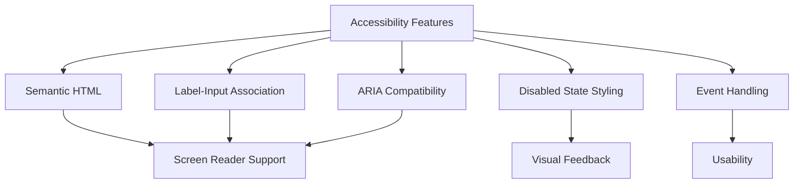
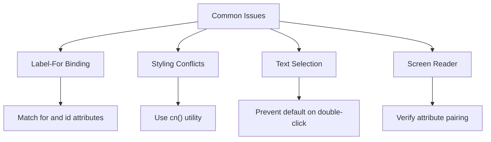

# Label Component

<cite>
**Referenced Files in This Document**   
- [label.svelte](file://src/lib/components/ui/label/label.svelte)
- [index.ts](file://src/lib/components/ui/label/index.ts)
- [label.svelte.ts](file://tp/bits-ui/packages/bits-ui/src/lib/bits/label/label.svelte.ts)
- [types.ts](file://tp/bits-ui/packages/bits-ui/src/lib/bits/label/types.ts)
- [utils.js](file://src/lib/utils.js)
</cite>

## Table of Contents
1. [Introduction](#introduction)
2. [Component Architecture](#component-architecture)
3. [Props and Attributes](#props-and-attributes)
4. [Styling and Tailwind CSS](#styling-and-tailwind-css)
5. [Integration with Form Controls](#integration-with-form-controls)
6. [Accessibility Features](#accessibility-features)
7. [Usage Examples](#usage-examples)
8. [Common Issues and Solutions](#common-issues-and-solutions)
9. [Conclusion](#conclusion)

## Introduction
The Label component in the NC code editor is a reusable UI element designed to provide accessible labeling for form controls. Built using Svelte and styled with Tailwind CSS utility classes, this component enhances user experience by ensuring proper association between labels and their corresponding inputs. The implementation leverages the bits-ui library to provide enhanced functionality while maintaining simplicity for developers.

**Section sources**
- [label.svelte](file://src/lib/components/ui/label/label.svelte#L1-L16)
- [index.ts](file://src/lib/components/ui/label/index.ts#L1-L8)

## Component Architecture
The Label component follows a composition pattern typical of modern Svelte component libraries. It wraps the bits-ui Label primitive, adding project-specific styling and conventions. The architecture consists of two main files: the Svelte component file and an index export file that provides named exports for easier importing.

The component uses Svelte's `$props()` mechanism to receive and distribute properties, allowing for flexible usage patterns. It extends the base LabelPrimitive from bits-ui, maintaining compatibility with the underlying library while adding NC-specific styling through the `cn` utility function.



**Diagram sources**
- [label.svelte](file://src/lib/components/ui/label/label.svelte#L1-L16)
- [index.ts](file://src/lib/components/ui/label/index.ts#L1-L8)
- [label.svelte.ts](file://tp/bits-ui/packages/bits-ui/src/lib/bits/label/label.svelte.ts#L1-L40)

**Section sources**
- [label.svelte](file://src/lib/components/ui/label/label.svelte#L1-L16)
- [index.ts](file://src/lib/components/ui/label/index.ts#L1-L8)
- [label.svelte.ts](file://tp/bits-ui/packages/bits-ui/src/lib/bits/label/label.svelte.ts#L1-L40)

## Props and Attributes
The Label component accepts standard HTML label attributes along with a `class` prop for custom styling. The props are destructured from `$props()` using the LabelPrimitive.RootProps type, which includes all standard label attributes and additional properties defined by the bits-ui library.

Key props include:
- `class`: Additional CSS classes to apply to the label
- All standard HTML label attributes (id, for, etc.) are passed through to the underlying element

The component automatically handles the `data-slot="label"` attribute, which is used for styling purposes in the Tailwind CSS system.



**Diagram sources**
- [label.svelte](file://src/lib/components/ui/label/label.svelte#L5-L15)
- [types.ts](file://tp/bits-ui/packages/bits-ui/src/lib/bits/label/types.ts#L1-L8)

**Section sources**
- [label.svelte](file://src/lib/components/ui/label/label.svelte#L5-L15)
- [types.ts](file://tp/bits-ui/packages/bits-ui/src/lib/bits/label/types.ts#L1-L8)

## Styling and Tailwind CSS
The Label component uses Tailwind CSS utility classes for styling, combined with the `cn` utility function for class composition. The base styling includes:

- Text size: `text-sm` (small text)
- Font weight: `font-medium` (medium weight)
- Line height: `leading-none` (no extra line height)
- Disabled state styling: `peer-disabled:cursor-not-allowed` and `peer-disabled:opacity-70`

The `cn` function from `$lib/utils.js` is used to merge the base classes with any custom classes passed via the `class` prop, ensuring that custom styling doesn't override the essential accessibility and visual properties.



**Diagram sources**
- [label.svelte](file://src/lib/components/ui/label/label.svelte#L10-L13)
- [utils.js](file://src/lib/utils.js)

**Section sources**
- [label.svelte](file://src/lib/components/ui/label/label.svelte#L10-L13)
- [utils.js](file://src/lib/utils.js)

## Integration with Form Controls
The Label component is designed to work seamlessly with form controls through the use of the `for` attribute, which associates the label with a specific input element by its ID. This integration provides several benefits:

- Clicking the label focuses or toggles the associated input
- Screen readers announce the label when the input is focused
- Improved accessibility for keyboard and screen reader users

The component leverages Svelte's reactivity and the bits-ui library to ensure proper event handling, including preventing default behavior on double-click to avoid text selection issues.



**Diagram sources**
- [label.svelte](file://src/lib/components/ui/label/label.svelte#L8-L15)
- [label.svelte.ts](file://tp/bits-ui/packages/bits-ui/src/lib/bits/label/label.svelte.ts#L26-L28)

**Section sources**
- [label.svelte](file://src/lib/components/ui/label/label.svelte#L8-L15)
- [label.svelte.ts](file://tp/bits-ui/packages/bits-ui/src/lib/bits/label/label.svelte.ts#L26-L28)

## Accessibility Features
The Label component includes several accessibility features to ensure it meets WCAG standards:

- Proper semantic HTML structure using the `<label>` element
- Support for the `for` attribute to associate labels with inputs
- Disabled state styling that visually indicates non-interactive elements
- Event handling that prevents unwanted text selection on double-click
- ARIA compatibility through standard HTML attributes

The component's design follows the principle of progressive enhancement, providing basic functionality that works without JavaScript while enhancing the experience for users with modern browsers and assistive technologies.



**Diagram sources**
- [label.svelte](file://src/lib/components/ui/label/label.svelte#L1-L16)
- [label.svelte.ts](file://tp/bits-ui/packages/bits-ui/src/lib/bits/label/label.svelte.ts#L26-L28)

**Section sources**
- [label.svelte](file://src/lib/components/ui/label/label.svelte#L1-L16)
- [label.svelte.ts](file://tp/bits-ui/packages/bits-ui/src/lib/bits/label/label.svelte.ts#L26-L28)

## Usage Examples
The Label component can be used in various contexts within the NC code editor, particularly in forms and settings interfaces. Here are common usage patterns:

### Basic Form Usage
```svelte
<Label for="email">Email Address</Label>
<Input id="email" type="email" />
```

### With Custom Styling
```svelte
<Label class="text-lg font-bold" for="username">Username</Label>
<Input id="username" />
```

### In Complex Forms
```svelte
<div class="grid gap-2">
  <Label for="password">Password</Label>
  <Input id="password" type="password" />
  <HelperText>Enter your account password</HelperText>
</div>
```

The component's simplicity allows for easy integration into various UI patterns while maintaining consistency across the application.

**Section sources**
- [label.svelte](file://src/lib/components/ui/label/label.svelte#L1-L16)
- [index.ts](file://src/lib/components/ui/label/index.ts#L1-L8)

## Common Issues and Solutions
When implementing the Label component, developers may encounter several common issues:

### Issue 1: Label-For Attribute Binding
**Problem**: The label doesn't properly associate with the input.
**Solution**: Ensure the `for` attribute in the Label matches the `id` attribute of the input exactly.

### Issue 2: Styling Conflicts
**Problem**: Custom classes override essential accessibility styles.
**Solution**: Use the `cn` function to merge classes properly, ensuring base styles are preserved.

### Issue 3: Double-Click Text Selection
**Problem**: Double-clicking the label selects text instead of focusing the input.
**Solution**: The component already handles this via the `onmousedown` event handler in the bits-ui implementation.

### Issue 4: Screen Reader Announcements
**Problem**: Screen readers don't properly announce the label-input relationship.
**Solution**: Verify that both `for` and `id` attributes are present and correctly matched.



**Diagram sources**
- [label.svelte](file://src/lib/components/ui/label/label.svelte#L5-L15)
- [label.svelte.ts](file://tp/bits-ui/packages/bits-ui/src/lib/bits/label/label.svelte.ts#L26-L28)

**Section sources**
- [label.svelte](file://src/lib/components/ui/label/label.svelte#L5-L15)
- [label.svelte.ts](file://tp/bits-ui/packages/bits-ui/src/lib/bits/label/label.svelte.ts#L26-L28)

## Conclusion
The Label component in the NC code editor provides a robust, accessible solution for labeling form controls. By leveraging the bits-ui library and Tailwind CSS, it offers a balance of flexibility and consistency. The component's design prioritizes accessibility, ensuring that all users can effectively interact with form elements. Its simple API makes it easy to use for beginners while providing the necessary features for advanced use cases. Developers should follow the documented patterns for label-input association and styling to ensure optimal user experience and accessibility compliance.