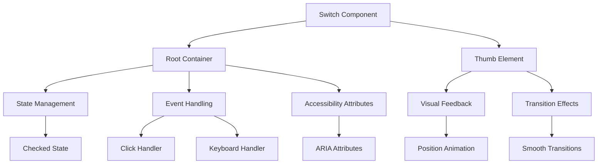
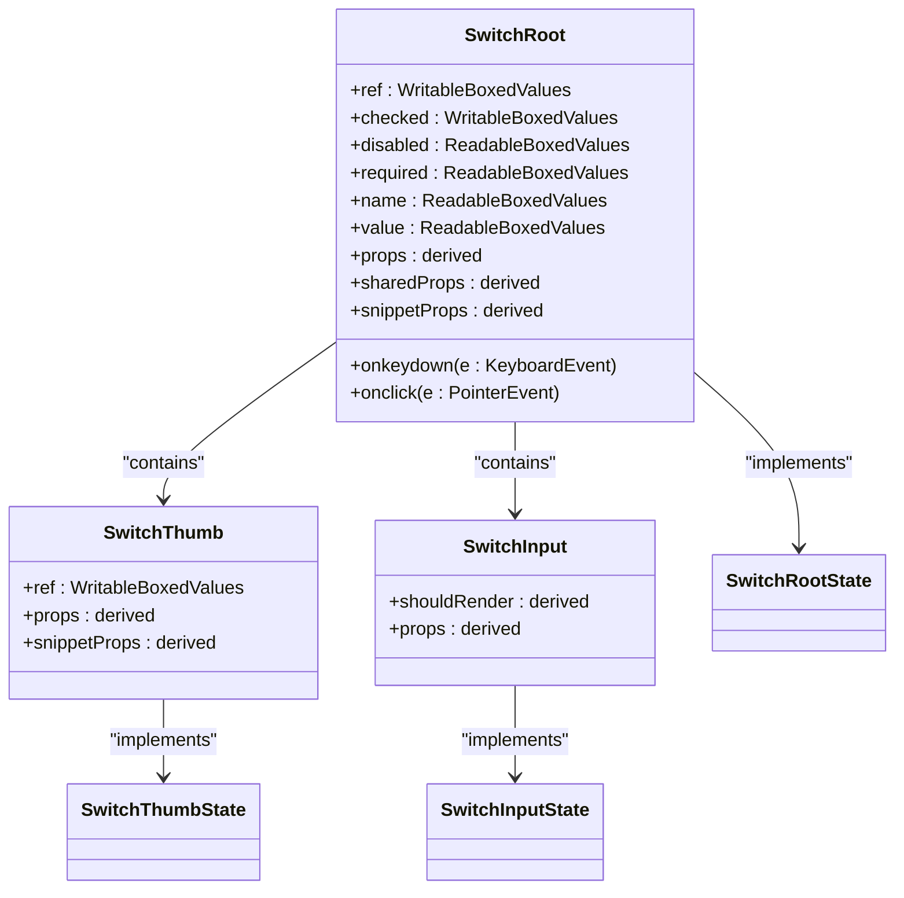
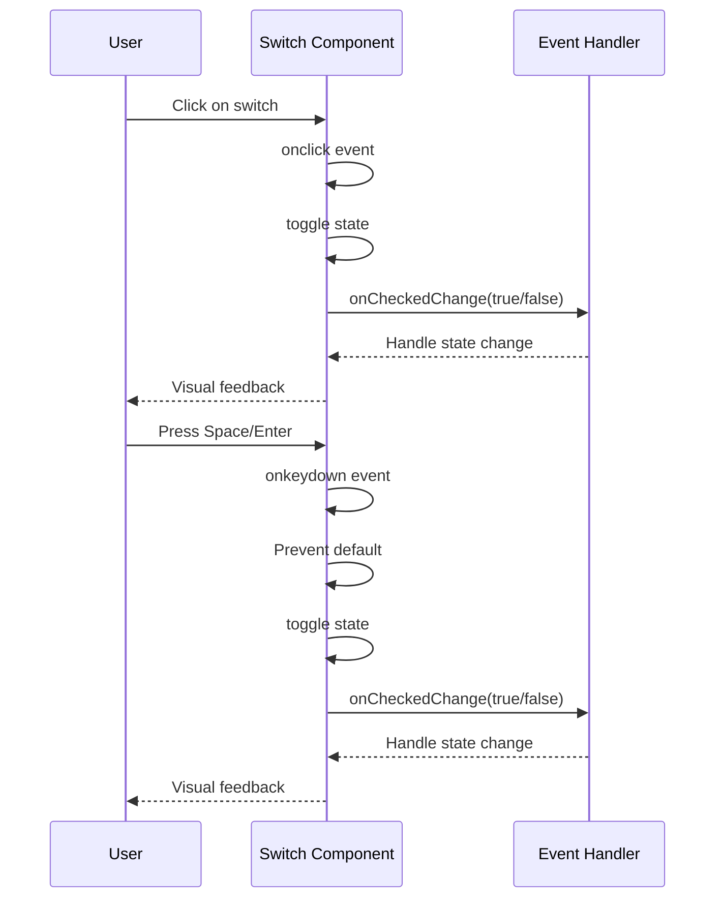
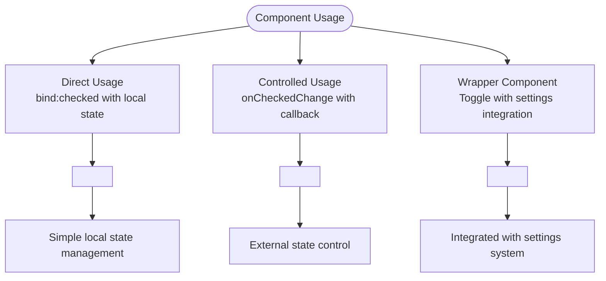

# Switch Component

<cite>
**Referenced Files in This Document**   
- [switch.svelte](file://src/lib/components/ui/switch/switch.svelte)
- [index.ts](file://src/lib/components/ui/switch/index.ts)
- [utils.ts](file://src/lib/utils.ts)
- [Toggle.svelte](file://src/lib/settings/controls/Toggle.svelte)
- [types.ts](file://src/lib/settings/types.ts)
- [AppearanceSettings.svelte](file://src/lib/settings/sections/AppearanceSettings.svelte)
- [switch.svelte.ts](file://tp/bits-ui/packages/bits-ui/src/lib/bits/switch/switch.svelte.ts)
- [types.ts](file://tp/bits-ui/packages/bits-ui/src/lib/bits/switch/types.ts)
</cite>

## Table of Contents
1. [Introduction](#introduction)
2. [Architecture Overview](#architecture-overview)
3. [Core Implementation](#core-implementation)
4. [Props and Configuration](#props-and-configuration)
5. [Event Handling](#event-handling)
6. [Styling and Visual Feedback](#styling-and-visual-feedback)
7. [Accessibility Features](#accessibility-features)
8. [Usage Patterns](#usage-patterns)
9. [Common Issues and Solutions](#common-issues-and-solutions)
10. [Integration Examples](#integration-examples)

## Introduction
The Switch component in the NC code editor provides a modern, accessible toggle control for switching between two states, typically "on" and "off". Built with Svelte and styled with Tailwind CSS utility classes, this component serves as a visual alternative to traditional checkboxes for binary choices. It's extensively used throughout the application for feature toggles, settings controls, and preference management. The component is designed with accessibility in mind, supporting keyboard navigation and screen reader compatibility while providing smooth visual feedback through CSS transitions.

## Architecture Overview
The Switch component follows a composite pattern, consisting of a root container and a thumb element that moves to indicate the current state. It leverages the bits-ui library as its foundation, extending its functionality with custom styling and integration points specific to the NC editor. The architecture separates concerns between state management, visual presentation, and user interaction, allowing for flexible usage patterns while maintaining consistent behavior across the application.

**Diagram sources**
- [switch.svelte](file://src/lib/components/ui/switch/switch.svelte#L1-L30)
- [switch.svelte.ts](file://tp/bits-ui/packages/bits-ui/src/lib/bits/switch/switch.svelte.ts#L1-L149)

**Section sources**
- [switch.svelte](file://src/lib/components/ui/switch/switch.svelte#L1-L30)
- [switch.svelte.ts](file://tp/bits-ui/packages/bits-ui/src/lib/bits/switch/switch.svelte.ts#L1-L149)

## Core Implementation
The Switch component is implemented as a Svelte component that wraps the bits-ui Switch primitive with custom styling and behavior. The implementation uses Svelte's reactive programming model to manage state and update the UI efficiently. The core functionality is provided by the bits-ui library, which handles the underlying state management, accessibility features, and event handling, while the NC-specific implementation focuses on visual styling and integration with the application's design system.

The component exposes a simple API through props and events, making it easy to use in various contexts. It supports both controlled and uncontrolled usage patterns, allowing developers to choose the approach that best fits their needs. The implementation uses Svelte's two-way binding syntax (`bind:checked`) to synchronize the component's state with external variables, providing a seamless integration experience.

**Diagram sources**
- [switch.svelte.ts](file://tp/bits-ui/packages/bits-ui/src/lib/bits/switch/switch.svelte.ts#L37-L149)
- [types.ts](file://tp/bits-ui/packages/bits-ui/src/lib/bits/switch/types.ts#L7-L66)

**Section sources**
- [switch.svelte](file://src/lib/components/ui/switch/switch.svelte#L1-L30)
- [switch.svelte.ts](file://tp/bits-ui/packages/bits-ui/src/lib/bits/switch/switch.svelte.ts#L1-L149)
- [types.ts](file://tp/bits-ui/packages/bits-ui/src/lib/bits/switch/types.ts#L1-L66)

## Props and Configuration
The Switch component accepts several props that control its behavior and appearance. The primary prop is `checked`, which determines the current state of the switch (on/off). This prop can be used with two-way binding to automatically synchronize the component's state with an external variable. The `disabled` prop prevents user interaction when set to true, visually graying out the component and preventing state changes.

Additional props include `class` for custom styling, `name` for form integration, and `value` for form submission. The component also supports all standard HTML attributes for the root element, allowing for further customization. When used within forms, the switch automatically renders a hidden input element with the specified name and value, ensuring proper form submission behavior.

**Section sources**
- [switch.svelte](file://src/lib/components/ui/switch/switch.svelte#L5-L10)
- [types.ts](file://tp/bits-ui/packages/bits-ui/src/lib/bits/switch/types.ts#L11-L59)

## Event Handling
The Switch component provides comprehensive event handling for user interactions. The primary event is `onCheckedChange`, which is called whenever the switch's state changes due to user interaction. This event handler receives the new checked state as a parameter, allowing developers to respond to state changes and update application logic accordingly.

The component handles both mouse and keyboard interactions. Click events on the root container toggle the switch state, while keyboard events (Space and Enter keys) provide accessibility support for keyboard navigation. The event handling is implemented in the underlying bits-ui library, ensuring consistent behavior across different usage contexts. The component prevents default behavior for keyboard events to avoid unintended page scrolling or form submission.

**Diagram sources**
- [switch.svelte.ts](file://tp/bits-ui/packages/bits-ui/src/lib/bits/switch/switch.svelte.ts#L56-L65)
- [switch.svelte](file://src/lib/components/ui/switch/switch.svelte#L13-L29)

**Section sources**
- [switch.svelte.ts](file://tp/bits-ui/packages/bits-ui/src/lib/bits/switch/switch.svelte.ts#L56-L65)
- [switch.svelte](file://src/lib/components/ui/switch/switch.svelte#L13-L29)

## Styling and Visual Feedback
The Switch component uses Tailwind CSS utility classes for styling, providing a clean, modern appearance that integrates with the NC editor's design system. The visual feedback is implemented through CSS transitions that animate the thumb movement and background color changes when the state changes. The component's appearance is defined by a combination of fixed classes and dynamic classes that respond to the current state.

The root container has a fixed size (24px height, 44px width) with rounded corners and a border. The background color changes based on the state, using `data-[state=checked]` and `data-[state=unchecked]` attributes to apply different colors. The thumb element is a smaller circle (20px diameter) that moves horizontally within the container, with a smooth transition effect when changing position. The component also includes focus styles for keyboard navigation, with a visible ring around the component when focused.

**Section sources**
- [switch.svelte](file://src/lib/components/ui/switch/switch.svelte#L17-L27)
- [utils.ts](file://src/lib/utils.ts#L4-L6)

## Accessibility Features
The Switch component is designed with accessibility in mind, following WAI-ARIA guidelines to ensure compatibility with screen readers and keyboard navigation. It implements the `role="switch"` attribute to identify the component as a toggle control, with `aria-checked` reflecting the current state (true for checked, false for unchecked). The component also supports `aria-required` and `aria-disabled` attributes based on the corresponding props.

Keyboard navigation is fully supported, with both Space and Enter keys toggling the switch state. The component includes a focus ring that becomes visible when the switch receives keyboard focus, providing clear visual feedback for keyboard users. The component's structure includes proper labeling mechanisms, allowing it to be paired with descriptive text for screen reader users. The underlying implementation in bits-ui ensures that all accessibility features are consistently applied across different usage contexts.

**Section sources**
- [switch.svelte.ts](file://tp/bits-ui/packages/bits-ui/src/lib/bits/switch/switch.svelte.ts#L82-L85)
- [switch.svelte](file://src/lib/components/ui/switch/switch.svelte#L16-L18)

## Usage Patterns
The Switch component is used throughout the NC editor in various contexts, primarily for settings toggles and feature enablement. A common pattern is to wrap the Switch component in a higher-level control, such as the Toggle component used in the settings interface. This wrapper component provides additional functionality like label integration, icon support, and connection to the application's settings system.

In settings interfaces, the Switch component is typically paired with a descriptive label and optional help text. For certain settings like theme mode, additional visual indicators (sun and moon icons) are included to provide immediate visual feedback about the current state. The component supports both direct usage with two-way binding and controlled usage through the `onCheckedChange` callback, allowing developers to choose the appropriate pattern based on their state management approach.

**Diagram sources**
- [Toggle.svelte](file://src/lib/settings/controls/Toggle.svelte#L7-L115)
- [switch.svelte](file://src/lib/components/ui/switch/switch.svelte#L13-L29)

**Section sources**
- [Toggle.svelte](file://src/lib/settings/controls/Toggle.svelte#L7-L155)
- [AppearanceSettings.svelte](file://src/lib/settings/sections/AppearanceSettings.svelte#L190-L197)

## Common Issues and Solutions
When implementing the Switch component, developers may encounter several common issues. One frequent challenge is state synchronization, particularly when using the component in controlled mode. The solution is to ensure that the `checked` prop and `onCheckedChange` callback are used together consistently, with the callback updating the external state that drives the `checked` prop.

Another common issue is keyboard navigation within complex forms or dialogs. The component's default behavior of preventing default keyboard events can sometimes interfere with form submission or dialog navigation. This can be addressed by carefully managing focus and ensuring that the switch is properly integrated into the tab order. For screen reader compatibility, it's important to provide descriptive labels either through `aria-label` or by associating the switch with a visible label element.

Accessibility testing should include verification of all interaction methods (mouse, touch, keyboard) and screen reader announcements. Developers should test that the component's state is properly announced and that all functionality is available through keyboard navigation. When integrating with form systems, ensure that the hidden input element is properly configured with the correct name and value attributes for form submission.

**Section sources**
- [Toggle.svelte](file://src/lib/settings/controls/Toggle.svelte#L82-L98)
- [switch.svelte.ts](file://tp/bits-ui/packages/bits-ui/src/lib/bits/switch/switch.svelte.ts#L56-L65)

## Integration Examples
The Switch component is extensively used in the NC editor's settings interface, where it provides a consistent and intuitive way to toggle features on and off. In the Appearance settings section, it's used to control features like blur effects, with a clean layout that pairs the switch with descriptive text. The component is also used in editor settings for options like auto-save, minimap, line numbers, and bracket matching.

A notable integration pattern is the Toggle component, which wraps the Switch with additional functionality for the settings system. This wrapper handles connection to the settings store, value normalization, and change event dispatching. For theme mode switching, the Toggle component includes sun and moon icons that provide immediate visual feedback about the current state, enhancing the user experience.

The component's flexibility allows it to be used in various contexts, from compact inline toggles to larger standalone controls. Its integration with the application's design system ensures consistent appearance and behavior across different usage scenarios, while its accessibility features make it usable for all users regardless of their interaction preferences.

**Section sources**
- [Toggle.svelte](file://src/lib/settings/controls/Toggle.svelte#L115-L121)
- [AppearanceSettings.svelte](file://src/lib/settings/sections/AppearanceSettings.svelte#L196-L197)
- [EditorSettings.svelte](file://src/lib/settings/sections/EditorSettings.svelte#L123-L185)