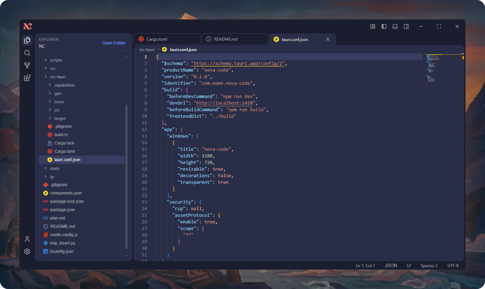

# Nova Code

[](README.md) [](README.ru.md) [-lightgrey.svg)](README.pt-br.md)

Nova Code is a modern, lightweight, and high-performance code editor built using cutting-edge web technologies and the powerful Rust ecosystem.

## About

The project combines the flexibility of web interfaces with the performance of native applications. We use **Tauri v2** to create a cross-platform desktop application with minimal resource consumption, **Svelte 5** for a reactive and fast interface, and **Tailwind CSS v4** for styling. **Monaco Editor** is used as the editor core — the same engine as in VS Code.



## Tech Stack

*   **[Tauri v2](https://v2.tauri.app/)**: Framework for building cross-platform applications using web technologies and Rust.
*   **[Svelte 5](https://svelte.dev/)**: Compiler and framework for building user interfaces.
*   **[Tailwind CSS v4](https://tailwindcss.com/)**: Utility-first CSS framework for rapid styling.
*   **[Monaco Editor](https://microsoft.github.io/monaco-editor/)**: Powerful code editor supporting syntax highlighting, autocomplete, and more.
*   **[Vite](https://vitejs.dev/)**: Next-generation frontend tooling.
*   **TypeScript**: Typed JavaScript for robust development.

## Requirements

To work with the project, you will need:

*   [Node.js](https://nodejs.org/) (LTS version recommended)
*   [Rust](https://www.rust-lang.org/tools/install) (including `cargo`, required for Tauri build)
*   Build tools for your OS (see [Tauri documentation](https://v2.tauri.app/start/prerequisites/))

## Installation

1.  Clone the repository:
    ```bash
    git clone https://github.com/FerrisMind/Nova-Code.git
    cd nova-code
    ```

2.  Install dependencies:
    ```bash
    npm install
    ```

## Development

To run the application in development mode (with hot reload):

```bash
npm run tauri dev
```

This command will start the Vite frontend server and open the Tauri application window.

## Build

To create an optimized executable for your operating system:

```bash
npm run tauri build
```

The built file will be located in the `src-tauri/target/release/bundle` directory.

## License

This project is licensed under the Apache License 2.0. See the [LICENSE](LICENSE) file for details.
