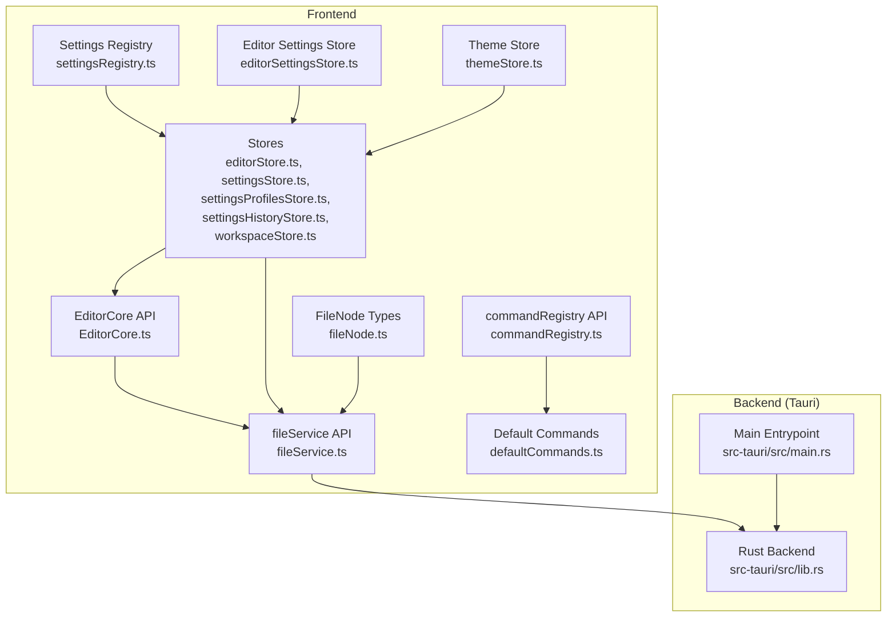
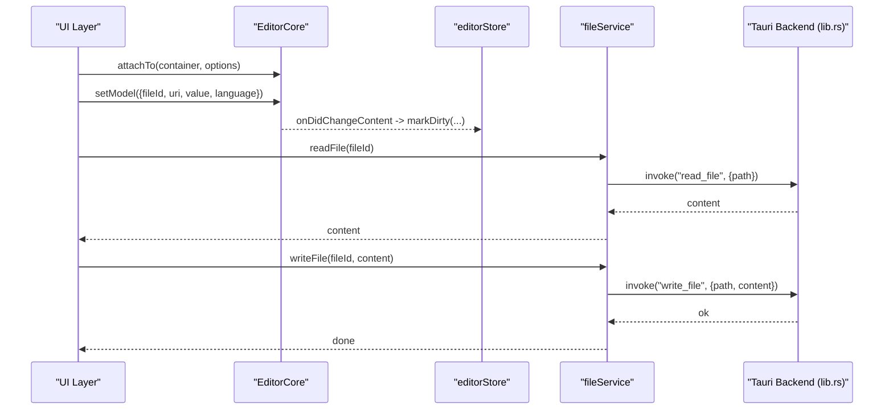
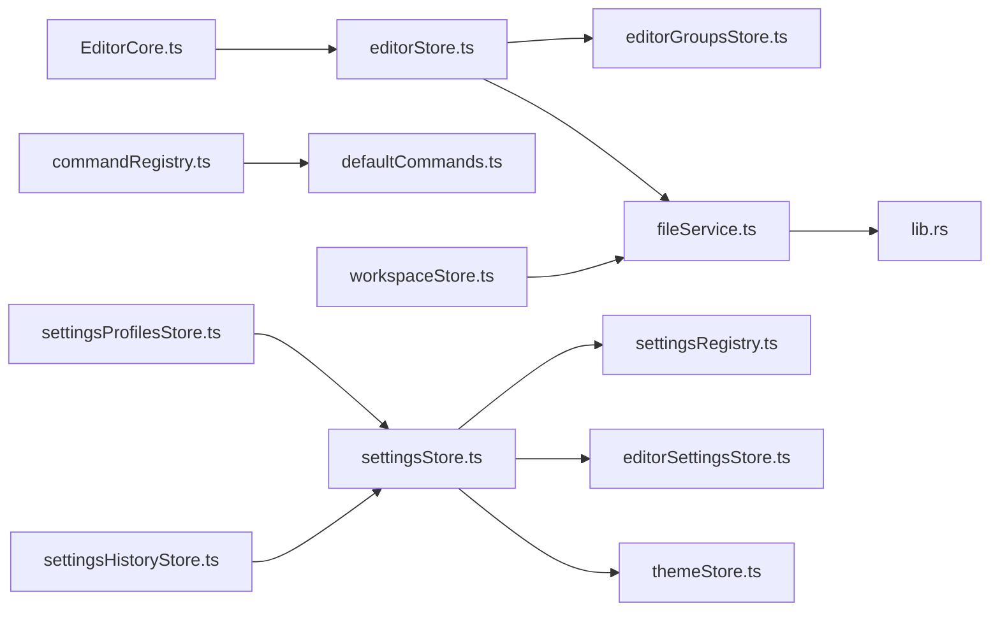

# API Reference

<cite>
**Referenced Files in This Document**
- [EditorCore.ts](file://src/lib/editor/EditorCore.ts)
- [fileService.ts](file://src/lib/services/fileService.ts)
- [commandRegistry.ts](file://src/lib/commands/commandRegistry.ts)
- [defaultCommands.ts](file://src/lib/commands/defaultCommands.ts)
- [editorStore.ts](file://src/lib/stores/editorStore.ts)
- [settingsStore.ts](file://src/lib/stores/settingsStore.ts)
- [settingsProfilesStore.ts](file://src/lib/stores/settingsProfilesStore.ts)
- [settingsHistoryStore.ts](file://src/lib/stores/settingsHistoryStore.ts)
- [settingsRegistry.ts](file://src/lib/settings/registry.ts)
- [editorSettingsStore.ts](file://src/lib/stores/editorSettingsStore.ts)
- [themeStore.ts](file://src/lib/stores/themeStore.ts)
- [workspaceStore.ts](file://src/lib/stores/workspaceStore.ts)
- [fileNode.ts](file://src/lib/types/fileNode.ts)
- [lib.rs](file://src-tauri/src/lib.rs)
- [main.rs](file://src-tauri/src/main.rs)
</cite>

## Table of Contents

1. [Introduction](#introduction)
2. [Project Structure](#project-structure)
3. [Core Components](#core-components)
4. [Architecture Overview](#architecture-overview)
5. [Detailed Component Analysis](#detailed-component-analysis)
6. [Dependency Analysis](#dependency-analysis)
7. [Performance Considerations](#performance-considerations)
8. [Troubleshooting Guide](#troubleshooting-guide)
9. [Conclusion](#conclusion)
10. [Appendices](#appendices)

## Introduction

This document provides API documentation for the NC code editor’s public interfaces. It covers:

- EditorCore API for Monaco Editor integration
- fileService API for Tauri-backed file operations
- commandRegistry API for registering, discovering, and executing commands
- Store APIs for editor state, settings, profiles, history, and workspace
- Type definitions and usage patterns
- Versioning and backwards compatibility considerations
- Error handling and edge cases

## Project Structure

The editor is organized around a frontend (SvelteKit) and a native backend (Tauri v2). The frontend exposes typed APIs for editing, file operations, command execution, and state management. The backend implements Tauri commands for file system operations and settings persistence.

**Diagram sources**

- [EditorCore.ts](file://src/lib/editor/EditorCore.ts#L155-L314)
- [fileService.ts](file://src/lib/services/fileService.ts#L15-L85)
- [commandRegistry.ts](file://src/lib/commands/commandRegistry.ts#L18-L64)
- [defaultCommands.ts](file://src/lib/commands/defaultCommands.ts#L35-L268)
- [editorStore.ts](file://src/lib/stores/editorStore.ts#L28-L190)
- [settingsStore.ts](file://src/lib/stores/settingsStore.ts#L67-L110)
- [settingsProfilesStore.ts](file://src/lib/stores/settingsProfilesStore.ts#L49-L118)
- [settingsHistoryStore.ts](file://src/lib/stores/settingsHistoryStore.ts#L45-L110)
- [settingsRegistry.ts](file://src/lib/settings/registry.ts#L45-L116)
- [editorSettingsStore.ts](file://src/lib/stores/editorSettingsStore.ts#L1-L180)
- [themeStore.ts](file://src/lib/stores/themeStore.ts#L1-L120)
- [fileNode.ts](file://src/lib/types/fileNode.ts#L8-L19)
- [lib.rs](file://src-tauri/src/lib.rs#L248-L796)
- [main.rs](file://src-tauri/src/main.rs#L1-L7)

**Section sources**

- [EditorCore.ts](file://src/lib/editor/EditorCore.ts#L155-L314)
- [fileService.ts](file://src/lib/services/fileService.ts#L15-L85)
- [commandRegistry.ts](file://src/lib/commands/commandRegistry.ts#L18-L64)
- [defaultCommands.ts](file://src/lib/commands/defaultCommands.ts#L35-L268)
- [editorStore.ts](file://src/lib/stores/editorStore.ts#L28-L190)
- [settingsStore.ts](file://src/lib/stores/settingsStore.ts#L67-L110)
- [settingsProfilesStore.ts](file://src/lib/stores/settingsProfilesStore.ts#L49-L118)
- [settingsHistoryStore.ts](file://src/lib/stores/settingsHistoryStore.ts#L45-L110)
- [settingsRegistry.ts](file://src/lib/settings/registry.ts#L45-L116)
- [editorSettingsStore.ts](file://src/lib/stores/editorSettingsStore.ts#L1-L180)
- [themeStore.ts](file://src/lib/stores/themeStore.ts#L1-L120)
- [fileNode.ts](file://src/lib/types/fileNode.ts#L8-L19)
- [lib.rs](file://src-tauri/src/lib.rs#L248-L796)
- [main.rs](file://src-tauri/src/main.rs#L1-L7)

## Core Components

- EditorCore API: Provides a typed interface to Monaco Editor, including model management, configuration, diagnostics, diff sessions, and event subscriptions.
- fileService API: Frontend wrapper around Tauri commands for file operations and workspace tree listing.
- commandRegistry API: Centralized command registration and execution with discovery and keybinding metadata.
- Store APIs: Reactive stores for editor tabs, settings, profiles, history, and workspace, plus settings registry and domain stores.

**Section sources**

- [EditorCore.ts](file://src/lib/editor/EditorCore.ts#L155-L314)
- [fileService.ts](file://src/lib/services/fileService.ts#L15-L85)
- [commandRegistry.ts](file://src/lib/commands/commandRegistry.ts#L18-L64)
- [settingsStore.ts](file://src/lib/stores/settingsStore.ts#L67-L110)

## Architecture Overview

The frontend integrates Monaco Editor via EditorCore, manages editor state via editorStore, and persists settings via settingsStore backed by Tauri commands. fileService bridges frontend calls to backend commands. Default commands are registered centrally and executed by commandRegistry.

**Diagram sources**

- [EditorCore.ts](file://src/lib/editor/EditorCore.ts#L407-L601)
- [editorStore.ts](file://src/lib/stores/editorStore.ts#L284-L307)
- [fileService.ts](file://src/lib/services/fileService.ts#L30-L85)
- [lib.rs](file://src-tauri/src/lib.rs#L266-L388)

## Detailed Component Analysis

### EditorCore API

Public interface and capabilities:

- Capabilities: multi-model support, preserved undo stack on switch, prepared for diff, extensible languages
- Methods:
  - attachTo(container, options?): Initialize editor with optional options
  - dispose(): Dispose editor and models
  - setModel(descriptor): Create or switch active model by fileId
  - updateContent(fileId, newContent): Update model content without switching
  - getModelValue(fileId): Get model value or null
  - getActiveModelValue(): Get active model value or null
  - configure(options): Update editor options and theme
  - registerLanguageSupport(config): Register Monaco language support
  - registerCompletionProvider(languageId, provider): Register completion provider
  - registerHoverProvider(languageId, provider): Register hover provider
  - setDiagnostics(fileId, diagnostics): Set markers for a model
  - createDiffSession(params): Create diff editor session
  - triggerCommand(source, commandId, payload?): Trigger Monaco command
  - onDidChangeContent(listener): Subscribe to active model content changes
  - onDidChangeCursorPosition(listener): Subscribe to cursor position changes
  - getModelMetadata(fileId): Get model metadata (languageId, eol, tabSize, insertSpaces)
  - getFileIdByUri(uri): Resolve fileId by URI
- Events:
  - onDidChangeContent(fileId, value)
  - onDidChangeCursorPosition({fileId, lineNumber, column})

Key types:

- EditorCapabilities, EditorCoreOptions, EditorModelDescriptor, EditorDiagnostic, LanguageSupportConfig, CompletionProviderConfig, HoverProviderConfig

Usage examples:

- Initialize editor and set model: [EditorCore.ts](file://src/lib/editor/EditorCore.ts#L407-L601)
- Configure editor options: [EditorCore.ts](file://src/lib/editor/EditorCore.ts#L619-L650)
- Register language and providers: [EditorCore.ts](file://src/lib/editor/EditorCore.ts#L652-L691)
- Create diff session: [EditorCore.ts](file://src/lib/editor/EditorCore.ts#L727-L800)
- Subscribe to content/cursor changes: [EditorCore.ts](file://src/lib/editor/EditorCore.ts#L574-L601)

Versioning and compatibility:

- EditorCoreOptions align with Monaco’s IStandaloneEditorConstructionOptions and IEditorOptions. Backwards compatibility is ensured by merging defaults and optional fields.

Error handling:

- Throws when attempting to create diff without initialization
- No-op on missing models for update/get operations

**Section sources**

- [EditorCore.ts](file://src/lib/editor/EditorCore.ts#L39-L154)
- [EditorCore.ts](file://src/lib/editor/EditorCore.ts#L155-L314)
- [EditorCore.ts](file://src/lib/editor/EditorCore.ts#L407-L800)

### fileService API (Tauri Commands)

Frontend service exposing asynchronous file operations and workspace listing. Invocations map to backend commands.

Available methods:

- readFile(fileId): Promise<string>
- writeFile(fileId, content): Promise<void>
- listWorkspaceFiles(rootOverride?): Promise<FileNode[]>
- onFileChange(cb): Promise<() => void>
- createFile(path): Promise<void>
- createDirectory(path): Promise<void>
- renameFile(oldPath, newPath): Promise<void>
- deleteFile(path, useTrash): Promise<void>
- revealInExplorer(path): Promise<void>
- startFileWatcher(): Promise<void>
- setWorkspaceRoot(root: string): void
- getWorkspaceRoot(): string

Request/response schemas:

- read_file: request { path: string }, response string
- write_file: request { path: string, content: string }, response void
- read_workspace: request { root: string }, response FileNode[]
- create_file: request { path: string }, response void
- create_directory: request { path: string }, response void
- rename_file: request { oldPath: string, newPath: string }, response void
- delete_file: request { path: string, useTrash: boolean }, response void
- reveal_in_explorer: request { path: string }, response void
- start_file_watcher: request void, response void

Events:

- file-changed: emitted by backend on write_file; frontend listens and refreshes workspace

Error conditions:

- read_file: returns error if path not found or not a file
- read_workspace: returns error if root does not exist or is not a directory
- write_file: emits file-changed event on success; errors propagate to caller
- delete_file: uses trash if useTrash is true; otherwise deletes file or directory

Integration examples:

- Read file content: [fileService.ts](file://src/lib/services/fileService.ts#L30-L37)
- List workspace files: [fileService.ts](file://src/lib/services/fileService.ts#L39-L41)
- Listen to file changes: [fileService.ts](file://src/lib/services/fileService.ts#L44-L51)
- Start file watcher: [fileService.ts](file://src/lib/services/fileService.ts#L73-L75)

**Section sources**

- [fileService.ts](file://src/lib/services/fileService.ts#L15-L85)
- [lib.rs](file://src-tauri/src/lib.rs#L248-L388)

### commandRegistry API

Centralized command registry with discovery and execution.

Public API:

- registerCommand(cmd: CommandDefinition): void
- getAllCommands(): CommandDefinition[]
- executeCommand(id: CommandId): Promise<void>

CommandDefinition:

- id: string
- label: string
- run: () => void | Promise<void>
- category?: string
- keybinding?: string

Usage examples:

- Register default commands: [defaultCommands.ts](file://src/lib/commands/defaultCommands.ts#L237-L268)
- Execute a command: [commandRegistry.ts](file://src/lib/commands/commandRegistry.ts#L60-L64)

Backwards compatibility:

- Last-write-wins semantics for duplicate ids; safe to call multiple times.

**Section sources**

- [commandRegistry.ts](file://src/lib/commands/commandRegistry.ts#L18-L64)
- [defaultCommands.ts](file://src/lib/commands/defaultCommands.ts#L35-L268)

### Store APIs

#### editorStore

Manages editor tabs and active editor state, integrates with layout groups.

Key methods:

- openFile(fileId)
- openSettings()
- setActiveEditor(fileId)
- closeEditor(fileId)
- markDirty(id, isDirty)
- updateContent(id, value)
- ensureTabForFile(pathOrId, opts?)

Types:

- EditorTab, LanguageId, EditorState

Usage examples:

- Open file and activate tab: [editorStore.ts](file://src/lib/stores/editorStore.ts#L197-L235)
- Close editor and remove from groups: [editorStore.ts](file://src/lib/stores/editorStore.ts#L254-L282)
- Mark dirty and persist content: [editorStore.ts](file://src/lib/stores/editorStore.ts#L284-L307)

**Section sources**

- [editorStore.ts](file://src/lib/stores/editorStore.ts#L28-L190)
- [editorStore.ts](file://src/lib/stores/editorStore.ts#L192-L350)

#### settingsStore

Unified snapshot store over domain stores with applyChanges, resetAll, and dirty state computation.

Public API:

- subscribe(run): () => void
- getSnapshot(): SettingsSnapshot
- applyChanges(patch, meta?): AppliedChange[]
- resetAll(meta?): AppliedChange[]
- getDirtyState(): SettingsDirtyState
- setBaselineFromCurrent(): void

Integration:

- Reads from editorSettings and theme stores; writes via settingsRegistry definitions.

Usage examples:

- Apply changes and compute dirty state: [settingsStore.ts](file://src/lib/stores/settingsStore.ts#L239-L313)

**Section sources**

- [settingsStore.ts](file://src/lib/stores/settingsStore.ts#L67-L110)
- [settingsStore.ts](file://src/lib/stores/settingsStore.ts#L198-L313)

#### settingsProfilesStore

Manages settings profiles persisted via Tauri commands.

Public API:

- init(): Promise<void>
- createProfileFromCurrent(params): Promise<ResolvedSettingsProfile>
- applyProfile(id): Promise<void>
- deleteProfile(id): Promise<void>
- renameProfile(id, label): Promise<void>
- updateProfileIcon(id, icon): Promise<void>
- setDefaultProfile(id): Promise<void>
- resetToDefaultProfile(): Promise<void>
- getActiveProfile(): ResolvedSettingsProfile | null

Usage examples:

- Create default profile and apply: [settingsProfilesStore.ts](file://src/lib/stores/settingsProfilesStore.ts#L176-L230)
- Apply profile and persist: [settingsProfilesStore.ts](file://src/lib/stores/settingsProfilesStore.ts#L283-L304)

**Section sources**

- [settingsProfilesStore.ts](file://src/lib/stores/settingsProfilesStore.ts#L49-L118)
- [settingsProfilesStore.ts](file://src/lib/stores/settingsProfilesStore.ts#L173-L304)

#### settingsHistoryStore

Maintains history of settings changes with undo support and persistence.

Public API:

- init(): Promise<void>
- appendChanges(changes, meta): Promise<void>
- undoLast(): Promise<void>
- undoById(id): Promise<void>
- clearHistory(): Promise<void>
- setLimit(limit): void

Usage examples:

- Append changes and persist: [settingsHistoryStore.ts](file://src/lib/stores/settingsHistoryStore.ts#L144-L181)

**Section sources**

- [settingsHistoryStore.ts](file://src/lib/stores/settingsHistoryStore.ts#L45-L110)
- [settingsHistoryStore.ts](file://src/lib/stores/settingsHistoryStore.ts#L144-L230)

#### workspaceStore

Manages workspace tree, watching and refreshing on file changes.

Public API:

- subscribe(run)
- refresh(): Promise<void>
- openFolder(root: string)
- closeFolder(): void
- getWorkspaceRoot(): string | null
- resolvePath(relativePath: string): string | null

Usage examples:

- Load and watch workspace: [workspaceStore.ts](file://src/lib/stores/workspaceStore.ts#L37-L87)

**Section sources**

- [workspaceStore.ts](file://src/lib/stores/workspaceStore.ts#L1-L130)

#### Domain Stores

- editorSettings: Editor UI settings (theme, font, wrapping, minimap, etc.)
- theme: UI theme mode and palette selection

Usage examples:

- Update editor theme: [editorSettingsStore.ts](file://src/lib/stores/editorSettingsStore.ts#L56-L78)
- Toggle theme mode: [themeStore.ts](file://src/lib/stores/themeStore.ts#L69-L87)

**Section sources**

- [editorSettingsStore.ts](file://src/lib/stores/editorSettingsStore.ts#L1-L180)
- [themeStore.ts](file://src/lib/stores/themeStore.ts#L1-L120)

#### settingsRegistry

Static registry of settings sections and definitions with search and discovery.

Public API:

- getSections(), getSectionById(id)
- getSetting(id), getSettingsBySection(sectionId), listAllSettings()
- isKnownSetting(id)
- search(query, options?)

Usage examples:

- Retrieve editor settings: [settingsRegistry.ts](file://src/lib/settings/registry.ts#L461-L558)

**Section sources**

- [settingsRegistry.ts](file://src/lib/settings/registry.ts#L45-L116)
- [settingsRegistry.ts](file://src/lib/settings/registry.ts#L461-L558)

### Type Definitions

Commonly used types across APIs:

- FileNode: id, name, path, type, size?, modified?, children?
- EditorTab: id, title, path, language, isDirty
- SettingsSnapshot: editor, theme
- SettingPatch, AppliedChange, SettingsDirtyEntry, SettingsDirtyState
- SettingsProfile, ResolvedSettingsProfile
- SettingsHistoryEntry, ExtendedSettingsHistoryEntry

Usage references:

- FileNode: [fileNode.ts](file://src/lib/types/fileNode.ts#L8-L19)
- EditorTab: [editorStore.ts](file://src/lib/stores/editorStore.ts#L42-L49)
- SettingsSnapshot: [settingsStore.ts](file://src/lib/stores/settingsStore.ts#L95-L102)
- Settings\* types: [settingsStore.ts](file://src/lib/stores/settingsStore.ts#L36-L57), [settingsProfilesStore.ts](file://src/lib/stores/settingsProfilesStore.ts#L31-L48), [settingsHistoryStore.ts](file://src/lib/stores/settingsHistoryStore.ts#L31-L44)

**Section sources**

- [fileNode.ts](file://src/lib/types/fileNode.ts#L8-L19)
- [editorStore.ts](file://src/lib/stores/editorStore.ts#L42-L49)
- [settingsStore.ts](file://src/lib/stores/settingsStore.ts#L36-L57)
- [settingsProfilesStore.ts](file://src/lib/stores/settingsProfilesStore.ts#L31-L48)
- [settingsHistoryStore.ts](file://src/lib/stores/settingsHistoryStore.ts#L31-L44)

## Dependency Analysis

- EditorCore depends on Monaco Editor and exposes a thin API surface.
- editorStore depends on fileService and editorGroupsStore for tab lifecycle and layout synchronization.
- settingsStore depends on settingsRegistry and domain stores (editorSettings, theme).
- settingsProfilesStore and settingsHistoryStore depend on settingsStore and invoke Tauri commands.
- fileService depends on Tauri invoke and event listeners.
- defaultCommands registers commands that manipulate editorStore, layout stores, and activity.

**Diagram sources**

- [EditorCore.ts](file://src/lib/editor/EditorCore.ts#L407-L601)
- [editorStore.ts](file://src/lib/stores/editorStore.ts#L192-L350)
- [fileService.ts](file://src/lib/services/fileService.ts#L30-L85)
- [lib.rs](file://src-tauri/src/lib.rs#L248-L388)
- [commandRegistry.ts](file://src/lib/commands/commandRegistry.ts#L38-L64)
- [defaultCommands.ts](file://src/lib/commands/defaultCommands.ts#L35-L268)
- [settingsStore.ts](file://src/lib/stores/settingsStore.ts#L198-L313)
- [settingsRegistry.ts](file://src/lib/settings/registry.ts#L461-L558)
- [editorSettingsStore.ts](file://src/lib/stores/editorSettingsStore.ts#L1-L180)
- [themeStore.ts](file://src/lib/stores/themeStore.ts#L1-L120)
- [settingsProfilesStore.ts](file://src/lib/stores/settingsProfilesStore.ts#L173-L304)
- [settingsHistoryStore.ts](file://src/lib/stores/settingsHistoryStore.ts#L144-L230)
- [workspaceStore.ts](file://src/lib/stores/workspaceStore.ts#L37-L87)

**Section sources**

- [EditorCore.ts](file://src/lib/editor/EditorCore.ts#L407-L601)
- [editorStore.ts](file://src/lib/stores/editorStore.ts#L192-L350)
- [fileService.ts](file://src/lib/services/fileService.ts#L30-L85)
- [lib.rs](file://src-tauri/src/lib.rs#L248-L388)
- [commandRegistry.ts](file://src/lib/commands/commandRegistry.ts#L38-L64)
- [defaultCommands.ts](file://src/lib/commands/defaultCommands.ts#L35-L268)
- [settingsStore.ts](file://src/lib/stores/settingsStore.ts#L198-L313)
- [settingsRegistry.ts](file://src/lib/settings/registry.ts#L461-L558)
- [settingsProfilesStore.ts](file://src/lib/stores/settingsProfilesStore.ts#L173-L304)
- [settingsHistoryStore.ts](file://src/lib/stores/settingsHistoryStore.ts#L144-L230)
- [workspaceStore.ts](file://src/lib/stores/workspaceStore.ts#L37-L87)

## Performance Considerations

- EditorCore applies performance-oriented defaults (automaticLayout, disabled smooth scrolling, minimal decorations) and quick suggestions delay to reduce CPU/GPU load.
- Monaco minimap rendering is optimized by disabling character rendering and limiting width.
- Workspace listing uses a bounded depth and sorts directories before files for predictable traversal.
- File watcher uses a background thread and emits events to keep UI responsive.

[No sources needed since this section provides general guidance]

## Troubleshooting Guide

- EditorCore throws when creating diff without initialization; ensure attachTo and setModel were called.
- fileService.readFile/writeFile errors indicate invalid paths or permission issues; verify workspace root and file existence.
- settingsStore.applyChanges swallows exceptions internally; inspect returned applied changes and handle errors at the caller level.
- settingsProfilesStore/settingsHistoryStore persist operations may fail silently; check state.error and retry.

**Section sources**

- [EditorCore.ts](file://src/lib/editor/EditorCore.ts#L727-L730)
- [lib.rs](file://src-tauri/src/lib.rs#L266-L388)
- [settingsStore.ts](file://src/lib/stores/settingsStore.ts#L248-L285)
- [settingsProfilesStore.ts](file://src/lib/stores/settingsProfilesStore.ts#L150-L161)
- [settingsHistoryStore.ts](file://src/lib/stores/settingsHistoryStore.ts#L84-L91)

## Conclusion

The NC editor exposes a cohesive set of public APIs:

- EditorCore encapsulates Monaco Editor operations with a clean, typed interface
- fileService provides a unified frontend for Tauri-backed file operations
- commandRegistry centralizes command lifecycle
- Store APIs manage editor state, settings, profiles, history, and workspace
- Type definitions and registries ensure consistent contracts across modules
- Backend commands implement robust file operations and settings persistence

[No sources needed since this section summarizes without analyzing specific files]

## Appendices

### Tauri Command Reference

- read_file: reads a file by path
- write_file: writes content to a file and emits file-changed
- read_workspace: lists workspace files under a root
- create_file, create_directory, rename_file, delete_file
- reveal_in_explorer: opens file in OS explorer
- start_file_watcher: starts recursive file watching
- search_files, cancel_search: project-wide search with cancellation
- settings_profiles_load/save, settings_history_load/save/clear
- settings_export, settings_import

**Section sources**

- [lib.rs](file://src-tauri/src/lib.rs#L248-L796)
- [main.rs](file://src-tauri/src/main.rs#L1-L7)
