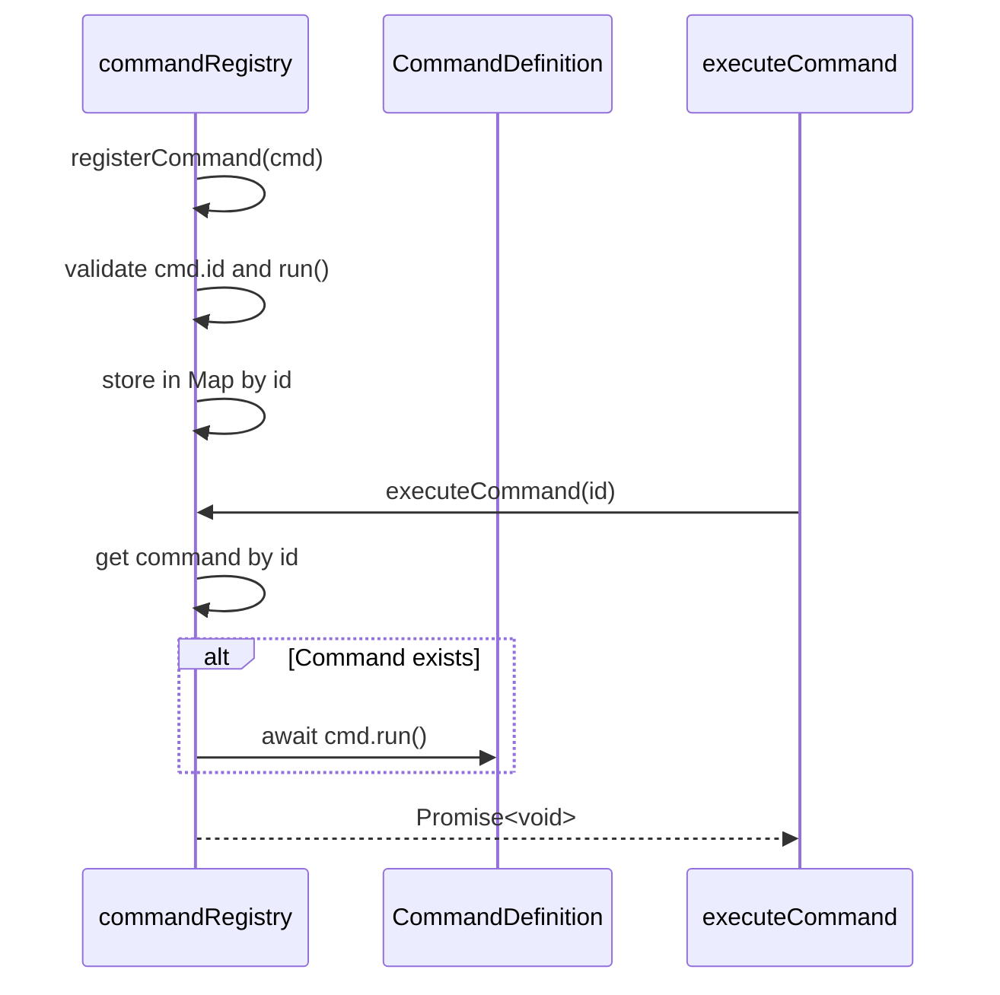
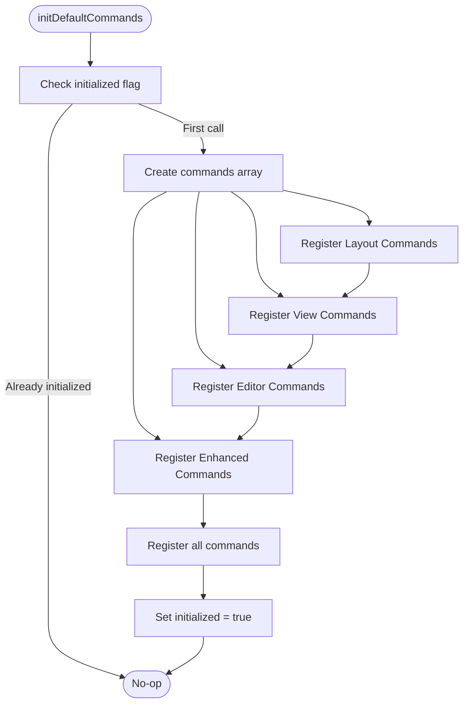
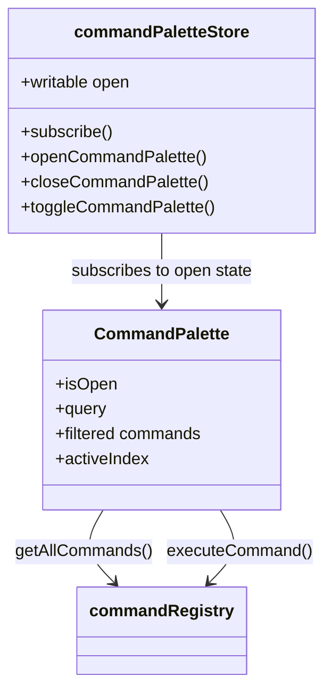
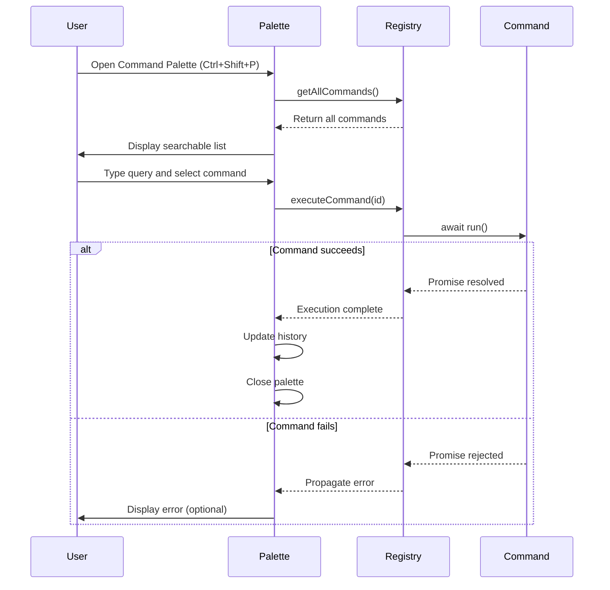

# Command Registry API

<cite>
**Referenced Files in This Document**   
- [commandRegistry.ts](file://src/lib/commands/commandRegistry.ts)
- [defaultCommands.ts](file://src/lib/commands/defaultCommands.ts)
- [CommandPalette.svelte](file://src/lib/commands/CommandPalette.svelte)
- [commandPaletteStore.ts](file://src/lib/stores/commandPaletteStore.ts)
- [settings.ts](file://src/lib/settings/commands.ts)
</cite>

## Table of Contents

1. [Introduction](#introduction)
2. [Command Interface Structure](#command-interface-structure)
3. [Core Registry Methods](#core-registry-methods)
4. [Default Commands Registration](#default-commands-registration)
5. [Command Palette Integration](#command-palette-integration)
6. [Command Lifecycle and Execution](#command-lifecycle-and-execution)
7. [Creating Custom Commands](#creating-custom-commands)
8. [Best Practices for Command Development](#best-practices-for-command-development)

## Introduction

The Command Registry system provides a centralized mechanism for managing extensible command execution throughout the Nova Code application. Inspired by VS Code's Command Palette architecture, this system serves as the single source of truth for command palette operations, global keyboard shortcuts, and internal command invocations. The registry enables dynamic command registration, discovery, and execution while maintaining loose coupling between UI components and underlying functionality. Commands can be registered with metadata such as labels, categories, and keyboard shortcuts, making them discoverable through the command palette interface. The system supports both synchronous and asynchronous command execution, allowing for flexible integration with various application services and editor operations.

## Command Interface Structure

The Command interface defines the contract for all executable commands within the system. Each command is identified by a unique ID and contains essential properties for execution and discovery.

```mermaid
classDiagram
class CommandDefinition {
+string id
+string label
+string category
+string keybinding
+Function run()
}
note right of CommandDefinition
Core command structure used throughout the registry
- id : Unique identifier (string) following VS Code style
- label : User-facing display name
- category : Organizational grouping for command palette
- keybinding : Optional keyboard shortcut (e.g., "Ctrl+B")
- run() : Execution function (sync or async)
end note
```

**Diagram sources**

- [commandRegistry.ts](file://src/lib/commands/commandRegistry.ts#L22-L28)

**Section sources**

- [commandRegistry.ts](file://src/lib/commands/commandRegistry.ts#L18-L28)

## Core Registry Methods

The command registry provides three primary methods for command management: registration, execution, and retrieval. These methods form the foundation of the extensible command system.

### registerCommand

Registers or overrides a command in the global registry. If a command with the same ID already exists, it is replaced (last-write-wins semantics).

**Parameters**

- `cmd`: CommandDefinition object containing id, label, run function, and optional metadata

**Return Type**

- `void`

**Validation**

- Validates that the command object, ID, and run function are present
- Returns silently if validation fails (no runtime exceptions)
- Uses Map data structure for O(1) lookup performance

### executeCommand

Executes a registered command by its ID. Provides safe execution with no-op behavior if the command does not exist.

**Parameters**

- `id`: CommandId (string) identifier of the command to execute

**Return Type**

- `Promise<void>` - Supports both synchronous and asynchronous command execution

**Execution Flow**

- Retrieves command from internal Map by ID
- Returns immediately if command not found
- Awaits the run() function execution

### getCommand / getAllCommands

Retrieves registered commands for discovery and display purposes.

**getAllCommands()**

- Returns array of all registered CommandDefinition objects
- Used by command palette for command discovery and filtering
- Converts internal Map values to array format



**Diagram sources**

- [commandRegistry.ts](file://src/lib/commands/commandRegistry.ts#L38-L64)

**Section sources**

- [commandRegistry.ts](file://src/lib/commands/commandRegistry.ts#L38-L64)

## Default Commands Registration

The system automatically registers a set of default commands during initialization through the `initDefaultCommands()` function. These commands provide essential editor functionality and follow VS Code-inspired naming conventions.

### Registration Process

- Idempotent design: can be safely called multiple times
- Uses a batch registration pattern for efficiency
- Organized by functional categories (View, File, Editor, etc.)

### Command Categories

- **View Commands**: Toggle sidebar/panel visibility
- **Navigation**: Focus editor groups, switch between views
- **Editor Operations**: Close active editor, manage tabs
- **Preferences**: Theme switching, settings access
- **Search**: Project-wide search functionality

### Keyboard Shortcuts

Default commands include predefined keyboard shortcuts that follow common IDE conventions:

| Command ID                               | Label                             | Keybinding   |
| ---------------------------------------- | --------------------------------- | ------------ |
| workbench.action.toggleSidebarVisibility | Toggle Primary Sidebar Visibility | Ctrl+B       |
| workbench.action.terminal.toggleTerminal | Toggle Terminal                   | Ctrl+`       |
| workbench.action.findInFiles             | Find in Files                     | Ctrl+Shift+F |
| editor.action.gotoLine                   | Go to Line...                     | Ctrl+G       |



**Diagram sources**

- [defaultCommands.ts](file://src/lib/commands/defaultCommands.ts#L35-L268)

**Section sources**

- [defaultCommands.ts](file://src/lib/commands/defaultCommands.ts#L35-L268)

## Command Palette Integration

The command palette provides a user interface for discovering and executing registered commands. It integrates with the command registry and maintains its own visibility state through a dedicated store.

### Architecture Components

- **CommandPalette.svelte**: UI component for command discovery
- **commandPaletteStore.ts**: Manages visibility state (open/closed)
- **Fuzzy Search**: Client-side filtering and scoring algorithm
- **Command History**: LRU cache of recently executed commands

### State Management

The command palette uses a Svelte store to manage its visibility state independently from the command registry:



**Diagram sources**

- [commandPaletteStore.ts](file://src/lib/stores/commandPaletteStore.ts#L1-L29)
- [CommandPalette.svelte](file://src/lib/commands/CommandPalette.svelte#L1-L441)

**Section sources**

- [commandPaletteStore.ts](file://src/lib/stores/commandPaletteStore.ts#L1-L29)
- [CommandPalette.svelte](file://src/lib/commands/CommandPalette.svelte#L1-L441)

### Search and Filtering

The command palette implements a client-side fuzzy search algorithm with the following characteristics:

- Case-insensitive matching on label and ID
- Scoring prioritizes matches at the beginning of labels
- Shorter labels receive higher scores
- Empty query shows history followed by all commands
- Real-time filtering as user types

## Command Lifecycle and Execution

The command lifecycle spans from registration through execution and includes error handling and state management considerations.

### Lifecycle Stages

1. **Registration**: Command is added to the registry with metadata
2. **Discovery**: Command appears in command palette with filtering
3. **Selection**: User selects command via keyboard or mouse
4. **Execution**: run() function is invoked asynchronously
5. **History Update**: Successfully executed commands update LRU history
6. **Cleanup**: UI state is reset after execution

### Error Handling

The system follows a graceful failure approach:

- Invalid commands are silently rejected during registration
- Non-existent commands result in no-op execution (no exceptions)
- Runtime errors in command execution propagate normally
- Async errors should be handled within the command's run() function

### Undo/Redo Considerations

While the core registry doesn't manage undo/redo functionality, commands that modify editor state should integrate with existing undo systems:

- Editor commands should leverage Monaco editor's built-in undo stack
- State modifications should be wrapped in appropriate transaction patterns
- Commands that trigger significant state changes should announce them via events



**Diagram sources**

- [commandRegistry.ts](file://src/lib/commands/commandRegistry.ts#L60-L64)
- [CommandPalette.svelte](file://src/lib/commands/CommandPalette.svelte#L217-L222)

**Section sources**

- [commandRegistry.ts](file://src/lib/commands/commandRegistry.ts#L60-L64)
- [CommandPalette.svelte](file://src/lib/commands/CommandPalette.svelte#L217-L222)

## Creating Custom Commands

Developers can extend the application by registering custom commands that integrate with various services and editor functionality.

### Basic Command Registration

```typescript
import { registerCommand } from './commandRegistry';

registerCommand({
  id: 'myExtension.formatDocument',
  label: 'Format Document with My Tool',
  category: 'My Extension',
  keybinding: 'Ctrl+Alt+F',
  run: async () => {
    // Command implementation
  },
});
```

### Context-Aware Commands

Commands can be made context-sensitive by checking application state before execution:

```typescript
registerCommand({
  id: 'editor.action.customRefactor',
  label: 'Custom Refactor',
  run: () => {
    const activeEditor = editorStore.getActiveEditor();
    if (!activeEditor) return;

    // Only available for JavaScript files
    if (!activeEditor.path.endsWith('.js')) {
      return;
    }

    // Execute refactor logic
  },
});
```

### Commands with Keyboard Shortcuts

Keyboard shortcuts are defined in the command definition and automatically displayed in the palette:

```typescript
registerCommand({
  id: 'myExtension.toggleFeature',
  label: 'Toggle My Feature',
  keybinding: 'Ctrl+Shift+M', // Standard format: Ctrl/Shift/Alt + key
  run: () => {
    // Toggle feature implementation
  },
});
```

### Commands Modifying Editor State

Commands that interact with the editor should follow these patterns:

- Use existing editor services and stores
- Handle asynchronous operations properly
- Provide user feedback when appropriate
- Integrate with undo/redo systems

```typescript
registerCommand({
  id: 'editor.action.insertTimestamp',
  label: 'Insert Timestamp',
  run: async () => {
    const editor = editorStore.getActiveEditor();
    if (!editor) return;

    const timestamp = new Date().toISOString();
    editor.insertText(timestamp);

    // The editor's built-in undo stack automatically handles this
  },
});
```

**Section sources**

- [commandRegistry.ts](file://src/lib/commands/commandRegistry.ts#L38-L45)
- [defaultCommands.ts](file://src/lib/commands/defaultCommands.ts#L45-L268)

## Best Practices for Command Development

### Command Design Guidelines

- Use clear, descriptive labels that users will understand
- Follow consistent naming conventions (verb-noun pattern)
- Organize commands into logical categories
- Provide meaningful keyboard shortcuts when appropriate
- Keep command IDs stable across versions

### Performance Considerations

- Avoid long-running synchronous operations in run() functions
- Use async/await for operations that may take time
- Debounce commands that trigger frequent updates
- Clean up event listeners and subscriptions in async commands

### Integration with Services

Commands should integrate with existing application services rather than duplicating functionality:

- Use editorStore for editor operations
- Leverage layoutStore for UI state changes
- Access settings through settingsStore
- Utilize fileService for file operations

### Testing Commands

Since commands are pure functions with dependencies, they can be tested effectively:

- Mock dependencies when testing command logic
- Verify that commands properly interact with stores
- Test both success and error scenarios
- Ensure keyboard shortcuts don't conflict with existing ones

**Section sources**

- [commandRegistry.ts](file://src/lib/commands/commandRegistry.ts)
- [defaultCommands.ts](file://src/lib/commands/defaultCommands.ts)
- [CommandPalette.svelte](file://src/lib/commands/CommandPalette.svelte)
