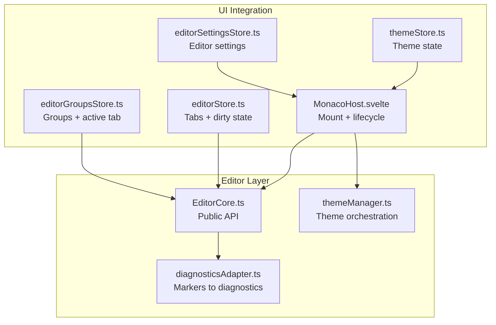
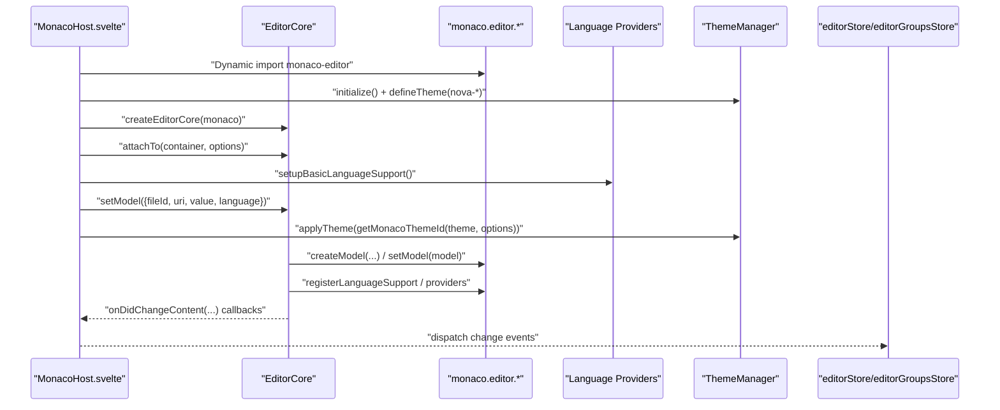
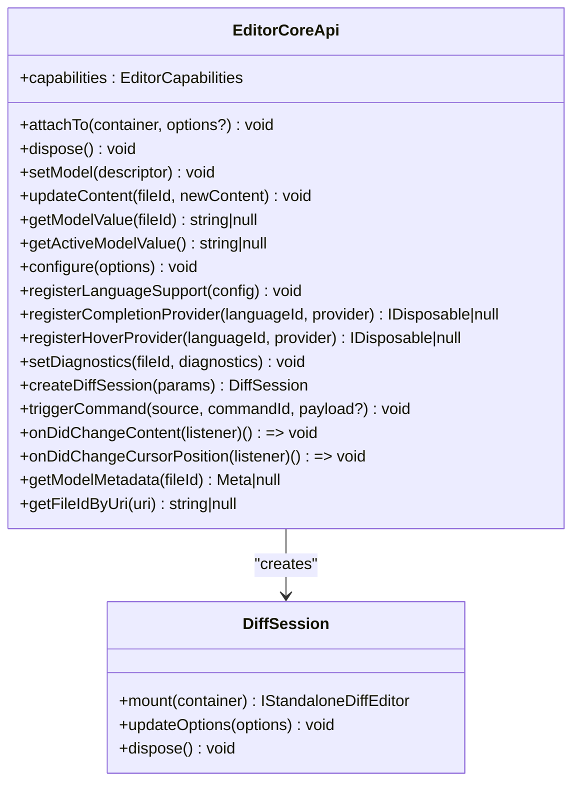
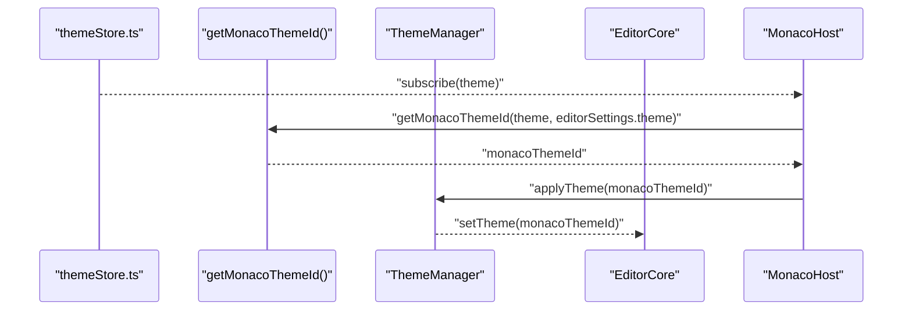
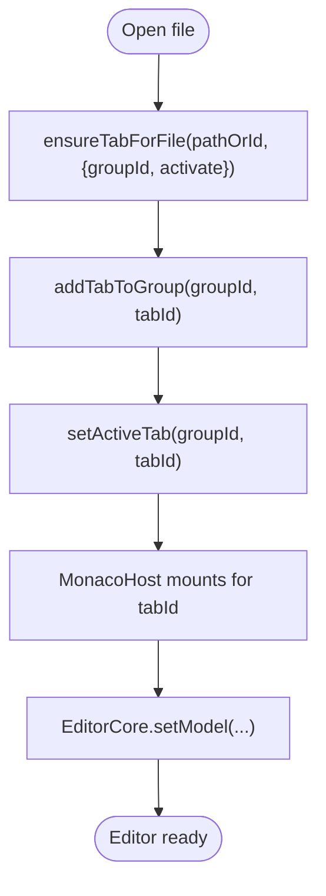
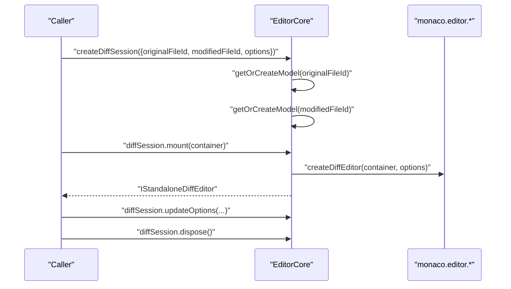
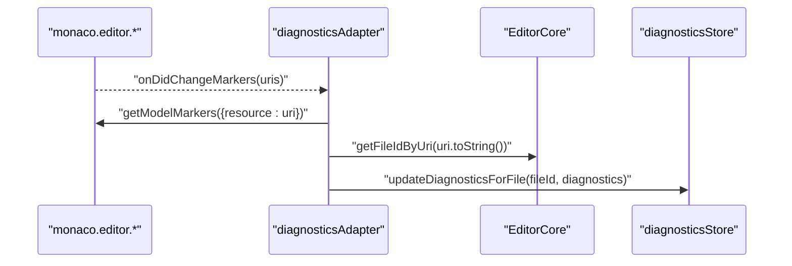
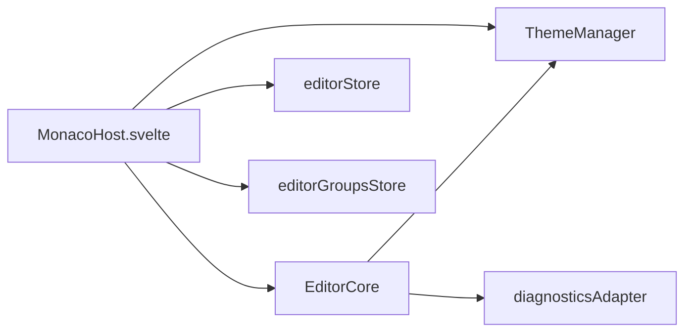

# EditorCore API

<cite>
**Referenced Files in This Document**
- [EditorCore.ts](file://src/lib/editor/EditorCore.ts)
- [themeManager.ts](file://src/lib/editor/themeManager.ts)
- [MonacoHost.svelte](file://src/lib/editor/MonacoHost.svelte)
- [editorStore.ts](file://src/lib/stores/editorStore.ts)
- [editorGroupsStore.ts](file://src/lib/stores/layout/editorGroupsStore.ts)
- [diagnosticsAdapter.ts](file://src/lib/editor/diagnosticsAdapter.ts)
- [themeStore.ts](file://src/lib/stores/themeStore.ts)
- [editorSettingsStore.ts](file://src/lib/stores/editorSettingsStore.ts)
</cite>

## Table of Contents

1. [Introduction](#introduction)
2. [Project Structure](#project-structure)
3. [Core Components](#core-components)
4. [Architecture Overview](#architecture-overview)
5. [Detailed Component Analysis](#detailed-component-analysis)
6. [Dependency Analysis](#dependency-analysis)
7. [Performance Considerations](#performance-considerations)
8. [Troubleshooting Guide](#troubleshooting-guide)
9. [Conclusion](#conclusion)

## Introduction

This document provides comprehensive API documentation for the EditorCore class, the central interface to the Monaco Editor within the NC code editor. It covers public methods, event subscriptions, configuration translation, theme synchronization, multi-editor layouts, diff editor usage, and error handling. The goal is to help developers integrate EditorCore effectively while understanding how it bridges UI state, Monaco’s native API, and editor groups.

## Project Structure

EditorCore lives under the editor subsystem and integrates with Svelte stores for tabs, groups, theme, and diagnostics. The MonacoHost component orchestrates initialization, theme application, and event propagation.

**Diagram sources**

- [EditorCore.ts](file://src/lib/editor/EditorCore.ts#L163-L891)
- [themeManager.ts](file://src/lib/editor/themeManager.ts#L1-L274)
- [MonacoHost.svelte](file://src/lib/editor/MonacoHost.svelte#L1-L260)
- [editorStore.ts](file://src/lib/stores/editorStore.ts#L1-L381)
- [editorGroupsStore.ts](file://src/lib/stores/layout/editorGroupsStore.ts#L1-L413)
- [diagnosticsAdapter.ts](file://src/lib/editor/diagnosticsAdapter.ts#L1-L61)
- [themeStore.ts](file://src/lib/stores/themeStore.ts#L1-L120)
- [editorSettingsStore.ts](file://src/lib/stores/editorSettingsStore.ts#L1-L49)

**Section sources**

- [EditorCore.ts](file://src/lib/editor/EditorCore.ts#L1-L120)
- [MonacoHost.svelte](file://src/lib/editor/MonacoHost.svelte#L1-L120)

## Core Components

- EditorCore: Lightweight wrapper around Monaco’s standalone editor APIs. Exposes a minimal, typed API for model management, configuration, diagnostics, providers, diff sessions, and events.
- MonacoHost: Mounts the editor, initializes EditorCore, applies theme, registers languages/providers, and forwards change events.
- ThemeManager: Centralizes theme registration and application for Monaco, including built-in, custom, and popular themes.
- Stores: editorStore manages tabs and dirty state; editorGroupsStore manages groups and active tabs; themeStore holds UI theme state; editorSettingsStore holds editor preferences.

**Section sources**

- [EditorCore.ts](file://src/lib/editor/EditorCore.ts#L163-L891)
- [MonacoHost.svelte](file://src/lib/editor/MonacoHost.svelte#L1-L260)
- [themeManager.ts](file://src/lib/editor/themeManager.ts#L1-L274)
- [editorStore.ts](file://src/lib/stores/editorStore.ts#L1-L381)
- [editorGroupsStore.ts](file://src/lib/stores/layout/editorGroupsStore.ts#L1-L413)
- [themeStore.ts](file://src/lib/stores/themeStore.ts#L1-L120)
- [editorSettingsStore.ts](file://src/lib/stores/editorSettingsStore.ts#L1-L49)

## Architecture Overview

EditorCore encapsulates Monaco’s editor and model APIs behind a clean interface. MonacoHost creates EditorCore, sets up language support, applies theme, and wires events. editorStore and editorGroupsStore manage logical tabs and groups. Theme synchronization is driven by themeStore and themeManager. Diagnostics are bridged from Monaco markers to diagnosticsStore.

**Diagram sources**

- [MonacoHost.svelte](file://src/lib/editor/MonacoHost.svelte#L68-L172)
- [EditorCore.ts](file://src/lib/editor/EditorCore.ts#L410-L601)
- [themeManager.ts](file://src/lib/editor/themeManager.ts#L1-L120)

## Detailed Component Analysis

### EditorCore Public API

EditorCore exposes a focused API surface for editor lifecycle, model management, configuration, diagnostics, providers, diff sessions, and events.

- attachTo(container, options?)
  - Purpose: Create or recreate the standalone editor inside a DOM container. Applies EditorCoreOptions and performance-friendly defaults.
  - Parameters:
    - container: HTMLElement
    - options?: EditorCoreOptions
  - Returns: void
  - Notes: Re-attaching disposes previous editor and subscriptions; merges options with defaults.

- dispose()
  - Purpose: Dispose editor, all models, and listeners. Does not touch external stores.
  - Returns: void

- setModel(descriptor)
  - Purpose: Create or reuse a model by fileId and set it as active. Preserves undo/redo stack.
  - Parameters:
    - descriptor: { fileId, uri, value, language }
  - Returns: void
  - Behavior: Subscribes to model content changes and editor cursor position changes for the active model.

- updateContent(fileId, newContent)
  - Purpose: Update model content without switching active model.
  - Returns: void

- getModelValue(fileId)
  - Purpose: Retrieve model content by fileId or null if not found.
  - Returns: string | null

- getActiveModelValue()
  - Purpose: Retrieve content of currently active model or null.
  - Returns: string | null

- configure(options)
  - Purpose: Apply editor options (non-model/editor lifecycle options).
  - Parameters: EditorCoreOptions
  - Returns: void
  - Notes: Updates editor.updateOptions with supported keys.

- registerLanguageSupport(config)
  - Purpose: Register a language with Monaco (id, extensions, aliases) and optional lazy loader.
  - Returns: void

- registerCompletionProvider(languageId, providerConfig)
  - Purpose: Register a completion provider for a language.
  - Returns: IDisposable | null

- registerHoverProvider(languageId, providerConfig)
  - Purpose: Register a hover provider for a language.
  - Returns: IDisposable | null

- setDiagnostics(fileId, diagnostics)
  - Purpose: Set markers for a model by fileId.
  - Returns: void

- createDiffSession(params)
  - Purpose: Create a diff editor session backed by two models (original and modified).
  - Returns: { mount(container), updateOptions(options), dispose() }
  - Notes: Models are created lazily if missing. Options include renderSideBySide, readOnlyLeft, ignoreTrimWhitespace.

- triggerCommand(source, commandId, payload?)
  - Purpose: Execute a Monaco command via editor.trigger.
  - Returns: void

- onDidChangeContent(listener)
  - Purpose: Subscribe to content changes of the active model.
  - Returns: () => void (unsubscribe)

- onDidChangeCursorPosition(listener)
  - Purpose: Subscribe to cursor position changes in the active editor.
  - Returns: () => void (unsubscribe)

- getModelMetadata(fileId)
  - Purpose: Get metadata for a model: languageId, EOL, tabSize, insertSpaces.
  - Returns: { languageId, eol, tabSize, insertSpaces } | null

- getFileIdByUri(uri)
  - Purpose: Resolve a model’s fileId by its URI.
  - Returns: string | null

Implementation highlights:

- Internal state tracks Monaco instance, editor, models map, active fileId, and options.
- Event subscriptions are scoped to the active model and disposed on model switch.
- Diff session mounts a standalone diff editor with shared base options from EditorCoreOptions.

**Section sources**

- [EditorCore.ts](file://src/lib/editor/EditorCore.ts#L163-L891)

#### Class Diagram: EditorCore API Surface

**Diagram sources**

- [EditorCore.ts](file://src/lib/editor/EditorCore.ts#L241-L262)
- [EditorCore.ts](file://src/lib/editor/EditorCore.ts#L727-L838)

### Event System

- onDidChangeContent
  - Fired when the active model’s content changes.
  - Payload: (fileId: string, value: string)
  - Use case: Update dirty state, persist content, or notify UI.

- onDidChangeCursorPosition
  - Fired when the cursor position changes in the active editor.
  - Payload: { fileId, lineNumber, column }
  - Use case: Update status bar, cursor tracking stores.

Integration example:

- MonacoHost subscribes to onDidChangeContent and dispatches a Svelte event for the hosting component.
- MonacoHost subscribes to themeStore and applies the appropriate Monaco theme via themeManager.

**Section sources**

- [EditorCore.ts](file://src/lib/editor/EditorCore.ts#L845-L858)
- [MonacoHost.svelte](file://src/lib/editor/MonacoHost.svelte#L145-L159)

### Relationship to Monaco Native API

- EditorCore wraps Monaco’s:
  - Standalone editor creation/updateOptions
  - Model creation/get/set
  - Marker management
  - Provider registration
  - Diff editor creation
- Configuration translation:
  - EditorCoreOptions maps to IStandaloneEditorConstructionOptions and IEditorOptions keys.
  - Minimap, folding, bracketPairColorization, whitespace rendering, and quick suggestions are explicitly mapped.
- Theme application:
  - ThemeManager defines and applies themes; EditorCore delegates theme application to ThemeManager.

**Section sources**

- [EditorCore.ts](file://src/lib/editor/EditorCore.ts#L543-L650)
- [themeManager.ts](file://src/lib/editor/themeManager.ts#L1-L120)

### Theme Management Integration

- Theme synchronization:
  - themeStore holds UI theme state (mode + palette).
  - getMonacoThemeId derives the Monaco theme ID from themeStore and optional editorSettings.theme override.
  - themeManager applies the theme to Monaco and maintains built-in/custom/popular themes.
- Initialization:
  - MonacoHost initializes themeManager, loads popular themes, and defines “nova-\*” themes from palette-derived data.
  - On mount and theme changes, MonacoHost applies the computed theme ID.

**Diagram sources**

- [themeStore.ts](file://src/lib/stores/themeStore.ts#L1-L120)
- [themeManager.ts](file://src/lib/editor/themeManager.ts#L260-L274)
- [MonacoHost.svelte](file://src/lib/editor/MonacoHost.svelte#L139-L159)

**Section sources**

- [themeManager.ts](file://src/lib/editor/themeManager.ts#L1-L274)
- [MonacoHost.svelte](file://src/lib/editor/MonacoHost.svelte#L139-L159)
- [editorSettingsStore.ts](file://src/lib/stores/editorSettingsStore.ts#L1-L49)

### Multi-Editor Layouts and Editor Groups

- editorStore:
  - Manages EditorTab entries and activeEditorId.
  - Provides openFile, ensureTabForFile, closeEditor, markDirty, updateContent.
- editorGroupsStore:
  - Manages groups of tabs, active group, and active tab within a group.
  - Supports moving tabs between groups, splitting, reordering, and resetting to a single group.
- Integration:
  - EditorCore operates on a single editor instance per MonacoHost.
  - Layout/UI composes multiple MonacoHost instances per group/tab, coordinated by editorGroupsStore.

**Diagram sources**

- [editorStore.ts](file://src/lib/stores/editorStore.ts#L110-L190)
- [editorGroupsStore.ts](file://src/lib/stores/layout/editorGroupsStore.ts#L177-L222)

**Section sources**

- [editorStore.ts](file://src/lib/stores/editorStore.ts#L1-L381)
- [editorGroupsStore.ts](file://src/lib/stores/layout/editorGroupsStore.ts#L1-L413)

### Diff Editors

- createDiffSession:
  - Creates a diff editor with original and modified models.
  - Mounts a new IStandaloneDiffEditor instance and returns mount/update/dispose.
  - Options include renderSideBySide, readOnlyLeft, ignoreTrimWhitespace.
- Lifecycle:
  - Dispose the diff editor when switching contexts or unmounting.

**Diagram sources**

- [EditorCore.ts](file://src/lib/editor/EditorCore.ts#L727-L838)

**Section sources**

- [EditorCore.ts](file://src/lib/editor/EditorCore.ts#L727-L838)

### Diagnostics Integration

- Monaco emits marker changes; diagnosticsAdapter listens and translates markers to EditorDiagnostic[].
- Uses core.getFileIdByUri to map Monaco URIs to editorStore fileId.
- Emits updates to diagnosticsStore.

**Diagram sources**

- [diagnosticsAdapter.ts](file://src/lib/editor/diagnosticsAdapter.ts#L1-L61)
- [EditorCore.ts](file://src/lib/editor/EditorCore.ts#L879-L887)

**Section sources**

- [diagnosticsAdapter.ts](file://src/lib/editor/diagnosticsAdapter.ts#L1-L61)
- [EditorCore.ts](file://src/lib/editor/EditorCore.ts#L879-L887)

## Dependency Analysis

- EditorCore depends on:
  - Monaco editor APIs (models, providers, diff editor, markers)
  - ThemeManager for theme registration/application
  - editorStore/editorGroupsStore indirectly via UI orchestration (MonacoHost)
- MonacoHost depends on:
  - EditorCore for editor lifecycle and model management
  - ThemeManager for theme synchronization
  - editorStore/editorGroupsStore for tab/group coordination
  - diagnosticsAdapter for diagnostics bridge

**Diagram sources**

- [MonacoHost.svelte](file://src/lib/editor/MonacoHost.svelte#L1-L260)
- [EditorCore.ts](file://src/lib/editor/EditorCore.ts#L163-L891)
- [themeManager.ts](file://src/lib/editor/themeManager.ts#L1-L274)
- [diagnosticsAdapter.ts](file://src/lib/editor/diagnosticsAdapter.ts#L1-L61)
- [editorStore.ts](file://src/lib/stores/editorStore.ts#L1-L381)
- [editorGroupsStore.ts](file://src/lib/stores/layout/editorGroupsStore.ts#L1-L413)

**Section sources**

- [MonacoHost.svelte](file://src/lib/editor/MonacoHost.svelte#L1-L260)
- [EditorCore.ts](file://src/lib/editor/EditorCore.ts#L163-L891)

## Performance Considerations

- EditorCore applies performance-friendly defaults:
  - automaticLayout: true
  - smoothScrolling: false
  - cursorSmoothCaretAnimation: off
  - renderValidationDecorations: editable
  - quickSuggestionsDelay: 10ms
- Minimap tuned for performance (renderCharacters disabled, constrained maxColumn).
- Folding strategy set to indentation for speed.
- Large file optimizations configurable via options.

Recommendations:

- Prefer updateContent for bulk updates to avoid unnecessary re-renders.
- Use createDiffSession for large diffs to keep the main editor responsive.
- Avoid frequent theme switches; batch UI theme changes.

**Section sources**

- [EditorCore.ts](file://src/lib/editor/EditorCore.ts#L445-L512)
- [EditorCore.ts](file://src/lib/editor/EditorCore.ts#L517-L541)

## Troubleshooting Guide

Common issues and resolutions:

- Model not found or null
  - Symptoms: getModelValue/getActiveModelValue returns null.
  - Causes: Model not yet created or fileId mismatch.
  - Resolution: Ensure setModel was called with the correct fileId and that Monaco is initialized.

- No content change events
  - Symptoms: onDidChangeContent not firing.
  - Causes: Active model switched or editor not attached.
  - Resolution: Verify attachTo was called, setModel was invoked, and the listener is still subscribed.

- Cursor position events not updating
  - Symptoms: Status bar not reflecting cursor position.
  - Causes: No active model or listener unsubscribed.
  - Resolution: Confirm activeFileId is set and onDidChangeCursorPosition listener is registered.

- Diff editor throws initialization error
  - Symptoms: Error indicating Monaco not initialized.
  - Causes: Using createDiffSession before EditorCore is ready.
  - Resolution: Ensure EditorCore is attached and initialized before mounting diff editor.

- Theme not applying
  - Symptoms: Editor remains unchanged after theme change.
  - Causes: themeManager not initialized or invalid themeId.
  - Resolution: Initialize themeManager, ensure getMonacoThemeId resolves to a defined theme, and call applyTheme.

- Rendering problems or performance bottlenecks
  - Symptoms: Slow scrolling, lagging input, or excessive CPU usage.
  - Causes: Excessive decorations, large files, or overly aggressive quick suggestions.
  - Resolution: Disable minimap or reduce quick suggestions delay; consider largeFileOptimizations; disable expensive features temporarily.

**Section sources**

- [EditorCore.ts](file://src/lib/editor/EditorCore.ts#L727-L730)
- [MonacoHost.svelte](file://src/lib/editor/MonacoHost.svelte#L139-L159)
- [themeManager.ts](file://src/lib/editor/themeManager.ts#L112-L126)

## Conclusion

EditorCore provides a clean, performant abstraction over Monaco Editor tailored for NC’s UI architecture. It centralizes model management, configuration, diagnostics, and events while delegating theme management to ThemeManager. Combined with editorStore and editorGroupsStore, it enables robust multi-editor layouts and diff editing. By following the integration patterns and troubleshooting guidance here, teams can deliver reliable, responsive editing experiences.
