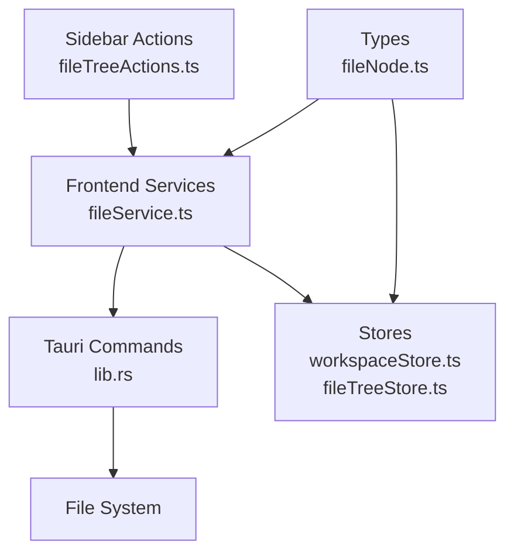
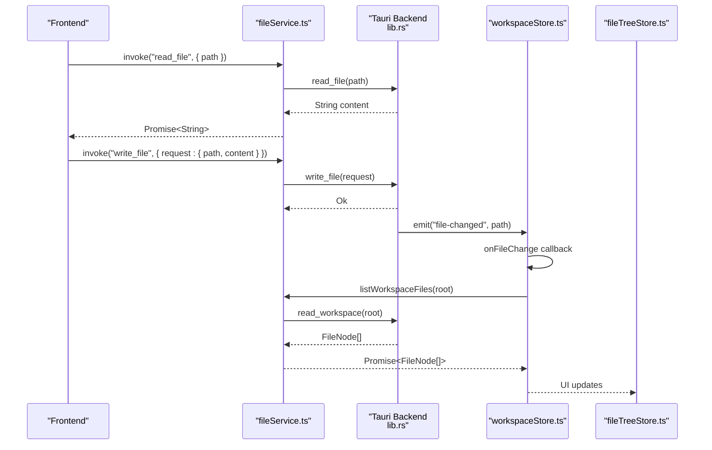
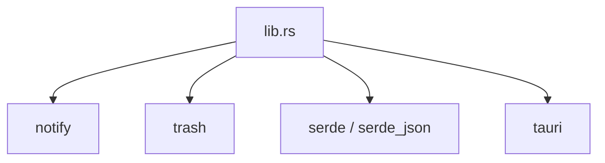

# File Service API

<cite>
**Referenced Files in This Document**
- [fileService.ts](file://src/lib/services/fileService.ts)
- [lib.rs](file://src-tauri/src/lib.rs)
- [fileTreeStore.ts](file://src/lib/stores/fileTreeStore.ts)
- [workspaceStore.ts](file://src/lib/stores/workspaceStore.ts)
- [fileTreeActions.ts](file://src/lib/sidebar/fileTreeActions.ts)
- [fileNode.ts](file://src/lib/types/fileNode.ts)
- [Cargo.toml](file://src-tauri/Cargo.toml)
- [fileValidator.ts](file://src/lib/utils/fileValidator.ts)
</cite>

## Table of Contents
1. [Introduction](#introduction)
2. [Project Structure](#project-structure)
3. [Core Components](#core-components)
4. [Architecture Overview](#architecture-overview)
5. [Detailed Component Analysis](#detailed-component-analysis)
6. [Dependency Analysis](#dependency-analysis)
7. [Performance Considerations](#performance-considerations)
8. [Troubleshooting Guide](#troubleshooting-guide)
9. [Conclusion](#conclusion)
10. [Appendices](#appendices)

## Introduction
This document provides comprehensive API documentation for the fileService module that bridges the frontend and Tauri’s backend file operations. It covers all exposed methods, their parameters, return types, and error conditions, along with the underlying Tauri commands implemented in Rust. It also explains integration with fileTreeStore and workspaceStore for maintaining file system state and handling file watcher events. Guidance is included for encoding scenarios, large file operations, error handling strategies, and safe usage patterns to prevent race conditions and ensure data integrity.

## Project Structure
The file service is implemented in the frontend TypeScript module and delegates to Tauri commands defined in the Rust backend. Stores manage UI state and synchronization with the file system.

**Diagram sources**
- [fileService.ts](file://src/lib/services/fileService.ts#L1-L85)
- [lib.rs](file://src-tauri/src/lib.rs#L248-L425)
- [workspaceStore.ts](file://src/lib/stores/workspaceStore.ts#L1-L130)
- [fileTreeStore.ts](file://src/lib/stores/fileTreeStore.ts#L1-L290)
- [fileTreeActions.ts](file://src/lib/sidebar/fileTreeActions.ts#L1-L135)
- [fileNode.ts](file://src/lib/types/fileNode.ts#L1-L19)

**Section sources**
- [fileService.ts](file://src/lib/services/fileService.ts#L1-L85)
- [lib.rs](file://src-tauri/src/lib.rs#L248-L425)
- [workspaceStore.ts](file://src/lib/stores/workspaceStore.ts#L1-L130)
- [fileTreeStore.ts](file://src/lib/stores/fileTreeStore.ts#L1-L290)
- [fileTreeActions.ts](file://src/lib/sidebar/fileTreeActions.ts#L1-L135)
- [fileNode.ts](file://src/lib/types/fileNode.ts#L1-L19)

## Core Components
- fileService: Provides a unified asynchronous API for file operations and integrates with Tauri commands and event listeners.
- Tauri commands: Implemented in Rust, expose file operations and file watching.
- Stores: Maintain UI state and synchronize with file system changes.
- Sidebar actions: Demonstrate usage patterns for file creation, renaming, deletion, and revealing in explorer.

Key methods exposed by fileService:
- readFile(fileId): Promise<string>
- writeFile(fileId, content): Promise<void>
- listWorkspaceFiles(rootOverride?): Promise<FileNode[]>
- onFileChange(cb): Promise<() => void>
- createFile(path): Promise<void>
- createDirectory(path): Promise<void>
- renameFile(oldPath, newPath): Promise<void>
- deleteFile(path, useTrash): Promise<void>
- revealInExplorer(path): Promise<void>
- startFileWatcher(): Promise<void>
- setWorkspaceRoot(root): void
- getWorkspaceRoot(): string

**Section sources**
- [fileService.ts](file://src/lib/services/fileService.ts#L15-L84)
- [fileNode.ts](file://src/lib/types/fileNode.ts#L10-L19)

## Architecture Overview
The frontend invokes Tauri commands via @tauri-apps/api/core. The backend executes file operations and emits file-changed events. Stores subscribe to these events to refresh the workspace tree and keep UI state consistent.

**Diagram sources**
- [fileService.ts](file://src/lib/services/fileService.ts#L30-L84)
- [lib.rs](file://src-tauri/src/lib.rs#L266-L388)
- [workspaceStore.ts](file://src/lib/stores/workspaceStore.ts#L74-L95)
- [fileTreeStore.ts](file://src/lib/stores/fileTreeStore.ts#L205-L264)

## Detailed Component Analysis

### fileService API Reference
- readFile(fileId)
  - Parameters: path string (file identifier/path)
  - Returns: Promise<string> (content decoded using lossy UTF-8 conversion)
  - Errors: Propagates backend errors (e.g., file not found)
  - Underlying command: read_file
  - Section sources
    - [fileService.ts](file://src/lib/services/fileService.ts#L30-L36)
    - [lib.rs](file://src-tauri/src/lib.rs#L266-L279)

- writeFile(fileId, content)
  - Parameters: path string, content string
  - Returns: Promise<void>
  - Errors: Propagates backend errors (e.g., permission denied, disk full)
  - Underlying command: write_file
  - Section sources
    - [fileService.ts](file://src/lib/services/fileService.ts#L35-L41)
    - [lib.rs](file://src-tauri/src/lib.rs#L366-L388)

- listWorkspaceFiles(rootOverride?)
  - Parameters: rootOverride string (optional)
  - Returns: Promise<FileNode[]>
  - Errors: Propagates backend errors (e.g., invalid root)
  - Underlying command: read_workspace
  - Section sources
    - [fileService.ts](file://src/lib/services/fileService.ts#L39-L42)
    - [lib.rs](file://src-tauri/src/lib.rs#L248-L265)
    - [fileNode.ts](file://src/lib/types/fileNode.ts#L10-L19)

- onFileChange(cb)
  - Parameters: cb(fileId: string) => void
  - Returns: Promise<() => void> (unlisten function)
  - Behavior: Listens to "file-changed" events emitted by backend
  - Section sources
    - [fileService.ts](file://src/lib/services/fileService.ts#L43-L51)
    - [lib.rs](file://src-tauri/src/lib.rs#L390-L425)

- createFile(path)
  - Parameters: path string
  - Returns: Promise<void>
  - Errors: Propagates backend errors (e.g., permission denied)
  - Underlying command: create_file
  - Section sources
    - [fileService.ts](file://src/lib/services/fileService.ts#L52-L56)
    - [lib.rs](file://src-tauri/src/lib.rs#L281-L291)

- createDirectory(path)
  - Parameters: path string
  - Returns: Promise<void>
  - Errors: Propagates backend errors (e.g., permission denied)
  - Underlying command: create_directory
  - Section sources
    - [fileService.ts](file://src/lib/services/fileService.ts#L56-L60)
    - [lib.rs](file://src-tauri/src/lib.rs#L293-L299)

- renameFile(oldPath, newPath)
  - Parameters: oldPath string, newPath string
  - Returns: Promise<void>
  - Errors: Propagates backend errors (e.g., permission denied)
  - Underlying command: rename_file
  - Section sources
    - [fileService.ts](file://src/lib/services/fileService.ts#L60-L64)
    - [lib.rs](file://src-tauri/src/lib.rs#L300-L309)

- deleteFile(path, useTrash)
  - Parameters: path string, useTrash boolean
  - Returns: Promise<void>
  - Behavior: Moves to trash if useTrash is true; otherwise deletes permanently
  - Errors: Propagates backend errors (e.g., permission denied)
  - Underlying command: delete_file
  - Section sources
    - [fileService.ts](file://src/lib/services/fileService.ts#L64-L70)
    - [lib.rs](file://src-tauri/src/lib.rs#L311-L325)

- revealInExplorer(path)
  - Parameters: path string
  - Returns: Promise<void>
  - Errors: Propagates backend errors (e.g., file not found)
  - Underlying command: reveal_in_explorer
  - Section sources
    - [fileService.ts](file://src/lib/services/fileService.ts#L69-L73)
    - [lib.rs](file://src-tauri/src/lib.rs#L327-L364)

- startFileWatcher()
  - Parameters: none
  - Returns: Promise<void>
  - Behavior: Starts recursive file watcher on current working directory
  - Errors: Propagates backend errors (e.g., watcher initialization failure)
  - Underlying command: start_file_watcher
  - Section sources
    - [fileService.ts](file://src/lib/services/fileService.ts#L73-L75)
    - [lib.rs](file://src-tauri/src/lib.rs#L390-L425)

- setWorkspaceRoot(root), getWorkspaceRoot()
  - Parameters: root string
  - Returns: void/string
  - Behavior: Manages workspace root used by listWorkspaceFiles
  - Section sources
    - [fileService.ts](file://src/lib/services/fileService.ts#L76-L84)

### Tauri Commands Implementation (lib.rs)
- read_file(path: String) -> Result<String, String>
  - Validates path existence and file type; reads bytes and converts to string using lossy UTF-8 decoding
  - Section sources
    - [lib.rs](file://src-tauri/src/lib.rs#L266-L279)

- write_file(request: WriteFileRequest) -> Result<(), String>
  - Creates parent directories if needed; writes bytes; emits "file-changed" event with path
  - Section sources
    - [lib.rs](file://src-tauri/src/lib.rs#L366-L388)

- read_workspace(root: String) -> Result<Vec<FileEntry>, String>
  - Resolves path; validates directory; builds FileEntry tree up to a fixed depth; handles permission issues gracefully
  - Section sources
    - [lib.rs](file://src-tauri/src/lib.rs#L248-L265)
    - [lib.rs](file://src-tauri/src/lib.rs#L221-L246)

- create_file(path: String) -> Result<(), String>
  - Ensures parent directories exist; creates empty file
  - Section sources
    - [lib.rs](file://src-tauri/src/lib.rs#L281-L291)

- create_directory(path: String) -> Result<(), String>
  - Creates directory recursively
  - Section sources
    - [lib.rs](file://src-tauri/src/lib.rs#L293-L299)

- rename_file(old_path: String, new_path: String) -> Result<(), String>
  - Creates parent directories for destination; renames file
  - Section sources
    - [lib.rs](file://src-tauri/src/lib.rs#L300-L309)

- delete_file(path: String, use_trash: bool) -> Result<(), String>
  - Moves to trash if useTrash is true; otherwise removes file or directory recursively
  - Section sources
    - [lib.rs](file://src-tauri/src/lib.rs#L311-L325)

- reveal_in_explorer(path: String) -> Result<(), String>
  - Opens OS-specific file explorer at given path
  - Section sources
    - [lib.rs](file://src-tauri/src/lib.rs#L327-L364)

- start_file_watcher(app: AppHandle) -> Result<(), String>
  - Initializes a recursive file watcher on current working directory; emits "file-changed" events
  - Section sources
    - [lib.rs](file://src-tauri/src/lib.rs#L390-L425)

### Integration with fileTreeStore and workspaceStore
- workspaceStore refreshes the file tree upon receiving "file-changed" events and manages workspace root.
- fileTreeStore maintains UI state (expanded directories, selected file) and synchronizes with active editor tabs.
- Section sources
  - [workspaceStore.ts](file://src/lib/stores/workspaceStore.ts#L74-L95)
  - [fileTreeStore.ts](file://src/lib/stores/fileTreeStore.ts#L138-L264)

### Sidebar Actions Usage Patterns
- Demonstrates createFile, createDirectory, renameFile, deleteFile, and revealInExplorer with error handling and workspace refresh.
- Section sources
  - [fileTreeActions.ts](file://src/lib/sidebar/fileTreeActions.ts#L84-L134)

### Encoding Scenarios and Large Files
- readFile uses lossy UTF-8 conversion to handle non-UTF-8 files safely.
- A validator utility checks file size and detects binary content to prevent opening unsupported files in the editor.
- Section sources
  - [lib.rs](file://src-tauri/src/lib.rs#L276-L279)
  - [fileValidator.ts](file://src/lib/utils/fileValidator.ts#L1-L130)

### Error Handling Strategy
Common backend errors include:
- Permission denied: occurs when creating, writing, renaming, or deleting files/directories without sufficient permissions
- File not found: occurs when reading a non-existent file or revealing a non-existent path
- Disk full: occurs when writing fails due to insufficient disk space
- Directory not found or invalid root: occurs when listing workspace files with an invalid path
- Watcher initialization failures: occurs when starting the file watcher

Frontend handling:
- Use try/catch around fileService calls
- Display user-friendly messages
- Optionally retry or fallback to safe defaults

Backend handling:
- Commands return Result<T, String>; errors are propagated to the frontend
- Directory listing tolerates permission issues by skipping inaccessible entries

**Section sources**
- [lib.rs](file://src-tauri/src/lib.rs#L221-L246)
- [lib.rs](file://src-tauri/src/lib.rs#L266-L325)
- [lib.rs](file://src-tauri/src/lib.rs#L390-L425)
- [fileTreeActions.ts](file://src/lib/sidebar/fileTreeActions.ts#L44-L47)

### Usage Patterns and Race Conditions
Safe patterns:
- Always refresh workspaceStore after mutating operations (create, rename, delete) to keep UI state consistent
- Use onFileChange to subscribe to file-changed events and trigger refresh cycles
- Avoid concurrent writes to the same file; queue operations or use optimistic UI updates with server-side reconciliation
- For large files, consider streaming or chunked writes and disable heavy editor features

Race condition risks:
- Simultaneous writes to the same path can overwrite each other; coordinate via application-level locks or transaction-like patterns
- Refreshing the workspace concurrently with file mutations can cause inconsistent UI; debounce refresh triggers

**Section sources**
- [workspaceStore.ts](file://src/lib/stores/workspaceStore.ts#L74-L95)
- [fileTreeActions.ts](file://src/lib/sidebar/fileTreeActions.ts#L84-L134)

## Dependency Analysis
External dependencies relevant to file operations:
- notify: file watching
- trash: moving files to trash
- serde/serde_json: serialization for settings commands (not part of fileService)
- tauri plugins: opener, dialog, shell

**Diagram sources**
- [lib.rs](file://src-tauri/src/lib.rs#L24-L41)
- [Cargo.toml](file://src-tauri/Cargo.toml#L20-L33)

**Section sources**
- [Cargo.toml](file://src-tauri/Cargo.toml#L20-L33)
- [lib.rs](file://src-tauri/src/lib.rs#L24-L41)

## Performance Considerations
- read_workspace enforces a maximum tree depth to avoid deep traversal overhead.
- Directory listing tolerates permission errors by skipping inaccessible entries.
- readFile uses lossy conversion to avoid parsing failures on non-text files.
- For large files, consider disabling editor features (minimap, folding, code lens) to improve responsiveness.

[No sources needed since this section provides general guidance]

## Troubleshooting Guide
- Permission denied
  - Cause: Insufficient privileges to create/write/rename/delete files/directories
  - Resolution: Run with appropriate permissions or adjust file system permissions
  - Section sources
    - [lib.rs](file://src-tauri/src/lib.rs#L281-L325)

- File not found
  - Cause: Attempting to read a non-existent file or reveal a non-existent path
  - Resolution: Verify path correctness and existence
  - Section sources
    - [lib.rs](file://src-tauri/src/lib.rs#L266-L279)
    - [lib.rs](file://src-tauri/src/lib.rs#L327-L333)

- Disk full
  - Cause: Writing fails due to insufficient disk space
  - Resolution: Free up disk space or reduce file sizes
  - Section sources
    - [lib.rs](file://src-tauri/src/lib.rs#L366-L388)

- Watcher initialization failure
  - Cause: Failure to initialize file watcher
  - Resolution: Retry or check system limits
  - Section sources
    - [lib.rs](file://src-tauri/src/lib.rs#L390-L405)

- Large files or binary files
  - Cause: Opening large or binary files in the editor
  - Resolution: Use the validator utility to detect and warn; avoid opening unsupported files
  - Section sources
    - [fileValidator.ts](file://src/lib/utils/fileValidator.ts#L1-L130)

## Conclusion
The fileService module provides a clean, asynchronous API for frontend-to-backend file operations. Its Tauri command implementations are robust, handle common errors gracefully, and integrate seamlessly with UI stores for real-time updates. By following the recommended usage patterns and error handling strategies, developers can build reliable file operations with predictable behavior and strong resilience against common file system issues.

## Appendices

### API Method Index
- readFile(fileId)
- writeFile(fileId, content)
- listWorkspaceFiles(rootOverride?)
- onFileChange(cb)
- createFile(path)
- createDirectory(path)
- renameFile(oldPath, newPath)
- deleteFile(path, useTrash)
- revealInExplorer(path)
- startFileWatcher()
- setWorkspaceRoot(root)
- getWorkspaceRoot()

**Section sources**
- [fileService.ts](file://src/lib/services/fileService.ts#L15-L84)