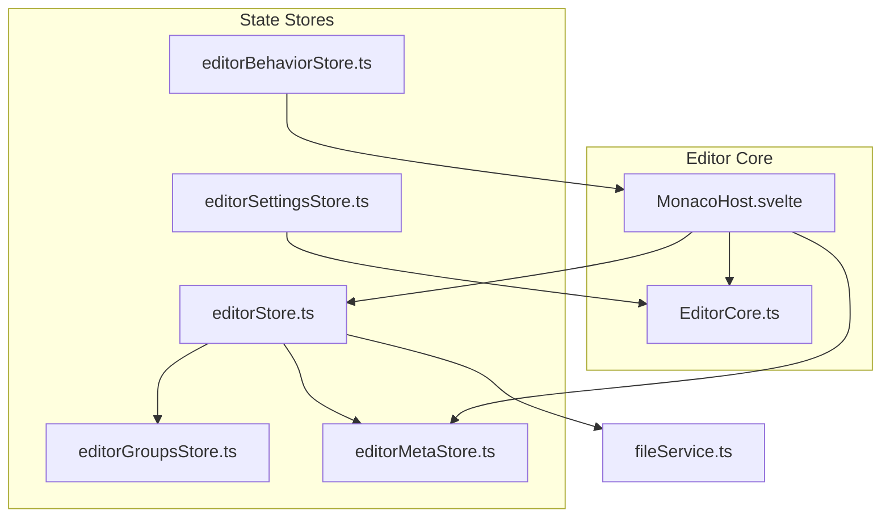
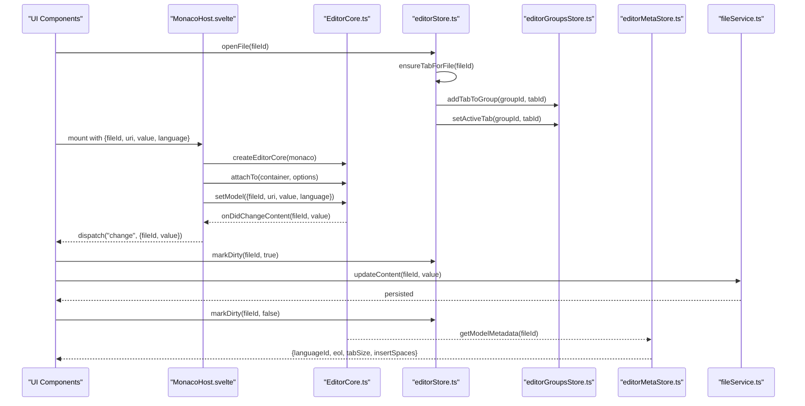
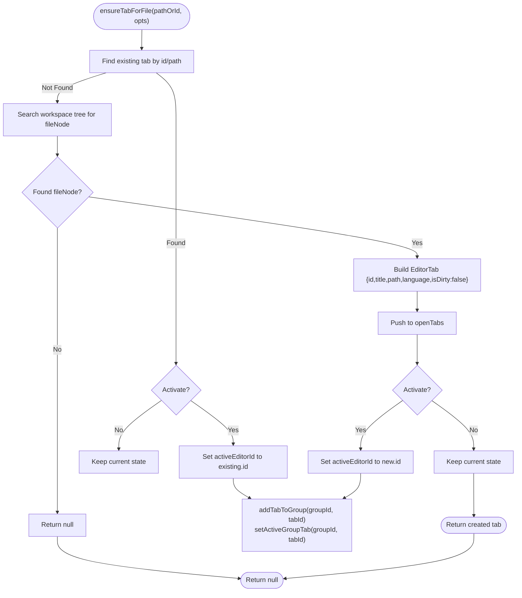
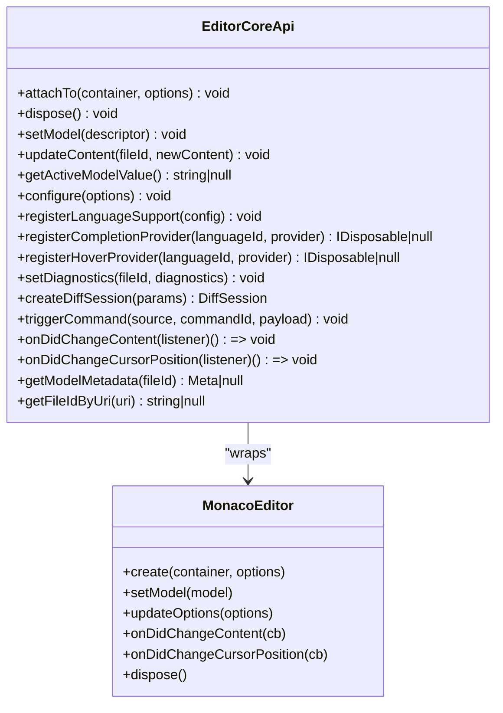
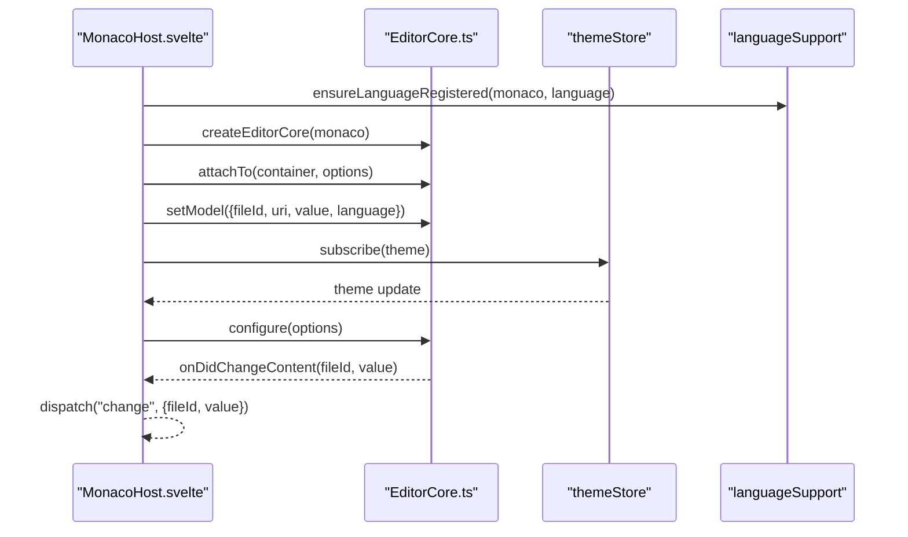
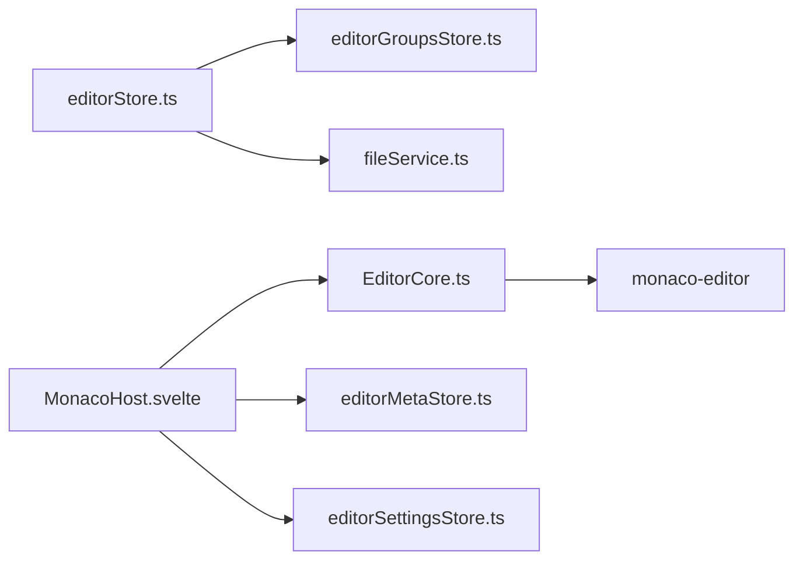

# Editor Store

<cite>
**Referenced Files in This Document**
- [editorStore.ts](file://src/lib/stores/editorStore.ts)
- [EditorCore.ts](file://src/lib/editor/EditorCore.ts)
- [editorGroupsStore.ts](file://src/lib/stores/layout/editorGroupsStore.ts)
- [editorMetaStore.ts](file://src/lib/stores/editorMetaStore.ts)
- [editorSettingsStore.ts](file://src/lib/stores/editorSettingsStore.ts)
- [editorBehaviorStore.ts](file://src/lib/stores/editorBehaviorStore.ts)
- [MonacoHost.svelte](file://src/lib/editor/MonacoHost.svelte)
- [fileService.ts](file://src/lib/services/fileService.ts)
</cite>

## Table of Contents

1. [Introduction](#introduction)
2. [Project Structure](#project-structure)
3. [Core Components](#core-components)
4. [Architecture Overview](#architecture-overview)
5. [Detailed Component Analysis](#detailed-component-analysis)
6. [Dependency Analysis](#dependency-analysis)
7. [Performance Considerations](#performance-considerations)
8. [Troubleshooting Guide](#troubleshooting-guide)
9. [Conclusion](#conclusion)

## Introduction

This document explains the editorStore, the central state manager for the code editor in NC. It covers:

- State properties: current editor instance, active tab, cursor position, selection range, and editor configuration
- Methods for creating, switching, and closing tabs, and managing split views
- Interaction with EditorCore to initialize and configure Monaco Editor instances
- Subscribing to editor state changes using Svelte’s $ syntax
- Handling editor events like focus, blur, and content changes
- Integration with editorMetaStore for file metadata and editorSettingsStore for editor-specific preferences
- Persistence of editor state across sessions and undo/redo behavior via Monaco Editor
- Safe updates and performance guidance for rapid state changes

## Project Structure

The editor subsystem is composed of:

- editorStore: logical tabs and active tab state
- editorGroupsStore: split view and tab grouping
- EditorCore: Monaco Editor integration and event subscriptions
- editorMetaStore: derived metadata for the active editor
- editorSettingsStore: editor appearance and behavior preferences
- editorBehaviorStore: auto-save behavior
- MonacoHost.svelte: mounts EditorCore and bridges to Svelte runtime
- fileService: persistence of file content

**Diagram sources**

- [editorStore.ts](file://src/lib/stores/editorStore.ts#L358-L381)
- [editorGroupsStore.ts](file://src/lib/stores/layout/editorGroupsStore.ts#L1-L120)
- [editorMetaStore.ts](file://src/lib/stores/editorMetaStore.ts#L1-L90)
- [editorSettingsStore.ts](file://src/lib/stores/editorSettingsStore.ts#L1-L180)
- [editorBehaviorStore.ts](file://src/lib/stores/editorBehaviorStore.ts#L1-L56)
- [EditorCore.ts](file://src/lib/editor/EditorCore.ts#L1-L120)
- [MonacoHost.svelte](file://src/lib/editor/MonacoHost.svelte#L1-L120)
- [fileService.ts](file://src/lib/services/fileService.ts#L1-L85)

**Section sources**

- [editorStore.ts](file://src/lib/stores/editorStore.ts#L1-L120)
- [editorGroupsStore.ts](file://src/lib/stores/layout/editorGroupsStore.ts#L1-L120)
- [EditorCore.ts](file://src/lib/editor/EditorCore.ts#L1-L120)
- [editorMetaStore.ts](file://src/lib/stores/editorMetaStore.ts#L1-L40)
- [editorSettingsStore.ts](file://src/lib/stores/editorSettingsStore.ts#L1-L60)
- [editorBehaviorStore.ts](file://src/lib/stores/editorBehaviorStore.ts#L1-L40)
- [MonacoHost.svelte](file://src/lib/editor/MonacoHost.svelte#L1-L80)
- [fileService.ts](file://src/lib/services/fileService.ts#L1-L40)

## Core Components

- editorStore: maintains open tabs and active editor id; exposes methods to open/close tabs, set active editor, mark dirty, update content, and ensure a tab exists for a given file id/path
- editorGroupsStore: manages split views and tab ordering per group; keeps track of active group and active tab per group
- EditorCore: encapsulates Monaco Editor lifecycle, model management, configuration, and event subscriptions
- editorMetaStore: derived metadata for the active editor (language, EOL, tab size, insert spaces)
- editorSettingsStore: editor appearance and behavior preferences
- editorBehaviorStore: auto-save behavior and delays
- MonacoHost.svelte: mounts EditorCore, applies theme, registers providers, and forwards change events
- fileService: persists content to the backend and lists workspace files

Key responsibilities:

- editorStore: logical tabs and dirty state
- editorGroupsStore: split view layout and active tab routing
- EditorCore: Monaco instance, models, events, and configuration
- editorMetaStore: status bar metadata
- MonacoHost.svelte: runtime integration and event bridging

**Section sources**

- [editorStore.ts](file://src/lib/stores/editorStore.ts#L81-L381)
- [editorGroupsStore.ts](file://src/lib/stores/layout/editorGroupsStore.ts#L1-L220)
- [EditorCore.ts](file://src/lib/editor/EditorCore.ts#L160-L315)
- [editorMetaStore.ts](file://src/lib/stores/editorMetaStore.ts#L1-L90)
- [editorSettingsStore.ts](file://src/lib/stores/editorSettingsStore.ts#L1-L180)
- [editorBehaviorStore.ts](file://src/lib/stores/editorBehaviorStore.ts#L1-L56)
- [MonacoHost.svelte](file://src/lib/editor/MonacoHost.svelte#L1-L120)
- [fileService.ts](file://src/lib/services/fileService.ts#L1-L85)

## Architecture Overview

The editor architecture separates concerns:

- editorStore: logical tabs and active tab id
- editorGroupsStore: split view and tab ordering
- EditorCore: Monaco Editor integration and event subscriptions
- editorMetaStore: derived metadata for the active tab
- editorSettingsStore: editor preferences
- MonacoHost.svelte: runtime bridge between Svelte and Monaco

**Diagram sources**

- [editorStore.ts](file://src/lib/stores/editorStore.ts#L192-L349)
- [editorGroupsStore.ts](file://src/lib/stores/layout/editorGroupsStore.ts#L173-L222)
- [EditorCore.ts](file://src/lib/editor/EditorCore.ts#L171-L210)
- [MonacoHost.svelte](file://src/lib/editor/MonacoHost.svelte#L120-L172)
- [editorMetaStore.ts](file://src/lib/stores/editorMetaStore.ts#L42-L90)
- [fileService.ts](file://src/lib/services/fileService.ts#L30-L40)

## Detailed Component Analysis

### editorStore

- State shape:
  - openTabs: array of EditorTab with id, title, path, language, isDirty
  - activeEditorId: string | null
- Methods:
  - openFile(fileId): ensures a tab for a file id and activates it; adds to group 1
  - openSettings(): opens a special “Settings” tab with a dedicated id
  - ensureTabForFile(pathOrId, opts?): ensures a tab exists; supports activation and group assignment
  - setActiveEditor(fileId): sets active tab by id
  - closeEditor(fileId): removes tab and updates active tab id
  - markDirty(id, isDirty): toggles dirty flag for a tab
  - updateContent(id, value): persists content via fileService and clears dirty flag
- Derived store:
  - activeEditor: resolves active tab from activeEditorId

Integration points:

- Works with editorGroupsStore to manage split views and active tabs
- Interacts with fileService for persistence
- Emits events consumed by MonacoHost via EditorCore

**Diagram sources**

- [editorStore.ts](file://src/lib/stores/editorStore.ts#L110-L190)

**Section sources**

- [editorStore.ts](file://src/lib/stores/editorStore.ts#L81-L381)

### editorGroupsStore

- Manages:
  - groups: array of EditorGroupState with id, tabIds, activeTabId
  - activeGroupId
- Operations:
  - addTabToGroup(groupId, tabId)
  - setActiveTab(groupId, tabId)
  - removeTab(tabId)
  - reorderTabsWithinGroup(groupId, fromIndex, toIndex)
  - moveTabToGroup(tabId, sourceGroupId, targetGroupId, targetIndex?)
  - splitRightFromActive(): creates a new group and moves active tab right
  - getActiveGroup(), getActiveTab()

Split view behavior:

- Splitting moves the active tab from the source group to a newly created group and makes the new group active
- Moving tabs between groups updates activeTabId appropriately

**Section sources**

- [editorGroupsStore.ts](file://src/lib/stores/layout/editorGroupsStore.ts#L1-L413)

### EditorCore

- Responsibilities:
  - Attach to DOM container and create IStandaloneCodeEditor
  - Manage models by fileId and keep activeFileId
  - Subscribe to content changes and cursor position changes on the active model
  - Configure editor options and apply theme
  - Register language support and providers
  - Trigger commands (e.g., undo/redo)
- Events:
  - onDidChangeContent(listener): fires when the active model changes
  - onDidChangeCursorPosition(listener): fires when cursor position changes
- Methods:
  - setModel(descriptor)
  - updateContent(fileId, newContent)
  - getActiveModelValue()
  - configure(options)
  - triggerCommand(source, commandId, payload)
  - registerLanguageSupport(config)
  - registerCompletionProvider(languageId, provider)
  - registerHoverProvider(languageId, provider)
  - setDiagnostics(fileId, diagnostics)
  - createDiffSession(params)

**Diagram sources**

- [EditorCore.ts](file://src/lib/editor/EditorCore.ts#L163-L315)

**Section sources**

- [EditorCore.ts](file://src/lib/editor/EditorCore.ts#L1-L210)

### MonacoHost.svelte

- Mounts EditorCore, applies theme, registers language support and providers
- Reacts to prop changes (fileId, uri, value, language) to update the active model
- Applies editor options via core.configure
- Emits Svelte events for content changes
- Initializes cursor tracking and editor metadata

**Diagram sources**

- [MonacoHost.svelte](file://src/lib/editor/MonacoHost.svelte#L120-L210)
- [EditorCore.ts](file://src/lib/editor/EditorCore.ts#L205-L210)

**Section sources**

- [MonacoHost.svelte](file://src/lib/editor/MonacoHost.svelte#L1-L210)

### editorMetaStore

- Provides derived metadata for the active editor:
  - languageId
  - eol (LF or CRLF)
  - tabSize
  - insertSpaces
- Requires explicit initialization with EditorCoreApi to avoid circular dependencies

**Section sources**

- [editorMetaStore.ts](file://src/lib/stores/editorMetaStore.ts#L1-L90)

### editorSettingsStore

- Maintains editor appearance and behavior preferences:
  - theme, fontSize, fontFamily, fontLigatures
  - tabSize, insertSpaces
  - renderWhitespace, wordWrap, wordWrapColumn
  - minimap, folding, lineNumbers, bracketPairColorization
- Exposes setters and a reset function

**Section sources**

- [editorSettingsStore.ts](file://src/lib/stores/editorSettingsStore.ts#L1-L180)

### editorBehaviorStore

- Controls auto-save behavior:
  - autoSaveMode: off | afterDelay | onFocusChange | onWindowChange
  - autoSaveDelay: number
- Provides getters and toggles

**Section sources**

- [editorBehaviorStore.ts](file://src/lib/stores/editorBehaviorStore.ts#L1-L56)

## Dependency Analysis

- editorStore depends on:
  - editorGroupsStore for split view management
  - fileService for persistence
  - workspaceStore via getWorkspaceFiles for file tree resolution
- EditorCore depends on:
  - monaco-editor
  - editorMetaStore indirectly via derived metadata
- MonacoHost.svelte depends on:
  - EditorCore
  - editorMetaStore
  - editorSettingsStore
  - themeStore

**Diagram sources**

- [editorStore.ts](file://src/lib/stores/editorStore.ts#L356-L381)
- [editorGroupsStore.ts](file://src/lib/stores/layout/editorGroupsStore.ts#L1-L120)
- [MonacoHost.svelte](file://src/lib/editor/MonacoHost.svelte#L1-L120)
- [EditorCore.ts](file://src/lib/editor/EditorCore.ts#L1-L120)

**Section sources**

- [editorStore.ts](file://src/lib/stores/editorStore.ts#L356-L381)
- [editorGroupsStore.ts](file://src/lib/stores/layout/editorGroupsStore.ts#L1-L120)
- [MonacoHost.svelte](file://src/lib/editor/MonacoHost.svelte#L1-L120)
- [EditorCore.ts](file://src/lib/editor/EditorCore.ts#L1-L120)

## Performance Considerations

- Monaco Editor optimizations:
  - automaticLayout: true
  - smoothScrolling: false
  - cursorSmoothCaretAnimation: 'off'
  - renderValidationDecorations: 'editable'
  - quickSuggestionsDelay: 10ms
- Avoid frequent re-renders:
  - Batch updates to editorSettingsStore before applying to EditorCore
  - Debounce rapid content changes when integrating external sources
- Efficient tab management:
  - Use ensureTabForFile to avoid duplicates
  - Prefer setActiveEditor over redundant open/close cycles
- Minimap and rendering:
  - Disable minimap symbols for performance
  - Limit quick suggestions to reduce CPU load

[No sources needed since this section provides general guidance]

## Troubleshooting Guide

Common issues and resolutions:

- Content not persisting:
  - Ensure updateContent is called with a valid file id and that fileService.writeFile completes
  - Verify markDirty is set to false after successful write
- Active tab not updating:
  - Confirm setActiveEditor is called with an existing tab id
  - Check editorGroupsStore setActiveTab for the active group
- Cursor metadata missing:
  - Initialize editorMetaStore with initEditorMeta(core) after EditorCore creation
- Undo/redo not preserved:
  - EditorCore preserves undo stack when switching models; ensure setModel is used instead of recreating the editor
- Rapid state changes causing lag:
  - Coalesce updates to editorSettingsStore and apply once per frame
  - Avoid unnecessary re-renders in Svelte components by using derived stores and memoized computations

**Section sources**

- [editorStore.ts](file://src/lib/stores/editorStore.ts#L284-L349)
- [EditorCore.ts](file://src/lib/editor/EditorCore.ts#L543-L601)
- [editorMetaStore.ts](file://src/lib/stores/editorMetaStore.ts#L32-L41)
- [MonacoHost.svelte](file://src/lib/editor/MonacoHost.svelte#L146-L172)

## Conclusion

The editorStore orchestrates logical tabs and active tab state while delegating Monaco-specific operations to EditorCore. Together with editorGroupsStore, editorMetaStore, editorSettingsStore, and editorBehaviorStore, it provides a robust foundation for a modern code editor with split views, metadata display, configurable preferences, and reliable persistence. Integrating with MonacoHost.svelte ensures seamless Svelte-to-Monaco bridging, enabling responsive editing experiences with efficient event handling and performance optimizations.
