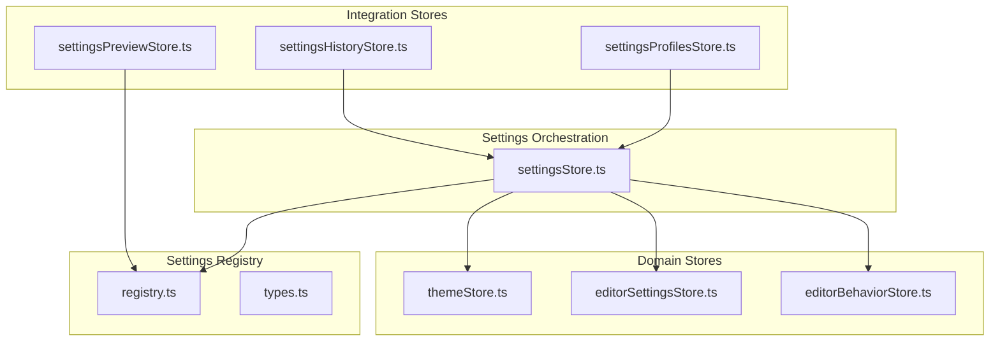
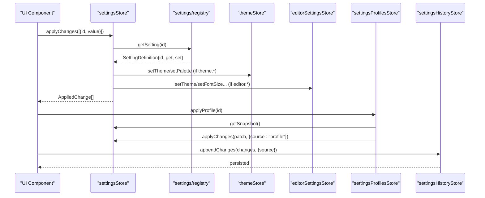
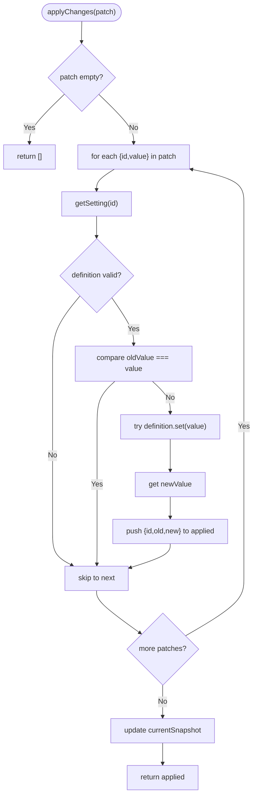
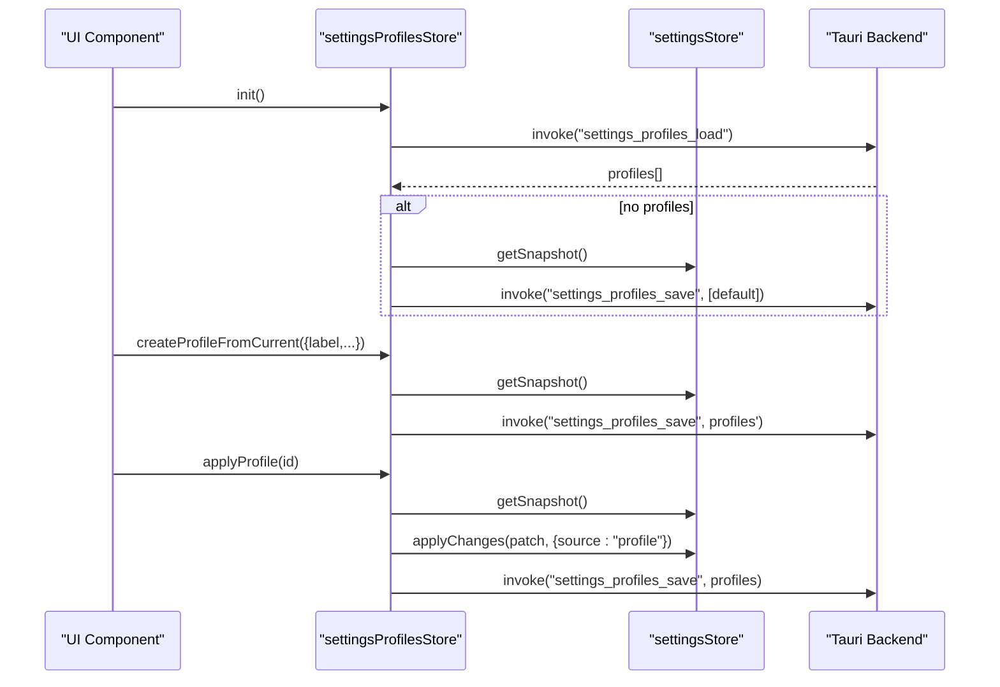
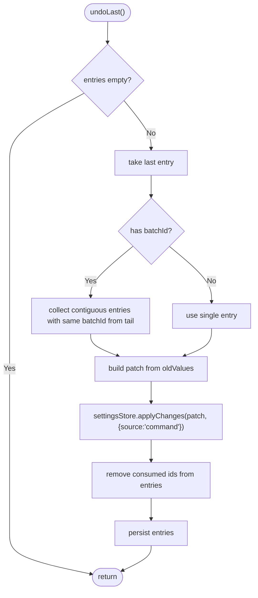
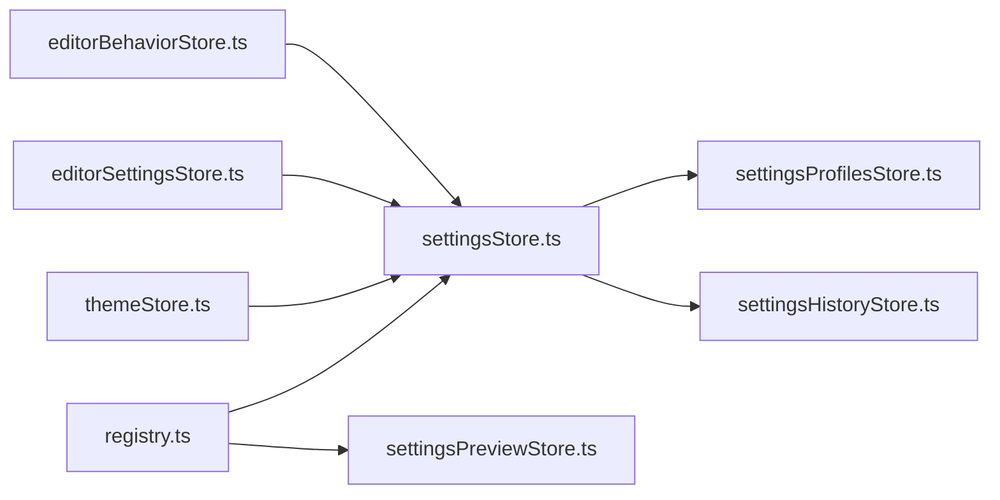

# Settings Store

<cite>
**Referenced Files in This Document**
- [settingsStore.ts](file://src/lib/stores/settingsStore.ts)
- [settingsProfilesStore.ts](file://src/lib/stores/settingsProfilesStore.ts)
- [settingsHistoryStore.ts](file://src/lib/stores/settingsHistoryStore.ts)
- [settingsPreviewStore.ts](file://src/lib/stores/settingsPreviewStore.ts)
- [types.ts](file://src/lib/settings/types.ts)
- [registry.ts](file://src/lib/settings/registry.ts)
- [editorSettingsStore.ts](file://src/lib/stores/editorSettingsStore.ts)
- [themeStore.ts](file://src/lib/stores/themeStore.ts)
- [THEME_PALETTES.ts](file://src/lib/stores/THEME_PALETTES.ts)
- [editorBehaviorStore.ts](file://src/lib/stores/editorBehaviorStore.ts)
</cite>

## Table of Contents
1. [Introduction](#introduction)
2. [Project Structure](#project-structure)
3. [Core Components](#core-components)
4. [Architecture Overview](#architecture-overview)
5. [Detailed Component Analysis](#detailed-component-analysis)
6. [Dependency Analysis](#dependency-analysis)
7. [Performance Considerations](#performance-considerations)
8. [Troubleshooting Guide](#troubleshooting-guide)
9. [Conclusion](#conclusion)
10. [Appendices](#appendices)

## Introduction
This document describes the settings system in NC, focusing on the settingsStore orchestration layer and its integrations with settingsProfilesStore, settingsHistoryStore, and settingsPreviewStore. It explains how user preferences, editor settings, and application-wide configurations are modeled, accessed, validated, persisted, and synchronized across components. It also covers initialization, validation, error recovery, and performance considerations for broadcasting changes to many subscribers.

## Project Structure
The settings system is composed of:
- A central orchestration store (settingsStore) that exposes a unified snapshot of all settings and applies changes.
- A registry (settings/registry) that defines all known settings, sections, and search metadata.
- Domain stores (themeStore, editorSettingsStore, editorBehaviorStore) that hold actual state and expose typed APIs.
- Supporting stores that integrate with settingsStore for profiles, history, and preview.

**Diagram sources**
- [settingsStore.ts](file://src/lib/stores/settingsStore.ts#L1-L313)
- [registry.ts](file://src/lib/settings/registry.ts#L1-L558)
- [types.ts](file://src/lib/settings/types.ts#L1-L192)
- [themeStore.ts](file://src/lib/stores/themeStore.ts#L1-L120)
- [editorSettingsStore.ts](file://src/lib/stores/editorSettingsStore.ts#L1-L180)
- [editorBehaviorStore.ts](file://src/lib/stores/editorBehaviorStore.ts#L1-L56)
- [settingsProfilesStore.ts](file://src/lib/stores/settingsProfilesStore.ts#L1-L426)
- [settingsHistoryStore.ts](file://src/lib/stores/settingsHistoryStore.ts#L1-L304)
- [settingsPreviewStore.ts](file://src/lib/stores/settingsPreviewStore.ts#L1-L214)

**Section sources**
- [settingsStore.ts](file://src/lib/stores/settingsStore.ts#L1-L313)
- [registry.ts](file://src/lib/settings/registry.ts#L1-L558)
- [types.ts](file://src/lib/settings/types.ts#L1-L192)

## Core Components
- settingsStore: Provides a single source of truth snapshot and applies changes to underlying domain stores via the registry. It tracks baseline for dirty-state and resetAll, and updates subscribers reactively.
- settingsProfilesStore: Manages saved settings snapshots as profiles, applies them to the current settings, and persists them via Tauri invoke commands.
- settingsHistoryStore: Records applied changes with metadata, supports undo/redo, and persists history via Tauri commands.
- settingsPreviewStore: Renders live previews for settings without duplicating state, using registry-provided definitions and values.

Key responsibilities:
- Type-safe access: All settings are identified by SettingId and typed via SettingValue.
- Validation: Each SettingDefinition.get/set enforces valid values and writes to real stores.
- Persistence: Profiles and history integrate with Tauri commands for storage.
- Synchronization: Subscribers to domain stores trigger snapshot recomputation and broadcast.

**Section sources**
- [settingsStore.ts](file://src/lib/stores/settingsStore.ts#L66-L110)
- [settingsProfilesStore.ts](file://src/lib/stores/settingsProfilesStore.ts#L49-L65)
- [settingsHistoryStore.ts](file://src/lib/stores/settingsHistoryStore.ts#L45-L62)
- [settingsPreviewStore.ts](file://src/lib/stores/settingsPreviewStore.ts#L72-L81)

## Architecture Overview
The settingsStore orchestrates reads/writes across domain stores through a registry of SettingDefinition instances. Changes are applied atomically per SettingPatch and broadcast to subscribers. Integration stores consume the snapshot and apply changes through the same contract.

**Diagram sources**
- [settingsStore.ts](file://src/lib/stores/settingsStore.ts#L248-L310)
- [registry.ts](file://src/lib/settings/registry.ts#L458-L558)
- [themeStore.ts](file://src/lib/stores/themeStore.ts#L47-L118)
- [editorSettingsStore.ts](file://src/lib/stores/editorSettingsStore.ts#L55-L177)
- [settingsProfilesStore.ts](file://src/lib/stores/settingsProfilesStore.ts#L283-L304)
- [settingsHistoryStore.ts](file://src/lib/stores/settingsHistoryStore.ts#L144-L181)

## Detailed Component Analysis

### settingsStore: Central Orchestration
Responsibilities:
- Snapshot composition: Reads current state from domain stores and constructs a SettingsSnapshot.
- Dirty tracking: Compares current values against a baseline snapshot to compute differences.
- Applying changes: Iterates SettingPatch entries, validates via registry, and invokes definition.set, capturing old/new values.
- Reset to baseline: Builds a patch from baseline to current and applies it.
- Baseline management: Allows external modules to set baseline from current state.

Implementation highlights:
- No duplication of state: snapshot is built on demand from domain stores.
- Strict equality checks prevent redundant writes.
- Errors during set are caught internally and do not propagate to callers.

**Diagram sources**
- [settingsStore.ts](file://src/lib/stores/settingsStore.ts#L248-L310)

**Section sources**
- [settingsStore.ts](file://src/lib/stores/settingsStore.ts#L87-L110)
- [settingsStore.ts](file://src/lib/stores/settingsStore.ts#L111-L177)
- [settingsStore.ts](file://src/lib/stores/settingsStore.ts#L179-L233)
- [settingsStore.ts](file://src/lib/stores/settingsStore.ts#L235-L313)

### settingsProfilesStore: Profiles Management
Responsibilities:
- Load/save profiles via Tauri invoke commands.
- Create profiles from current snapshot, apply profiles, delete/rename/update icons, set default, and reset to default.
- Maintain active/default profile IDs and error state.

Key behaviors:
- Initialization creates a default profile if none exist.
- Applying a profile computes a patch from current to target snapshot and delegates to settingsStore.applyChanges with source metadata.
- Persist failures are captured in state.error; UI remains predictable.

**Diagram sources**
- [settingsProfilesStore.ts](file://src/lib/stores/settingsProfilesStore.ts#L176-L230)
- [settingsProfilesStore.ts](file://src/lib/stores/settingsProfilesStore.ts#L232-L304)
- [settingsProfilesStore.ts](file://src/lib/stores/settingsProfilesStore.ts#L306-L426)

**Section sources**
- [settingsProfilesStore.ts](file://src/lib/stores/settingsProfilesStore.ts#L1-L175)
- [settingsProfilesStore.ts](file://src/lib/stores/settingsProfilesStore.ts#L176-L304)
- [settingsProfilesStore.ts](file://src/lib/stores/settingsProfilesStore.ts#L306-L426)

### settingsHistoryStore: Undo/Redo and Persistence
Responsibilities:
- Append changes with metadata (source, batchId).
- Undo last or undo by entry id by re-applying oldValue as newValue.
- Persist history via Tauri commands and truncate to configured limit.
- Initialize from backend storage.

Undo algorithm:
- Group entries by batchId (contiguous from the tail).
- Build a SettingPatch from grouped entries and apply via settingsStore.
- Remove consumed entries and persist the updated history.

**Diagram sources**
- [settingsHistoryStore.ts](file://src/lib/stores/settingsHistoryStore.ts#L183-L231)
- [settingsHistoryStore.ts](file://src/lib/stores/settingsHistoryStore.ts#L232-L266)

**Section sources**
- [settingsHistoryStore.ts](file://src/lib/stores/settingsHistoryStore.ts#L1-L110)
- [settingsHistoryStore.ts](file://src/lib/stores/settingsHistoryStore.ts#L111-L231)
- [settingsHistoryStore.ts](file://src/lib/stores/settingsHistoryStore.ts#L232-L304)

### settingsPreviewStore: Live Preview and Context Help
Responsibilities:
- Resolve preview definitions from registry for a given SettingId.
- Provide inline previews or provider-based previews.
- Track active setting, section, related settings, and help text.

Preview resolution:
- If SettingDefinition declares inline preview config, use it.
- Else if previewId is present and a provider is registered, delegate to provider.

**Section sources**
- [settingsPreviewStore.ts](file://src/lib/stores/settingsPreviewStore.ts#L1-L81)
- [settingsPreviewStore.ts](file://src/lib/stores/settingsPreviewStore.ts#L82-L175)
- [settingsPreviewStore.ts](file://src/lib/stores/settingsPreviewStore.ts#L176-L214)

### Settings Types and Registry
- SettingId: dot-delimited identifiers like "editor.fontSize", "theme.mode".
- SettingValue: union of supported primitives.
- SettingDefinition: describes label, category, section, control type, options, and get/set functions.
- SettingsSnapshot: aggregates domain snapshots (editor, theme).
- SettingsRegistry: provides sections, settings, search, and validation helpers.

Registry highlights:
- Static definitions for editor and theme settings.
- Options computed dynamically (e.g., theme palettes by mode).
- Indexes for fast lookup and sorted ordering.

**Section sources**
- [types.ts](file://src/lib/settings/types.ts#L31-L110)
- [types.ts](file://src/lib/settings/types.ts#L140-L192)
- [registry.ts](file://src/lib/settings/registry.ts#L63-L117)
- [registry.ts](file://src/lib/settings/registry.ts#L118-L429)
- [registry.ts](file://src/lib/settings/registry.ts#L431-L558)

## Dependency Analysis
- settingsStore depends on:
  - settings/registry for SettingDefinition instances and listAllSettings.
  - themeStore and editorSettingsStore for current values and mutations.
- settingsProfilesStore depends on:
  - settingsStore for snapshot and applying changes.
  - Tauri invoke for persistence.
- settingsHistoryStore depends on:
  - settingsStore for applying undo/redo changes.
  - Tauri invoke for persistence.
- settingsPreviewStore depends on:
  - settings/registry for SettingDefinition.get() and preview metadata.

**Diagram sources**
- [registry.ts](file://src/lib/settings/registry.ts#L1-L558)
- [settingsStore.ts](file://src/lib/stores/settingsStore.ts#L1-L313)
- [themeStore.ts](file://src/lib/stores/themeStore.ts#L1-L120)
- [editorSettingsStore.ts](file://src/lib/stores/editorSettingsStore.ts#L1-L180)
- [editorBehaviorStore.ts](file://src/lib/stores/editorBehaviorStore.ts#L1-L56)
- [settingsProfilesStore.ts](file://src/lib/stores/settingsProfilesStore.ts#L1-L426)
- [settingsHistoryStore.ts](file://src/lib/stores/settingsHistoryStore.ts#L1-L304)
- [settingsPreviewStore.ts](file://src/lib/stores/settingsPreviewStore.ts#L1-L214)

**Section sources**
- [settingsStore.ts](file://src/lib/stores/settingsStore.ts#L18-L31)
- [settingsProfilesStore.ts](file://src/lib/stores/settingsProfilesStore.ts#L21-L26)
- [settingsHistoryStore.ts](file://src/lib/stores/settingsHistoryStore.ts#L18-L27)
- [settingsPreviewStore.ts](file://src/lib/stores/settingsPreviewStore.ts#L15-L19)

## Performance Considerations
- Snapshot recomputation: settingsStore rebuilds snapshot on any domain store change. Minimize churn by batching UI updates and avoiding unnecessary writes.
- Equality checks: settingsStore skips applying unchanged values, reducing downstream work.
- History truncation: settingsHistoryStore limits entries and persists asynchronously to keep memory bounded.
- Subscriber count: Large numbers of subscribers are acceptable because Svelte’s readable pattern notifies only when snapshot changes; avoid frequent writes to reduce notifications.
- Registry lookups: settingsStore uses registry to compare baseline/current; ensure registry is not queried excessively by caching where appropriate.

[No sources needed since this section provides general guidance]

## Troubleshooting Guide
Common issues and remedies:
- Corrupted settings: If a SettingDefinition.set throws, settingsStore catches and does not include the change in applied results. Verify the definition’s set logic and constraints.
- Persistence errors:
  - settingsProfilesStore: Errors from invoke are stored in state.error; UI remains usable. Retry or inspect backend commands.
  - settingsHistoryStore: Persist failures are swallowed to keep in-memory state consistent; check backend commands and logs separately.
- Undo not working:
  - Ensure batchId is set consistently for grouped changes.
  - Confirm that old values are valid for the target setting.
- Preview not appearing:
  - Ensure the SettingDefinition has either inline preview config or a previewId with a registered provider.

**Section sources**
- [settingsStore.ts](file://src/lib/stores/settingsStore.ts#L265-L285)
- [settingsProfilesStore.ts](file://src/lib/stores/settingsProfilesStore.ts#L150-L161)
- [settingsHistoryStore.ts](file://src/lib/stores/settingsHistoryStore.ts#L84-L109)
- [settingsPreviewStore.ts](file://src/lib/stores/settingsPreviewStore.ts#L176-L214)

## Conclusion
The settingsStore provides a clean, type-safe, and extensible foundation for managing application configuration. By delegating to domain stores and the registry, it ensures single-source-of-truth semantics, robust validation, and seamless integration with profiles, history, and preview. Extending the system involves adding SettingDefinition entries to the registry and wiring domain stores to expose typed getters/setters.

[No sources needed since this section summarizes without analyzing specific files]

## Appendices

### Initialization and Defaults
- Initialization:
  - settingsStore initializes baseline and current snapshot from domain stores upon first import.
  - settingsProfilesStore.init loads profiles or creates a default profile snapshot and sets active/default IDs.
  - settingsHistoryStore.init loads persisted history and truncates to configured limit.
- Defaults:
  - themeStore initializes to dark mode and default palette.
  - editorSettingsStore initializes to sensible defaults for Monaco editor settings.
  - editorBehaviorStore initializes auto-save mode and delay.

**Section sources**
- [settingsStore.ts](file://src/lib/stores/settingsStore.ts#L183-L190)
- [settingsProfilesStore.ts](file://src/lib/stores/settingsProfilesStore.ts#L176-L230)
- [settingsHistoryStore.ts](file://src/lib/stores/settingsHistoryStore.ts#L125-L142)
- [themeStore.ts](file://src/lib/stores/themeStore.ts#L36-L66)
- [editorSettingsStore.ts](file://src/lib/stores/editorSettingsStore.ts#L32-L49)
- [editorBehaviorStore.ts](file://src/lib/stores/editorBehaviorStore.ts#L15-L24)

### Extending the Settings System
Steps to add a new configuration option:
1. Define a SettingDefinition in the registry with:
   - id following "domain.name" convention.
   - label, description, category, section, control type, and order.
   - get returning current value from the appropriate domain store.
   - set invoking the domain store’s setter.
2. Add the SettingId to the relevant SettingsSectionDefinition.
3. If applicable, add preview metadata (inline or provider-based) in the SettingDefinition.
4. Integrate persistence:
   - For profiles: ensure SettingsSnapshot includes the new domain.
   - For history: changes will be recorded automatically when settingsStore.applyChanges is used.
5. Test:
   - Verify type-safe access via settingsStore.getSnapshot and registry APIs.
   - Confirm preview rendering and undo/redo behavior.

**Section sources**
- [registry.ts](file://src/lib/settings/registry.ts#L118-L429)
- [registry.ts](file://src/lib/settings/registry.ts#L431-L558)
- [types.ts](file://src/lib/settings/types.ts#L140-L192)
- [settingsProfilesStore.ts](file://src/lib/stores/settingsProfilesStore.ts#L88-L121)
- [settingsHistoryStore.ts](file://src/lib/stores/settingsHistoryStore.ts#L144-L181)
- [settingsPreviewStore.ts](file://src/lib/stores/settingsPreviewStore.ts#L108-L134)