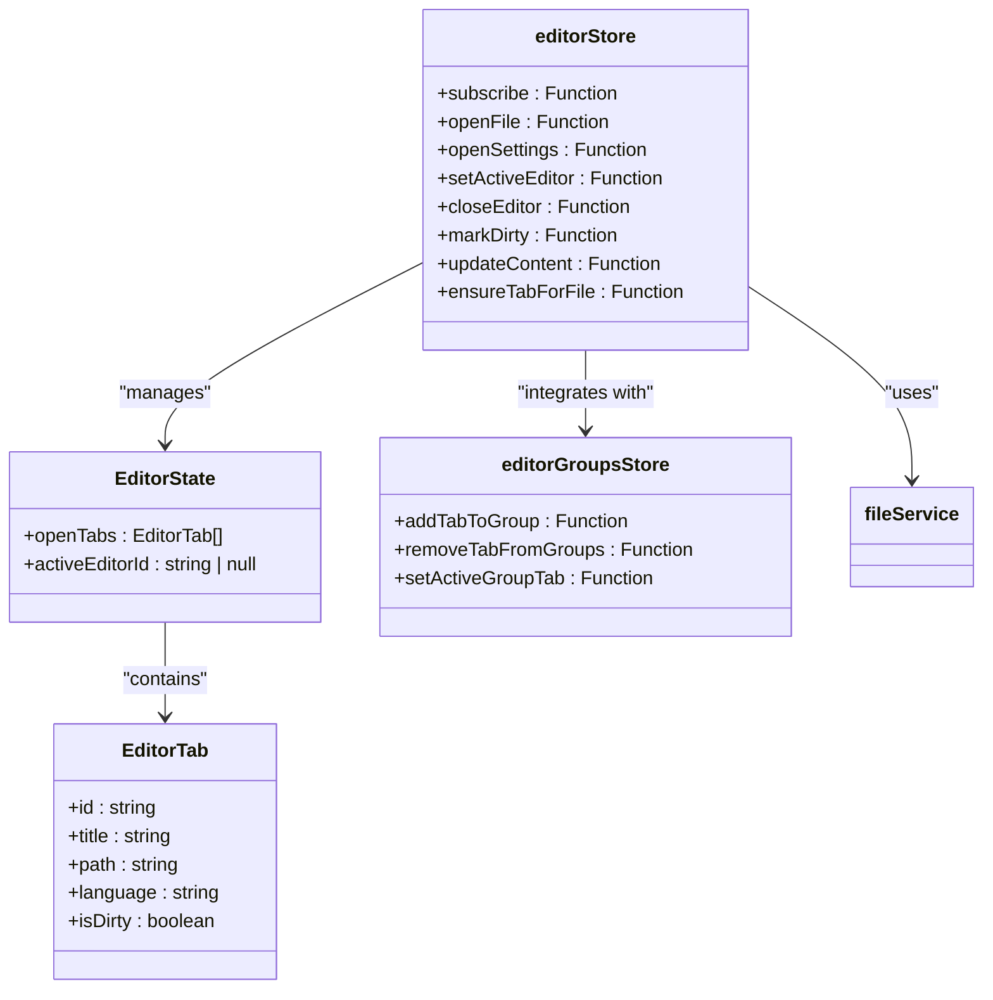
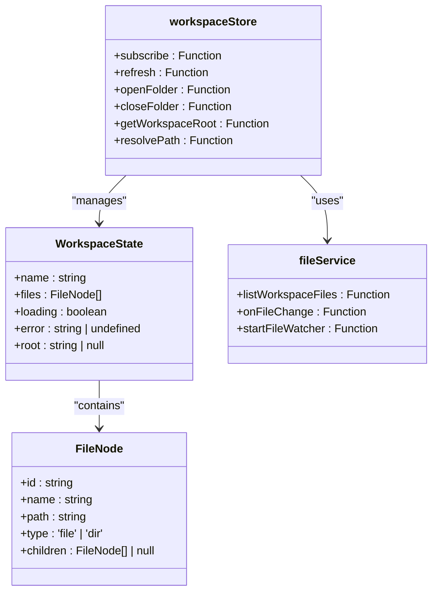
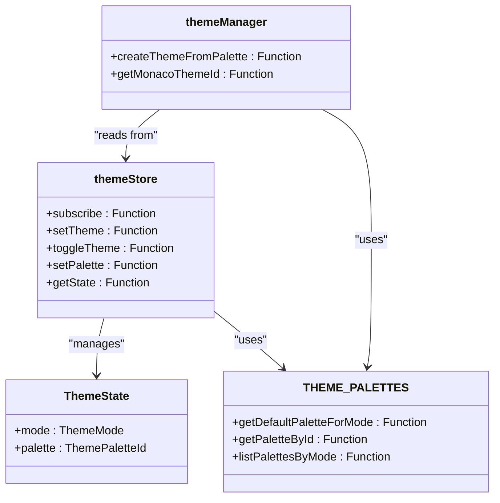
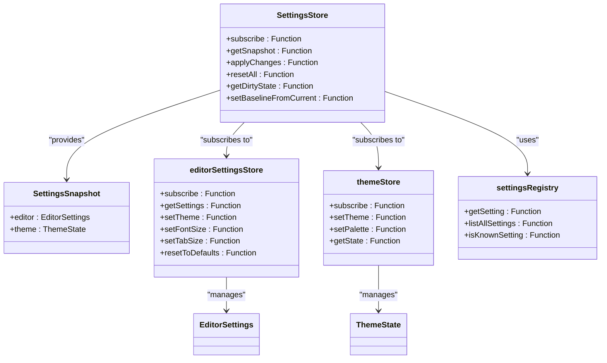
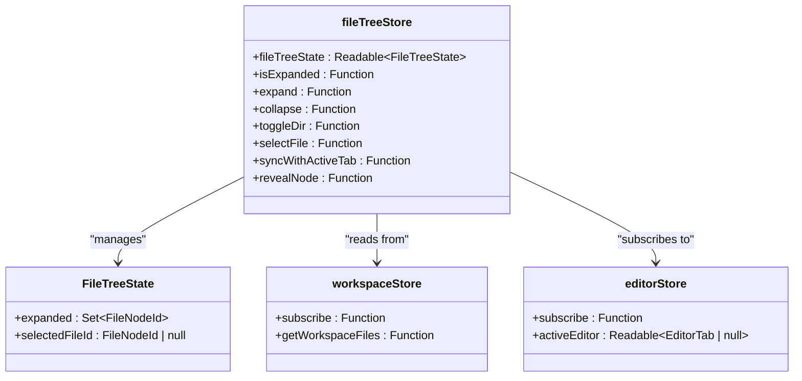
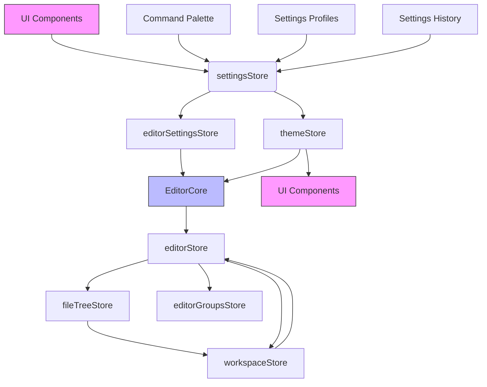
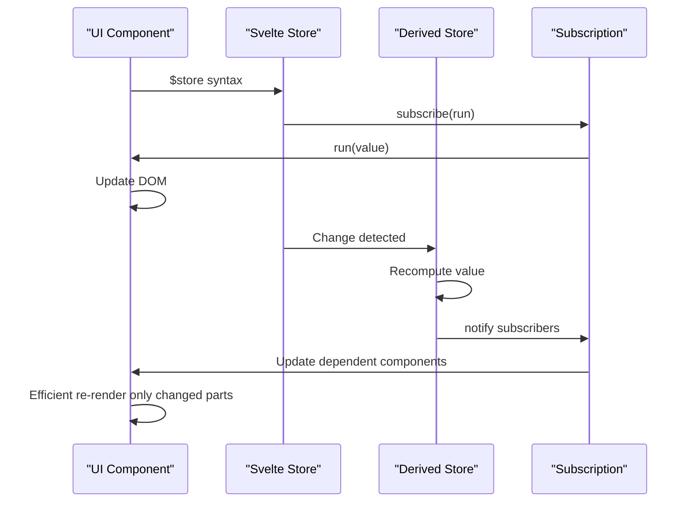

# Store APIs

<cite>
**Referenced Files in This Document**   
- [editorStore.ts](file://src/lib/stores/editorStore.ts)
- [workspaceStore.ts](file://src/lib/stores/workspaceStore.ts)
- [themeStore.ts](file://src/lib/stores/themeStore.ts)
- [settingsStore.ts](file://src/lib/stores/settingsStore.ts)
- [fileTreeStore.ts](file://src/lib/stores/fileTreeStore.ts)
- [editorSettingsStore.ts](file://src/lib/stores/editorSettingsStore.ts)
- [editorGroupsStore.ts](file://src/lib/stores/layout/editorGroupsStore.ts)
- [settingsProfilesStore.ts](file://src/lib/stores/settingsProfilesStore.ts)
- [settingsHistoryStore.ts](file://src/lib/stores/settingsHistoryStore.ts)
- [themeManager.ts](file://src/lib/editor/themeManager.ts)
- [fileService.ts](file://src/lib/services/fileService.ts)
- [registry.ts](file://src/lib/settings/registry.ts)
</cite>

## Table of Contents
1. [Introduction](#introduction)
2. [Core Stores Overview](#core-stores-overview)
3. [Editor Store](#editor-store)
4. [Workspace Store](#workspace-store)
5. [Theme Store](#theme-store)
6. [Settings Store](#settings-store)
7. [File Tree Store](#file-tree-store)
8. [Store Relationships and Data Flow](#store-relationships-and-data-flow)
9. [Reactive Programming Model](#reactive-programming-model)
10. [Initialization Process](#initialization-process)
11. [Performance Considerations](#performance-considerations)
12. [Best Practices](#best-practices)

## Introduction

The Svelte store system in the NC code editor provides a comprehensive state management solution for maintaining application state across various components. This documentation details the major stores that power the editor's functionality, including editorStore, workspaceStore, themeStore, settingsStore, and fileTreeStore. Each store manages specific aspects of the application state, from editor tabs and workspace files to UI themes and user settings. The system leverages Svelte's reactive programming model to ensure efficient UI updates when state changes occur. Stores are designed with clear separation of concerns, allowing for maintainable and scalable code architecture. This documentation will explore each store's state properties, update methods, subscription patterns, and their interrelationships within the application.

## Core Stores Overview

The NC code editor implements a modular store architecture with specialized stores for different aspects of application state. The system follows a hierarchical pattern where domain-specific stores (like editorSettingsStore) are aggregated by higher-level stores (like settingsStore) to provide unified access points. The stores are initialized during application startup and maintain their state throughout the application lifecycle. Each store exposes a consistent API pattern with subscribe methods for reactive updates and specific functions for state modification. The architecture emphasizes separation of concerns, with stores like editorGroupsStore managing layout state independently from editorStore which maintains the core editor tab state. This design allows for complex features like split editor views while maintaining a clean separation between content and presentation state.

**Section sources**
- [editorStore.ts](file://src/lib/stores/editorStore.ts#L1-L381)
- [workspaceStore.ts](file://src/lib/stores/workspaceStore.ts#L1-L130)
- [themeStore.ts](file://src/lib/stores/themeStore.ts#L1-L120)
- [settingsStore.ts](file://src/lib/stores/settingsStore.ts#L1-L313)
- [fileTreeStore.ts](file://src/lib/stores/fileTreeStore.ts#L1-L290)

## Editor Store

The editorStore manages the state of editor tabs and active editor instances within the NC code editor. It serves as the single source of truth for all open editor tabs, tracking their properties including id, title, path, language, and dirty state. The store provides methods for opening, closing, and activating editor tabs, with integration points to the editorGroupsStore for layout management. When a file is opened, the ensureTabForFile method guarantees the existence of an EditorTab, creating it if necessary. The store maintains an activeEditorId to track the currently focused editor, with a derived activeEditor store providing convenient access to the active tab's details. Editor tabs are synchronized with the editorGroupsStore to ensure proper layout representation across split views. The store also handles content updates through the updateContent method, which persists changes to the file system via the fileService and updates the tab's dirty state accordingly.

**Diagram sources**
- [editorStore.ts](file://src/lib/stores/editorStore.ts#L1-L381)
- [editorGroupsStore.ts](file://src/lib/stores/layout/editorGroupsStore.ts#L1-L413)

**Section sources**
- [editorStore.ts](file://src/lib/stores/editorStore.ts#L1-L381)

## Workspace Store

The workspaceStore manages the state of the workspace file system, providing a reactive interface to the directory structure and file contents. It maintains a tree of FileNode objects representing the current workspace, along with loading and error states. The store integrates with the fileService to load workspace files asynchronously and sets up a file watcher to detect changes to the file system. When the workspace root changes, the store refreshes its file list accordingly. The getWorkspaceFiles utility function provides synchronous access to the current file tree snapshot, enabling other stores and components to query the workspace state without direct subscriptions. The store handles error states gracefully, providing error messages when file operations fail. It also manages the workspace root path and provides utilities for resolving relative paths within the workspace context.

**Diagram sources**
- [workspaceStore.ts](file://src/lib/stores/workspaceStore.ts#L1-L130)
- [fileService.ts](file://src/lib/services/fileService.ts#L1-L85)

**Section sources**
- [workspaceStore.ts](file://src/lib/stores/workspaceStore.ts#L1-L130)

## Theme Store

The themeStore manages the application's visual theme state, including both the UI theme mode (light/dark) and the selected color palette. It provides a unified interface for theme management with methods to set the theme mode, toggle between light and dark modes, and select specific color palettes. The store preserves the "slot" of the current palette when switching between light and dark modes, ensuring a consistent user experience. For example, if the user has selected a "dark-alt-2" palette, switching to light mode will automatically select the "light-alt-2" palette. The store maintains its state as a ThemeState object containing the current mode and palette ID. Components can subscribe to theme changes to update their appearance accordingly. The theme store serves as the single source of truth for theme state, with other components and stores deriving their visual properties from its state.

**Diagram sources**
- [themeStore.ts](file://src/lib/stores/themeStore.ts#L1-L120)
- [themeManager.ts](file://src/lib/editor/themeManager.ts#L1-L274)
- [THEME_PALETTES.ts](file://src/lib/stores/THEME_PALETTES.ts)

**Section sources**
- [themeStore.ts](file://src/lib/stores/themeStore.ts#L1-L120)

## Settings Store

The settingsStore acts as an orchestrator for application settings, aggregating state from domain-specific stores like editorSettings and theme. It provides a unified read-only snapshot of all settings through the getSnapshot method, which combines settings from various domains into a single SettingsSnapshot object. The store implements change tracking through a baseline snapshot, enabling detection of modified settings and providing a mechanism for resetting to default values. The applyChanges method allows batch updates to settings, applying patches to the underlying domain stores. The settingsStore subscribes to changes in its dependent stores (editorSettings and theme) and propagates updates to its subscribers, ensuring reactive UI updates when any setting changes. It also provides methods for managing the dirty state of settings and resetting all settings to their baseline values. This architecture ensures that settings changes are properly coordinated across the application while maintaining a clean separation between the settings orchestration layer and the domain-specific setting stores.

**Diagram sources**
- [settingsStore.ts](file://src/lib/stores/settingsStore.ts#L1-L313)
- [editorSettingsStore.ts](file://src/lib/stores/editorSettingsStore.ts#L1-L180)
- [themeStore.ts](file://src/lib/stores/themeStore.ts#L1-L120)
- [registry.ts](file://src/lib/settings/registry.ts#L1-L558)

**Section sources**
- [settingsStore.ts](file://src/lib/stores/settingsStore.ts#L1-L313)

## File Tree Store

The fileTreeStore manages the UI state of the file explorer, tracking which directories are expanded and which file is currently selected. It maintains a FileTreeState containing a Set of expanded directory IDs and the currently selected file ID. The store provides functions to expand, collapse, and toggle directory states, as well as to select files and synchronize the file tree with the active editor tab. The syncWithActiveTab function ensures that when a different editor tab becomes active, the corresponding file in the file tree is revealed by expanding parent directories and selecting the file node. The store integrates with both the workspaceStore to access the file tree data and the editorStore to monitor active editor changes. It uses derived stores to provide reactive updates to UI components. The fileTreeStore is designed to work seamlessly with the rest of the editor's state management system, ensuring consistent state across the application's various components.

**Diagram sources**
- [fileTreeStore.ts](file://src/lib/stores/fileTreeStore.ts#L1-L290)
- [workspaceStore.ts](file://src/lib/stores/workspaceStore.ts#L1-L130)
- [editorStore.ts](file://src/lib/stores/editorStore.ts#L1-L381)

**Section sources**
- [fileTreeStore.ts](file://src/lib/stores/fileTreeStore.ts#L1-L290)

## Store Relationships and Data Flow

The stores in the NC code editor form a cohesive ecosystem with well-defined relationships and data flow patterns. The architecture follows a principle of separation of concerns, with each store responsible for a specific domain of application state. The settingsStore acts as a central orchestrator, aggregating state from domain-specific stores like editorSettingsStore and themeStore. When settings change, the flow typically moves from UI components through the settingsRegistry to the appropriate domain store, then propagates back through the settingsStore to update dependent components. The editorStore and fileTreeStore maintain a bidirectional relationship, with the file tree synchronizing with the active editor tab and editor operations potentially affecting the file tree state. The themeStore serves as a central source of truth for visual themes, with both UI components and the EditorCore reading from its state to maintain visual consistency. The workspaceStore provides foundational data that multiple stores depend on, particularly the editorStore and fileTreeStore. This interconnected yet decoupled architecture enables complex features while maintaining code maintainability and testability.

**Diagram sources**
- [settingsStore.ts](file://src/lib/stores/settingsStore.ts#L1-L313)
- [editorSettingsStore.ts](file://src/lib/stores/editorSettingsStore.ts#L1-L180)
- [themeStore.ts](file://src/lib/stores/themeStore.ts#L1-L120)
- [fileTreeStore.ts](file://src/lib/stores/fileTreeStore.ts#L1-L290)
- [workspaceStore.ts](file://src/lib/stores/workspaceStore.ts#L1-L130)
- [editorStore.ts](file://src/lib/stores/editorStore.ts#L1-L381)
- [editorGroupsStore.ts](file://src/lib/stores/layout/editorGroupsStore.ts#L1-L413)

**Section sources**
- [settingsStore.ts](file://src/lib/stores/settingsStore.ts#L1-L313)
- [editorSettingsStore.ts](file://src/lib/stores/editorSettingsStore.ts#L1-L180)
- [themeStore.ts](file://src/lib/stores/themeStore.ts#L1-L120)
- [fileTreeStore.ts](file://src/lib/stores/fileTreeStore.ts#L1-L290)
- [workspaceStore.ts](file://src/lib/stores/workspaceStore.ts#L1-L130)
- [editorStore.ts](file://src/lib/stores/editorStore.ts#L1-L381)

## Reactive Programming Model

The NC code editor leverages Svelte's reactive programming model to create an efficient and responsive user interface. Stores implement the Svelte store contract with subscribe methods that allow components to reactively respond to state changes. The $ syntax in Svelte components automatically subscribes to stores and updates the UI when store values change. Derived stores, created with Svelte's derived function, automatically update when their dependency stores change, enabling computed state without manual subscription management. For example, the activeEditor store is derived from editorStore and automatically updates when the active editor ID or open tabs change. The settingsStore subscribes to multiple domain stores and recomputes its snapshot whenever any dependent store updates. This reactive model ensures that UI components always display current state without requiring manual refresh logic. The architecture minimizes unnecessary re-renders by only updating components that depend on changed state, contributing to the application's performance and responsiveness.

**Diagram sources**
- [editorStore.ts](file://src/lib/stores/editorStore.ts#L1-L381)
- [settingsStore.ts](file://src/lib/stores/settingsStore.ts#L1-L313)
- [fileTreeStore.ts](file://src/lib/stores/fileTreeStore.ts#L1-L290)

**Section sources**
- [editorStore.ts](file://src/lib/stores/editorStore.ts#L1-L381)
- [settingsStore.ts](file://src/lib/stores/settingsStore.ts#L1-L313)
- [fileTreeStore.ts](file://src/lib/stores/fileTreeStore.ts#L1-L290)

## Initialization Process

The store system in the NC code editor initializes during application startup with a well-defined sequence of operations. Each store sets up its initial state and establishes necessary subscriptions and integrations. The workspaceStore initializes first, loading the workspace files and setting up a file watcher to monitor file system changes. The editorStore is then initialized with a reference to the workspaceStore's file provider function, establishing the connection between editor tabs and workspace files. The themeStore initializes with a default dark mode and corresponding palette, setting the initial visual theme. The settingsStore subscribes to changes in dependent stores like editorSettings and theme, establishing the reactive pipeline for settings updates. The fileTreeStore sets up its internal state with empty sets for expanded directories and no selected file. Throughout the initialization process, stores establish their interconnections, such as the editorStore's integration with editorGroupsStore for layout management. This coordinated initialization ensures that all stores are properly configured and interconnected before the application becomes interactive.

**Section sources**
- [workspaceStore.ts](file://src/lib/stores/workspaceStore.ts#L1-L130)
- [editorStore.ts](file://src/lib/stores/editorStore.ts#L1-L381)
- [themeStore.ts](file://src/lib/stores/themeStore.ts#L1-L120)
- [settingsStore.ts](file://src/lib/stores/settingsStore.ts#L1-L313)
- [fileTreeStore.ts](file://src/lib/stores/fileTreeStore.ts#L1-L290)

## Performance Considerations

The store system in the NC code editor incorporates several performance optimizations to ensure responsive operation. Stores minimize unnecessary updates by using derived stores and computed properties that only recalculate when dependencies change. The settingsStore batches updates to reduce the frequency of UI re-renders, while the fileTreeStore uses Sets for tracking expanded directories to enable efficient lookups. The editorStore optimizes tab management by using immutable updates with spread syntax, allowing Svelte's reactivity system to efficiently detect changes. The themeStore caches its current state to avoid redundant computations when multiple components access the theme simultaneously. The workspaceStore implements debounced file change detection to prevent excessive updates during rapid file system modifications. Stores avoid memory leaks by properly cleaning up subscriptions, particularly in the workspaceStore which unsubscribes from file change events when necessary. The architecture also considers the performance implications of store interdependencies, ensuring that updates propagate efficiently through the system without creating circular update patterns.

**Section sources**
- [editorStore.ts](file://src/lib/stores/editorStore.ts#L1-L381)
- [workspaceStore.ts](file://src/lib/stores/workspaceStore.ts#L1-L130)
- [themeStore.ts](file://src/lib/stores/themeStore.ts#L1-L120)
- [settingsStore.ts](file://src/lib/stores/settingsStore.ts#L1-L313)
- [fileTreeStore.ts](file://src/lib/stores/fileTreeStore.ts#L1-L290)

## Best Practices

When working with the store system in the NC code editor, several best practices should be followed to maintain code quality and application performance. Always use the provided store APIs rather than directly modifying store state to ensure proper change notification and maintainability. Subscribe to stores using Svelte's $ syntax for automatic subscription management and cleanup. When creating derived stores, ensure they have minimal dependencies to avoid unnecessary recalculations. For asynchronous operations, handle errors gracefully and update store state appropriately to reflect loading and error states. Avoid creating circular dependencies between stores, as this can lead to infinite update loops. When updating complex state, use immutable patterns with spread syntax to ensure Svelte's reactivity system can efficiently detect changes. For performance-critical operations, consider debouncing or throttling updates to prevent excessive UI re-renders. Finally, always clean up subscriptions in onDestroy handlers when manually subscribing to stores to prevent memory leaks.

**Section sources**
- [editorStore.ts](file://src/lib/stores/editorStore.ts#L1-L381)
- [workspaceStore.ts](file://src/lib/stores/workspaceStore.ts#L1-L130)
- [themeStore.ts](file://src/lib/stores/themeStore.ts#L1-L120)
- [settingsStore.ts](file://src/lib/stores/settingsStore.ts#L1-L313)
- [fileTreeStore.ts](file://src/lib/stores/fileTreeStore.ts#L1-L290)