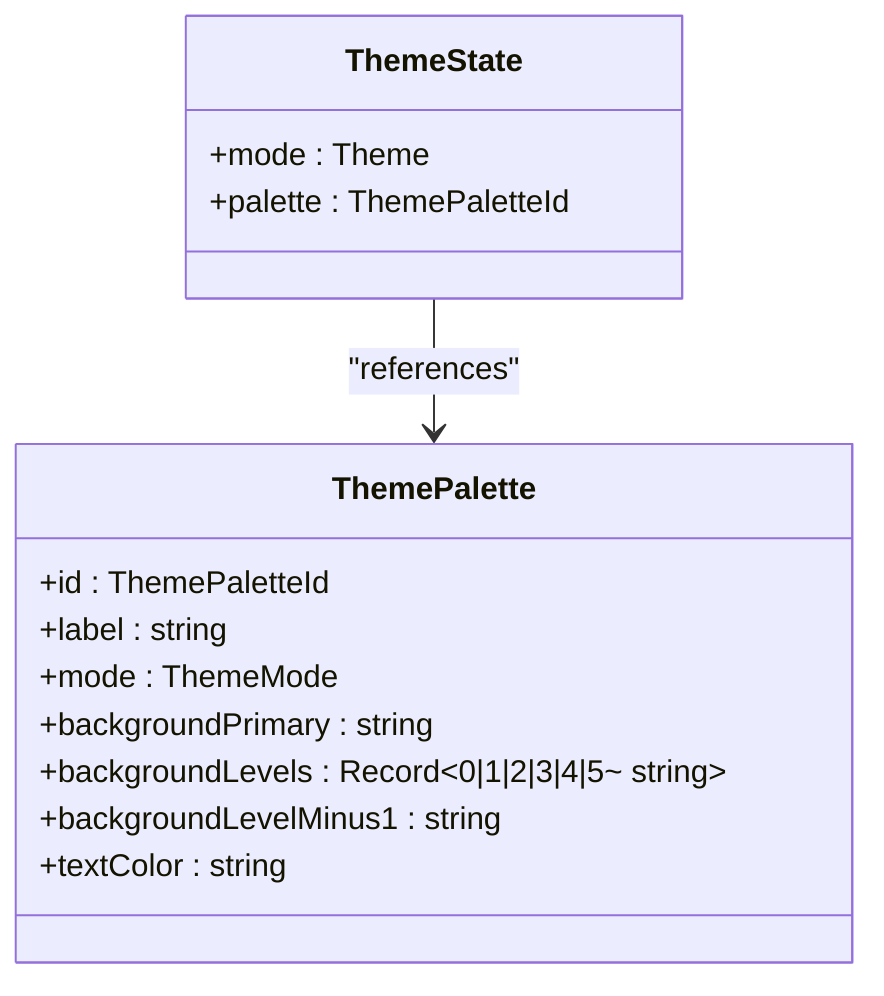
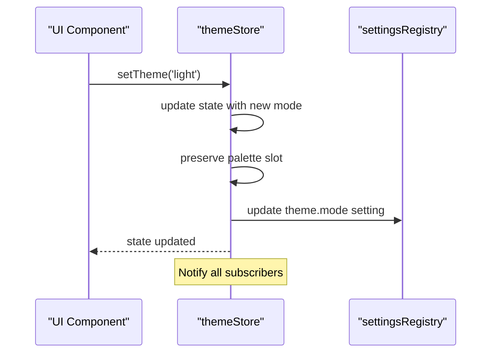
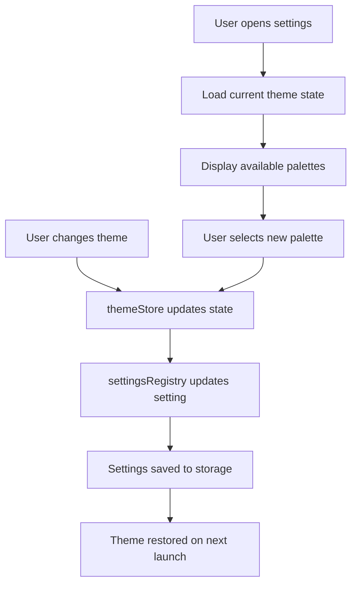
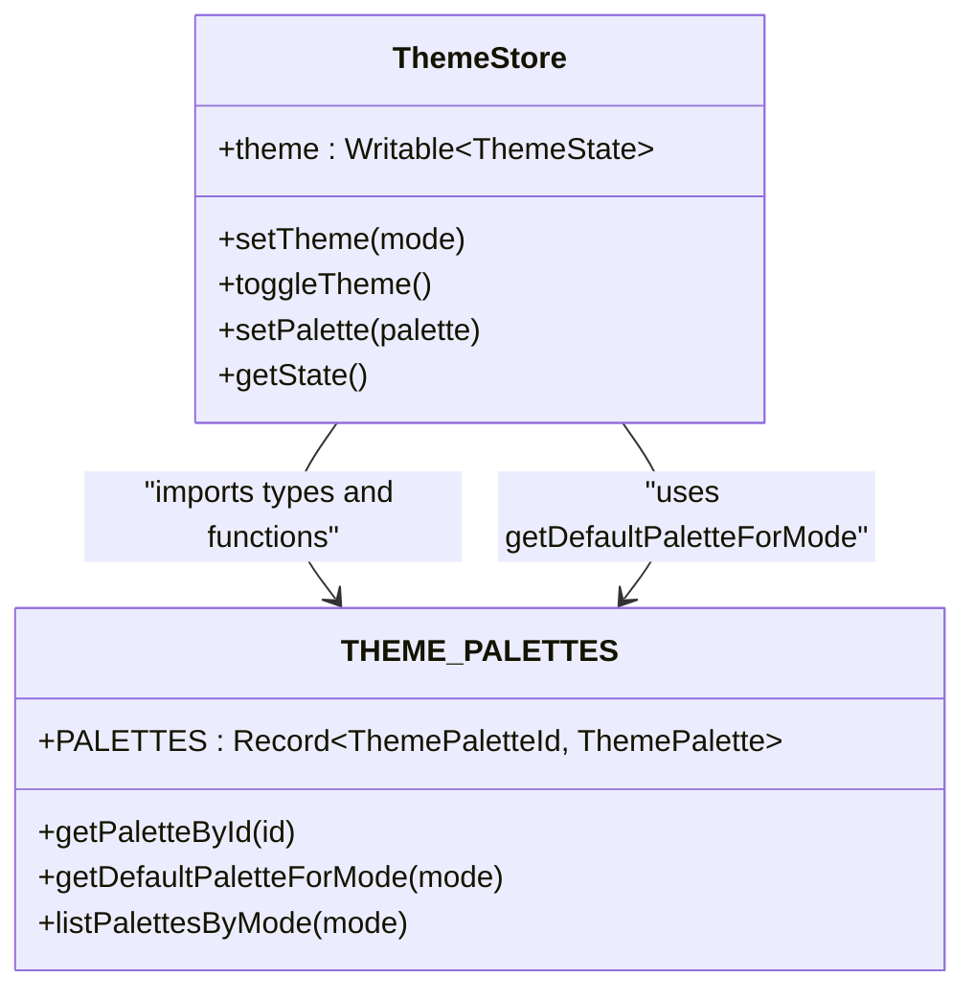
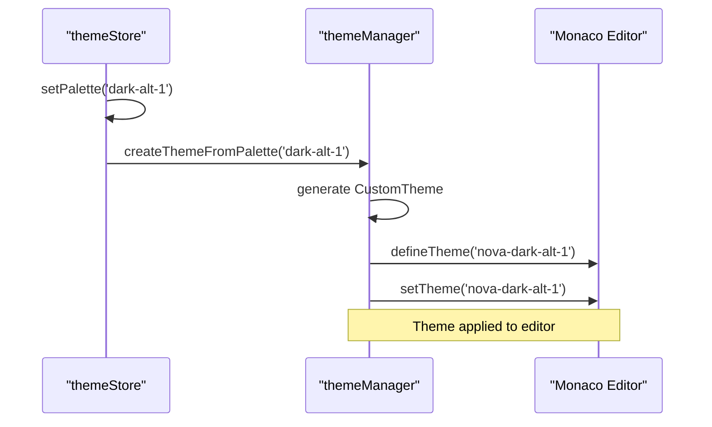
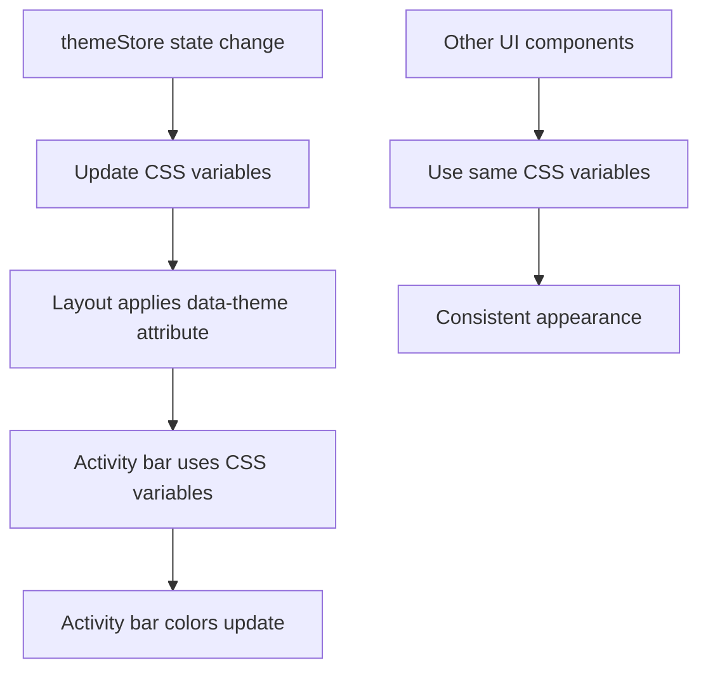
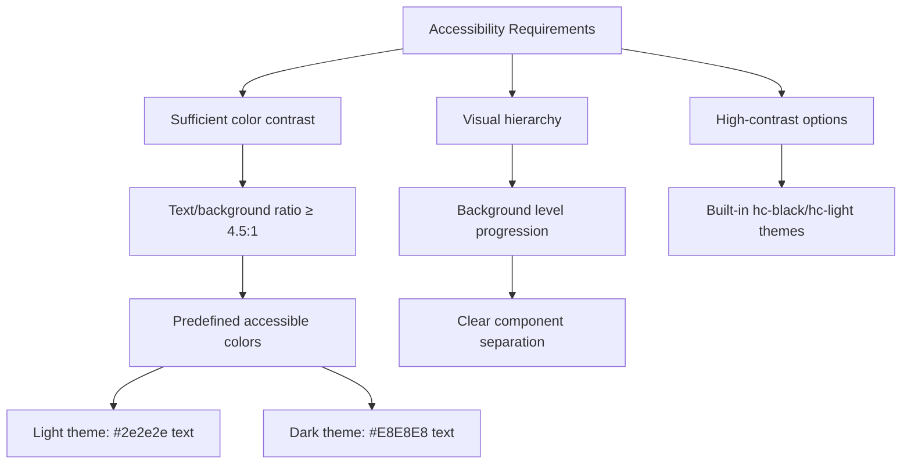
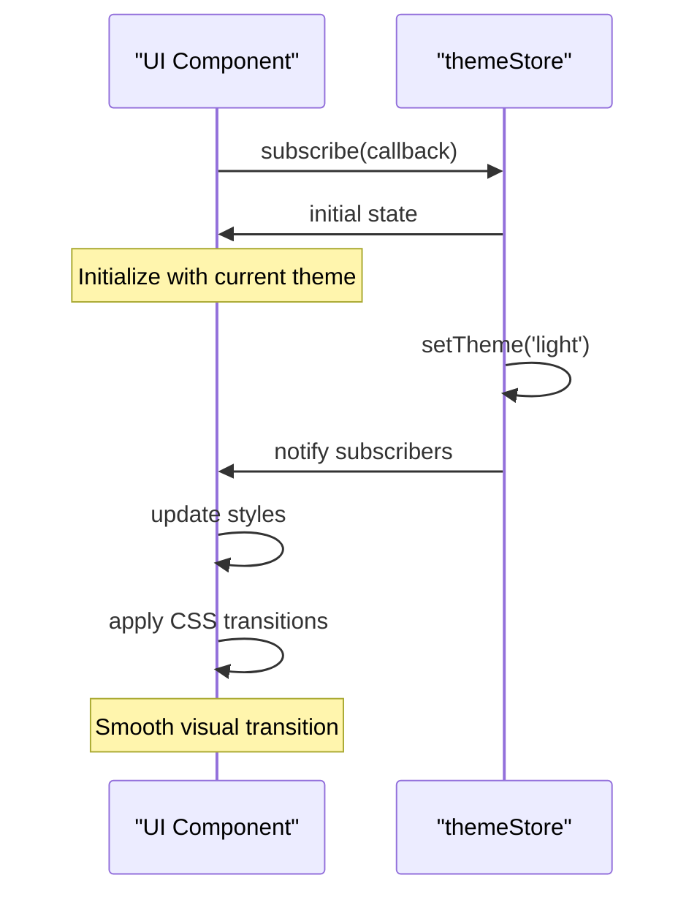

# Theme Store

<cite>
**Referenced Files in This Document**   
- [themeStore.ts](file://src/lib/stores/themeStore.ts)
- [THEME_PALETTES.ts](file://src/lib/stores/THEME_PALETTES.ts)
- [themeManager.ts](file://src/lib/editor/themeManager.ts)
- [settingsStore.ts](file://src/lib/stores/settingsStore.ts)
- [registry.ts](file://src/lib/settings/registry.ts)
- [editorSettingsStore.ts](file://src/lib/stores/editorSettingsStore.ts)
- [activityStore.ts](file://src/lib/stores/activityStore.ts)
- [THEME_QUICK_START.ts](file://src/lib/stores/THEME_QUICK_START.ts)
</cite>

## Table of Contents

1. [Introduction](#introduction)
2. [State Properties](#state-properties)
3. [Theme Change Methods](#theme-change-methods)
4. [Theme Persistence and Customization](#theme-persistence-and-customization)
5. [Integration with THEME_PALETTES](#integration-with-theme_palettes)
6. [Coordination with themeManager](#coordination-with-thememanager)
7. [Integration with activityStore](#integration-with-activitystore)
8. [Accessibility and Color Contrast](#accessibility-and-color-contrast)
9. [Creating Custom Themes](#creating-custom-themes)
10. [Theme Transitions and Subscriptions](#theme-transitions-and-subscriptions)

## Introduction

The themeStore is the central state management system for the Nova Code (NC) application's theming system. It serves as the single source of truth for all theme-related state, ensuring consistency across the entire application. The store manages the current theme mode (light/dark), color palette selection, and coordinates with various components to ensure a cohesive user experience. It integrates with the Monaco Editor through the themeManager, synchronizes with UI components via CSS variables, and maintains theme preferences across sessions. The system is designed to be reactive, allowing components to subscribe to theme changes and update accordingly.

**Section sources**

- [themeStore.ts](file://src/lib/stores/themeStore.ts#L1-L120)
- [THEME_QUICK_START.ts](file://src/lib/stores/THEME_QUICK_START.ts#L1-L135)

## State Properties

The themeStore maintains two primary state properties: the current theme mode and the selected color palette. The theme mode represents the overall light/dark variant of the application, while the color palette defines the specific color scheme within that mode. These properties are encapsulated in the ThemeState interface, which includes:

- **mode**: The current theme mode, either 'light' or 'dark', which serves as the source of truth for the UI shell's light/dark appearance.
- **palette**: The selected color palette identifier, which references one of the predefined ThemePaletteId values.

The initial state is set to 'dark' mode with the default dark palette. The store ensures that the palette always corresponds to a valid ThemePaletteId and that each mode has a default palette defined by the getDefaultPaletteForMode function. This state is reactive, allowing components to subscribe to changes and update their appearance accordingly.



**Diagram sources**

- [themeStore.ts](file://src/lib/stores/themeStore.ts#L24-L27)
- [THEME_PALETTES.ts](file://src/lib/stores/THEME_PALETTES.ts#L35-L54)

**Section sources**

- [themeStore.ts](file://src/lib/stores/themeStore.ts#L24-L27)
- [THEME_PALETTES.ts](file://src/lib/stores/THEME_PALETTES.ts#L21-L32)

## Theme Change Methods

The themeStore provides several methods for changing themes and managing theme preferences. These methods ensure that theme changes are handled consistently across the application:

- **setTheme(mode)**: Sets the theme mode to either 'light' or 'dark'. When changing modes, the system attempts to preserve the current palette "slot" (default, alt-1, alt-2, alt-3). For example, if the current palette is 'dark-alt-2', switching to light mode will select 'light-alt-2'.
- **toggleTheme()**: Toggles between dark and light modes while preserving the current palette slot.
- **setPalette(palette)**: Sets the color palette directly using a valid ThemePaletteId.

These methods update the store's state, which then propagates to all subscribed components. The store also provides a getState() method to retrieve the current theme state synchronously, which is useful for initializing components before subscriptions are established.



**Diagram sources**

- [themeStore.ts](file://src/lib/stores/themeStore.ts#L53-L87)
- [registry.ts](file://src/lib/settings/registry.ts#L140-L144)

**Section sources**

- [themeStore.ts](file://src/lib/stores/themeStore.ts#L53-L117)
- [THEME_QUICK_START.ts](file://src/lib/stores/THEME_QUICK_START.ts#L11-L25)

## Theme Persistence and Customization

The themeStore integrates with the application's settings system to ensure theme preferences persist across sessions. Theme settings are managed through the settingsRegistry, which maps theme-related settings to the themeStore's methods. The 'theme.mode' and 'theme.palette' settings are specifically handled by the themeStore, with their get and set operations directly connected to the store's state.

When a user changes the theme or palette, the change is automatically saved through the settings system. The settingsStore collects the current theme state as part of its snapshot, ensuring that theme preferences are included in the overall application settings. This integration allows users to reset all settings to their defaults, including theme preferences, through the settings interface.

The system also supports theme customization through the settings interface, where users can select from available palettes based on the current theme mode. The options for the 'theme.palette' setting are dynamically generated based on the current mode, ensuring that only relevant palettes are presented to the user.



**Diagram sources**

- [registry.ts](file://src/lib/settings/registry.ts#L133-L174)
- [settingsStore.ts](file://src/lib/stores/settingsStore.ts#L98-L99)

**Section sources**

- [registry.ts](file://src/lib/settings/registry.ts#L133-L174)
- [settingsStore.ts](file://src/lib/stores/settingsStore.ts#L95-L102)

## Integration with THEME_PALETTES

The themeStore works closely with the THEME_PALETTES module, which serves as the single source of truth for all color palettes in the application. The THEME_PALETTES module defines all available palettes, including their colors, labels, and modes. It provides utility functions for retrieving palettes by ID, getting the default palette for a mode, and listing all palettes for a specific mode.

The themeStore imports types and functions from THEME_PALETTES, including ThemeMode, ThemePaletteId, and getDefaultPaletteForMode. This tight integration ensures that the themeStore only works with valid palettes and modes. When the themeStore initializes, it uses getDefaultPaletteForMode to determine the initial palette based on the default mode.

The PALETTES constant in THEME_PALETTES contains all predefined palettes, with four options for each mode (light and dark). Each palette includes the primary background color, a hierarchy of background levels, and the text color. The module also includes utility functions for calculating background levels based on the primary color and mode, ensuring consistent color progression across different palettes.



**Diagram sources**

- [THEME_PALETTES.ts](file://src/lib/stores/THEME_PALETTES.ts#L75-L155)
- [themeStore.ts](file://src/lib/stores/themeStore.ts#L2-L6)

**Section sources**

- [THEME_PALETTES.ts](file://src/lib/stores/THEME_PALETTES.ts#L21-L314)
- [themeStore.ts](file://src/lib/stores/themeStore.ts#L2-L6)

## Coordination with themeManager

The themeStore coordinates with the themeManager to ensure consistent theming between the application UI and the Monaco Editor. The themeManager is responsible for managing editor themes, including built-in themes, custom themes, and themes derived from the application's color palettes.

The themeManager creates custom Monaco themes based on the application's current palette using the createThemeFromPalette method. This method generates a CustomTheme object with appropriate colors for editor elements like background, text, line highlighting, and selection. The generated theme ID follows the pattern 'nova-${palette}', linking it directly to the application's theme.

The editor settings include a 'theme' option that can be set to 'auto' (following the application theme) or a specific theme ID. When set to 'auto', the editor theme automatically updates when the application theme changes. The getMonacoThemeId function determines the appropriate Monaco theme ID based on the current theme state and editor settings.



**Diagram sources**

- [themeManager.ts](file://src/lib/editor/themeManager.ts#L187-L213)
- [themeManager.ts](file://src/lib/editor/themeManager.ts#L264-L273)

**Section sources**

- [themeManager.ts](file://src/lib/editor/themeManager.ts#L187-L213)
- [editorSettingsStore.ts](file://src/lib/stores/editorSettingsStore.ts#L36-L37)

## Integration with activityStore

The themeStore integrates with the activityStore to ensure that UI elements like the activity bar update their colors in response to theme changes. While the activityStore itself doesn't directly handle theme state, it works in conjunction with the theme system through shared CSS variables and theme-aware components.

When the theme changes, the updated color variables propagate to all components, including those in the activity bar. The activity bar and other UI elements use CSS variables defined by the current theme, such as --nc-level-0 for background and --nc-palette-text for text color. This ensures that all UI components, including those managed by the activityStore, automatically reflect the current theme.

The integration is achieved through the application's layout system, which applies the appropriate CSS classes and variables based on the current theme mode. Components that need to respond to theme changes can subscribe to the themeStore and update their appearance accordingly, ensuring a consistent look and feel across the entire application.



**Diagram sources**

- [THEME_QUICK_START.ts](file://src/lib/stores/THEME_QUICK_START.ts#L87-L102)
- [activityStore.ts](file://src/lib/stores/activityStore.ts#L1-L19)

**Section sources**

- [THEME_QUICK_START.ts](file://src/lib/stores/THEME_QUICK_START.ts#L87-L114)
- [activityStore.ts](file://src/lib/stores/activityStore.ts#L1-L19)

## Accessibility and Color Contrast

The theme system incorporates accessibility considerations to ensure adequate color contrast for users with visual impairments. The predefined palettes in THEME_PALETTES are designed with accessibility in mind, using colors that meet contrast ratio requirements for text readability.

Each palette includes a carefully selected text color that provides sufficient contrast against the background colors. For light themes, the text color is a dark gray (#2e2e2e), while dark themes use a light gray (#E8E8E8). These colors are chosen to ensure readability while avoiding the harshness of pure black or white.

The background level system also contributes to accessibility by providing a clear visual hierarchy. The progression of background colors (lighter for dark themes, darker for light themes) creates distinct visual layers that help users navigate the interface. The system uses calculated color adjustments to maintain consistent contrast ratios across different levels.

The theme system also supports high-contrast modes through the built-in Monaco themes (hc-black, hc-light), which can be selected independently of the application theme. This allows users to choose high-contrast editor themes while maintaining their preferred application theme.



**Diagram sources**

- [THEME_PALETTES.ts](file://src/lib/stores/THEME_PALETTES.ts#L60-L68)
- [themeManager.ts](file://src/lib/editor/themeManager.ts#L24-L29)

**Section sources**

- [THEME_PALETTES.ts](file://src/lib/stores/THEME_PALETTES.ts#L60-L68)
- [themeManager.ts](file://src/lib/editor/themeManager.ts#L24-L29)

## Creating Custom Themes

While the theme system primarily works with predefined palettes, it supports custom theme creation through the themeManager. Users can register custom themes by providing a JSON definition that follows the CustomTheme interface. This interface includes properties for the theme name, base theme, inheritance, token rules, and color mappings.

The themeManager provides methods for registering, applying, exporting, and removing custom themes. When a custom theme is registered, it is assigned a unique ID and made available in the editor's theme selection. Custom themes can be based on any of the built-in Monaco themes (vs, vs-dark, hc-black, hc-light) and can inherit from them or define their own appearance.

The system also loads popular themes from the monaco-themes library, including Monokai, Dracula, Nord, and others. These themes are loaded asynchronously in the background, ensuring they don't block editor initialization. Users can select these popular themes directly or use them as a starting point for creating custom themes.

```mermaid
classDiagram
class CustomTheme {
+name : string
+base : 'vs' | 'vs-dark' | 'hc-black' | 'hc-light'
+inherit : boolean
+rules : {token, foreground?, background?, fontStyle?}[]
+colors : Record~string, string~
}
class ThemeManager {
+registerCustomTheme(themeJson)
+applyTheme(themeId)
+exportTheme(themeId)
+removeCustomTheme(themeId)
+loadPopularThemes()
}
ThemeManager --> CustomTheme : "creates from JSON"
ThemeManager --> CustomTheme : "applies to editor"
```

**Diagram sources**

- [themeManager.ts](file://src/lib/editor/themeManager.ts#L8-L19)
- [themeManager.ts](file://src/lib/editor/themeManager.ts#L78-L110)

**Section sources**

- [themeManager.ts](file://src/lib/editor/themeManager.ts#L8-L19)
- [themeManager.ts](file://src/lib/editor/themeManager.ts#L225-L253)

## Theme Transitions and Subscriptions

The themeStore provides a reactive interface for components to subscribe to theme changes and implement smooth transitions. Components can subscribe to the theme store using the standard Svelte store subscription pattern, receiving updates whenever the theme or palette changes.

The subscription mechanism allows components to update their appearance in response to theme changes, either through direct style updates or by applying CSS classes. The store maintains a current state reference that can be accessed synchronously through getState(), which is useful for initializing components before subscriptions are established.

For theme transitions, components can implement CSS transitions on the relevant properties to create smooth visual changes. The application uses CSS variables for theme colors, allowing transitions to be defined in CSS. When the theme changes, the updated CSS variables trigger the defined transitions, creating a cohesive visual effect across the interface.



**Diagram sources**

- [themeStore.ts](file://src/lib/stores/themeStore.ts#L111-L117)
- [THEME_QUICK_START.ts](file://src/lib/stores/THEME_QUICK_START.ts#L21-L25)

**Section sources**

- [themeStore.ts](file://src/lib/stores/themeStore.ts#L106-L117)
- [THEME_QUICK_START.ts](file://src/lib/stores/THEME_QUICK_START.ts#L21-L25)
