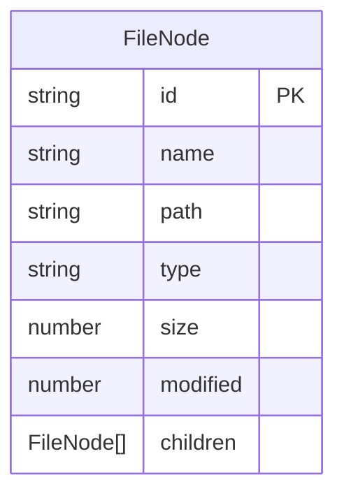
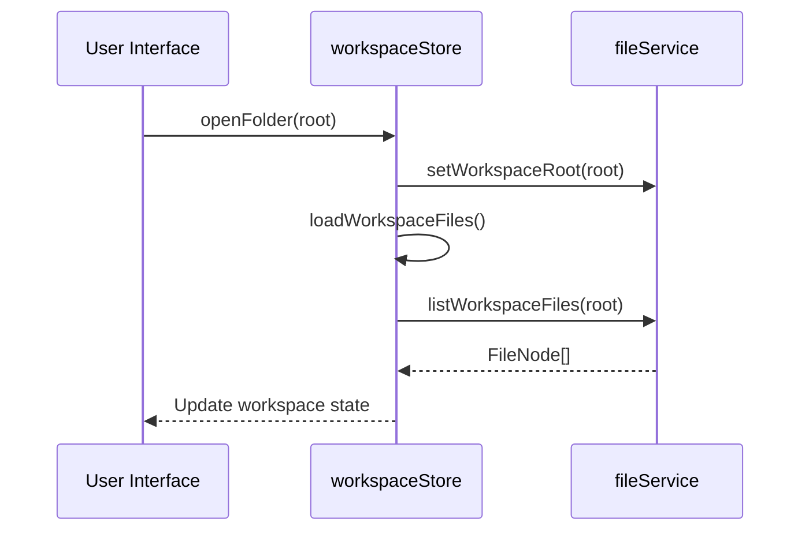
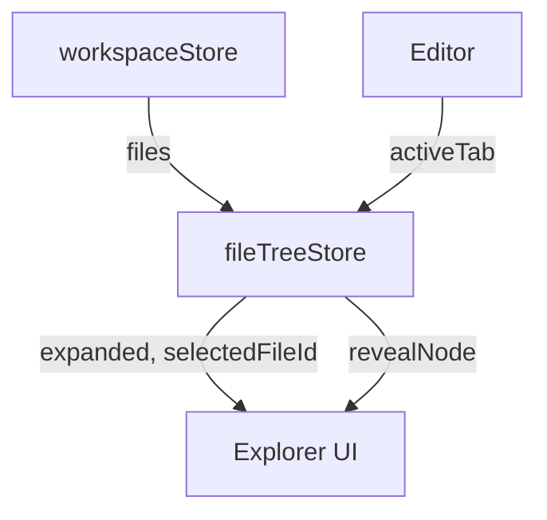

# Workspace Store

<cite>
**Referenced Files in This Document**   
- [workspaceStore.ts](file://src/lib/stores/workspaceStore.ts)
- [fileService.ts](file://src/lib/services/fileService.ts)
- [fileTreeStore.ts](file://src/lib/stores/fileTreeStore.ts)
- [fileNode.ts](file://src/lib/types/fileNode.ts)
- [lib.rs](file://src-tauri/src/lib.rs)
- [fileValidator.ts](file://src/lib/utils/fileValidator.ts)
</cite>

## Table of Contents
1. [Introduction](#introduction)
2. [State Properties](#state-properties)
3. [Workspace Management Methods](#workspace-management-methods)
4. [Integration with fileService](#integration-with-fileservice)
5. [Synchronization with fileTreeStore](#synchronization-with-filetreestore)
6. [Workspace Events Handling](#workspace-events-handling)
7. [Persistence and Recent Workspaces](#persistence-and-recent-workspaces)
8. [Validation and Error Handling](#validation-and-error-handling)
9. [Performance Considerations](#performance-considerations)

## Introduction
The workspaceStore is a central component in NC that manages the current workspace state, providing a reactive interface for the application to interact with the file system. It maintains the workspace's root path, project configuration, metadata, and directory structure, serving as the single source of truth for workspace-related operations. The store coordinates with various services and stores to ensure consistent state across the application, particularly with the file explorer UI and editor components.

**Section sources**
- [workspaceStore.ts](file://src/lib/stores/workspaceStore.ts#L1-L130)

## State Properties
The workspaceStore maintains several key state properties that represent the current workspace:

- **name**: The display name of the workspace, derived from the root path
- **files**: The array of FileNode objects representing the directory structure
- **loading**: A boolean flag indicating whether the workspace is currently being loaded
- **error**: An optional string containing error information if workspace loading fails
- **root**: The root path of the current workspace, or null if no workspace is open

The FileNode interface defines the structure of files and directories in the workspace with properties including id, name, path, type (file or dir), size, modified timestamp, and children (for directories).

**Diagram sources**
- [fileNode.ts](file://src/lib/types/fileNode.ts#L8-L18)
- [workspaceStore.ts](file://src/lib/stores/workspaceStore.ts#L11-L17)

## Workspace Management Methods
The workspaceStore provides several methods for managing workspaces:

### Opening Workspaces
The `openFolder` method initializes a new workspace by setting the root path and loading its contents:
- Sets the current root path
- Updates the fileService with the new workspace root
- Triggers loading of workspace files

### Closing Workspaces
The `closeFolder` method closes the current workspace:
- Clears the current root reference
- Updates the store state to reflect no open workspace

### Switching Workspaces
Switching between workspaces is accomplished by calling `openFolder` with the new workspace path, which automatically handles the transition from the current workspace.

### Utility Methods
Additional utility methods include:
- `getWorkspaceRoot`: Returns the current workspace root path
- `resolvePath`: Converts a relative path to an absolute path within the current workspace
- `refresh`: Reloads the workspace files from the file system

**Diagram sources**
- [workspaceStore.ts](file://src/lib/stores/workspaceStore.ts#L99-L116)
- [fileService.ts](file://src/lib/services/fileService.ts#L39-L42)

## Integration with fileService
The workspaceStore integrates closely with the fileService to load and manage workspace contents:

### Loading Workspace Contents
When a workspace is opened or refreshed, the workspaceStore uses fileService.listWorkspaceFiles to retrieve the directory structure:
- The fileService makes a Tauri invoke call to the 'read_workspace' command
- The backend processes the request and returns a structured representation of the file system
- The workspaceStore updates its state with the retrieved FileNode array

### File System Watching
The workspaceStore establishes a file system watcher to detect changes:
- Calls fileService.startFileWatcher to initiate watching
- Subscribes to file change events via fileService.onFileChange
- Automatically refreshes the workspace when file changes are detected

### Path Resolution
The resolvePath method normalizes path separators and constructs absolute paths from relative paths within the current workspace context.

**Section sources**
- [workspaceStore.ts](file://src/lib/stores/workspaceStore.ts#L37-L72)
- [fileService.ts](file://src/lib/services/fileService.ts#L30-L84)

## Synchronization with fileTreeStore
The workspaceStore maintains synchronization with the fileTreeStore to ensure the file explorer UI reflects the current workspace state:

### State Flow
The data flow between stores follows a unidirectional pattern:
- workspaceStore maintains the authoritative file structure
- fileTreeStore subscribes to workspaceStore for file updates
- fileTreeStore manages UI-specific state like expanded directories and selected files

### Change Propagation
When the workspace changes:
- workspaceStore updates its files array
- fileTreeStore receives the update through subscription
- fileTreeStore adjusts its internal state (expanded directories, selected file)
- The explorer UI re-renders to reflect changes

### Active Editor Synchronization
The fileTreeStore synchronizes with the active editor tab:
- When a new editor tab becomes active, fileTreeStore selects the corresponding file
- Parent directories are automatically expanded to reveal the selected file
- This creates a cohesive user experience between the editor and file explorer

**Diagram sources**
- [workspaceStore.ts](file://src/lib/stores/workspaceStore.ts#L119-L129)
- [fileTreeStore.ts](file://src/lib/stores/fileTreeStore.ts#L101-L107)
- [fileTreeStore.ts](file://src/lib/stores/fileTreeStore.ts#L218-L264)

## Workspace Events Handling
The workspaceStore handles various workspace-related events to maintain consistent application state:

### Workspace Changes
When a workspace is opened, closed, or switched:
- The loading state is set to true during the transition
- The file structure is loaded from the file system
- The store state is updated with the new workspace data
- Subscribers are notified of the state change

### File System Updates
The store responds to file system changes through event listeners:
- File creation, deletion, renaming, and modification events trigger workspace refresh
- The file watcher detects changes and notifies the workspaceStore
- The entire workspace structure is reloaded to ensure consistency

### Workspace Settings Modifications
While the workspaceStore itself doesn't manage settings, it responds to workspace-level configuration changes:
- When workspace root changes, the fileService is updated accordingly
- Path resolution adapts to the current workspace context
- Error states are handled gracefully when workspace access is denied

**Section sources**
- [workspaceStore.ts](file://src/lib/stores/workspaceStore.ts#L74-L94)
- [lib.rs](file://src-tauri/src/lib.rs#L400-L424)

## Persistence and Recent Workspaces
The workspace state management includes mechanisms for persistence and tracking recent workspaces:

### Initial State
On application startup, the workspaceStore initializes with:
- The last known workspace root from fileService
- A default root of '.' if no previous workspace exists
- Immediate loading of the workspace files

### Workspace Persistence
While the current implementation doesn't explicitly track multiple recent workspaces, the architecture supports persistence through:
- The fileService maintaining the current workspace root
- The ability to reopen the last workspace on application restart
- Potential extension to maintain a history of recently opened workspaces

### State Initialization
The store initializes its state by:
- Retrieving the current workspace root from fileService
- Deriving the workspace name from the root path
- Setting initial loading state to true
- Immediately triggering workspace file loading

**Section sources**
- [workspaceStore.ts](file://src/lib/stores/workspaceStore.ts#L28-L35)
- [fileService.ts](file://src/lib/services/fileService.ts#L12-L13)

## Validation and Error Handling
The workspaceStore implements robust validation and error handling mechanisms:

### Workspace Validation
Before opening a workspace, validation occurs through:
- Path accessibility checks in the fileService backend
- Directory existence verification
- Permission validation for reading directory contents

### Error Handling
When workspace operations fail:
- The store captures error information and updates the error state property
- The loading state is set to false to prevent indefinite loading
- Empty file arrays are set to provide a clean state
- User-facing error messages are preserved for display

### Inaccessible Workspaces
For workspaces that cannot be accessed:
- The store gracefully handles file system permission errors
- Network drive disconnections are managed through retry mechanisms
- Invalid paths are rejected before attempting file operations

**Section sources**
- [workspaceStore.ts](file://src/lib/stores/workspaceStore.ts#L63-L71)
- [lib.rs](file://src-tauri/src/lib.rs#L225-L227)
- [fileValidator.ts](file://src/lib/utils/fileValidator.ts#L15-L87)

## Performance Considerations
The workspaceStore addresses performance challenges when handling large directory structures:

### Large Directory Loading
For workspaces with extensive file hierarchies:
- The store sets a loading flag to provide UI feedback
- The fileService implements efficient directory traversal
- Results are sorted and structured before returning to the store

### Change Detection Optimization
The file watching mechanism is optimized to:
- Batch file system change events
- Debounce rapid successive changes
- Minimize unnecessary workspace reloads

### Memory Management
The store architecture considers memory usage by:
- Maintaining a single source of truth for file structure
- Using Svelte's reactive system for efficient updates
- Avoiding duplication of file data across stores

### Scalability
The implementation supports scalability through:
- Asynchronous file operations that don't block the UI
- Error boundaries that prevent application crashes
- Progressive loading patterns that could be implemented

**Section sources**
- [workspaceStore.ts](file://src/lib/stores/workspaceStore.ts#L37-L72)
- [lib.rs](file://src-tauri/src/lib.rs#L167-L246)
- [fileValidator.ts](file://src/lib/utils/fileValidator.ts#L54-L84)