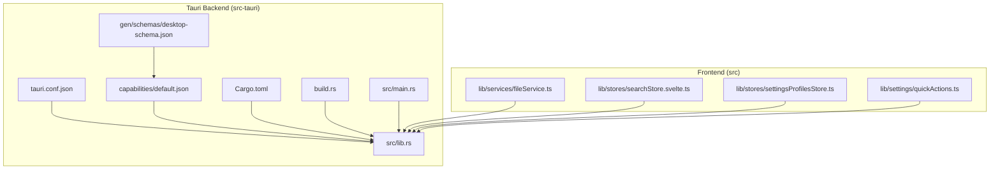
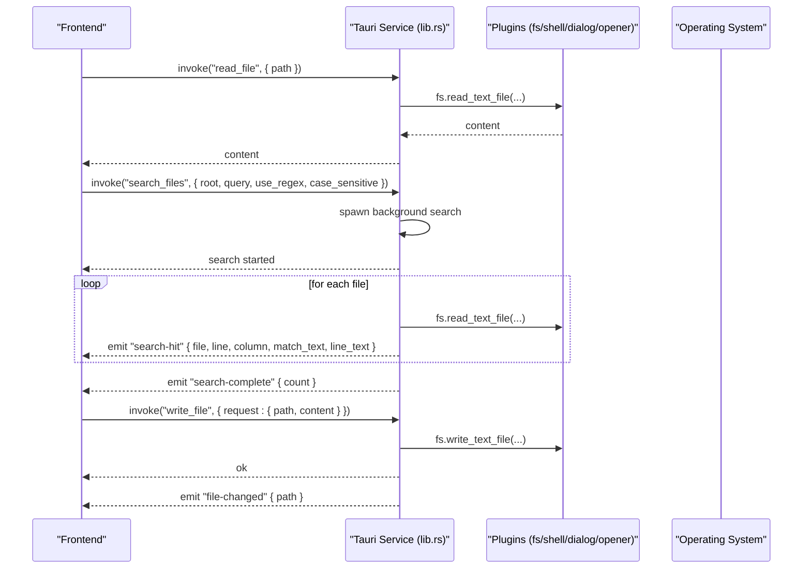
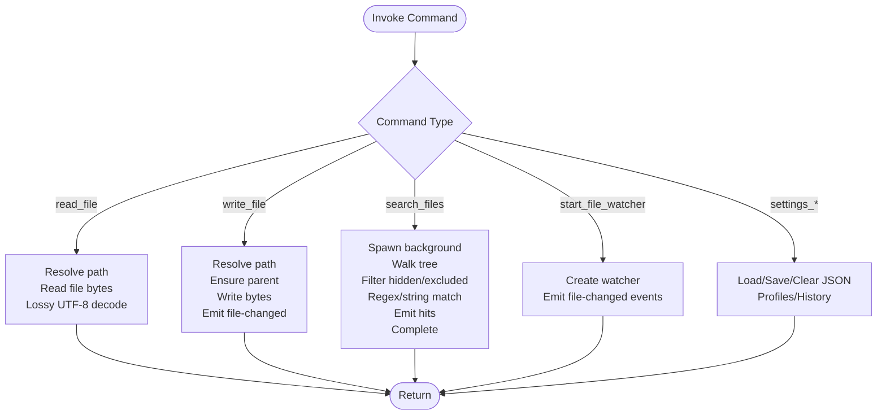
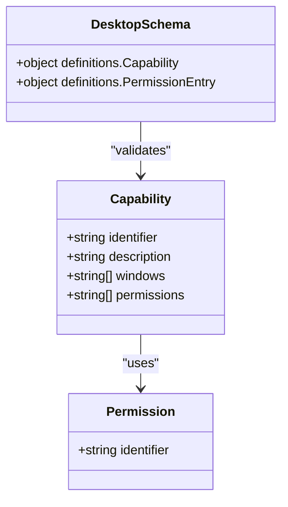
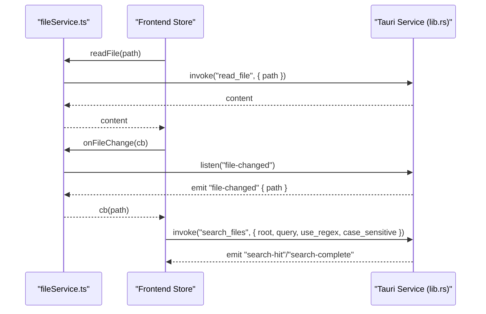
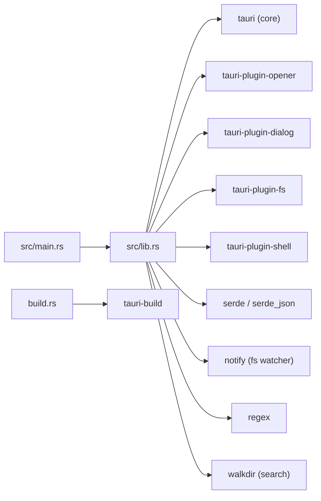

# Backend Architecture

<cite>
**Referenced Files in This Document**
- [Cargo.toml](file://src-tauri/Cargo.toml)
- [tauri.conf.json](file://src-tauri/tauri.conf.json)
- [default.json](file://src-tauri/capabilities/default.json)
- [desktop-schema.json](file://src-tauri/gen/schemas/desktop-schema.json)
- [lib.rs](file://src-tauri/src/lib.rs)
- [main.rs](file://src-tauri/src/main.rs)
- [build.rs](file://src-tauri/build.rs)
- [fileService.ts](file://src/lib/services/fileService.ts)
- [searchStore.svelte.ts](file://src/lib/stores/searchStore.svelte.ts)
- [settingsProfilesStore.ts](file://src/lib/stores/settingsProfilesStore.ts)
- [quickActions.ts](file://src/lib/settings/quickActions.ts)
</cite>

## Table of Contents
1. [Introduction](#introduction)
2. [Project Structure](#project-structure)
3. [Core Components](#core-components)
4. [Architecture Overview](#architecture-overview)
5. [Detailed Component Analysis](#detailed-component-analysis)
6. [Dependency Analysis](#dependency-analysis)
7. [Performance Considerations](#performance-considerations)
8. [Security Considerations](#security-considerations)
9. [Troubleshooting Guide](#troubleshooting-guide)
10. [Conclusion](#conclusion)

## Introduction
This document describes the backend architecture of the NC code editor’s Rust-based Tauri v2 application. It explains how the backend exposes a command surface for file operations, process management, and system integration, and how the frontend communicates with it using Tauri’s invoke/listen IPC. It also documents the capability-based security model, build/runtime configuration, and the technical rationale for Rust and Tauri choices.

## Project Structure
The backend lives under src-tauri and is composed of:
- Build and runtime configuration
- Capability definitions for permissions
- The Rust library that registers Tauri commands and plugins
- A minimal main entry that delegates to the library

**Diagram sources**
- [tauri.conf.json](file://src-tauri/tauri.conf.json#L1-L44)
- [default.json](file://src-tauri/capabilities/default.json#L1-L18)
- [desktop-schema.json](file://src-tauri/gen/schemas/desktop-schema.json#L1-L200)
- [Cargo.toml](file://src-tauri/Cargo.toml#L1-L33)
- [build.rs](file://src-tauri/build.rs#L1-L3)
- [lib.rs](file://src-tauri/src/lib.rs#L764-L796)
- [main.rs](file://src-tauri/src/main.rs#L1-L7)
- [fileService.ts](file://src/lib/services/fileService.ts#L1-L85)
- [searchStore.svelte.ts](file://src/lib/stores/searchStore.svelte.ts#L232-L278)
- [settingsProfilesStore.ts](file://src/lib/stores/settingsProfilesStore.ts#L150-L171)
- [quickActions.ts](file://src/lib/settings/quickActions.ts#L48-L63)

**Section sources**
- [tauri.conf.json](file://src-tauri/tauri.conf.json#L1-L44)
- [Cargo.toml](file://src-tauri/Cargo.toml#L1-L33)
- [lib.rs](file://src-tauri/src/lib.rs#L764-L796)
- [main.rs](file://src-tauri/src/main.rs#L1-L7)

## Core Components
- Tauri command handlers: file operations, workspace listing, watchers, search, and settings persistence/import/export.
- Plugins: opener, dialog, fs, shell.
- Capability-based permissions: restricted access to commands and system resources.
- Frontend service layer: typed wrappers around Tauri invoke/listen.

Key backend command categories:
- File operations: read, write, create, rename, delete, reveal in explorer.
- Workspace navigation: list files and directories with depth limits.
- File watching: filesystem events emitted to the frontend.
- Project-wide search: regex/string search with cancellation and result limits.
- Settings: profiles/history persistence and export/import.

**Section sources**
- [lib.rs](file://src-tauri/src/lib.rs#L248-L364)
- [lib.rs](file://src-tauri/src/lib.rs#L366-L388)
- [lib.rs](file://src-tauri/src/lib.rs#L390-L425)
- [lib.rs](file://src-tauri/src/lib.rs#L449-L644)
- [lib.rs](file://src-tauri/src/lib.rs#L646-L763)
- [Cargo.toml](file://src-tauri/Cargo.toml#L20-L33)

## Architecture Overview
The backend uses Tauri v2 to expose Rust-implemented commands to the SvelteKit frontend. The frontend invokes commands and listens to events via @tauri-apps/api. The capability system enforces permissions per window.

**Diagram sources**
- [fileService.ts](file://src/lib/services/fileService.ts#L30-L85)
- [lib.rs](file://src-tauri/src/lib.rs#L266-L388)
- [lib.rs](file://src-tauri/src/lib.rs#L449-L644)

## Detailed Component Analysis

### Tauri Command System
- Command registration: the library constructs a Tauri Builder and registers all commands with generate_handler.
- Command categories:
  - File operations: read, write, create, rename, delete, reveal in explorer.
  - Workspace: list files/directories with depth limit and safe metadata.
  - File watcher: start a recursive watcher and emit events to the frontend.
  - Search: regex/string search with cancellation, result caps, and binary-file filtering.
  - Settings: profiles/history persistence and export/import.

**Diagram sources**
- [lib.rs](file://src-tauri/src/lib.rs#L266-L388)
- [lib.rs](file://src-tauri/src/lib.rs#L390-L425)
- [lib.rs](file://src-tauri/src/lib.rs#L449-L644)
- [lib.rs](file://src-tauri/src/lib.rs#L646-L763)

**Section sources**
- [lib.rs](file://src-tauri/src/lib.rs#L764-L796)
- [lib.rs](file://src-tauri/src/lib.rs#L248-L364)
- [lib.rs](file://src-tauri/src/lib.rs#L366-L388)
- [lib.rs](file://src-tauri/src/lib.rs#L390-L425)
- [lib.rs](file://src-tauri/src/lib.rs#L449-L644)
- [lib.rs](file://src-tauri/src/lib.rs#L646-L763)

### Capability-Based Security Model
- Capability definition: associates a window (main) with a set of permissions.
- Permissions include core window actions, opener, dialog open/save, and default core permissions.
- The desktop schema defines the capability format and permission identifiers.

**Diagram sources**
- [default.json](file://src-tauri/capabilities/default.json#L1-L18)
- [desktop-schema.json](file://src-tauri/gen/schemas/desktop-schema.json#L1-L200)

**Section sources**
- [default.json](file://src-tauri/capabilities/default.json#L1-L18)
- [desktop-schema.json](file://src-tauri/gen/schemas/desktop-schema.json#L1-L200)

### Frontend IPC Communication
- Frontend service wraps Tauri invoke and listen for file operations and watchers.
- Stores invoke search commands and listen for search events.
- Settings stores invoke settings commands and manage state.

**Diagram sources**
- [fileService.ts](file://src/lib/services/fileService.ts#L1-L85)
- [searchStore.svelte.ts](file://src/lib/stores/searchStore.svelte.ts#L232-L278)
- [lib.rs](file://src-tauri/src/lib.rs#L449-L644)

**Section sources**
- [fileService.ts](file://src/lib/services/fileService.ts#L1-L85)
- [searchStore.svelte.ts](file://src/lib/stores/searchStore.svelte.ts#L232-L278)
- [settingsProfilesStore.ts](file://src/lib/stores/settingsProfilesStore.ts#L150-L171)
- [quickActions.ts](file://src/lib/settings/quickActions.ts#L48-L63)

## Dependency Analysis
- Runtime dependencies include Tauri core, plugins (opener, dialog, fs, shell), serialization, filesystem watching, regex, and directory traversal.
- Build-time dependency tauri-build generates schema bindings and capabilities.
- The main entry delegates to the library run function.

**Diagram sources**
- [main.rs](file://src-tauri/src/main.rs#L1-L7)
- [lib.rs](file://src-tauri/src/lib.rs#L764-L796)
- [Cargo.toml](file://src-tauri/Cargo.toml#L1-L33)
- [build.rs](file://src-tauri/build.rs#L1-L3)

**Section sources**
- [Cargo.toml](file://src-tauri/Cargo.toml#L1-L33)
- [lib.rs](file://src-tauri/src/lib.rs#L764-L796)
- [build.rs](file://src-tauri/build.rs#L1-L3)

## Performance Considerations
- Background search runs off the main thread to avoid blocking the UI.
- Result limits and early termination improve responsiveness.
- Binary file filtering reduces unnecessary IO.
- Lossy UTF-8 decoding avoids crashes on non-text files.
- File watcher uses a single recursive watcher per app lifecycle.

[No sources needed since this section provides general guidance]

## Security Considerations
- Capability-based permissions: the main window is granted a limited set of permissions, reducing attack surface.
- Asset protocol scope: asset protocol is enabled with broad scope for local assets.
- Plugin permissions: opener, dialog, fs, and shell are included; ensure only necessary permissions are granted.
- Sandboxing: Tauri v2 provides a hardened webview; combine with capability restrictions.
- Privilege separation: keep sensitive operations isolated and minimize exposed commands.
- Secure IPC: use typed payloads and validate inputs on the backend.

**Section sources**
- [default.json](file://src-tauri/capabilities/default.json#L1-L18)
- [tauri.conf.json](file://src-tauri/tauri.conf.json#L23-L31)
- [Cargo.toml](file://src-tauri/Cargo.toml#L20-L33)

## Troubleshooting Guide
- Command invocation failures: inspect thrown errors from command handlers (e.g., path resolution, IO errors).
- Search errors: invalid regex emits a dedicated event; cancellation stops long-running scans.
- File watcher not emitting events: ensure watcher is started and the current directory is watched.
- Settings persistence: verify JSON serialization/deserialization and file existence.

**Section sources**
- [lib.rs](file://src-tauri/src/lib.rs#L266-L388)
- [lib.rs](file://src-tauri/src/lib.rs#L449-L644)
- [lib.rs](file://src-tauri/src/lib.rs#L646-L763)

## Conclusion
The backend leverages Tauri v2 to deliver a secure, performant native layer for file operations, search, watchers, and settings management. The capability system enforces least-privilege access, while the frontend interacts via typed invoke/listen calls. Rust ensures memory safety and performance, and Tauri’s security-first design provides a strong foundation for system integration.