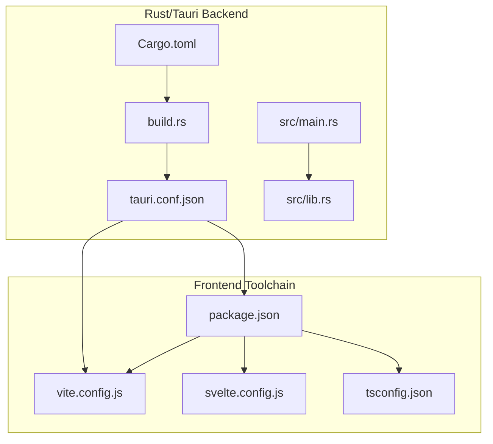
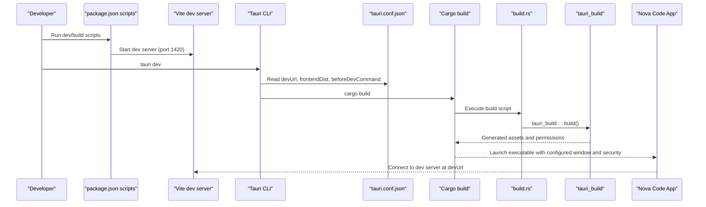
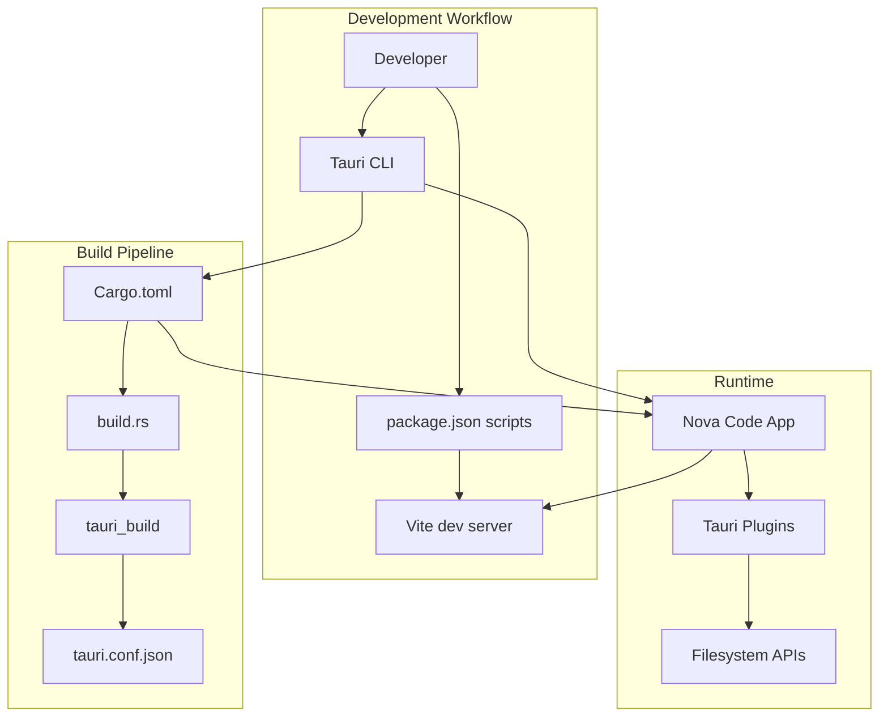
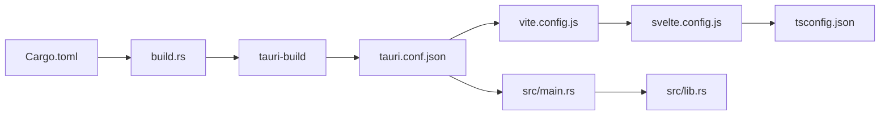

# Configuration Management

<cite>
**Referenced Files in This Document**
- [Cargo.toml](file://src-tauri\Cargo.toml)
- [tauri.conf.json](file://src-tauri\tauri.conf.json) - *Updated window configuration*
- [build.rs](file://src-tauri\build.rs)
- [main.rs](file://src-tauri\src\main.rs)
- [lib.rs](file://src-tauri\src\lib.rs)
- [package.json](file://package.json)
- [vite.config.js](file://vite.config.js)
- [svelte.config.js](file://svelte.config.js)
- [tsconfig.json](file://tsconfig.json)
</cite>

## Update Summary

**Changes Made**

- Updated window configuration section with new default dimensions (1280x720) and transparent window settings
- Added detailed explanation of transparent window implementation and borderless appearance
- Enhanced practical examples with new window configuration values
- Updated architecture diagrams to reflect modern window appearance
- Added best practices for transparent window implementation

## Table of Contents

1. [Introduction](#introduction)
2. [Project Structure](#project-structure)
3. [Core Components](#core-components)
4. [Architecture Overview](#architecture-overview)
5. [Detailed Component Analysis](#detailed-component-analysis)
6. [Dependency Analysis](#dependency-analysis)
7. [Performance Considerations](#performance-considerations)
8. [Troubleshooting Guide](#troubleshooting-guide)
9. [Conclusion](#conclusion)
10. [Appendices](#appendices)

## Introduction

This document explains the configuration management system for the NC code editor, focusing on how Rust/Tauri build configuration, application configuration, and frontend tooling integrate to deliver a cohesive development and packaging workflow. It covers:

- Build configuration in Cargo.toml (package metadata, crate types, build/runtime dependencies)
- Application configuration in tauri.conf.json (product metadata, build commands, dev URL, frontend distribution path, window/security/bundling settings)
- The role of build.rs and its integration with tauri-build
- Practical examples of how configuration affects behavior and the build process
- Relationship between configuration files and the development workflow
- Common configuration issues and best practices

## Project Structure

The configuration system spans two primary areas:

- Rust/Tauri backend under src-tauri, including Cargo.toml, tauri.conf.json, build.rs, and Rust source files
- Frontend toolchain under the repository root, including package.json, vite.config.js, svelte.config.js, and tsconfig.json

**Diagram sources**

- [Cargo.toml](file://src-tauri\Cargo.toml#L1-L33)
- [tauri.conf.json](file://src-tauri\tauri.conf.json#L1-L44) - _Updated window configuration_
- [build.rs](file://src-tauri\build.rs#L1-L3)
- [main.rs](file://src-tauri\src\main.rs#L1-L7)
- [lib.rs](file://src-tauri\src\lib.rs#L764-L796)
- [package.json](file://package.json#L1-L41)
- [vite.config.js](file://vite.config.js#L1-L34)
- [svelte.config.js](file://svelte.config.js#L1-L19)
- [tsconfig.json](file://tsconfig.json#L1-L20)

**Section sources**

- [Cargo.toml](file://src-tauri\Cargo.toml#L1-L33)
- [tauri.conf.json](file://src-tauri\tauri.conf.json#L1-L44) - _Updated window configuration_
- [build.rs](file://src-tauri\build.rs#L1-L3)
- [main.rs](file://src-tauri\src\main.rs#L1-L7)
- [lib.rs](file://src-tauri\src\lib.rs#L764-L796)
- [package.json](file://package.json#L1-L41)
- [vite.config.js](file://vite.config.js#L1-L34)
- [svelte.config.js](file://svelte.config.js#L1-L19)
- [tsconfig.json](file://tsconfig.json#L1-L20)

## Core Components

- Cargo.toml defines the Rust package, library crate types, and dependencies. It also declares a build script dependency on tauri-build.
- tauri.conf.json defines product metadata, build commands, dev URL, frontend distribution path, window configuration, security settings, and bundling options. The window configuration has been updated with enhanced user experience settings, including increased default window size from 800x600 to 1280x720 pixels and addition of transparent window option for modern borderless appearance.
- build.rs is a minimal build script that invokes tauri_build::build, integrating Tauri's code generation and asset embedding into the Rust build pipeline.
- package.json orchestrates frontend scripts and dependencies, including the Tauri CLI and SvelteKit adapter.
- vite.config.js configures Vite for Tauri development, fixing the dev port and HMR settings.
- svelte.config.js sets up adapter-static for SPA-like behavior.
- tsconfig.json extends SvelteKit's tsconfig and enables strict TypeScript settings.

Practical examples:

- Changing the frontendDist path in tauri.conf.json directly affects where Tauri looks for built assets during development and production.
- Adjusting the devUrl in tauri.conf.json ensures Vite and Tauri agree on the development server address.
- Modifying window width/height/decorations/transparency in tauri.conf.json changes the initial window appearance, with the new default size of 1280x720 providing better usability for code editing.
- Enabling assetProtocol in tauri.conf.json allows controlled loading of frontend assets from the bundled distribution.

**Section sources**

- [Cargo.toml](file://src-tauri\Cargo.toml#L1-L33)
- [tauri.conf.json](file://src-tauri\tauri.conf.json#L1-L44) - _Updated window configuration_
- [build.rs](file://src-tauri\build.rs#L1-L3)
- [package.json](file://package.json#L1-L41)
- [vite.config.js](file://vite.config.js#L1-L34)
- [svelte.config.js](file://svelte.config.js#L1-L19)
- [tsconfig.json](file://tsconfig.json#L1-L20)

## Architecture Overview

The configuration system coordinates frontend and backend builds and runtime behavior:

**Diagram sources**

- [tauri.conf.json](file://src-tauri\tauri.conf.json#L1-L44) - _Updated window configuration_
- [build.rs](file://src-tauri\build.rs#L1-L3)
- [vite.config.js](file://vite.config.js#L1-L34)
- [package.json](file://package.json#L1-L41)

## Detailed Component Analysis

### Cargo.toml: Build Configuration

Key aspects:

- Package metadata: name, version, description, authors, edition
- Library configuration:
  - Crate name and types: staticlib, cdylib, rlib
  - Purpose: exposes backend commands and integrates with Tauri's plugin ecosystem
- Build dependencies:
  - tauri-build: enables code generation and asset embedding during build
- Runtime dependencies:
  - tauri with protocol-asset feature
  - tauri plugins: opener, dialog, fs, shell
  - serialization: serde and serde_json
  - filesystem utilities: trash, notify, walkdir
  - concurrency: once_cell, regex

Impact on build and runtime:

- The crate types enable dynamic linking and static linking scenarios, useful for plugin or library reuse.
- tauri-build generates code and embeds assets based on tauri.conf.json and capabilities.
- Plugins enable native OS integrations (dialogs, shell, filesystem operations).

**Section sources**

- [Cargo.toml](file://src-tauri\Cargo.toml#L1-L33)

### tauri.conf.json: Application Configuration

Key aspects:

- Product metadata: productName, version, identifier
- Build commands:
  - beforeDevCommand: npm run dev
  - beforeBuildCommand: npm run build
  - devUrl: http://localhost:1420
  - frontendDist: ../build
- Window configuration:
  - title, width, height, resizable, decorations, transparent
  - **Updated**: Default window size increased from 800x600 to 1280x720 pixels
  - **New**: Transparent window option enabled for modern borderless appearance
- Security:
  - assetProtocol enabled with broad scope
  - CSP set to null
- Bundling:
  - active, targets all, icon assets included

How it affects behavior:

- beforeDevCommand and beforeBuildCommand ensure the frontend is built/developed before launching the app.
- devUrl and frontendDist coordinate with Vite's fixed port and output path.
- Window settings define the initial UI appearance and behavior, with the updated configuration providing a more spacious and modern user interface.
- assetProtocol allows the app to load frontend assets from the bundled distribution safely.

**Section sources**

- [tauri.conf.json](file://src-tauri\tauri.conf.json#L1-L44) - _Updated window configuration_

### build.rs: Build Script Integration

Role:

- Invokes tauri_build::build() to integrate Tauri's code generation and asset embedding into the Rust build process.
- Ensures generated files (e.g., permissions, schemas) are included in the build.

Integration with tauri-build:

- tauri-build reads tauri.conf.json and capabilities to generate Rust code and embed assets.
- The build script acts as a bridge between the Tauri configuration and the Rust compilation pipeline.

**Section sources**

- [build.rs](file://src-tauri\build.rs#L1-L3)
- [Cargo.toml](file://src-tauri\Cargo.toml#L17-L19)

### Frontend Tooling: package.json, vite.config.js, svelte.config.js, tsconfig.json

- package.json:
  - Scripts: dev, build, preview, check, tauri
  - Dependencies: @tauri-apps/api, plugins, monaco-editor, devicon
  - Dev dependencies: @sveltejs/kit, adapter-static, vite, typescript, etc.
- vite.config.js:
  - Fixes port 1420, strictPort, optional TAURI_DEV_HOST for remote HMR
  - Ignores src-tauri from watching
- svelte.config.js:
  - Uses adapter-static with SPA fallback to index.html
- tsconfig.json:
  - Extends SvelteKit's tsconfig and enables strict TypeScript checks

How it affects behavior:

- The fixed port and HMR settings ensure seamless integration with Tauri's devUrl.
- adapter-static enables SPA routing suitable for a Tauri desktop app.
- Strict TypeScript settings improve developer experience and catch errors early.

**Section sources**

- [package.json](file://package.json#L1-L41)
- [vite.config.js](file://vite.config.js#L1-L34)
- [svelte.config.js](file://svelte.config.js#L1-L19)
- [tsconfig.json](file://tsconfig.json#L1-L20)

### Rust Entry Point and App Initialization

- src/main.rs sets the Windows subsystem for release builds and delegates to the library's run function.
- src/lib.rs:
  - Declares Tauri commands for file operations, search, settings profiles/history, and export/import
  - Initializes plugins (opener, dialog) and registers commands
  - Emits events (e.g., file-changed, search-hit) to the frontend

Impact on configuration:

- The run() function uses tauri::generate_context!() which relies on tauri.conf.json for runtime configuration.
- Commands and plugins depend on the declared dependencies in Cargo.toml.

**Section sources**

- [main.rs](file://src-tauri\src\main.rs#L1-L7)
- [lib.rs](file://src-tauri\src\lib.rs#L764-L796)
- [Cargo.toml](file://src-tauri\Cargo.toml#L20-L33)

## Architecture Overview

**Diagram sources**

- [tauri.conf.json](file://src-tauri\tauri.conf.json#L1-L44) - _Updated window configuration_
- [build.rs](file://src-tauri\build.rs#L1-L3)
- [Cargo.toml](file://src-tauri\Cargo.toml#L1-L33)
- [main.rs](file://src-tauri\src\main.rs#L1-L7)
- [lib.rs](file://src-tauri\src\lib.rs#L764-L796)
- [package.json](file://package.json#L1-L41)
- [vite.config.js](file://vite.config.js#L1-L34)

## Detailed Component Analysis

### Build Configuration in Cargo.toml

- Crate types:
  - staticlib: enables static linking for libraries
  - cdylib: enables dynamic linking for shared libraries
  - rlib: enables Rust library packaging
- Build dependency:
  - tauri-build: integrates Tauri's codegen and asset embedding
- Runtime dependencies:
  - tauri with protocol-asset feature
  - tauri plugins: opener, dialog, fs, shell
  - serde/serde_json for serialization
  - notify for filesystem watching
  - trash for safe deletion
  - regex/walkdir for search operations

Complexity and performance:

- Using multiple crate types increases flexibility but may increase build size; keep only what is needed for your deployment target.
- notify and walkdir introduce IO overhead; tune watchers and search scopes accordingly.

**Section sources**

- [Cargo.toml](file://src-tauri\Cargo.toml#L1-L33)

### Application Configuration in tauri.conf.json

- Product metadata:
  - productName, version, identifier
- Build commands:
  - beforeDevCommand and beforeBuildCommand orchestrate frontend builds
  - devUrl and frontendDist coordinate with Vite
- Window configuration:
  - title, width, height, resizable, decorations, transparent
  - **Enhanced**: Default window size increased to 1280x720 pixels for better user experience
  - **New Feature**: Transparent window with decorations set to false for modern borderless appearance
- Security:
  - assetProtocol enabled with broad scope
  - CSP set to null
- Bundling:
  - active, targets all, icon assets included

Practical examples:

- Changing frontendDist to a different path requires updating the frontend build output accordingly.
- Adjusting devUrl ensures Vite and Tauri agree on the development server address.
- Enabling transparent window with decorations set to false creates a modern borderless appearance while maintaining functionality.
- The increased default window size of 1280x720 provides ample space for code editing and tool panels.

**Section sources**

- [tauri.conf.json](file://src-tauri\tauri.conf.json#L1-L44) - _Updated window configuration_

### build.rs Integration with tauri-build

- Minimal script that calls tauri_build::build()
- Integrates Tauri's code generation and asset embedding into the Rust build pipeline
- Ensures generated files (e.g., permissions, schemas) are included in the build

Impact:

- Without this integration, Tauri would not generate necessary code or embed assets from tauri.conf.json.

**Section sources**

- [build.rs](file://src-tauri\build.rs#L1-L3)
- [Cargo.toml](file://src-tauri\Cargo.toml#L17-L19)

### Frontend Tooling Coordination

- package.json scripts:
  - dev, build, preview, check, tauri
  - Dependencies include @tauri-apps/api and plugins
- vite.config.js:
  - Fixed port 1420, strictPort, optional TAURI_DEV_HOST for remote HMR
  - Ignoring src-tauri prevents unnecessary rebuilds
- svelte.config.js:
  - adapter-static with SPA fallback
- tsconfig.json:
  - Extends SvelteKit's tsconfig and enables strict TypeScript

Impact:

- The fixed port and HMR settings ensure seamless integration with Tauri's devUrl.
- adapter-static enables SPA routing suitable for a Tauri desktop app.

**Section sources**

- [package.json](file://package.json#L1-L41)
- [vite.config.js](file://vite.config.js#L1-L34)
- [svelte.config.js](file://svelte.config.js#L1-L19)
- [tsconfig.json](file://tsconfig.json#L1-L20)

### Rust Entry Point and App Initialization

- src/main.rs:
  - Sets Windows subsystem for release builds
  - Calls nova_code_lib::run()
- src/lib.rs:
  - Declares Tauri commands for file operations, search, settings profiles/history, and export/import
  - Initializes plugins (opener, dialog) and registers commands
  - Emits events (e.g., file-changed, search-hit) to the frontend

Impact:

- The run() function uses tauri::generate_context!() which relies on tauri.conf.json for runtime configuration.
- Commands and plugins depend on the declared dependencies in Cargo.toml.

**Section sources**

- [main.rs](file://src-tauri\src\main.rs#L1-L7)
- [lib.rs](file://src-tauri\src\lib.rs#L764-L796)
- [Cargo.toml](file://src-tauri\Cargo.toml#L20-L33)

## Dependency Analysis

**Diagram sources**

- [Cargo.toml](file://src-tauri\Cargo.toml#L1-L33)
- [build.rs](file://src-tauri\build.rs#L1-L3)
- [tauri.conf.json](file://src-tauri\tauri.conf.json#L1-L44) - _Updated window configuration_
- [vite.config.js](file://vite.config.js#L1-L34)
- [svelte.config.js](file://svelte.config.js#L1-L19)
- [tsconfig.json](file://tsconfig.json#L1-L20)
- [main.rs](file://src-tauri\src\main.rs#L1-L7)
- [lib.rs](file://src-tauri\src\lib.rs#L764-L796)

**Section sources**

- [Cargo.toml](file://src-tauri\Cargo.toml#L1-L33)
- [tauri.conf.json](file://src-tauri\tauri.conf.json#L1-L44) - _Updated window configuration_
- [build.rs](file://src-tauri\build.rs#L1-L3)
- [main.rs](file://src-tauri\src\main.rs#L1-L7)
- [lib.rs](file://src-tauri\src\lib.rs#L764-L796)
- [vite.config.js](file://vite.config.js#L1-L34)
- [svelte.config.js](file://svelte.config.js#L1-L19)
- [tsconfig.json](file://tsconfig.json#L1-L20)

## Performance Considerations

- Keep frontendDist aligned with the actual build output to avoid unnecessary rebuilds.
- Use adapter-static with a reasonable fallback to minimize routing overhead.
- Limit assetProtocol scope to only necessary paths to reduce security surface and improve performance.
- Tune window decorations and transparency judiciously; transparency can impact rendering performance on some platforms, but the borderless design improves user experience.
- Minimize filesystem watchers and search scopes to reduce IO overhead.
- The increased default window size (1280x720) provides better usability but may require more GPU resources for rendering, especially with transparency effects.

[No sources needed since this section provides general guidance]

## Troubleshooting Guide

Common configuration issues and solutions:

- Path resolution problems:
  - Ensure frontendDist in tauri.conf.json matches the actual frontend build output directory.
  - Verify Vite's output path and svelte.config.js fallback align with tauri.conf.json.
- Dependency conflicts:
  - Align versions between @tauri-apps/api and @tauri-apps/cli in package.json.
  - Keep tauri and tauri plugins at compatible versions.
- Platform-specific configuration needs:
  - On Windows, ensure the Windows subsystem setting in src/main.rs is appropriate for release builds.
  - On macOS/Linux, verify plugin availability and permissions in tauri.conf.json.
  - For transparent windows, ensure platform-specific graphics drivers support alpha blending.
- Port and HMR issues:
  - Confirm devUrl in tauri.conf.json matches Vite's fixed port 1420 and strictPort setting.
  - If using remote HMR, set TAURI_DEV_HOST appropriately in vite.config.js.
- Asset loading:
  - With assetProtocol enabled, ensure frontendDist points to the correct directory containing built assets.
- Window configuration issues:
  - If transparent window appears with artifacts, check for conflicting CSS styles that might affect rendering.
  - Ensure decorations are set to false when using transparent windows for proper borderless appearance.

**Section sources**

- [tauri.conf.json](file://src-tauri\tauri.conf.json#L1-L44) - _Updated window configuration_
- [vite.config.js](file://vite.config.js#L1-L34)
- [svelte.config.js](file://svelte.config.js#L1-L19)
- [main.rs](file://src-tauri\src\main.rs#L1-L7)

## Conclusion

The NC code editor's configuration management system integrates Rust/Tauri build configuration, application configuration, and frontend tooling to provide a streamlined development and packaging workflow. Recent updates to the window configuration have enhanced the user experience with a larger default size of 1280x720 pixels and introduced a transparent window option for a modern borderless appearance. By aligning tauri.conf.json, Cargo.toml, build.rs, and frontend tooling configurations, developers can ensure reliable builds, predictable runtime behavior, and efficient development cycles. Following the best practices and troubleshooting guidance in this document will help maintain a robust configuration across environments.

[No sources needed since this section summarizes without analyzing specific files]

## Appendices

- Practical examples:
  - Changing frontendDist to a subdirectory requires updating the frontend build output and ensuring tauri.conf.json reflects the new path.
  - Adjusting devUrl to a custom port requires updating Vite's port and strictPort settings to match.
  - Enabling assetProtocol with a scoped path improves security and reduces unnecessary asset exposure.
  - Implementing transparent windows with decorations set to false creates a modern borderless UI while maintaining functionality.
  - The increased default window size of 1280x720 provides better usability for code editing and multi-panel layouts.

[No sources needed since this section provides general guidance]
