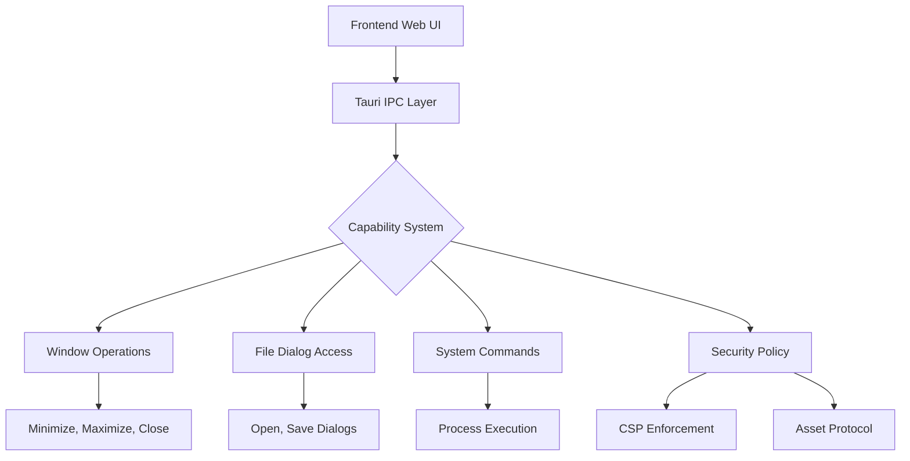
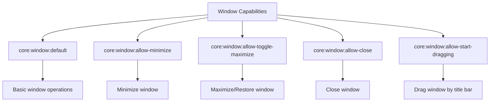
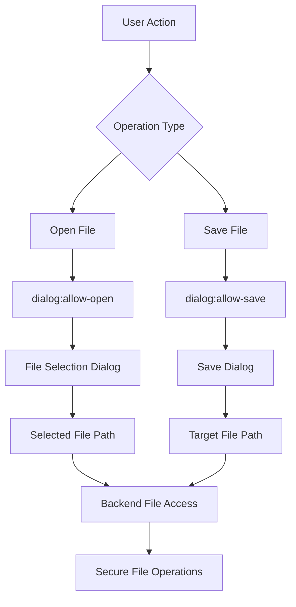
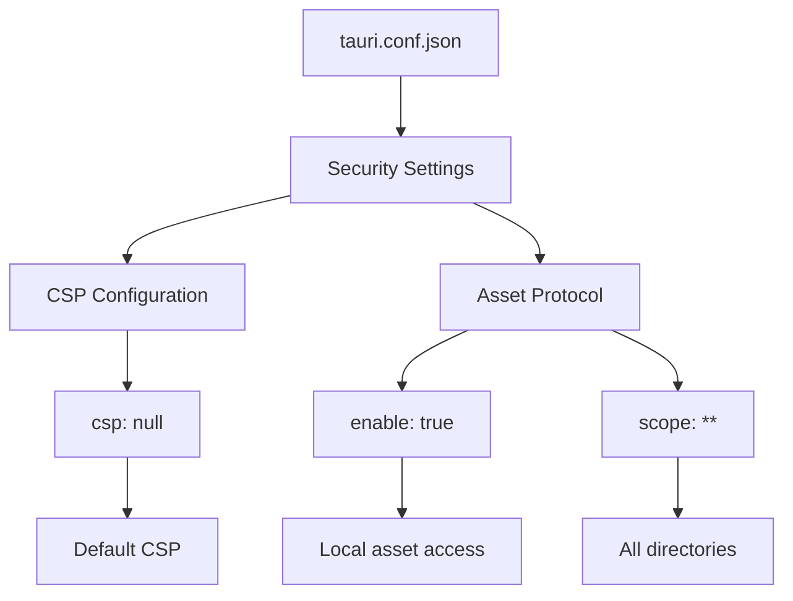
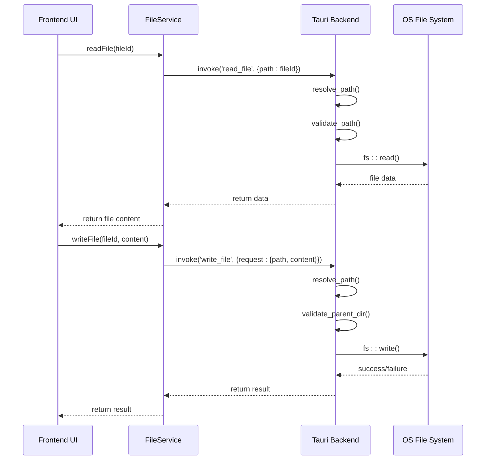
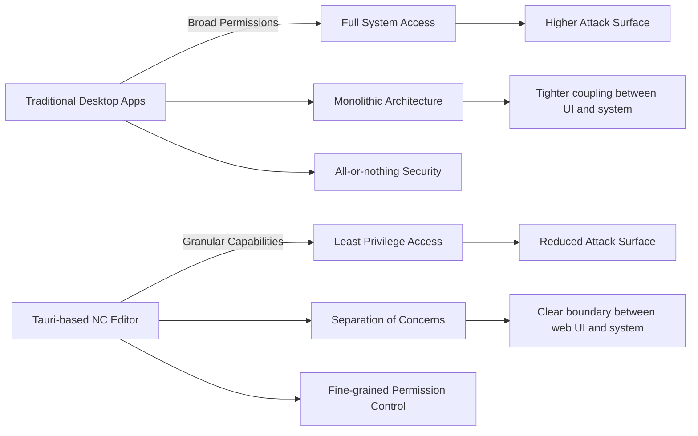

# Security Model

<cite>
**Referenced Files in This Document**   
- [default.json](file://src-tauri/capabilities/default.json)
- [tauri.conf.json](file://src-tauri/tauri.conf.json)
- [lib.rs](file://src-tauri/src/lib.rs)
- [desktop-schema.json](file://src-tauri/gen/schemas/desktop-schema.json)
- [fileService.ts](file://src/lib/services/fileService.ts)
</cite>

## Table of Contents

1. [Introduction](#introduction)
2. [Capability-Based Security Overview](#capability-based-security-overview)
3. [Core Window Permissions](#core-window-permissions)
4. [File System Access and Dialog Permissions](#file-system-access-and-dialog-permissions)
5. [Security Configuration in tauri.conf.json](#security-configuration-in-tauriconfjson)
6. [Implementation of Secure File Operations](#implementation-of-secure-file-operations)
7. [Comparison with Traditional Desktop Application Security](#comparison-with-traditional-desktop-application-security)
8. [Security Best Practices and Considerations](#security-best-practices-and-considerations)

## Introduction

The NC code editor implements a robust security model based on Tauri v2's capability-based security system. This document provides a comprehensive analysis of the security architecture, focusing on the explicit declaration of required capabilities rather than granting broad system access. The security model is designed to minimize attack surface by restricting application privileges to only those necessary for core functionality. By leveraging Tauri's modern security-first approach, the NC editor ensures protection against arbitrary code execution, safeguards user data, and implements secure file system access patterns.

## Capability-Based Security Overview

The NC code editor utilizes Tauri v2's capabilities system to implement a fine-grained security model that explicitly declares required permissions. This approach follows the principle of least privilege, where the application only requests access to specific system resources and operations that are essential for its functionality.



**Diagram sources**

- [default.json](file://src-tauri/capabilities/default.json)
- [tauri.conf.json](file://src-tauri/tauri.conf.json)

**Section sources**

- [default.json](file://src-tauri/capabilities/default.json)
- [tauri.conf.json](file://src-tauri/tauri.conf.json)

The capability system acts as a gatekeeper for all inter-process communication (IPC) between the frontend web interface and the backend Rust code. Each capability defines a specific set of permissions that are required for particular application features. This model prevents the frontend from accessing system resources directly, instead requiring all privileged operations to be explicitly authorized through the capability configuration.

The implementation in NC follows Tauri's security philosophy of "secure by default," where no system access is granted unless explicitly declared. This contrasts with traditional desktop application models that often request broad permissions during installation. The capability-based approach allows for more granular control and reduces the potential impact of security vulnerabilities in the frontend code.

## Core Window Permissions

The NC code editor implements specific window operation permissions through Tauri's core window capabilities, allowing users to interact with the application window while maintaining security boundaries. These permissions are explicitly declared in the capability configuration to ensure only necessary window operations are available.



**Diagram sources**

- [default.json](file://src-tauri/capabilities/default.json)
- [desktop-schema.json](file://src-tauri/gen/schemas/desktop-schema.json)

**Section sources**

- [default.json](file://src-tauri/capabilities/default.json)
- [desktop-schema.json](file://src-tauri/gen/schemas/desktop-schema.json)

The window permissions are configured to provide a native user experience while preventing potentially dangerous operations. The `core:window:default` permission grants basic window functionality, while specific permissions like `allow-minimize`, `allow-toggle-maximize`, and `allow-close` enable standard window controls. The `allow-start-dragging` permission allows the window to be moved by dragging, which is essential for a desktop application but carefully scoped to prevent abuse.

This selective permission model ensures that the application cannot perform unauthorized window operations such as hiding from the taskbar, changing window transparency in unexpected ways, or manipulating other application windows. Each permission is explicitly declared in the `default.json` capability file, making the security model transparent and auditable.

## File System Access and Dialog Permissions

The NC code editor implements secure file system access through Tauri's dialog plugin permissions, enabling users to open and save files while maintaining strict security controls. This approach separates file selection from direct file system access, reducing the risk of unauthorized file operations.



**Diagram sources**

- [default.json](file://src-tauri/capabilities/default.json)
- [desktop-schema.json](file://src-tauri/gen/schemas/desktop-schema.json)
- [fileService.ts](file://src/lib/services/fileService.ts)

**Section sources**

- [default.json](file://src-tauri/capabilities/default.json)
- [desktop-schema.json](file://src-tauri/gen/schemas/desktop-schema.json)
- [fileService.ts](file://src/lib/services/fileService.ts)

The file system access model follows a two-step process: first, the user interacts with a native file dialog to select a file path, and second, the backend processes the selected path with appropriate security checks. The `dialog:allow-open` and `dialog:allow-save` permissions enable these file selection dialogs while preventing direct file system enumeration or access without user interaction.

This design prevents the application from scanning the user's file system without explicit permission and ensures that all file operations are initiated by user actions. The backend implementation in `lib.rs` includes additional validation and error handling to prevent path traversal attacks and other security issues. The file service abstraction in the frontend provides a clean interface for file operations while maintaining the security boundary between the web UI and system resources.

## Security Configuration in tauri.conf.json

The NC code editor's security configuration in tauri.conf.json implements critical security policies that complement the capability-based permissions system. These configurations establish the foundational security posture for the application, controlling content security policies and asset protocol access.



**Diagram sources**

- [tauri.conf.json](file://src-tauri/tauri.conf.json)

**Section sources**

- [tauri.conf.json](file://src-tauri/tauri.conf.json)

The Content Security Policy (CSP) setting is configured as `null`, which means Tauri applies its default security policy. This default policy restricts the application from loading external resources, executing inline scripts, or using `eval()`, effectively preventing cross-site scripting (XSS) attacks and code injection vulnerabilities. By not specifying a custom CSP, the application benefits from Tauri's security-first defaults that are regularly updated to address emerging threats.

The asset protocol configuration enables access to local assets with a scope of `**`, allowing the application to load resources from any directory within the application bundle. This setting is carefully balanced to provide necessary functionality while maintaining security by restricting access to the application's own resources rather than arbitrary file system locations. The combination of these settings creates a secure execution environment that protects against common web-based attacks while enabling the rich functionality expected of a modern code editor.

## Implementation of Secure File Operations

The NC code editor implements secure file operations through a well-structured backend system that validates and processes file requests with appropriate error handling and security checks. This implementation ensures that file operations are performed safely while maintaining the application's functionality.



**Diagram sources**

- [lib.rs](file://src-tauri/src/lib.rs)
- [fileService.ts](file://src/lib/services/fileService.ts)

**Section sources**

- [lib.rs](file://src-tauri/src/lib.rs)
- [fileService.ts](file://src/lib/services/fileService.ts)

The file operation implementation follows a secure pattern where all file access is mediated through the Tauri backend. The `resolve_path` function ensures that file paths are properly resolved and validated before any file operations are performed. This prevents path traversal attacks by normalizing paths and checking for attempts to access directories outside the intended scope.

The backend implementation includes comprehensive error handling for various failure scenarios, such as missing files, permission issues, or invalid paths. Each file operation is wrapped in appropriate Rust error handling constructs to prevent crashes and provide meaningful feedback to the user. The file service abstraction in the frontend provides a clean, promise-based API that handles the asynchronous nature of IPC calls while maintaining type safety through TypeScript interfaces.

## Comparison with Traditional Desktop Application Security

The NC code editor's security model represents a significant evolution from traditional desktop application approaches, offering enhanced protection through modern security principles and architecture. This comparison highlights the advantages of Tauri's security-first design over conventional desktop application security models.



**Diagram sources**

- [default.json](file://src-tauri/capabilities/default.json)
- [tauri.conf.json](file://src-tauri/tauri.conf.json)

**Section sources**

- [default.json](file://src-tauri/capabilities/default.json)
- [tauri.conf.json](file://src-tauri/tauri.conf.json)

Traditional desktop applications typically operate with broad system permissions, often requiring administrator privileges for installation and running with the user's full access rights. This creates a large attack surface where a single vulnerability can compromise the entire application and potentially the user's system. In contrast, the NC editor's capability-based model restricts access to only the specific operations needed, significantly reducing the potential impact of security vulnerabilities.

The architectural separation between the web-based frontend and the Rust backend creates a security boundary that is absent in traditional desktop applications. This separation ensures that even if the frontend is compromised through a web-based attack, the attacker cannot directly access system resources without exploiting additional vulnerabilities in the backend IPC layer. The capability system acts as an additional authorization layer, requiring explicit permission for each type of system access.

## Security Best Practices and Considerations

The NC code editor implements several security best practices that contribute to its robust security posture. These practices address common security considerations for desktop applications, particularly those with web-based interfaces, and provide guidance for maintaining security throughout the application lifecycle.

```mermaid
flowchart TD
A[Security Best Practices] --> B[Preventing Arbitrary Code Execution]
A --> C[Protecting User Data]
A --> D[Secure File System Access]
A --> E[Input Validation]
A --> F[Error Handling]
B --> G[No eval() or dynamic code execution]
B --> H[CSP enforcement]
C --> I[Data encryption at rest]
C --> J[Secure configuration storage]
D --> K[Path validation]
D --> L[Permission checks]
E --> M[Input sanitization]
E --> N[Type checking]
F --> O[Graceful failure]
F --> P[Meaningful error messages]
```

**Diagram sources**

- [lib.rs](file://src-tauri/src/lib.rs)
- [tauri.conf.json](file://src-tauri/tauri.conf.json)

**Section sources**

- [lib.rs](file://src-tauri/src/lib.rs)
- [tauri.conf.json](file://src-tauri/tauri.conf.json)

To prevent arbitrary code execution, the application avoids dangerous JavaScript patterns such as `eval()` and `new Function()`, and relies on Tauri's default CSP to block inline scripts and unauthorized resource loading. User data protection is implemented through secure storage of configuration files in the application-specific directory, with appropriate file permissions to prevent unauthorized access.

Secure file system access patterns include validating all file paths to prevent directory traversal attacks, checking file existence and permissions before operations, and using lossy UTF-8 conversion to handle non-text files safely. Input validation is performed on both the frontend and backend, with TypeScript interfaces ensuring type safety and Rust's strong type system providing additional protection.

The error handling strategy emphasizes graceful failure and meaningful error messages that inform users without exposing sensitive system information. This approach helps prevent information disclosure vulnerabilities while maintaining a good user experience. The combination of these best practices creates a comprehensive security model that protects against common attack vectors while enabling the rich functionality expected of a modern code editor.
