# Diagnostics System

<cite>
**Referenced Files in This Document**   
- [diagnosticsAdapter.ts](file://src/lib/editor/diagnosticsAdapter.ts)
- [diagnosticsStore.ts](file://src/lib/stores/diagnosticsStore.ts)
- [EditorCore.ts](file://src/lib/editor/EditorCore.ts)
- [intellisense.ts](file://src/lib/editor/intellisense.ts)
- [editorStore.ts](file://src/lib/stores/editorStore.ts)
</cite>

## Table of Contents

1. [Introduction](#introduction)
2. [Architecture Overview](#architecture-overview)
3. [Core Components](#core-components)
4. [Data Flow for Diagnostic Reporting](#data-flow-for-diagnostic-reporting)
5. [Configuration and Filtering](#configuration-and-filtering)
6. [Performance Considerations](#performance-considerations)
7. [Troubleshooting Guide](#troubleshooting-guide)
8. [Conclusion](#conclusion)

## Introduction

The diagnostics system in the NC code editor provides real-time feedback on code quality, errors, and warnings through a sophisticated integration between Monaco Editor's diagnostic capabilities and the application's state management system. This document explains the implementation of `diagnosticsAdapter.ts` and its role in bridging Monaco Editor's diagnostic system with the application's state management. The system is designed to be efficient, reactive, and accessible to both beginners and experienced developers implementing custom diagnostic rules.

The diagnostics system follows a unidirectional data flow pattern, where diagnostics are generated by language services, processed through the editor core, and then made available to UI components via Svelte stores. This architecture ensures that diagnostic information is consistently available throughout the application while maintaining separation of concerns between the editor, state management, and user interface layers.

**Section sources**

- [diagnosticsAdapter.ts](file://src/lib/editor/diagnosticsAdapter.ts#L1-L60)
- [diagnosticsStore.ts](file://src/lib/stores/diagnosticsStore.ts#L1-L142)

## Architecture Overview

The diagnostics system in NC code editor follows a layered architecture that connects Monaco Editor's native diagnostic capabilities with the application's state management system. The core components work together to provide real-time feedback on code quality, errors, and warnings.

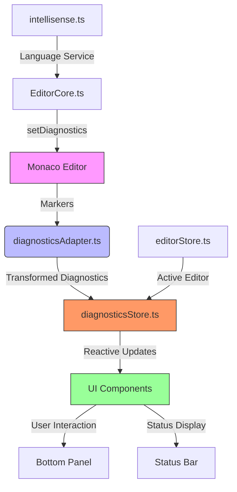

**Diagram sources **

- [diagnosticsAdapter.ts](file://src/lib/editor/diagnosticsAdapter.ts#L1-L60)
- [diagnosticsStore.ts](file://src/lib/stores/diagnosticsStore.ts#L1-L142)
- [EditorCore.ts](file://src/lib/editor/EditorCore.ts#L1-L891)

The architecture consists of several key components:

- **Monaco Editor**: Provides the underlying editor functionality and native diagnostic markers
- **diagnosticsAdapter.ts**: Bridges Monaco's marker system with the application's state management
- **diagnosticsStore.ts**: Centralized store for diagnostic information, providing reactive updates to UI components
- **EditorCore.ts**: Manages the editor instance and provides an API for setting diagnostics
- **intellisense.ts**: Configures language services that generate diagnostics
- **editorStore.ts**: Tracks the active editor and file state

This layered approach ensures separation of concerns while maintaining efficient communication between components. The diagnostics flow from the language services through the editor core to the state store, where they become available to various UI components.

**Section sources**

- [diagnosticsAdapter.ts](file://src/lib/editor/diagnosticsAdapter.ts#L1-L60)
- [diagnosticsStore.ts](file://src/lib/stores/diagnosticsStore.ts#L1-L142)
- [EditorCore.ts](file://src/lib/editor/EditorCore.ts#L1-L891)

## Core Components

### Diagnostics Adapter

The `diagnosticsAdapter.ts` file implements the bridge between Monaco Editor's diagnostic system and the application's state management. It uses the `attachDiagnosticsTracking` function to subscribe to Monaco's `onDidChangeMarkers` event, which fires whenever diagnostic markers change in the editor.

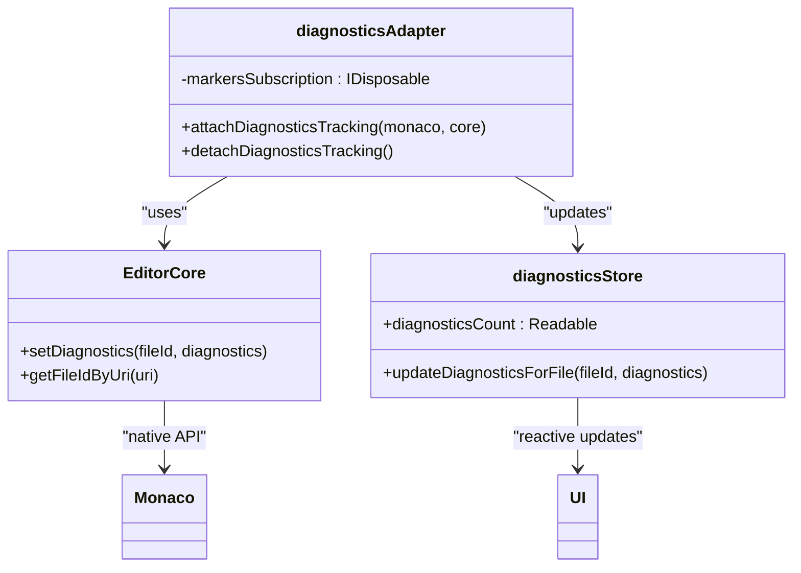

**Diagram sources **

- [diagnosticsAdapter.ts](file://src/lib/editor/diagnosticsAdapter.ts#L1-L60)
- [EditorCore.ts](file://src/lib/editor/EditorCore.ts#L1-L891)
- [diagnosticsStore.ts](file://src/lib/stores/diagnosticsStore.ts#L1-L142)

The adapter performs several key functions:

1. Listens for changes to Monaco markers across all editor models
2. Translates Monaco's marker format to the application's `EditorDiagnostic` interface
3. Maps the marker's URI to the application's fileId system
4. Updates the diagnostics store with the transformed diagnostic information

The adapter uses a subscription pattern to ensure efficient event handling, with `attachDiagnosticsTracking` establishing the connection and `detachDiagnosticsTracking` cleaning up resources when no longer needed.

**Section sources**

- [diagnosticsAdapter.ts](file://src/lib/editor/diagnosticsAdapter.ts#L1-L60)

### Diagnostics Store

The `diagnosticsStore.ts` file implements a centralized store for diagnostic information using Svelte's reactive store pattern. It serves as the single source of truth for diagnostic data in the application.

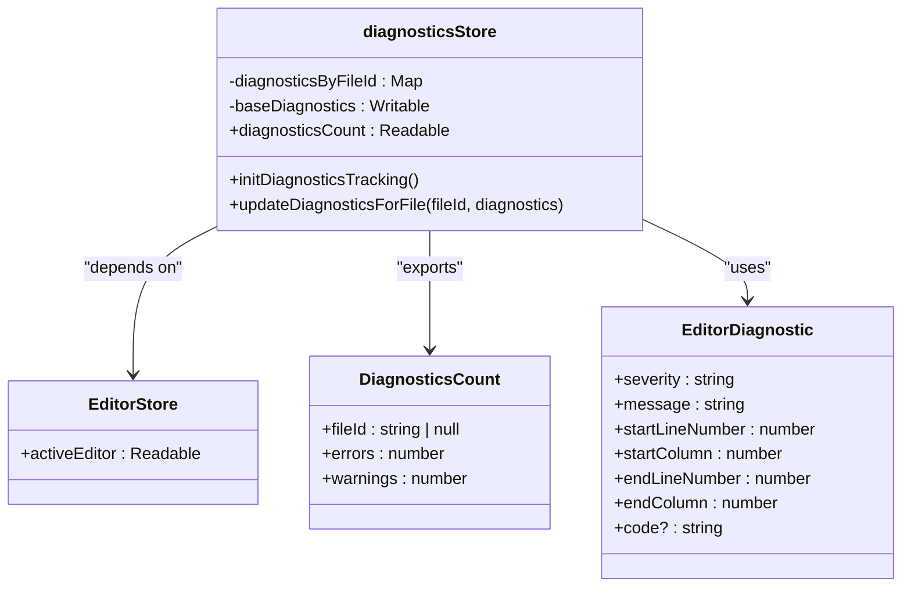

**Diagram sources **

- [diagnosticsStore.ts](file://src/lib/stores/diagnosticsStore.ts#L1-L142)
- [editorStore.ts](file://src/lib/stores/editorStore.ts#L1-L381)

The store maintains diagnostics data in two forms:

1. A map of diagnostics by fileId (`diagnosticsByFileId`) for efficient access to raw diagnostic data
2. A derived store (`diagnosticsCount`) that provides aggregated error and warning counts for the active editor

The store uses Svelte's `derived` function to create a reactive computation that automatically updates when either the active editor changes or new diagnostics are received. This ensures that UI components always display up-to-date diagnostic information without requiring manual refresh logic.

**Section sources**

- [diagnosticsStore.ts](file://src/lib/stores/diagnosticsStore.ts#L1-L142)

### Editor Core Integration

The `EditorCore.ts` file provides the interface between the application and Monaco Editor, including diagnostic functionality. It exposes a `setDiagnostics` method that allows language services to update diagnostic markers for a specific file.

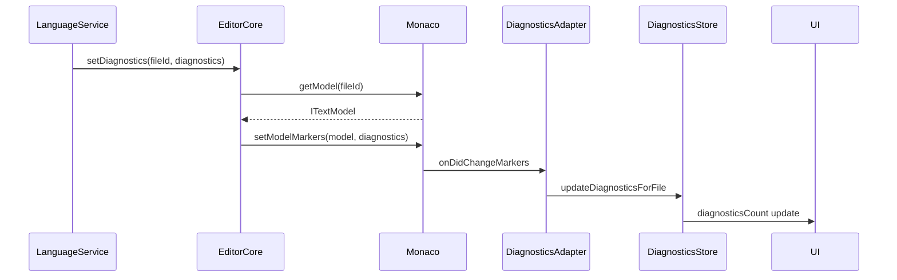

**Diagram sources **

- [EditorCore.ts](file://src/lib/editor/EditorCore.ts#L1-L891)
- [diagnosticsAdapter.ts](file://src/lib/editor/diagnosticsAdapter.ts#L1-L60)
- [diagnosticsStore.ts](file://src/lib/stores/diagnosticsStore.ts#L1-L142)

The `setDiagnostics` method performs several key operations:

1. Retrieves the editor model for the specified fileId
2. Transforms the application's diagnostic format to Monaco's marker format
3. Applies the markers to the model using Monaco's `setModelMarkers` API
4. Triggers the diagnostics adapter's change detection

This integration ensures that diagnostics set through the editor core are properly displayed in the editor and propagated to the application's state management system.

**Section sources**

- [EditorCore.ts](file://src/lib/editor/EditorCore.ts#L1-L891)

## Data Flow for Diagnostic Reporting

The diagnostic reporting system in NC code editor follows a well-defined data flow from generation to display. This section explains how diagnostics are created, processed, and presented to the user.

### Diagnostic Generation

Diagnostics are primarily generated by language services configured in `intellisense.ts`. The TypeScript and JavaScript language services are configured with specific diagnostic options that control what types of issues are reported.

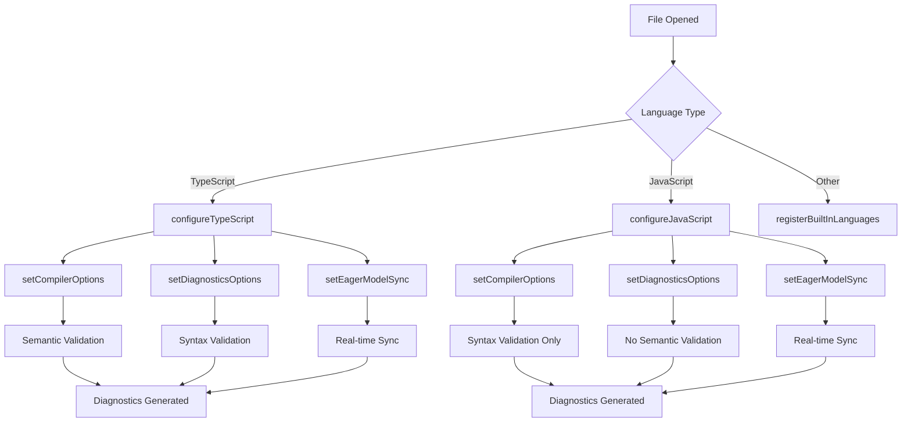

**Diagram sources **

- [intellisense.ts](file://src/lib/editor/intellisense.ts#L1-L327)

For TypeScript files, both semantic and syntax validation are enabled, providing comprehensive error detection. JavaScript files have semantic validation disabled for performance reasons, focusing only on syntax errors. The `setEagerModelSync(true)` option ensures that models are synchronized with the language service worker in real-time, enabling immediate feedback as the user types.

**Section sources**

- [intellisense.ts](file://src/lib/editor/intellisense.ts#L1-L327)

### Diagnostic Processing

Once diagnostics are generated by the language services, they are processed through the editor core and adapter system. The processing flow ensures that diagnostic information is properly transformed and stored for UI consumption.

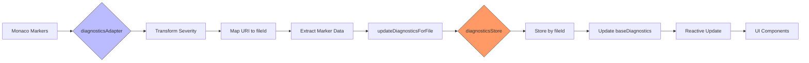

**Diagram sources **

- [diagnosticsAdapter.ts](file://src/lib/editor/diagnosticsAdapter.ts#L1-L60)
- [diagnosticsStore.ts](file://src/lib/stores/diagnosticsStore.ts#L1-L142)

The diagnostic processing involves several key transformations:

1. Converting Monaco's numeric severity levels to string representations ('error', 'warning', 'info', 'hint')
2. Mapping the marker's URI to the application's fileId system using `getFileIdByUri`
3. Extracting relevant marker properties into the `EditorDiagnostic` format
4. Storing the diagnostics in the centralized store by fileId

This processing ensures that diagnostic data is in a consistent format that can be easily consumed by various parts of the application.

**Section sources**

- [diagnosticsAdapter.ts](file://src/lib/editor/diagnosticsAdapter.ts#L1-L60)
- [diagnosticsStore.ts](file://src/lib/stores/diagnosticsStore.ts#L1-L142)

### Diagnostic Display

The final stage of the diagnostic reporting system is displaying the information to the user through various UI components. The diagnostics store provides reactive data that UI components can subscribe to for real-time updates.

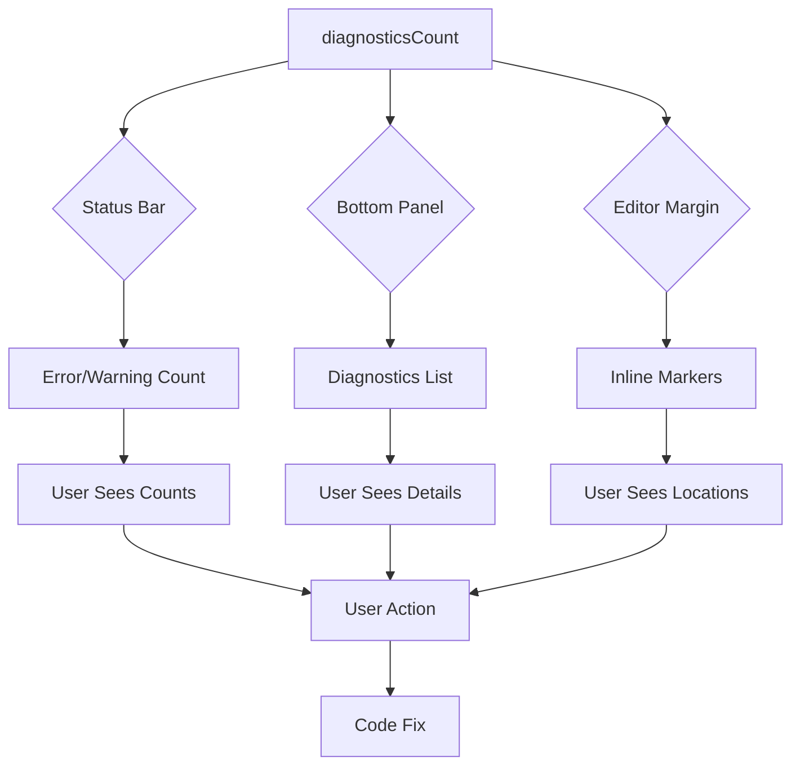

**Diagram sources **

- [diagnosticsStore.ts](file://src/lib/stores/diagnosticsStore.ts#L1-L142)
- [editorStore.ts](file://src/lib/stores/editorStore.ts#L1-L381)

The diagnostic display occurs in multiple locations:

1. **Status Bar**: Shows aggregated error and warning counts for the active file
2. **Bottom Panel**: Provides a detailed list of all diagnostics with navigation capabilities
3. **Editor Margin**: Displays inline markers indicating the location of issues in the code

The `diagnosticsCount` store provides the aggregated data for the status bar, while the full diagnostic details are available for the bottom panel and editor margin displays.

**Section sources**

- [diagnosticsStore.ts](file://src/lib/stores/diagnosticsStore.ts#L1-L142)
- [editorStore.ts](file://src/lib/stores/editorStore.ts#L1-L381)

## Configuration and Filtering

The diagnostics system in NC code editor provides several configuration options that allow users and developers to customize diagnostic behavior and filtering.

### Diagnostic Severity Levels

The system supports four severity levels for diagnostics, which are mapped from Monaco Editor's native severity levels:

| Severity Level | Monaco Value | Description                                              |
| -------------- | ------------ | -------------------------------------------------------- |
| Error          | 8            | Critical issues that prevent code from working correctly |
| Warning        | 4            | Potential issues that may cause problems                 |
| Info           | 2            | Informational messages about code                        |
| Hint           | 1            | Suggestions for code improvement                         |

These severity levels are used consistently throughout the system, from the language services to the UI display. The `diagnosticsAdapter.ts` file handles the conversion between Monaco's numeric values and the string representations used in the application.

**Section sources**

- [diagnosticsAdapter.ts](file://src/lib/editor/diagnosticsAdapter.ts#L1-L60)
- [EditorCore.ts](file://src/lib/editor/EditorCore.ts#L1-L891)

### Diagnostic Filtering

The diagnostics system provides filtering capabilities at multiple levels to help users focus on relevant issues.

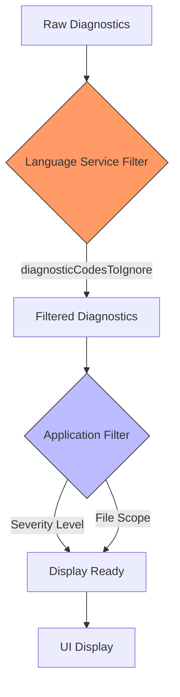

**Diagram sources **

- [intellisense.ts](file://src/lib/editor/intellisense.ts#L1-L327)
- [diagnosticsStore.ts](file://src/lib/stores/diagnosticsStore.ts#L1-L142)

Language service filtering is configured in `intellisense.ts` using the `diagnosticCodesToIgnore` option. This allows specific diagnostic codes to be suppressed globally. For example, the TypeScript configuration ignores diagnostic codes 7016 ("Could not find declaration file") and 2307 ("Cannot find module") to reduce noise from missing type definitions.

Application-level filtering occurs in the `diagnosticsStore.ts` file, where the `diagnosticsCount` store only includes error and warning counts by default. This filtering ensures that the status bar displays only the most critical information, while more detailed diagnostics are available in other UI components.

**Section sources**

- [intellisense.ts](file://src/lib/editor/intellisense.ts#L1-L327)
- [diagnosticsStore.ts](file://src/lib/stores/diagnosticsStore.ts#L1-L142)

### Custom Diagnostic Rules

Developers can implement custom diagnostic rules by extending the language services or creating new ones. The system is designed to be extensible, allowing for the addition of project-specific or domain-specific diagnostics.

To implement custom diagnostic rules, developers can:

1. Register a new language service provider using `registerCompletionProvider` or `registerHoverProvider`
2. Configure diagnostic options for existing language services using `setDiagnosticsOptions`
3. Add custom type definitions using `addExtraLibs` for enhanced type checking

The `intellisense.ts` file provides utility functions like `addExtraLibs` that make it easy to extend the diagnostic capabilities with custom type definitions and rules.

**Section sources**

- [intellisense.ts](file://src/lib/editor/intellisense.ts#L1-L327)
- [EditorCore.ts](file://src/lib/editor/EditorCore.ts#L1-L891)

## Performance Considerations

The diagnostics system in NC code editor is designed with performance in mind, especially when handling large numbers of diagnostics or working with large files.

### Efficient Data Structures

The system uses optimized data structures to ensure efficient access and updates:

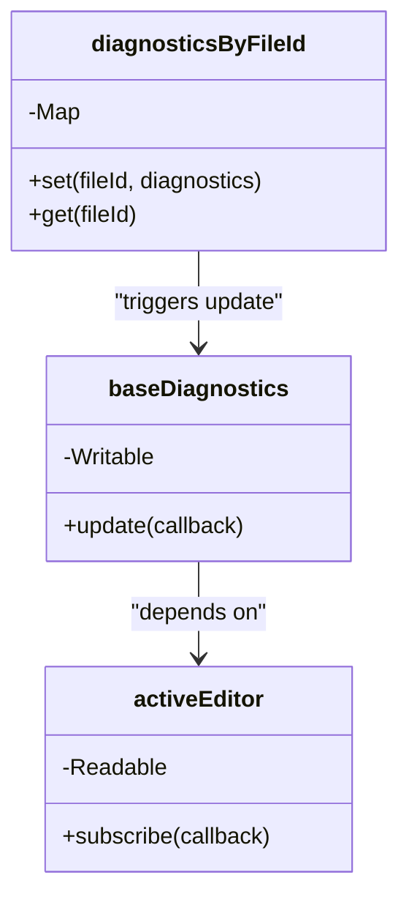

**Diagram sources **

- [diagnosticsStore.ts](file://src/lib/stores/diagnosticsStore.ts#L1-L142)
- [editorStore.ts](file://src/lib/stores/editorStore.ts#L1-L381)

The `diagnosticsByFileId` map provides O(1) access to diagnostic data by fileId, allowing for efficient updates and retrievals. The use of Svelte's `derived` store for `diagnosticsCount` ensures that calculations are only performed when necessary, reducing unnecessary computations.

**Section sources**

- [diagnosticsStore.ts](file://src/lib/stores/diagnosticsStore.ts#L1-L142)

### Batch Updates and Throttling

The system implements batch updates to minimize the impact of frequent diagnostic changes:

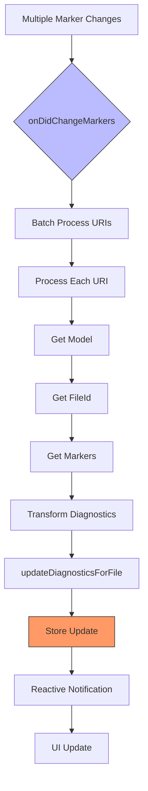

**Diagram sources **

- [diagnosticsAdapter.ts](file://src/lib/editor/diagnosticsAdapter.ts#L1-L60)
- [diagnosticsStore.ts](file://src/lib/stores/diagnosticsStore.ts#L1-L142)

The `onDidChangeMarkers` event can fire multiple times in quick succession as the user types. The adapter processes all changed URIs in a single batch, transforming and updating diagnostics for each affected file. This approach reduces the number of store updates and reactive notifications, improving overall performance.

**Section sources**

- [diagnosticsAdapter.ts](file://src/lib/editor/diagnosticsAdapter.ts#L1-L60)

### Memory Management

The system includes proper memory management to prevent leaks and ensure efficient resource usage:

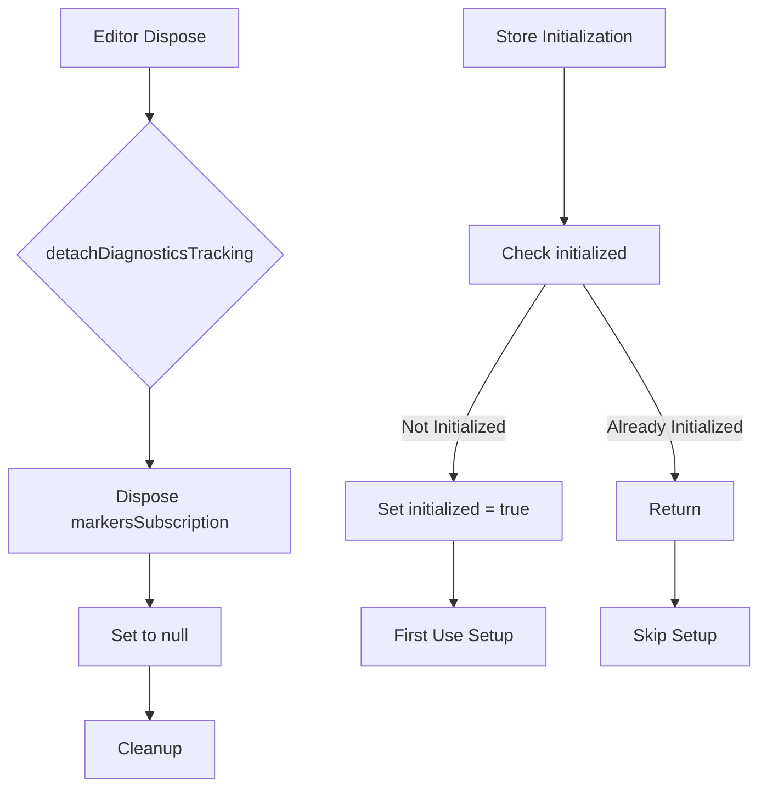

**Diagram sources **

- [diagnosticsAdapter.ts](file://src/lib/editor/diagnosticsAdapter.ts#L1-L60)
- [diagnosticsStore.ts](file://src/lib/stores/diagnosticsStore.ts#L1-L142)

The `detachDiagnosticsTracking` function properly disposes of the markers subscription and resets the reference to prevent memory leaks. The diagnostics store uses a lazy initialization pattern with the `initialized` flag, ensuring that resources are only allocated when needed.

**Section sources**

- [diagnosticsAdapter.ts](file://src/lib/editor/diagnosticsAdapter.ts#L1-L60)
- [diagnosticsStore.ts](file://src/lib/stores/diagnosticsStore.ts#L1-L142)

## Troubleshooting Guide

This section addresses common issues related to diagnostic accuracy and performance, providing solutions for handling large numbers of diagnostics efficiently.

### Common Issues

#### Diagnostics Not Appearing

If diagnostics are not appearing in the editor, check the following:

1. Verify that the language service is properly initialized:

```typescript
setupBasicLanguageSupport(monaco);
```

2. Ensure that diagnostics tracking is attached:

```typescript
attachDiagnosticsTracking(monaco, editorCore);
```

3. Check that the file has the correct language identifier, as diagnostics are language-specific.

**Section sources**

- [intellisense.ts](file://src/lib/editor/intellisense.ts#L1-L327)
- [diagnosticsAdapter.ts](file://src/lib/editor/diagnosticsAdapter.ts#L1-L60)

#### Incorrect Diagnostic Counts

If the diagnostic counts in the status bar are incorrect, verify the following:

1. Ensure that the `activeEditor` store is properly synchronized with the editor core
2. Check that the `updateDiagnosticsForFile` function is being called with the correct fileId
3. Verify that the severity level mapping is correct in the diagnostics adapter

The diagnostics store relies on the active editor state to determine which file's diagnostics to display, so any mismatch between the editor core and editor store can cause incorrect counts.

**Section sources**

- [diagnosticsStore.ts](file://src/lib/stores/diagnosticsStore.ts#L1-L142)
- [editorStore.ts](file://src/lib/stores/editorStore.ts#L1-L381)

### Performance Optimization

#### Handling Large Numbers of Diagnostics

When working with files that generate many diagnostics, consider the following optimizations:

1. Implement diagnostic filtering at the language service level using `diagnosticCodesToIgnore`
2. Use the `skipLibCheck: true` compiler option for TypeScript to reduce validation overhead
3. Consider disabling semantic validation for JavaScript files with `noSemanticValidation: true`

These optimizations can significantly reduce the number of diagnostics generated and improve editor responsiveness.

**Section sources**

- [intellisense.ts](file://src/lib/editor/intellisense.ts#L1-L327)

#### Memory Usage

To optimize memory usage with large projects:

1. Ensure that `detachDiagnosticsTracking` is called when the editor is disposed
2. Monitor the size of the `diagnosticsByFileId` map and consider implementing a cleanup strategy for inactive files
3. Use the `largeFileOptimizations` editor option for files above a certain size threshold

The system is designed to handle typical project sizes efficiently, but extremely large projects may require additional optimization strategies.

**Section sources**

- [diagnosticsAdapter.ts](file://src/lib/editor/diagnosticsAdapter.ts#L1-L60)
- [diagnosticsStore.ts](file://src/lib/stores/diagnosticsStore.ts#L1-L142)

## Conclusion

The diagnostics system in NC code editor provides a robust and efficient framework for real-time code analysis and feedback. By bridging Monaco Editor's native diagnostic capabilities with the application's state management system, it delivers a seamless experience for developers of all skill levels.

Key strengths of the system include:

- Clear separation of concerns between diagnostic generation, processing, and display
- Reactive data flow using Svelte stores for real-time updates
- Configurable severity levels and filtering options
- Optimized performance for handling large numbers of diagnostics
- Extensible architecture for custom diagnostic rules

The system is designed to be both beginner-friendly and powerful enough for experienced developers implementing custom diagnostic rules. By following the patterns and best practices outlined in this document, developers can effectively leverage the diagnostics system to improve code quality and development efficiency.

**Section sources**

- [diagnosticsAdapter.ts](file://src/lib/editor/diagnosticsAdapter.ts#L1-L60)
- [diagnosticsStore.ts](file://src/lib/stores/diagnosticsStore.ts#L1-L142)
- [EditorCore.ts](file://src/lib/editor/EditorCore.ts#L1-L891)
- [intellisense.ts](file://src/lib/editor/intellisense.ts#L1-L327)
