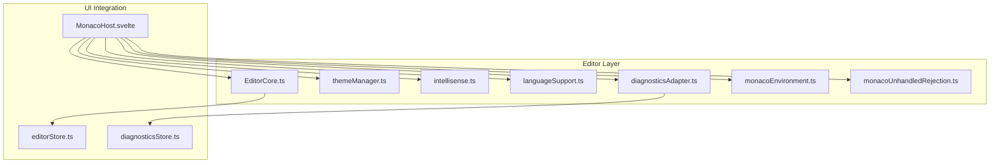
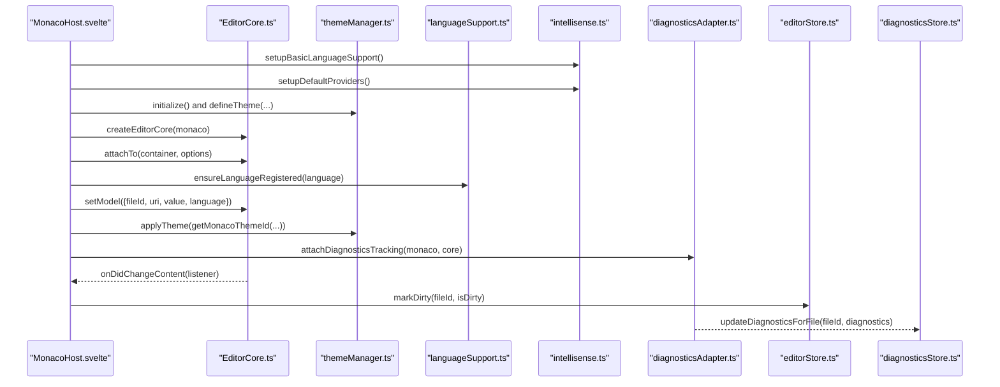
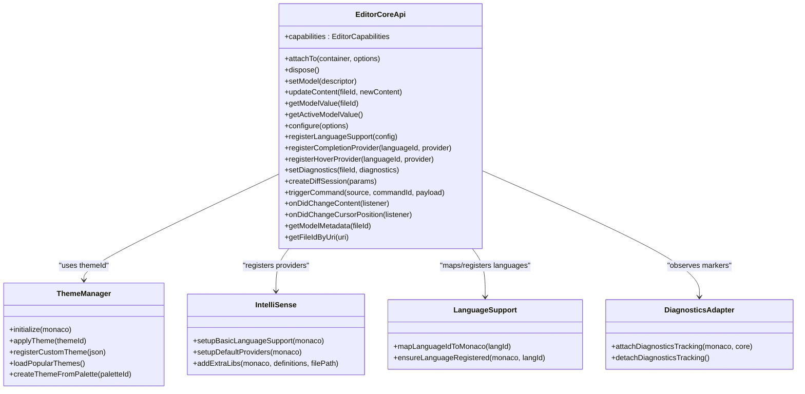
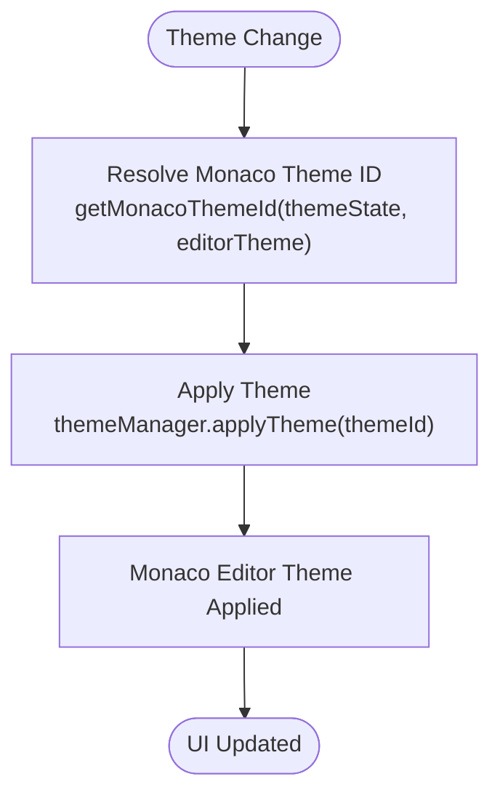
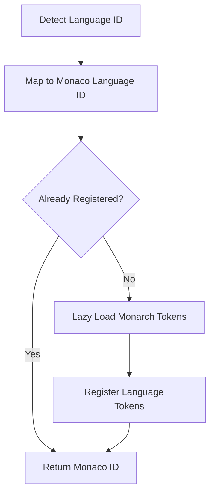
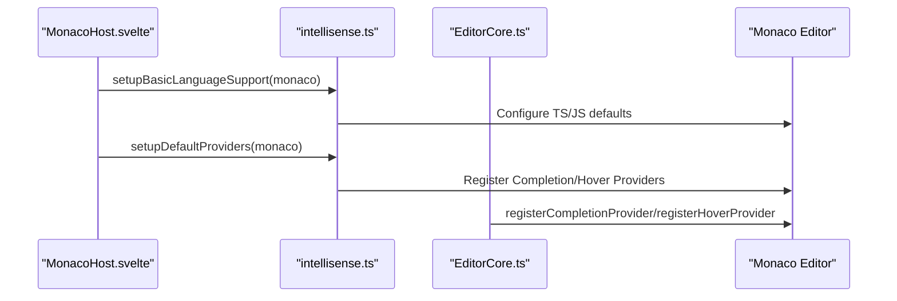
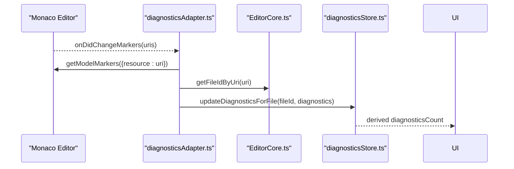
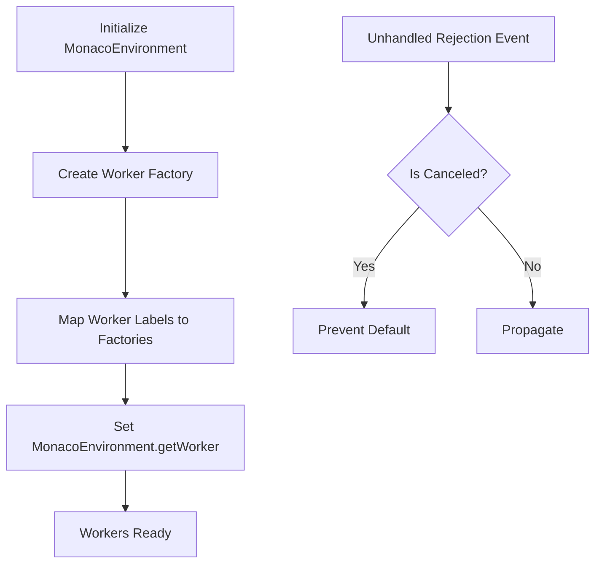
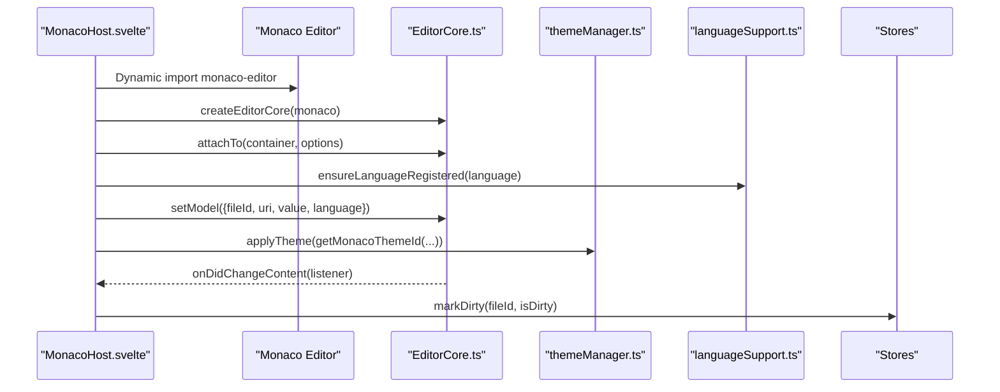
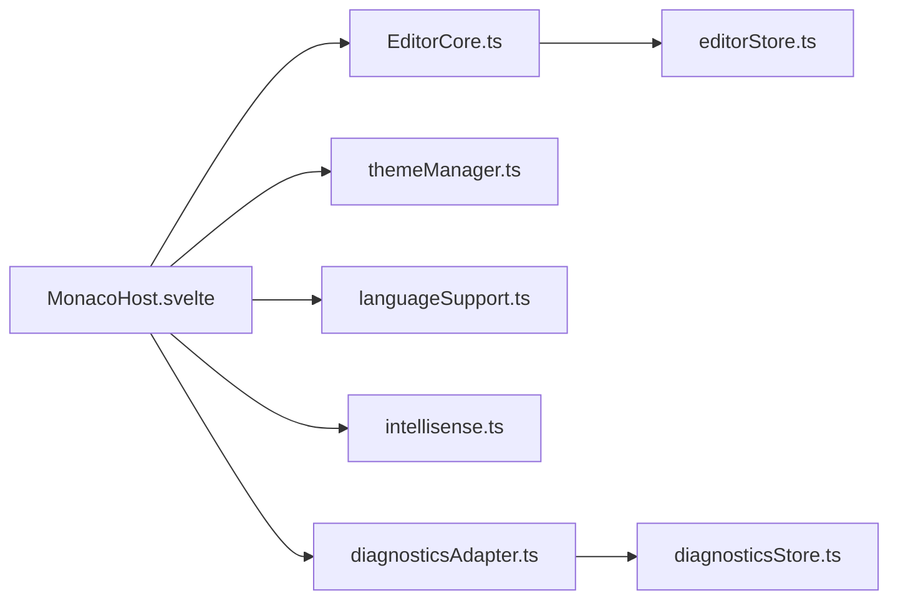

# Editor Core Architecture

<cite>
**Referenced Files in This Document**
- [EditorCore.ts](file://src/lib/editor/EditorCore.ts)
- [themeManager.ts](file://src/lib/editor/themeManager.ts)
- [intellisense.ts](file://src/lib/editor/intellisense.ts)
- [languageSupport.ts](file://src/lib/editor/languageSupport.ts)
- [diagnosticsAdapter.ts](file://src/lib/editor/diagnosticsAdapter.ts)
- [monacoEnvironment.ts](file://src/lib/editor/monacoEnvironment.ts)
- [monacoUnhandledRejection.ts](file://src/lib/editor/monacoUnhandledRejection.ts)
- [MonacoHost.svelte](file://src/lib/editor/MonacoHost.svelte)
- [editorStore.ts](file://src/lib/stores/editorStore.ts)
- [diagnosticsStore.ts](file://src/lib/stores/diagnosticsStore.ts)
</cite>

## Table of Contents

1. [Introduction](#introduction)
2. [Project Structure](#project-structure)
3. [Core Components](#core-components)
4. [Architecture Overview](#architecture-overview)
5. [Detailed Component Analysis](#detailed-component-analysis)
6. [Dependency Analysis](#dependency-analysis)
7. [Performance Considerations](#performance-considerations)
8. [Troubleshooting Guide](#troubleshooting-guide)
9. [Conclusion](#conclusion)

## Introduction

This document describes the architecture of the editor core component in the NC code editor. The EditorCore module serves as the central orchestrator for the Monaco Editor API, encapsulating it behind a clean, typed interface. It coordinates with theme management, language support, IntelliSense providers, and diagnostics to deliver a responsive editing experience integrated with Svelte stores. The design emphasizes:

- Adapter pattern for theme management
- Strategy pattern for language support
- Observer pattern for diagnostics
- Clear extension points for new language features and custom editor behaviors
- Performance optimizations for large files and responsive UI

## Project Structure

The editor core resides under src/lib/editor and integrates with Svelte stores and UI components. The MonacoHost.svelte component mounts the editor, initializes Monaco environment, and wires EditorCore with theme manager, IntelliSense, and diagnostics.

**Diagram sources**

- [EditorCore.ts](file://src/lib/editor/EditorCore.ts#L1-L120)
- [themeManager.ts](file://src/lib/editor/themeManager.ts#L1-L60)
- [intellisense.ts](file://src/lib/editor/intellisense.ts#L1-L60)
- [languageSupport.ts](file://src/lib/editor/languageSupport.ts#L1-L40)
- [diagnosticsAdapter.ts](file://src/lib/editor/diagnosticsAdapter.ts#L1-L40)
- [monacoEnvironment.ts](file://src/lib/editor/monacoEnvironment.ts#L1-L60)
- [monacoUnhandledRejection.ts](file://src/lib/editor/monacoUnhandledRejection.ts#L1-L30)
- [MonacoHost.svelte](file://src/lib/editor/MonacoHost.svelte#L1-L80)
- [editorStore.ts](file://src/lib/stores/editorStore.ts#L1-L60)
- [diagnosticsStore.ts](file://src/lib/stores/diagnosticsStore.ts#L1-L40)

**Section sources**

- [EditorCore.ts](file://src/lib/editor/EditorCore.ts#L1-L120)
- [MonacoHost.svelte](file://src/lib/editor/MonacoHost.svelte#L1-L80)

## Core Components

- EditorCore: Central orchestrator that wraps Monaco Editor APIs, manages models, configuration, commands, and subscriptions. Provides a minimal, typed API for Svelte integration.
- ThemeManager: Adapter-style manager for Monaco themes, supporting built-in, custom, and palette-derived themes.
- IntelliSense: Strategy-style initialization of language services and providers (TypeScript/JavaScript, built-in languages, snippets, hover).
- LanguageSupport: Strategy-style mapping and registration of languages with Monaco, including lazy loading of monarch tokens.
- DiagnosticsAdapter: Observer-style bridge between Monaco markers and diagnosticsStore for UI consumption.
- MonacoHost.svelte: UI host component that mounts EditorCore, applies theme and language support, and wires events to Svelte stores.

**Section sources**

- [EditorCore.ts](file://src/lib/editor/EditorCore.ts#L150-L320)
- [themeManager.ts](file://src/lib/editor/themeManager.ts#L30-L120)
- [intellisense.ts](file://src/lib/editor/intellisense.ts#L40-L120)
- [languageSupport.ts](file://src/lib/editor/languageSupport.ts#L1-L40)
- [diagnosticsAdapter.ts](file://src/lib/editor/diagnosticsAdapter.ts#L1-L40)
- [MonacoHost.svelte](file://src/lib/editor/MonacoHost.svelte#L60-L160)

## Architecture Overview

The editor core architecture follows a layered design:

- UI layer (MonacoHost.svelte) orchestrates lifecycle and passes props to EditorCore.
- EditorCore encapsulates Monaco Editor and exposes a stable API for models, configuration, commands, and subscriptions.
- ThemeManager adapts theme selection and application to Monaco.
- IntelliSense and LanguageSupport provide language features and providers.
- DiagnosticsAdapter observes Monaco markers and updates diagnosticsStore for UI.

**Diagram sources**

- [MonacoHost.svelte](file://src/lib/editor/MonacoHost.svelte#L60-L160)
- [EditorCore.ts](file://src/lib/editor/EditorCore.ts#L400-L520)
- [themeManager.ts](file://src/lib/editor/themeManager.ts#L100-L170)
- [languageSupport.ts](file://src/lib/editor/languageSupport.ts#L28-L70)
- [intellisense.ts](file://src/lib/editor/intellisense.ts#L40-L120)
- [diagnosticsAdapter.ts](file://src/lib/editor/diagnosticsAdapter.ts#L1-L40)
- [editorStore.ts](file://src/lib/stores/editorStore.ts#L280-L320)
- [diagnosticsStore.ts](file://src/lib/stores/diagnosticsStore.ts#L104-L142)

## Detailed Component Analysis

### EditorCore.ts

EditorCore is the central orchestrator that:

- Encapsulates Monaco Editor creation and configuration
- Manages multiple text models keyed by fileId
- Preserves undo/redo stacks across model switches
- Exposes typed APIs for models, configuration, commands, and subscriptions
- Integrates with diff editor sessions

Key design patterns:

- Adapter pattern for theme management via EditorCore.configure and themeManager
- Strategy pattern for language support via registerLanguageSupport and languageSupport mapping
- Observer pattern for content and cursor position changes

**Diagram sources**

- [EditorCore.ts](file://src/lib/editor/EditorCore.ts#L150-L320)
- [themeManager.ts](file://src/lib/editor/themeManager.ts#L30-L120)
- [intellisense.ts](file://src/lib/editor/intellisense.ts#L40-L120)
- [languageSupport.ts](file://src/lib/editor/languageSupport.ts#L1-L40)
- [diagnosticsAdapter.ts](file://src/lib/editor/diagnosticsAdapter.ts#L1-L40)

**Section sources**

- [EditorCore.ts](file://src/lib/editor/EditorCore.ts#L150-L320)
- [EditorCore.ts](file://src/lib/editor/EditorCore.ts#L400-L520)
- [EditorCore.ts](file://src/lib/editor/EditorCore.ts#L520-L700)
- [EditorCore.ts](file://src/lib/editor/EditorCore.ts#L700-L891)

### Theme Management (Adapter Pattern)

ThemeManager adapts theme selection and application to Monaco:

- Built-in themes, custom themes, and palette-derived themes
- Lazy loading of popular themes
- Theme ID resolution based on UI state and overrides

**Diagram sources**

- [themeManager.ts](file://src/lib/editor/themeManager.ts#L240-L274)
- [MonacoHost.svelte](file://src/lib/editor/MonacoHost.svelte#L130-L160)

**Section sources**

- [themeManager.ts](file://src/lib/editor/themeManager.ts#L30-L120)
- [themeManager.ts](file://src/lib/editor/themeManager.ts#L170-L274)
- [MonacoHost.svelte](file://src/lib/editor/MonacoHost.svelte#L130-L160)

### Language Support (Strategy Pattern)

LanguageSupport implements a strategy for mapping and registering languages:

- Maps internal language IDs to Monaco language IDs
- Registers built-in languages and lazy-loads monarch tokens for additional languages
- Ensures language registration only once

**Diagram sources**

- [languageSupport.ts](file://src/lib/editor/languageSupport.ts#L1-L40)
- [languageSupport.ts](file://src/lib/editor/languageSupport.ts#L30-L70)

**Section sources**

- [languageSupport.ts](file://src/lib/editor/languageSupport.ts#L1-L40)
- [languageSupport.ts](file://src/lib/editor/languageSupport.ts#L30-L70)

### IntelliSense Providers (Strategy Pattern)

IntelliSense implements a strategy for language services and providers:

- Singleton initialization of TypeScript/JavaScript language services
- Built-in language registration (JSON, HTML, CSS, etc.)
- Default providers for snippets and hover documentation
- Extra libs injection for custom typings

**Diagram sources**

- [intellisense.ts](file://src/lib/editor/intellisense.ts#L40-L120)
- [intellisense.ts](file://src/lib/editor/intellisense.ts#L140-L210)
- [intellisense.ts](file://src/lib/editor/intellisense.ts#L260-L327)
- [EditorCore.ts](file://src/lib/editor/EditorCore.ts#L650-L700)

**Section sources**

- [intellisense.ts](file://src/lib/editor/intellisense.ts#L40-L120)
- [intellisense.ts](file://src/lib/editor/intellisense.ts#L140-L210)
- [intellisense.ts](file://src/lib/editor/intellisense.ts#L260-L327)
- [EditorCore.ts](file://src/lib/editor/EditorCore.ts#L650-L700)

### Diagnostics Reporting (Observer Pattern)

DiagnosticsAdapter observes Monaco markers and updates diagnosticsStore:

- Subscribes to onDidChangeMarkers
- Converts Monaco markers to EditorDiagnostic
- Pushes diagnostics to diagnosticsStore for UI counters

**Diagram sources**

- [diagnosticsAdapter.ts](file://src/lib/editor/diagnosticsAdapter.ts#L1-L61)
- [diagnosticsStore.ts](file://src/lib/stores/diagnosticsStore.ts#L104-L142)
- [EditorCore.ts](file://src/lib/editor/EditorCore.ts#L300-L320)

**Section sources**

- [diagnosticsAdapter.ts](file://src/lib/editor/diagnosticsAdapter.ts#L1-L61)
- [diagnosticsStore.ts](file://src/lib/stores/diagnosticsStore.ts#L1-L80)
- [diagnosticsStore.ts](file://src/lib/stores/diagnosticsStore.ts#L104-L142)

### Monaco Environment and Unhandled Rejections

- MonacoEnvironment sets up ESM workers for Monaco in Vite/Svelte
- Unhandled rejection handler silences cancellation errors during dispose

**Diagram sources**

- [monacoEnvironment.ts](file://src/lib/editor/monacoEnvironment.ts#L60-L131)
- [monacoUnhandledRejection.ts](file://src/lib/editor/monacoUnhandledRejection.ts#L1-L30)

**Section sources**

- [monacoEnvironment.ts](file://src/lib/editor/monacoEnvironment.ts#L60-L131)
- [monacoUnhandledRejection.ts](file://src/lib/editor/monacoUnhandledRejection.ts#L1-L30)

### UI Integration with MonacoHost.svelte

MonacoHost.svelte:

- Dynamically imports Monaco ESM API
- Initializes language support and providers
- Creates EditorCore, applies theme, registers language, and wires events
- Exposes triggerCommand for external command invocation

**Diagram sources**

- [MonacoHost.svelte](file://src/lib/editor/MonacoHost.svelte#L60-L160)
- [EditorCore.ts](file://src/lib/editor/EditorCore.ts#L400-L520)
- [themeManager.ts](file://src/lib/editor/themeManager.ts#L100-L170)
- [languageSupport.ts](file://src/lib/editor/languageSupport.ts#L28-L70)
- [editorStore.ts](file://src/lib/stores/editorStore.ts#L280-L320)

**Section sources**

- [MonacoHost.svelte](file://src/lib/editor/MonacoHost.svelte#L60-L160)
- [MonacoHost.svelte](file://src/lib/editor/MonacoHost.svelte#L160-L220)

## Dependency Analysis

- EditorCore depends on Monaco Editor APIs for models, markers, and editor configuration.
- MonacoHost orchestrates EditorCore, themeManager, languageSupport, IntelliSense, and diagnosticsAdapter.
- diagnosticsAdapter depends on Monaco markers and EditorCore’s model-to-fileId mapping.
- diagnosticsStore depends on editorStore’s activeEditor and raw diagnostics.

**Diagram sources**

- [MonacoHost.svelte](file://src/lib/editor/MonacoHost.svelte#L60-L160)
- [EditorCore.ts](file://src/lib/editor/EditorCore.ts#L400-L520)
- [diagnosticsAdapter.ts](file://src/lib/editor/diagnosticsAdapter.ts#L1-L61)
- [diagnosticsStore.ts](file://src/lib/stores/diagnosticsStore.ts#L1-L80)
- [editorStore.ts](file://src/lib/stores/editorStore.ts#L360-L381)

**Section sources**

- [MonacoHost.svelte](file://src/lib/editor/MonacoHost.svelte#L60-L160)
- [EditorCore.ts](file://src/lib/editor/EditorCore.ts#L400-L520)
- [diagnosticsAdapter.ts](file://src/lib/editor/diagnosticsAdapter.ts#L1-L61)
- [diagnosticsStore.ts](file://src/lib/stores/diagnosticsStore.ts#L1-L80)
- [editorStore.ts](file://src/lib/stores/editorStore.ts#L360-L381)

## Performance Considerations

- EditorCore configuration includes performance-oriented defaults:
  - automaticLayout for responsive resizing
  - smoothScrolling disabled for responsiveness
  - cursorSmoothCaretAnimation off to reduce GPU load
  - renderValidationDecorations restricted to editable
  - quickSuggestionsDelay tuned for instant feedback
  - minimap rendering optimized (renderCharacters off, maxColumn bounded)
- MonacoEnvironment uses ESM workers for language services and lazy worker mapping to minimize startup cost.
- MonacoHost performs runtime imports and lazy theme loading to avoid blocking the main thread.
- Diagnostics tracking uses onDidChangeMarkers to avoid polling and keep UI reactive.
- Large file optimizations can be toggled via EditorCoreOptions for memory-conscious environments.

[No sources needed since this section provides general guidance]

## Troubleshooting Guide

- Cancellation errors during dispose: silenceMonacoCancellationErrors prevents unhandled rejection noise.
- Worker initialization: ensure MonacoEnvironment is imported before any Monaco usage to avoid worker misconfiguration.
- Theme switching: verify themeManager.isInitialized and that theme IDs resolve via getMonacoThemeId.
- Language registration: ensure ensureLanguageRegistered completes before setting models to avoid missing syntax highlighting.
- Diagnostics not updating: confirm attachDiagnosticsTracking is attached and getFileIdByUri returns a valid mapping.

**Section sources**

- [monacoUnhandledRejection.ts](file://src/lib/editor/monacoUnhandledRejection.ts#L1-L30)
- [monacoEnvironment.ts](file://src/lib/editor/monacoEnvironment.ts#L60-L131)
- [themeManager.ts](file://src/lib/editor/themeManager.ts#L240-L274)
- [languageSupport.ts](file://src/lib/editor/languageSupport.ts#L28-L70)
- [diagnosticsAdapter.ts](file://src/lib/editor/diagnosticsAdapter.ts#L1-L61)

## Conclusion

The editor core architecture cleanly separates concerns between UI orchestration, Monaco integration, theme management, language support, and diagnostics. By applying adapter, strategy, and observer patterns, the system remains extensible, maintainable, and performant. The typed EditorCore API enables seamless integration with Svelte stores while preserving flexibility for future enhancements such as diff editors, custom language features, and advanced IntelliSense integrations.
