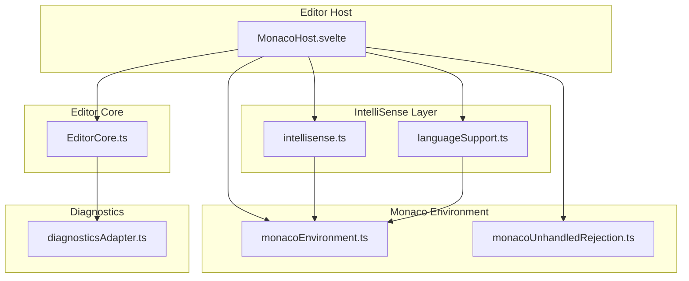
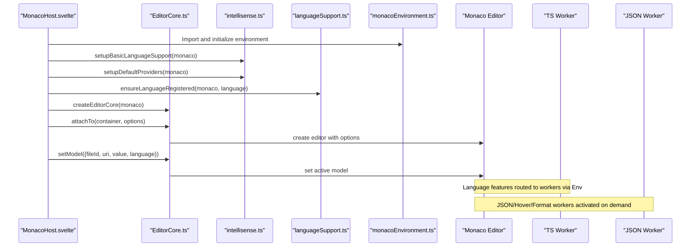
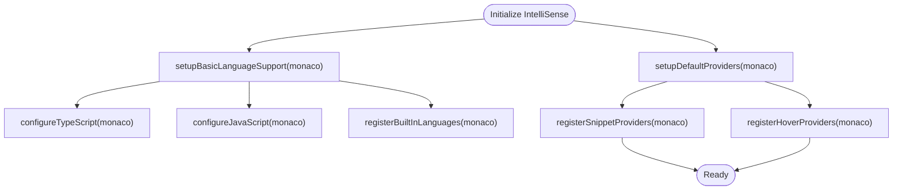
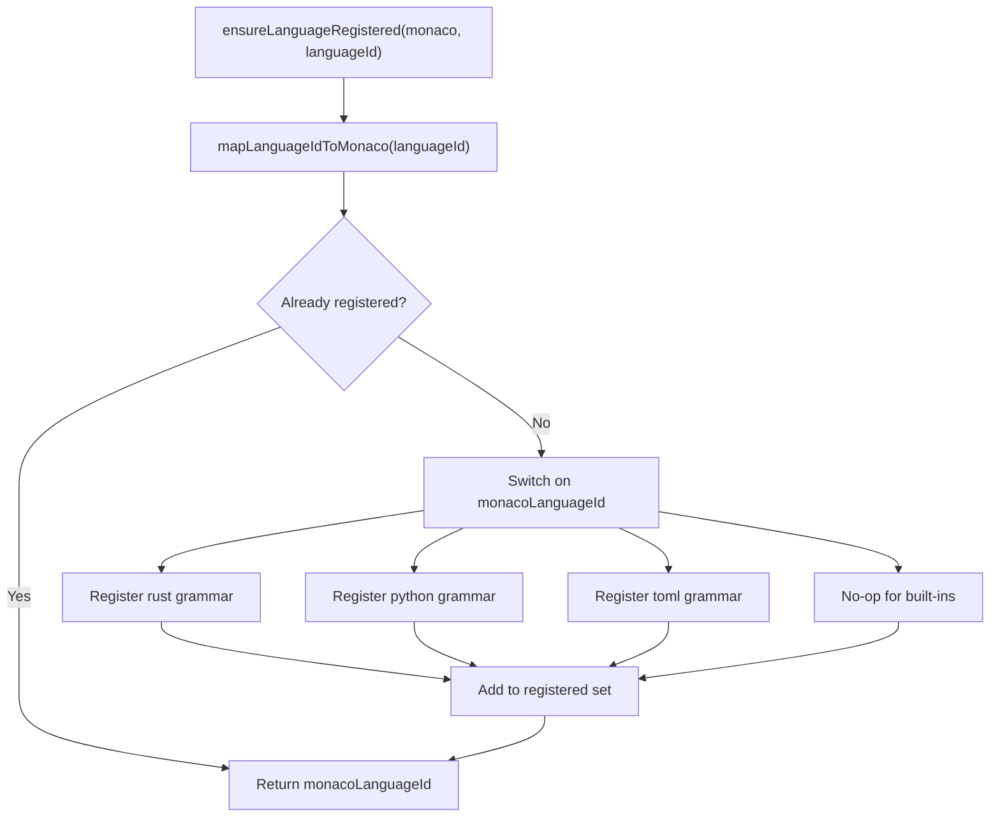
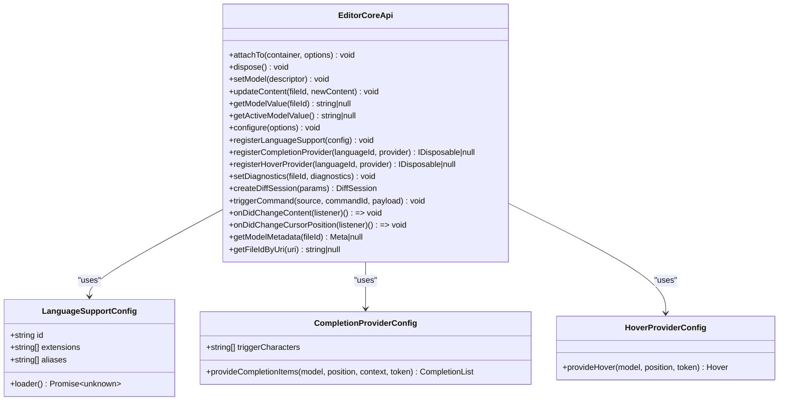
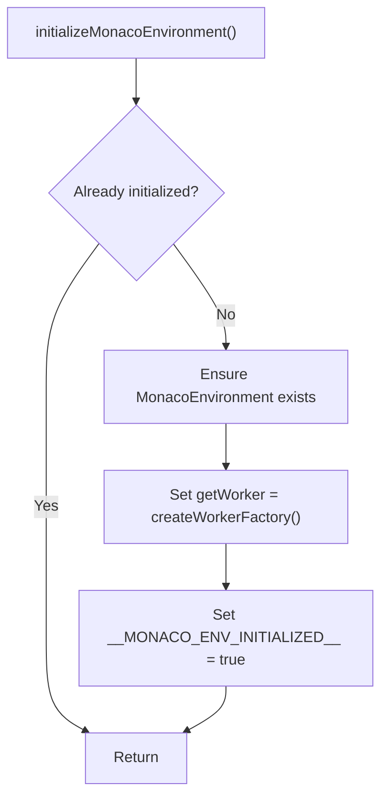
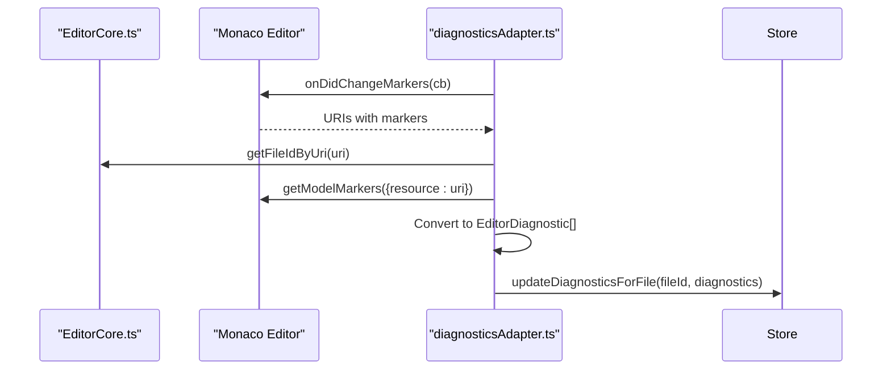
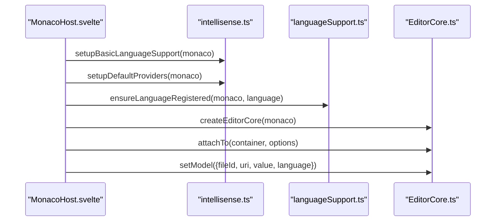
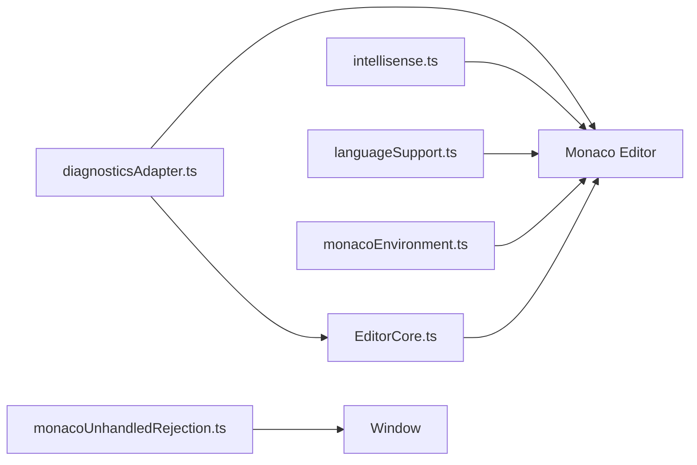

# IntelliSense Implementation

<cite>
**Referenced Files in This Document**
- [intellisense.ts](file://src/lib/editor/intellisense.ts)
- [languageSupport.ts](file://src/lib/editor/languageSupport.ts)
- [EditorCore.ts](file://src/lib/editor/EditorCore.ts)
- [MonacoHost.svelte](file://src/lib/editor/MonacoHost.svelte)
- [monacoEnvironment.ts](file://src/lib/editor/monacoEnvironment.ts)
- [diagnosticsAdapter.ts](file://src/lib/editor/diagnosticsAdapter.ts)
- [monacoUnhandledRejection.ts](file://src/lib/editor/monacoUnhandledRejection.ts)
- [monaco-languages.d.ts](file://src/types/monaco-languages.d.ts)
</cite>

## Table of Contents
1. [Introduction](#introduction)
2. [Project Structure](#project-structure)
3. [Core Components](#core-components)
4. [Architecture Overview](#architecture-overview)
5. [Detailed Component Analysis](#detailed-component-analysis)
6. [Dependency Analysis](#dependency-analysis)
7. [Performance Considerations](#performance-considerations)
8. [Troubleshooting Guide](#troubleshooting-guide)
9. [Conclusion](#conclusion)
10. [Appendices](#appendices)

## Introduction
This document explains the IntelliSense implementation in the NC code editor. It focuses on how language features are configured and provided, how the editor core integrates with IntelliSense, and how language features are dynamically loaded based on file type. It also covers the domain model for language features, configuration options for custom language features, and practical guidance for extending existing language support. Finally, it addresses common IntelliSense performance and accuracy issues and provides optimization strategies.

## Project Structure
The IntelliSense implementation spans several focused modules:
- Language feature configuration and providers
- Language registration and dynamic loading
- Editor core integration and public APIs
- Monaco environment and worker orchestration
- Diagnostics integration and cancellation handling

**Diagram sources**
- [MonacoHost.svelte](file://src/lib/editor/MonacoHost.svelte#L68-L120)
- [EditorCore.ts](file://src/lib/editor/EditorCore.ts#L652-L697)
- [intellisense.ts](file://src/lib/editor/intellisense.ts#L43-L118)
- [languageSupport.ts](file://src/lib/editor/languageSupport.ts#L33-L69)
- [monacoEnvironment.ts](file://src/lib/editor/monacoEnvironment.ts#L88-L119)
- [diagnosticsAdapter.ts](file://src/lib/editor/diagnosticsAdapter.ts#L11-L49)
- [monacoUnhandledRejection.ts](file://src/lib/editor/monacoUnhandledRejection.ts#L1-L29)

**Section sources**
- [MonacoHost.svelte](file://src/lib/editor/MonacoHost.svelte#L68-L120)
- [EditorCore.ts](file://src/lib/editor/EditorCore.ts#L652-L697)
- [intellisense.ts](file://src/lib/editor/intellisense.ts#L43-L118)
- [languageSupport.ts](file://src/lib/editor/languageSupport.ts#L33-L69)
- [monacoEnvironment.ts](file://src/lib/editor/monacoEnvironment.ts#L88-L119)
- [diagnosticsAdapter.ts](file://src/lib/editor/diagnosticsAdapter.ts#L11-L49)
- [monacoUnhandledRejection.ts](file://src/lib/editor/monacoUnhandledRejection.ts#L1-L29)

## Core Components
- IntelliSense layer: sets up basic language support, registers built-in languages, and registers default providers for completion and hover.
- Language support layer: maps internal language IDs to Monaco language IDs and lazily registers grammars for supported languages.
- Editor core: exposes typed APIs for registering language support, completion providers, hover providers, and managing models and diagnostics.
- Monaco environment: configures worker factories for language services and editor tasks.
- Diagnostics adapter: subscribes to Monaco markers and forwards them to the application’s diagnostics store.
- Unhandled rejection silencer: suppresses noisy cancellation errors during disposal.

**Section sources**
- [intellisense.ts](file://src/lib/editor/intellisense.ts#L43-L118)
- [languageSupport.ts](file://src/lib/editor/languageSupport.ts#L9-L27)
- [EditorCore.ts](file://src/lib/editor/EditorCore.ts#L111-L154)
- [EditorCore.ts](file://src/lib/editor/EditorCore.ts#L652-L697)
- [monacoEnvironment.ts](file://src/lib/editor/monacoEnvironment.ts#L88-L119)
- [diagnosticsAdapter.ts](file://src/lib/editor/diagnosticsAdapter.ts#L11-L49)
- [monacoUnhandledRejection.ts](file://src/lib/editor/monacoUnhandledRejection.ts#L1-L29)

## Architecture Overview
The editor host initializes Monaco, applies basic language support and default IntelliSense providers, ensures language registration, and mounts the editor core. The editor core manages models, options, and provider registrations. Language features are provided by Monaco workers configured via the environment module. Diagnostics are synchronized from Monaco markers to the application store.

**Diagram sources**
- [MonacoHost.svelte](file://src/lib/editor/MonacoHost.svelte#L68-L120)
- [intellisense.ts](file://src/lib/editor/intellisense.ts#L43-L118)
- [languageSupport.ts](file://src/lib/editor/languageSupport.ts#L33-L69)
- [EditorCore.ts](file://src/lib/editor/EditorCore.ts#L543-L601)
- [monacoEnvironment.ts](file://src/lib/editor/monacoEnvironment.ts#L88-L119)

## Detailed Component Analysis

### IntelliSense Layer (intellisense.ts)
- Purpose: Configure Monaco language defaults and register default IntelliSense providers.
- Key responsibilities:
  - Setup basic language support for TypeScript/JavaScript and built-in languages.
  - Configure compiler options, diagnostics, and eager model synchronization for performance.
  - Register completion providers with trigger characters and snippet suggestions.
  - Register hover providers with contextual documentation.
  - Provide utility to add extra TypeScript definitions.

Implementation highlights:
- Singleton flags prevent redundant initialization of language support and providers.
- Completion provider returns empty suggestions on cancellation to keep UI responsive.
- Hover provider checks cancellation and returns null when no documentation is available.
- Snippet provider adds a range to each suggestion to ensure precise insertion.

**Diagram sources**
- [intellisense.ts](file://src/lib/editor/intellisense.ts#L43-L118)
- [intellisense.ts](file://src/lib/editor/intellisense.ts#L153-L168)
- [intellisense.ts](file://src/lib/editor/intellisense.ts#L173-L204)
- [intellisense.ts](file://src/lib/editor/intellisense.ts#L267-L289)

**Section sources**
- [intellisense.ts](file://src/lib/editor/intellisense.ts#L29-L31)
- [intellisense.ts](file://src/lib/editor/intellisense.ts#L43-L118)
- [intellisense.ts](file://src/lib/editor/intellisense.ts#L153-L168)
- [intellisense.ts](file://src/lib/editor/intellisense.ts#L173-L204)
- [intellisense.ts](file://src/lib/editor/intellisense.ts#L267-L289)
- [intellisense.ts](file://src/lib/editor/intellisense.ts#L291-L305)
- [intellisense.ts](file://src/lib/editor/intellisense.ts#L318-L327)

### Language Support Layer (languageSupport.ts)
- Purpose: Map internal language IDs to Monaco language IDs and lazily register grammars for supported languages.
- Key responsibilities:
  - Normalize language IDs (e.g., ts -> typescript).
  - Register monarch tokens providers for rust, python, and toml via dynamic imports.
  - Track already registered languages to avoid duplicates.

**Diagram sources**
- [languageSupport.ts](file://src/lib/editor/languageSupport.ts#L9-L27)
- [languageSupport.ts](file://src/lib/editor/languageSupport.ts#L33-L69)
- [monaco-languages.d.ts](file://src/types/monaco-languages.d.ts#L1-L12)

**Section sources**
- [languageSupport.ts](file://src/lib/editor/languageSupport.ts#L9-L27)
- [languageSupport.ts](file://src/lib/editor/languageSupport.ts#L33-L69)
- [monaco-languages.d.ts](file://src/types/monaco-languages.d.ts#L1-L12)

### Editor Core (EditorCore.ts)
- Purpose: Provide a typed, encapsulated API for Monaco editor operations, including language feature registration and model management.
- Key responsibilities:
  - Define configuration interfaces for language support and providers.
  - Expose methods to register language support, completion providers, and hover providers.
  - Manage models, content change subscriptions, cursor position subscriptions, and diagnostics.

**Diagram sources**
- [EditorCore.ts](file://src/lib/editor/EditorCore.ts#L111-L154)
- [EditorCore.ts](file://src/lib/editor/EditorCore.ts#L652-L697)

**Section sources**
- [EditorCore.ts](file://src/lib/editor/EditorCore.ts#L111-L154)
- [EditorCore.ts](file://src/lib/editor/EditorCore.ts#L652-L697)

### Monaco Environment (monacoEnvironment.ts)
- Purpose: Configure Monaco workers for language services and editor tasks, enabling lazy activation of heavy features.
- Key responsibilities:
  - Initialize MonacoEnvironment once.
  - Map language labels to worker factories.
  - Provide a singleton factory for worker creation.

**Diagram sources**
- [monacoEnvironment.ts](file://src/lib/editor/monacoEnvironment.ts#L53-L81)
- [monacoEnvironment.ts](file://src/lib/editor/monacoEnvironment.ts#L88-L119)

**Section sources**
- [monacoEnvironment.ts](file://src/lib/editor/monacoEnvironment.ts#L53-L81)
- [monacoEnvironment.ts](file://src/lib/editor/monacoEnvironment.ts#L88-L119)

### Diagnostics Adapter (diagnosticsAdapter.ts)
- Purpose: Subscribe to Monaco markers and forward them to the application diagnostics store.
- Key responsibilities:
  - Attach subscription on initialization.
  - Convert Monaco markers to editor diagnostics and update store.
  - Detach subscription on disposal.

**Diagram sources**
- [diagnosticsAdapter.ts](file://src/lib/editor/diagnosticsAdapter.ts#L11-L49)
- [EditorCore.ts](file://src/lib/editor/EditorCore.ts#L727-L800)

**Section sources**
- [diagnosticsAdapter.ts](file://src/lib/editor/diagnosticsAdapter.ts#L11-L49)
- [EditorCore.ts](file://src/lib/editor/EditorCore.ts#L727-L800)

### Host Integration (MonacoHost.svelte)
- Purpose: Orchestrate initialization, apply language support, register language, and mount the editor.
- Key responsibilities:
  - Dynamically import Monaco and initialize environment.
  - Call setupBasicLanguageSupport and setupDefaultProviders.
  - Ensure language registration and set the active model.
  - Apply theme and subscribe to content/cursor changes.

**Diagram sources**
- [MonacoHost.svelte](file://src/lib/editor/MonacoHost.svelte#L68-L120)
- [intellisense.ts](file://src/lib/editor/intellisense.ts#L43-L118)
- [languageSupport.ts](file://src/lib/editor/languageSupport.ts#L33-L69)
- [EditorCore.ts](file://src/lib/editor/EditorCore.ts#L543-L601)

**Section sources**
- [MonacoHost.svelte](file://src/lib/editor/MonacoHost.svelte#L68-L120)
- [MonacoHost.svelte](file://src/lib/editor/MonacoHost.svelte#L123-L133)
- [MonacoHost.svelte](file://src/lib/editor/MonacoHost.svelte#L186-L204)

## Dependency Analysis
- EditorCore depends on Monaco for editor creation, model management, and provider registration.
- IntelliSense layer depends on Monaco language APIs for configuring defaults and registering providers.
- LanguageSupport layer depends on Monaco monarch tokens providers and dynamic imports for grammar registration.
- MonacoEnvironment provides worker factories that route language features to appropriate workers.
- DiagnosticsAdapter depends on Monaco markers and EditorCore’s model metadata mapping.
- Unhandled rejection handler depends on browser APIs to suppress cancellation noise.

**Diagram sources**
- [EditorCore.ts](file://src/lib/editor/EditorCore.ts#L652-L697)
- [intellisense.ts](file://src/lib/editor/intellisense.ts#L43-L118)
- [languageSupport.ts](file://src/lib/editor/languageSupport.ts#L33-L69)
- [monacoEnvironment.ts](file://src/lib/editor/monacoEnvironment.ts#L88-L119)
- [diagnosticsAdapter.ts](file://src/lib/editor/diagnosticsAdapter.ts#L11-L49)
- [monacoUnhandledRejection.ts](file://src/lib/editor/monacoUnhandledRejection.ts#L1-L29)

**Section sources**
- [EditorCore.ts](file://src/lib/editor/EditorCore.ts#L652-L697)
- [intellisense.ts](file://src/lib/editor/intellisense.ts#L43-L118)
- [languageSupport.ts](file://src/lib/editor/languageSupport.ts#L33-L69)
- [monacoEnvironment.ts](file://src/lib/editor/monacoEnvironment.ts#L88-L119)
- [diagnosticsAdapter.ts](file://src/lib/editor/diagnosticsAdapter.ts#L11-L49)
- [monacoUnhandledRejection.ts](file://src/lib/editor/monacoUnhandledRejection.ts#L1-L29)

## Performance Considerations
- Eager model synchronization: Enabled for TypeScript/JavaScript to keep IntelliSense responsive.
- Skip library checks and isolated modules: Optimizations for faster compilation and worker responsiveness.
- Quick suggestions delay: Reduced to improve perceived responsiveness.
- Minimap and rendering optimizations: Disabled character rendering and reduced slider visibility to reduce overhead.
- Cancellation tokens: Providers check cancellation to avoid wasted work when the user stops typing.
- Lazy worker activation: MonacoEnvironment maps language labels to workers, activating only when needed.

Practical tips:
- Prefer singleton initialization for language support and providers to avoid duplication.
- Use cancellation-aware providers and return empty results promptly on cancellation.
- Keep trigger characters minimal to reduce provider churn.
- Avoid heavy computations inside hover/completion providers; defer to background workers.

**Section sources**
- [intellisense.ts](file://src/lib/editor/intellisense.ts#L64-L118)
- [EditorCore.ts](file://src/lib/editor/EditorCore.ts#L444-L512)
- [monacoEnvironment.ts](file://src/lib/editor/monacoEnvironment.ts#L88-L119)
- [intellisense.ts](file://src/lib/editor/intellisense.ts#L173-L204)
- [intellisense.ts](file://src/lib/editor/intellisense.ts#L267-L289)

## Troubleshooting Guide
Common IntelliSense issues and resolutions:
- No completions or hover:
  - Ensure basic language support and default providers are initialized before mounting the editor.
  - Verify the language is registered via ensureLanguageRegistered and mapped to a Monaco language ID.
  - Confirm the editor model is set with the correct language ID.

- Slow IntelliSense:
  - Confirm eager model sync is enabled for TypeScript/JavaScript.
  - Reduce quick suggestions delay and disable minimap rendering if needed.
  - Ensure cancellation tokens are respected in custom providers.

- Cancellation errors on dispose:
  - Use the unhandled rejection silencer to suppress cancellation-related noise during disposal.

- Diagnostics not updating:
  - Ensure diagnostics adapter is attached and markers are emitted by Monaco.
  - Verify the model URI mapping via EditorCore’s getFileIdByUri.

**Section sources**
- [MonacoHost.svelte](file://src/lib/editor/MonacoHost.svelte#L68-L120)
- [languageSupport.ts](file://src/lib/editor/languageSupport.ts#L33-L69)
- [intellisense.ts](file://src/lib/editor/intellisense.ts#L43-L118)
- [EditorCore.ts](file://src/lib/editor/EditorCore.ts#L727-L800)
- [diagnosticsAdapter.ts](file://src/lib/editor/diagnosticsAdapter.ts#L11-L49)
- [monacoUnhandledRejection.ts](file://src/lib/editor/monacoUnhandledRejection.ts#L1-L29)

## Conclusion
The NC editor’s IntelliSense implementation is structured around a clean separation of concerns: environment configuration, language support, editor core APIs, and provider registration. The design emphasizes performance (eager model sync, cancellation tokens, lazy workers) and extensibility (typed provider configs, dynamic language registration). By following the patterns documented here, developers can reliably add new language features and customize IntelliSense behavior.

## Appendices

### Domain Model for Language Features
- LanguageSupportConfig: Declares language identity, extensions, aliases, and an optional lazy loader.
- CompletionProviderConfig: Declares trigger characters and a provider function returning completion items.
- HoverProviderConfig: Declares a provider function returning hover content.

These interfaces are thin wrappers over Monaco’s registration APIs and are exposed by EditorCore for consistent integration.

**Section sources**
- [EditorCore.ts](file://src/lib/editor/EditorCore.ts#L111-L154)
- [EditorCore.ts](file://src/lib/editor/EditorCore.ts#L652-L697)

### Extending Existing Language Support
- Add custom completion providers:
  - Use EditorCore.registerCompletionProvider with a CompletionProviderConfig.
  - Respect cancellation tokens and return empty suggestions promptly.
- Add custom hover providers:
  - Use EditorCore.registerHoverProvider with a HoverProviderConfig.
- Add extra TypeScript definitions:
  - Use addExtraLibs to inject global type definitions for TypeScript.

**Section sources**
- [EditorCore.ts](file://src/lib/editor/EditorCore.ts#L668-L691)
- [intellisense.ts](file://src/lib/editor/intellisense.ts#L318-L327)

### Invocation Relationship Between Editor Core and IntelliSense
- MonacoHost orchestrates initialization and model setting.
- EditorCore manages editor lifecycle and provider registration.
- IntelliSense layer configures language defaults and registers providers.
- LanguageSupport layer ensures grammars are available for the active language.

**Section sources**
- [MonacoHost.svelte](file://src/lib/editor/MonacoHost.svelte#L68-L120)
- [EditorCore.ts](file://src/lib/editor/EditorCore.ts#L543-L601)
- [intellisense.ts](file://src/lib/editor/intellisense.ts#L43-L118)
- [languageSupport.ts](file://src/lib/editor/languageSupport.ts#L33-L69)