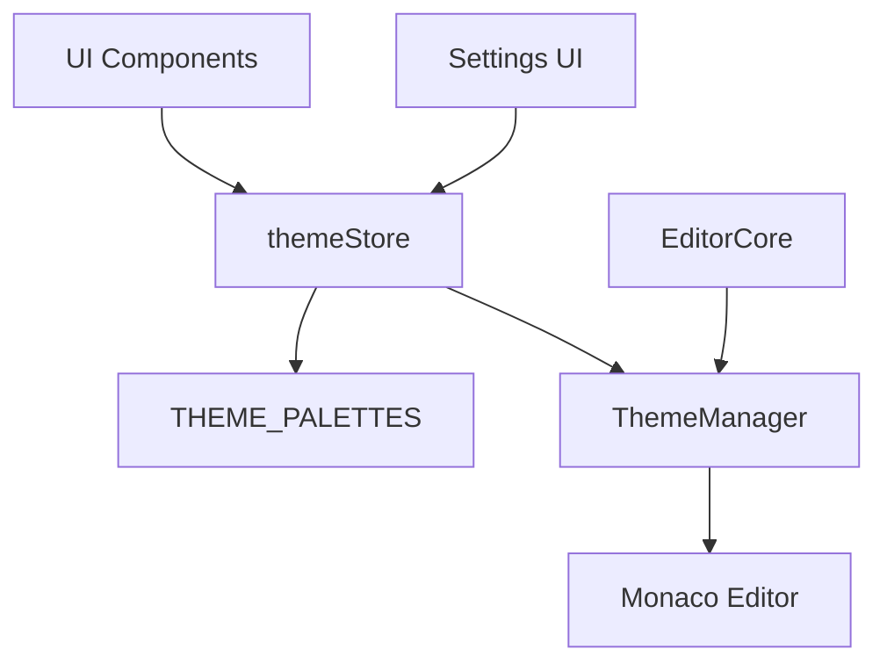
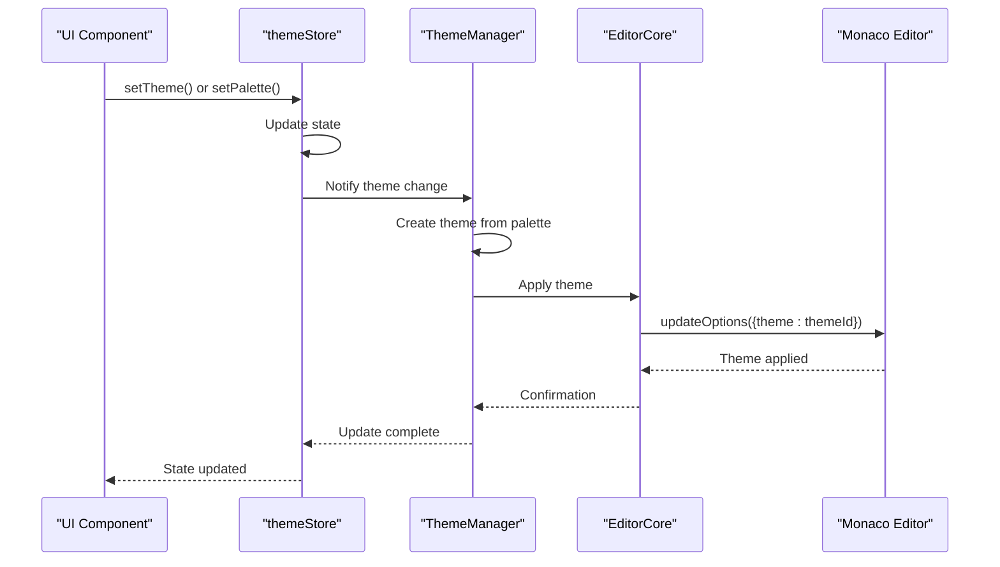
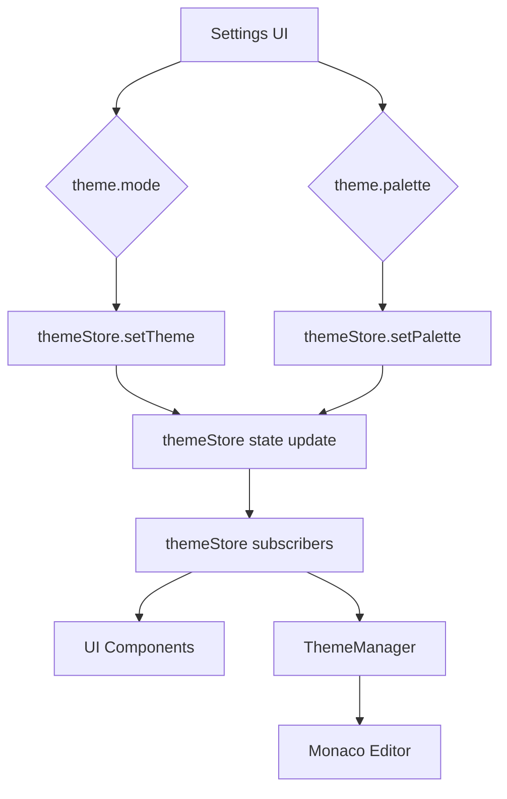
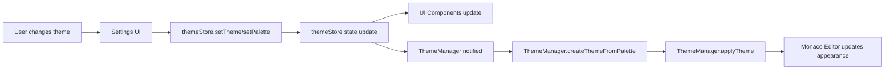

# Theme Management

<cite>
**Referenced Files in This Document**   
- [themeManager.ts](file://src/lib/editor/themeManager.ts)
- [themeStore.ts](file://src/lib/stores/themeStore.ts)
- [THEME_PALETTES.ts](file://src/lib/stores/THEME_PALETTES.ts)
- [EditorCore.ts](file://src/lib/editor/EditorCore.ts)
- [app.css](file://src/app.css)
</cite>

## Table of Contents
1. [Introduction](#introduction)
2. [Theme System Architecture](#theme-system-architecture)
3. [Core Components](#core-components)
4. [ThemeManager Implementation](#thememanager-implementation)
5. [Integration with EditorCore](#integration-with-editorcore)
6. [Theme Store and UI Integration](#theme-store-and-ui-integration)
7. [Custom Theme Management](#custom-theme-management)
8. [Popular Theme Loading](#popular-theme-loading)
9. [Theme Synchronization](#theme-synchronization)
10. [Configuration and Customization](#configuration-and-customization)
11. [Troubleshooting](#troubleshooting)

## Introduction
The theme management system in the NC code editor provides a comprehensive solution for managing visual themes across the application interface and the Monaco Editor. This system enables seamless integration between the application's design system and the code editor's syntax highlighting, ensuring a consistent user experience. The architecture is built around three core components: the ThemeManager, themeStore, and THEME_PALETTES, which work together to manage theme registration, loading, and application. This documentation provides a detailed explanation of the implementation, focusing on how themes are defined, loaded, and synchronized between the UI and editor components.

## Theme System Architecture
The theme management system follows a layered architecture with clear separation of concerns. At the foundation are the color palettes defined in THEME_PALETTES, which serve as the single source of truth for all color values in the application. Above this layer, the themeStore manages the application's current theme state, including the active mode (light/dark) and selected palette. The ThemeManager acts as the bridge between the application's theme system and the Monaco Editor, translating the application's design system into editor themes that can be applied to the code editor.



**Diagram sources**
- [themeStore.ts](file://src/lib/stores/themeStore.ts)
- [THEME_PALETTES.ts](file://src/lib/stores/THEME_PALETTES.ts)
- [themeManager.ts](file://src/lib/editor/themeManager.ts)

**Section sources**
- [themeManager.ts](file://src/lib/editor/themeManager.ts)
- [themeStore.ts](file://src/lib/stores/themeStore.ts)
- [THEME_PALETTES.ts](file://src/lib/stores/THEME_PALETTES.ts)

## Core Components
The theme management system consists of three primary components that work together to provide a cohesive theming experience. The THEME_PALETTES module defines the approved color palettes for both light and dark modes, ensuring design consistency across the application. The themeStore is a Svelte store that manages the application's current theme state, serving as the single source of truth for theme-related data. The ThemeManager class handles the integration with the Monaco Editor, creating and applying themes based on the application's current state.

The system supports multiple theme types: built-in Monaco themes, popular community themes, and custom themes created from the application's design system. This flexibility allows users to choose from a wide range of visual styles while maintaining the ability to create themes that align with the application's design language. The architecture ensures that theme changes are propagated consistently across both the UI and editor components.

**Section sources**
- [themeManager.ts](file://src/lib/editor/themeManager.ts)
- [themeStore.ts](file://src/lib/stores/themeStore.ts)
- [THEME_PALETTES.ts](file://src/lib/stores/THEME_PALETTES.ts)

## ThemeManager Implementation
The ThemeManager class is responsible for managing themes in the Monaco Editor. It provides methods for initializing the theme system, registering both built-in and custom themes, and applying themes to the editor. The class maintains a collection of custom themes in a Map data structure, allowing for efficient theme retrieval and management. When initialized, the ThemeManager receives a reference to the Monaco editor instance, which it uses to interact with the editor's theme system.

The ThemeManager implements several key methods for theme management. The `registerCustomTheme` method accepts a JSON string representing a custom theme, validates its structure, and registers it with the Monaco editor. The `applyTheme` method applies a specified theme to the editor, updating both the editor's appearance and the internal state to track the currently active theme. The `getAvailableThemes` method returns a comprehensive list of all available themes, including built-in themes, popular community themes, and user-defined custom themes.

```mermaid
classDiagram
class ThemeManager {
-monaco : typeof monaco
-customThemes : Map~string, CustomTheme~
-currentThemeId : string
-initialized : boolean
-themesLoaded : boolean
+initialize(monacoInstance) : void
+isInitialized() : boolean
+areThemesLoaded() : boolean
+registerBuiltInTheme(themeId) : void
+registerCustomTheme(themeJson) : {success : boolean, error? : string, themeId? : string}
+applyTheme(themeId) : boolean
+getAvailableThemes() : {id : string, name : string, type : 'built-in' | 'custom' | 'popular'}[]
+exportTheme(themeId) : string | null
+removeCustomTheme(themeId) : boolean
+getCurrentTheme() : string | null
+createThemeFromPalette(paletteId) : CustomTheme
+loadPopularThemes() : Promise~void~
}
class CustomTheme {
+name : string
+base : 'vs' | 'vs-dark' | 'hc-black' | 'hc-light'
+inherit : boolean
+rules : {token : string, foreground? : string, background? : string, fontStyle? : string}[]
+colors : Record~string, string~
}
ThemeManager --> CustomTheme : "manages"
```

**Diagram sources**
- [themeManager.ts](file://src/lib/editor/themeManager.ts)

**Section sources**
- [themeManager.ts](file://src/lib/editor/themeManager.ts)

## Integration with EditorCore
The ThemeManager integrates with the EditorCore class to ensure that theme changes are properly applied to the Monaco Editor instance. When the editor is initialized, the ThemeManager is also initialized with a reference to the Monaco editor instance, establishing the connection between the theme system and the editor. The EditorCore's configure method uses the ThemeManager to apply theme settings when editor options are updated.

The integration follows a reactive pattern where theme changes in the application state trigger corresponding updates in the editor. When the user changes the theme through the settings interface, the themeStore updates its state, which in turn triggers the ThemeManager to apply the new theme to the editor. This ensures that the editor's appearance remains synchronized with the application's overall theme. The EditorCore also handles the initial theme setup when a new editor instance is created, ensuring that the correct theme is applied from the start.



**Diagram sources**
- [themeManager.ts](file://src/lib/editor/themeManager.ts)
- [EditorCore.ts](file://src/lib/editor/EditorCore.ts)
- [themeStore.ts](file://src/lib/stores/themeStore.ts)

**Section sources**
- [themeManager.ts](file://src/lib/editor/themeManager.ts)
- [EditorCore.ts](file://src/lib/editor/EditorCore.ts)

## Theme Store and UI Integration
The themeStore serves as the central state management system for theme-related data in the application. Implemented as a Svelte store, it provides a reactive interface for components to subscribe to theme changes and update their appearance accordingly. The store maintains the current theme mode (light/dark) and the selected palette, exposing methods to update these values. It also provides a getState method that returns the current theme state synchronously, which is useful for initialization scenarios.

The UI integration is facilitated through the settings registry, which defines the theme-related settings that appear in the application's settings interface. The 'theme.mode' setting controls the light/dark mode toggle, while the 'theme.palette' setting allows users to select from available color palettes. These settings are connected to the themeStore through getter and setter functions that read from and write to the store's state. When the user interacts with these settings, the themeStore updates its state, triggering updates across all subscribed components, including the editor.



**Diagram sources**
- [themeStore.ts](file://src/lib/stores/themeStore.ts)
- [registry.ts](file://src/lib/settings/registry.ts)

**Section sources**
- [themeStore.ts](file://src/lib/stores/themeStore.ts)
- [registry.ts](file://src/lib/settings/registry.ts)

## Custom Theme Management
The theme management system provides robust support for custom themes, allowing users to create and manage their own editor themes. Custom themes are defined using the CustomTheme interface, which specifies the theme's name, base theme, inheritance behavior, token rules, and color mappings. The ThemeManager's registerCustomTheme method accepts a JSON string representing a custom theme, parses it, validates its structure, and registers it with the Monaco editor.

When a custom theme is registered, the ThemeManager generates a unique ID for the theme and stores the theme definition in an internal Map. This allows for efficient theme retrieval and management. Users can export custom themes to JSON format using the exportTheme method, enabling theme sharing and backup. Custom themes can also be removed using the removeCustomTheme method, which deletes the theme from the internal collection and removes it from the editor's theme registry.

The system also supports creating custom themes based on the application's color palettes using the createThemeFromPalette method. This method generates a Monaco theme that aligns with the application's design system, ensuring visual consistency between the UI and editor. The generated theme uses the palette's background levels and text color to define editor-specific colors such as background, foreground, and selection colors.

**Section sources**
- [themeManager.ts](file://src/lib/editor/themeManager.ts)

## Popular Theme Loading
The ThemeManager includes functionality for loading popular community themes from the monaco-themes package. These themes, including Monokai, Dracula, Nord, and others, are loaded asynchronously using dynamic imports to avoid blocking the editor's initialization. The loadPopularThemes method runs in the background, fetching theme definitions and registering them with the Monaco editor without impacting the user experience.

The loading process uses a collection of theme loaders, each responsible for importing a specific theme file. These loaders are executed in parallel using Promise.all, maximizing efficiency. If a theme fails to load, the error is logged as a warning, but the process continues with the remaining themes. This fault-tolerant approach ensures that the failure to load one theme does not prevent other themes from being available. Once all themes have been processed, the themesLoaded flag is set to true, indicating that the popular themes are ready for use.

The popular themes are exposed through the getAvailableThemes method, which includes them in the list of available themes with a 'popular' type designation. This allows the UI to present these themes appropriately, distinguishing them from built-in and custom themes. The asynchronous loading approach ensures that the editor remains responsive during startup while still providing access to a wide range of popular themes.

**Section sources**
- [themeManager.ts](file://src/lib/editor/themeManager.ts)

## Theme Synchronization
Theme synchronization between the UI and editor is achieved through a combination of reactive state management and event-driven updates. The themeStore serves as the single source of truth for theme state, with both the UI components and ThemeManager subscribing to changes. When the user changes the theme through the settings interface, the themeStore updates its state, which triggers updates in all subscribed components.

The ThemeManager listens for theme state changes and responds by creating and applying the appropriate editor theme. The getMonacoThemeId function plays a crucial role in this process, determining the correct theme ID based on the current theme state and any editor-specific theme overrides. If an editor theme is explicitly set, it takes precedence over the application theme; otherwise, the theme follows the palette from the ThemeState, using the format 'nova-${palette}'.

This synchronization mechanism ensures that theme changes are applied consistently across the entire application. The system also handles edge cases such as editor initialization, where the current theme must be applied to a newly created editor instance, and theme loading delays, where the editor may need to wait for popular themes to become available before applying certain theme selections.



**Diagram sources**
- [themeManager.ts](file://src/lib/editor/themeManager.ts)
- [themeStore.ts](file://src/lib/stores/themeStore.ts)

**Section sources**
- [themeManager.ts](file://src/lib/editor/themeManager.ts)
- [themeStore.ts](file://src/lib/stores/themeStore.ts)

## Configuration and Customization
The theme management system provides several configuration options for customizing theme behavior and appearance. The primary configuration point is the settings interface, which exposes theme-related settings such as theme mode and palette selection. These settings are defined in the settings registry and connected to the themeStore, allowing users to customize the application's appearance through a user-friendly interface.

For developers implementing custom themes, the system provides the CustomTheme interface and associated methods in the ThemeManager class. Custom themes can be created programmatically or imported from JSON, allowing for flexible theme development and sharing. The createThemeFromPalette method enables developers to generate themes that align with the application's design system, ensuring visual consistency.

The system also supports theme inheritance, allowing custom themes to extend built-in themes (vs, vs-dark, hc-black, hc-light) and modify specific aspects while preserving the base theme's characteristics. This inheritance model reduces duplication and makes it easier to create variations of existing themes. The theme system's modular design allows for easy extension, enabling developers to add new theme sources or modify the theme loading process as needed.

**Section sources**
- [themeManager.ts](file://src/lib/editor/themeManager.ts)
- [registry.ts](file://src/lib/settings/registry.ts)

## Troubleshooting
Common issues related to theme rendering typically involve theme loading failures, synchronization problems between the UI and editor, or incorrect theme application. When a custom theme fails to load, the most common causes are invalid JSON structure or missing required fields in the theme definition. The registerCustomTheme method includes validation to detect these issues and returns descriptive error messages to help diagnose the problem.

Theme synchronization issues may occur when the editor is initialized before the theme system is fully ready. This can be addressed by ensuring that the ThemeManager is properly initialized with the Monaco editor instance before attempting to apply themes. The isInitialized and areThemesLoaded methods can be used to check the readiness state of the theme system before performing operations.

For issues with popular theme loading, the asynchronous nature of the loadPopularThemes method means that themes may not be immediately available after editor initialization. Applications should handle this by either waiting for themes to load before offering them as options or providing a mechanism to retry loading failed themes. The themesLoaded flag can be monitored to determine when popular themes are ready for use.

Performance issues related to theme management are generally minimal due to the efficient implementation, but excessive theme registration or frequent theme switching could impact performance. In such cases, applications should consider caching frequently used themes and minimizing unnecessary theme operations.

**Section sources**
- [themeManager.ts](file://src/lib/editor/themeManager.ts)