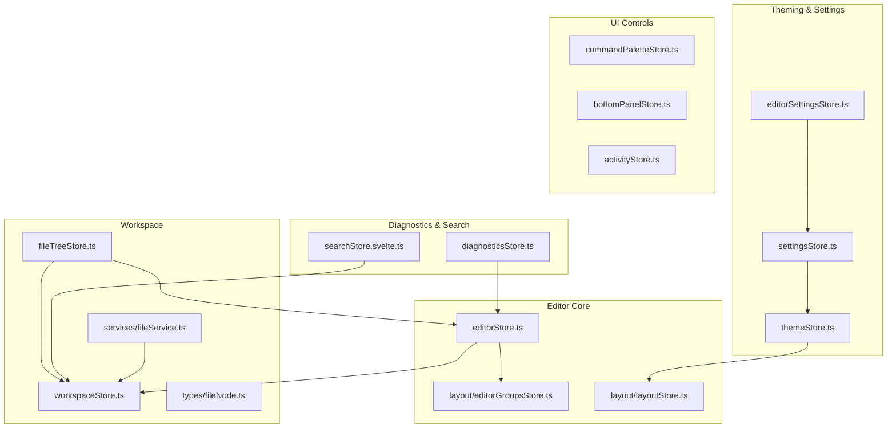
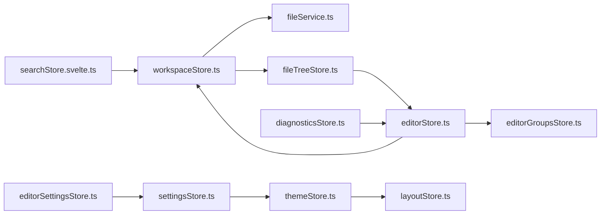
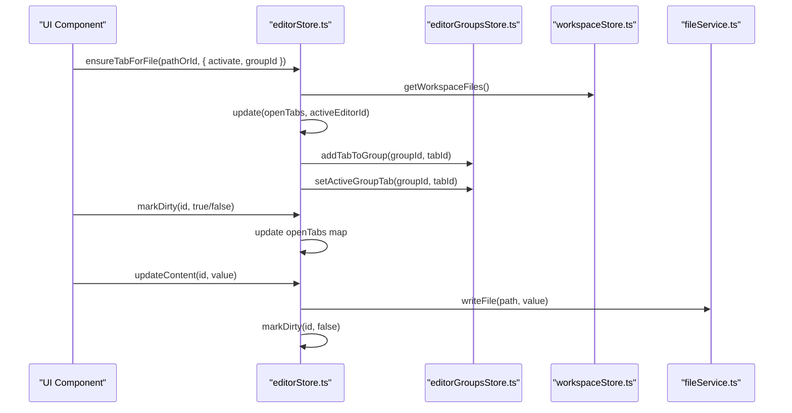
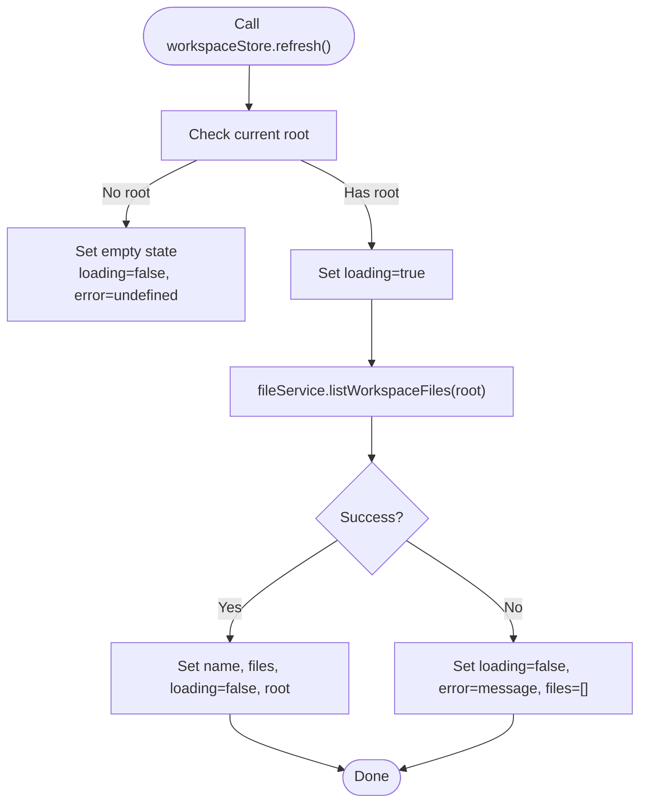
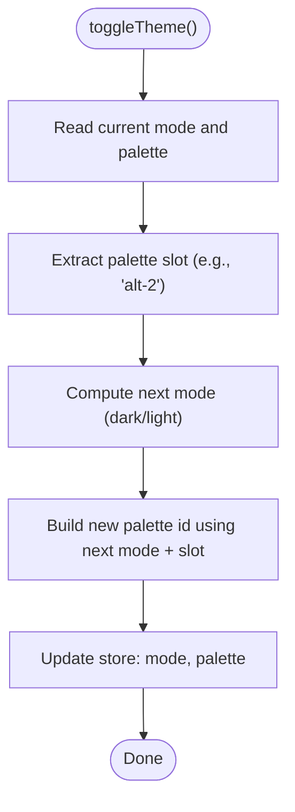
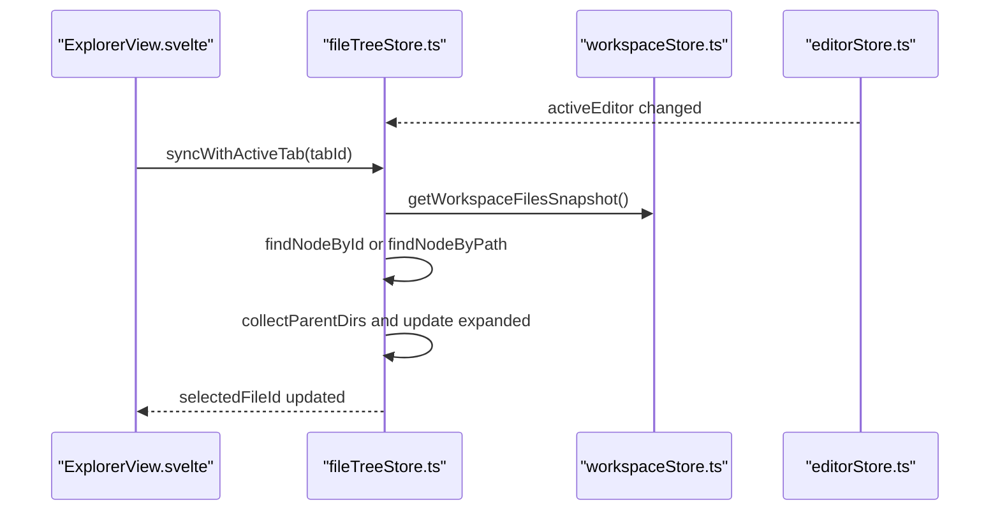
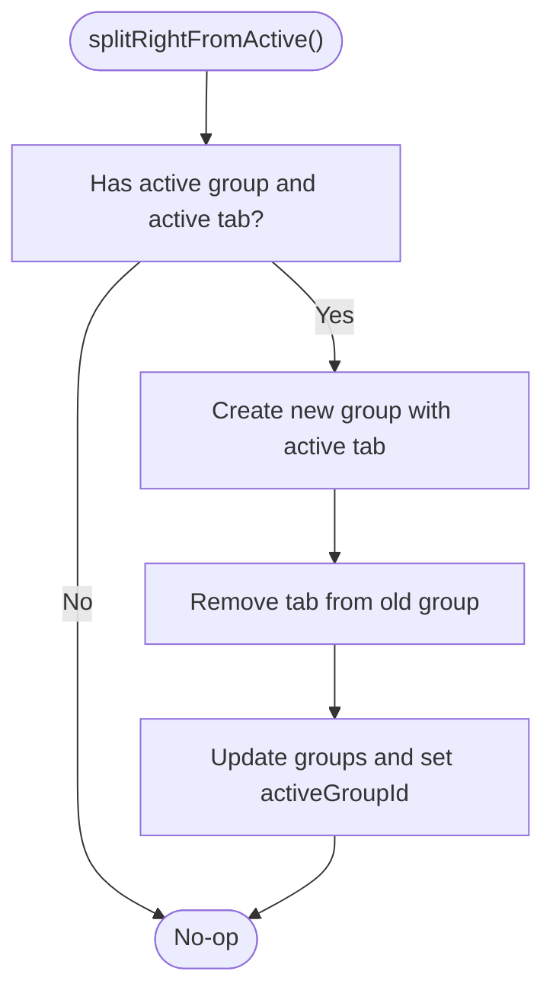
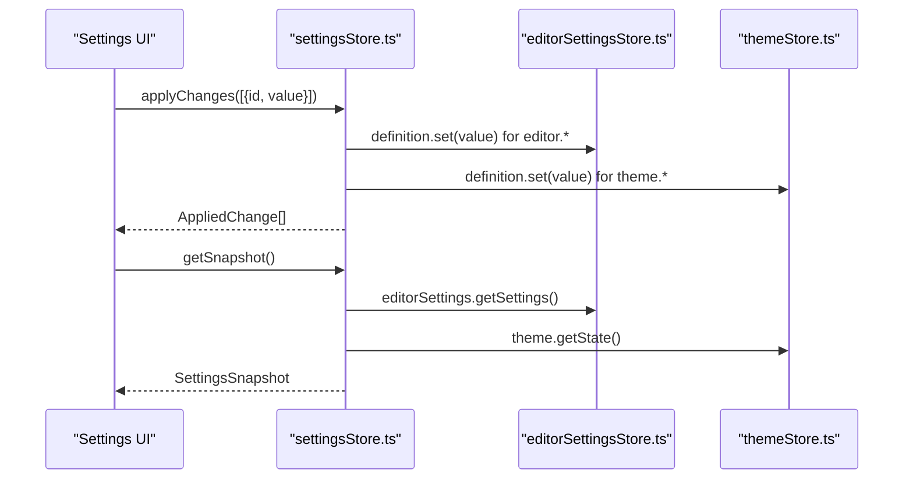
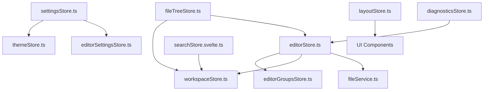

# State Management

<cite>
**Referenced Files in This Document**
- [editorStore.ts](file://src/lib/stores/editorStore.ts)
- [workspaceStore.ts](file://src/lib/stores/workspaceStore.ts)
- [themeStore.ts](file://src/lib/stores/themeStore.ts)
- [fileTreeStore.ts](file://src/lib/stores/fileTreeStore.ts)
- [editorGroupsStore.ts](file://src/lib/stores/layout/editorGroupsStore.ts)
- [layoutStore.ts](file://src/lib/stores/layout/layoutStore.ts)
- [settingsStore.ts](file://src/lib/stores/settingsStore.ts)
- [editorSettingsStore.ts](file://src/lib/stores/editorSettingsStore.ts)
- [fileService.ts](file://src/lib/services/fileService.ts)
- [fileNode.ts](file://src/lib/types/fileNode.ts)
- [diagnosticsStore.ts](file://src/lib/stores/diagnosticsStore.ts)
- [searchStore.svelte.ts](file://src/lib/stores/searchStore.svelte.ts)
- [commandPaletteStore.ts](file://src/lib/stores/commandPaletteStore.ts)
- [bottomPanelStore.ts](file://src/lib/stores/bottomPanelStore.ts)
- [activityStore.ts](file://src/lib/stores/activityStore.ts)
</cite>

## Table of Contents

1. [Introduction](#introduction)
2. [Project Structure](#project-structure)
3. [Core Components](#core-components)
4. [Architecture Overview](#architecture-overview)
5. [Detailed Component Analysis](#detailed-component-analysis)
6. [Dependency Analysis](#dependency-analysis)
7. [Performance Considerations](#performance-considerations)
8. [Troubleshooting Guide](#troubleshooting-guide)
9. [Conclusion](#conclusion)
10. [Appendices](#appendices)

## Introduction

This document explains the Svelte-based reactive state management system in the NC code editor. It focuses on how editor state, workspace state, theme state, and file tree state are modeled and synchronized using writable and derived stores. It also documents the data flow from user interactions to store updates and UI reactivity, with concrete examples from the key store files. Finally, it covers relationships between stores, performance considerations, and best practices for extending the system.

## Project Structure

The state management is organized around focused store modules under src/lib/stores, grouped by domain:

- Editor and layout: editorStore.ts, layout/editorGroupsStore.ts, layout/layoutStore.ts
- Workspace and file system: workspaceStore.ts, fileTreeStore.ts, services/fileService.ts, types/fileNode.ts
- Theming and settings: themeStore.ts, editorSettingsStore.ts, settingsStore.ts
- Diagnostics and search: diagnosticsStore.ts, searchStore.svelte.ts
- UI toggles and navigation: commandPaletteStore.ts, bottomPanelStore.ts, activityStore.ts

**Diagram sources**

- [editorStore.ts](file://src/lib/stores/editorStore.ts#L1-L381)
- [editorGroupsStore.ts](file://src/lib/stores/layout/editorGroupsStore.ts#L1-L413)
- [workspaceStore.ts](file://src/lib/stores/workspaceStore.ts#L1-L130)
- [fileTreeStore.ts](file://src/lib/stores/fileTreeStore.ts#L1-L290)
- [fileService.ts](file://src/lib/services/fileService.ts#L1-L85)
- [fileNode.ts](file://src/lib/types/fileNode.ts#L1-L19)
- [themeStore.ts](file://src/lib/stores/themeStore.ts#L1-L120)
- [editorSettingsStore.ts](file://src/lib/stores/editorSettingsStore.ts#L1-L180)
- [settingsStore.ts](file://src/lib/stores/settingsStore.ts#L1-L313)
- [diagnosticsStore.ts](file://src/lib/stores/diagnosticsStore.ts#L1-L142)
- [searchStore.svelte.ts](file://src/lib/stores/searchStore.svelte.ts#L1-L314)
- [layoutStore.ts](file://src/lib/stores/layout/layoutStore.ts#L1-L131)
- [commandPaletteStore.ts](file://src/lib/stores/commandPaletteStore.ts#L1-L29)
- [bottomPanelStore.ts](file://src/lib/stores/bottomPanelStore.ts#L1-L24)
- [activityStore.ts](file://src/lib/stores/activityStore.ts#L1-L19)

**Section sources**

- [editorStore.ts](file://src/lib/stores/editorStore.ts#L1-L381)
- [workspaceStore.ts](file://src/lib/stores/workspaceStore.ts#L1-L130)
- [themeStore.ts](file://src/lib/stores/themeStore.ts#L1-L120)
- [fileTreeStore.ts](file://src/lib/stores/fileTreeStore.ts#L1-L290)
- [editorGroupsStore.ts](file://src/lib/stores/layout/editorGroupsStore.ts#L1-L413)
- [layoutStore.ts](file://src/lib/stores/layout/layoutStore.ts#L1-L131)
- [settingsStore.ts](file://src/lib/stores/settingsStore.ts#L1-L313)
- [editorSettingsStore.ts](file://src/lib/stores/editorSettingsStore.ts#L1-L180)
- [fileService.ts](file://src/lib/services/fileService.ts#L1-L85)
- [fileNode.ts](file://src/lib/types/fileNode.ts#L1-L19)
- [diagnosticsStore.ts](file://src/lib/stores/diagnosticsStore.ts#L1-L142)
- [searchStore.svelte.ts](file://src/lib/stores/searchStore.svelte.ts#L1-L314)
- [commandPaletteStore.ts](file://src/lib/stores/commandPaletteStore.ts#L1-L29)
- [bottomPanelStore.ts](file://src/lib/stores/bottomPanelStore.ts#L1-L24)
- [activityStore.ts](file://src/lib/stores/activityStore.ts#L1-L19)

## Core Components

- Editor state: manages open tabs, active tab, dirty flags, and editor configuration. See [editorStore.ts](file://src/lib/stores/editorStore.ts#L1-L381).
- Workspace state: maintains workspace files, loading/error state, and watcher integration. See [workspaceStore.ts](file://src/lib/stores/workspaceStore.ts#L1-L130).
- Theme state: centralizes theme mode and palette selection. See [themeStore.ts](file://src/lib/stores/themeStore.ts#L1-L120).
- File tree state: tracks expanded/collapsed directories and selected file, synchronizing with the active editor. See [fileTreeStore.ts](file://src/lib/stores/fileTreeStore.ts#L1-L290).
- Editor groups: controls how tabs are distributed across groups/splits. See [editorGroupsStore.ts](file://src/lib/stores/layout/editorGroupsStore.ts#L1-L413).
- Layout state: global UI layout visibility and sizes. See [layoutStore.ts](file://src/lib/stores/layout/layoutStore.ts#L1-L131).
- Settings orchestration: aggregates domain stores into a single readable snapshot. See [settingsStore.ts](file://src/lib/stores/settingsStore.ts#L1-L313).
- Editor settings: Monaco-specific preferences. See [editorSettingsStore.ts](file://src/lib/stores/editorSettingsStore.ts#L1-L180).
- Diagnostics: counts for status bar based on active editor. See [diagnosticsStore.ts](file://src/lib/stores/diagnosticsStore.ts#L1-L142).
- Search: inline and project-wide search state. See [searchStore.svelte.ts](file://src/lib/stores/searchStore.svelte.ts#L1-L314).
- UI toggles: command palette, bottom panel, and activity bar. See [commandPaletteStore.ts](file://src/lib/stores/commandPaletteStore.ts#L1-L29), [bottomPanelStore.ts](file://src/lib/stores/bottomPanelStore.ts#L1-L24), [activityStore.ts](file://src/lib/stores/activityStore.ts#L1-L19).

**Section sources**

- [editorStore.ts](file://src/lib/stores/editorStore.ts#L1-L381)
- [workspaceStore.ts](file://src/lib/stores/workspaceStore.ts#L1-L130)
- [themeStore.ts](file://src/lib/stores/themeStore.ts#L1-L120)
- [fileTreeStore.ts](file://src/lib/stores/fileTreeStore.ts#L1-L290)
- [editorGroupsStore.ts](file://src/lib/stores/layout/editorGroupsStore.ts#L1-L413)
- [layoutStore.ts](file://src/lib/stores/layout/layoutStore.ts#L1-L131)
- [settingsStore.ts](file://src/lib/stores/settingsStore.ts#L1-L313)
- [editorSettingsStore.ts](file://src/lib/stores/editorSettingsStore.ts#L1-L180)
- [diagnosticsStore.ts](file://src/lib/stores/diagnosticsStore.ts#L1-L142)
- [searchStore.svelte.ts](file://src/lib/stores/searchStore.svelte.ts#L1-L314)
- [commandPaletteStore.ts](file://src/lib/stores/commandPaletteStore.ts#L1-L29)
- [bottomPanelStore.ts](file://src/lib/stores/bottomPanelStore.ts#L1-L24)
- [activityStore.ts](file://src/lib/stores/activityStore.ts#L1-L19)

## Architecture Overview

The system separates concerns:

- editorStore: the single source of truth for tab models and dirty flags.
- editorGroupsStore: the single source of truth for tab distribution across groups/splits.
- fileTreeStore: UI state for the explorer, synchronized with active editor.
- workspaceStore: file system tree and watcher integration.
- themeStore and editorSettingsStore: theming and editor preferences.
- settingsStore: orchestrates domain snapshots and applies changes.
- layoutStore: global UI layout visibility and sizing.
- Diagnostics and search stores integrate with editor and workspace.

**Diagram sources**

- [workspaceStore.ts](file://src/lib/stores/workspaceStore.ts#L1-L130)
- [fileTreeStore.ts](file://src/lib/stores/fileTreeStore.ts#L1-L290)
- [editorStore.ts](file://src/lib/stores/editorStore.ts#L1-L381)
- [editorGroupsStore.ts](file://src/lib/stores/layout/editorGroupsStore.ts#L1-L413)
- [themeStore.ts](file://src/lib/stores/themeStore.ts#L1-L120)
- [layoutStore.ts](file://src/lib/stores/layout/layoutStore.ts#L1-L131)
- [editorSettingsStore.ts](file://src/lib/stores/editorSettingsStore.ts#L1-L180)
- [settingsStore.ts](file://src/lib/stores/settingsStore.ts#L1-L313)
- [diagnosticsStore.ts](file://src/lib/stores/diagnosticsStore.ts#L1-L142)
- [searchStore.svelte.ts](file://src/lib/stores/searchStore.svelte.ts#L1-L314)
- [fileService.ts](file://src/lib/services/fileService.ts#L1-L85)

## Detailed Component Analysis

### Editor Store: Managing Open Tabs and Editor Configurations

- Purpose: Single source of truth for EditorTab models, active tab, and dirty flags. Also integrates with editor groups.
- Key APIs:
  - ensureTabForFile(pathOrId, opts?): Creates or activates a tab; adds to group and sets active tab.
  - openFile(fileId): Legacy API to open a file and activate it.
  - setActiveEditor(fileId): Sets active tab without adding.
  - closeEditor(fileId): Removes tab and cleans up group membership.
  - markDirty(id, isDirty): Updates dirty flag for a tab.
  - updateContent(id, value): Persists content via fileService and clears dirty flag.
  - openSettings(): Opens a special “Settings” tab.
- Derived store: activeEditor (Readable<EditorTab | null>) selects the active tab from editorStore.
- Integration: Uses workspaceStore’s getWorkspaceFiles to resolve files and fileService for persistence.

**Diagram sources**

- [editorStore.ts](file://src/lib/stores/editorStore.ts#L1-L381)
- [editorGroupsStore.ts](file://src/lib/stores/layout/editorGroupsStore.ts#L1-L413)
- [workspaceStore.ts](file://src/lib/stores/workspaceStore.ts#L1-L130)
- [fileService.ts](file://src/lib/services/fileService.ts#L1-L85)

**Section sources**

- [editorStore.ts](file://src/lib/stores/editorStore.ts#L1-L381)

### Workspace Store: File Tree and Watcher

- Purpose: Maintains workspace files, loading state, and error state; exposes refresh/open/close folder and path resolution.
- Key APIs:
  - refresh(): Reloads files from fileService.listWorkspaceFiles.
  - openFolder(root)/closeFolder(): Changes workspace root and reloads.
  - getWorkspaceFiles(): Snapshot utility to read current files.
  - resolvePath(relativePath): Builds absolute path from current root.
- Integration: Subscribes to fileService.onFileChange and starts file watcher.

**Diagram sources**

- [workspaceStore.ts](file://src/lib/stores/workspaceStore.ts#L1-L130)
- [fileService.ts](file://src/lib/services/fileService.ts#L1-L85)

**Section sources**

- [workspaceStore.ts](file://src/lib/stores/workspaceStore.ts#L1-L130)

### Theme Store: Theme Mode and Palette Synchronization

- Purpose: Centralizes theme mode and palette selection; ensures palette continuity across mode changes.
- Key APIs:
  - setTheme(mode): Switches mode while preserving palette slot.
  - toggleTheme(): Alternates between dark and light.
  - setPalette(paletteId): Selects a palette for the current mode.
  - getState(): Synchronous getter for initialization.

**Diagram sources**

- [themeStore.ts](file://src/lib/stores/themeStore.ts#L1-L120)

**Section sources**

- [themeStore.ts](file://src/lib/stores/themeStore.ts#L1-L120)

### File Tree Store: Explorer State and Active Tab Sync

- Purpose: Tracks expanded directories and selected file; synchronizes with active editor.
- Key APIs:
  - expand(id)/collapse(id)/toggleDir(id): Manage directory expansion.
  - selectFile(id): Select a file without opening a tab.
  - isExpanded(id): Check expansion state.
  - syncWithActiveTab(tabId): Aligns selection and expansion with active editor.
  - revealNode(node): Expand and select a given node.

**Diagram sources**

- [fileTreeStore.ts](file://src/lib/stores/fileTreeStore.ts#L1-L290)
- [workspaceStore.ts](file://src/lib/stores/workspaceStore.ts#L1-L130)
- [editorStore.ts](file://src/lib/stores/editorStore.ts#L1-L381)

**Section sources**

- [fileTreeStore.ts](file://src/lib/stores/fileTreeStore.ts#L1-L290)

### Editor Groups Store: Split View and Tab Distribution

- Purpose: Manages groups of tabs, active group/tab, and tab ordering/movement.
- Key APIs:
  - addTabToGroup(groupId, tabId), removeTab(tabId)
  - setActiveTab(groupId, tabId), setActiveGroup(groupId)
  - reorderTabsWithinGroup(groupId, fromIndex, toIndex)
  - moveTabToGroup(tabId, sourceGroupId, targetGroupId, targetIndex?)
  - splitRightFromActive(): Creates a new group with the active tab.
  - Helpers: getActiveGroup(), getActiveTab(), allGroupTabIds (derived).

**Diagram sources**

- [editorGroupsStore.ts](file://src/lib/stores/layout/editorGroupsStore.ts#L1-L413)

**Section sources**

- [editorGroupsStore.ts](file://src/lib/stores/layout/editorGroupsStore.ts#L1-L413)

### Layout Store: Global UI Layout

- Purpose: Centralizes visibility and sizing of left/right sidebars and bottom panel.
- Key APIs:
  - toggleLeftSidebar()/setLeftSidebarVisible()/setLeftSidebarWidth()
  - toggleRightSidebar()/setRightSidebarVisible()/setRightSidebarWidth()
  - toggleBottomPanel()/setBottomPanelHeight()

**Section sources**

- [layoutStore.ts](file://src/lib/stores/layout/layoutStore.ts#L1-L131)

### Settings Orchestration: Aggregated Snapshot and Change Application

- Purpose: Provides a single readable snapshot of settings and applies changes atomically.
- Key APIs:
  - getSnapshot(): Builds current snapshot from domain stores.
  - applyChanges(patch, meta?): Applies a batch of setting changes.
  - resetAll(meta?): Resets all settings to baseline.
  - getDirtyState(): Computes differences against baseline.
  - setBaselineFromCurrent(): Updates baseline.

**Diagram sources**

- [settingsStore.ts](file://src/lib/stores/settingsStore.ts#L1-L313)
- [editorSettingsStore.ts](file://src/lib/stores/editorSettingsStore.ts#L1-L180)
- [themeStore.ts](file://src/lib/stores/themeStore.ts#L1-L120)

**Section sources**

- [settingsStore.ts](file://src/lib/stores/settingsStore.ts#L1-L313)

### Diagnostics Store: Status Bar Counts

- Purpose: Aggregates Monaco diagnostics into counts for the active file.
- Key APIs:
  - initDiagnosticsTracking(): Initializes tracking.
  - updateDiagnosticsForFile(fileId, diagnostics[]): Updates raw diagnostics and triggers recalculation.
  - diagnosticsCount (derived): Provides aggregated counts for the active editor.

**Section sources**

- [diagnosticsStore.ts](file://src/lib/stores/diagnosticsStore.ts#L1-L142)

### Search Store: Inline and Project-wide Search

- Purpose: Manages inline search (Ctrl+F/Ctrl+H) and project-wide search (Ctrl+Shift+F) with Tauri events.
- Key APIs:
  - InlineSearchStore: showFind(), showReplace(), hide(), toggle(), setQuery(), setReplaceText(), toggleCaseSensitive(), toggleWholeWord(), toggleRegex(), reset().
  - ProjectSearchStore: search(root, query, options), cancel(), clear(), toggleCaseSensitive(), toggleRegex(), resultCount, isActive, dispose().

**Section sources**

- [searchStore.svelte.ts](file://src/lib/stores/searchStore.svelte.ts#L1-L314)

### UI Toggle Stores: Command Palette, Bottom Panel, Activity

- Purpose: Lightweight stores for UI toggles and navigation state.
- Key APIs:
  - commandPaletteOpen: openCommandPalette(), closeCommandPalette(), toggleCommandPalette()
  - bottomPanelStore: open(), close(), toggle()
  - activityStore: setActivity(activityId)

**Section sources**

- [commandPaletteStore.ts](file://src/lib/stores/commandPaletteStore.ts#L1-L29)
- [bottomPanelStore.ts](file://src/lib/stores/bottomPanelStore.ts#L1-L24)
- [activityStore.ts](file://src/lib/stores/activityStore.ts#L1-L19)

## Dependency Analysis

- editorStore depends on:
  - workspaceStore (via getWorkspaceFiles) for file resolution
  - editorGroupsStore for group membership and active tab routing
  - fileService for persistence
- fileTreeStore depends on:
  - workspaceStore for file tree snapshot
  - editorStore.activeEditor for synchronization
- themeStore and editorSettingsStore are consumed by settingsStore to build a unified snapshot.
- layoutStore is consumed by UI components for layout visibility and sizing.
- Diagnostics store depends on editorStore.activeEditor and Monaco markers.
- Search store depends on Tauri events and invokes backend commands.

**Diagram sources**

- [editorStore.ts](file://src/lib/stores/editorStore.ts#L1-L381)
- [editorGroupsStore.ts](file://src/lib/stores/layout/editorGroupsStore.ts#L1-L413)
- [workspaceStore.ts](file://src/lib/stores/workspaceStore.ts#L1-L130)
- [fileTreeStore.ts](file://src/lib/stores/fileTreeStore.ts#L1-L290)
- [settingsStore.ts](file://src/lib/stores/settingsStore.ts#L1-L313)
- [themeStore.ts](file://src/lib/stores/themeStore.ts#L1-L120)
- [editorSettingsStore.ts](file://src/lib/stores/editorSettingsStore.ts#L1-L180)
- [diagnosticsStore.ts](file://src/lib/stores/diagnosticsStore.ts#L1-L142)
- [searchStore.svelte.ts](file://src/lib/stores/searchStore.svelte.ts#L1-L314)
- [layoutStore.ts](file://src/lib/stores/layout/layoutStore.ts#L1-L131)
- [fileService.ts](file://src/lib/services/fileService.ts#L1-L85)

**Section sources**

- [editorStore.ts](file://src/lib/stores/editorStore.ts#L1-L381)
- [fileTreeStore.ts](file://src/lib/stores/fileTreeStore.ts#L1-L290)
- [settingsStore.ts](file://src/lib/stores/settingsStore.ts#L1-L313)
- [diagnosticsStore.ts](file://src/lib/stores/diagnosticsStore.ts#L1-L142)
- [searchStore.svelte.ts](file://src/lib/stores/searchStore.svelte.ts#L1-L314)
- [layoutStore.ts](file://src/lib/stores/layout/layoutStore.ts#L1-L131)

## Performance Considerations

- Minimize unnecessary writes:
  - Prefer immutable updates (e.g., spread arrays/maps) to keep derived computations efficient.
  - Batch updates when possible (e.g., ensureTabForFile performs a single update).
- Derived stores:
  - Keep derived computations pure and fast; avoid heavy work inside derived getters.
  - Use memoized snapshots where appropriate (e.g., workspace snapshot in fileTreeStore).
- Subscription management:
  - settingsStore subscribes to domain stores; ensure teardown handlers are retained and cleaned up when components unmount.
  - searchStore registers Tauri listeners; dispose them on unmount to prevent leaks.
- File watchers:
  - workspaceStore sets up a file watcher; ensure it is stopped when no longer needed to avoid memory leaks.
- Large datasets:
  - fileTreeStore uses Set for expanded nodes; ensure normalization (e.g., path normalization) avoids redundant lookups.
- Avoid synchronous reads:
  - Use get() sparingly; prefer subscribing to derived stores for reactive updates.

[No sources needed since this section provides general guidance]

## Troubleshooting Guide

- Active tab not reflected in explorer:
  - Ensure syncWithActiveTab is invoked on activeEditor changes and that the file exists in the workspace tree.
  - Verify that the file path matches normalized paths.
- Closing a tab does not remove it from groups:
  - Confirm closeEditor calls removeTab in editorGroupsStore.
- Theme palette resets unexpectedly:
  - setTheme preserves palette slots; verify mode transitions and palette IDs.
- Settings changes not applied:
  - Ensure applyChanges receives valid setting IDs and values; check definition.set behavior.
- Search results not appearing:
  - Verify searchStore.search was called with a non-empty query and that Tauri listeners are registered.
- File watcher not triggering:
  - Confirm fileService.startFileWatcher and onFileChange subscriptions are active.

**Section sources**

- [fileTreeStore.ts](file://src/lib/stores/fileTreeStore.ts#L1-L290)
- [editorStore.ts](file://src/lib/stores/editorStore.ts#L1-L381)
- [themeStore.ts](file://src/lib/stores/themeStore.ts#L1-L120)
- [settingsStore.ts](file://src/lib/stores/settingsStore.ts#L1-L313)
- [searchStore.svelte.ts](file://src/lib/stores/searchStore.svelte.ts#L1-L314)
- [workspaceStore.ts](file://src/lib/stores/workspaceStore.ts#L1-L130)

## Conclusion

The NC code editor employs a clean separation of concerns across stores:

- editorStore and editorGroupsStore manage tab models and layout independently.
- fileTreeStore keeps UI state synchronized with active editor.
- workspaceStore provides file system state and watcher integration.
- themeStore and editorSettingsStore feed into settingsStore for a unified snapshot.
  This architecture yields predictable reactivity, clear boundaries, and scalable extension points.

[No sources needed since this section summarizes without analyzing specific files]

## Appendices

### Best Practices for Creating New Stores

- Use writable for mutable state and derived for computed state.
- Keep store logic pure; avoid side effects inside update callbacks.
- Provide controlled mutation APIs; expose only necessary functions.
- Use get() sparingly; prefer subscriptions for reactive updates.
- For multi-store coordination, derive from multiple stores or orchestrate via a higher-level store (as in settingsStore).
- Initialize with sensible defaults and expose getState/getSettings for imperative initialization.
- Clean up subscriptions and listeners to prevent memory leaks.

[No sources needed since this section provides general guidance]
