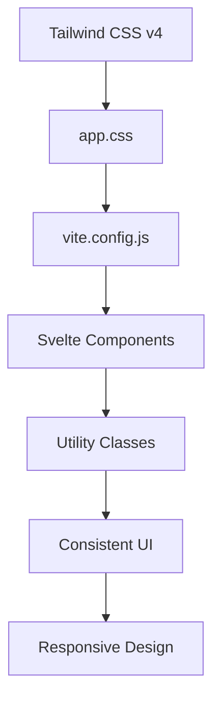
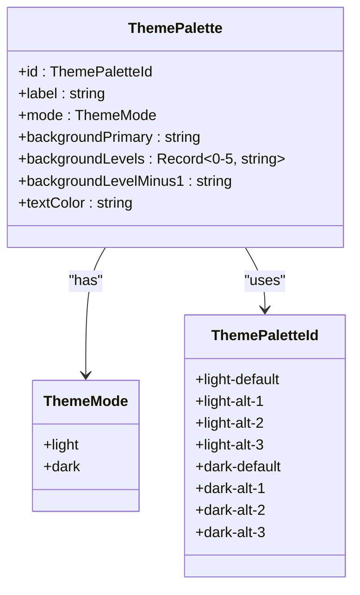
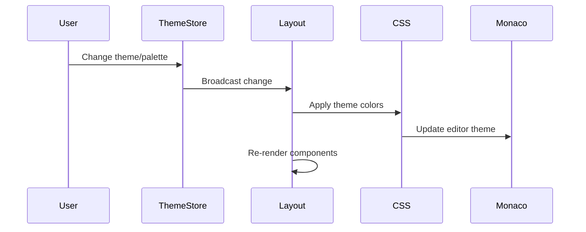
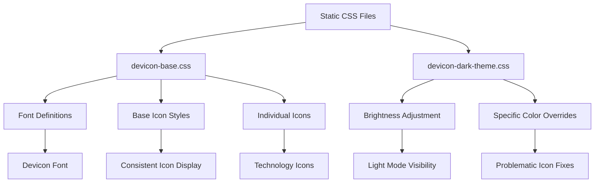
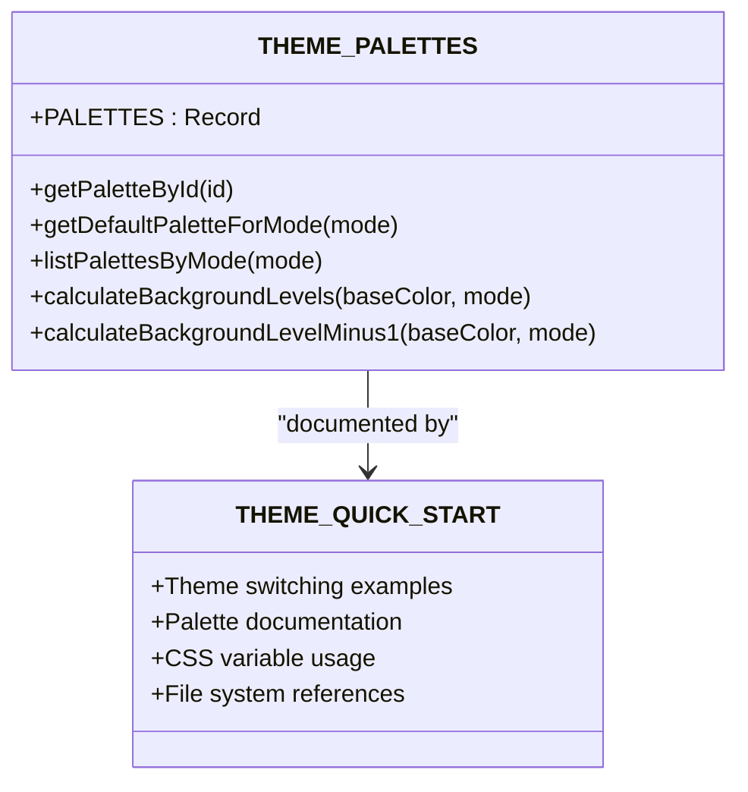
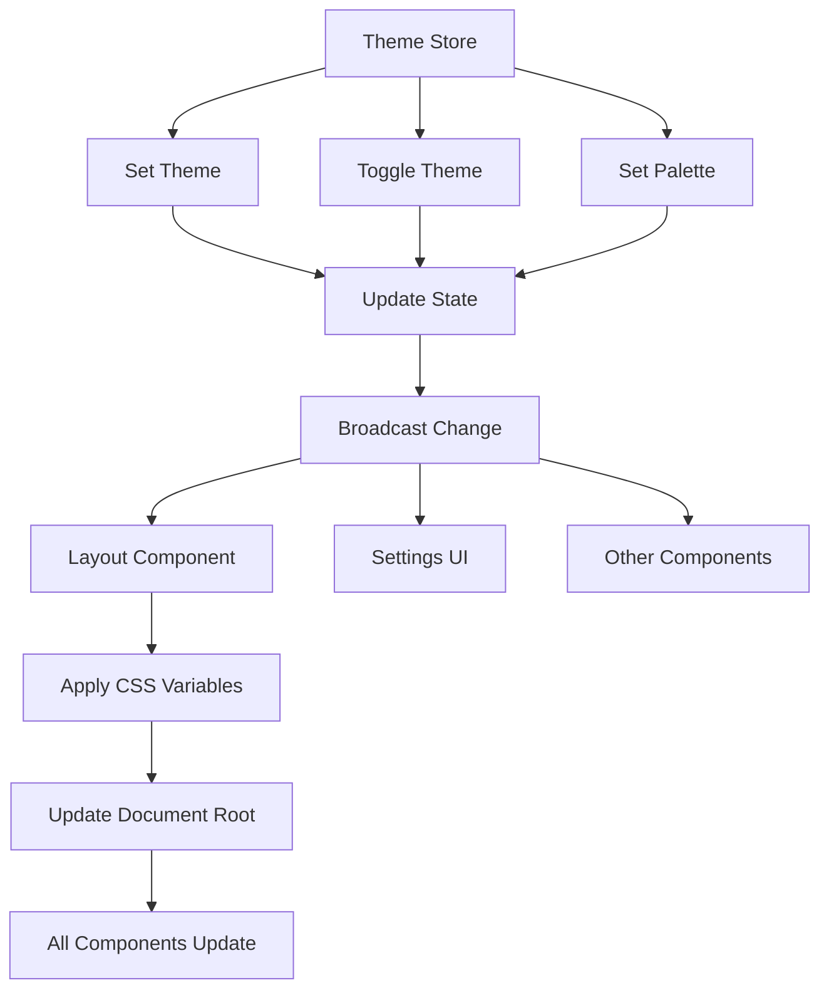
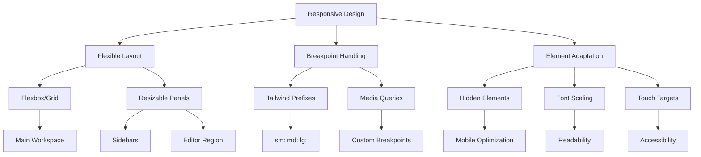
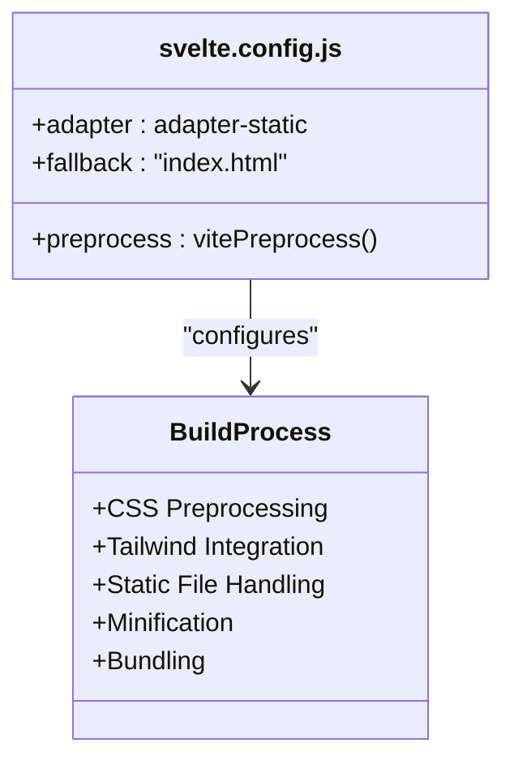

# Styling System

<cite>
**Referenced Files in This Document**   
- [app.css](file://src/app.css) - *Updated for Tailwind CSS v4 integration*
- [vite.config.js](file://vite.config.js) - *Updated with @tailwindcss/vite plugin*
- [svelte.config.js](file://svelte.config.js) - *Configuration for Svelte preprocessing*
- [devicon-base.css](file://static/devicon-base.css)
- [devicon-dark-theme.css](file://static/devicon-dark-theme.css)
- [THEME_PALETTES.ts](file://src/lib/stores/THEME_PALETTES.ts)
- [THEME_QUICK_START.ts](file://src/lib/stores/THEME_QUICK_START.ts)
- [themeStore.ts](file://src/lib/stores/themeStore.ts)
- [themeManager.ts](file://src/lib/editor/themeManager.ts)
- [+layout.svelte](file://src/routes/+layout.svelte)
- [registry.ts](file://src/lib/settings/registry.ts)
</cite>

## Update Summary
**Changes Made**   
- Updated Tailwind CSS integration from v3 to v4 with new configuration approach
- Migrated from tailwind.config.js to @theme inline in app.css
- Added @tailwindcss/vite plugin in vite.config.js
- Implemented modern styling practices with @import statements and tw-animate-css
- Removed deprecated PostCSS configuration
- Updated documentation to reflect new Tailwind v4 architecture

## Table of Contents
1. [Introduction](#introduction)
2. [Tailwind CSS Integration](#tailwind-css-integration)
3. [Global CSS Architecture](#global-css-architecture)
4. [Theme System Implementation](#theme-system-implementation)
5. [Dynamic Theme Application](#dynamic-theme-application)
6. [Static CSS Files](#static-css-files)
7. [Theme Configuration Files](#theme-configuration-files)
8. [Theme Store and UI Synchronization](#theme-store-and-ui-synchronization)
9. [Responsive Design](#responsive-design)
10. [Svelte Configuration](#svelte-configuration)

## Introduction
The NC code editor implements a sophisticated styling architecture that combines Tailwind CSS v4 for utility-first styling with a custom CSS system for global styles and theme management. The styling system is designed to provide a consistent, accessible, and highly customizable user interface that adapts to user preferences and screen sizes. This document details the implementation of the styling architecture, focusing on the integration of Tailwind CSS with Svelte components, the custom CSS architecture, the theme system using CSS custom properties, and how themes are dynamically applied based on user preferences.

**Section sources**
- [app.css](file://src/app.css#L1-L111)
- [svelte.config.js](file://svelte.config.js#L1-L19)

## Tailwind CSS Integration
The NC code editor leverages Tailwind CSS v4 as its primary styling framework, implementing a utility-first approach that allows for rapid UI development and consistent design patterns across components. Tailwind is integrated through the `app.css` file, which imports the core Tailwind functionality and extends it with custom utilities and theme definitions.

The integration is configured in the `vite.config.js` file, which sets up the Vite plugin for Tailwind CSS. This configuration enables the use of Tailwind's utility classes directly in Svelte component templates, allowing developers to style elements without writing custom CSS. The utility-first approach promotes consistency by using a predefined set of classes for spacing, typography, colors, and layout, reducing the need for custom CSS and minimizing style conflicts.

Tailwind's configuration is now defined inline within the `app.css` file using the `@theme inline` directive, replacing the previous `tailwind.config.js` file. This approach simplifies configuration management and enables direct access to CSS variables within the theme definition. The `@custom-variant` directive is used to define the dark mode variant, enabling conditional styling based on the application's theme state.



**Diagram sources**
- [app.css](file://src/app.css#L1-L111)
- [vite.config.js](file://vite.config.js#L1-L34)

**Section sources**
- [app.css](file://src/app.css#L1-L111)
- [vite.config.js](file://vite.config.js#L1-L34)

## Global CSS Architecture
The global CSS architecture in the NC code editor is centered around the `app.css` file, which serves as the foundation for all styling in the application. This file implements a layered approach to CSS, combining Tailwind's utility classes with custom CSS for global styles and component-specific overrides.

The architecture begins with the import of Tailwind CSS and additional utility libraries like `tw-animate-css`, establishing the base styling system. Following these imports, the file defines CSS custom properties (variables) for the application's color palette, typography, and spacing. These variables are organized in a structured hierarchy, with root-level variables for the light theme and `.dark` class overrides for the dark theme.

The global CSS architecture also includes a base layer that applies default styles to HTML elements using Tailwind's `@apply` directive. This ensures consistent styling across the application, with the body element inheriting background and text colors from the CSS variables defined in the root. The architecture supports component-specific overrides through carefully scoped selectors, allowing individual components to deviate from the default styling when necessary while maintaining overall consistency.

```mermaid
classDiagram
class app.css {
+@import "tailwindcss"
+@import "tw-animate-css"
+ : root { --variables }
+.dark { --dark-variables }
+@theme inline { --theme-variables }
+@layer base { * styles }
}
class GlobalStyles {
+Color Variables
+Typography
+Spacing
+Base Element Styles
}
app.css --> GlobalStyles : "defines"
```

**Diagram sources**
- [app.css](file://src/app.css#L1-L111)

**Section sources**
- [app.css](file://src/app.css#L1-L111)

## Theme System Implementation
The theme system in the NC code editor is implemented using CSS custom properties and a structured approach to theme management that allows for dynamic switching between light and dark modes. The system is built around the `THEME_PALETTES.ts` file, which defines the complete set of color palettes available in the application.

The theme system categorizes palettes by mode (light or dark) and provides a consistent interface for accessing theme data. Each palette includes a primary background color, text color, and a hierarchy of background levels that create visual depth in the UI. The system uses a calculated approach to generate these levels, adjusting brightness values based on the base color to ensure proper contrast and visual hierarchy.

For light themes, background levels become progressively darker, while dark themes use progressively lighter levels. This creates a consistent visual language across the application, with UI elements like cards, buttons, and hover states using specific levels from the hierarchy. The theme system also defines special colors for borders, accents, and interactive elements, ensuring a cohesive appearance across all components.



**Diagram sources**
- [THEME_PALETTES.ts](file://src/lib/stores/THEME_PALETTES.ts#L21-L314)

**Section sources**
- [THEME_PALETTES.ts](file://src/lib/stores/THEME_PALETTES.ts#L21-L314)

## Dynamic Theme Application
The dynamic theme application system in the NC code editor synchronizes UI appearance with user preferences through a combination of Svelte stores, CSS custom properties, and reactive updates. The system is centered around the `themeStore.ts` file, which manages the current theme state and broadcasts changes to all components.

When a user changes the theme or palette, the theme store updates its state and triggers a re-render of all subscribed components. The `+layout.svelte` file listens to these changes and applies the appropriate CSS custom properties to the document root, ensuring that the entire application updates consistently. This is achieved through the `applyThemeColors` function, which extracts color values from the selected palette and sets them as CSS variables.

The system uses a two-level approach to theme application: global CSS variables for broad styling and specific class names for targeted overrides. The document root receives a `theme-light` or `theme-dark` class, which enables theme-specific styling rules. Additionally, the `data-theme` attribute is set to reflect the current mode, allowing for attribute-based selectors in CSS.

For the Monaco editor, the system creates custom themes that match the UI theme by translating palette colors into editor-specific color tokens. This ensures visual consistency between the editor and the rest of the application, with syntax highlighting and UI elements adapting to the selected theme.



**Diagram sources**
- [themeStore.ts](file://src/lib/stores/themeStore.ts#L1-L120)
- [+layout.svelte](file://src/routes/+layout.svelte#L1-L478)
- [themeManager.ts](file://src/lib/editor/themeManager.ts#L1-L274)

**Section sources**
- [themeStore.ts](file://src/lib/stores/themeStore.ts#L1-L120)
- [+layout.svelte](file://src/routes/+layout.svelte#L1-L478)
- [themeManager.ts](file://src/lib/editor/themeManager.ts#L1-L274)

## Static CSS Files
The NC code editor includes static CSS files for specialized styling needs, particularly for third-party libraries and icon systems. The `static` directory contains two key files: `devicon-base.css` and `devicon-dark-theme.css`, which handle styling for the Devicon icon library.

The `devicon-base.css` file defines the core styles for Devicon icons, including font-face declarations, base icon styling, and individual icon rules. This file establishes the foundation for displaying technology icons throughout the application, with each icon defined by a CSS class that sets the appropriate Unicode character from the Devicon font.

The `devicon-dark-theme.css` file provides theme-specific overrides for Devicon icons, ensuring they display correctly in both light and dark modes. This file includes global filters to adjust icon brightness in light mode and specific color overrides for problematic icons that would otherwise be difficult to see against dark backgrounds. The overrides target specific icon classes and apply custom colors that maintain visual consistency with the overall theme.

These static files are included in the build process and loaded alongside the main application styles, providing a complete solution for icon display that integrates seamlessly with the dynamic theme system.



**Diagram sources**
- [devicon-base.css](file://static/devicon-base.css#L1-L3631)
- [devicon-dark-theme.css](file://static/devicon-dark-theme.css#L1-L69)

**Section sources**
- [devicon-base.css](file://static/devicon-base.css#L1-L3631)
- [devicon-dark-theme.css](file://static/devicon-dark-theme.css#L1-L69)

## Theme Configuration Files
The theme configuration in the NC code editor is managed through two key files: `THEME_PALETTES.ts` and `THEME_QUICK_START.ts`. These files work together to define the available color schemes and provide documentation for theme usage.

The `THEME_PALETTES.ts` file serves as the single source of truth for all color palettes in the application. It exports a `PALETTES` object that contains all available themes, organized by mode (light or dark). Each palette includes detailed color definitions, background level calculations, and utility functions for retrieving palettes by ID or mode. The file uses a functional approach to calculate background levels, ensuring consistent color progression across all palettes.

The `THEME_QUICK_START.ts` file provides documentation and examples for using the theme system. It includes code snippets demonstrating common operations like setting the theme, changing palettes, and subscribing to theme changes. This file also documents the available palettes, their color values, and the hierarchy of background levels used in the UI. Additionally, it lists the key files in the theme system, serving as a roadmap for developers working with the styling architecture.



**Diagram sources**
- [THEME_PALETTES.ts](file://src/lib/stores/THEME_PALETTES.ts#L1-L314)
- [THEME_QUICK_START.ts](file://src/lib/stores/THEME_QUICK_START.ts#L1-L135)

**Section sources**
- [THEME_PALETTES.ts](file://src/lib/stores/THEME_PALETTES.ts#L1-L314)
- [THEME_QUICK_START.ts](file://src/lib/stores/THEME_QUICK_START.ts#L1-L135)

## Theme Store and UI Synchronization
The theme store and UI synchronization system in the NC code editor ensures that all components respond consistently to theme changes. The `themeStore.ts` file implements a reactive store using Svelte's writable store, which maintains the current theme state and notifies subscribers of changes.

The store exposes methods for setting the theme mode, toggling between light and dark modes, and changing the color palette. When any of these methods are called, the store updates its internal state and triggers updates in all subscribed components. The store also preserves the "slot" of the current palette when switching modes, so if a user is using a dark alternative palette, switching to light mode will select the corresponding light alternative.

UI components synchronize with the theme store through Svelte's reactive syntax, automatically updating when the theme changes. The `+layout.svelte` file serves as the central point for theme application, listening to store changes and applying the appropriate CSS variables to the document root. This ensures that all components, including third-party libraries like Monaco editor, receive the updated theme information.

The settings system integrates with the theme store through the `registry.ts` file, which defines settings for theme mode and palette. These settings use the theme store's methods to get and set values, creating a seamless connection between the UI controls and the underlying theme state.



**Diagram sources**
- [themeStore.ts](file://src/lib/stores/themeStore.ts#L1-L120)
- [+layout.svelte](file://src/routes/+layout.svelte#L1-L478)
- [registry.ts](file://src/lib/settings/registry.ts#L1-L558)

**Section sources**
- [themeStore.ts](file://src/lib/stores/themeStore.ts#L1-L120)
- [+layout.svelte](file://src/routes/+layout.svelte#L1-L478)
- [registry.ts](file://src/lib/settings/registry.ts#L1-L558)

## Responsive Design
The responsive design system in the NC code editor ensures that the user interface adapts gracefully to different screen sizes and layouts. The system is built on a combination of Tailwind CSS's responsive utilities and custom CSS for layout management.

The layout is based on a flexible grid system that uses CSS flexbox and grid layouts to create a responsive workspace. The main application structure consists of a fixed-height titlebar, a flexible main area with sidebars, and a resizable editor region. The sidebars can be toggled and resized, with the right sidebar supporting drag-to-resize functionality.

Tailwind's responsive prefixes (such as `sm:`, `md:`, and `lg:`) are used throughout the application to adjust spacing, font sizes, and layout properties at different breakpoints. The system prioritizes usability on smaller screens by hiding non-essential elements and optimizing the use of available space.

The editor area and bottom panel are designed to work together responsively, with the bottom panel collapsing to a minimal height when space is limited. The tab system adapts to available width, showing scroll controls when tabs overflow the visible area. The command palette and other overlays are positioned to remain accessible regardless of screen size.



**Diagram sources**
- [+layout.svelte](file://src/routes/+layout.svelte#L1-L478)
- [app.css](file://src/app.css#L1-L111)

**Section sources**
- [+layout.svelte](file://src/routes/+layout.svelte#L1-L478)
- [app.css](file://src/app.css#L1-L111)

## Svelte Configuration
The Svelte configuration for CSS preprocessing and bundling is defined in the `svelte.config.js` file, which sets up the build process for the application's styles. The configuration uses Vite as the build tool, with the `vitePreprocess` function from `@sveltejs/vite-plugin-svelte` to handle CSS preprocessing.

The configuration is optimized for a static site deployment with fallback to `index.html`, enabling single-page application (SPA) mode. This setup allows for efficient CSS bundling and minification, with Tailwind CSS classes being processed and optimized during the build process.

The preprocessing configuration supports modern CSS features and integrates seamlessly with Tailwind CSS, enabling the use of directives like `@apply` and `@layer` in component styles. The build process also handles the inclusion of static CSS files from the `static` directory, ensuring they are properly bundled with the application.



**Diagram sources**
- [svelte.config.js](file://svelte.config.js#L1-L19)

**Section sources**
- [svelte.config.js](file://svelte.config.js#L1-L19)