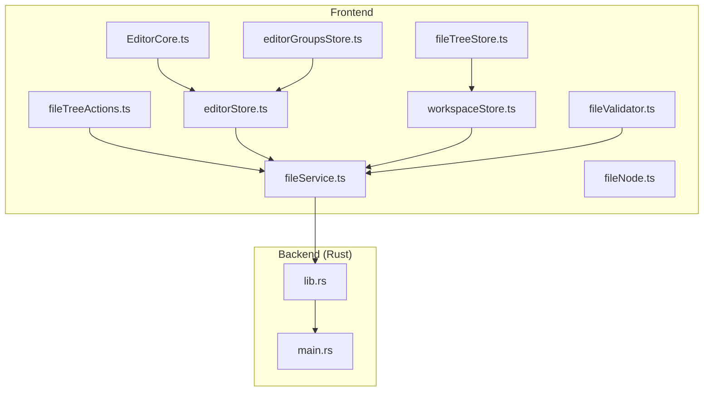
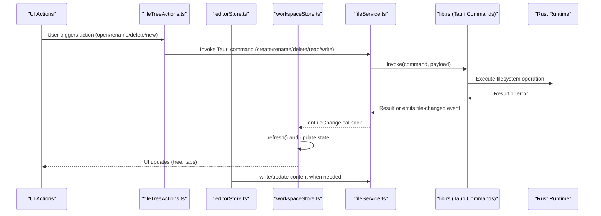
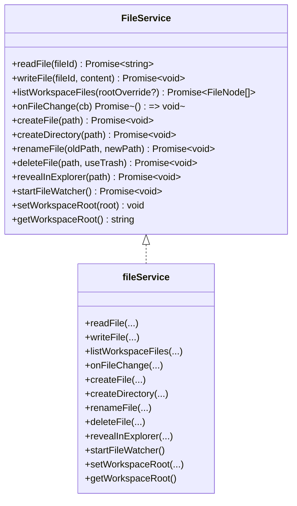
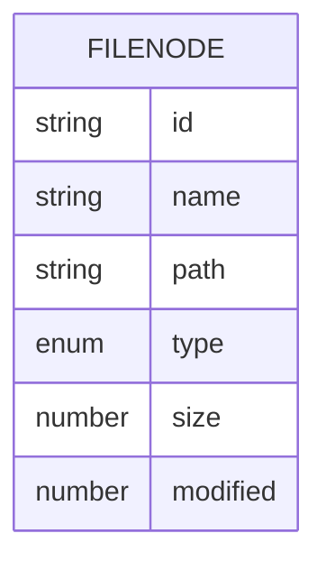
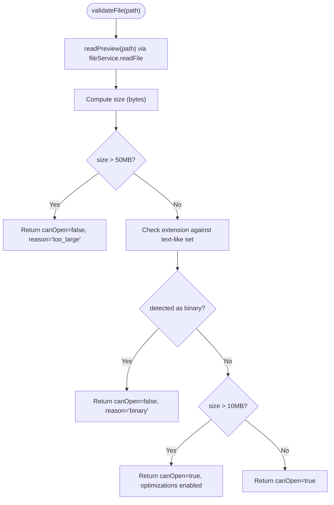
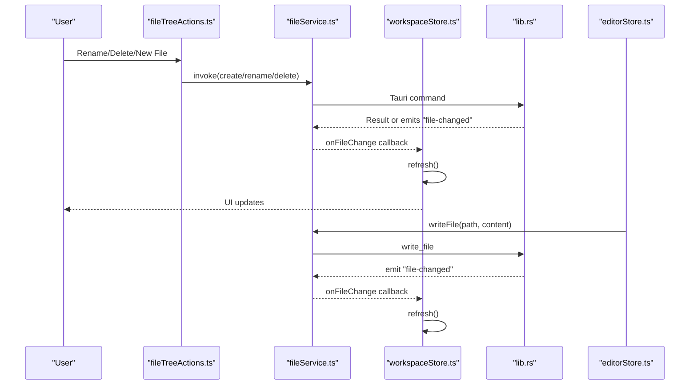
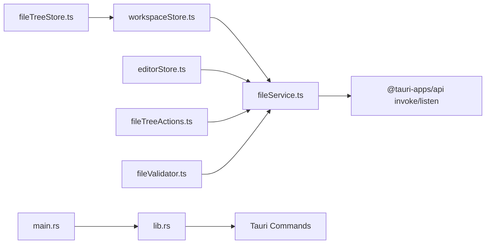

# Integration Architecture

<cite>
**Referenced Files in This Document**
- [fileService.ts](file://src/lib/services/fileService.ts)
- [fileValidator.ts](file://src/lib/utils/fileValidator.ts)
- [fileNode.ts](file://src/lib/types/fileNode.ts)
- [fileTreeStore.ts](file://src/lib/stores/fileTreeStore.ts)
- [fileTreeActions.ts](file://src/lib/sidebar/fileTreeActions.ts)
- [workspaceStore.ts](file://src/lib/stores/workspaceStore.ts)
- [editorStore.ts](file://src/lib/stores/editorStore.ts)
- [editorGroupsStore.ts](file://src/lib/stores/layout/editorGroupsStore.ts)
- [EditorCore.ts](file://src/lib/editor/EditorCore.ts)
- [lib.rs](file://src-tauri/src/lib.rs)
- [main.rs](file://src-tauri/src/main.rs)
</cite>

## Table of Contents
1. [Introduction](#introduction)
2. [Project Structure](#project-structure)
3. [Core Components](#core-components)
4. [Architecture Overview](#architecture-overview)
5. [Detailed Component Analysis](#detailed-component-analysis)
6. [Dependency Analysis](#dependency-analysis)
7. [Performance Considerations](#performance-considerations)
8. [Troubleshooting Guide](#troubleshooting-guide)
9. [Conclusion](#conclusion)

## Introduction
This document describes the integration layer between the frontend and backend in the NC code editor. It focuses on the service abstraction over Tauri commands, the data model for file nodes bridging UI and filesystem, validation patterns for safe file operations, and the end-to-end data flow from user actions through stores, services, Tauri commands, to Rust backend operations and back. It also covers error handling, retry strategies, and performance considerations including caching and asynchronous processing.

## Project Structure
The integration layer spans three main areas:
- Frontend services and stores: fileService.ts, workspaceStore.ts, editorStore.ts, fileTreeStore.ts, fileTreeActions.ts, fileValidator.ts, fileNode.ts, editorGroupsStore.ts, EditorCore.ts
- Backend (Rust): lib.rs (Tauri commands), main.rs (application entry)

**Diagram sources**
- [fileService.ts](file://src/lib/services/fileService.ts#L1-L85)
- [workspaceStore.ts](file://src/lib/stores/workspaceStore.ts#L1-L130)
- [editorStore.ts](file://src/lib/stores/editorStore.ts#L1-L381)
- [editorGroupsStore.ts](file://src/lib/stores/layout/editorGroupsStore.ts#L1-L413)
- [fileTreeStore.ts](file://src/lib/stores/fileTreeStore.ts#L1-L290)
- [fileTreeActions.ts](file://src/lib/sidebar/fileTreeActions.ts#L1-L135)
- [fileValidator.ts](file://src/lib/utils/fileValidator.ts#L1-L131)
- [fileNode.ts](file://src/lib/types/fileNode.ts#L1-L19)
- [EditorCore.ts](file://src/lib/editor/EditorCore.ts#L1-L800)
- [lib.rs](file://src-tauri/src/lib.rs#L248-L425)
- [main.rs](file://src-tauri/src/main.rs#L1-L7)

**Section sources**
- [fileService.ts](file://src/lib/services/fileService.ts#L1-L85)
- [lib.rs](file://src-tauri/src/lib.rs#L248-L425)

## Core Components
- fileService.ts: Provides a unified asynchronous API for filesystem operations and file watching, wrapping Tauri invoke and event listeners. It exposes methods for reading/writing files, listing workspace files, creating/deleting/rename, revealing in explorer, and starting the file watcher.
- fileNode.ts: Defines the FileNode data contract used across the UI and backend, including id, name, path, type, size, modified timestamp, and optional children.
- fileValidator.ts: Validates files before opening in the editor, checking size limits and binary detection heuristics, and returns optimization hints for large files.
- workspaceStore.ts: Manages workspace state (name, files, loading/error flags, root), loads files via fileService, sets up file change watchers, and refreshes on events.
- editorStore.ts: Central store for editor tabs and active editor state, integrates with fileService for saving content and with editorGroupsStore for layout grouping.
- fileTreeStore.ts: Maintains UI state for the file tree (expanded directories, selected file), synchronizes selection with the active editor tab, and reveals nodes.
- fileTreeActions.ts: Handles user-triggered actions (open, open to side, reveal in explorer, new file/folder, rename, delete) and coordinates with fileService and workspaceStore.
- editorGroupsStore.ts: Pure layout store managing editor groups and tab ordering, decoupled from file content and Tauri.
- EditorCore.ts: Encapsulates Monaco Editor integration, exposing a clean API for model management, configuration, diagnostics, and diff sessions.

**Section sources**
- [fileService.ts](file://src/lib/services/fileService.ts#L1-L85)
- [fileNode.ts](file://src/lib/types/fileNode.ts#L1-L19)
- [fileValidator.ts](file://src/lib/utils/fileValidator.ts#L1-L131)
- [workspaceStore.ts](file://src/lib/stores/workspaceStore.ts#L1-L130)
- [editorStore.ts](file://src/lib/stores/editorStore.ts#L1-L381)
- [fileTreeStore.ts](file://src/lib/stores/fileTreeStore.ts#L1-L290)
- [fileTreeActions.ts](file://src/lib/sidebar/fileTreeActions.ts#L1-L135)
- [editorGroupsStore.ts](file://src/lib/stores/layout/editorGroupsStore.ts#L1-L413)
- [EditorCore.ts](file://src/lib/editor/EditorCore.ts#L1-L800)

## Architecture Overview
The integration architecture follows a layered approach:
- UI layer: Stores and actions orchestrate user interactions.
- Service abstraction: fileService.ts encapsulates Tauri commands and events.
- Backend layer: Rust Tauri commands implement filesystem operations and file watching.

**Diagram sources**
- [fileTreeActions.ts](file://src/lib/sidebar/fileTreeActions.ts#L58-L134)
- [editorStore.ts](file://src/lib/stores/editorStore.ts#L297-L306)
- [workspaceStore.ts](file://src/lib/stores/workspaceStore.ts#L37-L87)
- [fileService.ts](file://src/lib/services/fileService.ts#L30-L83)
- [lib.rs](file://src-tauri/src/lib.rs#L248-L425)

## Detailed Component Analysis

### Service Layer: fileService.ts
- Purpose: Provide a single interface to Tauri commands for filesystem operations and file watching.
- Key responsibilities:
  - Read/write files
  - List workspace files
  - Create/rename/delete files/directories
  - Reveal in OS explorer
  - Start file watcher and listen for file-changed events
  - Manage workspace root
- Design benefits:
  - Abstraction over Tauri reduces direct coupling in UI code.
  - Easy to mock for testing and future backend replacement.

**Diagram sources**
- [fileService.ts](file://src/lib/services/fileService.ts#L15-L83)

**Section sources**
- [fileService.ts](file://src/lib/services/fileService.ts#L1-L85)

### Data Model: FileNode
- Contract: id, name, path, type ('file' | 'dir'), optional size and modified timestamp, optional children for directories.
- Alignment: Mirrors the Rust FileEntry structure and is produced by the read_workspace Tauri command.

**Diagram sources**
- [fileNode.ts](file://src/lib/types/fileNode.ts#L1-L19)
- [lib.rs](file://src-tauri/src/lib.rs#L122-L133)

**Section sources**
- [fileNode.ts](file://src/lib/types/fileNode.ts#L1-L19)
- [lib.rs](file://src-tauri/src/lib.rs#L122-L133)

### Validation Patterns: fileValidator.ts
- Validates files prior to opening in the editor:
  - Size checks: rejects files larger than a threshold.
  - Binary detection: heuristic checks for null bytes and non-ASCII ratios.
  - Large file optimizations: returns EditorCoreOptions to disable heavy features for performance.
- Uses fileService.readFile to obtain a preview and compute size.

**Diagram sources**
- [fileValidator.ts](file://src/lib/utils/fileValidator.ts#L1-L131)

**Section sources**
- [fileValidator.ts](file://src/lib/utils/fileValidator.ts#L1-L131)

### Data Flow: From UI to Backend and Back
- User actions in the file tree trigger fileTreeActions.ts, which invokes fileService methods.
- fileService.ts wraps Tauri invoke calls and listens for file-changed events.
- workspaceStore.ts subscribes to fileService.onFileChange and refreshes the workspace tree.
- editorStore.ts writes content via fileService.writeFile when the user saves.
- Rust commands in lib.rs implement filesystem operations and emit file-changed events.

**Diagram sources**
- [fileTreeActions.ts](file://src/lib/sidebar/fileTreeActions.ts#L84-L134)
- [fileService.ts](file://src/lib/services/fileService.ts#L30-L83)
- [workspaceStore.ts](file://src/lib/stores/workspaceStore.ts#L37-L87)
- [lib.rs](file://src-tauri/src/lib.rs#L248-L425)
- [editorStore.ts](file://src/lib/stores/editorStore.ts#L297-L306)

**Section sources**
- [fileTreeActions.ts](file://src/lib/sidebar/fileTreeActions.ts#L1-L135)
- [fileService.ts](file://src/lib/services/fileService.ts#L1-L85)
- [workspaceStore.ts](file://src/lib/stores/workspaceStore.ts#L1-L130)
- [lib.rs](file://src-tauri/src/lib.rs#L248-L425)
- [editorStore.ts](file://src/lib/stores/editorStore.ts#L297-L306)

### Error Handling and Retry Strategies
- UI-level error handling:
  - fileTreeActions.ts catches errors during create/rename/delete and displays an alert with the action name and error.
  - workspaceStore.ts captures errors during loadWorkspaceFiles and sets an error state.
- Backend-level error handling:
  - Rust commands return Result types; errors are formatted as strings and propagated to the frontend.
  - File watcher initialization guards against double-start and handles channel creation failures.
- Retry strategies:
  - No explicit retry loops are implemented in the current code. On failure, the UI alerts the user and the workspace remains in a consistent state. Future enhancements could add retry policies at the service layer with exponential backoff and user feedback.

**Section sources**
- [fileTreeActions.ts](file://src/lib/sidebar/fileTreeActions.ts#L44-L57)
- [workspaceStore.ts](file://src/lib/stores/workspaceStore.ts#L55-L71)
- [lib.rs](file://src-tauri/src/lib.rs#L248-L425)

### Technical Decisions: Service Abstraction
- Why a service abstraction over direct Tauri calls:
  - Testability: fileService can be mocked to isolate UI logic.
  - Maintainability: centralized Tauri invocation and event handling reduce duplication.
  - Portability: easier to swap backend implementations later.
  - Event handling: unified subscription/unsubscription for file-changed events.
- Benefits observed:
  - fileTreeActions.ts and editorStore.ts remain free of Tauri specifics.
  - workspaceStore.ts orchestrates refresh cycles without embedding Tauri logic.

**Section sources**
- [fileService.ts](file://src/lib/services/fileService.ts#L1-L85)
- [fileTreeActions.ts](file://src/lib/sidebar/fileTreeActions.ts#L1-L135)
- [editorStore.ts](file://src/lib/stores/editorStore.ts#L297-L306)
- [workspaceStore.ts](file://src/lib/stores/workspaceStore.ts#L37-L87)

## Dependency Analysis
- Frontend dependencies:
  - fileService.ts depends on @tauri-apps/api for invoke and listen.
  - workspaceStore.ts depends on fileService and exposes a public API for refresh/open/close.
  - editorStore.ts depends on fileService for writing content and on editorGroupsStore for layout.
  - fileTreeActions.ts depends on fileService and workspaceStore.
  - fileTreeStore.ts depends on workspaceStore and editorStore.
  - fileValidator.ts depends on fileService for previews.
- Backend dependencies:
  - lib.rs defines Tauri commands and emits events; main.rs delegates to lib.rs run().

**Diagram sources**
- [fileService.ts](file://src/lib/services/fileService.ts#L1-L85)
- [workspaceStore.ts](file://src/lib/stores/workspaceStore.ts#L1-L130)
- [editorStore.ts](file://src/lib/stores/editorStore.ts#L1-L381)
- [fileTreeActions.ts](file://src/lib/sidebar/fileTreeActions.ts#L1-L135)
- [fileTreeStore.ts](file://src/lib/stores/fileTreeStore.ts#L1-L290)
- [fileValidator.ts](file://src/lib/utils/fileValidator.ts#L1-L131)
- [lib.rs](file://src-tauri/src/lib.rs#L248-L425)
- [main.rs](file://src-tauri/src/main.rs#L1-L7)

**Section sources**
- [fileService.ts](file://src/lib/services/fileService.ts#L1-L85)
- [lib.rs](file://src-tauri/src/lib.rs#L248-L425)

## Performance Considerations
- File watching:
  - Rust starts a recursive file watcher and emits "file-changed" events. The frontend subscribes and refreshes the workspace tree, minimizing redundant polling.
- Large file handling:
  - fileValidator.ts detects oversized files and disables heavy Monaco features for large files to improve responsiveness.
- Asynchronous processing:
  - All Tauri commands are asynchronous; UI remains responsive during long-running operations.
- Caching:
  - No explicit frontend caching of file content is present. Content is fetched on demand and written back via fileService.writeFile.
- Recommendations:
  - Consider adding a lightweight in-memory cache for recently accessed file contents in editorStore to reduce repeated reads.
  - Debounce workspace refresh when multiple file-changed events arrive rapidly.
  - Introduce retry with backoff for transient filesystem errors.

[No sources needed since this section provides general guidance]

## Troubleshooting Guide
- Workspace fails to load:
  - Check workspaceStore error state and confirm the root path is valid.
  - Verify Tauri commands are registered and lib.rs is running.
- File operations fail:
  - Inspect error messages from fileTreeActions.ts alerts and workspaceStore error field.
  - Confirm permissions and path correctness in Rust resolve_path logic.
- File watcher not triggering:
  - Ensure start_file_watcher is invoked and the watcher thread is initialized without panics.
  - Verify "file-changed" events are emitted and listened to by fileService.onFileChange.

**Section sources**
- [workspaceStore.ts](file://src/lib/stores/workspaceStore.ts#L55-L71)
- [fileTreeActions.ts](file://src/lib/sidebar/fileTreeActions.ts#L44-L57)
- [lib.rs](file://src-tauri/src/lib.rs#L390-L425)

## Conclusion
The integration layer cleanly separates UI concerns from filesystem operations through a service abstraction, enabling testability and maintainability. The FileNode contract bridges UI and backend seamlessly, while fileValidator ensures safe editor usage. The end-to-end flow from user actions to Tauri commands and Rust backend is robust, with clear error handling and a responsive file watcher. Future enhancements can focus on retry strategies, debounced refresh, and lightweight caching to further improve performance and reliability.