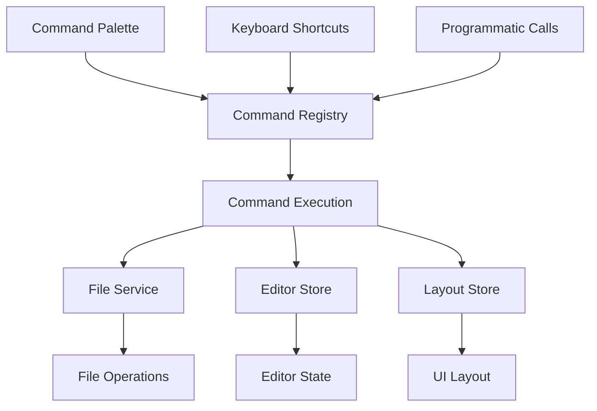
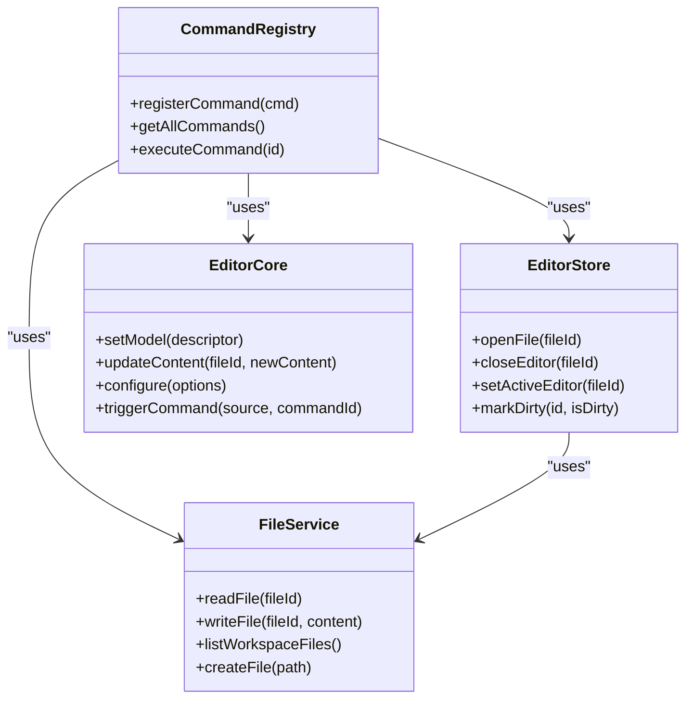

# Built-in Commands

<cite>
**Referenced Files in This Document**   
- [commandRegistry.ts](file://src/lib/commands/commandRegistry.ts)
- [defaultCommands.ts](file://src/lib/commands/defaultCommands.ts)
- [fileService.ts](file://src/lib/services/fileService.ts)
- [editorStore.ts](file://src/lib/stores/editorStore.ts)
- [editorGroupsStore.ts](file://src/lib/stores/layout/editorGroupsStore.ts)
- [commandPaletteStore.ts](file://src/lib/stores/commandPaletteStore.ts)
- [EditorCore.ts](file://src/lib/editor/EditorCore.ts)
- [commands.ts](file://src/lib/settings/commands.ts)
</cite>

## Table of Contents

1. [Introduction](#introduction)
2. [Command Architecture Overview](#command-architecture-overview)
3. [Core Command Implementation](#core-command-implementation)
4. [File Management Commands](#file-management-commands)
5. [Editor Operations Commands](#editor-operations-commands)
6. [Navigation and Layout Commands](#navigation-and-layout-commands)
7. [Command Registration and Execution](#command-registration-and-execution)
8. [Integration with Services and Stores](#integration-with-services-and-stores)
9. [Command Palette and Discoverability](#command-palette-and-discoverability)
10. [Error Handling and User Feedback](#error-handling-and-user-feedback)
11. [Extending and Customizing Commands](#extending-and-customizing-commands)

## Introduction

The NC code editor implements a comprehensive command system that provides core functionality for file management, editor operations, and navigation. This document details the implementation of built-in commands, focusing on their integration with underlying services such as fileService for file operations and editorStore for editor state management. The command system follows a VS Code-inspired architecture with a centralized command registry that serves as the single source of truth for all commands accessible through the command palette, keyboard shortcuts, and internal API calls.

**Section sources**

- [commandRegistry.ts](file://src/lib/commands/commandRegistry.ts)
- [defaultCommands.ts](file://src/lib/commands/defaultCommands.ts)

## Command Architecture Overview

The NC editor's command system is built around a centralized command registry that manages all available commands. The architecture follows a single source of truth principle, where the command registry maintains a complete list of all commands that can be executed through the command palette, keyboard shortcuts, or programmatic calls. Commands are defined with unique identifiers, human-readable labels, execution functions, categories for organization, and optional keybindings for keyboard access.

The system is designed with extensibility in mind, allowing for both built-in commands and future extensions. The command registry supports idempotent registration, meaning commands can be registered multiple times with the last write winning, which enables command overriding and dynamic updates. This architecture ensures consistency across different command invocation methods while maintaining a clean separation between command definitions and their execution logic.

**Diagram sources**

- [commandRegistry.ts](file://src/lib/commands/commandRegistry.ts)
- [defaultCommands.ts](file://src/lib/commands/defaultCommands.ts)

**Section sources**

- [commandRegistry.ts](file://src/lib/commands/commandRegistry.ts)
- [defaultCommands.ts](file://src/lib/commands/defaultCommands.ts)

## Core Command Implementation

The core command implementation in the NC editor follows a structured approach with clear separation of concerns. The command registry serves as the central hub, providing functions to register commands, retrieve all available commands, and execute commands by their unique identifiers. Each command is defined as an object containing an ID, label, execution function, category, and optional keybinding.

The implementation prioritizes robustness and developer experience, with validation checks during command registration to ensure required properties are present and properly typed. The executeCommand function handles both synchronous and asynchronous operations, allowing commands to perform complex operations without blocking the UI. This design enables commands to integrate seamlessly with various editor services while maintaining a consistent execution model.

**Section sources**

- [commandRegistry.ts](file://src/lib/commands/commandRegistry.ts#L1-L64)

## File Management Commands

The file management commands in the NC editor provide essential functionality for working with files in the workspace. These commands include creating new files, opening existing files, saving changes, and closing tabs. The implementation leverages the fileService for backend operations and editorStore for managing editor state. When a file is opened, the system ensures a corresponding editor tab is created or activated, with proper integration between the editor groups store and the active editor state.

File operations are designed to be atomic and consistent, with proper error handling and user feedback mechanisms. The commands follow a pattern of first validating the operation, then executing the file service call, and finally updating the editor state to reflect the changes. This ensures that the UI remains synchronized with the underlying file system state, providing a reliable editing experience.

**Section sources**

- [fileService.ts](file://src/lib/services/fileService.ts#L1-L85)
- [editorStore.ts](file://src/lib/stores/editorStore.ts#L1-L381)

## Editor Operations Commands

Editor operations commands handle core editing functionality such as closing active editors, managing tabs, and controlling editor behavior. The 'workbench.action.closeActiveEditor' command, for example, retrieves the active tab ID from the editor groups store and delegates to editorStore.closeEditor to handle the actual tab closure and state updates. This command demonstrates the layered architecture where high-level commands coordinate between different stores and services.

The implementation includes specialized commands for editor-specific operations like toggling word wrap, going to specific lines, and navigating to symbols within files. These commands are designed to integrate with the Monaco editor through the EditorCore API, providing a bridge between user actions and editor functionality. The commands are structured to be extensible, allowing for additional editor operations to be added without modifying the core command infrastructure.

**Section sources**

- [defaultCommands.ts](file://src/lib/commands/defaultCommands.ts#L112-L125)
- [EditorCore.ts](file://src/lib/editor/EditorCore.ts#L1-L891)

## Navigation and Layout Commands

Navigation and layout commands provide users with control over the editor interface and workspace organization. These commands include toggling sidebar visibility, switching between editor groups, and managing panel states. The implementation uses a combination of layout stores and activity stores to manage UI state changes, ensuring consistent behavior across different navigation actions.

Commands like 'workbench.action.focusLeftGroup' and 'workbench.action.focusRightGroup' enable keyboard-driven navigation between editor groups, enhancing accessibility and workflow efficiency. The system maintains ordered group IDs and calculates relative positions to determine the next active group, providing intuitive navigation behavior. Layout commands are designed to be composable, allowing users to create complex navigation workflows through sequential command execution.

**Section sources**

- [defaultCommands.ts](file://src/lib/commands/defaultCommands.ts#L45-L74)
- [defaultCommands.ts](file://src/lib/commands/defaultCommands.ts#L130-L177)

## Command Registration and Execution

The command registration and execution system in the NC editor follows a well-defined process that ensures commands are properly initialized and available for use. The initDefaultCommands function serves as the entry point for registering all built-in commands, with idempotent behavior to prevent duplicate registrations. Commands are grouped by functionality (layout, view, editor, etc.) and registered in a structured manner that reflects their logical organization.

The execution process begins with a command lookup in the registry, followed by validation of the command's existence before invoking its execution function. This two-step process prevents errors from invalid command calls while maintaining a clean API for command invocation. The system supports both immediate execution and asynchronous operations, with proper error handling to ensure the editor remains stable even if individual commands fail.

**Section sources**

- [defaultCommands.ts](file://src/lib/commands/defaultCommands.ts#L35-L269)
- [commandRegistry.ts](file://src/lib/commands/commandRegistry.ts#L56-L64)

## Integration with Services and Stores

The command system in the NC editor is deeply integrated with various services and stores that manage different aspects of the editor's functionality. File operations are coordinated through the fileService, which provides a unified interface for file system interactions. Editor state is managed by the editorStore, which maintains information about open tabs, active editors, and dirty states.

The integration follows a dependency injection pattern, where commands import the necessary services and stores at definition time. This approach ensures that commands have direct access to the functionality they need while maintaining loose coupling between components. The system uses Svelte stores for reactive state management, allowing UI components to automatically update when command operations modify the underlying state.

**Diagram sources**

- [commandRegistry.ts](file://src/lib/commands/commandRegistry.ts)
- [editorStore.ts](file://src/lib/stores/editorStore.ts)
- [fileService.ts](file://src/lib/services/fileService.ts)
- [EditorCore.ts](file://src/lib/editor/EditorCore.ts)

**Section sources**

- [commandRegistry.ts](file://src/lib/commands/commandRegistry.ts)
- [editorStore.ts](file://src/lib/stores/editorStore.ts)
- [fileService.ts](file://src/lib/services/fileService.ts)
- [EditorCore.ts](file://src/lib/editor/EditorCore.ts)

## Command Palette and Discoverability

The command palette system in the NC editor provides a central interface for discovering and executing commands. All registered commands are made available through the getAllCommands function, which returns a complete list of commands organized by category. This enables the command palette to present a structured view of available functionality, making it easier for users to find and execute commands without memorizing keyboard shortcuts.

Commands are categorized to improve discoverability, with logical groupings such as 'File', 'View', 'Editor', and 'Preferences'. Each command includes a descriptive label that clearly communicates its purpose, following consistent naming conventions that help users understand the command's effect. The system supports keyboard navigation within the command palette, allowing users to quickly filter and select commands using fuzzy search.

**Section sources**

- [commandRegistry.ts](file://src/lib/commands/commandRegistry.ts#L47-L53)
- [defaultCommands.ts](file://src/lib/commands/defaultCommands.ts)

## Error Handling and User Feedback

The command system implements robust error handling to ensure a stable user experience even when operations fail. Commands follow a defensive programming approach, with validation checks during registration and execution to prevent runtime errors. When a command cannot be executed due to invalid parameters or missing dependencies, the system handles the error gracefully without crashing or disrupting the editor's functionality.

User feedback is provided through various mechanisms, including visual indicators in the UI and status messages. For example, when a file operation fails, the editor may display a notification or update the status bar to inform the user of the issue. The system is designed to provide meaningful error messages that help users understand what went wrong and how to resolve the issue, rather than exposing technical details that may be confusing.

**Section sources**

- [commandRegistry.ts](file://src/lib/commands/commandRegistry.ts#L38-L43)
- [fileService.ts](file://src/lib/services/fileService.ts)

## Extending and Customizing Commands

The NC editor's command system is designed to be extensible, allowing developers to create new commands or modify existing ones to suit specific use cases. The public API provided by the command registry enables third-party extensions to register their own commands, which will automatically appear in the command palette and be available for keyboard shortcut assignment.

Custom commands can leverage the same integration patterns as built-in commands, accessing editor services and stores through the established dependency structure. Developers can create variations of existing commands by copying their implementation patterns and modifying the execution logic to meet specific requirements. The system supports command overriding, allowing extensions to replace built-in commands with customized versions when needed.

**Section sources**

- [commandRegistry.ts](file://src/lib/commands/commandRegistry.ts)
- [defaultCommands.ts](file://src/lib/commands/defaultCommands.ts)
