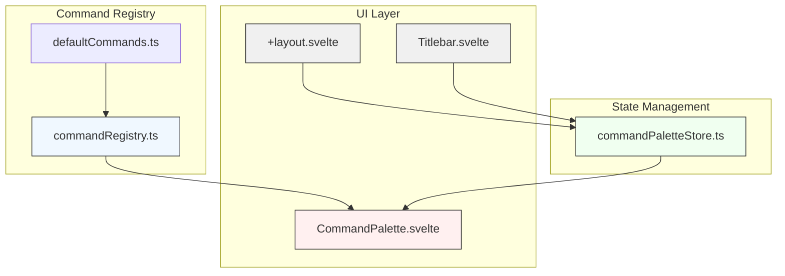
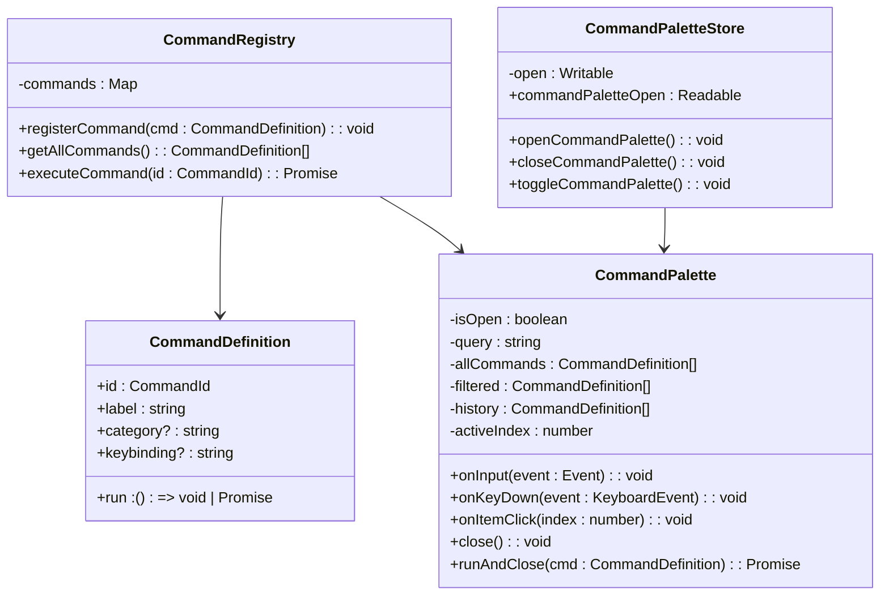
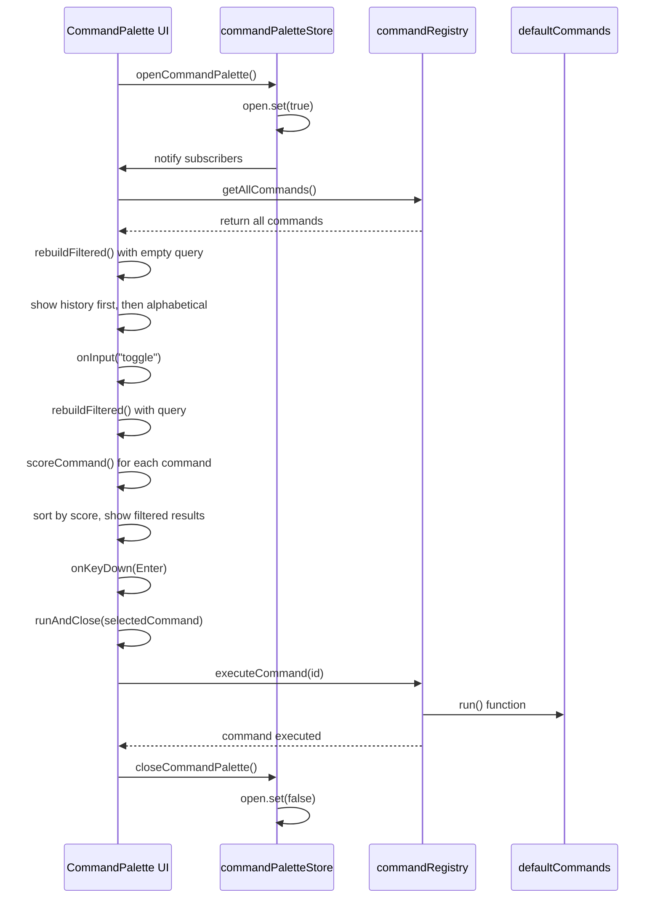
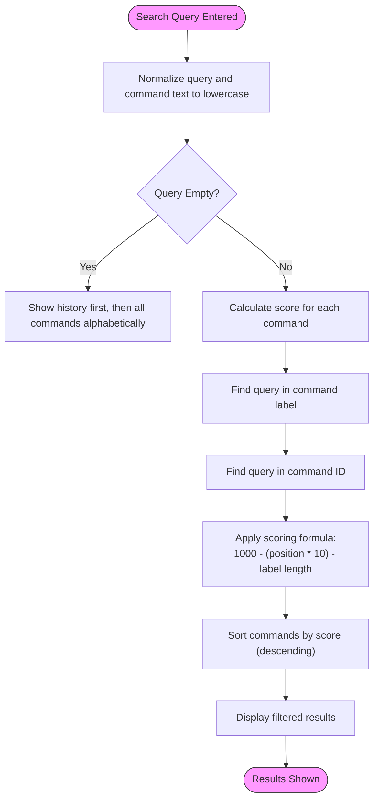
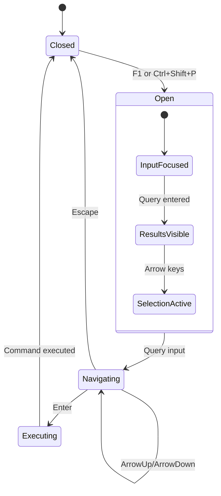
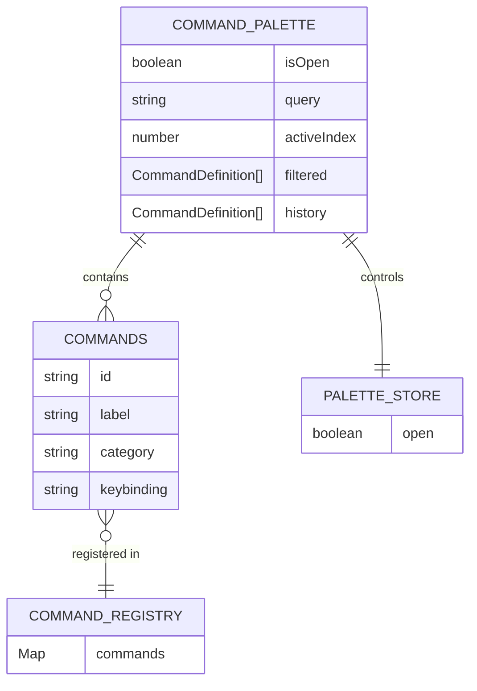

# Command Palette

<cite>
**Referenced Files in This Document**   
- [commandPaletteStore.ts](file://src/lib/stores/commandPaletteStore.ts)
- [CommandPalette.svelte](file://src/lib/commands/CommandPalette.svelte)
- [commandRegistry.ts](file://src/lib/commands/commandRegistry.ts)
- [defaultCommands.ts](file://src/lib/commands/defaultCommands.ts)
- [+layout.svelte](file://src/routes/+layout.svelte)
- [Titlebar.svelte](file://src/lib/layout/Titlebar.svelte)
- [sidebarRegistry.ts](file://src/lib/layout/sidebarRegistry.ts)
</cite>

## Table of Contents

1. [Introduction](#introduction)
2. [Architecture Overview](#architecture-overview)
3. [Core Components](#core-components)
4. [Command Registry and State Management](#command-registry-and-state-management)
5. [Fuzzy Search Algorithm](#fuzzy-search-algorithm)
6. [Keyboard Navigation System](#keyboard-navigation-system)
7. [Visual Design and UI Components](#visual-design-and-ui-components)
8. [Command Filtering and Grouping](#command-filtering-and-grouping)
9. [Performance Considerations](#performance-considerations)
10. [Accessibility Features](#accessibility-features)
11. [Customization Options](#customization-options)
12. [Integration and Usage](#integration-and-usage)
13. [Conclusion](#conclusion)

## Introduction

The Command Palette is a modal interface in the NC code editor that enables users to quickly access all available commands through fuzzy search. Inspired by the VS Code Command Palette, this component provides a powerful way to discover and execute commands without navigating through menus or remembering keyboard shortcuts. The implementation follows a clean architectural pattern with separation of concerns between state management, command registration, and UI presentation.

The Command Palette serves as a central hub for application functionality, allowing users to search for commands by title, category, or keywords. It supports keyboard navigation, drag-to-reposition functionality, and maintains a history of recently used commands for faster access. The component is designed to be lightweight, accessible, and highly performant even with large command sets.

**Section sources**

- [CommandPalette.svelte](file://src/lib/commands/CommandPalette.svelte#L1-L441)
- [commandRegistry.ts](file://src/lib/commands/commandRegistry.ts#L1-L64)

## Architecture Overview

The Command Palette architecture follows a modular design with clear separation between the command registry, state management, and UI components. The system is built around three main layers: the command registry that serves as the single source of truth for all commands, the state store that manages visibility and interaction state, and the UI component that renders the palette and handles user interactions.



**Diagram sources**

- [commandRegistry.ts](file://src/lib/commands/commandRegistry.ts#L1-L64)
- [commandPaletteStore.ts](file://src/lib/stores/commandPaletteStore.ts#L1-L29)
- [CommandPalette.svelte](file://src/lib/commands/CommandPalette.svelte#L1-L441)
- [+layout.svelte](file://src/routes/+layout.svelte#L1-L478)
- [Titlebar.svelte](file://src/lib/layout/Titlebar.svelte#L1-L273)

**Section sources**

- [commandRegistry.ts](file://src/lib/commands/commandRegistry.ts#L1-L64)
- [commandPaletteStore.ts](file://src/lib/stores/commandPaletteStore.ts#L1-L29)
- [CommandPalette.svelte](file://src/lib/commands/CommandPalette.svelte#L1-L441)

## Core Components

The Command Palette system consists of several core components that work together to provide a seamless user experience. The main components include the command registry, which maintains a collection of all available commands; the command palette store, which manages the visibility state of the palette; and the CommandPalette UI component, which handles rendering and user interactions.

The command registry (commandRegistry.ts) serves as the single source of truth for all commands in the application. It provides functions to register commands, retrieve all commands, and execute commands by ID. Each command has a unique identifier, label, execution function, optional category, and optional keyboard shortcut. The registry uses a Map data structure for efficient lookups and allows commands to be overridden by registering a new command with the same ID.



**Diagram sources**

- [commandRegistry.ts](file://src/lib/commands/commandRegistry.ts#L1-L64)
- [commandPaletteStore.ts](file://src/lib/stores/commandPaletteStore.ts#L1-L29)
- [CommandPalette.svelte](file://src/lib/commands/CommandPalette.svelte#L1-L441)

**Section sources**

- [commandRegistry.ts](file://src/lib/commands/commandRegistry.ts#L1-L64)
- [commandPaletteStore.ts](file://src/lib/stores/commandPaletteStore.ts#L1-L29)
- [CommandPalette.svelte](file://src/lib/commands/CommandPalette.svelte#L1-L441)

## Command Registry and State Management

The command registry and state management system form the backbone of the Command Palette functionality. The command registry (commandRegistry.ts) implements a centralized pattern for managing all commands in the application, while the command palette store (commandPaletteStore.ts) handles the visibility state of the palette interface.

The command registry uses a Map to store CommandDefinition objects, with the command ID as the key. This allows for O(1) lookup performance when executing commands by ID. The registry provides three main functions: registerCommand for adding or updating commands, getAllCommands for retrieving all registered commands (used by the Command Palette for display), and executeCommand for running a command by its ID. The registerCommand function includes validation to ensure that commands have a valid ID and execution function, returning early if these requirements are not met.



**Diagram sources**

- [commandRegistry.ts](file://src/lib/commands/commandRegistry.ts#L1-L64)
- [commandPaletteStore.ts](file://src/lib/stores/commandPaletteStore.ts#L1-L29)
- [CommandPalette.svelte](file://src/lib/commands/CommandPalette.svelte#L1-L441)
- [defaultCommands.ts](file://src/lib/commands/defaultCommands.ts#L1-L269)

**Section sources**

- [commandRegistry.ts](file://src/lib/commands/commandRegistry.ts#L1-L64)
- [commandPaletteStore.ts](file://src/lib/stores/commandPaletteStore.ts#L1-L29)

## Fuzzy Search Algorithm

The Command Palette implements a custom fuzzy search algorithm that allows users to find commands by typing partial or approximate matches of command titles and IDs. The algorithm is designed to be fast and intuitive, providing relevant results even with incomplete or misspelled queries.

The search functionality is implemented in the CommandPalette.svelte component with the scoreCommand and rebuildFiltered functions. When a user types in the search input, the algorithm normalizes both the query and command properties to lowercase for case-insensitive matching. It then calculates a score for each command based on how well the query matches the command's label and ID. The scoring system prioritizes matches that occur earlier in the label and favors shorter labels, creating a ranking that puts the most relevant results at the top.



The scoring algorithm uses a weighted approach where matches in the command label are given higher priority (1000 base score) than matches in the command ID (800 base score). Within each category, commands with matches closer to the beginning of the text receive higher scores, and shorter labels are favored over longer ones. This creates a natural ranking that surfaces the most likely intended commands at the top of the list.

For empty queries, the algorithm displays commands from the history list first (in LRU order), followed by all other commands sorted alphabetically by label. This ensures that frequently used commands are easily accessible without typing, while still providing a comprehensive list of all available commands.

**Section sources**

- [CommandPalette.svelte](file://src/lib/commands/CommandPalette.svelte#L85-L144)

## Keyboard Navigation System

The Command Palette implements a comprehensive keyboard navigation system that allows users to interact with the interface entirely through the keyboard. This system follows standard accessibility patterns and provides efficient navigation for power users.

The keyboard handling is implemented in the onKeyDown function within CommandPalette.svelte, which listens for key events when the palette is open. The system supports several key interactions: Escape to close the palette, ArrowUp and ArrowDown to navigate between command options, and Enter to execute the selected command. Each key event is prevented from propagating to avoid interfering with other application functionality.



When navigating with arrow keys, the activeIndex is updated to reflect the currently highlighted command, and the scrollActiveIntoView function ensures that the selected item remains visible within the scrollable list. The Enter key executes the currently selected command (or the first filtered command if none is explicitly selected) and then closes the palette. The Escape key simply closes the palette without executing any command.

The individual command items also handle keyboard events, with Enter or Space executing the command when focused. This provides multiple pathways for keyboard interaction, accommodating different user preferences and workflows.

**Diagram sources**

- [CommandPalette.svelte](file://src/lib/commands/CommandPalette.svelte#L172-L205)

**Section sources**

- [CommandPalette.svelte](file://src/lib/commands/CommandPalette.svelte#L172-L205)

## Visual Design and UI Components

The Command Palette features a clean, modern visual design inspired by the VS Code Command Palette. The UI is implemented as a modal overlay with a draggable container that can be repositioned by the user. The design prioritizes readability and efficient information display while maintaining a lightweight footprint on the interface.

The palette consists of several key visual elements: a semi-transparent overlay that dims the background content, a centered container with rounded corners and subtle border, an input field with placeholder text, and a scrollable list of command results. The container has a fixed width of 520px and maximum height of 420px, ensuring it remains usable on smaller screens while providing ample space for command display.



Each command item in the results list displays the command label in the primary text color, with the keyboard shortcut shown in a smaller, muted font with a subtle border. Additional metadata such as the command ID and category are displayed below in an even more muted color. The active/selected command is highlighted with a distinct background color to provide clear visual feedback.

The input field includes a placeholder that guides users on its purpose: "Type a command or search (inspired by VS Code Command Palette)". The entire container is draggable, allowing users to reposition the palette by clicking and dragging the container itself. This feature enhances usability by letting users place the palette in a location that doesn't obstruct their current work.

**Diagram sources**

- [CommandPalette.svelte](file://src/lib/commands/CommandPalette.svelte#L266-L441)

**Section sources**

- [CommandPalette.svelte](file://src/lib/commands/CommandPalette.svelte#L266-L441)

## Command Filtering and Grouping

The Command Palette implements sophisticated filtering and grouping mechanisms to help users quickly find relevant commands among potentially large sets. While the current implementation doesn't visually group commands by category in the UI, the category information is used in the filtering and scoring algorithm to provide better search results.

The filtering process occurs in the rebuildFiltered function, which is called whenever the search query changes. For non-empty queries, the function scores each command based on how well the query matches the command's label and ID, then sorts the results by score in descending order. Commands with higher scores (better matches) appear at the top of the list.

For empty queries, the filtering logic prioritizes user history by showing recently used commands first, followed by all other commands in alphabetical order. This LRU (Least Recently Used) caching strategy ensures that frequently accessed commands are easily reachable without typing, enhancing productivity for common workflows.

The system maintains a history list of up to 20 recently executed commands (HISTORY_LIMIT constant). When a command is executed, it is moved to the front of the history list with the touchHistory function, which implements the LRU behavior by removing any existing instance of the command and adding it to the beginning. If the history exceeds the limit, the oldest entries are truncated.

Although categories are not visually grouped in the current implementation, they are displayed as metadata beneath each command item, helping users understand the context and purpose of each command. This information could be leveraged in future enhancements to provide collapsible category sections or category-based filtering.

**Section sources**

- [CommandPalette.svelte](file://src/lib/commands/CommandPalette.svelte#L116-L159)

## Performance Considerations

The Command Palette implementation includes several performance optimizations to ensure responsiveness even with large command sets. The design prioritizes efficient algorithms and minimal re-renders to provide a smooth user experience.

The search algorithm is optimized for speed by using simple string operations rather than complex regular expressions or external libraries. The scoring function performs direct indexOf checks on normalized strings, which are computationally efficient operations. The algorithm processes commands in a single pass, building the scored list and then sorting it, avoiding multiple iterations over the command set.

For large command sets, the implementation uses virtualization principles by only rendering visible items in the scrollable list. Although the current code renders all filtered results, the container's fixed height and overflow-y: auto styling naturally limit the visible items, reducing the rendering burden on the browser.

The component also optimizes event handling by using Svelte's built-in event delegation and minimizing the number of event listeners. The keyboard event listener is only active when the palette is open, and the input event handler is debounced through Svelte's reactive system, preventing excessive processing during rapid typing.

Memory usage is controlled through the HISTORY_LIMIT constant, which caps the number of stored recent commands at 20. This prevents unbounded growth of the history array while still providing useful recent command access. The command registry itself uses a Map for O(1) lookups, ensuring that command execution remains fast regardless of the total number of registered commands.

The implementation avoids expensive operations like deep cloning of command objects, instead using references to the original command definitions from the registry. This reduces memory overhead and ensures that any updates to commands are immediately reflected in the palette.

**Section sources**

- [CommandPalette.svelte](file://src/lib/commands/CommandPalette.svelte#L20-L21)
- [commandRegistry.ts](file://src/lib/commands/commandRegistry.ts#L32-L33)

## Accessibility Features

The Command Palette includes several accessibility features to ensure it can be used effectively by all users, including those relying on screen readers and keyboard navigation. The implementation follows WCAG guidelines and uses semantic HTML attributes to provide proper context to assistive technologies.

The palette container uses role="dialog" and aria-modal="true" to identify it as a modal dialog, which helps screen readers understand the interface structure and manage focus appropriately. The overlay uses role="presentation" to indicate it's purely visual and shouldn't be announced by screen readers.

Keyboard navigation is fully supported, with arrow keys for moving between options and Enter/Escape for selection and dismissal. Each command item has tabindex="0" and role="button" to make it focusable and properly identified to assistive technologies. The input field is automatically focused when the palette opens, following the expected pattern for modal dialogs.

The component includes proper ARIA attributes and keyboard event handling to ensure a seamless experience for keyboard-only users. The scrollActiveIntoView function ensures that the currently selected item remains visible in the scrollable list, preventing situations where keyboard navigation moves focus to off-screen elements.

Color contrast meets accessibility standards, with sufficient contrast between text and background colors in both light and dark themes. The visual design uses multiple cues (color, position, and typography) to convey information, ensuring that users with color vision deficiencies can still distinguish between different elements.

**Section sources**

- [CommandPalette.svelte](file://src/lib/commands/CommandPalette.svelte#L270-L335)

## Customization Options

The Command Palette provides several customization options that allow developers to modify its appearance and behavior to suit specific application needs. While the core functionality remains consistent, various aspects of the palette can be adapted through configuration and extension points.

The visual appearance can be customized through CSS variables and styling. The component uses a consistent naming convention with the "nova-command-palette" prefix for all CSS classes, making it easy to target specific elements for styling. Developers can modify colors, spacing, typography, and other visual properties by overriding the default styles.

The behavior can be extended by registering custom commands through the command registry API. The registerCommand function allows developers to add new commands with custom labels, execution functions, categories, and keyboard shortcuts. Commands can be organized into categories that help users discover related functionality.

The palette's triggering mechanism can be customized through the openCommandPalette, closeCommandPalette, and toggleCommandPalette functions. These can be bound to different keyboard shortcuts or UI elements based on application requirements. The current implementation supports F1 and Ctrl+Shift+P as default triggers, but these can be modified or extended.

The search algorithm itself could be extended to support additional matching strategies or weighting factors. While the current implementation focuses on label and ID matching, the architecture allows for incorporating additional command metadata or user preferences into the scoring system.

**Section sources**

- [commandRegistry.ts](file://src/lib/commands/commandRegistry.ts#L38-L45)
- [commandPaletteStore.ts](file://src/lib/stores/commandPaletteStore.ts#L19-L28)
- [CommandPalette.svelte](file://src/lib/commands/CommandPalette.svelte#L338-L441)

## Integration and Usage

The Command Palette is integrated throughout the NC code editor application and can be triggered from multiple locations. The primary integration points include the global keyboard shortcuts, the title bar UI element, and the application layout component.

The palette can be opened using several methods: pressing F1, Ctrl+Shift+P, or Cmd+Shift+P keyboard shortcuts; clicking the command palette button in the title bar; or programmatically calling the openCommandPalette function. The global keyboard handlers are set up in the +layout.svelte component's onMount function, which listens for keydown events on the window object.

```mermaid
graph TB
A[User Input] --> B{Trigger Method}
B --> C[Keyboard: F1]
B --> D[Keyboard: Ctrl+Shift+P]
B --> E[Title Bar Button]
B --> F[Programmatic Call]
C --> G[onKeyDown Event]
D --> G
E --> H[ButtonClick Event]
F --> I[openCommandPalette()]
G --> J[openCommandPalette()]
H --> J
J --> K[commandPaletteStore.open.set(true)]
K --> L[CommandPalette subscribes]
L --> M[Palette Opens with Focus]
style A fill:#f0f8ff,stroke:#333
style M fill:#f0fff0,stroke:#333
```

**Diagram sources**

- [+layout.svelte](file://src/routes/+layout.svelte#L105-L127)
- [Titlebar.svelte](file://src/lib/layout/Titlebar.svelte#L100-L104)
- [commandPaletteStore.ts](file://src/lib/stores/commandPaletteStore.ts#L19-L21)
- [CommandPalette.svelte](file://src/lib/commands/CommandPalette.svelte#L37-L59)

The integration follows a clean separation of concerns, with the commandPaletteStore acting as the central coordination point between UI components and the CommandPalette itself. This allows multiple parts of the application to trigger the palette without having direct dependencies on the UI implementation.

The default commands are registered in the +layout.svelte component during initialization, ensuring they are available when the palette opens. These include commands for toggling UI elements (sidebars, panels), navigating between editor groups, and accessing various views and settings.

**Section sources**

- [+layout.svelte](file://src/routes/+layout.svelte#L13-L101)
- [Titlebar.svelte](file://src/lib/layout/Titlebar.svelte#L7-L8)
- [commandPaletteStore.ts](file://src/lib/stores/commandPaletteStore.ts#L15-L17)

## Conclusion

The Command Palette in the NC code editor provides a powerful, accessible, and user-friendly interface for discovering and executing application commands. Its architecture follows best practices with clear separation between state management, command registration, and UI presentation, making it both maintainable and extensible.

The implementation successfully balances functionality with performance, providing fast fuzzy search, intuitive keyboard navigation, and a clean visual design. The integration with the rest of the application is seamless, allowing users to access all major features through a consistent interface.

Key strengths of the implementation include its adherence to accessibility standards, efficient algorithms that perform well with large command sets, and flexible architecture that allows for customization and extension. The use of Svelte stores for state management enables reactive updates while maintaining a clean separation of concerns.

Future enhancements could include visual grouping of commands by category, support for command arguments and parameters, and integration with contextual help or documentation. The foundation is solid for these and other improvements that could further enhance the user experience.

The Command Palette exemplifies how a well-designed interface component can significantly improve application usability by providing quick access to functionality while maintaining a clean and unobtrusive presence in the user interface.
