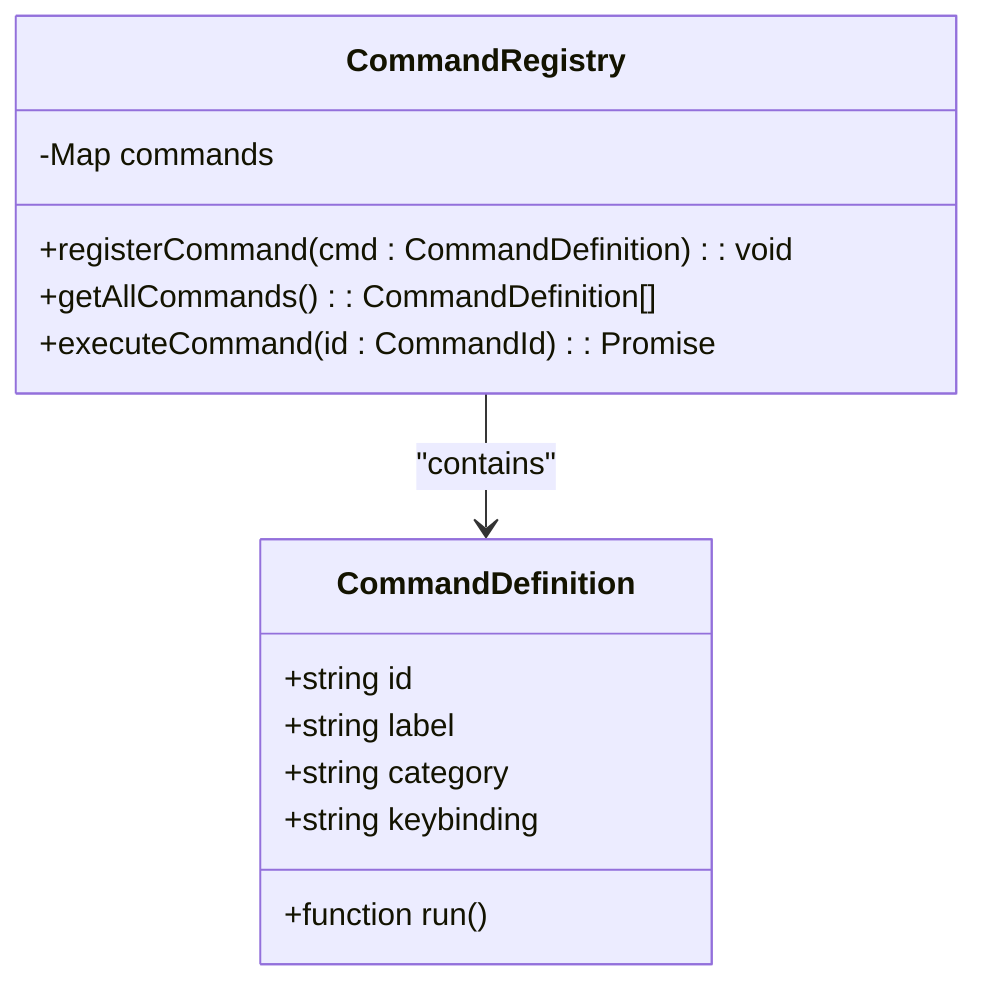
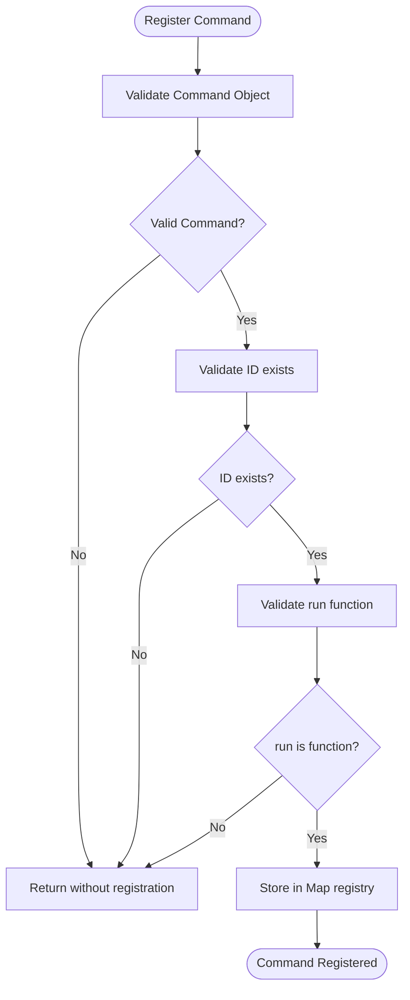
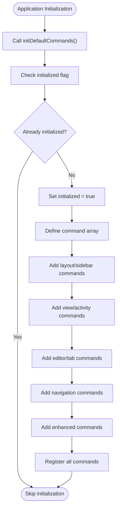
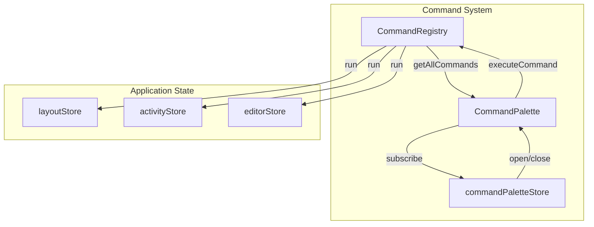

# Command Registration

<cite>
**Referenced Files in This Document**   
- [commandRegistry.ts](file://src/lib/commands/commandRegistry.ts)
- [defaultCommands.ts](file://src/lib/commands/defaultCommands.ts)
- [CommandPalette.svelte](file://src/lib/commands/CommandPalette.svelte)
- [commandPaletteStore.ts](file://src/lib/stores/commandPaletteStore.ts)
- [commands.ts](file://src/lib/settings/commands.ts)
</cite>

## Table of Contents
1. [Introduction](#introduction)
2. [Command Interface and Definition](#command-interface-and-definition)
3. [CommandRegistry Class Architecture](#commandregistry-class-architecture)
4. [Command Registration Process](#command-registration-process)
5. [Validation and Duplicate Prevention](#validation-and-duplicate-prevention)
6. [Command Discovery Mechanism](#command-discovery-mechanism)
7. [Default Command Registration](#default-command-registration)
8. [Extensibility for Plugins](#extensibility-for-plugins)
9. [Best Practices for Command Organization](#best-practices-for-command-organization)
10. [Integration with UI Components](#integration-with-ui-components)

## Introduction
The command registration system in the NC code editor provides a centralized mechanism for managing executable commands throughout the application. This system serves as the single source of truth for the Command Palette, global keyboard shortcuts, and internal command invocations. Inspired by the VS Code Command Palette architecture, the implementation follows established patterns while adapting to the SvelteKit/Tauri v2 technology stack. The system enables both core functionality and extensibility, allowing for the registration of default commands during application initialization as well as custom commands from plugins or extensions.

## Command Interface and Definition
The command system is built around a well-defined interface that standardizes how commands are structured and executed within the application. Each command is represented by the `CommandDefinition` interface which includes essential properties for identification, execution, and presentation.

```mermaid
classDiagram
class CommandDefinition {
+string id
+string label
+function run()
+string category
+string keybinding
}
note right of CommandDefinition
Core properties :
• id : Unique identifier following workbench.action.* pattern
• label : User-facing display name
• run : Execution handler function
• category : Logical grouping for organization
• keybinding : Optional keyboard shortcut
end note
```

**Diagram sources**
- [commandRegistry.ts](file://src/lib/commands/commandRegistry.ts#L22-L28)

**Section sources**
- [commandRegistry.ts](file://src/lib/commands/commandRegistry.ts#L18-L28)

## CommandRegistry Class Architecture
The `CommandRegistry` class serves as the central repository for all executable commands in the NC editor. Implemented as a singleton pattern through module exports, it maintains an internal Map data structure that maps command IDs to their corresponding definitions. The registry provides a comprehensive API for command management, including registration, retrieval, and execution. The architecture follows the single source of truth principle, ensuring consistency across different UI components that interact with commands.



**Diagram sources**
- [commandRegistry.ts](file://src/lib/commands/commandRegistry.ts#L30-L64)

**Section sources**
- [commandRegistry.ts](file://src/lib/commands/commandRegistry.ts#L30-L64)

## Command Registration Process
The command registration process follows a standardized workflow that allows commands to be added to the system with their required metadata. Commands are registered through the `registerCommand` function, which accepts a `CommandDefinition` object containing the command's ID, title, execution handler, and optional parameters such as keyboard shortcuts and categories. The registration process is designed to be idempotent, allowing commands to be registered multiple times without causing errors. When a command with an existing ID is registered, it replaces the previous command definition, following a "last write wins" policy that enables command overriding and extension.

**Section sources**
- [commandRegistry.ts](file://src/lib/commands/commandRegistry.ts#L38-L45)
- [defaultCommands.ts](file://src/lib/commands/defaultCommands.ts#L265-L267)

## Validation and Duplicate Prevention
The command registration system implements validation mechanisms to ensure the integrity of registered commands while maintaining runtime stability. During registration, the system performs basic validation checks to verify that the command object exists, has a valid ID, and contains an executable run function. If any of these conditions are not met, the registration is silently rejected without throwing exceptions, preventing runtime disruptions. The system uses a Map data structure as its underlying storage mechanism, which inherently prevents duplicate keys by automatically overwriting existing entries with the same command ID. This approach implements a "last write wins" strategy for duplicate commands, allowing for intentional command overriding while preventing invalid command registrations.



**Diagram sources**
- [commandRegistry.ts](file://src/lib/commands/commandRegistry.ts#L39-L43)

**Section sources**
- [commandRegistry.ts](file://src/lib/commands/commandRegistry.ts#L39-L43)

## Command Discovery Mechanism
The command discovery mechanism enables UI components such as the Command Palette to retrieve and display available commands to users. The system provides the `getAllCommands()` function which returns an array of all registered command definitions, allowing consumer components to access the complete command set. The Command Palette component subscribes to the command registry and maintains its own filtered list based on user input, implementing fuzzy search functionality to help users quickly find relevant commands. The discovery process also incorporates command history, prioritizing recently used commands in search results to enhance user efficiency. This mechanism supports both exact matches and partial queries, with scoring algorithms that prioritize matches at the beginning of command labels and favor shorter command names.

**Section sources**
- [CommandPalette.svelte](file://src/lib/commands/CommandPalette.svelte#L42-L43)
- [commandRegistry.ts](file://src/lib/commands/commandRegistry.ts#L51-L53)

## Default Command Registration
During application initialization, the system registers a comprehensive set of default commands that provide core editor functionality. These commands are defined in the `defaultCommands.ts` file and cover essential operations across various categories including view management, editor navigation, and workspace organization. The registration process is implemented through the `initDefaultCommands()` function, which ensures idempotency by using a flag to prevent multiple initializations. Default commands follow a consistent naming convention, primarily using the "workbench.action.*" and "workbench.view.*" prefixes to indicate their scope and purpose. Each command is associated with appropriate categories such as "View", "File", "Editor", and "Preferences" to facilitate organization within the Command Palette.



**Diagram sources**
- [defaultCommands.ts](file://src/lib/commands/defaultCommands.ts#L35-L268)

**Section sources**
- [defaultCommands.ts](file://src/lib/commands/defaultCommands.ts#L35-L268)

## Extensibility for Plugins
The command registration system is designed with extensibility in mind, allowing plugins and extensions to register custom commands seamlessly. The public API exposes the `registerCommand` function, enabling external modules to contribute functionality to the editor's command palette. The system supports parameterized command creation through factory functions, as demonstrated in the settings module where `createSectionOpenCommand` and `createSettingOpenCommand` generate specific commands based on configuration. This extensibility model follows a modular approach, with different subsystems responsible for registering their own commands while maintaining a unified command namespace. The architecture allows for both immediate command registration and deferred registration patterns, accommodating various plugin initialization strategies.

**Section sources**
- [commands.ts](file://src/lib/settings/commands.ts#L131-L174)
- [commandRegistry.ts](file://src/lib/commands/commandRegistry.ts#L38-L45)

## Best Practices for Command Organization
The command system follows established best practices for naming conventions and logical organization to ensure consistency and usability. Commands are organized into meaningful categories such as "View", "File", "Editor", "Preferences", and "Terminal" to help users quickly locate relevant functionality. The naming convention follows a hierarchical pattern with prefixes indicating the command's domain, such as "workbench.action.*" for general workbench operations and "editor.action.*" for editor-specific functions. Command IDs use lowercase letters and periods for separation, avoiding special characters and spaces. Labels are written in title case with clear, descriptive language that communicates the command's purpose to users. Keyboard shortcuts follow platform conventions, with common patterns like Ctrl+B for toggling sidebars and Ctrl+Shift+P for accessing the command palette.

**Section sources**
- [defaultCommands.ts](file://src/lib/commands/defaultCommands.ts#L47-L260)
- [commandRegistry.ts](file://src/lib/commands/commandRegistry.ts#L22-L28)

## Integration with UI Components
The command registration system integrates closely with various UI components to provide a cohesive user experience. The Command Palette component serves as the primary interface for command discovery and execution, subscribing to the command registry and providing search, filtering, and execution capabilities. The system also integrates with store-based state management, allowing commands to interact with application state through dedicated stores like `layoutStore` and `activityStore`. Keyboard event handling is implemented within the Command Palette to support navigation and execution via arrow keys, Enter, and Escape. The integration architecture follows a clean separation of concerns, with the command registry handling command management while UI components handle presentation and user interaction. This decoupled design enables flexible UI implementations while maintaining a consistent command execution model.



**Diagram sources**
- [CommandPalette.svelte](file://src/lib/commands/CommandPalette.svelte)
- [commandPaletteStore.ts](file://src/lib/stores/commandPaletteStore.ts)
- [commandRegistry.ts](file://src/lib/commands/commandRegistry.ts)

**Section sources**
- [CommandPalette.svelte](file://src/lib/commands/CommandPalette.svelte)
- [commandPaletteStore.ts](file://src/lib/stores/commandPaletteStore.ts)