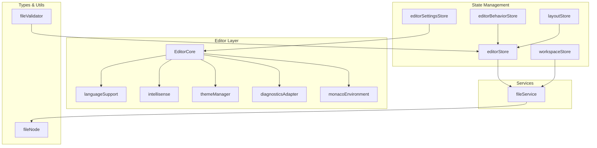
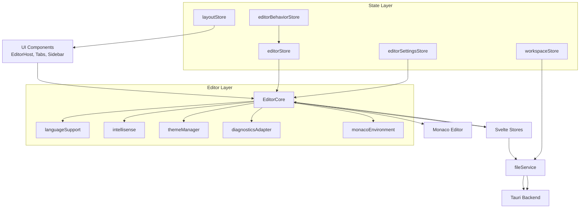
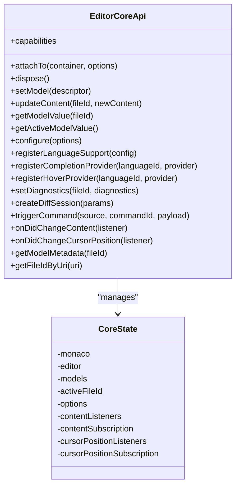
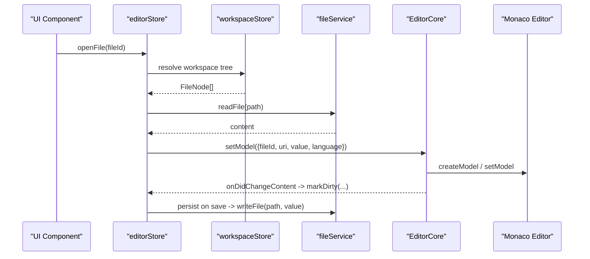
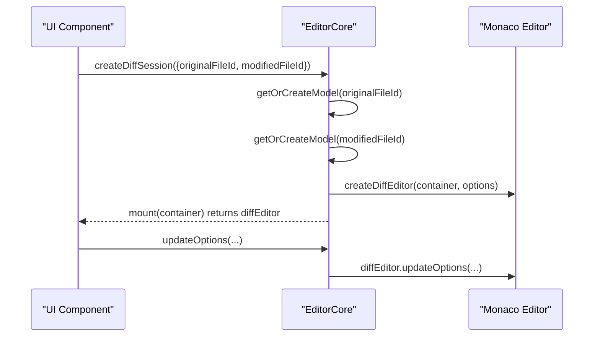
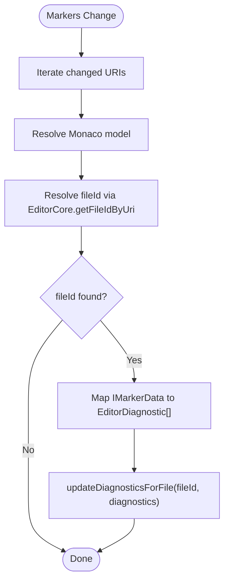
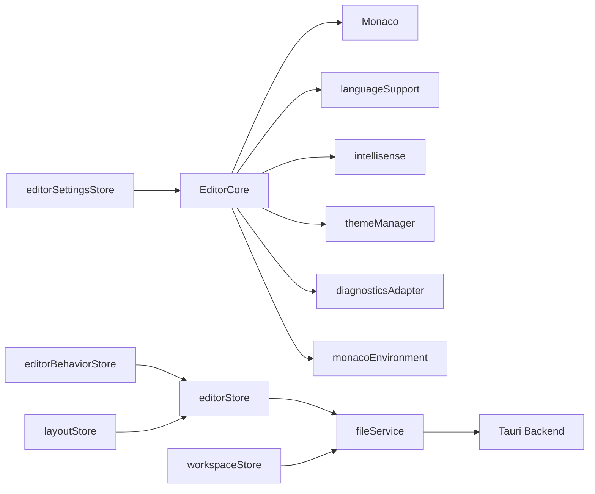

# Core Modules

<cite>
**Referenced Files in This Document**
- [EditorCore.ts](file://src/lib/editor/EditorCore.ts)
- [fileService.ts](file://src/lib/services/fileService.ts)
- [editorStore.ts](file://src/lib/stores/editorStore.ts)
- [editorSettingsStore.ts](file://src/lib/stores/editorSettingsStore.ts)
- [workspaceStore.ts](file://src/lib/stores/workspaceStore.ts)
- [editorBehaviorStore.ts](file://src/lib/stores/editorBehaviorStore.ts)
- [layoutStore.ts](file://src/lib/stores/layout/layoutStore.ts)
- [languageSupport.ts](file://src/lib/editor/languageSupport.ts)
- [intellisense.ts](file://src/lib/editor/intellisense.ts)
- [themeManager.ts](file://src/lib/editor/themeManager.ts)
- [diagnosticsAdapter.ts](file://src/lib/editor/diagnosticsAdapter.ts)
- [monacoEnvironment.ts](file://src/lib/editor/monacoEnvironment.ts)
- [fileNode.ts](file://src/lib/types/fileNode.ts)
- [fileValidator.ts](file://src/lib/utils/fileValidator.ts)
</cite>

## Table of Contents

1. [Introduction](#introduction)
2. [Project Structure](#project-structure)
3. [Core Components](#core-components)
4. [Architecture Overview](#architecture-overview)
5. [Detailed Component Analysis](#detailed-component-analysis)
6. [Dependency Analysis](#dependency-analysis)
7. [Performance Considerations](#performance-considerations)
8. [Troubleshooting Guide](#troubleshooting-guide)
9. [Conclusion](#conclusion)

## Introduction

This document explains the core modules that form the foundation of the NC code editor. It focuses on:

- The EditorCore class that encapsulates the Monaco Editor instance and exposes a unified API for editor operations.
- State management using Svelte stores for reactive data flow across the application.
- The service layer that handles business logic and external interactions, especially the fileService bridging frontend operations with Tauri’s backend.
- Practical examples showing how these modules collaborate to deliver core editor functionality.
- How the modules maintain separation of concerns while enabling seamless integration.

## Project Structure

The core modules are organized by responsibility:

- Editor orchestration and Monaco integration live under src/lib/editor.
- State management resides under src/lib/stores, split into logical domains (editor, layout, settings, etc.).
- Services abstract backend interactions under src/lib/services.
- Supporting utilities and types are located under src/lib/utils and src/lib/types.

**Diagram sources**

- [EditorCore.ts](file://src/lib/editor/EditorCore.ts#L1-L891)
- [languageSupport.ts](file://src/lib/editor/languageSupport.ts#L1-L70)
- [intellisense.ts](file://src/lib/editor/intellisense.ts#L1-L327)
- [themeManager.ts](file://src/lib/editor/themeManager.ts#L1-L274)
- [diagnosticsAdapter.ts](file://src/lib/editor/diagnosticsAdapter.ts#L1-L61)
- [monacoEnvironment.ts](file://src/lib/editor/monacoEnvironment.ts#L1-L131)
- [editorStore.ts](file://src/lib/stores/editorStore.ts#L1-L381)
- [editorSettingsStore.ts](file://src/lib/stores/editorSettingsStore.ts#L1-L180)
- [editorBehaviorStore.ts](file://src/lib/stores/editorBehaviorStore.ts#L1-L56)
- [workspaceStore.ts](file://src/lib/stores/workspaceStore.ts#L1-L130)
- [layoutStore.ts](file://src/lib/stores/layout/layoutStore.ts#L1-L131)
- [fileService.ts](file://src/lib/services/fileService.ts#L1-L85)
- [fileNode.ts](file://src/lib/types/fileNode.ts#L1-L19)
- [fileValidator.ts](file://src/lib/utils/fileValidator.ts#L1-L131)

**Section sources**

- [EditorCore.ts](file://src/lib/editor/EditorCore.ts#L1-L891)
- [editorStore.ts](file://src/lib/stores/editorStore.ts#L1-L381)
- [workspaceStore.ts](file://src/lib/stores/workspaceStore.ts#L1-L130)
- [fileService.ts](file://src/lib/services/fileService.ts#L1-L85)

## Core Components

This section introduces the primary building blocks and their responsibilities.

- EditorCore: Encapsulates Monaco Editor lifecycle, model management, configuration, diagnostics, diff sessions, and event subscriptions. It provides a clean API for editor operations while isolating Monaco-specific internals.
- State Stores:
  - editorStore: Manages editor tabs, active tab, dirty state, and integrates with editor groups.
  - editorSettingsStore: Holds Monaco editor settings and exposes setters to update them reactively.
  - editorBehaviorStore: Controls auto-save behavior and timing.
  - workspaceStore: Maintains the workspace tree, loading state, and watches for file changes.
  - layoutStore: Centralizes layout visibility and sizes for sidebars and bottom panel.
- Services:
  - fileService: Provides asynchronous file operations and workspace listing via Tauri commands, plus event listening for file changes.
- Utilities:
  - languageSupport: Maps internal language IDs to Monaco language IDs and registers basic languages.
  - intellisense: Sets up language support and providers for TypeScript/JavaScript with performance optimizations.
  - themeManager: Registers and applies Monaco themes, including custom and popular themes.
  - diagnosticsAdapter: Bridges Monaco markers to diagnosticsStore updates.
  - monacoEnvironment: Configures Monaco workers for Vite/Svelte/Tauri environments.
  - fileValidator: Validates files for size/binary content and suggests performance optimizations.

**Section sources**

- [EditorCore.ts](file://src/lib/editor/EditorCore.ts#L1-L891)
- [editorStore.ts](file://src/lib/stores/editorStore.ts#L1-L381)
- [editorSettingsStore.ts](file://src/lib/stores/editorSettingsStore.ts#L1-L180)
- [editorBehaviorStore.ts](file://src/lib/stores/editorBehaviorStore.ts#L1-L56)
- [workspaceStore.ts](file://src/lib/stores/workspaceStore.ts#L1-L130)
- [layoutStore.ts](file://src/lib/stores/layout/layoutStore.ts#L1-L131)
- [fileService.ts](file://src/lib/services/fileService.ts#L1-L85)
- [languageSupport.ts](file://src/lib/editor/languageSupport.ts#L1-L70)
- [intellisense.ts](file://src/lib/editor/intellisense.ts#L1-L327)
- [themeManager.ts](file://src/lib/editor/themeManager.ts#L1-L274)
- [diagnosticsAdapter.ts](file://src/lib/editor/diagnosticsAdapter.ts#L1-L61)
- [monacoEnvironment.ts](file://src/lib/editor/monacoEnvironment.ts#L1-L131)
- [fileValidator.ts](file://src/lib/utils/fileValidator.ts#L1-L131)

## Architecture Overview

The system follows a layered architecture:

- EditorCore orchestrates Monaco Editor and mediates between UI components and Monaco.
- Svelte stores manage application state and drive UI updates reactively.
- Services abstract backend interactions (Tauri) and expose a stable API to the rest of the app.
- Utilities and adapters bridge specialized concerns (language support, diagnostics, themes, workers).

**Diagram sources**

- [EditorCore.ts](file://src/lib/editor/EditorCore.ts#L1-L891)
- [editorStore.ts](file://src/lib/stores/editorStore.ts#L1-L381)
- [editorSettingsStore.ts](file://src/lib/stores/editorSettingsStore.ts#L1-L180)
- [editorBehaviorStore.ts](file://src/lib/stores/editorBehaviorStore.ts#L1-L56)
- [workspaceStore.ts](file://src/lib/stores/workspaceStore.ts#L1-L130)
- [layoutStore.ts](file://src/lib/stores/layout/layoutStore.ts#L1-L131)
- [fileService.ts](file://src/lib/services/fileService.ts#L1-L85)
- [languageSupport.ts](file://src/lib/editor/languageSupport.ts#L1-L70)
- [intellisense.ts](file://src/lib/editor/intellisense.ts#L1-L327)
- [themeManager.ts](file://src/lib/editor/themeManager.ts#L1-L274)
- [diagnosticsAdapter.ts](file://src/lib/editor/diagnosticsAdapter.ts#L1-L61)
- [monacoEnvironment.ts](file://src/lib/editor/monacoEnvironment.ts#L1-L131)

## Detailed Component Analysis

### EditorCore: Unified Editor API

EditorCore encapsulates Monaco Editor lifecycle and operations behind a typed API. Key responsibilities:

- Attach to a DOM container and create an editor instance with performance-oriented defaults.
- Manage multiple text models keyed by fileId, preserving undo/redo stacks when switching models.
- Configure editor options (theme, fonts, wrapping, minimap, folding, etc.) and apply them to the active editor.
- Register language support and IntelliSense providers.
- Set diagnostics per model and create diff editors.
- Subscribe to content changes and cursor position updates for the active model.
- Provide metadata about active model (language, EOL, tab size, spaces).

Implementation highlights:

- Internal state tracks Monaco instance, editor, models, active fileId, and listeners.
- Capabilities indicate multi-model support, preserved undo stack, diff readiness, and extensible languages.
- Options are merged with defaults and applied to the editor; minimap and performance-related toggles are optimized.
- Event subscriptions are scoped to the active model to avoid cross-tab noise.

Practical usage patterns:

- Mounting and setting a model when opening a file.
- Updating content from external sources (e.g., file watcher).
- Applying settings changes from editorSettingsStore.
- Creating diff sessions for compare scenarios.

**Section sources**

- [EditorCore.ts](file://src/lib/editor/EditorCore.ts#L1-L891)

#### EditorCore Class Diagram

**Diagram sources**

- [EditorCore.ts](file://src/lib/editor/EditorCore.ts#L1-L891)

### State Management Stores

The state layer uses Svelte stores to keep the UI reactive and decoupled from Monaco and backend specifics.

- editorStore
  - Maintains open tabs, active tab, and dirty state.
  - Integrates with editor groups to manage tab placement and activation.
  - Persists content via fileService and marks tabs dirty when content changes.
  - Provides helpers to open files, open settings, and close editors.

- editorSettingsStore
  - Holds Monaco editor settings (theme, font, tab size, wrapping, minimap, folding, etc.).
  - Exposes setters to update settings reactively.
  - Provides a snapshot getter for current settings.

- editorBehaviorStore
  - Controls auto-save mode and delay.
  - Offers convenience methods to toggle and query auto-save state.

- workspaceStore
  - Loads and maintains the workspace tree via fileService.
  - Watches for file changes and refreshes the tree accordingly.
  - Exposes helpers to open/close folders and resolve paths.

- layoutStore
  - Centralizes layout visibility and dimensions for sidebars and bottom panel.
  - Provides mutation functions for toggling and resizing containers.

**Section sources**

- [editorStore.ts](file://src/lib/stores/editorStore.ts#L1-L381)
- [editorSettingsStore.ts](file://src/lib/stores/editorSettingsStore.ts#L1-L180)
- [editorBehaviorStore.ts](file://src/lib/stores/editorBehaviorStore.ts#L1-L56)
- [workspaceStore.ts](file://src/lib/stores/workspaceStore.ts#L1-L130)
- [layoutStore.ts](file://src/lib/stores/layout/layoutStore.ts#L1-L131)

### Service Layer: fileService

The service layer abstracts backend interactions:

- Reads/writes files, lists workspace files, creates/deletes/renames files and directories.
- Listens to file change events and exposes a callback-based subscription.
- Starts a file watcher and manages workspace root.
- Provides synchronous getters/setters for workspace root.

Integration points:

- editorStore persists content via fileService.writeFile.
- workspaceStore loads the file tree via fileService.listWorkspaceFiles and subscribes to file change events.

**Section sources**

- [fileService.ts](file://src/lib/services/fileService.ts#L1-L85)
- [editorStore.ts](file://src/lib/stores/editorStore.ts#L1-L381)
- [workspaceStore.ts](file://src/lib/stores/workspaceStore.ts#L1-L130)

### Editor Layer Utilities and Adapters

- languageSupport
  - Maps internal language IDs to Monaco language IDs.
  - Registers basic languages lazily using Monaco’s basic-languages.

- intellisense
  - Initializes TypeScript/JavaScript language services with performance optimizations.
  - Registers completion providers and hover providers.
  - Adds extra libraries for TypeScript when needed.

- themeManager
  - Registers built-in and custom themes.
  - Applies themes to Monaco and manages popular themes via dynamic imports.
  - Generates themes from application palettes.

- diagnosticsAdapter
  - Subscribes to Monaco markers and forwards them to diagnosticsStore for UI consumption.

- monacoEnvironment
  - Configures Monaco workers for Vite/Svelte/Tauri builds with a singleton initialization pattern.

- fileValidator
  - Validates files for size and binary content.
  - Suggests performance optimizations for large files.

**Section sources**

- [languageSupport.ts](file://src/lib/editor/languageSupport.ts#L1-L70)
- [intellisense.ts](file://src/lib/editor/intellisense.ts#L1-L327)
- [themeManager.ts](file://src/lib/editor/themeManager.ts#L1-L274)
- [diagnosticsAdapter.ts](file://src/lib/editor/diagnosticsAdapter.ts#L1-L61)
- [monacoEnvironment.ts](file://src/lib/editor/monacoEnvironment.ts#L1-L131)
- [fileValidator.ts](file://src/lib/utils/fileValidator.ts#L1-L131)

### Practical Workflow Example: Opening a File

This sequence illustrates how modules collaborate to open a file in the editor:

**Diagram sources**

- [editorStore.ts](file://src/lib/stores/editorStore.ts#L1-L381)
- [workspaceStore.ts](file://src/lib/stores/workspaceStore.ts#L1-L130)
- [fileService.ts](file://src/lib/services/fileService.ts#L1-L85)
- [EditorCore.ts](file://src/lib/editor/EditorCore.ts#L1-L891)

### Diff Editor Workflow

Creating a diff session demonstrates EditorCore’s extensibility:

**Diagram sources**

- [EditorCore.ts](file://src/lib/editor/EditorCore.ts#L1-L891)

### Diagnostics Flow

Monaco markers are adapted to diagnosticsStore:

**Diagram sources**

- [diagnosticsAdapter.ts](file://src/lib/editor/diagnosticsAdapter.ts#L1-L61)
- [EditorCore.ts](file://src/lib/editor/EditorCore.ts#L1-L891)

## Dependency Analysis

Key dependencies and coupling:

- EditorCore depends on Monaco APIs and exposes a stable interface; it is consumed by UI components and stores.
- editorStore depends on workspaceStore and fileService; it also triggers persistence via fileService.
- editorSettingsStore feeds EditorCore.configure; changes propagate to Monaco.
- workspaceStore depends on fileService; it also sets up file watchers.
- languageSupport and intellisense depend on Monaco; they are initialized once and reused.
- themeManager depends on Monaco and application theme palettes.
- diagnosticsAdapter depends on Monaco markers and editorStore’s file-to-uri mapping.
- monacoEnvironment initializes Monaco workers once and is imported before Monaco usage.
- fileValidator depends on fileService for previews and returns optimizations to EditorCore.

**Diagram sources**

- [EditorCore.ts](file://src/lib/editor/EditorCore.ts#L1-L891)
- [editorStore.ts](file://src/lib/stores/editorStore.ts#L1-L381)
- [workspaceStore.ts](file://src/lib/stores/workspaceStore.ts#L1-L130)
- [fileService.ts](file://src/lib/services/fileService.ts#L1-L85)
- [editorSettingsStore.ts](file://src/lib/stores/editorSettingsStore.ts#L1-L180)
- [editorBehaviorStore.ts](file://src/lib/stores/editorBehaviorStore.ts#L1-L56)
- [layoutStore.ts](file://src/lib/stores/layout/layoutStore.ts#L1-L131)
- [languageSupport.ts](file://src/lib/editor/languageSupport.ts#L1-L70)
- [intellisense.ts](file://src/lib/editor/intellisense.ts#L1-L327)
- [themeManager.ts](file://src/lib/editor/themeManager.ts#L1-L274)
- [diagnosticsAdapter.ts](file://src/lib/editor/diagnosticsAdapter.ts#L1-L61)
- [monacoEnvironment.ts](file://src/lib/editor/monacoEnvironment.ts#L1-L131)

**Section sources**

- [EditorCore.ts](file://src/lib/editor/EditorCore.ts#L1-L891)
- [editorStore.ts](file://src/lib/stores/editorStore.ts#L1-L381)
- [workspaceStore.ts](file://src/lib/stores/workspaceStore.ts#L1-L130)
- [fileService.ts](file://src/lib/services/fileService.ts#L1-L85)
- [editorSettingsStore.ts](file://src/lib/stores/editorSettingsStore.ts#L1-L180)
- [editorBehaviorStore.ts](file://src/lib/stores/editorBehaviorStore.ts#L1-L56)
- [layoutStore.ts](file://src/lib/stores/layout/layoutStore.ts#L1-L131)
- [languageSupport.ts](file://src/lib/editor/languageSupport.ts#L1-L70)
- [intellisense.ts](file://src/lib/editor/intellisense.ts#L1-L327)
- [themeManager.ts](file://src/lib/editor/themeManager.ts#L1-L274)
- [diagnosticsAdapter.ts](file://src/lib/editor/diagnosticsAdapter.ts#L1-L61)
- [monacoEnvironment.ts](file://src/lib/editor/monacoEnvironment.ts#L1-L131)

## Performance Considerations

- Monaco Editor performance tuning in EditorCore:
  - automaticLayout enabled for responsive sizing.
  - smoothScrolling disabled and cursorSmoothCaretAnimation set to reduce GPU load.
  - renderValidationDecorations restricted to editable models.
  - quickSuggestionsDelay reduced to 10ms for responsiveness.
  - minimap rendering optimized (characters disabled, maxColumn constrained).
  - foldingStrategy set to indentation for speed.
- Lazy worker initialization via monacoEnvironment avoids upfront overhead.
- Large file handling:
  - fileValidator detects oversized/binary files and suggests disabling features (minimap, folding, codeLens, links) and enables largeFileOptimizations.
- Language service optimizations:
  - TypeScript/JavaScript configured with eager model sync, skipLibCheck, isolatedModules, and reduced diagnostics noise.

[No sources needed since this section provides general guidance]

## Troubleshooting Guide

Common issues and resolutions:

- Monaco not initialized:
  - Ensure monacoEnvironment is imported before any Monaco usage.
  - Verify EditorCore.attachTo is called with a valid container and options.
- File cannot be opened:
  - Use fileValidator.validateFile to check size and binary content; adjust options accordingly.
- Diagnostics not updating:
  - Confirm diagnosticsAdapter is attached and markers are set via EditorCore.setDiagnostics.
- Theme not applying:
  - Use themeManager.initialize and themeManager.applyTheme; ensure theme is registered before applying.
- Auto-save behavior:
  - Configure editorBehaviorStore modes and delays; verify persistence via editorStore.updateContent.

**Section sources**

- [monacoEnvironment.ts](file://src/lib/editor/monacoEnvironment.ts#L1-L131)
- [EditorCore.ts](file://src/lib/editor/EditorCore.ts#L1-L891)
- [fileValidator.ts](file://src/lib/utils/fileValidator.ts#L1-L131)
- [diagnosticsAdapter.ts](file://src/lib/editor/diagnosticsAdapter.ts#L1-L61)
- [themeManager.ts](file://src/lib/editor/themeManager.ts#L1-L274)
- [editorBehaviorStore.ts](file://src/lib/stores/editorBehaviorStore.ts#L1-L56)

## Conclusion

The NC code editor’s core modules are structured to separate concerns clearly:

- EditorCore encapsulates Monaco, providing a stable API for editor operations.
- Svelte stores manage state reactively, keeping UI components decoupled from backend and Monaco specifics.
- The service layer abstracts Tauri interactions, enabling future backend swaps.
- Utilities and adapters handle specialized tasks (language support, diagnostics, themes, workers) with minimal coupling.
  This design yields a maintainable, extensible foundation for the editor’s functionality.
