# Editor Core

<cite>
**Referenced Files in This Document**
- [EditorCore.ts](file://src/lib/editor/EditorCore.ts)
- [diagnosticsAdapter.ts](file://src/lib/editor/diagnosticsAdapter.ts)
- [themeManager.ts](file://src/lib/editor/themeManager.ts)
- [intellisense.ts](file://src/lib/editor/intellisense.ts)
- [languageSupport.ts](file://src/lib/editor/languageSupport.ts)
- [monacoEnvironment.ts](file://src/lib/editor/monacoEnvironment.ts)
- [monacoUnhandledRejection.ts](file://src/lib/editor/monacoUnhandledRejection.ts)
- [editorSettingsStore.ts](file://src/lib/stores/editorSettingsStore.ts)
- [editorBehaviorStore.ts](file://src/lib/stores/editorBehaviorStore.ts)
- [editorStore.ts](file://src/lib/stores/editorStore.ts)
- [editorMetaStore.ts](file://src/lib/stores/editorMetaStore.ts)
- [diagnosticsStore.ts](file://src/lib/stores/diagnosticsStore.ts)
- [THEME_PALETTES.ts](file://src/lib/stores/THEME_PALETTES.ts)
- [fileValidator.ts](file://src/lib/utils/fileValidator.ts)
</cite>

## Table of Contents
1. [Introduction](#introduction)
2. [Project Structure](#project-structure)
3. [Core Components](#core-components)
4. [Architecture Overview](#architecture-overview)
5. [Detailed Component Analysis](#detailed-component-analysis)
6. [Dependency Analysis](#dependency-analysis)
7. [Performance Considerations](#performance-considerations)
8. [Troubleshooting Guide](#troubleshooting-guide)
9. [Conclusion](#conclusion)
10. [Appendices](#appendices)

## Introduction
EditorCore is the central component that encapsulates the Monaco Editor instance and provides a unified, typed API for all editor operations. It serves as the primary interface between the application and the Monaco Editor, handling initialization, configuration, lifecycle management, model management, diagnostics integration, and event subscriptions. Its design ensures clean separation of concerns, predictable behavior, and extensibility for features like IntelliSense, diff editors, and custom language providers.

Key responsibilities:
- Encapsulate Monaco Editor APIs and expose a minimal, typed surface.
- Manage editor lifecycle: attach, configure, and dispose.
- Manage multiple document models keyed by file identifiers.
- Provide event subscriptions for content changes and cursor position updates.
- Integrate with diagnostics and theme systems.
- Support diff sessions and language provider registration.

## Project Structure
The EditorCore module lives under src/lib/editor and collaborates with several stores and utilities across the codebase. The diagram below shows the main files involved in the EditorCore ecosystem.

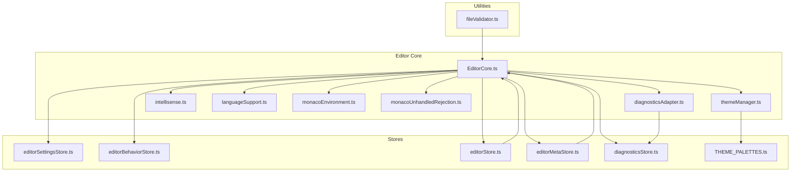

**Diagram sources**
- [EditorCore.ts](file://src/lib/editor/EditorCore.ts#L1-L891)
- [diagnosticsAdapter.ts](file://src/lib/editor/diagnosticsAdapter.ts#L1-L61)
- [themeManager.ts](file://src/lib/editor/themeManager.ts#L1-L274)
- [intellisense.ts](file://src/lib/editor/intellisense.ts#L1-L327)
- [languageSupport.ts](file://src/lib/editor/languageSupport.ts#L1-L70)
- [monacoEnvironment.ts](file://src/lib/editor/monacoEnvironment.ts#L1-L131)
- [monacoUnhandledRejection.ts](file://src/lib/editor/monacoUnhandledRejection.ts#L1-L30)
- [editorSettingsStore.ts](file://src/lib/stores/editorSettingsStore.ts#L1-L180)
- [editorBehaviorStore.ts](file://src/lib/stores/editorBehaviorStore.ts#L1-L56)
- [editorStore.ts](file://src/lib/stores/editorStore.ts#L1-L380)
- [editorMetaStore.ts](file://src/lib/stores/editorMetaStore.ts#L1-L40)
- [diagnosticsStore.ts](file://src/lib/stores/diagnosticsStore.ts#L1-L142)
- [THEME_PALETTES.ts](file://src/lib/stores/THEME_PALETTES.ts#L1-L314)
- [fileValidator.ts](file://src/lib/utils/fileValidator.ts#L1-L111)

**Section sources**
- [EditorCore.ts](file://src/lib/editor/EditorCore.ts#L1-L120)
- [monacoEnvironment.ts](file://src/lib/editor/monacoEnvironment.ts#L1-L131)

## Core Components
- EditorCoreApi: Public API surface exposing editor operations, model management, configuration, diagnostics, diff sessions, and event subscriptions.
- CoreState: Internal state holding Monaco instance, editor instance, models, active file identifier, options, and event subscriptions.
- EditorCapabilities: Flags indicating core capabilities such as multi-model support, preserved undo stack on switch, diff readiness, and extensible languages.
- EditorCoreOptions: Typed configuration options for editor display, editing, minimap, folding, and performance-related settings.
- EditorModelDescriptor: Descriptor for creating or switching models by file identifier.
- EditorDiagnostic: Minimal representation of diagnostic messages compatible with Monaco’s IMarkerData.

Key implementation highlights:
- Constructor-like factory function that initializes state and returns a typed API.
- attachTo(container, options?): Creates or recreates the editor with performance-oriented defaults and applies user options.
- dispose(): Safely disposes editor, models, and event subscriptions.
- setModel(descriptor): Creates or retrieves a model by file identifier, sets it as active, and subscribes to its content/cursor events.
- configure(options): Updates editor options and applies them to the active editor instance.
- setDiagnostics(fileId, diagnostics): Converts and applies diagnostic markers to a model.
- createDiffSession(params): Creates a diff editor session backed by existing or lazily created models.
- Event subscriptions: onDidChangeContent(listener) and onDidChangeCursorPosition(listener) with proper cleanup.

**Section sources**
- [EditorCore.ts](file://src/lib/editor/EditorCore.ts#L120-L200)
- [EditorCore.ts](file://src/lib/editor/EditorCore.ts#L340-L541)
- [EditorCore.ts](file://src/lib/editor/EditorCore.ts#L541-L891)

## Architecture Overview
The EditorCore orchestrates Monaco Editor integration and exposes a thin, typed API. It delegates language support and IntelliSense to dedicated modules, synchronizes diagnostics via a dedicated adapter, and coordinates theme application through ThemeManager. Stores manage application state and UI integration.

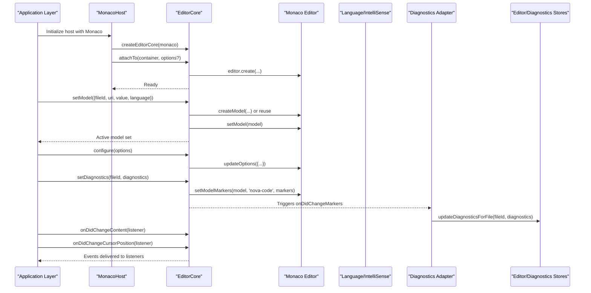

**Diagram sources**
- [EditorCore.ts](file://src/lib/editor/EditorCore.ts#L407-L891)
- [diagnosticsAdapter.ts](file://src/lib/editor/diagnosticsAdapter.ts#L1-L61)
- [diagnosticsStore.ts](file://src/lib/stores/diagnosticsStore.ts#L1-L142)

## Detailed Component Analysis

### EditorCore Class and API
EditorCore is implemented as a factory that returns a strongly typed API. Internally, it maintains a state object with Monaco instance, editor instance, models map, active file identifier, options, and event subscriptions. The API exposes methods for lifecycle, model management, configuration, diagnostics, diff sessions, and event subscriptions.

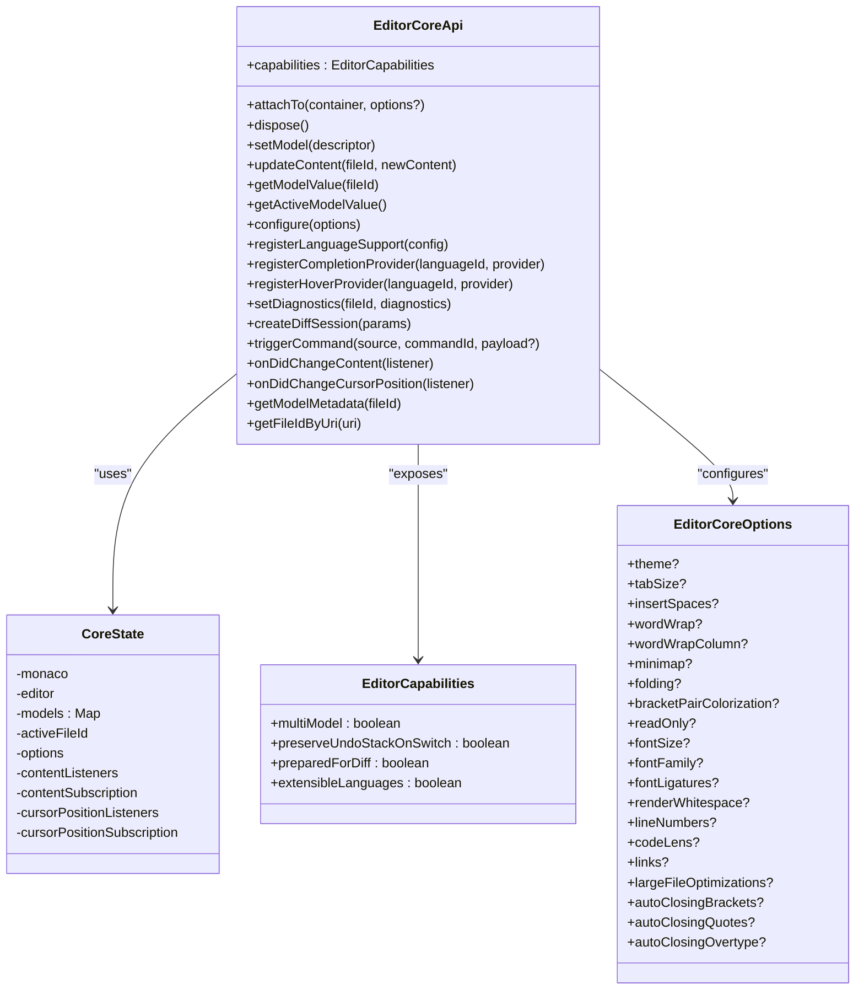

**Diagram sources**
- [EditorCore.ts](file://src/lib/editor/EditorCore.ts#L120-L200)
- [EditorCore.ts](file://src/lib/editor/EditorCore.ts#L316-L340)
- [EditorCore.ts](file://src/lib/editor/EditorCore.ts#L340-L541)

**Section sources**
- [EditorCore.ts](file://src/lib/editor/EditorCore.ts#L120-L200)
- [EditorCore.ts](file://src/lib/editor/EditorCore.ts#L316-L340)
- [EditorCore.ts](file://src/lib/editor/EditorCore.ts#L340-L541)

### Initialization Sequence
The initialization sequence ensures that Monaco workers are configured, EditorCore is created, and the editor is attached to a container with optional configuration.

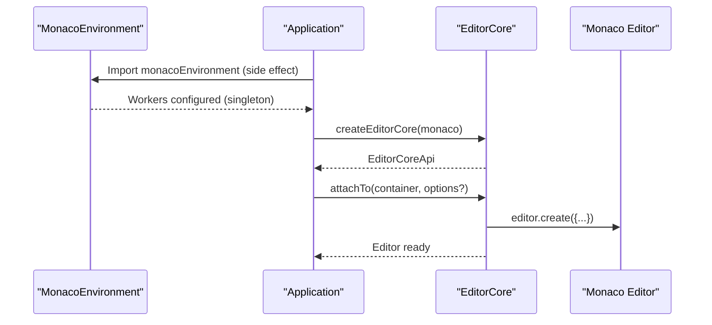

**Diagram sources**
- [monacoEnvironment.ts](file://src/lib/editor/monacoEnvironment.ts#L1-L131)
- [EditorCore.ts](file://src/lib/editor/EditorCore.ts#L407-L541)

**Section sources**
- [monacoEnvironment.ts](file://src/lib/editor/monacoEnvironment.ts#L1-L131)
- [EditorCore.ts](file://src/lib/editor/EditorCore.ts#L407-L541)

### Shutdown Procedures
Proper disposal is essential to prevent memory leaks. The dispose method cleans up content and cursor subscriptions, disposes the editor, and disposes all managed models.

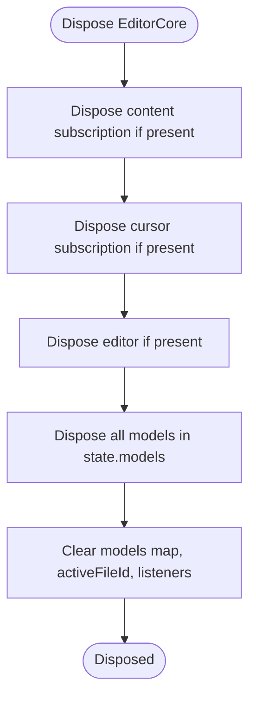

**Diagram sources**
- [EditorCore.ts](file://src/lib/editor/EditorCore.ts#L517-L541)

**Section sources**
- [EditorCore.ts](file://src/lib/editor/EditorCore.ts#L517-L541)

### Model Management System
EditorCore manages multiple models keyed by file identifiers. It creates models when needed, switches active models without losing undo/redo history, and provides utilities to update content and query metadata.

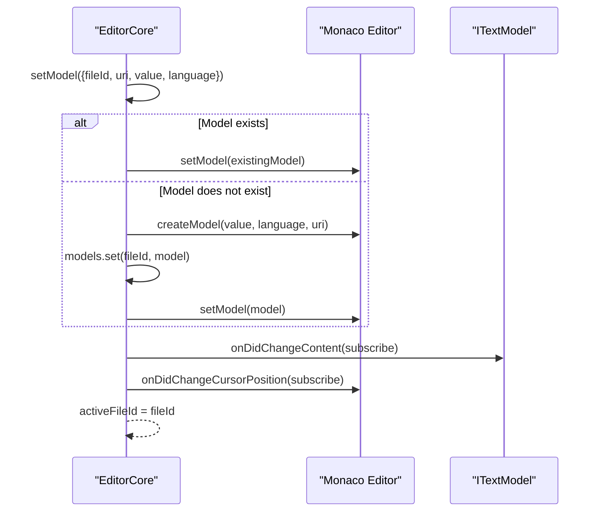

**Diagram sources**
- [EditorCore.ts](file://src/lib/editor/EditorCore.ts#L543-L601)

**Section sources**
- [EditorCore.ts](file://src/lib/editor/EditorCore.ts#L543-L601)

### Diagnostics Integration
EditorCore integrates with Monaco markers and a diagnostics adapter to synchronize diagnostics with the diagnostics store for UI consumption.

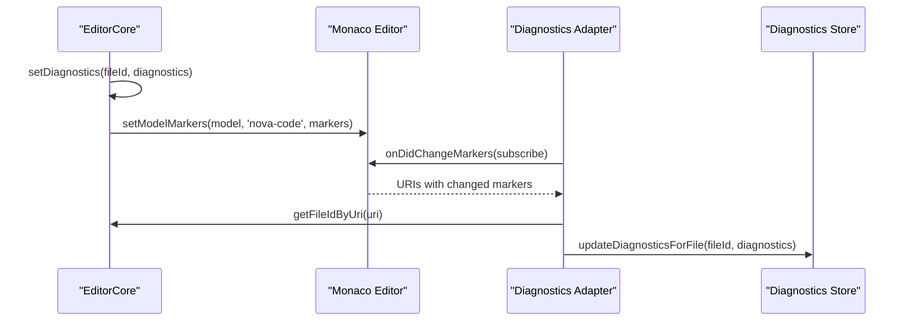

**Diagram sources**
- [EditorCore.ts](file://src/lib/editor/EditorCore.ts#L693-L725)
- [diagnosticsAdapter.ts](file://src/lib/editor/diagnosticsAdapter.ts#L1-L61)
- [diagnosticsStore.ts](file://src/lib/stores/diagnosticsStore.ts#L1-L142)

**Section sources**
- [EditorCore.ts](file://src/lib/editor/EditorCore.ts#L693-L725)
- [diagnosticsAdapter.ts](file://src/lib/editor/diagnosticsAdapter.ts#L1-L61)
- [diagnosticsStore.ts](file://src/lib/stores/diagnosticsStore.ts#L1-L142)

### Theme Synchronization
Theme synchronization is handled by ThemeManager, which registers and applies themes. EditorCore reads editor settings and applies theme changes via ThemeManager and Monaco’s theme API.

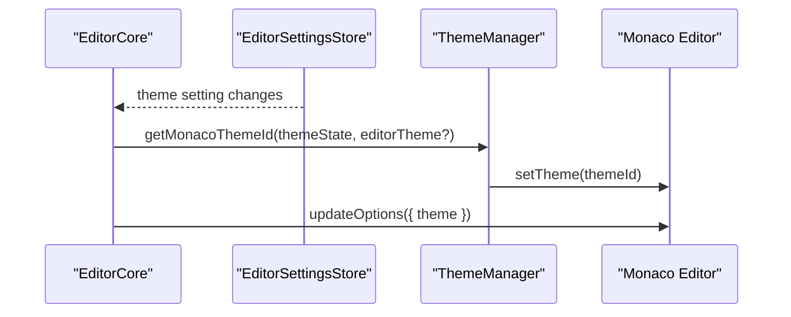

**Diagram sources**
- [themeManager.ts](file://src/lib/editor/themeManager.ts#L256-L274)
- [EditorCore.ts](file://src/lib/editor/EditorCore.ts#L619-L650)
- [editorSettingsStore.ts](file://src/lib/stores/editorSettingsStore.ts#L1-L180)

**Section sources**
- [themeManager.ts](file://src/lib/editor/themeManager.ts#L1-L274)
- [EditorCore.ts](file://src/lib/editor/EditorCore.ts#L619-L650)
- [editorSettingsStore.ts](file://src/lib/stores/editorSettingsStore.ts#L1-L180)

### Language Support and IntelliSense
Language support and IntelliSense are integrated through dedicated modules. LanguageSupport maps internal IDs to Monaco language IDs and registers basic languages. IntelliSense sets up language services and providers with performance optimizations.

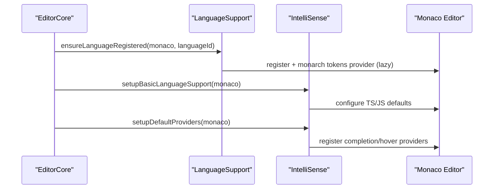

**Diagram sources**
- [languageSupport.ts](file://src/lib/editor/languageSupport.ts#L1-L70)
- [intellisense.ts](file://src/lib/editor/intellisense.ts#L1-L327)
- [EditorCore.ts](file://src/lib/editor/EditorCore.ts#L652-L691)

**Section sources**
- [languageSupport.ts](file://src/lib/editor/languageSupport.ts#L1-L70)
- [intellisense.ts](file://src/lib/editor/intellisense.ts#L1-L327)
- [EditorCore.ts](file://src/lib/editor/EditorCore.ts#L652-L691)

### Diff Editor Session
EditorCore supports creating diff sessions backed by existing or lazily created models. The diff editor is mounted into a container and can be updated independently of the core editor.

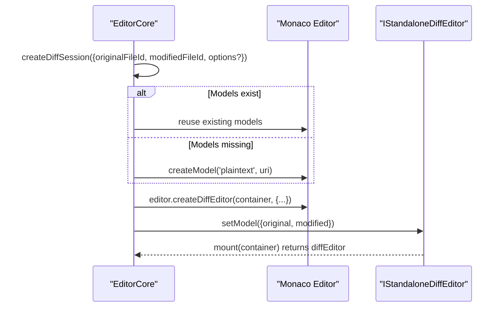

**Diagram sources**
- [EditorCore.ts](file://src/lib/editor/EditorCore.ts#L727-L891)

**Section sources**
- [EditorCore.ts](file://src/lib/editor/EditorCore.ts#L727-L891)

## Dependency Analysis
EditorCore depends on Monaco Editor APIs and integrates with several modules and stores. The dependency graph below illustrates these relationships.

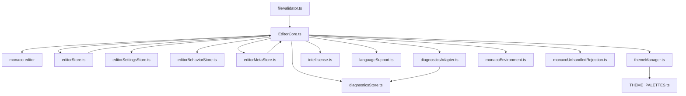

**Diagram sources**
- [EditorCore.ts](file://src/lib/editor/EditorCore.ts#L1-L891)
- [diagnosticsAdapter.ts](file://src/lib/editor/diagnosticsAdapter.ts#L1-L61)
- [themeManager.ts](file://src/lib/editor/themeManager.ts#L1-L274)
- [intellisense.ts](file://src/lib/editor/intellisense.ts#L1-L327)
- [languageSupport.ts](file://src/lib/editor/languageSupport.ts#L1-L70)
- [monacoEnvironment.ts](file://src/lib/editor/monacoEnvironment.ts#L1-L131)
- [monacoUnhandledRejection.ts](file://src/lib/editor/monacoUnhandledRejection.ts#L1-L30)
- [editorSettingsStore.ts](file://src/lib/stores/editorSettingsStore.ts#L1-L180)
- [editorBehaviorStore.ts](file://src/lib/stores/editorBehaviorStore.ts#L1-L56)
- [editorStore.ts](file://src/lib/stores/editorStore.ts#L1-L380)
- [editorMetaStore.ts](file://src/lib/stores/editorMetaStore.ts#L1-L40)
- [diagnosticsStore.ts](file://src/lib/stores/diagnosticsStore.ts#L1-L142)
- [THEME_PALETTES.ts](file://src/lib/stores/THEME_PALETTES.ts#L1-L314)
- [fileValidator.ts](file://src/lib/utils/fileValidator.ts#L1-L111)

**Section sources**
- [EditorCore.ts](file://src/lib/editor/EditorCore.ts#L1-L891)
- [diagnosticsAdapter.ts](file://src/lib/editor/diagnosticsAdapter.ts#L1-L61)
- [themeManager.ts](file://src/lib/editor/themeManager.ts#L1-L274)
- [intellisense.ts](file://src/lib/editor/intellisense.ts#L1-L327)
- [languageSupport.ts](file://src/lib/editor/languageSupport.ts#L1-L70)
- [monacoEnvironment.ts](file://src/lib/editor/monacoEnvironment.ts#L1-L131)
- [monacoUnhandledRejection.ts](file://src/lib/editor/monacoUnhandledRejection.ts#L1-L30)
- [editorSettingsStore.ts](file://src/lib/stores/editorSettingsStore.ts#L1-L180)
- [editorBehaviorStore.ts](file://src/lib/stores/editorBehaviorStore.ts#L1-L56)
- [editorStore.ts](file://src/lib/stores/editorStore.ts#L1-L380)
- [editorMetaStore.ts](file://src/lib/stores/editorMetaStore.ts#L1-L40)
- [diagnosticsStore.ts](file://src/lib/stores/diagnosticsStore.ts#L1-L142)
- [THEME_PALETTES.ts](file://src/lib/stores/THEME_PALETTES.ts#L1-L314)
- [fileValidator.ts](file://src/lib/utils/fileValidator.ts#L1-L111)

## Performance Considerations
- Automatic layout and reduced animations: The editor is configured with automatic layout and disabled smooth scrolling and cursor animation to improve responsiveness.
- Quick suggestions delay: A short delay reduces UI responsiveness overhead while maintaining IntelliSense feedback.
- Minimap optimizations: Minimap rendering can be tuned to reduce CPU/GPU load.
- Large file optimizations: The file validator suggests disabling certain features for large files and enables large file optimizations.
- Worker configuration: MonacoEnvironment configures ESM workers for Monaco, enabling efficient language services and diagnostics.

Practical tips:
- Disable minimap, code lens, and links for very large files.
- Prefer lightweight fonts and disable heavy decorations when editing large files.
- Use largeFileOptimizations to reduce rendering overhead.

**Section sources**
- [EditorCore.ts](file://src/lib/editor/EditorCore.ts#L407-L541)
- [fileValidator.ts](file://src/lib/utils/fileValidator.ts#L1-L111)
- [monacoEnvironment.ts](file://src/lib/editor/monacoEnvironment.ts#L1-L131)

## Troubleshooting Guide
Common issues and resolutions:
- Memory leaks during disposal: Ensure dispose() is called to release editor, models, and subscriptions. Verify that content and cursor subscriptions are disposed.
- Unhandled rejections during disposal: Use silenceMonacoCancellationErrors() to ignore cancellation-related rejections that are expected during disposal.
- Worker initialization: Import monacoEnvironment before using Monaco to ensure workers are configured.
- Diagnostics not updating: Confirm diagnostics adapter is attached and markers are applied to the correct model.

**Section sources**
- [EditorCore.ts](file://src/lib/editor/EditorCore.ts#L517-L541)
- [monacoUnhandledRejection.ts](file://src/lib/editor/monacoUnhandledRejection.ts#L1-L30)
- [monacoEnvironment.ts](file://src/lib/editor/monacoEnvironment.ts#L1-L131)
- [diagnosticsAdapter.ts](file://src/lib/editor/diagnosticsAdapter.ts#L1-L61)

## Conclusion
EditorCore provides a robust, extensible foundation for integrating Monaco Editor into the application. It encapsulates lifecycle management, model orchestration, configuration, diagnostics, and event handling while delegating specialized concerns to dedicated modules. By following the patterns outlined here—proper initialization, configuration, disposal, and integration with stores and adapters—you can build a performant and maintainable editor experience.

## Appendices

### Practical Usage Examples
- Instantiate and configure EditorCore:
  - Create the core with the Monaco instance.
  - Attach to a DOM container and pass initial options.
  - Configure editor options dynamically.
  - Example paths:
    - [EditorCore.ts](file://src/lib/editor/EditorCore.ts#L407-L541)
    - [EditorCore.ts](file://src/lib/editor/EditorCore.ts#L619-L650)

- Handle editor events:
  - Subscribe to content changes and cursor position updates.
  - Example paths:
    - [EditorCore.ts](file://src/lib/editor/EditorCore.ts#L543-L601)
    - [EditorCore.ts](file://src/lib/editor/EditorCore.ts#L276-L314)

- Interact with Monaco Editor API:
  - Trigger commands, register language providers, and manage models.
  - Example paths:
    - [EditorCore.ts](file://src/lib/editor/EditorCore.ts#L263-L314)
    - [EditorCore.ts](file://src/lib/editor/EditorCore.ts#L652-L691)

- Diagnostics integration:
  - Apply markers and track changes via diagnostics adapter.
  - Example paths:
    - [EditorCore.ts](file://src/lib/editor/EditorCore.ts#L693-L725)
    - [diagnosticsAdapter.ts](file://src/lib/editor/diagnosticsAdapter.ts#L1-L61)
    - [diagnosticsStore.ts](file://src/lib/stores/diagnosticsStore.ts#L1-L142)

- Theme synchronization:
  - Derive theme ID from theme store and apply via ThemeManager.
  - Example paths:
    - [themeManager.ts](file://src/lib/editor/themeManager.ts#L256-L274)
    - [THEME_PALETTES.ts](file://src/lib/stores/THEME_PALETTES.ts#L1-L314)

- Language support and IntelliSense:
  - Register languages and providers.
  - Example paths:
    - [languageSupport.ts](file://src/lib/editor/languageSupport.ts#L1-L70)
    - [intellisense.ts](file://src/lib/editor/intellisense.ts#L1-L327)

- Diff editor session:
  - Create and mount a diff editor for two models.
  - Example paths:
    - [EditorCore.ts](file://src/lib/editor/EditorCore.ts#L727-L891)

- Large file handling:
  - Validate file size and apply optimizations.
  - Example paths:
    - [fileValidator.ts](file://src/lib/utils/fileValidator.ts#L1-L111)