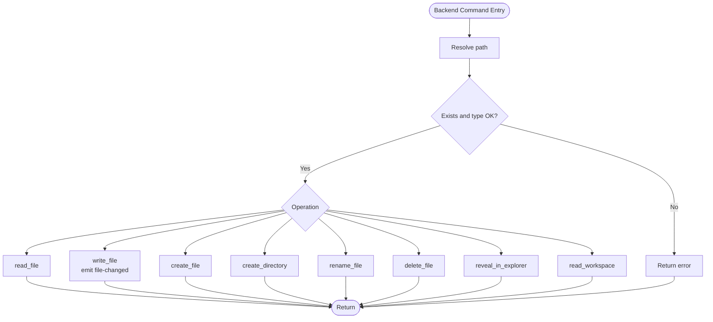
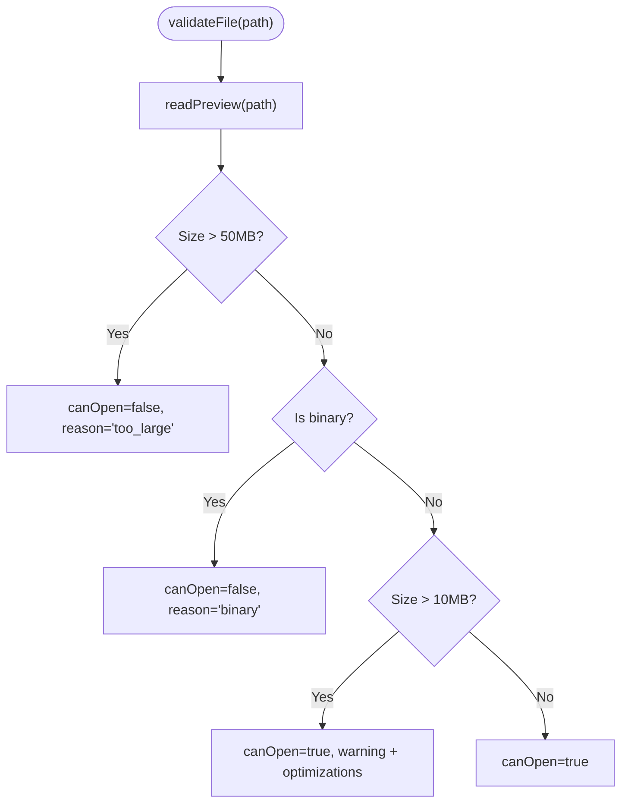

# Services

<cite>
**Referenced Files in This Document**
- [fileService.ts](file://src/lib/services/fileService.ts)
- [fileNode.ts](file://src/lib/types/fileNode.ts)
- [fileTreeActions.ts](file://src/lib/sidebar/fileTreeActions.ts)
- [fileTreeStore.ts](file://src/lib/stores/fileTreeStore.ts)
- [workspaceStore.ts](file://src/lib/stores/workspaceStore.ts)
- [editorStore.ts](file://src/lib/stores/editorStore.ts)
- [EditorCore.ts](file://src/lib/editor/EditorCore.ts)
- [fileValidator.ts](file://src/lib/utils/fileValidator.ts)
- [lib.rs](file://src-tauri/src/lib.rs)
- [main.rs](file://src-tauri/src/main.rs)
</cite>

## Table of Contents

1. [Introduction](#introduction)
2. [Project Structure](#project-structure)
3. [Core Components](#core-components)
4. [Architecture Overview](#architecture-overview)
5. [Detailed Component Analysis](#detailed-component-analysis)
6. [Dependency Analysis](#dependency-analysis)
7. [Performance Considerations](#performance-considerations)
8. [Troubleshooting Guide](#troubleshooting-guide)
9. [Conclusion](#conclusion)

## Introduction

This document explains the services layer focused on the fileService that powers file operations in the NC code editor. It covers how the frontend Svelte layer interacts with the Tauri Rust backend using the invoke/listen pattern, the interfaces exposed by the fileService, and how it bridges the Explorer, Editor, and Workspace stores. It also documents the backend commands that implement file operations, directory management, and file watching, and provides practical guidance for handling permissions, concurrency, and large files.

## Project Structure

The fileService lives in the frontend services layer and coordinates with stores and actions that orchestrate UI behavior. The Tauri backend implements the actual file operations and emits events for file changes.

**Diagram sources**

- [fileService.ts](file://src/lib/services/fileService.ts#L1-L85)
- [workspaceStore.ts](file://src/lib/stores/workspaceStore.ts#L1-L130)
- [fileTreeStore.ts](file://src/lib/stores/fileTreeStore.ts#L1-L290)
- [fileTreeActions.ts](file://src/lib/sidebar/fileTreeActions.ts#L1-L135)
- [editorStore.ts](file://src/lib/stores/editorStore.ts#L1-L381)
- [EditorCore.ts](file://src/lib/editor/EditorCore.ts#L173-L612)
- [fileValidator.ts](file://src/lib/utils/fileValidator.ts#L1-L131)
- [fileNode.ts](file://src/lib/types/fileNode.ts#L1-L19)
- [lib.rs](file://src-tauri/src/lib.rs#L249-L441)
- [main.rs](file://src-tauri/src/main.rs#L1-L7)

**Section sources**

- [fileService.ts](file://src/lib/services/fileService.ts#L1-L85)
- [lib.rs](file://src-tauri/src/lib.rs#L249-L441)

## Core Components

- fileService: Provides a unified asynchronous API for file operations and file watching. It wraps Tauri commands and listens to file-change events.
- workspaceStore: Maintains the workspace state and triggers refreshes when file changes occur.
- fileTreeStore: Manages the Explorer UI state (expanded/collapsed directories and selected file).
- fileTreeActions: Orchestrates user actions in the Explorer (open, new file/folder, rename, delete, reveal).
- editorStore: Manages editor tabs and integrates with fileService for saving content.
- EditorCore: Handles Monaco editor models and content synchronization.
- fileValidator: Validates files before opening to prevent crashes on large or binary files.
- Backend commands: Implemented in Rust, expose Tauri commands for read/write, directory creation, renaming, deletion, revealing in explorer, and file watching.

Key responsibilities:

- fileService: Centralized file operations and event subscription.
- workspaceStore: Loads and refreshes the workspace tree and sets up watchers.
- fileTreeActions: Translates UI actions into fileService invocations and workspace refresh.
- editorStore: Persists editor content via fileService and marks tabs dirty.
- fileValidator: Guards against large/binary files.

**Section sources**

- [fileService.ts](file://src/lib/services/fileService.ts#L15-L84)
- [workspaceStore.ts](file://src/lib/stores/workspaceStore.ts#L1-L130)
- [fileTreeStore.ts](file://src/lib/stores/fileTreeStore.ts#L1-L290)
- [fileTreeActions.ts](file://src/lib/sidebar/fileTreeActions.ts#L1-L135)
- [editorStore.ts](file://src/lib/stores/editorStore.ts#L280-L349)
- [EditorCore.ts](file://src/lib/editor/EditorCore.ts#L173-L612)
- [fileValidator.ts](file://src/lib/utils/fileValidator.ts#L1-L131)
- [lib.rs](file://src-tauri/src/lib.rs#L249-L441)

## Architecture Overview

The frontend invokes Tauri commands and listens for file-change events emitted by the backend. The workspaceStore subscribes to these events to keep the Explorer synchronized. Actions in the Explorer call fileService methods, which in turn call backend commands. Saving content from the editor triggers write operations through fileService.

**Diagram sources**

- [fileTreeActions.ts](file://src/lib/sidebar/fileTreeActions.ts#L84-L106)
- [fileService.ts](file://src/lib/services/fileService.ts#L30-L84)
- [lib.rs](file://src-tauri/src/lib.rs#L372-L388)
- [workspaceStore.ts](file://src/lib/stores/workspaceStore.ts#L74-L94)
- [editorStore.ts](file://src/lib/stores/editorStore.ts#L300-L306)

## Detailed Component Analysis

### fileService

The fileService defines a clean interface for file operations and file watching. It encapsulates:

- readFile(fileId): Reads a file’s content.
- writeFile(fileId, content): Writes content to a file.
- listWorkspaceFiles(rootOverride?): Lists workspace files rooted at a given path.
- onFileChange(cb): Subscribes to file-change events and returns an unlisten function.
- createFile(path), createDirectory(path), renameFile(oldPath, newPath), deleteFile(path, useTrash): Directory and file management.
- revealInExplorer(path): Opens the OS file manager at a given path.
- startFileWatcher(): Starts the backend file watcher.
- setWorkspaceRoot(root), getWorkspaceRoot(): Manages workspace root.

Implementation highlights:

- Uses @tauri-apps/api/core invoke and listen to communicate with backend commands.
- Exposes a typed interface for easy testing and mocking.
- Emits a file-changed event payload that the backend sends when a file is written.

**Diagram sources**

- [fileService.ts](file://src/lib/services/fileService.ts#L15-L84)

**Section sources**

- [fileService.ts](file://src/lib/services/fileService.ts#L15-L84)

### Backend Commands (Rust)

The backend implements the following commands:

- read_workspace(root): Builds a tree of files/directories under the given root.
- read_file(path): Reads a file and returns its content.
- write_file(request): Writes content to a file and emits a file-changed event.
- create_file(path), create_directory(path), rename_file(old_path, new_path), delete_file(path, use_trash): Manage files and directories.
- reveal_in_explorer(path): Opens the OS file manager at the directory containing the path.
- start_file_watcher(): Starts a recursive file watcher and emits file-changed events.

Key behaviors:

- Path resolution resolves relative paths against the current working directory.
- write_file creates parent directories if needed and emits a file-changed event.
- read_workspace gracefully handles unreadable directories by skipping them.
- start_file_watcher uses a thread-safe guard and a channel to emit events.

**Diagram sources**

- [lib.rs](file://src-tauri/src/lib.rs#L249-L441)

**Section sources**

- [lib.rs](file://src-tauri/src/lib.rs#L249-L441)

### Workspace Store and File Watching

workspaceStore:

- Loads the workspace tree via fileService.listWorkspaceFiles.
- Sets up a file-change watcher via fileService.onFileChange and refreshes the tree on each event.
- Starts the backend file watcher via fileService.startFileWatcher.
- Exposes helpers to open/close folders and resolve paths.

**Diagram sources**

- [workspaceStore.ts](file://src/lib/stores/workspaceStore.ts#L74-L94)
- [fileService.ts](file://src/lib/services/fileService.ts#L44-L51)
- [lib.rs](file://src-tauri/src/lib.rs#L396-L425)

**Section sources**

- [workspaceStore.ts](file://src/lib/stores/workspaceStore.ts#L1-L130)
- [fileService.ts](file://src/lib/services/fileService.ts#L44-L51)
- [lib.rs](file://src-tauri/src/lib.rs#L396-L425)

### Explorer Actions and File Operations

fileTreeActions:

- newFile(node): Computes target directory, calls fileService.createFile, then refreshes workspace.
- newFolder(node): Computes target directory, calls fileService.createDirectory, then refreshes workspace.
- rename(node): Prompts for new name, computes new path, calls fileService.renameFile, then refreshes workspace.
- deleteNode(node): Asks whether to move to trash or delete permanently, calls fileService.deleteFile, then refreshes workspace.
- revealInExplorer(node): Calls fileService.revealInExplorer and updates the Explorer selection.

**Diagram sources**

- [fileTreeActions.ts](file://src/lib/sidebar/fileTreeActions.ts#L84-L106)
- [fileService.ts](file://src/lib/services/fileService.ts#L53-L59)
- [workspaceStore.ts](file://src/lib/stores/workspaceStore.ts#L55-L71)

**Section sources**

- [fileTreeActions.ts](file://src/lib/sidebar/fileTreeActions.ts#L84-L135)
- [fileService.ts](file://src/lib/services/fileService.ts#L53-L67)
- [workspaceStore.ts](file://src/lib/stores/workspaceStore.ts#L55-L71)

### Editor Integration and Save Flow

editorStore:

- updateContent(id, value): Finds the file node, calls fileService.writeFile, and clears the dirty flag.
- ensureTabForFile(pathOrId, opts): Creates or activates an editor tab and integrates with editor groups.

**Diagram sources**

- [EditorCore.ts](file://src/lib/editor/EditorCore.ts#L574-L601)
- [editorStore.ts](file://src/lib/stores/editorStore.ts#L300-L306)
- [fileService.ts](file://src/lib/services/fileService.ts#L35-L37)
- [lib.rs](file://src-tauri/src/lib.rs#L372-L388)

**Section sources**

- [editorStore.ts](file://src/lib/stores/editorStore.ts#L284-L306)
- [EditorCore.ts](file://src/lib/editor/EditorCore.ts#L574-L601)
- [fileService.ts](file://src/lib/services/fileService.ts#L35-L37)
- [lib.rs](file://src-tauri/src/lib.rs#L372-L388)

### File Validation for Large/Binary Files

fileValidator:

- Validates file size and binary content before opening.
- Returns canOpen, reason, warning, and optional editor optimizations for large files.

**Diagram sources**

- [fileValidator.ts](file://src/lib/utils/fileValidator.ts#L1-L131)

**Section sources**

- [fileValidator.ts](file://src/lib/utils/fileValidator.ts#L1-L131)

## Dependency Analysis

- fileService depends on:
  - @tauri-apps/api/core for invoke/listen.
  - fileNode type for workspace tree shape.
- workspaceStore depends on:
  - fileService for listing and watching.
  - fileTreeStore for UI state.
- fileTreeActions depends on:
  - fileService for file operations.
  - workspaceStore for refreshing.
- editorStore depends on:
  - fileService for writing content.
  - fileTreeStore for file metadata.
- Backend (lib.rs) exposes commands invoked by fileService and emits file-changed events.

**Diagram sources**

- [fileService.ts](file://src/lib/services/fileService.ts#L1-L85)
- [workspaceStore.ts](file://src/lib/stores/workspaceStore.ts#L1-L130)
- [fileTreeActions.ts](file://src/lib/sidebar/fileTreeActions.ts#L1-L135)
- [editorStore.ts](file://src/lib/stores/editorStore.ts#L1-L381)
- [fileTreeStore.ts](file://src/lib/stores/fileTreeStore.ts#L1-L290)
- [fileValidator.ts](file://src/lib/utils/fileValidator.ts#L1-L131)
- [fileNode.ts](file://src/lib/types/fileNode.ts#L1-L19)
- [lib.rs](file://src-tauri/src/lib.rs#L249-L441)

**Section sources**

- [fileService.ts](file://src/lib/services/fileService.ts#L1-L85)
- [workspaceStore.ts](file://src/lib/stores/workspaceStore.ts#L1-L130)
- [fileTreeActions.ts](file://src/lib/sidebar/fileTreeActions.ts#L1-L135)
- [editorStore.ts](file://src/lib/stores/editorStore.ts#L1-L381)
- [fileTreeStore.ts](file://src/lib/stores/fileTreeStore.ts#L1-L290)
- [fileValidator.ts](file://src/lib/utils/fileValidator.ts#L1-L131)
- [fileNode.ts](file://src/lib/types/fileNode.ts#L1-L19)
- [lib.rs](file://src-tauri/src/lib.rs#L249-L441)

## Performance Considerations

- Large file handling:
  - Use fileValidator to prevent opening files larger than 50 MB and to disable heavy editor features for files larger than 10 MB.
  - For extremely large files, consider streaming reads/writes or offloading to background threads.
- File watching:
  - The backend watcher uses a channel and a thread; ensure the watcher guard prevents duplicate watchers.
  - Avoid excessive refresh cycles by debouncing workspace refreshes when multiple file changes occur rapidly.
- Concurrency:
  - Avoid overlapping writes to the same file. Queue or coalesce editor saves to reduce contention.
  - For bulk operations (e.g., rename multiple files), batch requests and refresh once.

[No sources needed since this section provides general guidance]

## Troubleshooting Guide

Common issues and resolutions:

- Permission errors:
  - Backend commands return descriptive errors when paths are inaccessible. Catch and surface errors to the user in actions and stores.
  - Ensure the app has appropriate permissions to read/write the workspace root.
- Race conditions:
  - When saving frequently, ensure only one write is active at a time per file. Debounce editor content changes before invoking fileService.writeFile.
  - Use workspaceStore.refresh() sparingly; batch refreshes after multiple file operations.
- Large file operations:
  - Use fileValidator to warn users and apply performance optimizations. For truly massive files, consider external tools or streaming approaches.
- Event storms:
  - If many files change quickly, the watcher may emit bursts of file-changed events. workspaceStore.refresh() is resilient, but consider debouncing to reduce UI thrashing.

**Section sources**

- [lib.rs](file://src-tauri/src/lib.rs#L249-L441)
- [fileTreeActions.ts](file://src/lib/sidebar/fileTreeActions.ts#L44-L47)
- [workspaceStore.ts](file://src/lib/stores/workspaceStore.ts#L55-L71)
- [fileValidator.ts](file://src/lib/utils/fileValidator.ts#L1-L131)

## Conclusion

The fileService provides a cohesive frontend abstraction over Tauri commands, enabling robust file operations, directory management, and file watching. Combined with workspaceStore, fileTreeStore, fileTreeActions, and editorStore, it delivers a responsive editing experience. The backend commands implement safe, cross-platform file operations and emit change events to keep the UI synchronized. By following the validation and concurrency recommendations, teams can build reliable workflows for everyday development tasks.
