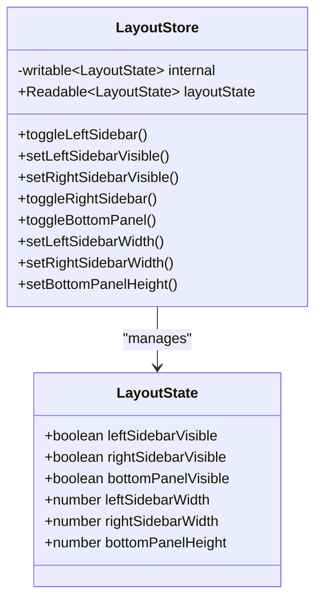
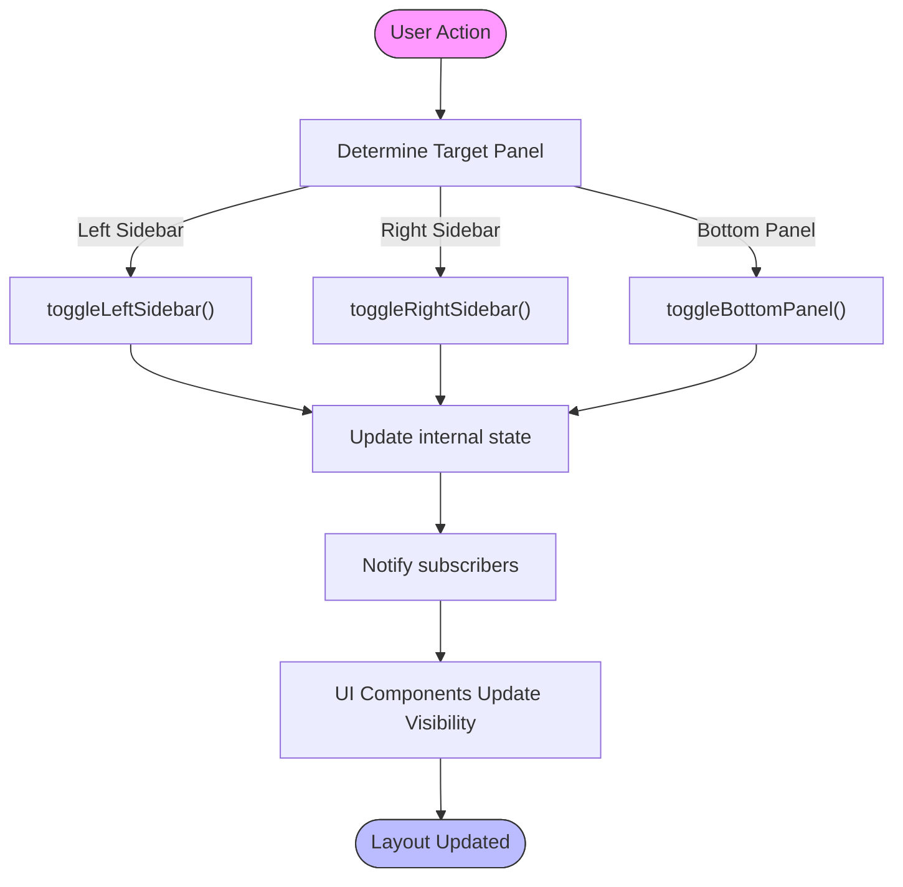
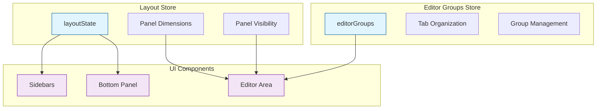
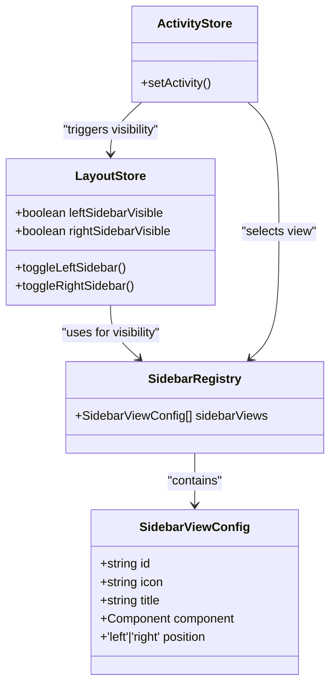
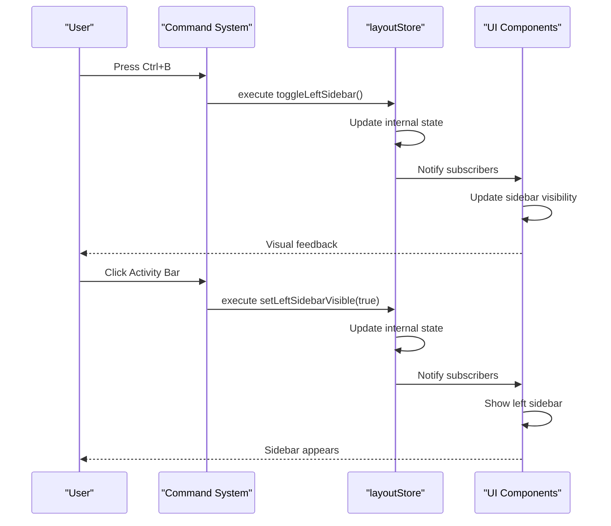

# Layout Store

<cite>
**Referenced Files in This Document**   
- [layoutStore.ts](file://src/lib/stores/layout/layoutStore.ts)
- [editorGroupsStore.ts](file://src/lib/stores/layout/editorGroupsStore.ts)
- [bottomPanelStore.ts](file://src/lib/stores/bottomPanelStore.ts)
- [sidebarRegistry.ts](file://src/lib/layout/sidebarRegistry.ts)
- [defaultCommands.ts](file://src/lib/commands/defaultCommands.ts)
- [fileTreeActions.ts](file://src/lib/sidebar/fileTreeActions.ts)
</cite>

## Table of Contents

1. [Introduction](#introduction)
2. [Layout State Structure](#layout-state-structure)
3. [Core Layout Management](#core-layout-management)
4. [Panel Visibility Control](#panel-visibility-control)
5. [Panel Size Management](#panel-size-management)
6. [Integration with Editor Groups](#integration-with-editor-groups)
7. [Bottom Panel Coordination](#bottom-panel-coordination)
8. [Sidebar Registry Relationship](#sidebar-registry-relationship)
9. [Reactive Patterns and State Synchronization](#reactive-patterns-and-state-synchronization)
10. [Command Integration and User Actions](#command-integration-and-user-actions)
11. [Common Issues and Solutions](#common-issues-and-solutions)

## Introduction

The layoutStore in the NC code editor provides a centralized state management system for the application's user interface layout, following VS Code-inspired patterns. It serves as the single source of truth for the visibility and dimensions of major UI containers, including sidebars and the bottom panel. The store is designed to be UI-agnostic, focusing solely on layout state without knowledge of specific components or views. This separation of concerns allows for a clean architecture where layout state is managed independently from the components that render the UI, enabling consistent layout behavior across the application.

**Section sources**

- [layoutStore.ts](file://src/lib/stores/layout/layoutStore.ts#L3-L12)

## Layout State Structure

The LayoutState interface defines the core properties that govern the application's layout. It includes boolean flags for the visibility of left and right sidebars and the bottom panel, as well as numeric values for their dimensions in pixels. The initial state configures a VS Code-like layout with the left sidebar visible and set to 280px width, while the right sidebar and bottom panel are initially hidden. This structure provides a comprehensive representation of the workbench layout, allowing components to subscribe to changes and react accordingly. The store uses Svelte's writable store internally but exposes a read-only interface to prevent direct mutations, ensuring that all state changes occur through well-defined functions.

**Diagram sources**

- [layoutStore.ts](file://src/lib/stores/layout/layoutStore.ts#L13-L23)
- [layoutStore.ts](file://src/lib/stores/layout/layoutStore.ts#L26-L37)

**Section sources**

- [layoutStore.ts](file://src/lib/stores/layout/layoutStore.ts#L13-L37)

## Core Layout Management

The layoutStore implements a centralized approach to managing the application's window and panel arrangement. It maintains the overall workbench layout by tracking the visibility and dimensions of key UI regions, serving as the authoritative source for layout state. The store follows a unidirectional data flow pattern where components subscribe to the layout state and react to changes, but cannot modify the state directly. Instead, mutations are performed through exported functions that update the internal writable store. This design ensures consistency and predictability in layout changes across the application. The store's implementation is inspired by VS Code's workbench layout patterns, providing a familiar user experience while maintaining compatibility with Svelte's reactivity model.

**Section sources**

- [layoutStore.ts](file://src/lib/stores/layout/layoutStore.ts#L3-L12)
- [layoutStore.ts](file://src/lib/stores/layout/layoutStore.ts#L39-L47)

## Panel Visibility Control

The layoutStore provides a comprehensive API for controlling the visibility of UI panels through dedicated functions. The toggleLeftSidebar function allows users to show or hide the left sidebar, commonly used for the explorer and other primary views. Similarly, toggleRightSidebar controls the visibility of the right sidebar, which can host secondary views like outline or timeline. The toggleBottomPanel function manages the visibility of the bottom panel, typically used for terminals or output. These toggle functions are complemented by set functions that allow direct control over visibility state. The visibility state is synchronized with the UI components, ensuring that the layout reflects the current state. These functions are integrated with keyboard shortcuts and UI controls, providing multiple ways to manipulate the layout.

**Diagram sources**

- [layoutStore.ts](file://src/lib/stores/layout/layoutStore.ts#L53-L58)
- [layoutStore.ts](file://src/lib/stores/layout/layoutStore.ts#L84-L89)
- [layoutStore.ts](file://src/lib/stores/layout/layoutStore.ts#L95-L99)

**Section sources**

- [layoutStore.ts](file://src/lib/stores/layout/layoutStore.ts#L53-L99)

## Panel Size Management

The layoutStore enables precise control over panel dimensions through dedicated setter functions for width and height properties. The setLeftSidebarWidth and setRightSidebarWidth functions allow dynamic adjustment of sidebar widths in pixels, while setBottomPanelHeight controls the vertical dimension of the bottom panel. These functions update the internal state, triggering reactivity in subscribed components. The store documentation notes that external code is responsible for clamping values to valid ranges, ensuring that dimensions remain within acceptable bounds. This approach provides flexibility in layout configuration while maintaining control over the state management logic. The size management system works in conjunction with the visibility controls, allowing users to customize both the presence and proportions of UI panels according to their workflow preferences.

**Section sources**

- [layoutStore.ts](file://src/lib/stores/layout/layoutStore.ts#L106-L130)

## Integration with Editor Groups

The layoutStore works in concert with the editorGroupsStore to manage the editor area arrangement within the overall layout. While layoutStore handles the high-level container layout, editorGroupsStore manages the organization of editor tabs and groups within the central workspace area. This separation of concerns allows for independent management of the outer layout and inner editor organization. The two stores are coordinated through higher-level components and commands, ensuring that layout changes are reflected appropriately in the editor interface. For example, when a user splits the editor view, the editorGroupsStore creates a new group while the layoutStore may adjust container dimensions to accommodate the new arrangement. This modular approach enables complex editor layouts while maintaining a clean separation between container layout and content organization.

**Diagram sources**

- [layoutStore.ts](file://src/lib/stores/layout/layoutStore.ts)
- [editorGroupsStore.ts](file://src/lib/stores/layout/editorGroupsStore.ts)

**Section sources**

- [editorGroupsStore.ts](file://src/lib/stores/layout/editorGroupsStore.ts#L6-L15)
- [editorStore.ts](file://src/lib/stores/editorStore.ts#L23-L26)

## Bottom Panel Coordination

The layoutStore coordinates with the legacy bottomPanelStore to manage the terminal and output panel, ensuring compatibility while providing a unified layout API. The toggleBottomPanel function in layoutStore updates the bottomPanelVisible state, which should be synchronized with the bottomPanelStore in the integration layer. This dual-store approach allows for a gradual migration from the legacy system to the centralized layout management while maintaining existing functionality. The initial state of the bottom panel is set to hidden, aligning with current UI behavior, but the layoutStore provides the foundation for more sophisticated panel management. This coordination ensures that commands and UI controls that affect the bottom panel work consistently across the application, regardless of which store they interface with directly.

**Section sources**

- [layoutStore.ts](file://src/lib/stores/layout/layoutStore.ts#L27-L32)
- [bottomPanelStore.ts](file://src/lib/stores/bottomPanelStore.ts#L7-L10)

## Sidebar Registry Relationship

The layoutStore interacts with the sidebarRegistry to manage sidebar panels and their visibility within the application layout. The sidebarRegistry maintains a collection of sidebar view configurations, including their IDs, icons, titles, and component references, while the layoutStore controls the overall visibility of the left and right sidebar containers. When a user activates a specific sidebar view through the activity bar, the activityStore updates the active view, and the layoutStore ensures the corresponding sidebar container is visible. This separation allows for dynamic sidebar content while maintaining consistent layout behavior. The registry includes both left and right positioned views, with the layoutStore providing the infrastructure to show or hide these containers based on user preferences and workflow needs.

**Diagram sources**

- [sidebarRegistry.ts](file://src/lib/layout/sidebarRegistry.ts#L20-L26)
- [layoutStore.ts](file://src/lib/stores/layout/layoutStore.ts#L15-L17)

**Section sources**

- [sidebarRegistry.ts](file://src/lib/layout/sidebarRegistry.ts#L1-L73)
- [layoutStore.ts](file://src/lib/stores/layout/layoutStore.ts#L15-L17)

## Reactive Patterns and State Synchronization

The layoutStore employs Svelte's reactivity system to synchronize layout state across components through a publish-subscribe pattern. The store exposes a read-only readable interface that components can subscribe to, receiving updates whenever the layout state changes. This reactive approach ensures that all UI components reflecting layout properties remain in sync without requiring direct references or complex dependency chains. The internal writable store handles state mutations through dedicated functions, maintaining a unidirectional data flow that enhances predictability and debuggability. Components that need to respond to layout changes can use Svelte's reactive statements or auto-subscriptions to update their rendering accordingly. This pattern enables efficient updates with minimal overhead, as only components that actually use the layout state need to be notified of changes.

**Section sources**

- [layoutStore.ts](file://src/lib/stores/layout/layoutStore.ts#L45-L47)
- [layoutStore.ts](file://src/lib/stores/layout/layoutStore.ts#L39-L47)

## Command Integration and User Actions

The layoutStore is integrated with the command system through default commands that map user actions to layout operations. Commands like 'workbench.action.toggleSidebarVisibility' and 'workbench.action.togglePanel' are registered to invoke the corresponding functions in the layoutStore, providing keyboard shortcuts and menu options for layout manipulation. The 'Ctrl+B' shortcut toggles the left sidebar visibility, while 'Ctrl+`' toggles the bottom panel, creating a familiar user experience for developers accustomed to VS Code. These commands are defined in the defaultCommands module and registered during application initialization, ensuring they are available throughout the editor's lifecycle. The command integration demonstrates how the layoutStore serves as the central coordination point for layout-related user interactions, bridging the gap between user input and UI state changes.

**Diagram sources**

- [defaultCommands.ts](file://src/lib/commands/defaultCommands.ts#L45-L54)
- [defaultCommands.ts](file://src/lib/commands/defaultCommands.ts#L66-L74)

**Section sources**

- [defaultCommands.ts](file://src/lib/commands/defaultCommands.ts#L19-L74)
- [fileTreeActions.ts](file://src/lib/sidebar/fileTreeActions.ts#L8-L9)

## Common Issues and Solutions

The layoutStore addresses several common issues in UI layout management through its design and implementation. One key challenge is preserving layout state across application restarts, which could be addressed by integrating with a persistence layer to save and restore the layout configuration. The store's current implementation focuses on runtime state management, but could be extended with serialization functions to support state persistence. Another consideration is responsive layout adjustments, where the store could incorporate viewport-aware logic to automatically adapt panel dimensions based on screen size. The separation between layoutStore and component-specific stores like bottomPanelStore requires careful coordination to avoid state inconsistencies, which is managed through integration points in the UI layer. Performance optimization for frequent UI reconfigurations is achieved through Svelte's efficient reactivity system, minimizing unnecessary re-renders while ensuring timely updates.

**Section sources**

- [layoutStore.ts](file://src/lib/stores/layout/layoutStore.ts#L30-L32)
- [layoutStore.ts](file://src/lib/stores/layout/layoutStore.ts#L104-L105)
