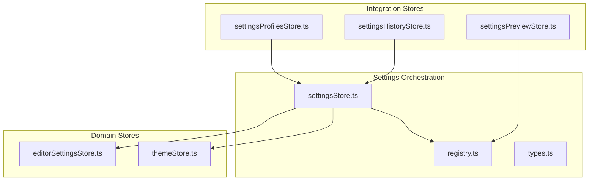
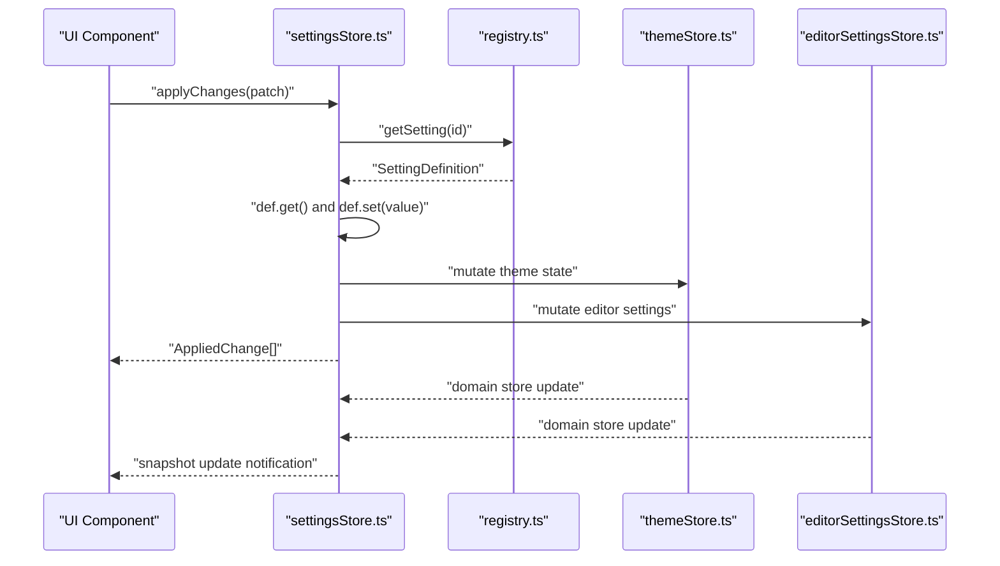
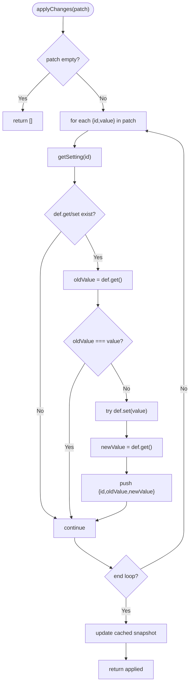
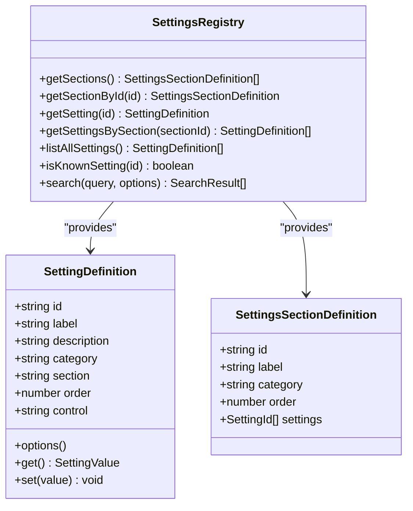
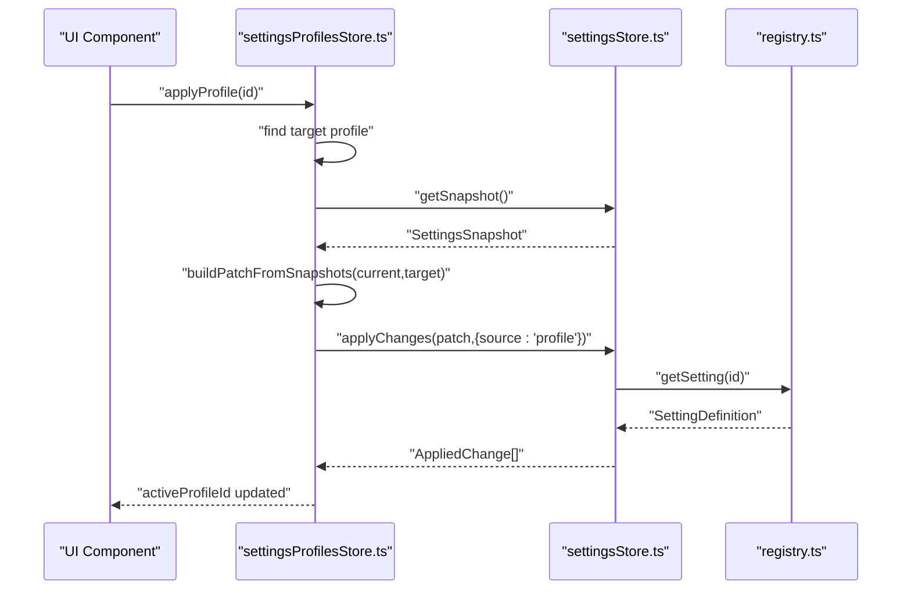
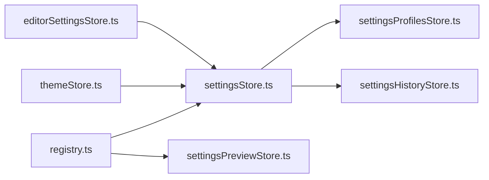

# Settings Store

<cite>
**Referenced Files in This Document**
- [settingsStore.ts](file://src/lib/stores/settingsStore.ts)
- [registry.ts](file://src/lib/settings/registry.ts)
- [types.ts](file://src/lib/settings/types.ts)
- [settingsProfilesStore.ts](file://src/lib/stores/settingsProfilesStore.ts)
- [settingsHistoryStore.ts](file://src/lib/stores/settingsHistoryStore.ts)
- [settingsPreviewStore.ts](file://src/lib/stores/settingsPreviewStore.ts)
- [themeStore.ts](file://src/lib/stores/themeStore.ts)
- [editorSettingsStore.ts](file://src/lib/stores/editorSettingsStore.ts)
- [quickActions.ts](file://src/lib/settings/quickActions.ts)
- [commands.ts](file://src/lib/settings/commands.ts)
</cite>

## Table of Contents
1. [Introduction](#introduction)
2. [Project Structure](#project-structure)
3. [Core Components](#core-components)
4. [Architecture Overview](#architecture-overview)
5. [Detailed Component Analysis](#detailed-component-analysis)
6. [Dependency Analysis](#dependency-analysis)
7. [Performance Considerations](#performance-considerations)
8. [Troubleshooting Guide](#troubleshooting-guide)
9. [Conclusion](#conclusion)
10. [Appendices](#appendices)

## Introduction
This document explains the settings management subsystem centered around the settingsStore. It covers how user preferences and application settings are modeled, persisted, and synchronized across the application. It also details how settingsStore orchestrates reactive updates, integrates with settingsProfilesStore for managing multiple configuration sets, and with settingsHistoryStore for tracking changes. Finally, it describes the relationship with registry.ts that defines available settings and how updates propagate to other components like themeStore and editorStore.

## Project Structure
The settings subsystem is composed of:
- settingsStore.ts: central orchestrator that builds snapshots, applies changes, computes dirty state, and exposes a Svelte-readable store.
- registry.ts: a registry of settings definitions with metadata and pure get/set functions that delegate to real stores.
- types.ts: shared types for settings, snapshots, profiles, history, and search results.
- settingsProfilesStore.ts: manages saved profiles and applies them by computing patches against the current snapshot.
- settingsHistoryStore.ts: records applied changes and supports undo operations by replaying old values.
- settingsPreviewStore.ts: provides live previews and contextual help for settings.
- themeStore.ts and editorSettingsStore.ts: domain stores that settings definitions mutate.
- quickActions.ts and commands.ts: demonstrate how higher-level actions integrate with settingsStore.

**Diagram sources**
- [settingsStore.ts](file://src/lib/stores/settingsStore.ts#L1-L313)
- [registry.ts](file://src/lib/settings/registry.ts#L1-L558)
- [types.ts](file://src/lib/settings/types.ts#L1-L192)
- [settingsProfilesStore.ts](file://src/lib/stores/settingsProfilesStore.ts#L1-L426)
- [settingsHistoryStore.ts](file://src/lib/stores/settingsHistoryStore.ts#L1-L304)
- [settingsPreviewStore.ts](file://src/lib/stores/settingsPreviewStore.ts#L1-L214)
- [themeStore.ts](file://src/lib/stores/themeStore.ts#L1-L120)
- [editorSettingsStore.ts](file://src/lib/stores/editorSettingsStore.ts#L1-L180)

**Section sources**
- [settingsStore.ts](file://src/lib/stores/settingsStore.ts#L1-L313)
- [registry.ts](file://src/lib/settings/registry.ts#L1-L558)
- [types.ts](file://src/lib/settings/types.ts#L1-L192)

## Core Components
- settingsStore: Provides a Svelte-readable snapshot of current settings, applies patches, computes dirty state, and resets to baseline. It subscribes to domain stores and rebuilds snapshots reactively.
- registry: Defines all available settings with metadata and pure get/set functions that delegate to real stores. It also exposes sections and search utilities.
- settingsProfilesStore: Manages saved profiles, loads/saves them, and applies them by computing patches from current to target snapshots.
- settingsHistoryStore: Records applied changes and supports undo by replaying previous values.
- settingsPreviewStore: Resolves previews for active settings using registry definitions.
- themeStore and editorSettingsStore: Domain stores that settings definitions mutate.

Key responsibilities:
- Single source of truth: settings definitions in registry.ts define available settings and how to read/write them.
- No duplication: settingsStore does not duplicate state; it builds snapshots on demand and caches a minimal snapshot for subscribers.
- Reactive propagation: Changes to domain stores trigger snapshot recomputation and notify subscribers.

**Section sources**
- [settingsStore.ts](file://src/lib/stores/settingsStore.ts#L1-L313)
- [registry.ts](file://src/lib/settings/registry.ts#L1-L558)
- [settingsProfilesStore.ts](file://src/lib/stores/settingsProfilesStore.ts#L1-L426)
- [settingsHistoryStore.ts](file://src/lib/stores/settingsHistoryStore.ts#L1-L304)
- [settingsPreviewStore.ts](file://src/lib/stores/settingsPreviewStore.ts#L1-L214)
- [themeStore.ts](file://src/lib/stores/themeStore.ts#L1-L120)
- [editorSettingsStore.ts](file://src/lib/stores/editorSettingsStore.ts#L1-L180)

## Architecture Overview
The settingsStore acts as a thin orchestration layer over domain stores and the registry. It:
- Builds a read-only snapshot from domain stores.
- Applies a patch of changes by delegating to registry-defined setters.
- Computes dirty state relative to a baseline snapshot.
- Exposes a Svelte-readable store that notifies subscribers when any domain store changes.

**Diagram sources**
- [settingsStore.ts](file://src/lib/stores/settingsStore.ts#L248-L285)
- [registry.ts](file://src/lib/settings/registry.ts#L128-L429)
- [themeStore.ts](file://src/lib/stores/themeStore.ts#L1-L120)
- [editorSettingsStore.ts](file://src/lib/stores/editorSettingsStore.ts#L1-L180)

## Detailed Component Analysis

### settingsStore
Responsibilities:
- Build a read-only snapshot from domain stores.
- Apply a batch of changes by invoking registry-defined setters.
- Compute dirty state relative to a baseline snapshot.
- Reset all settings to baseline by building a patch from baseline to current.
- Maintain a cached snapshot for subscribers and update it after changes.

Implementation highlights:
- Snapshot building: reads editor and theme state and can be extended to other domains.
- Patch application: iterates over patch entries, validates definitions, compares values, and invokes setters.
- Dirty computation: compares current values against baseline to produce a list of differences.
- Baseline management: baselineSnapshot is updated via setBaselineFromCurrent() and used by resetAll and getDirtyState.

**Diagram sources**
- [settingsStore.ts](file://src/lib/stores/settingsStore.ts#L248-L285)

**Section sources**
- [settingsStore.ts](file://src/lib/stores/settingsStore.ts#L1-L313)

### registry.ts
Responsibilities:
- Define all available settings with metadata (id, label, description, category, section, order, control, options).
- Provide pure get/set functions that delegate to real stores (theme and editorSettings).
- Expose sections, search utilities, and helpers to enumerate settings.

Important behaviors:
- Each SettingDefinition.get()/set() delegates to real stores, ensuring no duplication of state.
- Options for controls can be static or dynamic (computed based on current state).
- Sections map setting ids to UI grouping.

**Diagram sources**
- [registry.ts](file://src/lib/settings/registry.ts#L1-L558)
- [types.ts](file://src/lib/settings/types.ts#L1-L192)

**Section sources**
- [registry.ts](file://src/lib/settings/registry.ts#L1-L558)
- [types.ts](file://src/lib/settings/types.ts#L1-L192)

### settingsProfilesStore
Responsibilities:
- Load/save profiles via Tauri invoke commands.
- Create profiles from the current snapshot.
- Apply a profile by computing a patch from current to target snapshot and delegating to settingsStore.applyChanges.
- Manage active/default profile and enforce constraints (e.g., cannot delete default).

Key flows:
- Applying a profile: compute patch from current to target snapshot and call settingsStore.applyChanges with source metadata.
- Creating a profile: capture current snapshot and persist profiles.

**Diagram sources**
- [settingsProfilesStore.ts](file://src/lib/stores/settingsProfilesStore.ts#L283-L304)
- [settingsStore.ts](file://src/lib/stores/settingsStore.ts#L248-L285)
- [registry.ts](file://src/lib/settings/registry.ts#L128-L429)

**Section sources**
- [settingsProfilesStore.ts](file://src/lib/stores/settingsProfilesStore.ts#L1-L426)

### settingsHistoryStore
Responsibilities:
- Append applied changes to history with metadata (source, batchId).
- Undo last change or undo by entry id by replaying old values via settingsStore.applyChanges.
- Persist/load history via Tauri invoke commands.

Undo behavior:
- Supports batching by batchId; undoLast collects a group of consecutive entries sharing the same batchId and re-applies their old values.

**Section sources**
- [settingsHistoryStore.ts](file://src/lib/stores/settingsHistoryStore.ts#L1-L304)

### settingsPreviewStore
Responsibilities:
- Provide previews for active settings by resolving SettingDefinition.get() and mapping to inline or provider-based previews.
- Maintain related settings and help text for contextual UI.

**Section sources**
- [settingsPreviewStore.ts](file://src/lib/stores/settingsPreviewStore.ts#L1-L214)

### Integration with themeStore and editorSettingsStore
- themeStore: settings definitions for theme.mode and theme.palette delegate to theme.setTheme and theme.setPalette, which update theme state and propagate to consumers.
- editorSettingsStore: settings definitions for editor.* properties delegate to editorSettings setters, which update editor settings and propagate to consumers.

**Section sources**
- [registry.ts](file://src/lib/settings/registry.ts#L132-L429)
- [themeStore.ts](file://src/lib/stores/themeStore.ts#L1-L120)
- [editorSettingsStore.ts](file://src/lib/stores/editorSettingsStore.ts#L1-L180)

### Quick Actions and Commands
- Quick Actions: demonstrate how settingsStore.resetAll and settingsStore.getSnapshot are used to implement “Reset All Settings” and to create profiles from current settings.
- Commands: show how settings commands open the Settings Shell and navigate to specific sections or settings.

**Section sources**
- [quickActions.ts](file://src/lib/settings/quickActions.ts#L117-L159)
- [commands.ts](file://src/lib/settings/commands.ts#L1-L174)

## Dependency Analysis
- settingsStore depends on:
  - registry.ts for SettingDefinition resolution and listAllSettings.
  - themeStore and editorSettingsStore for snapshot composition and applying changes.
- settingsProfilesStore depends on:
  - settingsStore for snapshot and applying changes.
  - Tauri invoke for persistence.
- settingsHistoryStore depends on:
  - settingsStore for applying undo changes.
  - Tauri invoke for persistence.
- settingsPreviewStore depends on:
  - registry.ts for SettingDefinition.get() to resolve current values.

**Diagram sources**
- [settingsStore.ts](file://src/lib/stores/settingsStore.ts#L1-L313)
- [registry.ts](file://src/lib/settings/registry.ts#L1-L558)
- [settingsProfilesStore.ts](file://src/lib/stores/settingsProfilesStore.ts#L1-L426)
- [settingsHistoryStore.ts](file://src/lib/stores/settingsHistoryStore.ts#L1-L304)
- [settingsPreviewStore.ts](file://src/lib/stores/settingsPreviewStore.ts#L1-L214)
- [themeStore.ts](file://src/lib/stores/themeStore.ts#L1-L120)
- [editorSettingsStore.ts](file://src/lib/stores/editorSettingsStore.ts#L1-L180)

**Section sources**
- [settingsStore.ts](file://src/lib/stores/settingsStore.ts#L1-L313)
- [registry.ts](file://src/lib/settings/registry.ts#L1-L558)
- [settingsProfilesStore.ts](file://src/lib/stores/settingsProfilesStore.ts#L1-L426)
- [settingsHistoryStore.ts](file://src/lib/stores/settingsHistoryStore.ts#L1-L304)
- [settingsPreviewStore.ts](file://src/lib/stores/settingsPreviewStore.ts#L1-L214)
- [themeStore.ts](file://src/lib/stores/themeStore.ts#L1-L120)
- [editorSettingsStore.ts](file://src/lib/stores/editorSettingsStore.ts#L1-L180)

## Performance Considerations
- Snapshot building is O(N) where N is the number of settings, computed from registry.listAllSettings plus current state from domain stores.
- applyChanges iterates over the provided patch; each setter invocation is O(1) relative to settingsStore’s perspective.
- Dirty computation and baseline comparison are O(N) over all settings.
- Subscriptions to domain stores ensure minimal recomputation; settingsStore updates its cached snapshot and notifies subscribers.
- For frequent updates, consider batching changes to reduce redundant recomputations and UI updates.

[No sources needed since this section provides general guidance]

## Troubleshooting Guide
Common issues and solutions:
- Unknown setting id: If settingsStore.applyChanges receives an id not present in registry, the entry is skipped. Verify the id exists in registry.ts.
- No-op changes: If the new value equals the current value, settingsStore skips applying the change. Ensure values are actually changing before calling applyChanges.
- Error handling in applyChanges: The implementation catches errors during def.set and does not throw outwardly. Inspect underlying stores for validation failures.
- Profiles persistence: settingsProfilesStore uses Tauri invoke for load/save. If invoke is unavailable (web-only), errors surface in state.error; initialize with init() and handle the error state.
- History persistence: settingsHistoryStore persists asynchronously; if backend commands are missing, history remains consistent in memory.
- Preview resolution: settingsPreviewStore resolves previews via registry.getSetting; if the setting is unknown, preview is cleared.

**Section sources**
- [settingsStore.ts](file://src/lib/stores/settingsStore.ts#L248-L285)
- [settingsProfilesStore.ts](file://src/lib/stores/settingsProfilesStore.ts#L150-L171)
- [settingsHistoryStore.ts](file://src/lib/stores/settingsHistoryStore.ts#L84-L108)
- [settingsPreviewStore.ts](file://src/lib/stores/settingsPreviewStore.ts#L97-L134)

## Conclusion
The settingsStore provides a clean, reactive layer for managing user preferences by orchestrating domain stores and the registry. It enables robust features like profiles and history by delegating to specialized stores while maintaining a single source of truth for settings definitions. Integrations with themeStore and editorSettingsStore ensure immediate and consistent UI updates. The design supports scalability by allowing future domains to be added to snapshots and registry-driven controls.

[No sources needed since this section summarizes without analyzing specific files]

## Appendices

### Example Workflows

- Update a single setting:
  - Obtain a SettingPatch with id and value.
  - Call settingsStore.applyChanges([patch]).
  - Observe snapshot updates via subscription.

- Batch update settings:
  - Build a patch array with multiple SettingPatch entries.
  - Call settingsStore.applyChanges(patchArray).
  - Optionally record changes in settingsHistoryStore.

- Switch to a profile:
  - Retrieve target profile snapshot from settingsProfilesStore.
  - Compute patch from current to target snapshot.
  - Apply patch via settingsStore.applyChanges({source:'profile'}).
  - Persist profiles via settingsProfilesStore.

- Preview a setting:
  - Activate a setting in settingsPreviewStore.
  - Resolve preview using registry.getSetting and current value.
  - Render inline or provider-based preview.

**Section sources**
- [settingsStore.ts](file://src/lib/stores/settingsStore.ts#L248-L285)
- [settingsProfilesStore.ts](file://src/lib/stores/settingsProfilesStore.ts#L283-L304)
- [settingsHistoryStore.ts](file://src/lib/stores/settingsHistoryStore.ts#L144-L181)
- [settingsPreviewStore.ts](file://src/lib/stores/settingsPreviewStore.ts#L136-L165)