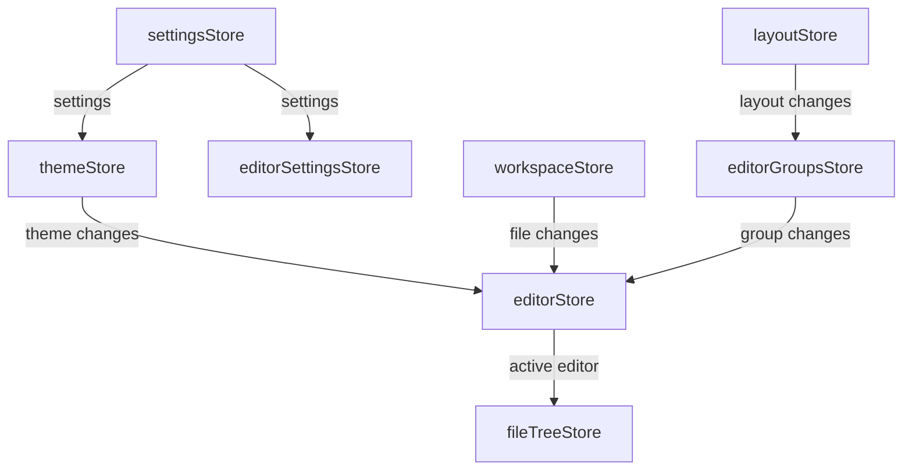
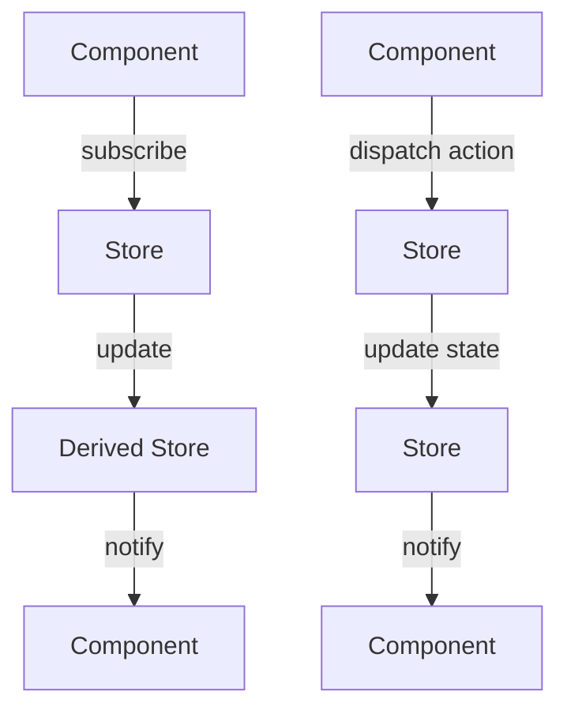
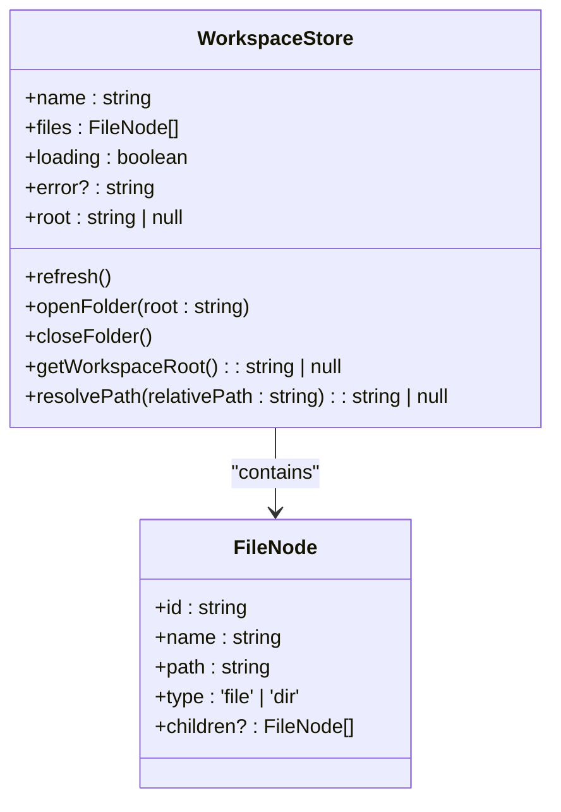
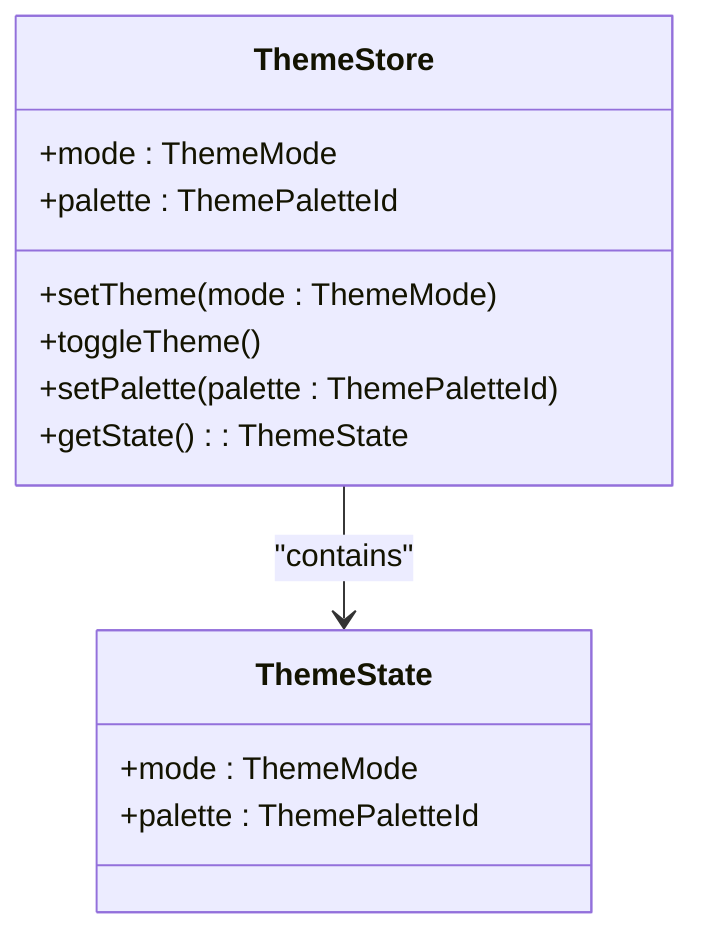
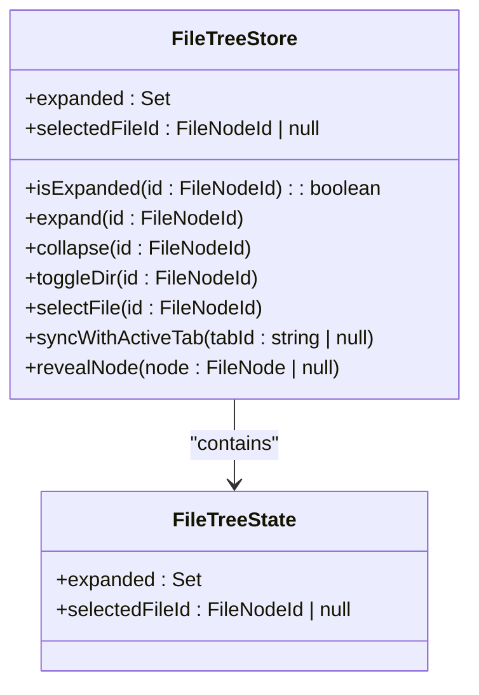
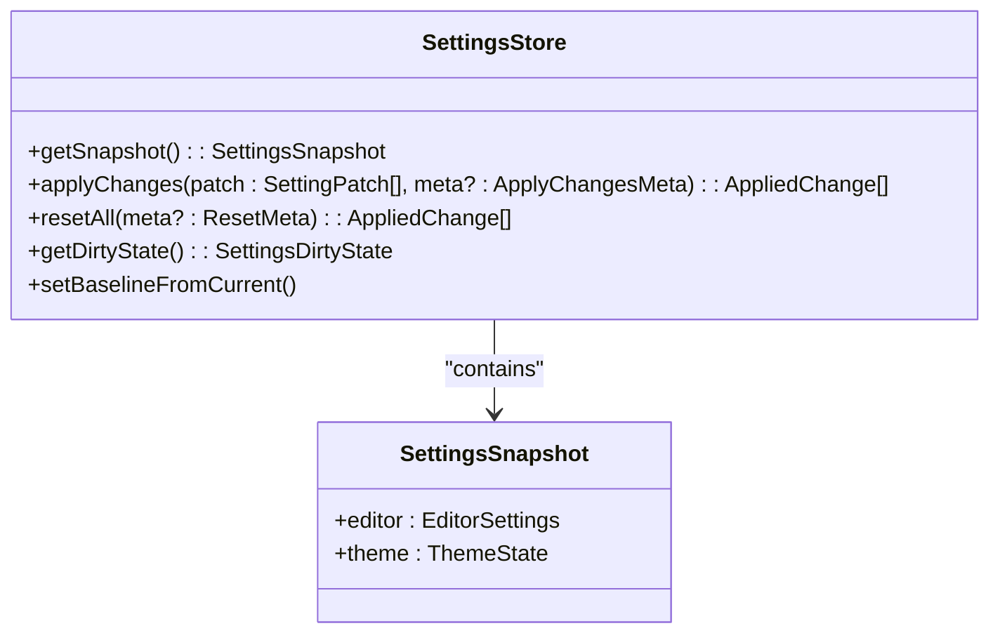
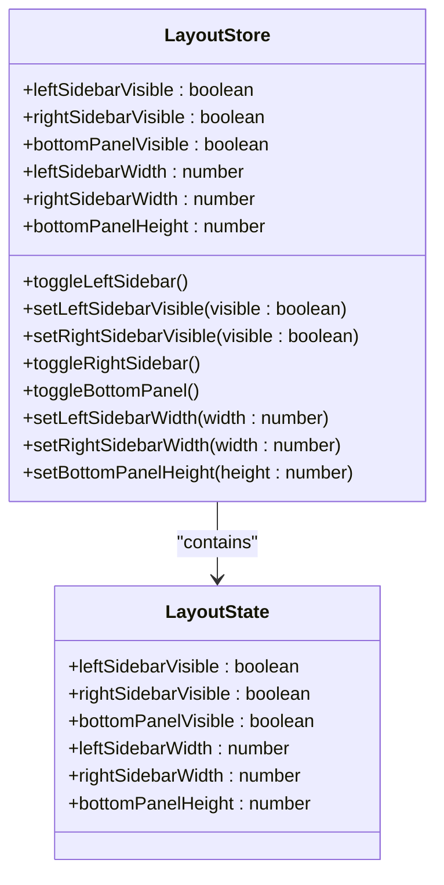

# State Management

<cite>
**Referenced Files in This Document**   
- [editorStore.ts](file://src/lib/stores/editorStore.ts)
- [workspaceStore.ts](file://src/lib/stores/workspaceStore.ts)
- [themeStore.ts](file://src/lib/stores/themeStore.ts)
- [fileTreeStore.ts](file://src/lib/stores/fileTreeStore.ts)
- [settingsStore.ts](file://src/lib/stores/settingsStore.ts)
- [layoutStore.ts](file://src/lib/stores/layout/layoutStore.ts)
- [editorGroupsStore.ts](file://src/lib/stores/layout/editorGroupsStore.ts)
- [activityStore.ts](file://src/lib/stores/activityStore.ts)
- [bottomPanelStore.ts](file://src/lib/stores/bottomPanelStore.ts)
- [commandPaletteStore.ts](file://src/lib/stores/commandPaletteStore.ts)
- [diagnosticsStore.ts](file://src/lib/stores/diagnosticsStore.ts)
- [editorBehaviorStore.ts](file://src/lib/stores/editorBehaviorStore.ts)
- [editorCursorStore.ts](file://src/lib/stores/editorCursorStore.ts)
- [editorMetaStore.ts](file://src/lib/stores/editorMetaStore.ts)
- [editorSettingsStore.ts](file://src/lib/stores/editorSettingsStore.ts)
- [settingsProfilesStore.ts](file://src/lib/stores/settingsProfilesStore.ts)
- [settingsPreviewStore.ts](file://src/lib/stores/settingsPreviewStore.ts)
- [settingsHistoryStore.ts](file://src/lib/stores/settingsHistoryStore.ts)
- [fileNode.ts](file://src/lib/types/fileNode.ts)
- [THEME_PALETTES.ts](file://src/lib/stores/THEME_PALETTES.ts)
- [fileService.ts](file://src/lib/services/fileService.ts)
</cite>

## Table of Contents

1. [Introduction](#introduction)
2. [Core State Stores](#core-state-stores)
3. [Store Relationships and Communication](#store-relationships-and-communication)
4. [Reactive Patterns](#reactive-patterns)
5. [Store Implementation Details](#store-implementation-details)
6. [Common Issues and Solutions](#common-issues-and-solutions)
7. [Performance Optimization](#performance-optimization)
8. [Conclusion](#conclusion)

## Introduction

The NC code editor implements a comprehensive state management system using Svelte stores to manage application state across various components. This system follows a modular architecture inspired by VS Code, with specialized stores handling different aspects of the application state. The stores are designed to be reactive, allowing components to automatically update when state changes occur, and they communicate through well-defined APIs rather than direct dependencies.

The state management system is organized around several core stores that manage specific domains: editor state, workspace structure, UI themes, file explorer state, user preferences, and window layout. These stores work together to maintain a consistent application state while allowing for efficient updates and minimal re-renders. The system leverages Svelte's reactivity model to ensure that components only update when necessary, improving performance and user experience.

This documentation provides a detailed analysis of the state management system, explaining the implementation of each store, their relationships, and the reactive patterns used to maintain consistency across the application.

## Core State Stores

The NC code editor's state management system consists of several specialized stores, each responsible for a specific domain of application state. These stores follow the Svelte store contract (writable, readable, or derived) and are designed to be imported and used by components throughout the application.

The primary stores include editorStore for managing open editor tabs and their state, workspaceStore for tracking the current workspace and file system structure, themeStore for managing UI and editor themes, fileTreeStore for handling file explorer state, settingsStore for user preferences, and layoutStore for window and panel arrangements. Each store exposes a well-defined API for reading and updating state, ensuring consistent access patterns across the application.

These stores are implemented as modules that export store instances, allowing them to be easily imported and used by components. They follow a consistent pattern of using writable stores for mutable state, derived stores for computed state, and readable stores for state that should not be directly modified. This approach ensures that state changes are predictable and traceable, making the application easier to debug and maintain.

**Section sources**

- [editorStore.ts](file://src/lib/stores/editorStore.ts#L20-L381)
- [workspaceStore.ts](file://src/lib/stores/workspaceStore.ts#L1-L130)
- [themeStore.ts](file://src/lib/stores/themeStore.ts#L1-L120)
- [fileTreeStore.ts](file://src/lib/stores/fileTreeStore.ts#L16-L290)
- [settingsStore.ts](file://src/lib/stores/settingsStore.ts#L19-L313)
- [layoutStore.ts](file://src/lib/stores/layout/layoutStore.ts#L1-L131)

## Store Relationships and Communication

The stores in the NC code editor are designed to work together through well-defined relationships and communication patterns. Rather than creating direct dependencies between stores, the system uses a combination of derived stores, event-driven updates, and shared data structures to maintain consistency across the application.

For example, the editorStore and fileTreeStore are closely related, with the fileTreeStore synchronizing its selected file with the active editor tab. This synchronization is achieved through the syncWithActiveTab function in fileTreeStore, which subscribes to changes in the active editor and updates the file tree selection accordingly. Similarly, the themeStore updates trigger changes in both UI components and the EditorCore through derived stores and direct subscriptions.

The settingsStore acts as an orchestrator, aggregating state from domain-specific stores like editorSettingsStore and themeStore. It provides a unified interface for accessing and modifying settings, while ensuring that changes are properly propagated to the underlying stores. This pattern allows components to work with a single settings interface while maintaining separation of concerns in the underlying implementation.



**Diagram sources**

- [editorStore.ts](file://src/lib/stores/editorStore.ts#L20-L381)
- [fileTreeStore.ts](file://src/lib/stores/fileTreeStore.ts#L16-L290)
- [themeStore.ts](file://src/lib/stores/themeStore.ts#L1-L120)
- [settingsStore.ts](file://src/lib/stores/settingsStore.ts#L19-L313)
- [workspaceStore.ts](file://src/lib/stores/workspaceStore.ts#L1-L130)
- [layoutStore.ts](file://src/lib/stores/layout/layoutStore.ts#L1-L131)
- [editorGroupsStore.ts](file://src/lib/stores/layout/editorGroupsStore.ts#L20-L413)

**Section sources**

- [editorStore.ts](file://src/lib/stores/editorStore.ts#L20-L381)
- [fileTreeStore.ts](file://src/lib/stores/fileTreeStore.ts#L16-L290)
- [themeStore.ts](file://src/lib/stores/themeStore.ts#L1-L120)
- [settingsStore.ts](file://src/lib/stores/settingsStore.ts#L19-L313)
- [workspaceStore.ts](file://src/lib/stores/workspaceStore.ts#L1-L130)
- [layoutStore.ts](file://src/lib/stores/layout/layoutStore.ts#L1-L131)
- [editorGroupsStore.ts](file://src/lib/stores/layout/editorGroupsStore.ts#L20-L413)

## Reactive Patterns

The NC code editor leverages Svelte's reactivity model to ensure consistent state across components. The system uses a combination of writable stores for mutable state, derived stores for computed state, and readable stores for state that should not be directly modified. This approach ensures that components automatically update when state changes occur, while minimizing unnecessary re-renders.

Derived stores are used extensively to create computed state from one or more source stores. For example, the activeEditor store is derived from editorStore and provides the currently active editor tab. This pattern allows components to subscribe to specific pieces of state without needing to manage the underlying logic for determining the active editor.

The system also uses reactive statements and auto-subscriptions to respond to state changes. Components can subscribe to stores using the $ prefix syntax, which automatically creates and manages the subscription. This makes it easy to access store values in templates and reactive statements, while ensuring that subscriptions are properly cleaned up when components are destroyed.

Event-driven communication is used to coordinate updates between stores. Rather than having stores directly modify each other's state, they emit events (through store updates) that other stores can respond to. This pattern maintains loose coupling between stores while ensuring that state changes are properly propagated throughout the application.



**Diagram sources**

- [editorStore.ts](file://src/lib/stores/editorStore.ts#L20-L381)
- [fileTreeStore.ts](file://src/lib/stores/fileTreeStore.ts#L16-L290)
- [themeStore.ts](file://src/lib/stores/themeStore.ts#L1-L120)

**Section sources**

- [editorStore.ts](file://src/lib/stores/editorStore.ts#L20-L381)
- [fileTreeStore.ts](file://src/lib/stores/fileTreeStore.ts#L16-L290)
- [themeStore.ts](file://src/lib/stores/themeStore.ts#L1-L120)

## Store Implementation Details

### editorStore Implementation

The editorStore manages the state of open editor tabs and their associated models. It provides functions for opening, closing, and activating tabs, as well as marking tabs as dirty when changes are made. The store maintains a list of open tabs and the currently active editor ID, serving as the single source of truth for editor state.

The store uses a factory pattern to create the store instance, allowing it to accept dependencies like the filesTreeProvider function. This makes the store more testable and flexible, as it can work with different file tree implementations. The ensureTabForFile function is a key part of the API, guaranteeing that a tab exists for a given file and returning the existing or newly created tab.

```mermaid
classDiagram
class EditorStore {
+openTabs : EditorTab[]
+activeEditorId : string | null
+openFile(fileId : string)
+openSettings()
+setActiveEditor(fileId : string)
+closeEditor(fileId : string)
+markDirty(id : string, isDirty : boolean)
+updateContent(id : string, value : string)
+ensureTabForFile(pathOrId : string, opts? : {activate? : boolean, groupId? : number}) : EditorTab | null
}
class EditorTab {
+id : string
+title : string
+path : string
+language : LanguageId | string
+isDirty : boolean
}
EditorStore --> EditorTab : "contains"
```

**Diagram sources**

- [editorStore.ts](file://src/lib/stores/editorStore.ts#L20-L381)

**Section sources**

- [editorStore.ts](file://src/lib/stores/editorStore.ts#L20-L381)

### workspaceStore Implementation

The workspaceStore manages the current workspace and file system structure. It provides functions for loading and refreshing the workspace files, as well as opening and closing folders. The store maintains the current workspace name, files, loading state, and error information.

The store uses a watcher pattern to monitor file system changes and automatically refresh the workspace when files are modified. This ensures that the file tree stays in sync with the actual file system. The store also provides utility functions for resolving paths and getting the workspace root, making it easier for components to work with file paths.



**Diagram sources**

- [workspaceStore.ts](file://src/lib/stores/workspaceStore.ts#L1-L130)

**Section sources**

- [workspaceStore.ts](file://src/lib/stores/workspaceStore.ts#L1-L130)

### themeStore Implementation

The themeStore manages the UI and editor themes. It provides functions for setting and toggling the theme mode (light/dark), as well as setting the color palette. The store maintains the current theme mode and palette, serving as the single source of truth for theme state.

The store uses a slot-based approach for palette selection, where switching themes preserves the "slot" of the current palette. For example, if the user has selected the "alt-2" palette in dark mode, switching to light mode will select the "alt-2" palette in light mode. This provides a consistent user experience when switching between themes.



**Diagram sources**

- [themeStore.ts](file://src/lib/stores/themeStore.ts#L1-L120)

**Section sources**

- [themeStore.ts](file://src/lib/stores/themeStore.ts#L1-L120)

### fileTreeStore Implementation

The fileTreeStore manages the state of the file explorer, including which directories are expanded and which file is selected. It provides functions for expanding, collapsing, and toggling directories, as well as selecting files and synchronizing with the active editor tab.

The store uses a derived pattern to keep the file tree selection in sync with the active editor tab. When the active editor changes, the syncWithActiveTab function is called to update the file tree selection and expand any necessary parent directories. This ensures that the file tree always reflects the current editor state.



**Diagram sources**

- [fileTreeStore.ts](file://src/lib/stores/fileTreeStore.ts#L16-L290)

**Section sources**

- [fileTreeStore.ts](file://src/lib/stores/fileTreeStore.ts#L16-L290)

### settingsStore Implementation

The settingsStore serves as an orchestrator for application settings, aggregating state from domain-specific stores like editorSettingsStore and themeStore. It provides a unified interface for accessing and modifying settings, while ensuring that changes are properly propagated to the underlying stores.

The store uses a snapshot-based approach to track changes and provide undo/redo functionality. It maintains a baseline snapshot of the current settings state, which is used to calculate dirty state and reset settings to their original values. The store also provides functions for applying changes, resetting all settings, and getting the current dirty state.



**Diagram sources**

- [settingsStore.ts](file://src/lib/stores/settingsStore.ts#L19-L313)

**Section sources**

- [settingsStore.ts](file://src/lib/stores/settingsStore.ts#L19-L313)

### layoutStore Implementation

The layoutStore manages the window and panel arrangements, including the visibility and size of sidebars and the bottom panel. It provides functions for toggling and setting the visibility of panels, as well as setting their dimensions.

The store maintains the current layout state, including the visibility of left and right sidebars, the bottom panel, and their respective dimensions. This state is used by the layout components to render the appropriate UI elements and handle user interactions.



**Diagram sources**

- [layoutStore.ts](file://src/lib/stores/layout/layoutStore.ts#L1-L131)

**Section sources**

- [layoutStore.ts](file://src/lib/stores/layout/layoutStore.ts#L1-L131)

## Common Issues and Solutions

### Race Conditions During State Updates

Race conditions can occur when multiple components attempt to update the same store state simultaneously. The NC code editor addresses this issue by using atomic updates and ensuring that store updates are synchronous. When a store update is performed, it is completed before any other updates can occur, preventing race conditions.

For example, when opening a file, the editorStore ensures that the tab is created and added to the store before any other operations are performed. This is achieved by using the update method, which guarantees that the update is applied atomically.

### Efficient State Synchronization

Efficient state synchronization is critical for maintaining a responsive user interface. The NC code editor uses several techniques to ensure efficient state synchronization, including derived stores, selective subscriptions, and batched updates.

Derived stores are used to compute state from one or more source stores, reducing the need for components to perform their own computations. Selective subscriptions allow components to subscribe only to the specific pieces of state they need, minimizing unnecessary re-renders. Batched updates are used when multiple state changes need to be applied together, reducing the number of re-renders and improving performance.

### Memory Management

Memory management is important for preventing memory leaks and ensuring optimal performance. The NC code editor addresses this by properly cleaning up subscriptions when components are destroyed. Svelte's store subscription mechanism automatically handles this, ensuring that subscriptions are cleaned up when components are unmounted.

Additionally, the stores themselves are designed to be lightweight and avoid holding onto unnecessary references. For example, the fileTreeStore only stores the IDs of expanded directories and the selected file, rather than references to the actual file nodes.

**Section sources**

- [editorStore.ts](file://src/lib/stores/editorStore.ts#L20-L381)
- [fileTreeStore.ts](file://src/lib/stores/fileTreeStore.ts#L16-L290)
- [settingsStore.ts](file://src/lib/stores/settingsStore.ts#L19-L313)

## Performance Optimization

### Minimizing Re-renders

The NC code editor uses several techniques to minimize re-renders and improve performance. Derived stores are used to compute state from one or more source stores, reducing the need for components to perform their own computations. Selective subscriptions allow components to subscribe only to the specific pieces of state they need, minimizing unnecessary re-renders.

Components also use Svelte's reactive statements and auto-subscriptions to respond to state changes efficiently. The $ prefix syntax is used to automatically create and manage subscriptions, ensuring that components only update when necessary.

### Efficient Store Updates

Efficient store updates are critical for maintaining a responsive user interface. The NC code editor uses atomic updates and batched operations to ensure that store updates are performed efficiently. When multiple state changes need to be applied together, they are batched into a single update to reduce the number of re-renders.

The stores themselves are designed to be lightweight and avoid holding onto unnecessary references. For example, the fileTreeStore only stores the IDs of expanded directories and the selected file, rather than references to the actual file nodes.

### Lazy Loading

Lazy loading is used to improve startup performance and reduce memory usage. The stores are initialized on demand, rather than at application startup. This ensures that resources are only allocated when needed, improving overall performance.

For example, the diagnosticsStore is only initialized when the editor is first loaded, rather than at application startup. This reduces the initial memory footprint and improves startup time.

**Section sources**

- [editorStore.ts](file://src/lib/stores/editorStore.ts#L20-L381)
- [fileTreeStore.ts](file://src/lib/stores/fileTreeStore.ts#L16-L290)
- [settingsStore.ts](file://src/lib/stores/settingsStore.ts#L19-L313)

## Conclusion

The NC code editor's state management system provides a robust and scalable solution for managing application state across a complex code editor interface. By using specialized stores for different domains of state, the system maintains separation of concerns while ensuring consistent state across components.

The system leverages Svelte's reactivity model to provide efficient updates and minimal re-renders, improving performance and user experience. Derived stores, selective subscriptions, and batched updates are used to optimize performance and reduce unnecessary computations.

The stores are designed to work together through well-defined relationships and communication patterns, maintaining loose coupling while ensuring that state changes are properly propagated throughout the application. This approach makes the system easier to debug and maintain, while providing a consistent API for components to work with.

Overall, the state management system in the NC code editor demonstrates best practices for building scalable and maintainable applications with Svelte, providing a solid foundation for future development and enhancements.
