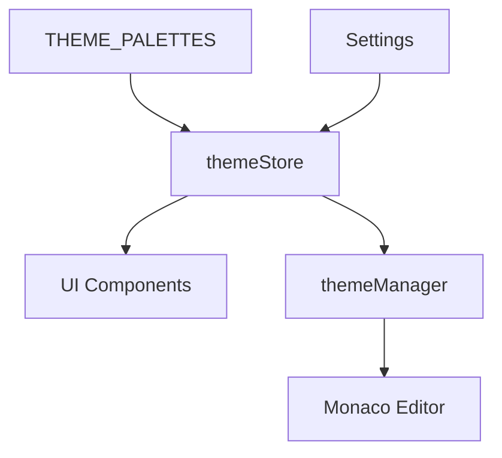
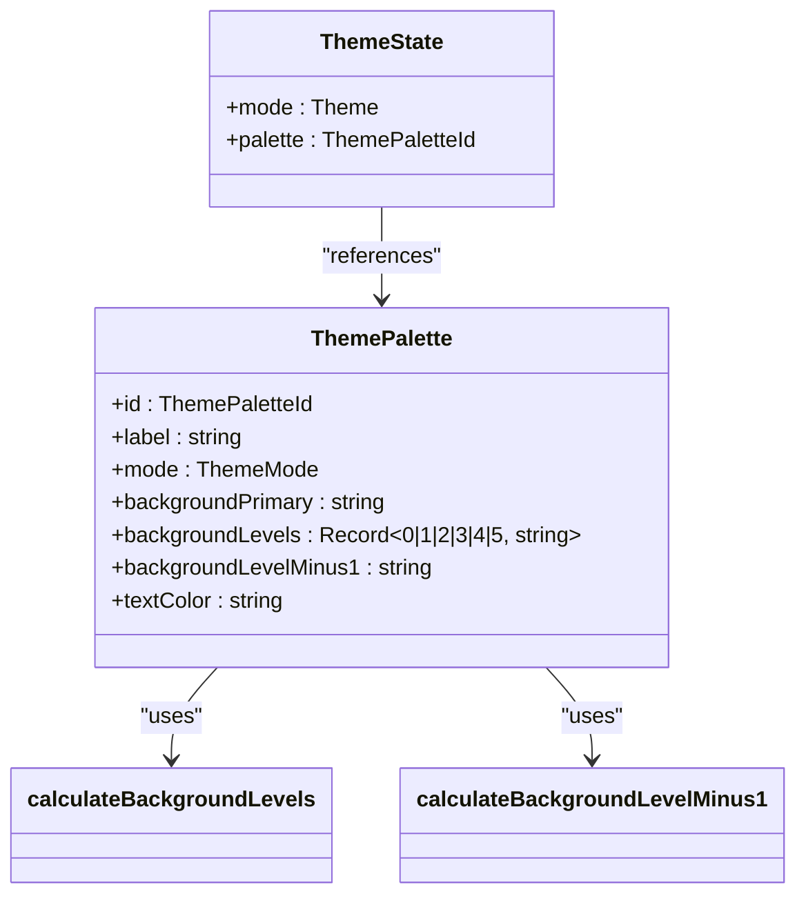
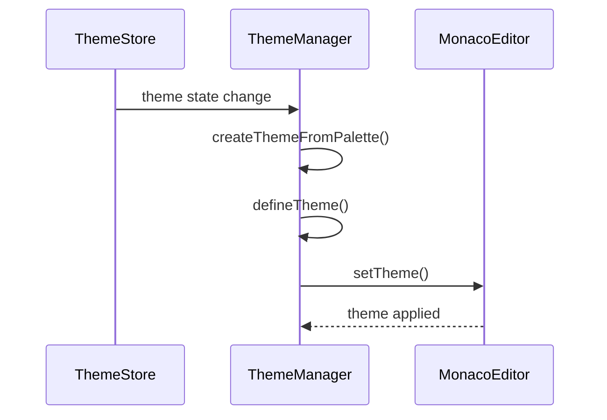

# Theme Store

<cite>
**Referenced Files in This Document**   
- [themeStore.ts](file://src/lib/stores/themeStore.ts)
- [THEME_PALETTES.ts](file://src/lib/stores/THEME_PALETTES.ts)
- [themeManager.ts](file://src/lib/editor/themeManager.ts)
- [settingsStore.ts](file://src/lib/stores/settingsStore.ts)
- [THEME_QUICK_START.ts](file://src/lib/stores/THEME_QUICK_START.ts)
- [app.css](file://src/app.css)
</cite>

## Table of Contents
1. [Introduction](#introduction)
2. [Theme Store Architecture](#theme-store-architecture)
3. [Core Components](#core-components)
4. [Theme State Management](#theme-state-management)
5. [Integration with Monaco Editor](#integration-with-monaco-editor)
6. [Reactive Patterns and Synchronization](#reactive-patterns-and-synchronization)
7. [Theme Persistence and Application](#theme-persistence-and-application)
8. [Usage Examples](#usage-examples)
9. [Troubleshooting Guide](#troubleshooting-guide)

## Introduction

The themeStore in the NC code editor is a centralized state management system responsible for handling UI and editor theming. It serves as the single source of truth for theme configuration, managing both the current theme mode (light/dark) and the selected color palette. The system is designed to provide a seamless and consistent theming experience across the entire application interface and the Monaco Editor instance.

The themeStore works in conjunction with THEME_PALETTES, which defines the available color schemes, and integrates with the themeManager to synchronize theme state between the Svelte UI components and the Monaco Editor. This documentation provides a comprehensive overview of the implementation details, reactive patterns, and practical usage of the themeStore system.

**Section sources**
- [themeStore.ts](file://src/lib/stores/themeStore.ts#L1-L120)
- [THEME_PALETTES.ts](file://src/lib/stores/THEME_PALETTES.ts#L1-L314)

## Theme Store Architecture

The themeStore architecture is built on a reactive pattern using Svelte's writable store, providing a clean and efficient way to manage theme state. The system consists of three main components:

1. **themeStore**: The central store that maintains the current theme state, including the mode (light/dark) and selected palette.
2. **THEME_PALETTES**: A module that defines the available color palettes with their respective color values and configurations.
3. **themeManager**: A class that handles the integration between the themeStore and the Monaco Editor, ensuring consistent theme application.

The architecture follows a unidirectional data flow pattern, where the themeStore acts as the single source of truth. All components that need to respond to theme changes subscribe to the themeStore, ensuring that theme updates are propagated consistently throughout the application.



**Diagram sources **
- [themeStore.ts](file://src/lib/stores/themeStore.ts#L1-L120)
- [themeManager.ts](file://src/lib/editor/themeManager.ts#L1-L273)

**Section sources**
- [themeStore.ts](file://src/lib/stores/themeStore.ts#L1-L120)
- [THEME_PALETTES.ts](file://src/lib/stores/THEME_PALETTES.ts#L1-L314)
- [themeManager.ts](file://src/lib/editor/themeManager.ts#L1-L273)

## Core Components

### ThemeState Interface

The ThemeState interface defines the structure of the theme state object maintained by the themeStore. It contains two properties:

- **mode**: The current theme mode, which can be either 'light' or 'dark'.
- **palette**: The currently selected color palette, represented by a ThemePaletteId.

This interface serves as the contract for theme state management, ensuring type safety and consistency across the application.

### ThemeStore Implementation

The themeStore is implemented as a factory function that creates a writable store with specific methods for theme manipulation. The store is initialized with a default state, where the initial mode is set to 'dark' and the palette is determined by the getDefaultPaletteForMode function from THEME_PALETTES.

The store provides several methods for theme manipulation:
- setTheme: Sets the theme mode while preserving the palette "slot"
- toggleTheme: Toggles between light and dark modes
- setPalette: Sets the color palette directly
- getState: Retrieves the current theme state synchronously

**Section sources**
- [themeStore.ts](file://src/lib/stores/themeStore.ts#L1-L120)

## Theme State Management

### Theme Mode and Palette Relationship

The themeStore maintains a clear relationship between the theme mode and the selected palette. Each palette ID follows a naming convention that includes the mode and a slot identifier (e.g., 'dark-default', 'light-alt-1'). This structure allows the system to preserve the user's palette preference when switching between light and dark modes.

When the theme mode is changed, the system attempts to maintain the same "slot" in the new mode. For example, if the user has selected 'dark-alt-2' and switches to light mode, the system will automatically select 'light-alt-2'. This provides a consistent user experience while allowing for mode-specific color adjustments.

### Palette Management

The THEME_PALETTES module defines a comprehensive set of color palettes for both light and dark modes. Each palette includes:
- A unique ID following the naming convention
- A human-readable label
- The mode (light/dark)
- The primary background color
- A hierarchy of background levels for different UI elements
- The primary text color

The system uses utility functions to calculate the background levels based on the primary color, ensuring visual consistency across different palettes. For dark themes, background levels become lighter with each level, while for light themes, they become darker.



**Diagram sources **
- [themeStore.ts](file://src/lib/stores/themeStore.ts#L24-L27)
- [THEME_PALETTES.ts](file://src/lib/stores/THEME_PALETTES.ts#L35-L54)

**Section sources**
- [themeStore.ts](file://src/lib/stores/themeStore.ts#L1-L120)
- [THEME_PALETTES.ts](file://src/lib/stores/THEME_PALETTES.ts#L1-L314)

## Integration with Monaco Editor

### ThemeManager Class

The themeManager class serves as the bridge between the themeStore and the Monaco Editor. It is responsible for creating and applying custom themes to the editor based on the current theme state. The class provides several key methods:

- initialize: Initializes the themeManager with a Monaco editor instance
- createThemeFromPalette: Creates a custom Monaco theme based on the current palette
- applyTheme: Applies a theme to the Monaco editor
- getMonacoThemeId: Determines the appropriate theme ID based on the current state

The themeManager uses the createThemeFromPalette method to generate a CustomTheme object that conforms to Monaco's theme specification. This object includes syntax highlighting rules and color mappings that reflect the current palette.

### Theme Synchronization

The theme synchronization process ensures that changes to the themeStore are reflected in the Monaco Editor. When the theme state changes, the system follows this process:

1. The themeStore emits an update event
2. The themeManager receives the new theme state
3. A custom theme is created based on the current palette
4. The theme is applied to the Monaco Editor instance

This process is optimized for performance, with theme definitions being cached to avoid redundant processing.



**Diagram sources **
- [themeManager.ts](file://src/lib/editor/themeManager.ts#L34-L254)
- [themeManager.ts](file://src/lib/editor/themeManager.ts#L264-L273)

**Section sources**
- [themeManager.ts](file://src/lib/editor/themeManager.ts#L1-L273)

## Reactive Patterns and Synchronization

### Svelte Store Integration

The themeStore leverages Svelte's reactivity system to provide a seamless update mechanism. Components that need to respond to theme changes can subscribe to the store using the standard Svelte store pattern:

```javascript
import { theme } from '$lib/stores/themeStore';

theme.subscribe((state) => {
  // Handle theme state changes
});
```

This reactive pattern ensures that UI components are automatically updated when the theme changes, without requiring manual refresh operations.

### Settings Store Integration

The settingsStore integrates with the themeStore to provide a unified settings snapshot. The settingsStore subscribes to both the editorSettings and theme stores, rebuilding the settings snapshot whenever either store changes. This ensures that the current theme state is always included in the application's settings.

The integration is implemented in the buildSnapshot function, which collects the current state from both stores and returns a consolidated snapshot. This pattern allows other components to access the complete settings state without needing to subscribe to multiple stores.

**Section sources**
- [themeStore.ts](file://src/lib/stores/themeStore.ts#L1-L120)
- [settingsStore.ts](file://src/lib/stores/settingsStore.ts#L95-L102)

## Theme Persistence and Application

### CSS Variable Application

The theme system uses CSS variables to apply theme colors across the UI components. When the theme changes, the system updates the CSS variables on the root element, which cascades the changes throughout the application. The available CSS variables include:

- --nc-level-0 to --nc-level-5: Background levels for different UI elements
- --nc-palette-text: Primary text color
- --nc-palette-border: Border color

These variables are defined in the app.css file and are updated dynamically based on the current theme state.

### Theme Persistence

The theme state is persisted through the application's lifecycle by storing the current state in memory and synchronizing it with the settings system. The themeStore maintains a currentState variable that is updated whenever the store changes, allowing components to access the current theme state synchronously.

For persistent storage across application restarts, the theme state should be saved to the user's preferences. This can be achieved by integrating the themeStore with the application's settings persistence mechanism.

**Section sources**
- [app.css](file://src/app.css#L1-L111)
- [themeStore.ts](file://src/lib/stores/themeStore.ts#L106-L109)

## Usage Examples

### Basic Theme Operations

The themeStore provides a simple API for common theme operations:

```javascript
import { theme } from '$lib/stores/themeStore';

// Set theme mode
theme.setTheme('light');

// Toggle between light and dark modes
theme.toggleTheme();

// Set specific palette
theme.setPalette('dark-alt-1');

// Subscribe to theme changes
theme.subscribe((state) => {
  console.log('Current mode:', state.mode);
  console.log('Current palette:', state.palette);
});
```

### Advanced Theme Customization

For more advanced use cases, developers can access the THEME_PALETTES directly to work with specific color values:

```javascript
import { getPaletteById } from '$lib/stores/THEME_PALETTES';
import { theme } from '$lib/stores/themeStore';

// Get current palette details
const currentPalette = getPaletteById(theme.getState().palette);
console.log('Background primary:', currentPalette.backgroundPrimary);
console.log('Text color:', currentPalette.textColor);
```

### Editor Theme Integration

To ensure the Monaco Editor theme stays synchronized with the UI theme:

```javascript
import { theme } from '$lib/stores/themeStore';
import { themeManager } from '$lib/editor/themeManager';
import { getMonacoThemeId } from '$lib/editor/themeManager';

// When theme changes, update the editor theme
theme.subscribe((state) => {
  const editorThemeId = getMonacoThemeId(state);
  themeManager.applyTheme(editorThemeId);
});
```

**Section sources**
- [THEME_QUICK_START.ts](file://src/lib/stores/THEME_QUICK_START.ts#L1-L135)
- [themeStore.ts](file://src/lib/stores/themeStore.ts#L1-L120)
- [themeManager.ts](file://src/lib/editor/themeManager.ts#L264-L273)

## Troubleshooting Guide

### Common Issues and Solutions

#### Theme Changes Not Applied to Editor

If theme changes are not being reflected in the Monaco Editor, ensure that:

1. The themeManager is properly initialized with the Monaco editor instance
2. The theme subscription is correctly set up to update the editor theme
3. The getMonacoThemeId function is being used to determine the correct theme ID

#### CSS Variables Not Updating

If CSS variables are not updating when the theme changes:

1. Verify that the themeStore subscription is properly updating the root element's CSS variables
2. Check that the CSS variable names match those defined in the theme palettes
3. Ensure that the app.css file is being properly imported and processed

#### Performance Issues with Theme Switching

For optimal performance when switching themes:

1. Cache theme definitions to avoid redundant processing
2. Use the getState method for synchronous access to the current theme state
3. Minimize the number of DOM updates by batching CSS variable changes

**Section sources**
- [themeStore.ts](file://src/lib/stores/themeStore.ts#L1-L120)
- [themeManager.ts](file://src/lib/editor/themeManager.ts#L1-L273)
- [app.css](file://src/app.css#L1-L111)