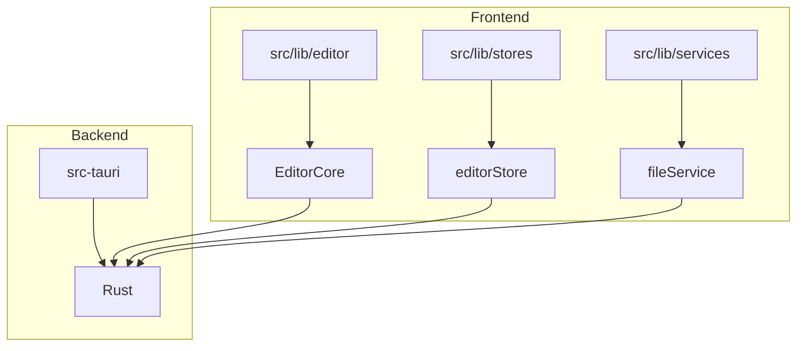
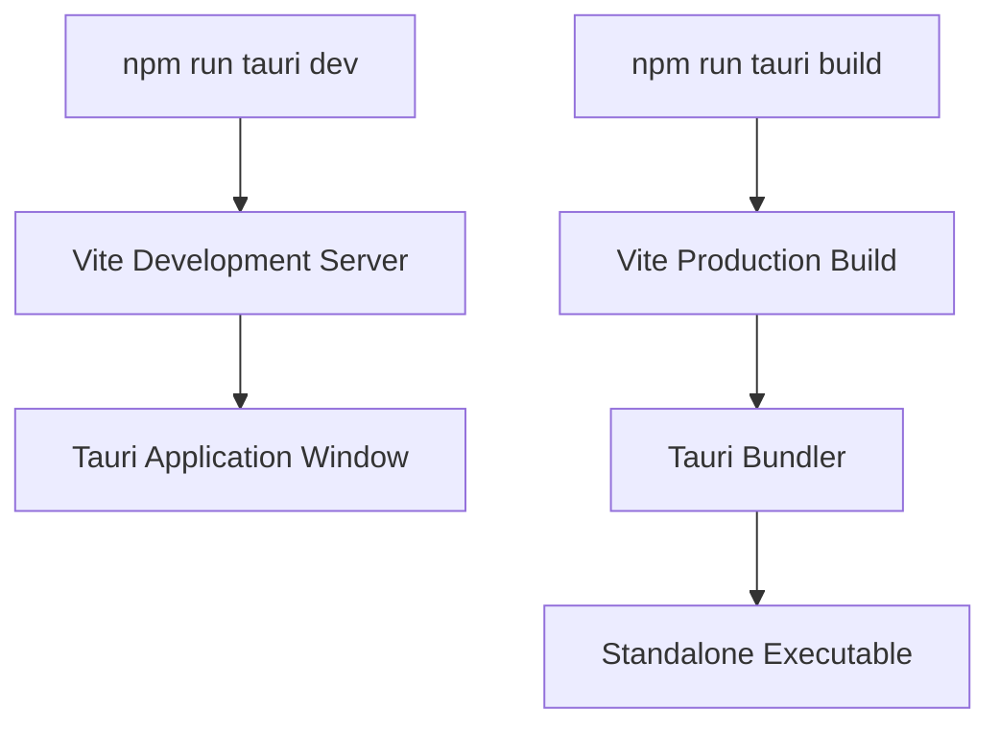

# Development Guide

<cite>
**Referenced Files in This Document**   
- [package.json](file://package.json)
- [svelte.config.js](file://svelte.config.js)
- [tsconfig.json](file://tsconfig.json)
- [vite.config.js](file://vite.config.js)
- [Cargo.toml](file://src-tauri/Cargo.toml)
- [tauri.conf.json](file://src-tauri/tauri.conf.json)
- [app.html](file://src/app.html)
- [+layout.ts](file://src/routes/+layout.ts)
- [EditorCore.ts](file://src/lib/editor/EditorCore.ts)
- [editorStore.ts](file://src/lib/stores/editorStore.ts)
- [fileService.ts](file://src/lib/services/fileService.ts)
- [main.rs](file://src-tauri/src/main.rs)
- [README.md](file://README.md)
</cite>

## Table of Contents

1. [Introduction](#introduction)
2. [Project Structure and Code Organization](#project-structure-and-code-organization)
3. [Development Environment Setup](#development-environment-setup)
4. [Build Process and Configuration Files](#build-process-and-configuration-files)
5. [Contribution Guidelines](#contribution-guidelines)
6. [Testing Strategy](#testing-strategy)
7. [Debugging Tips and Tools](#debugging-tips-and-tools)
8. [Code Quality and Continuous Integration](#code-quality-and-continuous-integration)
9. [Versioning and Release Process](#versioning-and-release-process)
10. [Common Development Tasks](#common-development-tasks)

## Introduction

This development guide provides comprehensive information for contributors to the NC code editor project. The NC editor is a modern, lightweight, and high-performance code editor built using cutting-edge web technologies and the Rust ecosystem. It combines the flexibility of web interfaces with the performance of native applications through the use of Tauri v2, Svelte 5, Tailwind CSS v4, and Monaco Editor—the same engine used in VS Code. This document covers the code structure, contribution guidelines, testing strategy, debugging techniques, build process, and other essential aspects of development.

**Section sources**

- [README.md](file://README.md#L1-L66)

## Project Structure and Code Organization

The NC code editor follows a well-organized structure that separates concerns and promotes maintainability. The project is divided into several key directories:

- **src/**: Contains the frontend application code built with Svelte 5.
  - **lib/**: Houses core functionality including editor components, services, stores, and utilities.
  - **routes/**: Defines the application routing structure.
  - **types/**: Contains type definitions for the application.
- **src-tauri/**: Contains the Tauri backend code written in Rust, responsible for system-level operations and file management.
- **static/**: Stores static assets such as CSS files and icons.
- **tp/**: Contains third-party dependencies and templates used in the project.

The codebase follows a modular architecture where components are organized by feature rather than by layer. Stores in the `src/lib/stores` directory manage application state, while services in `src/lib/services` handle interactions with the backend. The editor functionality is encapsulated in the `src/lib/editor` directory, providing a clean separation between the UI and the editor core.



**Diagram sources**

- [EditorCore.ts](file://src/lib/editor/EditorCore.ts#L1-L891)
- [editorStore.ts](file://src/lib/stores/editorStore.ts#L1-L381)
- [fileService.ts](file://src/lib/services/fileService.ts#L1-L85)

**Section sources**

- [project_structure](file://project_structure)

## Development Environment Setup

To set up the development environment for the NC code editor, you need to install the following prerequisites:

- **Node.js**: LTS version recommended for compatibility.
- **Rust**: Including `cargo`, which is required for Tauri builds.
- **Build tools**: Platform-specific build tools as outlined in the Tauri documentation.

After installing the prerequisites, clone the repository and install dependencies:

```bash
git clone https://github.com/your-username/nova-code.git
cd nova-code
npm install
```

The project uses npm as the package manager, and all dependencies are listed in the `package.json` file. Once dependencies are installed, you can start the development server with hot reload capabilities.

**Section sources**

- [README.md](file://README.md#L22-L42)

## Build Process and Configuration Files

The NC code editor uses a modern build process powered by Vite, with configuration files that work together to define the application's behavior and structure.

### Configuration Files Overview

- **package.json**: Defines project metadata, dependencies, and scripts for development and build processes.
- **svelte.config.js**: Configures the SvelteKit adapter for static site generation, tailored for Tauri's SPA mode.
- **tsconfig.json**: Specifies TypeScript compiler options, extending the SvelteKit configuration.
- **vite.config.js**: Configures Vite with plugins for Tailwind CSS and SvelteKit, including Tauri-specific settings.
- **Cargo.toml**: Defines the Rust project configuration, including dependencies and build settings.
- **tauri.conf.json**: Configures Tauri-specific settings such as window properties, security policies, and bundling options.

### Build Commands

The build process is orchestrated through npm scripts defined in `package.json`:

- `npm run dev`: Starts the development server with hot reload.
- `npm run build`: Creates an optimized production build.
- `npm run tauri dev`: Runs the application in development mode with Tauri integration.
- `npm run tauri build`: Creates a standalone executable for distribution.

The Vite configuration in `vite.config.js` is specifically tailored for Tauri development, with settings that prevent obscuring Rust errors and ensure compatibility with the Tauri dev host.



**Diagram sources**

- [package.json](file://package.json#L1-L41)
- [svelte.config.js](file://svelte.config.js#L1-L19)
- [tsconfig.json](file://tsconfig.json#L1-L20)
- [vite.config.js](file://vite.config.js#L1-L34)
- [Cargo.toml](file://src-tauri/Cargo.toml#L1-L33)
- [tauri.conf.json](file://src-tauri/tauri.conf.json#L1-L44)

**Section sources**

- [package.json](file://package.json#L1-L41)
- [svelte.config.js](file://svelte.config.js#L1-L19)
- [tsconfig.json](file://tsconfig.json#L1-L20)
- [vite.config.js](file://vite.config.js#L1-L34)
- [Cargo.toml](file://src-tauri/Cargo.toml#L1-L33)
- [tauri.conf.json](file://src-tauri/tauri.conf.json#L1-L44)

## Contribution Guidelines

Contributors to the NC code editor project should follow established coding standards and workflows to ensure consistency and maintainability.

### Coding Standards

- Use TypeScript for all new code, following the project's type definitions.
- Adhere to Svelte 5 syntax and best practices for component development.
- Follow the existing code style and patterns for consistency.
- Write clear and concise comments, especially for complex logic.

### Commit Message Conventions

- Use conventional commits format: `<type>(<scope>): <description>`
- Common types include: `feat`, `fix`, `docs`, `style`, `refactor`, `test`, `chore`
- Include a body and footer when necessary to provide additional context

### Pull Request Workflow

1. Fork the repository and create a feature branch.
2. Make changes and commit with descriptive messages.
3. Push changes to your fork and open a pull request.
4. Ensure all CI checks pass before requesting review.
5. Address feedback from reviewers and make necessary updates.
6. Merge after approval from maintainers.

**Section sources**

- [CONTRIBUTING.md](file://tp/bits-ui/CONTRIBUTING.md)

## Testing Strategy

The NC code editor employs a comprehensive testing strategy to ensure reliability and stability. While the main application does not contain explicit test files, the project leverages third-party libraries with extensive test coverage.

### Unit and Integration Tests

To run tests, use the following commands:

- `npm run check`: Performs type checking and linting.
- `npm run check:watch`: Runs type checking in watch mode.

The project relies on SvelteKit's built-in type checking and validation tools to catch errors during development. For backend functionality, Tauri's Rust code should be tested using Rust's native testing framework.

### Running Tests

Tests can be executed in development mode to ensure code quality:

```bash
npm run check
```

This command runs Svelte check with the project's TypeScript configuration, identifying potential issues in the codebase.

**Section sources**

- [package.json](file://package.json#L10-L12)

## Debugging Tips and Tools

Effective debugging is essential for developing and maintaining the NC code editor. The following tips and tools can help identify and resolve issues:

### Browser Developer Tools

Use browser developer tools to inspect the application's DOM, monitor network requests, and debug JavaScript code. Since the application runs in a Tauri window, you can access developer tools through the Tauri API.

### Logging and Error Handling

Implement strategic logging in both frontend and backend code to track application state and identify issues. The `fileService` module provides error handling for file operations, which should be leveraged to provide meaningful error messages.

### Debugging Environment

Set up a debugging environment with source maps enabled to trace issues back to their original source code. The `tsconfig.json` file configures source maps for debugging purposes.

**Section sources**

- [fileService.ts](file://src/lib/services/fileService.ts#L1-L85)

## Code Quality and Continuous Integration

The NC code editor maintains high code quality through automated tools and continuous integration workflows.

### Code Quality Tools

- **ESLint**: Enforces coding standards and identifies potential issues.
- **Prettier**: Ensures consistent code formatting.
- **TypeScript**: Provides static type checking to catch errors at compile time.

### Continuous Integration

The project includes GitHub Actions workflows for automated testing and deployment:

- **CI Workflow**: Runs on every push and pull request to verify code quality.
- **Build Preview**: Generates previews for pull requests.
- **Release Workflow**: Automates the release process for new versions.

These workflows ensure that all code changes meet the project's quality standards before being merged into the main branch.

**Section sources**

- [tp/bits-ui/.github/workflows](file://tp/bits-ui/.github/workflows)
- [tp/shadcn-svelte/.github/workflows](file://tp/shadcn-svelte/.github/workflows)

## Versioning and Release Process

The NC code editor follows semantic versioning (MAJOR.MINOR.PATCH) to manage releases and communicate changes to users.

### Versioning Strategy

- **MAJOR**: Incompatible API changes
- **MINOR**: Backward-compatible functionality additions
- **PATCH**: Backward-compatible bug fixes

Version numbers are maintained in both `package.json` and `Cargo.toml` to ensure consistency across the frontend and backend.

### Release Process

1. Update version numbers in configuration files.
2. Create a release branch from main.
3. Run comprehensive tests and verify functionality.
4. Generate release artifacts using `npm run tauri build`.
5. Publish release notes and distribute the executable.

The `tauri.conf.json` file contains the version number that is used for building and bundling the application.

**Section sources**

- [package.json](file://package.json#L3)
- [Cargo.toml](file://src-tauri/Cargo.toml#L3)
- [tauri.conf.json](file://src-tauri/tauri.conf.json#L4)

## Common Development Tasks

This section outlines common development tasks and best practices for contributing to the NC code editor.

### Adding New Features

1. Create a new branch for the feature.
2. Implement the feature following existing patterns.
3. Update relevant stores and services.
4. Test thoroughly and ensure all CI checks pass.
5. Document the feature in the README if necessary.

### Fixing Bugs

1. Identify the root cause of the issue.
2. Create a minimal reproduction case.
3. Implement a fix with appropriate tests.
4. Verify the fix resolves the issue without introducing new problems.

### Updating Dependencies

1. Check for outdated dependencies using npm audit.
2. Update dependencies in `package.json` or `Cargo.toml`.
3. Test thoroughly to ensure compatibility.
4. Document any breaking changes in the release notes.

By following these guidelines and leveraging the project's architecture and tools, contributors can effectively develop and maintain the NC code editor.

**Section sources**

- [README.md](file://README.md#L47-L59)
- [package.json](file://package.json#L7-L12)
