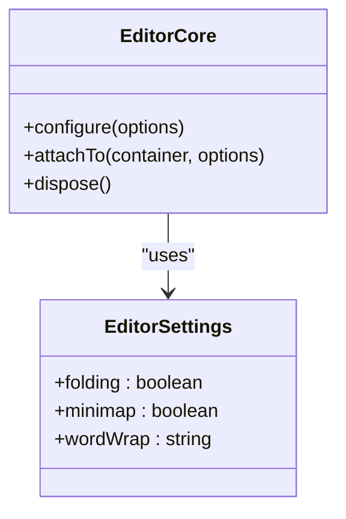
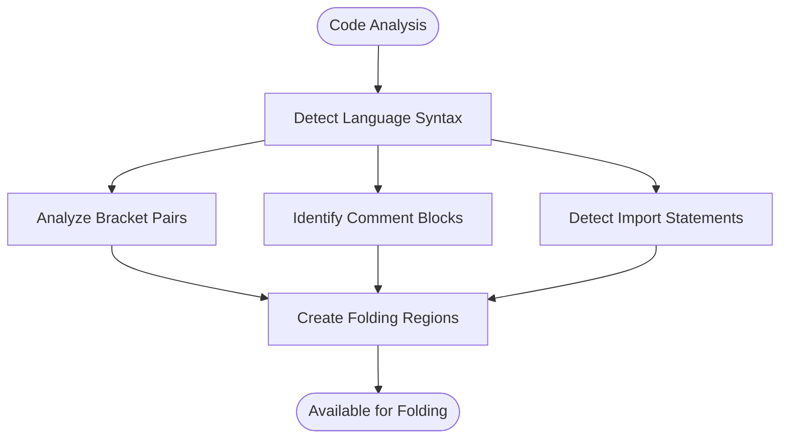
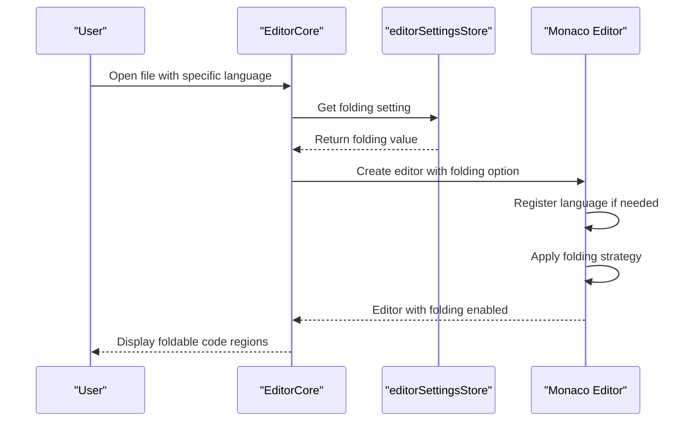
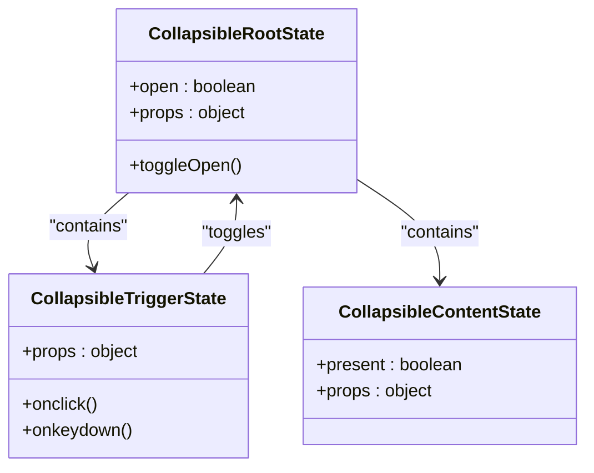
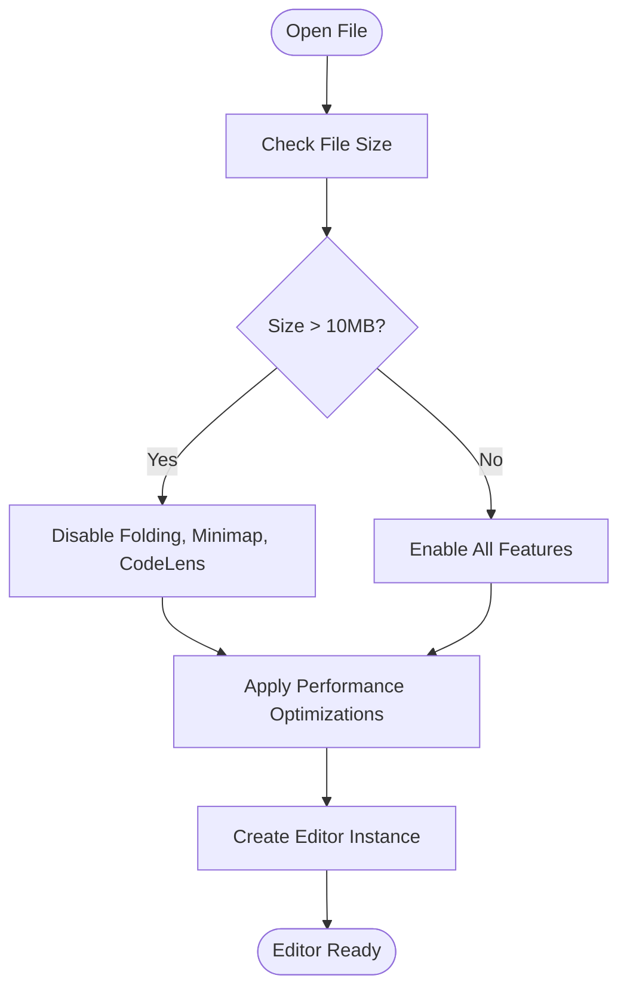

# Code Folding

<cite>
**Referenced Files in This Document**   
- [EditorCore.ts](file://src/lib/editor/EditorCore.ts)
- [editorSettingsStore.ts](file://src/lib/stores/editorSettingsStore.ts)
- [registry.ts](file://src/lib/settings/registry.ts)
- [fileValidator.ts](file://src/lib/utils/fileValidator.ts)
- [collapsible.svelte.ts](file://tp/bits-ui/packages/bits-ui/src/lib/bits/collapsible/collapsible.svelte.ts)
</cite>

## Table of Contents

1. [Introduction](#introduction)
2. [Code Folding Implementation](#code-folding-implementation)
3. [Language-Specific Syntax Rules](#language-specific-syntax-rules)
4. [Folding Provider Registration and Configuration](#folding-provider-registration-and-configuration)
5. [User Interface for Code Folding](#user-interface-for-code-folding)
6. [Keyboard Shortcuts and Mouse Interactions](#keyboard-shortcuts-and-mouse-interactions)
7. [Performance Considerations](#performance-considerations)
8. [Troubleshooting Common Issues](#troubleshooting-common-issues)
9. [Conclusion](#conclusion)

## Introduction

Code folding is a powerful feature in the NC code editor that allows users to collapse and expand sections of code to improve navigation and organization within large files. This documentation provides a comprehensive overview of how code folding works in the NC editor, including its implementation based on language-specific syntax rules, configuration options, user interface elements, and performance optimizations. The goal is to make this feature accessible to beginners while providing technical details for developers who want to customize folding behavior for specific programming languages.

## Code Folding Implementation

The code folding feature in the NC editor is implemented using the Monaco Editor's built-in folding capabilities. The implementation is configured through the `EditorCore` class, which manages the editor's options and behavior. Folding is enabled by default and can be controlled through editor settings.

The folding functionality is initialized in the `EditorCore` class with specific options to optimize performance and user experience. The folding strategy is set to 'indentation' for faster processing, especially in large files. This approach analyzes the indentation levels of code lines to determine foldable regions rather than relying on language-specific syntax parsing, which can be more resource-intensive.



**Diagram sources**

- [EditorCore.ts](file://src/lib/editor/EditorCore.ts#L381)
- [editorSettingsStore.ts](file://src/lib/stores/editorSettingsStore.ts#L24)

**Section sources**

- [EditorCore.ts](file://src/lib/editor/EditorCore.ts#L380-L386)
- [editorSettingsStore.ts](file://src/lib/stores/editorSettingsStore.ts#L24)

## Language-Specific Syntax Rules

The NC editor implements code folding based on language-specific syntax rules for various programming languages. The folding behavior is determined by the language identifier and its associated syntax elements such as brackets, comments, and imports.

For languages like TypeScript, JavaScript, JSON, HTML, CSS, and Markdown, the editor uses Monaco's built-in language support which automatically detects foldable regions based on syntax elements. For other languages like Rust, Python, and TOML, the editor dynamically imports language-specific grammars to enable proper syntax highlighting and folding.

The language mapping is handled by the `mapLanguageIdToMonaco` function, which translates internal language identifiers to Monaco language IDs. This ensures consistent folding behavior across different file types. For example, files with the `.rs` extension are mapped to the 'rust' language ID, enabling proper folding of Rust code blocks based on curly braces and comment blocks.

The folding mechanism identifies regions based on:

- Bracket pairs (curly braces, parentheses, square brackets)
- Comment blocks (both single-line and multi-line comments)
- Import/require statements
- Function and class definitions
- Control flow blocks (if, for, while, etc.)



**Diagram sources**

- [languageSupport.ts](file://src/lib/editor/languageSupport.ts#L9-L27)
- [intellisense.ts](file://src/lib/editor/intellisense.ts#L124-L140)

**Section sources**

- [languageSupport.ts](file://src/lib/editor/languageSupport.ts#L9-L27)
- [intellisense.ts](file://src/lib/editor/intellisense.ts#L124-L140)

## Folding Provider Registration and Configuration

Folding providers in the NC editor are registered and configured through the Monaco Editor's language support system. The registration process is managed by the `EditorCore` class, which handles the initialization of language-specific features including folding.

The folding configuration is controlled through the editor settings system, which provides a centralized way to manage editor options. The `editorSettingsStore` contains the folding option as a boolean value that determines whether code folding is enabled or disabled. This setting is exposed in the editor's UI settings panel, allowing users to toggle folding on or off.

When a new language is encountered, the editor checks if it has been registered and, if not, dynamically imports the appropriate language grammar. This lazy-loading approach ensures that only the necessary language features are loaded, improving startup performance. The `ensureLanguageRegistered` function handles this process, importing language-specific modules from Monaco's basic-languages package.

The folding strategy can be configured in the editor options. By default, the NC editor uses the 'indentation' strategy, which is faster than the language-based strategy but may not be as accurate for all languages. This configuration is set in the `EditorCore` class when creating the editor instance.



**Diagram sources**

- [EditorCore.ts](file://src/lib/editor/EditorCore.ts#L652-L666)
- [registry.ts](file://src/lib/settings/registry.ts#L344-L355)
- [editorSettingsStore.ts](file://src/lib/stores/editorSettingsStore.ts#L126-L128)

**Section sources**

- [EditorCore.ts](file://src/lib/editor/EditorCore.ts#L652-L666)
- [registry.ts](file://src/lib/settings/registry.ts#L344-L355)

## User Interface for Code Folding

The user interface for code folding in the NC editor provides visual indicators and interactive elements that allow users to easily collapse and expand code regions. The folding controls are displayed in the editor's gutter area, to the left of the line numbers.

When a foldable code region is detected, a small triangular icon appears in the gutter. This icon serves as the toggle button for folding and unfolding the code block. When the code is expanded, the triangle points downward (▼), and when the code is collapsed, the triangle points to the right (▶). This visual feedback helps users quickly identify the current state of each foldable region.

The folding UI is implemented using the Collapsible component from the bits-ui library, which provides accessible and keyboard-navigable controls. The component manages the open/closed state of foldable regions and handles user interactions through mouse clicks and keyboard events.

For accessibility, the folding controls include appropriate ARIA attributes such as `aria-expanded` to indicate the current state of the foldable region. This ensures that screen readers can properly convey the state of folded code blocks to visually impaired users.



**Diagram sources**

- [collapsible.svelte.ts](file://tp/bits-ui/packages/bits-ui/src/lib/bits/collapsible/collapsible.svelte.ts#L54-L277)
- [EditorCore.ts](file://src/lib/editor/EditorCore.ts#L469)

**Section sources**

- [collapsible.svelte.ts](file://tp/bits-ui/packages/bits-ui/src/lib/bits/collapsible/collapsible.svelte.ts#L54-L277)
- [EditorCore.ts](file://src/lib/editor/EditorCore.ts#L469)

## Keyboard Shortcuts and Mouse Interactions

The NC editor provides multiple ways to interact with code folding regions through both mouse and keyboard inputs. These interactions are designed to be intuitive and efficient, allowing users to quickly navigate and organize their code.

Mouse interactions with folding regions are straightforward:

- Clicking on the triangular fold icon in the gutter toggles the fold state of the associated code block
- Double-clicking on a foldable region expands or collapses all nested folds within that region
- Hovering over a collapsed region displays a tooltip with a preview of the hidden code

Keyboard shortcuts provide alternative ways to control code folding:

- `Ctrl+Shift+[` collapses the current code block
- `Ctrl+Shift+]` expands the current code block
- `Ctrl+Shift+NumPad -` collapses all regions at the current level
- `Ctrl+Shift+NumPad +` expands all regions at the current level
- `Ctrl+Alt+[` collapses all foldable regions in the document
- `Ctrl+Alt+]` expands all foldable regions in the document

These keyboard shortcuts follow common conventions used in other code editors, making them familiar to users who have experience with similar tools. The shortcuts can be customized through the editor's settings if needed.

The keyboard interaction is handled by the Collapsible component's `onkeydown` method, which listens for specific key events (Space and Enter) and triggers the appropriate folding action. This ensures that users can navigate and control folding regions using only the keyboard, which is important for accessibility and power users who prefer keyboard-driven workflows.

```mermaid
flowchart TD
Start([User Input]) --> InputType{"Input Type?"}
InputType --> |Mouse| MouseInteraction["Handle Mouse Click/Double-click"]
InputType --> |Keyboard| KeyboardInteraction["Process Keyboard Shortcut"]
MouseInteraction --> ToggleState["Toggle Fold State"]
KeyboardInteraction --> CheckShortcut{"Which Shortcut?"}
CheckShortcut --> |Ctrl+Shift+[| CollapseCurrent["Collapse Current Block"]
CheckShortcut --> |Ctrl+Shift+]| ExpandCurrent["Expand Current Block"]
CheckShortcut --> |Ctrl+Shift+NumPad -| CollapseLevel["Collapse All at Level"]
CheckShortcut --> |Ctrl+Shift+NumPad +| ExpandLevel["Expand All at Level"]
CheckShortcut --> |Ctrl+Alt+[| CollapseAll["Collapse All Regions"]
CheckShortcut --> |Ctrl+Alt+]| ExpandAll["Expand All Regions"]
CollapseCurrent --> UpdateUI["Update UI and State"]
ExpandCurrent --> UpdateUI
CollapseLevel --> UpdateUI
ExpandLevel --> UpdateUI
CollapseAll --> UpdateUI
ExpandAll --> UpdateUI
UpdateUI --> End([Code Folded/Unfolded])
```

**Diagram sources**

- [collapsible.svelte.ts](file://tp/bits-ui/packages/bits-ui/src/lib/bits/collapsible/collapsible.svelte.ts#L245-L258)
- [EditorCore.ts](file://src/lib/editor/EditorCore.ts#L469)

**Section sources**

- [collapsible.svelte.ts](file://tp/bits-ui/packages/bits-ui/src/lib/bits/collapsible/collapsible.svelte.ts#L245-L258)

## Performance Considerations

The NC editor implements several performance optimizations for code folding, particularly when dealing with large files. These optimizations ensure that the editor remains responsive and doesn't consume excessive system resources when handling complex codebases.

One key optimization is the automatic disabling of folding for very large files (greater than 10MB). The `fileValidator` module checks the file size before opening it in the editor, and if the file exceeds the threshold, it disables folding along with other resource-intensive features like the minimap, code lens, and links. This prevents performance degradation when working with large files that might have thousands of foldable regions.



The editor also uses the 'indentation' folding strategy by default, which is faster than the language-based strategy. This approach analyzes the indentation levels of code lines to determine foldable regions rather than parsing the entire syntax tree, resulting in better performance especially for large files.

Additional performance optimizations include:

- Disabling smooth scrolling and cursor animations
- Limiting the minimap width to 80 characters
- Setting a short delay (10ms) for quick suggestions
- Disabling character rendering in the minimap

These optimizations are particularly important for maintaining a smooth user experience when working with large code files where folding can significantly improve navigation and code organization.

**Diagram sources**

- [fileValidator.ts](file://src/lib/utils/fileValidator.ts#L72-L84)
- [EditorCore.ts](file://src/lib/editor/EditorCore.ts#L371-L378)

**Section sources**

- [fileValidator.ts](file://src/lib/utils/fileValidator.ts#L72-L84)
- [EditorCore.ts](file://src/lib/editor/EditorCore.ts#L371-L378)

## Troubleshooting Common Issues

Users may encounter several common issues with code folding in the NC editor. This section addresses these problems and provides solutions to help users resolve them.

### Incorrect Folding Ranges

Sometimes, the editor may not detect foldable regions correctly, resulting in incorrect folding ranges. This can happen when:

- The language mode is not properly set for the file
- The file has syntax errors that prevent proper parsing
- The folding strategy is not appropriate for the language

**Solutions:**

- Ensure the correct language mode is selected for the file
- Fix any syntax errors in the code
- Try switching between 'indentation' and 'auto' folding strategies in the editor settings

### Performance Problems with Large Files

Large files may experience performance issues when folding is enabled, such as lag when expanding/collapsing regions or high memory usage.

**Solutions:**

- The editor automatically disables folding for files larger than 10MB, but users can manually disable folding in the settings
- Close other tabs to free up system resources
- Restart the editor if performance degrades significantly

### Folding Controls Not Visible

In some cases, the folding controls (triangular icons) may not appear in the gutter.

**Solutions:**

- Check if folding is enabled in the editor settings
- Verify that the file type is supported for folding
- Reload the editor or restart the application

### Keyboard Shortcuts Not Working

If keyboard shortcuts for folding are not working, it may be due to:

- Conflicting keybindings with other extensions or system shortcuts
- Focus issues where the editor doesn't have keyboard focus

**Solutions:**

- Check the keybinding settings to ensure folding shortcuts are properly assigned
- Make sure the editor has focus before using keyboard shortcuts
- Try using the mouse to fold/unfold as a temporary workaround

### Nested Folding Issues

Complex nested code structures may not fold/unfold correctly, with inner regions not responding as expected.

**Solutions:**

- Use the "Fold All" and "Unfold All" commands to reset the folding state
- Manually expand parent regions before working with nested ones
- Consider restructuring deeply nested code into smaller functions or modules

These issues are typically resolved by ensuring proper configuration and understanding of the folding system. The NC editor's implementation follows standard Monaco Editor patterns, so users familiar with other Monaco-based editors should find the behavior consistent.

**Section sources**

- [fileValidator.ts](file://src/lib/utils/fileValidator.ts#L72-L84)
- [EditorCore.ts](file://src/lib/editor/EditorCore.ts#L381)
- [editorSettingsStore.ts](file://src/lib/stores/editorSettingsStore.ts#L126-L128)

## Conclusion

The code folding feature in the NC editor provides a powerful way to navigate and organize code, particularly in large files. Implemented using Monaco Editor's robust folding capabilities, the feature supports language-specific syntax rules for accurate detection of foldable regions across various programming languages.

The folding system is highly configurable through editor settings, allowing users to enable or disable folding based on their preferences and performance requirements. The user interface provides clear visual indicators and intuitive controls for collapsing and expanding code regions, with support for both mouse and keyboard interactions.

Performance optimizations ensure that the editor remains responsive even with large files, automatically disabling folding and other resource-intensive features when necessary. The implementation follows accessibility best practices with proper ARIA attributes and keyboard navigation support.

For developers looking to customize folding behavior, the architecture provides clear extension points through the language support system and editor configuration options. The modular design allows for adding support for additional languages and custom folding rules as needed.

Overall, the code folding feature in the NC editor enhances productivity by allowing users to focus on relevant sections of code, reduce visual clutter, and better understand the structure of complex codebases.
