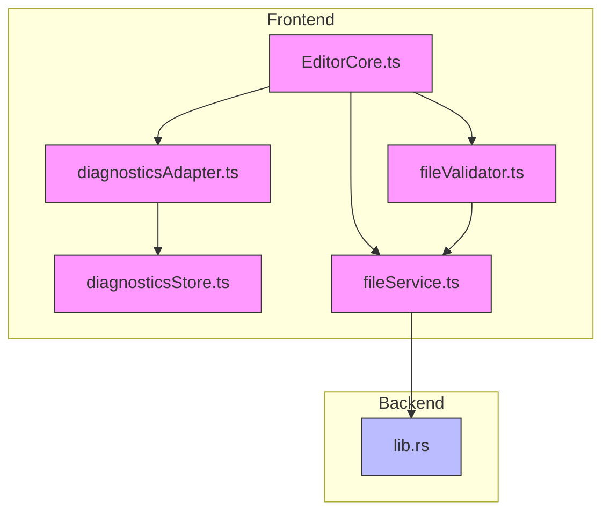
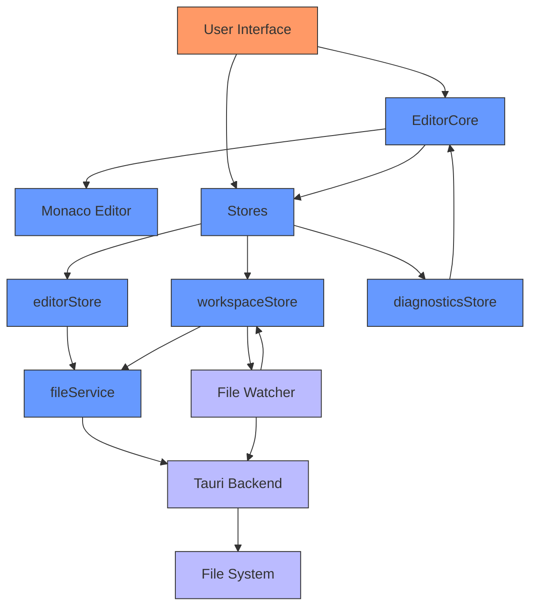
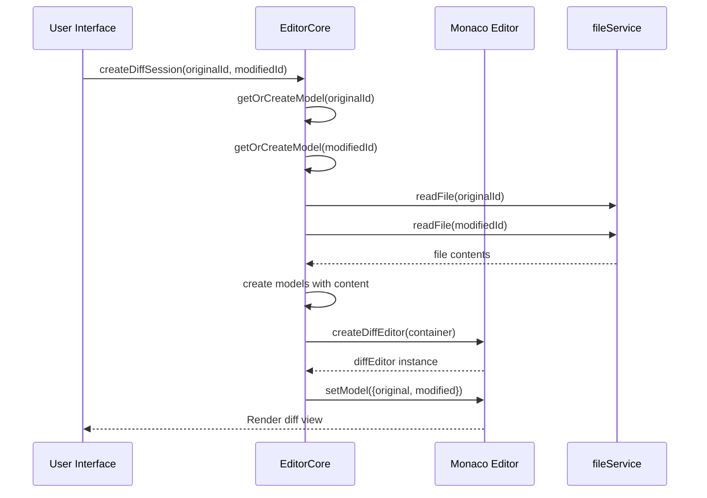
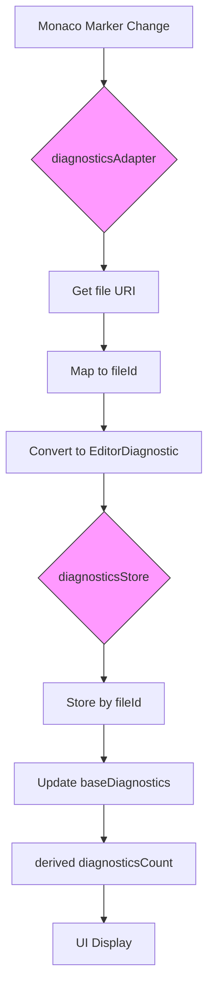
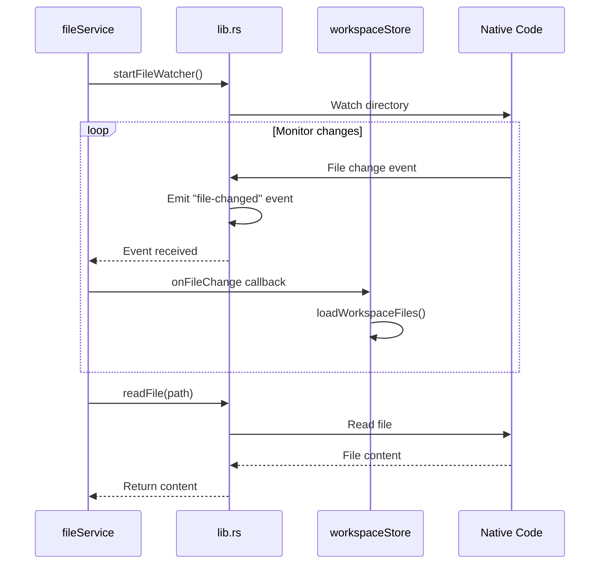
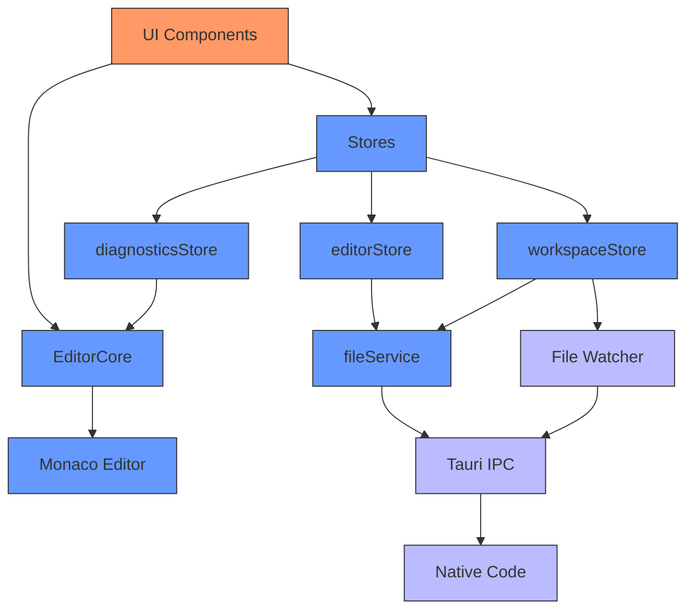

# Diff Editor

<cite>
**Referenced Files in This Document**   
- [EditorCore.ts](file://src/lib/editor/EditorCore.ts)
- [diagnosticsStore.ts](file://src/lib/stores/diagnosticsStore.ts)
- [diagnosticsAdapter.ts](file://src/lib/editor/diagnosticsAdapter.ts)
- [fileService.ts](file://src/lib/services/fileService.ts)
- [fileValidator.ts](file://src/lib/utils/fileValidator.ts)
- [workspaceStore.ts](file://src/lib/stores/workspaceStore.ts)
- [lib.rs](file://src-tauri/src/lib.rs)
</cite>

## Table of Contents

1. [Introduction](#introduction)
2. [Project Structure](#project-structure)
3. [Core Components](#core-components)
4. [Architecture Overview](#architecture-overview)
5. [Detailed Component Analysis](#detailed-component-analysis)
6. [Dependency Analysis](#dependency-analysis)
7. [Performance Considerations](#performance-considerations)
8. [Troubleshooting Guide](#troubleshooting-guide)
9. [Conclusion](#conclusion)

## Introduction

The diff editor feature in the NC code editor provides a side-by-side comparison of file versions, highlighting additions, deletions, and modifications. This document explains the implementation of the diff editor, its integration with the file system watcher for change detection, and its connection to the diagnostics system for code quality comparison. The diff editor supports common use cases such as comparing local changes with repository versions and reviewing pull requests. User interface elements enable navigation through differences, accepting or rejecting changes, and synchronized scrolling between panes. The system addresses performance challenges with large files and handles binary files appropriately. This documentation serves both beginners seeking to understand the feature and developers looking to extend its functionality.

## Project Structure

The NC code editor's project structure reveals a well-organized architecture with distinct layers for editor functionality, stores, services, and UI components. The diff editor functionality is primarily implemented in the `src/lib/editor` directory, with supporting components in stores and services. The core diff functionality is managed by `EditorCore.ts`, while diagnostics integration is handled by `diagnosticsStore.ts` and `diagnosticsAdapter.ts`. File system operations are abstracted through `fileService.ts`, and workspace management is coordinated by `workspaceStore.ts`. The Tauri backend in `src-tauri` provides file watching capabilities essential for the diff editor's real-time change detection.

**Diagram sources**

- [EditorCore.ts](file://src/lib/editor/EditorCore.ts)
- [diagnosticsAdapter.ts](file://src/lib/editor/diagnosticsAdapter.ts)
- [diagnosticsStore.ts](file://src/lib/stores/diagnosticsStore.ts)
- [fileService.ts](file://src/lib/services/fileService.ts)
- [fileValidator.ts](file://src/lib/utils/fileValidator.ts)
- [lib.rs](file://src-tauri/src/lib.rs)

**Section sources**

- [EditorCore.ts](file://src/lib/editor/EditorCore.ts)
- [diagnosticsStore.ts](file://src/lib/stores/diagnosticsStore.ts)
- [diagnosticsAdapter.ts](file://src/lib/editor/diagnosticsAdapter.ts)
- [fileService.ts](file://src/lib/services/fileService.ts)
- [fileValidator.ts](file://src/lib/utils/fileValidator.ts)
- [workspaceStore.ts](file://src/lib/stores/workspaceStore.ts)
- [lib.rs](file://src-tauri/src/lib.rs)

## Core Components

The diff editor's core functionality is implemented in `EditorCore.ts`, which provides the `createDiffSession` method for creating side-by-side comparisons between file versions. This method leverages Monaco Editor's built-in diff editor capabilities, creating models for both the original and modified versions of a file. The diff editor is configured with options such as side-by-side rendering, read-only status for the original file, and whitespace handling. The implementation maintains references to both file models and manages the diff editor lifecycle through mount, update, and dispose operations.

The diagnostics integration is handled through a coordinated system between `diagnosticsAdapter.ts` and `diagnosticsStore.ts`. The adapter subscribes to Monaco's marker change events and translates them into the application's diagnostic format, while the store aggregates these diagnostics for display in the UI. This separation of concerns allows the diff editor to display code quality differences between file versions, highlighting not just syntactic changes but also potential issues in the modified code.

File operations are abstracted through `fileService.ts`, which provides a clean interface for reading, writing, and monitoring files. This service integrates with the Tauri backend to perform actual file system operations, enabling the diff editor to access both current and previous versions of files for comparison.

**Section sources**

- [EditorCore.ts](file://src/lib/editor/EditorCore.ts)
- [diagnosticsStore.ts](file://src/lib/stores/diagnosticsStore.ts)
- [diagnosticsAdapter.ts](file://src/lib/editor/diagnosticsAdapter.ts)
- [fileService.ts](file://src/lib/services/fileService.ts)

## Architecture Overview

The diff editor architecture follows a layered approach with clear separation of concerns between the UI, business logic, and data access layers. At the foundation is the Monaco Editor, which provides the core diff visualization and editing capabilities. The `EditorCore` class serves as a wrapper around Monaco, exposing a simplified API for creating and managing diff sessions. This abstraction allows the application to maintain control over editor configuration and lifecycle while leveraging Monaco's powerful diff algorithms.

Above the editor core, the store system manages application state, including active editor tabs, workspace files, and diagnostics information. The `editorStore` tracks open files and their dirty state, while the `workspaceStore` maintains the file system hierarchy and integrates with the file watcher. The `diagnosticsStore` aggregates code quality information from both file versions being compared, enabling side-by-side analysis of potential issues.

The service layer, represented by `fileService`, provides a consistent interface for file operations regardless of the underlying platform. This service communicates with the Tauri backend through IPC calls, ensuring that file operations are performed securely and efficiently. The file watcher in the Tauri backend detects changes to files in the workspace, triggering updates in the UI and enabling real-time diff functionality.

**Diagram sources**

- [EditorCore.ts](file://src/lib/editor/EditorCore.ts)
- [editorStore.ts](file://src/lib/stores/editorStore.ts)
- [workspaceStore.ts](file://src/lib/stores/workspaceStore.ts)
- [diagnosticsStore.ts](file://src/lib/stores/diagnosticsStore.ts)
- [fileService.ts](file://src/lib/services/fileService.ts)
- [lib.rs](file://src-tauri/src/lib.rs)

## Detailed Component Analysis

### Diff Editor Implementation

The diff editor is implemented through the `createDiffSession` method in `EditorCore.ts`, which creates a standalone diff editor instance for comparing two file versions. The method accepts parameters specifying the original and modified file IDs, along with optional configuration for the diff display. When mounted, the diff editor creates models for both files and configures the Monaco diff editor with appropriate options.

The implementation handles several key aspects of the diff experience:

- Side-by-side rendering with synchronized scrolling
- Read-only status for the original file (configurable)
- Whitespace handling options
- Responsive layout with automatic resizing
- Integration with the editor's theme and font settings

The diff editor maintains references to both file models, allowing for updates when the underlying content changes. The mount method creates the diff editor instance and sets up the models, while the updateOptions method allows dynamic changes to the diff display configuration. The dispose method ensures proper cleanup of resources when the diff session is no longer needed.

**Diagram sources**

- [EditorCore.ts](file://src/lib/editor/EditorCore.ts)
- [fileService.ts](file://src/lib/services/fileService.ts)

**Section sources**

- [EditorCore.ts](file://src/lib/editor/EditorCore.ts)

### Diagnostics Integration

The diff editor integrates with the diagnostics system to show differences in code quality between file versions. This integration is achieved through the `diagnosticsAdapter.ts` and `diagnosticsStore.ts` components, which work together to collect, process, and display diagnostic information.

The `attachDiagnosticsTracking` function in `diagnosticsAdapter.ts` subscribes to Monaco's marker change events, capturing diagnostic information (errors, warnings, etc.) for each file. When markers change, the adapter retrieves the corresponding file ID and translates the Monaco markers into the application's diagnostic format. These diagnostics are then passed to the `updateDiagnosticsForFile` function in `diagnosticsStore.ts`, which stores them by file ID and updates the aggregated diagnostics count.

The `diagnosticsStore` uses a derived store to provide real-time diagnostics information for the active editor. This allows the UI to display the number of errors and warnings in the current file, even when viewing a diff. In the diff context, this enables users to see not only the syntactic changes between versions but also how code quality has improved or deteriorated.

**Diagram sources**

- [diagnosticsAdapter.ts](file://src/lib/editor/diagnosticsAdapter.ts)
- [diagnosticsStore.ts](file://src/lib/stores/diagnosticsStore.ts)

**Section sources**

- [diagnosticsAdapter.ts](file://src/lib/editor/diagnosticsAdapter.ts)
- [diagnosticsStore.ts](file://src/lib/stores/diagnosticsStore.ts)

### File System Integration

The diff editor's integration with the file system is facilitated by `fileService.ts` and the Tauri backend in `lib.rs`. The file service provides a clean, promise-based API for file operations, abstracting the underlying IPC communication with the backend.

Key file operations relevant to the diff editor include:

- Reading file contents for both original and modified versions
- Monitoring file changes through event listeners
- Managing the workspace file hierarchy

The file watcher implementation in `lib.rs` uses the notify crate to monitor the workspace directory for changes. When a file is modified, the backend emits a "file-changed" event that propagates through the application. The `workspaceStore` listens for these events and triggers a refresh of the workspace files, ensuring that the diff editor always has access to the most current file versions.

The `fileValidator.ts` utility provides additional functionality for handling edge cases such as large files and binary files. Before opening a file in the diff editor, the validator checks the file size and content type, applying appropriate optimizations or preventing opening altogether if necessary.

**Diagram sources**

- [fileService.ts](file://src/lib/services/fileService.ts)
- [lib.rs](file://src-tauri/src/lib.rs)
- [workspaceStore.ts](file://src/lib/stores/workspaceStore.ts)

**Section sources**

- [fileService.ts](file://src/lib/services/fileService.ts)
- [lib.rs](file://src-tauri/src/lib.rs)
- [workspaceStore.ts](file://src/lib/stores/workspaceStore.ts)

## Dependency Analysis

The diff editor feature has a well-defined dependency graph that follows the dependency inversion principle. The highest-level component, `EditorCore`, depends on the Monaco Editor API but provides a simplified interface to the rest of the application. This abstraction allows the UI components to interact with the diff editor without direct knowledge of Monaco's complex API.

The store system has dependencies that flow inward, with UI components depending on stores, but stores not depending on UI. The `diagnosticsStore` depends on the `editorStore` to determine the active editor, while the `workspaceStore` depends on `fileService` for file operations. This unidirectional data flow ensures that state management remains predictable and testable.

The service layer is designed to be independent of both UI and business logic, providing a clean interface for data access. `fileService` depends on the Tauri invoke API but presents a simple promise-based interface to the rest of the application. This separation allows for easier testing and potential replacement of the backend implementation.

External dependencies are minimized and carefully selected. The application relies on Monaco Editor for the core editing and diff functionality, Tauri for cross-platform capabilities, and Svelte for the UI framework. These dependencies are well-established and actively maintained, reducing the risk of compatibility issues.

**Diagram sources**

- [EditorCore.ts](file://src/lib/editor/EditorCore.ts)
- [editorStore.ts](file://src/lib/stores/editorStore.ts)
- [workspaceStore.ts](file://src/lib/stores/workspaceStore.ts)
- [diagnosticsStore.ts](file://src/lib/stores/diagnosticsStore.ts)
- [fileService.ts](file://src/lib/services/fileService.ts)
- [lib.rs](file://src-tauri/src/lib.rs)

**Section sources**

- [EditorCore.ts](file://src/lib/editor/EditorCore.ts)
- [editorStore.ts](file://src/lib/stores/editorStore.ts)
- [workspaceStore.ts](file://src/lib/stores/workspaceStore.ts)
- [diagnosticsStore.ts](file://src/lib/stores/diagnosticsStore.ts)
- [fileService.ts](file://src/lib/services/fileService.ts)
- [lib.rs](file://src-tauri/src/lib.rs)

## Performance Considerations

The diff editor implementation includes several performance optimizations to handle large files and maintain responsiveness. The `fileValidator.ts` utility implements size-based optimizations, automatically disabling resource-intensive features for files larger than 10MB. These optimizations include:

- Disabling the minimap
- Disabling code folding
- Disabling code lenses
- Disabling link detection

For files larger than 50MB, the editor prevents opening entirely to avoid memory issues and maintain application stability. The validator uses a heuristic approach to detect binary files by checking for null bytes and high proportions of non-ASCII characters, preventing the editor from attempting to display non-text content.

The diff algorithm itself is optimized through Monaco Editor's implementation, which uses efficient algorithms to compute differences between file versions. The editor only processes visible content, using virtualization to avoid loading the entire file into memory at once. This approach ensures that even with large files, the diff editor remains responsive and doesn't consume excessive memory.

The file watching system is designed to be efficient by using the operating system's native file watching capabilities through the notify crate. This approach minimizes CPU usage compared to polling-based solutions. The system also batches file change events to prevent excessive UI updates when multiple files are modified simultaneously.

**Section sources**

- [fileValidator.ts](file://src/lib/utils/fileValidator.ts)
- [EditorCore.ts](file://src/lib/editor/EditorCore.ts)
- [lib.rs](file://src-tauri/src/lib.rs)

## Troubleshooting Guide

When encountering issues with the diff editor, consider the following common problems and solutions:

**Diff view not updating with file changes:**

- Ensure the file watcher is properly initialized by checking that `startFileWatcher()` has been called
- Verify that the workspace root is correctly set in `fileService`
- Check that the `onFileChange` listener is properly subscribed in `workspaceStore`

**Performance issues with large files:**

- Confirm that the file size is below the 50MB limit
- Check that optimizations for large files (minimap disabled, etc.) are being applied
- Ensure that binary files are not being opened in the text editor

**Diagnostics not showing in diff view:**

- Verify that `attachDiagnosticsTracking()` has been called to connect the adapter to Monaco
- Check that the `updateDiagnosticsForFile()` function is being called with correct file IDs
- Ensure that the diagnostics store is properly initialized with `initDiagnosticsTracking()`

**Side-by-side view not rendering correctly:**

- Confirm that the container element has sufficient dimensions
- Check that the `renderSideBySide` option is set to true
- Verify that both original and modified file models have been properly created

**File not found errors in diff:**

- Ensure that file paths are correctly resolved using `resolvePath()` in `workspaceStore`
- Verify that the file service can access the files through the Tauri backend
- Check that the file IDs used in the diff session match those in the workspace

**Section sources**

- [fileService.ts](file://src/lib/services/fileService.ts)
- [workspaceStore.ts](file://src/lib/stores/workspaceStore.ts)
- [diagnosticsAdapter.ts](file://src/lib/editor/diagnosticsAdapter.ts)
- [EditorCore.ts](file://src/lib/editor/EditorCore.ts)
- [fileValidator.ts](file://src/lib/utils/fileValidator.ts)

## Conclusion

The diff editor in the NC code editor provides a robust solution for comparing file versions with comprehensive integration with the file system and diagnostics systems. By leveraging Monaco Editor's powerful diff capabilities and implementing a clean, layered architecture, the feature delivers a responsive and intuitive user experience. The system handles edge cases such as large files and binary content appropriately, ensuring stability across various use cases.

The implementation demonstrates good software engineering practices with clear separation of concerns, unidirectional data flow, and appropriate abstractions. The use of stores for state management and services for data access creates a maintainable architecture that can be extended with additional features as needed.

For developers looking to extend the diff editor functionality, the well-defined interfaces and modular design make it straightforward to add new features such as inline editing of differences, more sophisticated merge conflict resolution, or integration with version control systems. The existing architecture provides a solid foundation for future enhancements while maintaining performance and usability.
